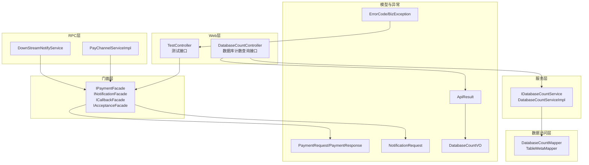
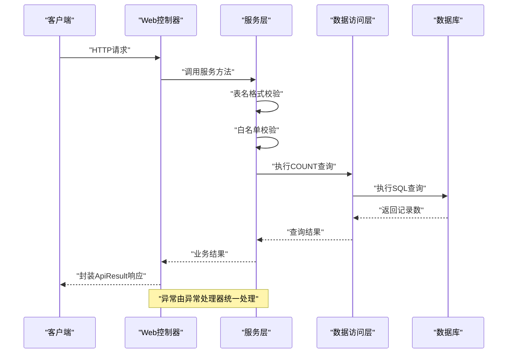
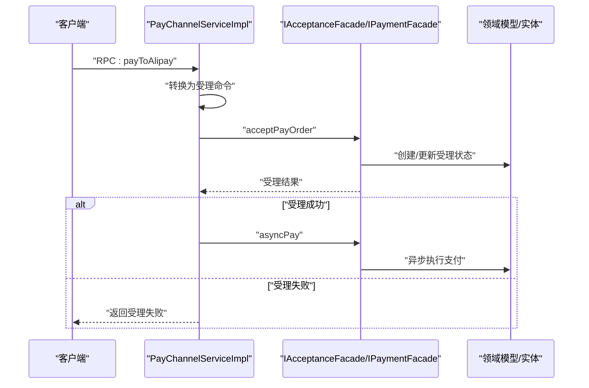
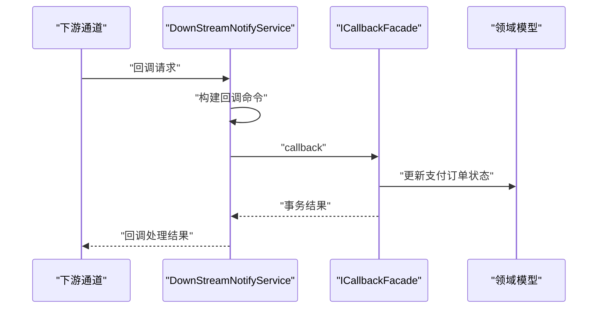
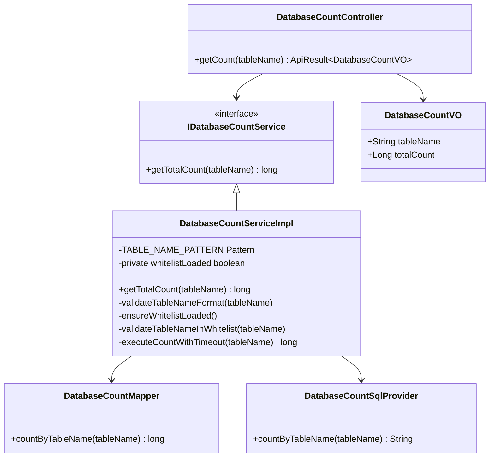
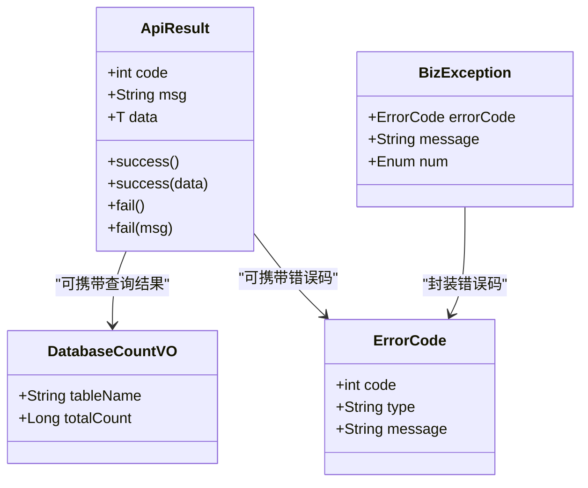
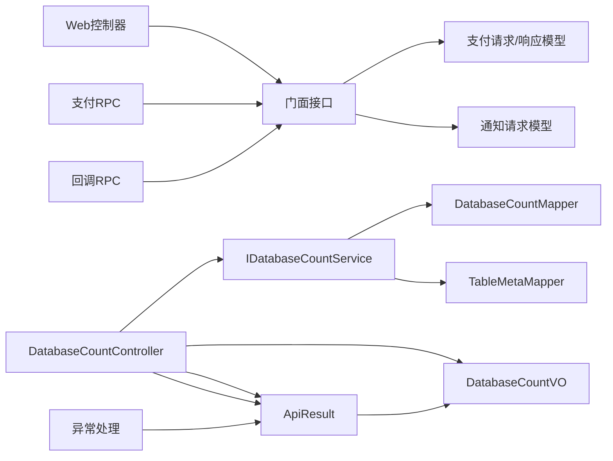

# API接口文档

<cite>
**本文引用的文件**
- [TestController.java](file://biz-service-impl/src/main/java/com/magicliang/transaction/sys/biz/service/impl/web/controller/TestController.java)
- [DatabaseCountController.java](file://biz-service-impl/src/main/java/com/magicliang/transaction/sys/biz/service/impl/web/controller/DatabaseCountController.java)
- [DatabaseCountVO.java](file://biz-service-impl/src/main/java/com/magicliang/transaction/sys/biz/service/impl/web/model/vo/DatabaseCountVO.java)
- [ApiResult.java](file://biz-service-impl/src/main/java/com/magicliang/transaction/sys/biz/service/impl/web/model/vo/ApiResult.java)
- [RestExceptionHandler.java](file://biz-service-impl/src/main/java/com/magicliang/transaction/sys/biz/service/impl/web/advice/RestExceptionHandler.java)
- [InnerApiAuthenticator.java](file://biz-service-impl/src/main/java/com/magicliang/transaction/sys/biz/service/impl/web/interceptor/InnerApiAuthenticator.java)
- [IDatabaseCountService.java](file://core-service/src/main/java/com/magicliang/transaction/sys/core/service/IDatabaseCountService.java)
- [DatabaseCountServiceImpl.java](file://core-service/src/main/java/com/magicliang/transaction/sys/core/service/impl/DatabaseCountServiceImpl.java)
- [DatabaseCountMapper.java](file://common-dal/src/main/java/com/magicliang/transaction/sys/common/dal/mybatis/mapper/DatabaseCountMapper.java)
- [DatabaseCountSqlProvider.java](file://common-dal/src/main/java/com/magicliang/transaction/sys/common/dal/mybatis/mapper/DatabaseCountSqlProvider.java)
- [TableMetaMapper.java](file://common-dal/src/main/java/com/magicliang/transaction/sys/common/dal/mybatis/mapper/TableMetaMapper.java)
- [IPaymentFacade.java](file://biz-service-impl/src/main/java/com/magicliang/transaction/sys/biz/service/impl/facade/IPaymentFacade.java)
- [INotificationFacade.java](file://biz-service-impl/src/main/java/com/magicliang/transaction/sys/biz/service/impl/facade/INotificationFacade.java)
- [ICallbackFacade.java](file://biz-service-impl/src/main/java/com/magicliang/transaction/sys/biz/service/impl/facade/ICallbackFacade.java)
- [IAcceptanceFacade.java](file://biz-service-impl/src/main/java/com/magicliang/transaction/sys/biz/service/impl/facade/IAcceptanceFacade.java)
- [PayChannelServiceImpl.java](file://biz-service-impl/src/main/java/com/magicliang/transaction/sys/biz/service/impl/rpc/PayChannelServiceImpl.java)
- [DownStreamNotifyService.java](file://biz-service-impl/src/main/java/com/magicliang/transaction/sys/biz/service/impl/rpc/DownStreamNotifyService.java)
- [ErrorCode.java](file://common-util/src/main/java/com/magicliang/transaction/sys/common/constant/ErrorCode.java)
- [BizException.java](file://common-util/src/main/java/com/magicliang/transaction/sys/common/exception/BizException.java)
- [PaymentRequest.java](file://core-model/src/main/java/com/magicliang/transaction/sys/core/model/request/payment/PaymentRequest.java)
- [PaymentResponse.java](file://core-model/src/main/java/com/magicliang/transaction/sys/core/model/response/payment/PaymentResponse.java)
- [NotificationRequest.java](file://core-model/src/main/java/com/magicliang/transaction/sys/core/model/request/notification/NotificationRequest.java)
</cite>

## 更新摘要
**变更内容**
- 新增数据库表计数查询API接口文档
- 添加DatabaseCountController控制器说明
- 添加DatabaseCountVO响应模型说明
- 新增数据库查询服务层架构说明
- 更新架构图以包含数据库查询功能

## 目录
1. [简介](#简介)
2. [项目结构](#项目结构)
3. [核心组件](#核心组件)
4. [架构总览](#架构总览)
5. [详细组件分析](#详细组件分析)
6. [依赖分析](#依赖分析)
7. [性能考虑](#性能考虑)
8. [故障排查指南](#故障排查指南)
9. [结论](#结论)
10. [附录](#附录)

## 简介
本文件为领域驱动交易系统对外暴露的HTTP接口与内部RPC接口的完整API文档。重点覆盖支付受理、支付执行、通知处理、状态查询以及数据库表计数查询等核心能力，提供RESTful API规范（含HTTP方法、URL模式、请求参数与响应格式）、认证授权机制、参数校验规则、错误码定义、测试与调试指南以及客户端集成最佳实践。

## 项目结构
系统采用分层+领域驱动设计，Web层通过控制器暴露HTTP接口，内部通过门面（facade）协调领域活动与策略，RPC层承接下游通道回调与支付入口。新增的数据库查询功能通过专门的控制器和服务层提供。核心模型位于core-model模块，统一了请求/响应契约；公共常量与异常定义在common-util模块。

**图表来源**
- [TestController.java:48-70](file://biz-service-impl/src/main/java/com/magicliang/transaction/sys/biz/service/impl/web/controller/TestController.java#L48-L70)
- [DatabaseCountController.java:13-50](file://biz-service-impl/src/main/java/com/magicliang/transaction/sys/biz/service/impl/web/controller/DatabaseCountController.java#L13-L50)
- [IDatabaseCountService.java:3-19](file://core-service/src/main/java/com/magicliang/transaction/sys/core/service/IDatabaseCountService.java#L3-L19)
- [DatabaseCountServiceImpl.java:17-130](file://core-service/src/main/java/com/magicliang/transaction/sys/core/service/impl/DatabaseCountServiceImpl.java#L17-L130)
- [DatabaseCountMapper.java:6-23](file://common-dal/src/main/java/com/magicliang/transaction/sys/common/dal/mybatis/mapper/DatabaseCountMapper.java#L6-L23)
- [TableMetaMapper.java:7-24](file://common-dal/src/main/java/com/magicliang/transaction/sys/common/dal/mybatis/mapper/TableMetaMapper.java#L7-L24)
- [IPaymentFacade.java:18-57](file://biz-service-impl/src/main/java/com/magicliang/transaction/sys/biz/service/impl/facade/IPaymentFacade.java#L18-L57)
- [INotificationFacade.java:18-42](file://biz-service-impl/src/main/java/com/magicliang/transaction/sys/biz/service/impl/facade/INotificationFacade.java#L18-L42)
- [ICallbackFacade.java:15-24](file://biz-service-impl/src/main/java/com/magicliang/transaction/sys/biz/service/impl/facade/ICallbackFacade.java#L15-L24)
- [IAcceptanceFacade.java:15-24](file://biz-service-impl/src/main/java/com/magicliang/transaction/sys/biz/service/impl/facade/IAcceptanceFacade.java#L15-L24)
- [PayChannelServiceImpl.java:25-68](file://biz-service-impl/src/main/java/com/magicliang/transaction/sys/biz/service/impl/rpc/PayChannelServiceImpl.java#L25-L68)
- [DownStreamNotifyService.java:22-66](file://biz-service-impl/src/main/java/com/magicliang/transaction/sys/biz/service/impl/rpc/DownStreamNotifyService.java#L22-L66)
- [DatabaseCountVO.java:7-34](file://biz-service-impl/src/main/java/com/magicliang/transaction/sys/biz/service/impl/web/model/vo/DatabaseCountVO.java#L7-L34)
- [ApiResult.java:6-87](file://biz-service-impl/src/main/java/com/magicliang/transaction/sys/biz/service/impl/web/model/vo/ApiResult.java#L6-L87)
- [ErrorCode.java:19-45](file://common-util/src/main/java/com/magicliang/transaction/sys/common/constant/ErrorCode.java#L19-L45)
- [BizException.java:18-92](file://common-util/src/main/java/com/magicliang/transaction/sys/common/exception/BizException.java#L18-L92)

**章节来源**
- 同上图表来源

## 核心组件
- Web层控制器：提供HTTP接口入口，包含测试型接口和新增的数据库计数查询接口。
- 门面接口：抽象支付受理、支付执行、通知发送、回调处理等核心能力，屏蔽领域细节。
- 服务层：新增数据库计数查询服务，提供表名白名单校验、格式验证和超时控制。
- 数据访问层：通过MyBatis映射器执行数据库查询，支持安全的SQL构建。
- RPC服务：面向下游通道的支付入口与回调入口，负责协议转换与流程编排。
- 模型与异常：统一请求/响应契约与错误模型，确保接口一致性与可诊断性。

**章节来源**
- 同上图表来源

## 架构总览
系统采用"Web层 → 门面层 → 领域活动/策略 → 数据访问"的分层架构。Web层通过控制器接收HTTP请求，门面层负责编排业务流程，RPC层对接下游通道，服务层处理数据库查询逻辑，数据访问层执行SQL查询。模型与异常提供契约与错误语义。

**图表来源**
- [DatabaseCountController.java:33-48](file://biz-service-impl/src/main/java/com/magicliang/transaction/sys/biz/service/impl/web/controller/DatabaseCountController.java#L33-L48)
- [DatabaseCountServiceImpl.java:60-71](file://core-service/src/main/java/com/magicliang/transaction/sys/core/service/impl/DatabaseCountServiceImpl.java#L60-L71)
- [DatabaseCountMapper.java:20-21](file://common-dal/src/main/java/com/magicliang/transaction/sys/common/dal/mybatis/mapper/DatabaseCountMapper.java#L20-L21)
- [DatabaseCountSqlProvider.java:20-25](file://common-dal/src/main/java/com/magicliang/transaction/sys/common/dal/mybatis/mapper/DatabaseCountSqlProvider.java#L20-L25)

## 详细组件分析

### Web层接口规范
- 接口前缀：/res/v1/test 和 /api/v1/database
- 当前提供测试型接口和新增的数据库计数查询接口。

#### 测试接口
- GET /res/v1/test/hello：返回路径信息，用于连通性测试
- GET /res/v1/test/json：返回JSON并设置Cookie
- GET /res/v1/test/async：异步返回字符串
- GET /res/v1/test/redirect1：重定向到百度
- GET /res/v1/test/redirect2：重定向到百度（字符串方式）
- GET /res/v1/test/multiple-response：根据type返回不同响应类型
- GET /res/v1/test/redirect3：设置多个Cookie并302重定向
- GET /res/v1/test/downloadmultimedia：流式输出多媒体文件

#### 数据库计数查询接口
- GET /api/v1/database/count
  - 功能：查询指定表的总记录数
  - 认证：无需
  - 请求参数：tableName（字符串，必填）
  - 响应：DatabaseCountVO对象封装在ApiResult中
  - 示例：
    - 成功响应：{"code":0,"msg":"success","data":{"tableName":"trans_pay_order","totalCount":1234}}
    - 参数错误：{"code":-1,"msg":"表名格式不合法","data":null}
    - 查询失败：{"code":-1,"msg":"查询失败: 数据库连接异常","data":null}

**章节来源**
- [TestController.java:48-70](file://biz-service-impl/src/main/java/com/magicliang/transaction/sys/biz/service/impl/web/controller/TestController.java#L48-L70)
- [DatabaseCountController.java:27-48](file://biz-service-impl/src/main/java/com/magicliang/transaction/sys/biz/service/impl/web/controller/DatabaseCountController.java#L27-L48)
- [DatabaseCountVO.java:16-32](file://biz-service-impl/src/main/java/com/magicliang/transaction/sys/biz/service/impl/web/model/vo/DatabaseCountVO.java#L16-L32)

### 支付受理与支付执行（RPC/HTTP）
- 支付受理入口（RPC）
  - 服务名：payChannelService
  - 方法：payToAlipay
  - 输入：原始RPC请求对象
  - 处理：转换为受理命令，调用受理门面；若受理成功则异步触发支付门面
  - 输出：RPC响应对象
- 支付执行（门面）
  - 门面：IPaymentFacade
  - 方法：pay、payAndNotify、asyncPay、batchPay
  - 输入：PaymentCommand/UnPaidOrderQuery/List<TransPayOrderEntity>
  - 输出：TransactionModel（包含是否幂等、错误码/消息等）

**图表来源**
- [PayChannelServiceImpl.java:45-67](file://biz-service-impl/src/main/java/com/magicliang/transaction/sys/biz/service/impl/rpc/PayChannelServiceImpl.java#L45-L67)
- [IAcceptanceFacade.java:23-23](file://biz-service-impl/src/main/java/com/magicliang/transaction/sys/biz/service/impl/facade/IAcceptanceFacade.java#L23-L23)
- [IPaymentFacade.java:49-56](file://biz-service-impl/src/main/java/com/magicliang/transaction/sys/biz/service/impl/facade/IPaymentFacade.java#L49-L56)

**章节来源**
- 同上图表来源

### 通知处理（RPC/门面）
- 通知入口（RPC）
  - 服务名：downStreamNotifyService
  - 方法：paymentAgentNotify
  - 输入：回调请求对象
  - 处理：构建回调命令，调用回调门面；记录日志
  - 输出：回调处理结果
- 通知门面
  - 门面：INotificationFacade
  - 方法：notify、batchNotify
  - 输入：NotificationCommand/UnSentNotificationQuery/List<TransPayOrderEntity>
  - 输出：TransactionModel

**图表来源**
- [DownStreamNotifyService.java:46-66](file://biz-service-impl/src/main/java/com/magicliang/transaction/sys/biz/service/impl/rpc/DownStreamNotifyService.java#L46-L66)
- [ICallbackFacade.java:23-23](file://biz-service-impl/src/main/java/com/magicliang/transaction/sys/biz/service/impl/facade/ICallbackFacade.java#L23-L23)
- [INotificationFacade.java:41-41](file://biz-service-impl/src/main/java/com/magicliang/transaction/sys/biz/service/impl/facade/INotificationFacade.java#L41-L41)

**章节来源**
- 同上图表来源

### 数据库计数查询服务
- 控制器：DatabaseCountController
  - 作用：提供RESTful接口查询数据库表记录数
  - 路径：/api/v1/database/count
  - 方法：GET
  - 参数：tableName（必需）
  - 返回：ApiResult<DatabaseCountVO>
- 服务层：DatabaseCountServiceImpl
  - 作用：执行表名校验、白名单检查和COUNT查询
  - 特性：支持表名格式验证、白名单缓存、查询超时控制
- 数据访问层：DatabaseCountMapper/SqlProvider
  - 作用：通过动态SQL执行COUNT查询
  - 安全性：使用SQL构建器防止注入攻击

**图表来源**
- [DatabaseCountController.java:24-48](file://biz-service-impl/src/main/java/com/magicliang/transaction/sys/biz/service/impl/web/controller/DatabaseCountController.java#L24-L48)
- [IDatabaseCountService.java:9-17](file://core-service/src/main/java/com/magicliang/transaction/sys/core/service/IDatabaseCountService.java#L9-L17)
- [DatabaseCountServiceImpl.java:24-129](file://core-service/src/main/java/com/magicliang/transaction/sys/core/service/impl/DatabaseCountServiceImpl.java#L24-L129)
- [DatabaseCountMapper.java:12-21](file://common-dal/src/main/java/com/magicliang/transaction/sys/common/dal/mybatis/mapper/DatabaseCountMapper.java#L12-L21)
- [DatabaseCountSqlProvider.java:11-25](file://common-dal/src/main/java/com/magicliang/transaction/sys/common/dal/mybatis/mapper/DatabaseCountSqlProvider.java#L11-L25)
- [DatabaseCountVO.java:14-32](file://biz-service-impl/src/main/java/com/magicliang/transaction/sys/biz/service/impl/web/model/vo/DatabaseCountVO.java#L14-L32)

**章节来源**
- [DatabaseCountController.java:13-50](file://biz-service-impl/src/main/java/com/magicliang/transaction/sys/biz/service/impl/web/controller/DatabaseCountController.java#L13-L50)
- [DatabaseCountServiceImpl.java:17-130](file://core-service/src/main/java/com/magicliang/transaction/sys/core/service/impl/DatabaseCountServiceImpl.java#L17-L130)
- [DatabaseCountMapper.java:6-23](file://common-dal/src/main/java/com/magicliang/transaction/sys/common/dal/mybatis/mapper/DatabaseCountMapper.java#L6-L23)
- [DatabaseCountSqlProvider.java:5-27](file://common-dal/src/main/java/com/magicliang/transaction/sys/common/dal/mybatis/mapper/DatabaseCountSqlProvider.java#L5-L27)
- [DatabaseCountVO.java:7-34](file://biz-service-impl/src/main/java/com/magicliang/transaction/sys/biz/service/impl/web/model/vo/DatabaseCountVO.java#L7-34)

### 响应模型与异常处理
- 统一响应模型：ApiResult<T>
  - 字段：code（整型）、msg（字符串，默认success）、data（泛型）
  - 成功/失败静态工厂方法：success(...)、fail(...)
- 数据库查询响应模型：DatabaseCountVO
  - 字段：tableName（字符串）、totalCount（长整型）
  - 用途：封装表名和记录数查询结果
- 全局异常处理：RestExceptionHandler
  - 对RuntimeException进行捕获，区分业务异常与系统异常，统一返回
- 错误码模型：ErrorCode
  - 字段：code（整型）、type（字符串）、message（字符串）

**图表来源**
- [ApiResult.java:16-87](file://biz-service-impl/src/main/java/com/magicliang/transaction/sys/biz/service/impl/web/model/vo/ApiResult.java#L16-L87)
- [DatabaseCountVO.java:14-32](file://biz-service-impl/src/main/java/com/magicliang/transaction/sys/biz/service/impl/web/model/vo/DatabaseCountVO.java#L14-L32)
- [ErrorCode.java:19-45](file://common-util/src/main/java/com/magicliang/transaction/sys/common/constant/ErrorCode.java#L19-L45)
- [BizException.java:18-92](file://common-util/src/main/java/com/magicliang/transaction/sys/common/exception/BizException.java#L18-L92)

**章节来源**
- 同上图表来源

### 认证与授权机制
- 内部接口拦截器：InnerApiAuthenticator
  - 作用：作为内部API鉴权拦截器，当前实现直接放行
  - 建议：生产环境应在此处接入签名/Token校验逻辑
- Web层异常处理：RestExceptionHandler
  - 将异常统一包装为HTTP 200 + 业务错误响应，避免泄露系统内部错误

**章节来源**
- [InnerApiAuthenticator.java:18-26](file://biz-service-impl/src/main/java/com/magicliang/transaction/sys/biz/service/impl/web/interceptor/InnerApiAuthenticator.java#L18-L26)
- [RestExceptionHandler.java:24-38](file://biz-service-impl/src/main/java/com/magicliang/transaction/sys/biz/service/impl/web/advice/RestExceptionHandler.java#L24-L38)

### 参数验证规则
- 核心请求模型
  - PaymentRequest：继承自受理请求，承载支付相关字段
  - NotificationRequest：继承自受理请求，包含通知请求实体
  - PaymentResponse：包含渠道支付流水号与错误码
  - DatabaseCountVO：数据库查询响应模型，包含表名和记录数
- 数据库查询参数验证
  - 表名格式：必须以字母或下划线开头，后续可包含字母、数字、下划线
  - 白名单校验：仅允许查询已存在的表
  - 超时控制：查询超时时间为5秒
- 建议的通用验证策略
  - 必填字段校验：订单号、金额、用户标识、渠道类型、表名等
  - 数值范围校验：金额单位、时间戳范围、记录数范围
  - 格式校验：字符串长度、正则匹配
  - 幂等性：依据业务主键生成幂等键，避免重复提交

**章节来源**
- [PaymentRequest.java:16-20](file://core-model/src/main/java/com/magicliang/transaction/sys/core/model/request/payment/PaymentRequest.java#L16-L20)
- [PaymentResponse.java:16-27](file://core-model/src/main/java/com/magicliang/transaction/sys/core/model/response/payment/PaymentResponse.java#L16-L27)
- [NotificationRequest.java:17-25](file://core-model/src/main/java/com/magicliang/transaction/sys/core/model/request/notification/NotificationRequest.java#L17-L25)
- [DatabaseCountServiceImpl.java:76-104](file://core-service/src/main/java/com/magicliang/transaction/sys/core/service/impl/DatabaseCountServiceImpl.java#L76-L104)
- [DatabaseCountVO.java:16-32](file://biz-service-impl/src/main/java/com/magicliang/transaction/sys/biz/service/impl/web/model/vo/DatabaseCountVO.java#L16-L32)

### 错误码定义
- 通用错误模型：ErrorCode
  - code：整型错误码
  - type：错误类型（如"业务"、"系统"、"参数"）
  - message：错误描述
- 业务异常：BizException
  - 支持多种构造方式，可携带ErrorCode或枚举
- 数据库查询错误码
  - 表名格式不合法：参数错误
  - 表不存在：业务错误
  - 查询失败：系统错误
- 建议的错误码命名规范
  - 10000~19999：参数类错误
  - 20000~29999：业务类错误
  - 30000~39999：系统类错误
  - 40000~49999：下游通道类错误

**章节来源**
- [ErrorCode.java:19-45](file://common-util/src/main/java/com/magicliang/transaction/sys/common/constant/ErrorCode.java#L19-L45)
- [BizException.java:18-92](file://common-util/src/main/java/com/magicliang/transaction/sys/common/exception/BizException.java#L18-L92)
- [DatabaseCountServiceImpl.java:78-102](file://core-service/src/main/java/com/magicliang/transaction/sys/core/service/impl/DatabaseCountServiceImpl.java#L78-L102)

## 依赖分析
- Web层对门面层的依赖：控制器通过门面接口编排业务
- RPC层对门面层的依赖：RPC服务在受理/回调阶段调用门面
- 门面层对模型层的依赖：门面方法以命令/查询对象为输入，返回领域模型
- 数据库查询服务的依赖链：控制器 → 服务层 → 数据访问层 → 数据库
- 异常与错误模型：异常处理器与统一响应模型贯穿各层

**图表来源**
- [TestController.java:48-70](file://biz-service-impl/src/main/java/com/magicliang/transaction/sys/biz/service/impl/web/controller/TestController.java#L48-L70)
- [DatabaseCountController.java:24-48](file://biz-service-impl/src/main/java/com/magicliang/transaction/sys/biz/service/impl/web/controller/DatabaseCountController.java#L24-L48)
- [IPaymentFacade.java:18-57](file://biz-service-impl/src/main/java/com/magicliang/transaction/sys/biz/service/impl/facade/IPaymentFacade.java#L18-L57)
- [INotificationFacade.java:18-42](file://biz-service-impl/src/main/java/com/magicliang/transaction/sys/biz/service/impl/facade/INotificationFacade.java#L18-L42)
- [ICallbackFacade.java:15-24](file://biz-service-impl/src/main/java/com/magicliang/transaction/sys/biz/service/impl/facade/ICallbackFacade.java#L15-L24)
- [IAcceptanceFacade.java:15-24](file://biz-service-impl/src/main/java/com/magicliang/transaction/sys/biz/service/impl/facade/IAcceptanceFacade.java#L15-L24)
- [PayChannelServiceImpl.java:25-68](file://biz-service-impl/src/main/java/com/magicliang/transaction/sys/biz/service/impl/rpc/PayChannelServiceImpl.java#L25-L68)
- [DownStreamNotifyService.java:22-66](file://biz-service-impl/src/main/java/com/magicliang/transaction/sys/biz/service/impl/rpc/DownStreamNotifyService.java#L22-L66)
- [PaymentRequest.java:16-20](file://core-model/src/main/java/com/magicliang/transaction/sys/core/model/request/payment/PaymentRequest.java#L16-L20)
- [PaymentResponse.java:16-27](file://core-model/src/main/java/com/magicliang/transaction/sys/core/model/response/payment/PaymentResponse.java#L16-L27)
- [NotificationRequest.java:17-25](file://core-model/src/main/java/com/magicliang/transaction/sys/core/model/request/notification/NotificationRequest.java#L17-L25)
- [DatabaseCountController.java:24-48](file://biz-service-impl/src/main/java/com/magicliang/transaction/sys/biz/service/impl/web/controller/DatabaseCountController.java#L24-L48)
- [IDatabaseCountService.java:9-17](file://core-service/src/main/java/com/magicliang/transaction/sys/core/service/IDatabaseCountService.java#L9-L17)
- [DatabaseCountServiceImpl.java:48-52](file://core-service/src/main/java/com/magicliang/transaction/sys/core/service/impl/DatabaseCountServiceImpl.java#L48-L52)
- [DatabaseCountMapper.java:12-21](file://common-dal/src/main/java/com/magicliang/transaction/sys/common/dal/mybatis/mapper/DatabaseCountMapper.java#L12-L21)
- [TableMetaMapper.java:14-22](file://common-dal/src/main/java/com/magicliang/transaction/sys/common/dal/mybatis/mapper/TableMetaMapper.java#L14-L22)
- [ApiResult.java:16-87](file://biz-service-impl/src/main/java/com/magicliang/transaction/sys/biz/service/impl/web/model/vo/ApiResult.java#L16-L87)
- [DatabaseCountVO.java:14-32](file://biz-service-impl/src/main/java/com/magicliang/transaction/sys/biz/service/impl/web/model/vo/DatabaseCountVO.java#L14-L32)
- [RestExceptionHandler.java:24-38](file://biz-service-impl/src/main/java/com/magicliang/transaction/sys/biz/service/impl/web/advice/RestExceptionHandler.java#L24-L38)

**章节来源**
- 同上图表来源

## 性能考虑
- 异步处理：支付受理成功后立即触发异步支付，降低请求延迟
- 批量处理：提供批量支付与批量通知接口，减少调用次数
- 流式输出：媒体下载采用流式响应，降低内存占用
- 幂等设计：结合业务主键与幂等键，避免重复计算
- 数据库查询优化：表名白名单缓存、查询超时控制、SQL构建器防注入
- 缓存策略：白名单一次性加载并缓存，避免重复查询元数据

## 故障排查指南
- 常见问题
  - 404/405：确认URL前缀与HTTP方法是否正确
  - 500：查看异常处理器日志，定位具体异常类型
  - 业务失败：检查ApiResult.code与message，核对输入参数与业务规则
  - 数据库查询失败：检查表名格式、表是否存在、数据库连接状态
- 调试技巧
  - 使用测试接口验证连通性与Cookie设置
  - 关注RPC层日志：受理/支付/回调的关键节点
  - 使用统一异常模型定位错误来源
  - 数据库查询接口：关注表名格式验证、白名单加载、查询超时日志

**章节来源**
- [TestController.java:48-70](file://biz-service-impl/src/main/java/com/magicliang/transaction/sys/biz/service/impl/web/controller/TestController.java#L48-L70)
- [RestExceptionHandler.java:24-38](file://biz-service-impl/src/main/java/com/magicliang/transaction/sys/biz/service/impl/web/advice/RestExceptionHandler.java#L24-L38)
- [PayChannelServiceImpl.java:45-67](file://biz-service-impl/src/main/java/com/magicliang/transaction/sys/biz/service/impl/rpc/PayChannelServiceImpl.java#L45-L67)
- [DownStreamNotifyService.java:46-66](file://biz-service-impl/src/main/java/com/magicliang/transaction/sys/biz/service/impl/rpc/DownStreamNotifyService.java#L46-L66)
- [DatabaseCountController.java:35-47](file://biz-service-impl/src/main/java/com/magicliang/transaction/sys/biz/service/impl/web/controller/DatabaseCountController.java#L35-L47)
- [DatabaseCountServiceImpl.java:76-128](file://core-service/src/main/java/com/magicliang/transaction/sys/core/service/impl/DatabaseCountServiceImpl.java#L76-L128)

## 结论
本API文档梳理了系统对外HTTP接口与内部RPC接口的职责边界、调用流程与契约规范。新增的数据库表计数查询API提供了安全、高效的数据库查询能力，包含严格的参数验证和安全防护措施。建议在生产环境中完善鉴权、参数校验与监控埋点，确保接口稳定与可观测。

## 附录

### API测试指南
- 连通性测试
  - 访问GET /res/v1/test/hello，确认返回包含路径信息
- 响应多样性测试
  - GET /res/v1/test/json，检查JSON响应与Set-Cookie头
  - GET /res/v1/test/multiple-response?type=1/2/其他，验证不同响应类型
- 重定向测试
  - GET /res/v1/test/redirect1、/res/v1/test/redirect2、/res/v1/test/redirect3
- 媒体流测试
  - GET /res/v1/test/downloadmultimedia，验证视频流输出
- 数据库计数查询测试
  - GET /api/v1/database/count?tableName=trans_pay_order，验证正常查询
  - GET /api/v1/database/count?tableName=invalid_table，验证参数错误
  - GET /api/v1/database/count?tableName=nonexistent_table，验证表不存在错误

**章节来源**
- [TestController.java:48-70](file://biz-service-impl/src/main/java/com/magicliang/transaction/sys/biz/service/impl/web/controller/TestController.java#L48-L70)
- [TestController.java:80-100](file://biz-service-impl/src/main/java/com/magicliang/transaction/sys/biz/service/impl/web/controller/TestController.java#L80-L100)
- [TestController.java:108-118](file://biz-service-impl/src/main/java/com/magicliang/transaction/sys/biz/service/impl/web/controller/TestController.java#L108-L118)
- [TestController.java:127-135](file://biz-service-impl/src/main/java/com/magicliang/transaction/sys/biz/service/impl/web/controller/TestController.java#L127-L135)
- [TestController.java:137-154](file://biz-service-impl/src/main/java/com/magicliang/transaction/sys/biz/service/impl/web/controller/TestController.java#L137-L154)
- [TestController.java:156-195](file://biz-service-impl/src/main/java/com/magicliang/transaction/sys/biz/service/impl/web/controller/TestController.java#L156-L195)
- [DatabaseCountController.java:33-48](file://biz-service-impl/src/main/java/com/magicliang/transaction/sys/biz/service/impl/web/controller/DatabaseCountController.java#L33-L48)

### 客户端集成最佳实践
- 统一响应解析：优先使用ApiResult结构，按code判断成功与否
- 幂等调用：为支付/通知接口生成幂等键，避免重复提交
- 参数校验：严格遵循请求模型字段要求，确保金额、订单号、用户标识、表名等一致
- 错误处理：遇到业务失败时，依据错误码与message进行重试或提示
- 日志追踪：为每次请求生成traceId，便于跨服务链路追踪
- 数据库查询安全：确保表名符合格式要求，避免SQL注入风险
- 性能优化：合理使用数据库查询接口，避免频繁查询相同表
- 超时处理：为数据库查询设置合理的超时时间，避免阻塞请求

**章节来源**
- [DatabaseCountController.java:33-48](file://biz-service-impl/src/main/java/com/magicliang/transaction/sys/biz/service/impl/web/controller/DatabaseCountController.java#L33-L48)
- [DatabaseCountServiceImpl.java:76-128](file://core-service/src/main/java/com/magicliang/transaction/sys/core/service/impl/DatabaseCountServiceImpl.java#L76-L128)
- [ApiResult.java:16-87](file://biz-service-impl/src/main/java/com/magicliang/transaction/sys/biz/service/impl/web/model/vo/ApiResult.java#L16-L87)