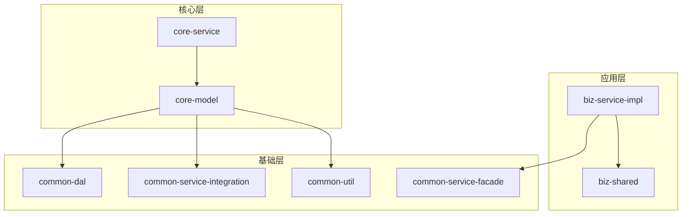
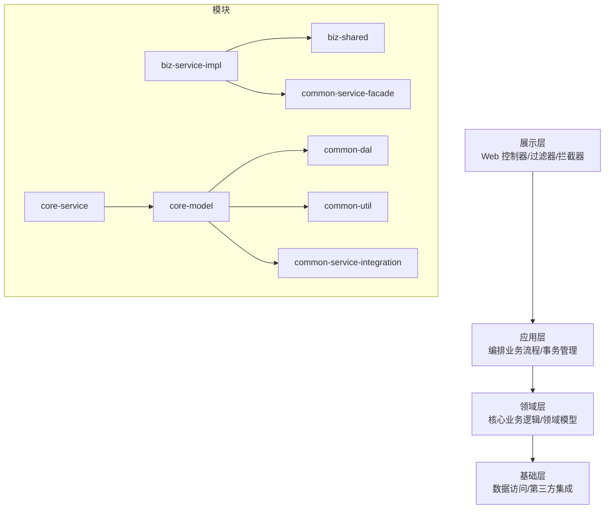
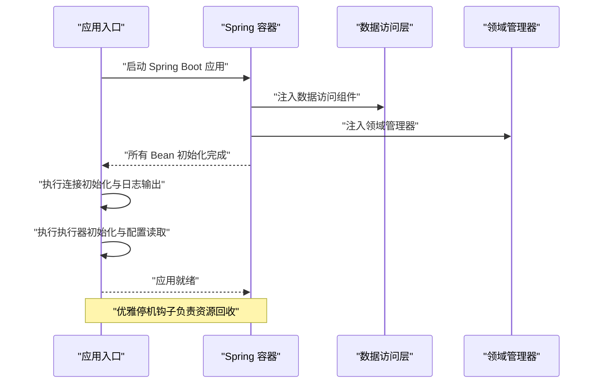
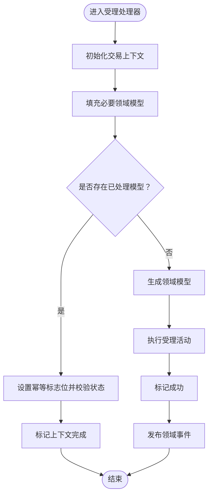
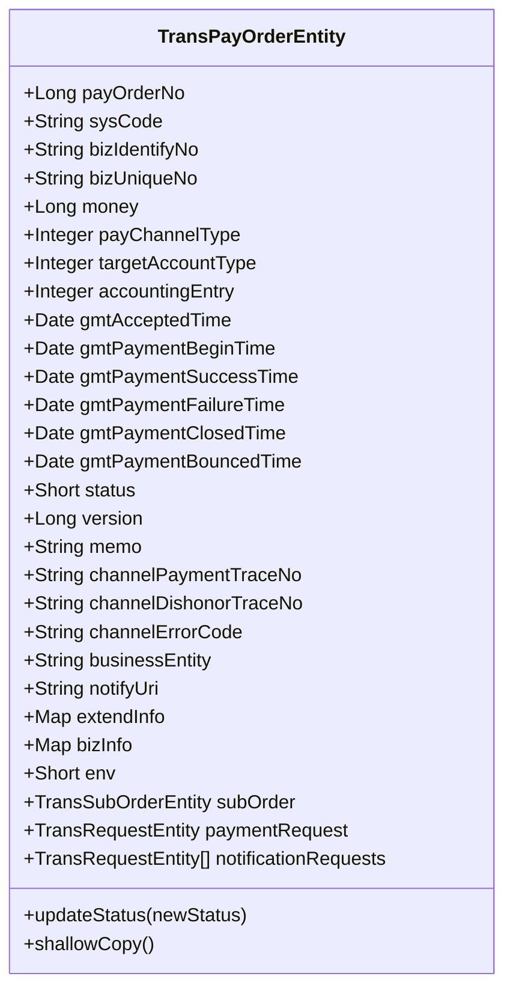
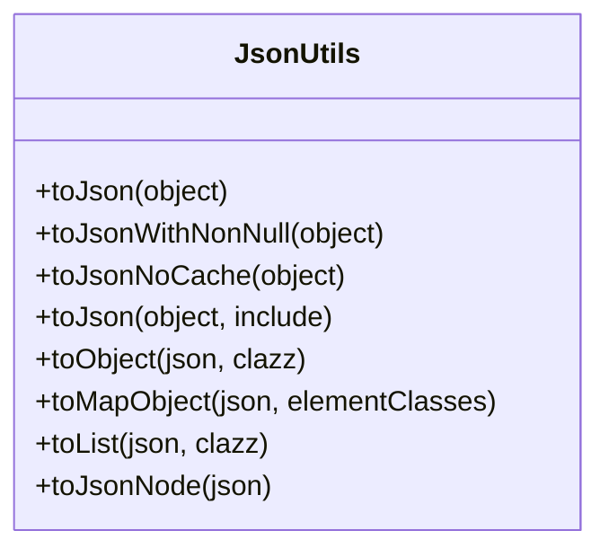
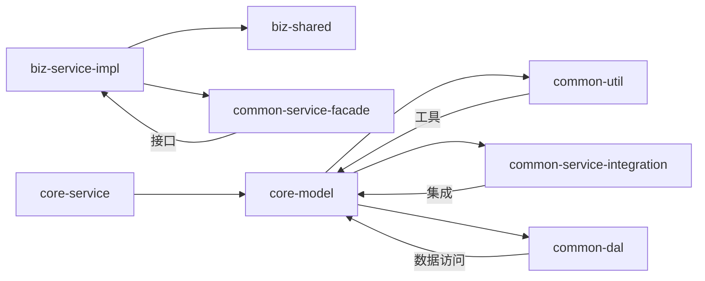

# 开发指南

<cite>
**本文引用的文件**
- [.gitignore](file://.gitignore)
- [根构建脚本 build.gradle](file://build.gradle)
- [设置脚本 settings.gradle](file://settings.gradle)
- [Gradle 属性 gradle.properties](file://gradle.properties)
- [项目总览 README.md](file://README.md)
- [应用入口 DomainDrivenTransactionSysApplication.java](file://biz-service-impl/src/main/java/com/magicliang/transaction/sys/DomainDrivenTransactionSysApplication.java)
- [应用配置 application.yml](file://biz-service-impl/src/main/resources/application.yml)
- [核心配置 CommonConfig.java](file://core-service/src/main/java/com/magicliang/transaction/sys/core/config/CommonConfig.java)
- [JSON 工具 JsonUtils.java](file://common-util/src/main/java/com/magicliang/transaction/sys/common/util/JsonUtils.java)
- [支付订单实体 TransPayOrderEntity.java](file://core-model/src/main/java/com/magicliang/transaction/sys/core/model/entity/TransPayOrderEntity.java)
- [受理处理器 AcceptanceHandler.java](file://biz-shared/src/main/java/com/magicliang/transaction/sys/biz/shared/handler/AcceptanceHandler.java)
- [数据源配置 DataSourceConfig.java](file://common-dal/src/main/java/com/magicliang/transaction/sys/common/dal/datasource/DataSourceConfig.java)
- [GitHub Actions 工作流 gradle.yml](file://.github/workflows/gradle.yml)
- [业务实现模块构建脚本 biz-service-impl/build.gradle](file://biz-service-impl/build.gradle)
- [核心服务模块构建脚本 core-service/build.gradle](file://core-service/build.gradle)
- [通用工具模块构建脚本 common-util/build.gradle](file://common-util/build.gradle)
- [核心模型模块构建脚本 core-model/build.gradle](file://core-model/build.gradle)
- [VS Code 配置文档](file://docs/specs/002-upgrade-java11-jigsaw-modularization.md)
</cite>

## 更新摘要
**变更内容**
- 新增GitHub SSH免登录配置章节，显著改善开发者推送代码体验
- 更新了开发环境配置章节，反映.gitignore中新增的VS Code和SpecStory忽略规则
- 增强了IDE配置与开发环境管理的最佳实践
- 完善了文档组织和版本控制的指导原则

## 目录
1. [简介](#简介)
2. [项目结构](#项目结构)
3. [核心组件](#核心组件)
4. [架构总览](#架构总览)
5. [详细组件分析](#详细组件分析)
6. [依赖分析](#依赖分析)
7. [性能考量](#性能考量)
8. [故障排查指南](#故障排查指南)
9. [结论](#结论)
10. [附录](#附录)

## 简介
本指南面向希望参与领域驱动交易系统开发的工程师，目标是帮助你快速理解并高效贡献代码。内容涵盖：
- 代码规范与最佳实践（命名约定、代码结构、设计模式）
- Gradle 多模块构建配置与依赖管理
- Git 工作流与分支管理策略
- 开发环境搭建与 IDE 配置
- 具体开发示例与模板
- 性能优化建议与故障排查

## 项目结构
项目采用 Gradle 多模块架构，遵循 SOFA 分层思想，模块职责清晰、边界明确：
- biz-service-impl：业务服务实现层，WebFlux/Web MVC 支持，应用可启动模块
- biz-shared：业务共享模块，提供业务级别的共享组件
- common-dal：数据访问层，集成 MyBatis/JPA，支持多数据源
- common-service-facade：服务门面层，定义对外暴露的服务接口
- common-service-integration：服务集成层，处理第三方系统集成
- common-util：通用工具类库
- core-model：核心领域模型，包含实体、值对象、聚合根等
- core-service：核心服务层，实现业务逻辑



**图表来源**
- [设置脚本 settings.gradle:6-14](file://settings.gradle#L6-L14)
- [应用入口 DomainDrivenTransactionSysApplication.java:1-150](file://biz-service-impl/src/main/java/com/magicliang/transaction/sys/DomainDrivenTransactionSysApplication.java#L1-L150)
- [核心模型模块构建脚本 core-model/build.gradle:1-15](file://core-model/build.gradle#L1-L15)
- [通用工具模块构建脚本 common-util/build.gradle:1-47](file://common-util/build.gradle#L1-L47)

**章节来源**
- [项目总览 README.md:23-47](file://README.md#L23-L47)
- [设置脚本 settings.gradle:6-14](file://settings.gradle#L6-L14)

## 核心组件
- 应用入口与启动
  - 应用入口类负责启动 Spring Boot 应用，启用事务管理，导入 XML 配置与属性文件，支持多阶段初始化与优雅停机钩子。
  - 参考路径：[应用入口 DomainDrivenTransactionSysApplication.java:62-150](file://biz-service-impl/src/main/java/com/magicliang/transaction/sys/DomainDrivenTransactionSysApplication.java#L62-L150)

- 配置体系
  - 通过 application.yml 提供多 Profile 配置，支持本地开发、集成测试、预发与生产环境；核心配置通过 @ConfigurationProperties 绑定到 CommonConfig。
  - 参考路径：[应用配置 application.yml:1-216](file://biz-service-impl/src/main/resources/application.yml#L1-L216)，[核心配置 CommonConfig.java:17-44](file://core-service/src/main/java/com/magicliang/transaction/sys/core/config/CommonConfig.java#L17-L44)

- 数据访问与多数据源
  - 通过 @Profile 注解在不同 Profile 下创建主/从数据源 Bean，结合 HikariCP 连接池配置，满足读写分离与高可用需求。
  - 参考路径：[数据源配置 DataSourceConfig.java:22-52](file://common-dal/src/main/java/com/magicliang/transaction/sys/common/dal/datasource/DataSourceConfig.java#L22-L52)

- 领域模型与处理器
  - 核心领域模型包含支付订单实体、子订单、请求等；受理处理器负责上下文初始化、幂等校验、模型生成与领域事件发布。
  - 参考路径：[支付订单实体 TransPayOrderEntity.java:1-216](file://core-model/src/main/java/com/magicliang/transaction/sys/core/model/entity/TransPayOrderEntity.java#L1-L216)，[受理处理器 AcceptanceHandler.java:30-231](file://biz-shared/src/main/java/com/magicliang/transaction/sys/biz/shared/handler/AcceptanceHandler.java#L30-L231)

- 工具与序列化
  - 通用工具模块提供基于 Jackson 的 JSON 工具类，支持多种序列化策略与缓存控制，兼顾性能与兼容性。
  - 参考路径：[JSON 工具 JsonUtils.java:29-293](file://common-util/src/main/java/com/magicliang/transaction/sys/common/util/JsonUtils.java#L29-L293)

**章节来源**
- [应用入口 DomainDrivenTransactionSysApplication.java:62-150](file://biz-service-impl/src/main/java/com/magicliang/transaction/sys/DomainDrivenTransactionSysApplication.java#L62-L150)
- [应用配置 application.yml:1-216](file://biz-service-impl/src/main/resources/application.yml#L1-L216)
- [核心配置 CommonConfig.java:17-44](file://core-service/src/main/java/com/magicliang/transaction/sys/core/config/CommonConfig.java#L17-L44)
- [数据源配置 DataSourceConfig.java:22-52](file://common-dal/src/main/java/com/magicliang/transaction/sys/common/dal/datasource/DataSourceConfig.java#L22-L52)
- [支付订单实体 TransPayOrderEntity.java:1-216](file://core-model/src/main/java/com/magicliang/transaction/sys/core/model/entity/TransPayOrderEntity.java#L1-L216)
- [受理处理器 AcceptanceHandler.java:30-231](file://biz-shared/src/main/java/com/magicliang/transaction/sys/biz/shared/handler/AcceptanceHandler.java#L30-L231)
- [JSON 工具 JsonUtils.java:29-293](file://common-util/src/main/java/com/magicliang/transaction/sys/common/util/JsonUtils.java#L29-L293)

## 架构总览
系统采用 SOFA 分层架构，结合 DDD 领域模型与分层解耦，模块间通过清晰的依赖边界协作。



**图表来源**
- [项目总览 README.md:547-576](file://README.md#L547-L576)
- [设置脚本 settings.gradle:6-14](file://settings.gradle#L6-L14)

## 详细组件分析

### 组件一：应用启动与初始化流程
应用启动时，先完成数据源连接初始化，再进行执行器初始化，最后优雅停机钩子回收资源。该流程确保应用在启动阶段具备稳定的数据库连接与线程池资源。



**图表来源**
- [应用入口 DomainDrivenTransactionSysApplication.java:80-147](file://biz-service-impl/src/main/java/com/magicliang/transaction/sys/DomainDrivenTransactionSysApplication.java#L80-L147)

**章节来源**
- [应用入口 DomainDrivenTransactionSysApplication.java:62-150](file://biz-service-impl/src/main/java/com/magicliang/transaction/sys/DomainDrivenTransactionSysApplication.java#L62-L150)

### 组件二：受理处理器与领域事件
受理处理器负责上下文初始化、幂等校验、模型生成与领域事件发布。其核心流程包括：初始化上下文、生成 ID、执行受理、标记成功、发布领域事件。



**图表来源**
- [受理处理器 AcceptanceHandler.java:53-128](file://biz-shared/src/main/java/com/magicliang/transaction/sys/biz/shared/handler/AcceptanceHandler.java#L53-L128)
- [受理处理器 AcceptanceHandler.java:218-228](file://biz-shared/src/main/java/com/magicliang/transaction/sys/biz/shared/handler/AcceptanceHandler.java#L218-L228)

**章节来源**
- [受理处理器 AcceptanceHandler.java:30-231](file://biz-shared/src/main/java/com/magicliang/transaction/sys/biz/shared/handler/AcceptanceHandler.java#L30-L231)

### 组件三：支付订单实体与状态演进
支付订单实体作为聚合根，承载支付订单的状态与时间戳演进。其状态更新需遵循状态迁移规则，确保业务一致性。



**图表来源**
- [支付订单实体 TransPayOrderEntity.java:27-215](file://core-model/src/main/java/com/magicliang/transaction/sys/core/model/entity/TransPayOrderEntity.java#L27-L215)

**章节来源**
- [支付订单实体 TransPayOrderEntity.java:1-216](file://core-model/src/main/java/com/magicliang/transaction/sys/core/model/entity/TransPayOrderEntity.java#L1-L216)

### 组件四：JSON 工具与序列化策略
JSON 工具类提供多种序列化策略与缓存控制，兼顾性能与兼容性。其静态初始化块配置不同 ObjectMapper 实例，分别用于包含/排除空值、禁用缓存等场景。



**图表来源**
- [JSON 工具 JsonUtils.java:29-293](file://common-util/src/main/java/com/magicliang/transaction/sys/common/util/JsonUtils.java#L29-L293)

**章节来源**
- [JSON 工具 JsonUtils.java:29-293](file://common-util/src/main/java/com/magicliang/transaction/sys/common/util/JsonUtils.java#L29-L293)

## 依赖分析
- Gradle 多模块依赖
  - biz-service-impl 依赖 biz-shared 与 common-service-facade，同时引入 WebFlux/Web MVC 与 Actuator 等 Starter。
  - core-service 依赖 core-model，并引入 JWT 工具库。
  - core-model 依赖 common-util、common-service-integration 与 common-dal。
  - common-util 引入 Guava、Apache Commons Lang、Jackson 等常用库。
- 依赖管理与版本控制
  - 根构建脚本集中管理 Spring Cloud 版本与 JUnit 5 版本，确保子模块一致性。
  - 通过 dependencyManagement 与平台 BOM 管控第三方依赖版本。



**图表来源**
- [业务实现模块构建脚本 biz-service-impl/build.gradle:5-23](file://biz-service-impl/build.gradle#L5-L23)
- [核心服务模块构建脚本 core-service/build.gradle:1-5](file://core-service/build.gradle#L1-L5)
- [核心模型模块构建脚本 core-model/build.gradle:1-5](file://core-model/build.gradle#L1-L5)
- [通用工具模块构建脚本 common-util/build.gradle:8-39](file://common-util/build.gradle#L8-L39)
- [根构建脚本 build.gradle:105-117](file://build.gradle#L105-L117)

**章节来源**
- [业务实现模块构建脚本 biz-service-impl/build.gradle:5-23](file://biz-service-impl/build.gradle#L5-L23)
- [核心服务模块构建脚本 core-service/build.gradle:1-5](file://core-service/build.gradle#L1-L5)
- [核心模型模块构建脚本 core-model/build.gradle:1-5](file://core-model/build.gradle#L1-L5)
- [通用工具模块构建脚本 common-util/build.gradle:8-39](file://common-util/build.gradle#L8-L39)
- [根构建脚本 build.gradle:105-117](file://build.gradle#L105-L117)

## 性能考量
- 并行测试与构建
  - Gradle 属性启用并行构建与缓存，提升整体构建效率。
  - 测试任务根据 CPU 核数设置最大并行进程数，加速测试执行。
- 日志与可观测性
  - 通过 Log4j2 配置区分线上/线下日志级别，避免过度日志影响性能。
  - 引入 OpenTelemetry 依赖，便于统一埋点与追踪。
- 数据库连接池
  - HikariCP 连接池参数经过合理配置，平衡吞吐与延迟。
- 序列化性能
  - JSON 工具类提供缓存与禁用缓存两种策略，按场景选择以获得最佳性能。

**章节来源**
- [Gradle 属性 gradle.properties:9-11](file://gradle.properties#L9-L11)
- [应用配置 application.yml:24-32](file://biz-service-impl/src/main/resources/application.yml#L24-L32)
- [JSON 工具 JsonUtils.java:55-81](file://common-util/src/main/java/com/magicliang/transaction/sys/common/util/JsonUtils.java#L55-L81)

## 故障排查指南
- 构建与测试
  - 若出现 Gradle 相关问题，参考项目提供的常见问题与修复指引。
  - 测试执行支持通配符与指定类/方法，便于定位问题。
- 数据库 Profile
  - 默认使用 Testcontainers 自动拉起 MariaDB 容器；若使用 Podman，需配置 socket 与镜像加速。
  - 外部数据库需在 application.yml 中正确配置连接参数。
- 部署与 K8s
  - 通过 K8s 清单与脚本一键部署/销毁环境；环境变量覆盖机制确保配置一致性。
  - 日志级别与 JVM 参数可通过 ConfigMap 调整，避免 OOM。

**章节来源**
- [项目总览 README.md:679-688](file://README.md#L679-L688)
- [项目总览 README.md:130-214](file://README.md#L130-L214)
- [项目总览 README.md:272-321](file://README.md#L272-L321)
- [项目总览 README.md:396-521](file://README.md#L396-L521)

## 结论
本指南从代码规范、构建配置、工作流、环境搭建、开发示例到性能与故障排查，提供了系统性的开发参考。建议在日常开发中：
- 严格遵循 DDD 与 SOFA 分层原则
- 善用 Gradle 多模块与依赖管理
- 借助 Profile 与 K8s 配置实现环境隔离
- 通过工具类与序列化策略提升性能与稳定性

## 附录

### A. 代码规范与最佳实践
- 命名约定
  - 包名采用反向域名风格，类名使用帕斯卡命名，常量使用全大写加下划线，方法与字段使用驼峰命名。
  - 枚举与配置类使用语义明确的后缀（如 Enum、Config）。
- 代码结构
  - 领域模型使用 Lombok 简化样板代码；处理器与服务类遵循单一职责。
  - 工具类提供静态方法与私有构造器，避免实例化。
- 设计模式
  - 使用 Builder 模式构建复杂对象；使用工厂与上下文管理器解耦创建过程。
  - 通过接口与抽象类实现策略与活动的可替换性。

**章节来源**
- [JSON 工具 JsonUtils.java:84-88](file://common-util/src/main/java/com/magicliang/transaction/sys/common/util/JsonUtils.java#L84-L88)
- [支付订单实体 TransPayOrderEntity.java:12-31](file://core-model/src/main/java/com/magicliang/transaction/sys/core/model/entity/TransPayOrderEntity.java#L12-L31)

### B. Gradle 多模块配置要点
- 根构建脚本集中管理插件、仓库与依赖版本，子模块继承统一配置。
- 子模块通过 api/implementation 区分依赖可见性，降低模块间耦合。
- 通过 dependencyManagement 与平台 BOM 控制第三方依赖版本，避免冲突。

**章节来源**
- [根构建脚本 build.gradle:15-34](file://build.gradle#L15-L34)
- [根构建脚本 build.gradle:105-117](file://build.gradle#L105-L117)
- [业务实现模块构建脚本 biz-service-impl/build.gradle:5-23](file://biz-service-impl/build.gradle#L5-L23)

### C. Git 工作流程与分支管理
- 建议采用功能开发分支（feature/*）、修复分支（fix/*）与热修复分支（hotfix/*）。
- 提交信息采用清晰的类型前缀（feat/fix/docs/chore），配合 Issue 编号。
- 代码审查采用 Pull Request，至少一名维护者批准后方可合并。

### D. 开发环境搭建与 IDE 配置

**更新** 新增VS Code和SpecStory忽略规则的说明

- JDK 与 Gradle
  - 使用 Gradle Wrapper（版本 8.6）与 JDK 8（推荐 SDKMAN 安装）。
- IDE 设置
  - 导入项目后启用 Lombok 注解处理；下载 Sources/Javadoc 以便查阅依赖。
  - VS Code 用户可在项目根目录创建或编辑 `.vscode/settings.json`，添加 JDK 11 运行时配置。
  - SpecStory 用户注意项目已配置忽略规则，确保测试文档不会被意外提交。
- 版本控制与忽略规则
  - 项目采用统一的.gitignore规则，包含VS Code和SpecStory的忽略配置。
  - 忽略规则确保开发工具产生的临时文件不会污染版本控制。
  - 特殊规则：Gradle wrapper jar文件不会被忽略，确保构建的一致性。
- 调试配置
  - 通过 application.yml 指定 Profile 与端口；在 IDE 中设置 VM Options 与环境变量。

**章节来源**
- [项目总览 README.md:50-54](file://README.md#L50-L54)
- [根构建脚本 build.gradle:137-142](file://build.gradle#L137-L142)
- [.gitignore:73-86](file://.gitignore#L73-L86)
- [VS Code 配置文档](file://docs/specs/002-upgrade-java11-jigsaw-modularization.md#L913)

### E. GitHub SSH 免登录配置

**新增** 重要开发者体验改进

当您在推送代码时遇到 "Authentication failed" 或被要求输入用户名密码，这通常意味着您的远程仓库URL使用的是HTTPS格式而非SSH格式。

#### 配置步骤

1. **检查SSH密钥**
   ```bash
   ls -la ~/.ssh/
   # 应该能看到 id_rsa 和 id_rsa.pub
   ```

2. **复制公钥内容**
   ```bash
   cat ~/.ssh/id_rsa.pub
   ```

3. **添加公钥到GitHub**
   - 访问: https://github.com/settings/keys
   - 点击 "New SSH key"
   - 粘贴公钥内容并保存

4. **测试SSH连接**
   ```bash
   ssh -T git@github.com
   # 成功会显示: Hi username! You've successfully authenticated
   ```

5. **更新remote URL为SSH格式**
   ```bash
   # 查看当前remote URL
   git remote -v
   
   # 如果是HTTPS URL,改为SSH URL
   git remote set-url origin git@github.com:magicliang/domain-driven-transaction-sys.git
   
   # 验证修改
   git remote -v
   ```

#### URL格式对比

- ❌ **HTTPS**: `https://github.com/magicliang/domain-driven-transaction-sys.git` (需要输入密码)
- ✅ **SSH**: `git@github.com:magicliang/domain-driven-transaction-sys.git` (免密登录)

#### 常见问题解决

如果SSH配置后仍然出现问题：

1. **检查SSH代理**
   ```bash
   eval $(ssh-agent -s)
   ssh-add ~/.ssh/id_rsa
   ```

2. **验证Git配置**
   ```bash
   git config --global user.name "Your Name"
   git config --global user.email "your.email@example.com"
   ```

3. **检查防火墙设置**
   - 确保端口22未被防火墙阻止
   - 如果使用公司网络，可能需要配置代理

**章节来源**
- [项目总览 README.md:626-670](file://README.md#L626-L670)

### F. 具体开发示例与模板
- 新增领域实体
  - 在 core-model 模块中新增实体类，遵循 Lombok 注解与状态校验规则。
  - 参考路径：[支付订单实体 TransPayOrderEntity.java:27-215](file://core-model/src/main/java/com/magicliang/transaction/sys/core/model/entity/TransPayOrderEntity.java#L27-L215)
- 新增处理器
  - 在 biz-shared 模块中新增处理器类，继承基类并实现上下文初始化与执行逻辑。
  - 参考路径：[受理处理器 AcceptanceHandler.java:30-231](file://biz-shared/src/main/java/com/magicliang/transaction/sys/biz/shared/handler/AcceptanceHandler.java#L30-L231)
- 新增配置
  - 在 core-service 模块中新增配置类，使用 @ConfigurationProperties 绑定属性。
  - 参考路径：[核心配置 CommonConfig.java:17-44](file://core-service/src/main/java/com/magicliang/transaction/sys/core/config/CommonConfig.java#L17-L44)

**章节来源**
- [支付订单实体 TransPayOrderEntity.java:27-215](file://core-model/src/main/java/com/magicliang/transaction/sys/core/model/entity/TransPayOrderEntity.java#L27-L215)
- [受理处理器 AcceptanceHandler.java:30-231](file://biz-shared/src/main/java/com/magicliang/transaction/sys/biz/shared/handler/AcceptanceHandler.java#L30-L231)
- [核心配置 CommonConfig.java:17-44](file://core-service/src/main/java/com/magicliang/transaction/sys/core/config/CommonConfig.java#L17-L44)

### G. GitHub Actions 工作流
- 工作流在推送到 main 分支或发起 PR 时触发，使用 Ubuntu 最新环境与 Adopt JDK 11，执行 Gradle 构建任务。

**章节来源**
- [GitHub Actions 工作流 gradle.yml:16-31](file://.github/workflows/gradle.yml#L16-L31)

### H. 文档组织与版本控制最佳实践

**新增** 基于.gitignore更新的文档组织指导

- 文档分类与结构
  - specs目录专门存放技术规格文档和变更记录
  - README.md提供项目总体介绍和快速开始指南
  - 各模块提供独立的README.md说明模块职责
- 版本控制策略
  - VS Code忽略规则确保开发工具配置不会被提交
  - SpecStory忽略规则保护测试文档的完整性
  - 特殊文件如Gradle wrapper jar保持可追踪性
- 开发环境一致性
  - 统一的忽略规则减少环境差异带来的问题
  - 明确的文档组织便于新成员快速上手

**章节来源**
- [.gitignore:73-86](file://.gitignore#L73-L86)
- [项目总览 README.md:23-47](file://README.md#L23-L47)