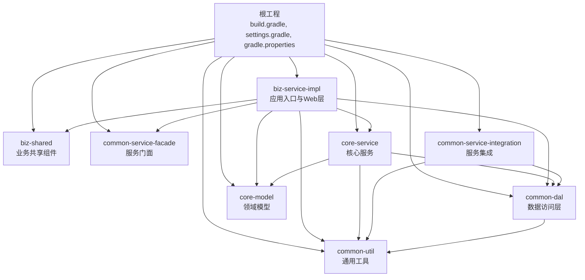
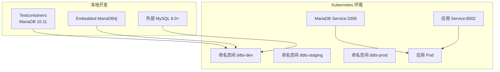
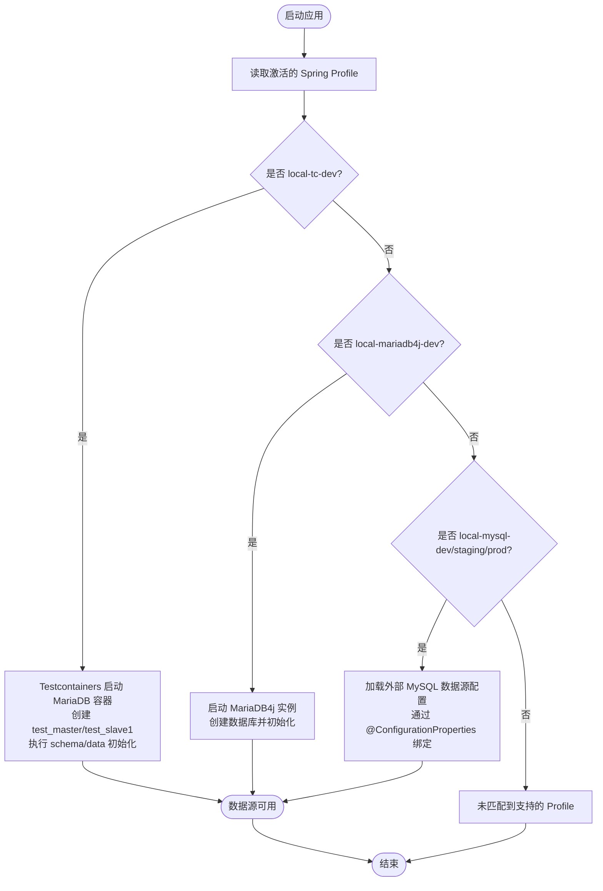
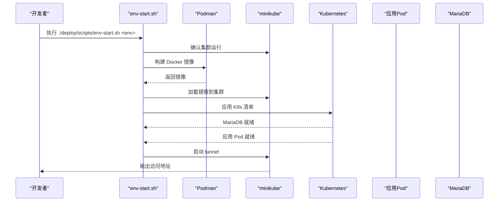
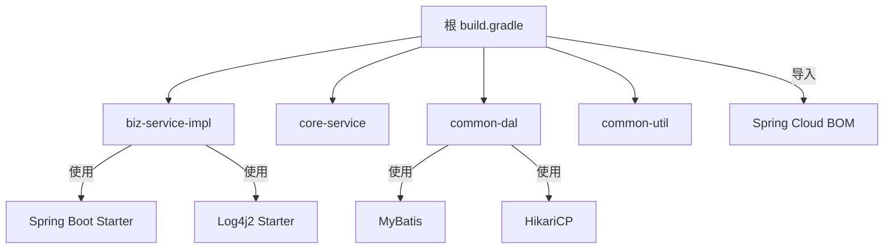

# 快速开始

<cite>
**本文档引用的文件**
- [README.md](file://README.md)
- [build.gradle](file://build.gradle)
- [gradle.properties](file://gradle.properties)
- [settings.gradle](file://settings.gradle)
- [clean.sh](file://clean.sh)
- [biz-service-impl/src/main/resources/application.yml](file://biz-service-impl/src/main/resources/application.yml)
- [common-dal/src/main/java/com/magicliang/transaction/sys/common/dal/datasource/EmbeddedTestcontainersDbConfig.java](file://common-dal/src/main/java/com/magicliang/transaction/sys/common/dal/datasource/EmbeddedTestcontainersDbConfig.java)
- [common-dal/src/main/java/com/magicliang/transaction/sys/common/dal/datasource/EmbeddedMariaDbConfig.java](file://common-dal/src/main/java/com/magicliang/transaction/sys/common/dal/datasource/EmbeddedMariaDbConfig.java)
- [common-dal/src/main/java/com/magicliang/transaction/sys/common/dal/datasource/DataSourceConfig.java](file://common-dal/src/main/java/com/magicliang/transaction/sys/common/dal/datasource/DataSourceConfig.java)
- [deploy/docker/Dockerfile](file://deploy/docker/Dockerfile)
- [deploy/k8s/dev/06-app-configmap.yaml](file://deploy/k8s/dev/06-app-configmap.yaml)
- [deploy/k8s/dev/07-app-secret.yaml](file://deploy/k8s/dev/07-app-secret.yaml)
- [deploy/k8s/dev/08-app-deployment.yaml](file://deploy/k8s/dev/08-app-deployment.yaml)
- [deploy/scripts/env-init.sh](file://deploy/scripts/env-init.sh)
- [deploy/scripts/env-start.sh](file://deploy/scripts/env-start.sh)
</cite>

## 目录
1. [简介](#简介)
2. [项目结构](#项目结构)
3. [核心组件](#核心组件)
4. [架构总览](#架构总览)
5. [详细组件分析](#详细组件分析)
6. [依赖分析](#依赖分析)
7. [性能注意事项](#性能注意事项)
8. [故障排除指南](#故障排除指南)
9. [结论](#结论)
10. [附录](#附录)

## 简介
本指南面向希望快速搭建并运行领域驱动交易系统的开发者。内容涵盖：
- 环境准备：JDK 8、Gradle 8.6、SDKMAN 使用建议
- 项目构建：清理构建、完整构建、跳过测试
- 数据库配置：Testcontainers 自动配置、嵌入式 MariaDB、外部 MySQL
- Docker 与 Kubernetes 部署：minikube 集群、一键部署脚本
- Profile 切换与环境配置
- 常见问题排查

## 项目结构
项目采用 Gradle 多模块结构，核心模块包括业务实现、领域模型、数据访问层、通用工具与服务集成等。根工程负责统一依赖与工具链配置。

图表来源
- [settings.gradle:7-14](file://settings.gradle#L7-L14)
- [build.gradle:15-34](file://build.gradle#L15-L34)

章节来源
- [settings.gradle:1-16](file://settings.gradle#L1-L16)
- [build.gradle:74-83](file://build.gradle#L74-L83)

## 核心组件
- 构建工具与语言版本：使用 Gradle 8.6（自带 Wrapper），Java Toolchain 指定为 Java 8。
- 测试框架：JUnit 5.9.3，测试任务支持并行执行。
- 日志：Log4j2，支持在线/离线两种日志配置。
- 数据库：MyBatis + HikariCP；支持 Testcontainers 自动 MariaDB、嵌入式 MariaDB4j、外部 MySQL。
- 容器与编排：Docker 两阶段构建；Kubernetes 清单与一键脚本，支持 dev/staging/prod 三套环境。

章节来源
- [build.gradle:74-83](file://build.gradle#L74-L83)
- [build.gradle:104-117](file://build.gradle#L104-L117)
- [build.gradle:253-272](file://build.gradle#L253-L272)
- [README.md:11-22](file://README.md#L11-L22)

## 架构总览
系统通过 Spring Profile 机制在不同环境间切换数据库与配置，支持本地开发、集成测试与 Kubernetes 部署。

图表来源
- [README.md:84-129](file://README.md#L84-L129)
- [README.md:216-270](file://README.md#L216-L270)
- [deploy/k8s/dev/06-app-configmap.yaml:10-21](file://deploy/k8s/dev/06-app-configmap.yaml#L10-L21)
- [deploy/k8s/dev/08-app-deployment.yaml:33-71](file://deploy/k8s/dev/08-app-deployment.yaml#L33-L71)

## 详细组件分析

### 环境与工具准备
- JDK 8：推荐使用 SDKMAN 安装 Java 8（例如 8.0.432）。
- Gradle 8.6：项目自带 Gradle Wrapper，无需手动安装。
- 项目根目录提供一键清理脚本，便于重置构建产物。

章节来源
- [README.md:50-54](file://README.md#L50-L54)
- [clean.sh:1-8](file://clean.sh#L1-L8)

### 构建与测试
- 清理并构建（跳过测试）：使用 Gradle Wrapper 执行清理与构建任务，并通过参数跳过测试。
- 完整构建（包含测试）：执行完整构建，包含测试阶段。
- 测试执行：支持运行所有测试、聚合报告、指定类或方法测试，以及通配符匹配。

章节来源
- [README.md:55-82](file://README.md#L55-L82)
- [build.gradle:253-272](file://build.gradle#L253-L272)

### 数据库 Profile 与配置
系统通过 Spring Profile 机制支持多种数据库接入方式，核心配置位于应用配置文件中，配合数据源配置类与 Testcontainers/Embedded MariaDB4j 配置类使用。

- Profile 总览
  - local-tc-dev（默认）：Testcontainers 自动启动 MariaDB 10.11，自动创建双数据库并执行 DDL 初始化。
  - local-mariadb4j-dev：嵌入式 MariaDB4j，JVM 内启动两个实例（端口 4306/4307），仅 x86_64。
  - local-mysql-dev：连接本地 MySQL 8.0+，需手动配置 JDBC URL、用户名、密码。
  - staging/prod：由部署环境提供数据库连接，项目中不包含具体配置。

- 配置要点
  - application.yml 中通过 profiles.activate.on-profile 指定各 Profile 的激活条件与默认值。
  - DataSourceConfig.java 通过 @Profile 激活外部 MySQL 的数据源 Bean。
  - EmbeddedTestcontainersDbConfig.java 通过 Testcontainers 启动 MariaDB 容器，按需初始化数据库与脚本。
  - EmbeddedMariaDbConfig.java 通过 mariadb4j 在 JVM 内启动数据库实例。

图表来源
- [biz-service-impl/src/main/resources/application.yml:4-216](file://biz-service-impl/src/main/resources/application.yml#L4-L216)
- [common-dal/src/main/java/com/magicliang/transaction/sys/common/dal/datasource/DataSourceConfig.java:33-52](file://common-dal/src/main/java/com/magicliang/transaction/sys/common/dal/datasource/DataSourceConfig.java#L33-L52)
- [common-dal/src/main/java/com/magicliang/transaction/sys/common/dal/datasource/EmbeddedTestcontainersDbConfig.java:36-101](file://common-dal/src/main/java/com/magicliang/transaction/sys/common/dal/datasource/EmbeddedTestcontainersDbConfig.java#L36-L101)
- [common-dal/src/main/java/com/magicliang/transaction/sys/common/dal/datasource/EmbeddedMariaDbConfig.java:56-135](file://common-dal/src/main/java/com/magicliang/transaction/sys/common/dal/datasource/EmbeddedMariaDbConfig.java#L56-L135)

章节来源
- [README.md:84-129](file://README.md#L84-L129)
- [biz-service-impl/src/main/resources/application.yml:4-216](file://biz-service-impl/src/main/resources/application.yml#L4-L216)
- [common-dal/src/main/java/com/magicliang/transaction/sys/common/dal/datasource/DataSourceConfig.java:1-82](file://common-dal/src/main/java/com/magicliang/transaction/sys/common/dal/datasource/DataSourceConfig.java#L1-L82)
- [common-dal/src/main/java/com/magicliang/transaction/sys/common/dal/datasource/EmbeddedTestcontainersDbConfig.java:1-154](file://common-dal/src/main/java/com/magicliang/transaction/sys/common/dal/datasource/EmbeddedTestcontainersDbConfig.java#L1-L154)
- [common-dal/src/main/java/com/magicliang/transaction/sys/common/dal/datasource/EmbeddedMariaDbConfig.java:1-184](file://common-dal/src/main/java/com/magicliang/transaction/sys/common/dal/datasource/EmbeddedMariaDbConfig.java#L1-L184)

### Docker 与 Kubernetes 部署
- Docker 镜像：采用两阶段构建，第一阶段使用 JDK 8 编译，第二阶段使用 JRE 8 运行，非 root 用户执行，暴露 8502 端口。
- Kubernetes：提供 dev/staging/prod 三套环境的清单，每套环境包含独立命名空间、MariaDB PVC/Service/Deployment、应用 ConfigMap/Secret/Deployment/Service。
- 一键脚本：env-init.sh 安装并启动 minikube、Podman、kubectl、JDK 8；env-start.sh 构建镜像、加载到 minikube、部署清单、等待就绪并启动 LoadBalancer tunnel。

图表来源
- [deploy/scripts/env-start.sh:101-158](file://deploy/scripts/env-start.sh#L101-L158)
- [deploy/docker/Dockerfile:4-49](file://deploy/docker/Dockerfile#L4-L49)
- [deploy/k8s/dev/08-app-deployment.yaml:19-71](file://deploy/k8s/dev/08-app-deployment.yaml#L19-L71)

章节来源
- [README.md:216-321](file://README.md#L216-L321)
- [deploy/docker/Dockerfile:1-50](file://deploy/docker/Dockerfile#L1-L50)
- [deploy/k8s/dev/06-app-configmap.yaml:1-22](file://deploy/k8s/dev/06-app-configmap.yaml#L1-L22)
- [deploy/k8s/dev/07-app-secret.yaml:1-14](file://deploy/k8s/dev/07-app-secret.yaml#L1-L14)
- [deploy/k8s/dev/08-app-deployment.yaml:1-72](file://deploy/k8s/dev/08-app-deployment.yaml#L1-L72)
- [deploy/scripts/env-init.sh:1-333](file://deploy/scripts/env-init.sh#L1-L333)
- [deploy/scripts/env-start.sh:1-284](file://deploy/scripts/env-start.sh#L1-L284)

### Profile 切换与环境配置
- 本地切换：通过命令行参数 -Dspring.profiles.active 指定 Profile，或在 application.yml 中设置默认激活。
- K8s 环境：通过 ConfigMap 注入 SPRING_PROFILES_ACTIVE，结合 Secret 注入数据库密码；应用通过环境变量覆盖 application.yml 中的属性。
- 优先级链：K8s Secret > K8s ConfigMap > application.yml 中 profile 段 > application.yml 主段。

章节来源
- [README.md:205-214](file://README.md#L205-L214)
- [README.md:347-385](file://README.md#L347-L385)
- [biz-service-impl/src/main/resources/application.yml:4-216](file://biz-service-impl/src/main/resources/application.yml#L4-L216)
- [deploy/k8s/dev/06-app-configmap.yaml:10-21](file://deploy/k8s/dev/06-app-configmap.yaml#L10-L21)
- [deploy/k8s/dev/07-app-secret.yaml:10-13](file://deploy/k8s/dev/07-app-secret.yaml#L10-L13)

## 依赖分析
- 构建与工具链：根工程统一管理 Spring Boot、Spring Cloud 版本，启用 Gradle Wrapper（8.6），Java Toolchain 指定为 Java 8。
- 依赖管理：通过 io.spring.dependency-management 插件导入 Spring Cloud BOM，统一依赖版本。
- 测试：JUnit 5.9.3 在 allprojects 与 subprojects 中统一声明，测试任务支持并行执行。

图表来源
- [build.gradle:15-34](file://build.gradle#L15-L34)
- [build.gradle:104-117](file://build.gradle#L104-L117)
- [build.gradle:193-239](file://build.gradle#L193-L239)

章节来源
- [build.gradle:15-34](file://build.gradle#L15-L34)
- [build.gradle:104-117](file://build.gradle#L104-L117)
- [build.gradle:193-239](file://build.gradle#L193-L239)

## 性能注意事项
- 构建性能：开启 Gradle 并行、配置缓存与按需配置，合理设置 JVM 参数以提升构建速度。
- 运行时性能：根据环境调整 JVM 参数（如 -Xms/-Xmx），避免超过 Pod 内存限制导致 OOMKilled。
- 数据库连接：合理设置连接池大小、超时时间与压缩参数，避免高延迟网络下的连接抖动。

章节来源
- [gradle.properties:9-11](file://gradle.properties#L9-L11)
- [README.md:445-453](file://README.md#L445-L453)
- [deploy/k8s/dev/08-app-deployment.yaml:45-51](file://deploy/k8s/dev/08-app-deployment.yaml#L45-L51)

## 故障排除指南
- Gradle 运行问题：参考项目提供的常见问题图片指引，定位构建与依赖问题。
- Testcontainers/Podman：若使用 Podman，需配置 ~/.testcontainers.properties 与 DOCKER_HOST，必要时禁用 Ryuk 或使用 socket 路径。
- 数据库初始化：首次启动 MariaDB 会执行初始化脚本；若 PVC 已存在，初始化脚本不会重复执行。
- K8s 环境：若 Pod 未就绪，检查 MariaDB 与应用的健康检查、日志与资源配额；使用脚本提供的状态查询命令辅助诊断。

章节来源
- [README.md:679-683](file://README.md#L679-L683)
- [README.md:130-203](file://README.md#L130-L203)
- [README.md:386-394](file://README.md#L386-L394)
- [README.md:528-545](file://README.md#L528-L545)

## 结论
通过本快速开始指南，您可以完成从环境准备、项目构建、数据库配置到 Docker/Kubernetes 部署的全流程。建议优先使用 Testcontainers（local-tc-dev）进行本地开发与测试，生产与预发布环境通过 K8s 清单与一键脚本进行标准化部署。

## 附录
- 常用命令摘要
  - 构建：./gradlew clean build -x test --stacktrace；./gradlew clean build
  - 测试：./gradlew test；./gradlew testAggregateTestReport；./gradlew test --tests <类或方法>
  - 启动应用：./gradlew bootRun
  - 启动 K8s 环境：./deploy/scripts/env-init.sh；./deploy/scripts/env-start.sh <dev|staging|prod>
  - 查看状态：./deploy/scripts/env-start.sh <env> --status
  - 销毁环境：./deploy/scripts/env-start.sh <env> --destroy

章节来源
- [README.md:55-82](file://README.md#L55-L82)
- [README.md:272-321](file://README.md#L272-L321)
- [deploy/scripts/env-start.sh:35-66](file://deploy/scripts/env-start.sh#L35-L66)