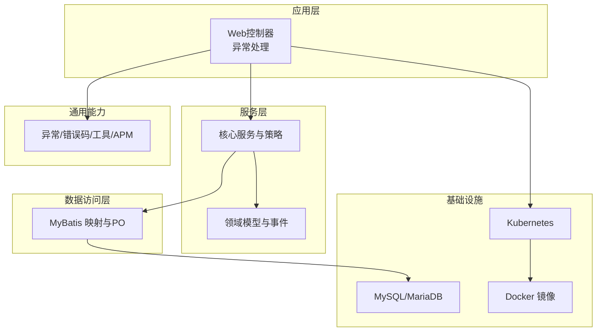
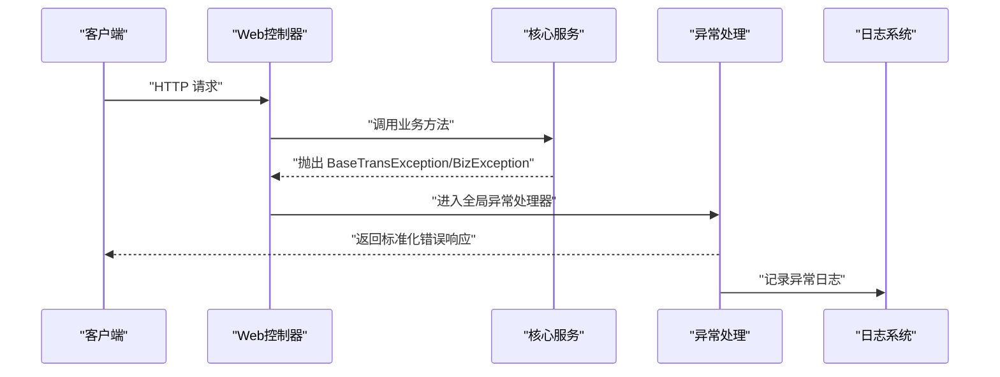
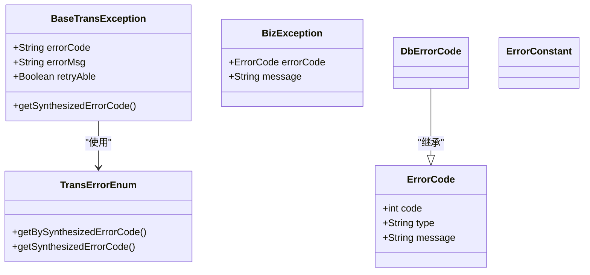
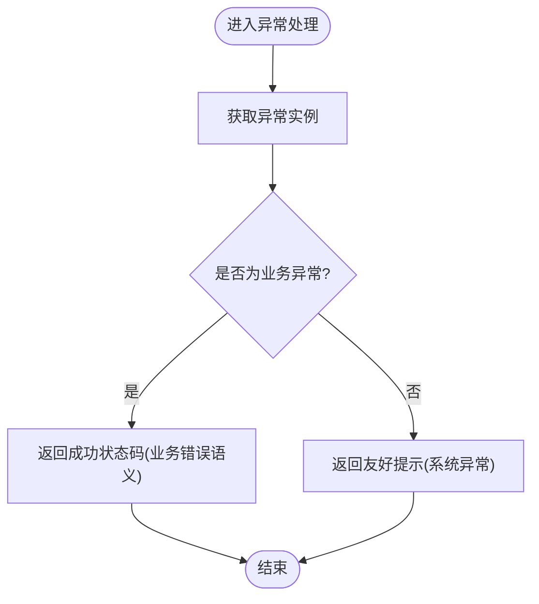
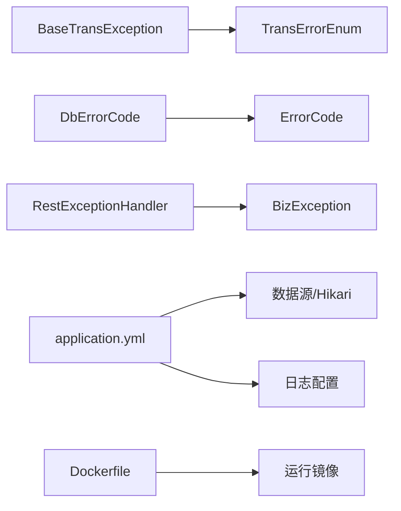

# 故障排除

<cite>
**本文引用的文件**
- [BaseTransException.java](file://common-util/src/main/java/com/magicliang/transaction/sys/common/exception/BaseTransException.java)
- [BizException.java](file://common-util/src/main/java/com/magicliang/transaction/sys/common/exception/BizException.java)
- [TransErrorEnum.java](file://common-util/src/main/java/com/magicliang/transaction/sys/common/enums/TransErrorEnum.java)
- [ErrorCode.java](file://common-util/src/main/java/com/magicliang/transaction/sys/common/constant/ErrorCode.java)
- [DbErrorCode.java](file://common-util/src/main/java/com/magicliang/transaction/sys/common/constant/DbErrorCode.java)
- [ErrorConstant.java](file://common-util/src/main/java/com/magicliang/transaction/sys/common/constant/ErrorConstant.java)
- [RestExceptionHandler.java](file://biz-service-impl/src/main/java/com/magicliang/transaction/sys/biz/service/impl/web/advice/RestExceptionHandler.java)
- [application.yml](file://biz-service-impl/src/main/resources/application.yml)
- [log4j2-online.xml](file://biz-service-impl/src/main/resources/log4j2/log4j2-online.xml)
- [log4j2-offline.xml](file://biz-service-impl/src/main/resources/log4j2/log4j2-offline.xml)
- [Dockerfile](file://deploy/docker/Dockerfile)
- [env-init.sh](file://deploy/scripts/env-init.sh)
- [env-start.sh](file://deploy/scripts/env-start.sh)
- [TransactionTest.java](file://common-util/src/test/java/com/magicliang/transaction/sys/common/util/apm/TransactionTest.java)
- [CustomExceptionUtil.java](file://common-util/src/main/java/com/magicliang/transaction/sys/common/util/CustomExceptionUtil.java)
</cite>

## 目录
1. [简介](#简介)
2. [项目结构](#项目结构)
3. [核心组件](#核心组件)
4. [架构总览](#架构总览)
5. [详细组件分析](#详细组件分析)
6. [依赖分析](#依赖分析)
7. [性能考量](#性能考量)
8. [故障排除指南](#故障排除指南)
9. [结论](#结论)
10. [附录](#附录)

## 简介
本指南面向领域驱动交易系统开发者，聚焦于异常处理与错误码、数据库连接问题、部署与运维、日志与监控、性能调优与常见问题FAQ。目标是帮助你快速定位并解决系统在开发、测试与生产环境中遇到的典型问题。

## 项目结构
系统采用多模块分层组织，核心模块包括：
- common-util：通用异常、错误码、工具类与APM埋点
- common-dal：数据访问层与MyBatis映射
- core-model：领域模型与事件
- core-service：核心服务与策略实现
- biz-service-impl：业务实现、Web层、拦截器与配置
- deploy：容器镜像构建与Kubernetes部署脚本

图表来源
- [application.yml:1-216](file://biz-service-impl/src/main/resources/application.yml#L1-L216)
- [Dockerfile:1-50](file://deploy/docker/Dockerfile#L1-L50)

章节来源
- [application.yml:1-216](file://biz-service-impl/src/main/resources/application.yml#L1-L216)
- [Dockerfile:1-50](file://deploy/docker/Dockerfile#L1-L50)

## 核心组件
本节梳理异常与错误码体系、日志与监控配置，以及Web层异常处理机制。

- 异常与错误码
  - BaseTransException：统一交易异常，支持错误码、错误消息、是否可重试、枚举合成错误码
  - BizException：通用业务异常，支持多种构造方式
  - TransErrorEnum：交易错误码枚举，按“系统/业务/第三方”分类，含是否可重试标记
  - ErrorCode：通用错误码结构
  - DbErrorCode：数据库错误码扩展
  - ErrorConstant：错误常量（如状态校验前缀）

- 日志与监控
  - log4j2-online.xml：生产级别日志，控制台与滚动文件输出
  - log4j2-offline.xml：线下调试级别日志，开启更多框架日志
  - APM埋点：Transaction/ApmMonitor用于事务级监控与嵌套事务可视化

- Web异常处理
  - RestExceptionHandler：统一异常处理，区分业务异常与系统异常返回

章节来源
- [BaseTransException.java:1-125](file://common-util/src/main/java/com/magicliang/transaction/sys/common/exception/BaseTransException.java#L1-L125)
- [BizException.java:1-93](file://common-util/src/main/java/com/magicliang/transaction/sys/common/exception/BizException.java#L1-L93)
- [TransErrorEnum.java:1-327](file://common-util/src/main/java/com/magicliang/transaction/sys/common/enums/TransErrorEnum.java#L1-L327)
- [ErrorCode.java:1-46](file://common-util/src/main/java/com/magicliang/transaction/sys/common/constant/ErrorCode.java#L1-L46)
- [DbErrorCode.java:1-47](file://common-util/src/main/java/com/magicliang/transaction/sys/common/constant/DbErrorCode.java#L1-L47)
- [ErrorConstant.java:1-30](file://common-util/src/main/java/com/magicliang/transaction/sys/common/constant/ErrorConstant.java#L1-L30)
- [log4j2-online.xml:1-50](file://biz-service-impl/src/main/resources/log4j2/log4j2-online.xml#L1-L50)
- [log4j2-offline.xml:1-56](file://biz-service-impl/src/main/resources/log4j2/log4j2-offline.xml#L1-L56)
- [RestExceptionHandler.java:1-40](file://biz-service-impl/src/main/java/com/magicliang/transaction/sys/biz/service/impl/web/advice/RestExceptionHandler.java#L1-L40)
- [TransactionTest.java:98-587](file://common-util/src/test/java/com/magicliang/transaction/sys/common/util/apm/TransactionTest.java#L98-L587)

## 架构总览
交易系统异常与日志处理的关键交互如下：

图表来源
- [RestExceptionHandler.java:26-38](file://biz-service-impl/src/main/java/com/magicliang/transaction/sys/biz/service/impl/web/advice/RestExceptionHandler.java#L26-L38)
- [BaseTransException.java:21-125](file://common-util/src/main/java/com/magicliang/transaction/sys/common/exception/BaseTransException.java#L21-L125)
- [BizException.java:22-93](file://common-util/src/main/java/com/magicliang/transaction/sys/common/exception/BizException.java#L22-L93)

## 详细组件分析

### 异常与错误码体系
- BaseTransException
  - 支持从枚举合成错误码与消息，允许自定义错误码与消息，可标注是否可重试
  - 适合跨模块传递统一的交易错误语义
- BizException
  - 通用业务异常封装，便于业务层快速抛出与捕获
- TransErrorEnum
  - 按中间类型（系统/业务/第三方）与具体错误码组合，提供“可重试”语义
  - 提供合成错误码与反查方法
- DbErrorCode
  - 针对数据库操作的错误码集合
- ErrorConstant
  - 状态校验等常量字符串

图表来源
- [BaseTransException.java:21-125](file://common-util/src/main/java/com/magicliang/transaction/sys/common/exception/BaseTransException.java#L21-L125)
- [BizException.java:22-93](file://common-util/src/main/java/com/magicliang/transaction/sys/common/exception/BizException.java#L22-L93)
- [TransErrorEnum.java:204-325](file://common-util/src/main/java/com/magicliang/transaction/sys/common/enums/TransErrorEnum.java#L204-L325)
- [ErrorCode.java:22-46](file://common-util/src/main/java/com/magicliang/transaction/sys/common/constant/ErrorCode.java#L22-L46)
- [DbErrorCode.java:19-47](file://common-util/src/main/java/com/magicliang/transaction/sys/common/constant/DbErrorCode.java#L19-L47)
- [ErrorConstant.java:12-30](file://common-util/src/main/java/com/magicliang/transaction/sys/common/constant/ErrorConstant.java#L12-L30)

章节来源
- [BaseTransException.java:1-125](file://common-util/src/main/java/com/magicliang/transaction/sys/common/exception/BaseTransException.java#L1-L125)
- [BizException.java:1-93](file://common-util/src/main/java/com/magicliang/transaction/sys/common/exception/BizException.java#L1-L93)
- [TransErrorEnum.java:1-327](file://common-util/src/main/java/com/magicliang/transaction/sys/common/enums/TransErrorEnum.java#L1-L327)
- [DbErrorCode.java:1-47](file://common-util/src/main/java/com/magicliang/transaction/sys/common/constant/DbErrorCode.java#L1-L47)
- [ErrorConstant.java:1-30](file://common-util/src/main/java/com/magicliang/transaction/sys/common/constant/ErrorConstant.java#L1-L30)

### Web异常处理流程
- RestExceptionHandler
  - 统一捕获运行时异常，区分业务异常与系统异常，返回标准化响应
  - 便于前端与网关侧进行错误归类与重试策略

图表来源
- [RestExceptionHandler.java:26-38](file://biz-service-impl/src/main/java/com/magicliang/transaction/sys/biz/service/impl/web/advice/RestExceptionHandler.java#L26-L38)

章节来源
- [RestExceptionHandler.java:1-40](file://biz-service-impl/src/main/java/com/magicliang/transaction/sys/biz/service/impl/web/advice/RestExceptionHandler.java#L1-L40)

### 日志与监控
- 日志配置
  - online/offline两套配置，分别适用于生产与本地调试
  - 控制台阈值与文件滚动策略可按需调整
- APM埋点
  - Transaction/ApmMonitor用于事务级监控，支持嵌套事务与多线程场景
  - 测试用例展示了复杂嵌套与循环事务的可视化输出

章节来源
- [log4j2-online.xml:1-50](file://biz-service-impl/src/main/resources/log4j2/log4j2-online.xml#L1-L50)
- [log4j2-offline.xml:1-56](file://biz-service-impl/src/main/resources/log4j2/log4j2-offline.xml#L1-L56)
- [TransactionTest.java:98-587](file://common-util/src/test/java/com/magicliang/transaction/sys/common/util/apm/TransactionTest.java#L98-L587)

## 依赖分析
- 异常与错误码
  - BaseTransException依赖TransErrorEnum进行错误码合成
  - DbErrorCode继承ErrorCode，复用通用错误结构
- Web层
  - RestExceptionHandler依赖BizException进行异常分类
- 配置与运行
  - application.yml集中管理数据源、日志、线程池与环境配置
  - Dockerfile定义构建与运行时镜像

图表来源
- [BaseTransException.java:102-125](file://common-util/src/main/java/com/magicliang/transaction/sys/common/exception/BaseTransException.java#L102-L125)
- [TransErrorEnum.java:304-325](file://common-util/src/main/java/com/magicliang/transaction/sys/common/enums/TransErrorEnum.java#L304-L325)
- [DbErrorCode.java:19-47](file://common-util/src/main/java/com/magicliang/transaction/sys/common/constant/DbErrorCode.java#L19-L47)
- [RestExceptionHandler.java:26-38](file://biz-service-impl/src/main/java/com/magicliang/transaction/sys/biz/service/impl/web/advice/RestExceptionHandler.java#L26-L38)
- [application.yml:17-50](file://biz-service-impl/src/main/resources/application.yml#L17-L50)
- [Dockerfile:34-50](file://deploy/docker/Dockerfile#L34-L50)

章节来源
- [application.yml:1-216](file://biz-service-impl/src/main/resources/application.yml#L1-L216)
- [Dockerfile:1-50](file://deploy/docker/Dockerfile#L1-L50)

## 性能考量
- 连接池与超时
  - Hikari连接池参数（最小空闲、最大池大小、最大生存时间、连接超时）直接影响吞吐与延迟
  - 建议结合压测结果与慢SQL分析，动态调整
- SQL与日志
  - 开启线下调试日志有助于定位慢查询，但生产应谨慎启用
- 并发与线程池
  - Web与异步任务线程池需与CPU核数、IO特性匹配，避免过度上下文切换
- APM监控
  - 利用事务埋点识别热点路径与瓶颈，指导拆分与缓存策略

## 故障排除指南

### 一、异常处理与错误码诊断
- 常见症状
  - 接口返回业务错误但状态码为200，或系统异常提示不明确
- 诊断步骤
  - 检查异常是否被RestExceptionHandler捕获并分类
  - 核对抛出异常是否为BaseTransException/BizException
  - 查看错误码来源：TransErrorEnum或DbErrorCode，确认是否可重试
- 处理建议
  - 业务异常：依据错误码与可重试标记决定重试策略
  - 系统异常：记录堆栈与上下文，定位到具体服务与方法

章节来源
- [RestExceptionHandler.java:26-38](file://biz-service-impl/src/main/java/com/magicliang/transaction/sys/biz/service/impl/web/advice/RestExceptionHandler.java#L26-L38)
- [BaseTransException.java:102-125](file://common-util/src/main/java/com/magicliang/transaction/sys/common/exception/BaseTransException.java#L102-L125)
- [BizException.java:22-93](file://common-util/src/main/java/com/magicliang/transaction/sys/common/exception/BizException.java#L22-L93)
- [TransErrorEnum.java:204-325](file://common-util/src/main/java/com/magicliang/transaction/sys/common/enums/TransErrorEnum.java#L204-L325)
- [DbErrorCode.java:19-47](file://common-util/src/main/java/com/magicliang/transaction/sys/common/constant/DbErrorCode.java#L19-L47)

### 二、数据库连接问题排查
- 连接超时
  - 检查application.yml中Hikari连接超时与测试查询配置
  - 结合慢SQL与数据库负载评估是否需要扩容或优化查询
- 死锁
  - 观察错误码是否落入数据库操作类错误
  - 审视事务边界与锁顺序，避免循环等待
- 性能问题
  - 在线下开启MyBatis SQL日志，定位热点表与索引缺失
  - 调整连接池大小与最大生命周期，平衡并发与资源占用

章节来源
- [application.yml:24-32](file://biz-service-impl/src/main/resources/application.yml#L24-L32)
- [DbErrorCode.java:24-45](file://common-util/src/main/java/com/magicliang/transaction/sys/common/constant/DbErrorCode.java#L24-L45)

### 三、部署与运维故障排除
- 容器启动失败
  - 检查Dockerfile构建阶段与运行用户权限
  - 确认暴露端口与入口参数一致
- Kubernetes资源问题
  - 使用env-start.sh检查命名空间、服务、PVC状态
  - 关注LoadBalancer外部IP分配与服务连通性
- 配置错误
  - 确认环境变量覆盖（如数据库URL、用户名、密码）
  - 校验日志配置文件路径与级别

章节来源
- [Dockerfile:34-50](file://deploy/docker/Dockerfile#L34-L50)
- [env-start.sh:131-211](file://deploy/scripts/env-start.sh#L131-L211)
- [application.yml:179-213](file://biz-service-impl/src/main/resources/application.yml#L179-L213)

### 四、日志分析与监控告警
- 日志分析
  - 生产使用online配置，线下使用offline配置
  - 通过控制台阈值与滚动策略定位异常
- 监控告警
  - 借助Transaction/ApmMonitor埋点，识别耗时事务与嵌套层级
  - 将异常与错误码纳入告警规则，区分可重试与不可重试

章节来源
- [log4j2-online.xml:1-50](file://biz-service-impl/src/main/resources/log4j2/log4j2-online.xml#L1-L50)
- [log4j2-offline.xml:1-56](file://biz-service-impl/src/main/resources/log4j2/log4j2-offline.xml#L1-L56)
- [TransactionTest.java:98-587](file://common-util/src/test/java/com/magicliang/transaction/sys/common/util/apm/TransactionTest.java#L98-L587)

### 五、性能调优与资源优化
- 连接池与超时
  - 根据QPS与RT调优最小空闲、最大池大小、连接超时
- SQL优化
  - 开启线下SQL日志，补充索引、拆分大事务
- 并发与线程池
  - 与业务特征匹配，避免线程饥饿与资源争用
- APM与观测性
  - 基于事务埋点持续识别热点，迭代优化

### 六、常见问题FAQ
- Q：如何判断异常是否可重试？
  - A：查看异常的可重试标记或错误码枚举的可重试属性
- Q：业务异常与系统异常的区别？
  - A：业务异常返回成功状态码携带错误语义；系统异常返回友好提示
- Q：如何在本地复现慢SQL问题？
  - A：切换至线下日志配置，开启MyBatis SQL日志，配合APM事务埋点
- Q：K8s部署后服务无法访问？
  - A：检查命名空间、服务、LoadBalancer外部IP与端口映射

## 结论
通过统一的异常与错误码体系、完善的日志与监控配置，以及规范的部署与运维脚本，系统具备了较强的可观测性与可维护性。建议在日常开发中坚持：
- 明确异常分类与错误码语义
- 以APM与日志为依据进行性能优化
- 以脚本化方式保障部署一致性与可回滚性

## 附录
- 诊断工具与辅助方法
  - 异常链查找：使用工具类递归展开异常链，快速定位根因
  - 参数类型转换错误：正则提取字段名，快速定位非法参数

章节来源
- [CustomExceptionUtil.java:47-57](file://common-util/src/main/java/com/magicliang/transaction/sys/common/util/CustomExceptionUtil.java#L47-L57)