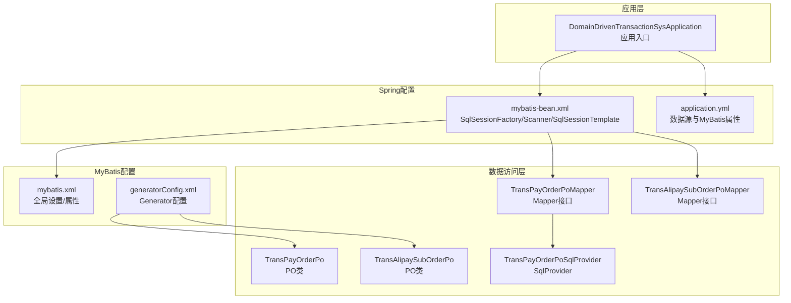
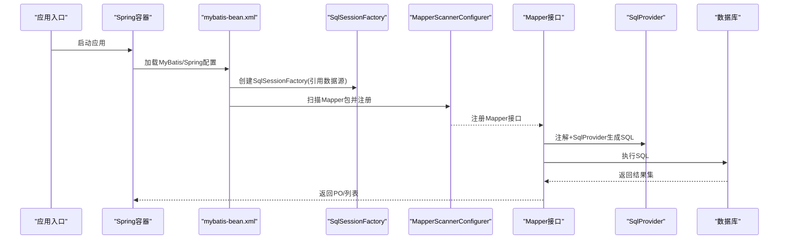
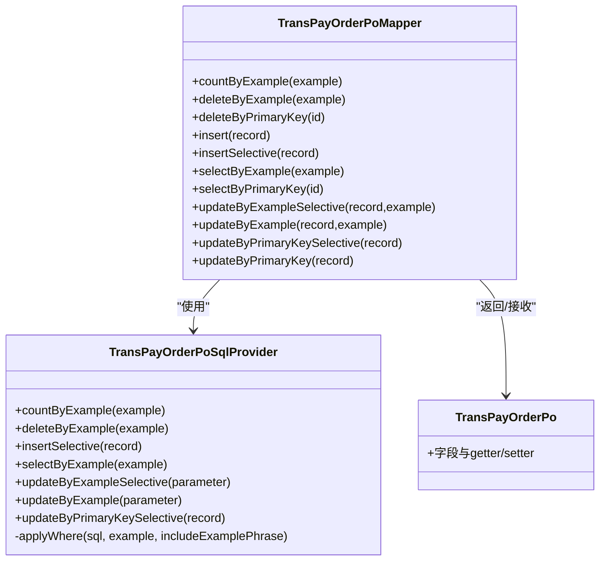
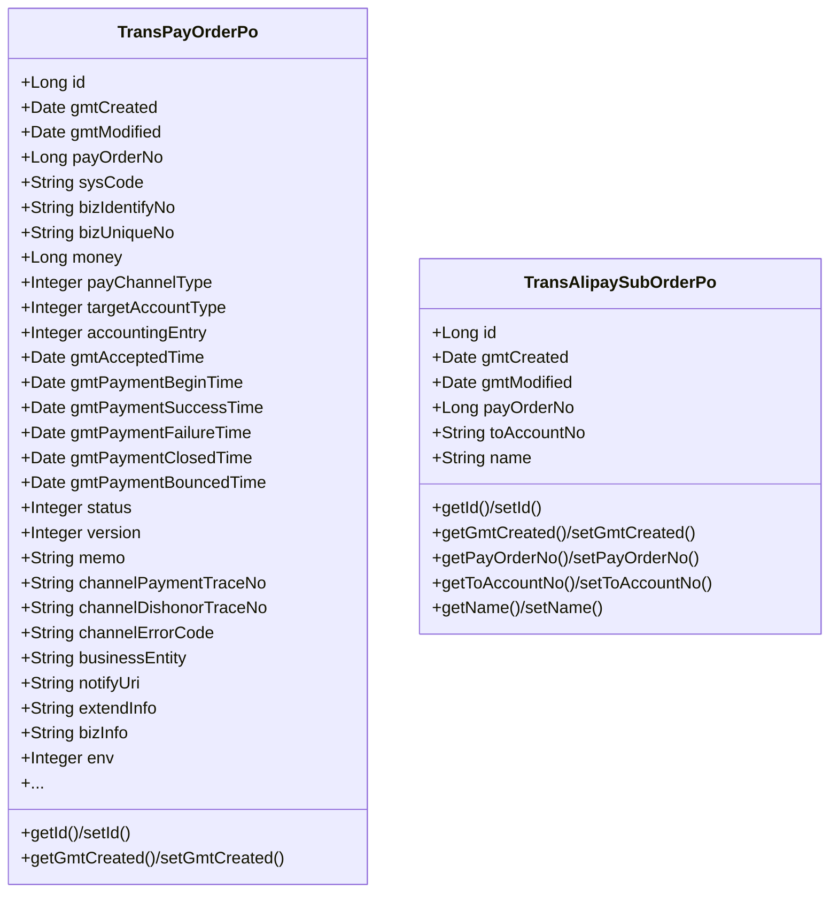
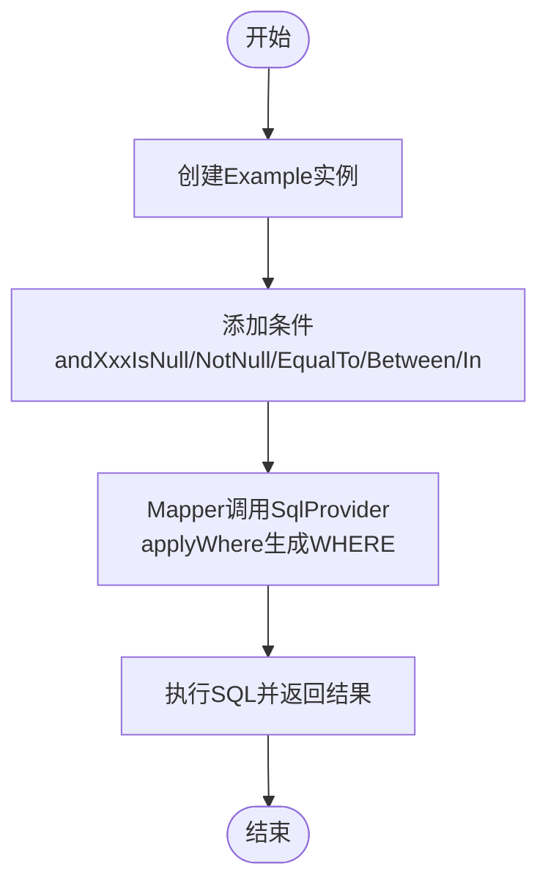
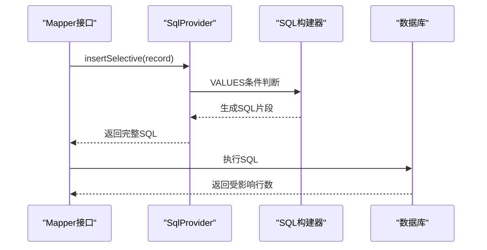
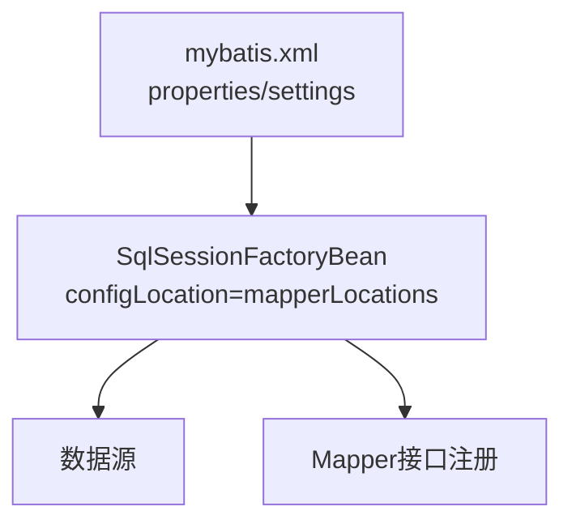
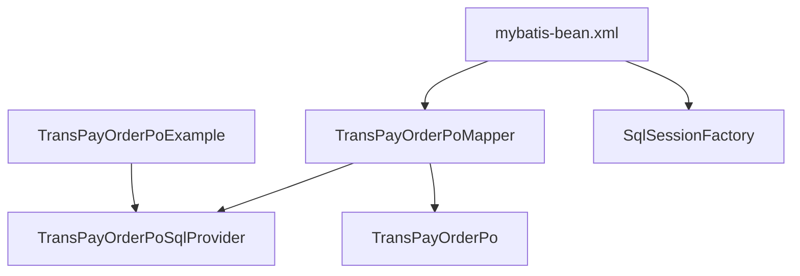

# MyBatis映射配置

<cite>
**本文档引用的文件**
- [mybatis.xml](file://biz-service-impl/src/main/resources/mybatis/mybatis.xml)
- [mybatis-bean.xml](file://biz-service-impl/src/main/resources/spring/mybatis-bean.xml)
- [generatorConfig.xml](file://common-dal/src/main/resources/autogen/generatorConfig.xml)
- [MyBatis-configuration.MD](file://common-dal/src/main/java/com/magicliang/transaction/sys/common/dal/mybatis/MyBatis-configuration.MD)
- [application.yml](file://biz-service-impl/src/main/resources/application.yml)
- [DomainDrivenTransactionSysApplication.java](file://biz-service-impl/src/main/java/com/magicliang/transaction/sys/DomainDrivenTransactionSysApplication.java)
- [TransPayOrderPo.java](file://common-dal/src/main/java/com/magicliang/transaction/sys/common/dal/mybatis/po/TransPayOrderPo.java)
- [TransPayOrderPoExample.java](file://common-dal/src/main/java/com/magicliang/transaction/sys/common/dal/mybatis/po/TransPayOrderPoExample.java)
- [TransPayOrderPoMapper.java](file://common-dal/src/main/java/com/magicliang/transaction/sys/common/dal/mybatis/mapper/TransPayOrderPoMapper.java)
- [TransPayOrderPoSqlProvider.java](file://common-dal/src/main/java/com/magicliang/transaction/sys/common/dal/mybatis/mapper/TransPayOrderPoSqlProvider.java)
- [TransAlipaySubOrderPo.java](file://common-dal/src/main/java/com/magicliang/transaction/sys/common/dal/mybatis/po/TransAlipaySubOrderPo.java)
- [TransAlipaySubOrderPoExample.java](file://common-dal/src/main/java/com/magicliang/transaction/sys/common/dal/mybatis/po/TransAlipaySubOrderPoExample.java)
- [TransAlipaySubOrderPoMapper.java](file://common-dal/src/main/java/com/magicliang/transaction/sys/common/dal/mybatis/mapper/TransAlipaySubOrderPoMapper.java)
</cite>

## 目录
1. [简介](#简介)
2. [项目结构](#项目结构)
3. [核心组件](#核心组件)
4. [架构总览](#架构总览)
5. [详细组件分析](#详细组件分析)
6. [依赖分析](#依赖分析)
7. [性能考量](#性能考量)
8. [故障排查指南](#故障排查指南)
9. [结论](#结论)
10. [附录](#附录)

## 简介
本文件面向MyBatis映射配置的技术文档，围绕Mapper接口设计模式、PO类设计原则、SqlProvider动态SQL生成、MyBatis配置文件结构与参数、以及CRUD最佳实践展开。结合仓库中的具体实现，给出可操作的配置与编码建议，并涵盖SQL注入防护、批量操作与复杂查询的实现方法。

## 项目结构
该工程采用模块化组织，MyBatis相关代码集中在common-dal模块，Spring配置位于biz-service-impl模块。关键位置如下：
- MyBatis全局配置：biz-service-impl/resources/mybatis/mybatis.xml
- Spring集成配置：biz-service-impl/resources/spring/mybatis-bean.xml
- MyBatis Generator配置：common-dal/resources/autogen/generatorConfig.xml
- PO类与Mapper接口：common-dal/src/main/java/com/magicliang/transaction/sys/common/dal/mybatis/{po,mapper}
- 应用配置与数据源：biz-service-impl/resources/application.yml
- 应用入口与事务管理：biz-service-impl/src/main/java/.../DomainDrivenTransactionSysApplication.java

**图表来源**
- [mybatis.xml:1-18](file://biz-service-impl/src/main/resources/mybatis/mybatis.xml#L1-L18)
- [mybatis-bean.xml:1-30](file://biz-service-impl/src/main/resources/spring/mybatis-bean.xml#L1-L30)
- [generatorConfig.xml:1-64](file://common-dal/src/main/resources/autogen/generatorConfig.xml#L1-L64)
- [TransPayOrderPo.java:1-120](file://common-dal/src/main/java/com/magicliang/transaction/sys/common/dal/mybatis/po/TransPayOrderPo.java#L1-L120)
- [TransAlipaySubOrderPo.java:1-120](file://common-dal/src/main/java/com/magicliang/transaction/sys/common/dal/mybatis/po/TransAlipaySubOrderPo.java#L1-L120)
- [TransPayOrderPoMapper.java:1-60](file://common-dal/src/main/java/com/magicliang/transaction/sys/common/dal/mybatis/mapper/TransPayOrderPoMapper.java#L1-L60)
- [TransAlipaySubOrderPoMapper.java:1-60](file://common-dal/src/main/java/com/magicliang/transaction/sys/common/dal/mybatis/mapper/TransAlipaySubOrderPoMapper.java#L1-L60)
- [TransPayOrderPoSqlProvider.java:1-60](file://common-dal/src/main/java/com/magicliang/transaction/sys/common/dal/mybatis/mapper/TransPayOrderPoSqlProvider.java#L1-L60)

**章节来源**
- [mybatis.xml:1-18](file://biz-service-impl/src/main/resources/mybatis/mybatis.xml#L1-L18)
- [mybatis-bean.xml:1-30](file://biz-service-impl/src/main/resources/spring/mybatis-bean.xml#L1-L30)
- [generatorConfig.xml:1-64](file://common-dal/src/main/resources/autogen/generatorConfig.xml#L1-L64)
- [application.yml:1-216](file://biz-service-impl/src/main/resources/application.yml#L1-L216)
- [DomainDrivenTransactionSysApplication.java:1-150](file://biz-service-impl/src/main/java/com/magicliang/transaction/sys/DomainDrivenTransactionSysApplication.java#L1-L150)

## 核心组件
- Mapper接口：定义CRUD与条件查询方法，支持注解与SqlProvider两种方式。
- PO类：持久化对象，包含字段、getter/setter及业务含义注释，部分PO包含BLOB字段变体。
- Example类：条件构造器，通过Criteria/Criterion构建动态WHERE子句。
- SqlProvider：动态SQL生成器，按条件拼接SQL片段，支持selective插入与更新。
- MyBatis配置：全局设置、属性、执行器类型等。
- Spring集成：SqlSessionFactory、MapperScannerConfigurer、SqlSessionTemplate。

**章节来源**
- [TransPayOrderPoMapper.java:1-267](file://common-dal/src/main/java/com/magicliang/transaction/sys/common/dal/mybatis/mapper/TransPayOrderPoMapper.java#L1-L267)
- [TransPayOrderPo.java:1-320](file://common-dal/src/main/java/com/magicliang/transaction/sys/common/dal/mybatis/po/TransPayOrderPo.java#L1-L320)
- [TransPayOrderPoExample.java:1-200](file://common-dal/src/main/java/com/magicliang/transaction/sys/common/dal/mybatis/po/TransPayOrderPoExample.java#L1-L200)
- [TransPayOrderPoSqlProvider.java:1-200](file://common-dal/src/main/java/com/magicliang/transaction/sys/common/dal/mybatis/mapper/TransPayOrderPoSqlProvider.java#L1-L200)
- [mybatis.xml:1-18](file://biz-service-impl/src/main/resources/mybatis/mybatis.xml#L1-L18)
- [mybatis-bean.xml:1-30](file://biz-service-impl/src/main/resources/spring/mybatis-bean.xml#L1-L30)

## 架构总览
MyBatis在本项目中的运行时架构如下：
- 应用启动加载application.yml中的数据源与MyBatis属性。
- Spring通过mybatis-bean.xml装配SqlSessionFactory，扫描Mapper接口并注册到IoC容器。
- Mapper接口通过注解或SqlProvider生成SQL，经SqlSessionTemplate执行，返回PO或列表。
- Example类用于条件查询，SqlProvider负责动态拼接。

**图表来源**
- [mybatis-bean.xml:1-30](file://biz-service-impl/src/main/resources/spring/mybatis-bean.xml#L1-L30)
- [TransPayOrderPoMapper.java:1-60](file://common-dal/src/main/java/com/magicliang/transaction/sys/common/dal/mybatis/mapper/TransPayOrderPoMapper.java#L1-L60)
- [TransPayOrderPoSqlProvider.java:1-60](file://common-dal/src/main/java/com/magicliang/transaction/sys/common/dal/mybatis/mapper/TransPayOrderPoSqlProvider.java#L1-L60)

**章节来源**
- [application.yml:1-216](file://biz-service-impl/src/main/resources/application.yml#L1-L216)
- [mybatis-bean.xml:1-30](file://biz-service-impl/src/main/resources/spring/mybatis-bean.xml#L1-L30)
- [DomainDrivenTransactionSysApplication.java:52-73](file://biz-service-impl/src/main/java/com/magicliang/transaction/sys/DomainDrivenTransactionSysApplication.java#L52-L73)

## 详细组件分析

### Mapper接口设计模式
- 接口职责：声明CRUD与条件查询方法，避免手写XML，提高可维护性。
- 注解方式：@Select、@Insert、@Update、@Delete等直接内联SQL。
- SqlProvider方式：@SelectProvider/@InsertProvider/@UpdateProvider/@DeleteProvider指向对应SqlProvider类，集中处理动态SQL。
- 结果映射：@Results/@Result将列名映射到PO字段，支持驼峰命名转换。

**图表来源**
- [TransPayOrderPoMapper.java:1-267](file://common-dal/src/main/java/com/magicliang/transaction/sys/common/dal/mybatis/mapper/TransPayOrderPoMapper.java#L1-L267)
- [TransPayOrderPoSqlProvider.java:1-200](file://common-dal/src/main/java/com/magicliang/transaction/sys/common/dal/mybatis/mapper/TransPayOrderPoSqlProvider.java#L1-L200)
- [TransPayOrderPo.java:1-120](file://common-dal/src/main/java/com/magicliang/transaction/sys/common/dal/mybatis/po/TransPayOrderPo.java#L1-L120)

**章节来源**
- [TransPayOrderPoMapper.java:1-267](file://common-dal/src/main/java/com/magicliang/transaction/sys/common/dal/mybatis/mapper/TransPayOrderPoMapper.java#L1-L267)
- [TransPayOrderPoSqlProvider.java:1-200](file://common-dal/src/main/java/com/magicliang/transaction/sys/common/dal/mybatis/mapper/TransPayOrderPoSqlProvider.java#L1-L200)

### PO类设计原则
- 字段映射：每个字段对应数据库列，包含注释说明业务含义。
- Getter/Setter：提供完整的访问器，字符串字段在setter中进行trim处理以消除空格影响。
- 示例：TransPayOrderPo包含大量时间戳字段与状态枚举字段，便于业务状态流转追踪；TransAlipaySubOrderPo为简化示例，仅包含必要字段。

**图表来源**
- [TransPayOrderPo.java:1-320](file://common-dal/src/main/java/com/magicliang/transaction/sys/common/dal/mybatis/po/TransPayOrderPo.java#L1-L320)
- [TransAlipaySubOrderPo.java:1-200](file://common-dal/src/main/java/com/magicliang/transaction/sys/common/dal/mybatis/po/TransAlipaySubOrderPo.java#L1-L200)

**章节来源**
- [TransPayOrderPo.java:1-320](file://common-dal/src/main/java/com/magicliang/transaction/sys/common/dal/mybatis/po/TransPayOrderPo.java#L1-L320)
- [TransAlipaySubOrderPo.java:1-200](file://common-dal/src/main/java/com/magicliang/transaction/sys/common/dal/mybatis/po/TransAlipaySubOrderPo.java#L1-L200)

### Example类与条件查询
- Example类提供链式条件构造，支持is null/not null、等于/不等于、大于/小于、in/between等。
- Criteria/Criterion内部类封装条件表达式，applyWhere方法将条件序列化为WHERE子句。
- 使用场景：分页查询、多字段过滤、复杂组合条件。

**图表来源**
- [TransPayOrderPoExample.java:1-200](file://common-dal/src/main/java/com/magicliang/transaction/sys/common/dal/mybatis/po/TransPayOrderPoExample.java#L1-L200)
- [TransPayOrderPoSqlProvider.java:512-610](file://common-dal/src/main/java/com/magicliang/transaction/sys/common/dal/mybatis/mapper/TransPayOrderPoSqlProvider.java#L512-L610)

**章节来源**
- [TransPayOrderPoExample.java:1-200](file://common-dal/src/main/java/com/magicliang/transaction/sys/common/dal/mybatis/po/TransPayOrderPoExample.java#L1-L200)
- [TransPayOrderPoSqlProvider.java:512-610](file://common-dal/src/main/java/com/magicliang/transaction/sys/common/dal/mybatis/mapper/TransPayOrderPoSqlProvider.java#L512-L610)

### SqlProvider动态SQL生成
- 功能：根据PO字段是否为空决定INSERT/UPDATE的列集合，减少冗余字段。
- 方法：insertSelective、updateByExampleSelective、updateByPrimaryKeySelective等。
- 条件拼接：applyWhere统一处理OR/AND、between、in、list等复杂条件。
- 性能优化：仅选择非空字段参与更新，降低写放大。

**图表来源**
- [TransPayOrderPoSqlProvider.java:45-158](file://common-dal/src/main/java/com/magicliang/transaction/sys/common/dal/mybatis/mapper/TransPayOrderPoSqlProvider.java#L45-L158)
- [TransPayOrderPoSqlProvider.java:216-337](file://common-dal/src/main/java/com/magicliang/transaction/sys/common/dal/mybatis/mapper/TransPayOrderPoSqlProvider.java#L216-L337)

**章节来源**
- [TransPayOrderPoSqlProvider.java:45-158](file://common-dal/src/main/java/com/magicliang/transaction/sys/common/dal/mybatis/mapper/TransPayOrderPoSqlProvider.java#L45-L158)
- [TransPayOrderPoSqlProvider.java:216-337](file://common-dal/src/main/java/com/magicliang/transaction/sys/common/dal/mybatis/mapper/TransPayOrderPoSqlProvider.java#L216-L337)

### MyBatis配置文件结构与参数
- 属性：设置方言(dialect)等。
- 设置：关闭二级缓存、降低一级缓存作用域、设置JDBC类型为NULL、默认执行器类型为BATCH。
- 与Spring集成：通过SqlSessionFactoryBean加载mybatis.xml，指定数据源与Mapper扫描路径。

**图表来源**
- [mybatis.xml:1-18](file://biz-service-impl/src/main/resources/mybatis/mybatis.xml#L1-L18)
- [mybatis-bean.xml:6-13](file://biz-service-impl/src/main/resources/spring/mybatis-bean.xml#L6-L13)

**章节来源**
- [mybatis.xml:1-18](file://biz-service-impl/src/main/resources/mybatis/mybatis.xml#L1-L18)
- [mybatis-bean.xml:1-30](file://biz-service-impl/src/main/resources/spring/mybatis-bean.xml#L1-L30)

### CRUD操作最佳实践
- 插入：优先使用insertSelective，避免未赋值字段污染默认值。
- 更新：使用updateByPrimaryKeySelective，仅更新变化字段。
- 删除：deleteByExample支持批量删除条件；deleteByPrimaryKey按主键删除。
- 查询：selectByExample支持分页与排序；selectByPrimaryKey按主键精确查询。
- Example：通过or/criteria链式组合复杂条件；orderByClause控制排序。

**章节来源**
- [TransPayOrderPoMapper.java:28-267](file://common-dal/src/main/java/com/magicliang/transaction/sys/common/dal/mybatis/mapper/TransPayOrderPoMapper.java#L28-L267)
- [TransPayOrderPoSqlProvider.java:45-158](file://common-dal/src/main/java/com/magicliang/transaction/sys/common/dal/mybatis/mapper/TransPayOrderPoSqlProvider.java#L45-L158)

### SQL注入防护
- 参数绑定：使用#{...}占位符绑定参数，避免字符串拼接。
- SqlProvider：通过SQL构建器与条件判断，确保仅拼接安全的列名与值。
- Example：applyWhere统一生成WHERE子句，避免手写动态SQL。

**章节来源**
- [TransPayOrderPoSqlProvider.java:19-609](file://common-dal/src/main/java/com/magicliang/transaction/sys/common/dal/mybatis/mapper/TransPayOrderPoSqlProvider.java#L19-L609)
- [TransPayOrderPoMapper.java:28-98](file://common-dal/src/main/java/com/magicliang/transaction/sys/common/dal/mybatis/mapper/TransPayOrderPoMapper.java#L28-L98)

### 批量操作与复杂查询
- 批量执行：SqlSessionTemplate构造时指定ExecutorType为BATCH，适合高吞吐写入。
- 复杂查询：Example的Criteria/Criterion支持多层嵌套与组合条件；ORDER BY由Example提供。
- 事务管理：应用入口启用@EnableTransactionManagement，结合Spring声明式事务。

**章节来源**
- [mybatis-bean.xml:22-28](file://biz-service-impl/src/main/resources/spring/mybatis-bean.xml#L22-L28)
- [TransPayOrderPoExample.java:49-61](file://common-dal/src/main/java/com/magicliang/transaction/sys/common/dal/mybatis/po/TransPayOrderPoExample.java#L49-L61)
- [DomainDrivenTransactionSysApplication.java:20-20](file://biz-service-impl/src/main/java/com/magicliang/transaction/sys/DomainDrivenTransactionSysApplication.java#L20-L20)

## 依赖分析
- Mapper接口依赖SqlProvider生成SQL，同时依赖PO类进行结果映射。
- Example类与SqlProvider协作，将条件对象转换为WHERE子句。
- Spring通过mybatis-bean.xml装配SqlSessionFactory与Mapper扫描器，形成从配置到运行时的完整依赖链。

**图表来源**
- [TransPayOrderPoMapper.java:1-60](file://common-dal/src/main/java/com/magicliang/transaction/sys/common/dal/mybatis/mapper/TransPayOrderPoMapper.java#L1-L60)
- [TransPayOrderPoSqlProvider.java:1-60](file://common-dal/src/main/java/com/magicliang/transaction/sys/common/dal/mybatis/mapper/TransPayOrderPoSqlProvider.java#L1-L60)
- [TransPayOrderPo.java:1-60](file://common-dal/src/main/java/com/magicliang/transaction/sys/common/dal/mybatis/po/TransPayOrderPo.java#L1-L60)
- [TransPayOrderPoExample.java:1-60](file://common-dal/src/main/java/com/magicliang/transaction/sys/common/dal/mybatis/po/TransPayOrderPoExample.java#L1-L60)
- [mybatis-bean.xml:1-30](file://biz-service-impl/src/main/resources/spring/mybatis-bean.xml#L1-L30)

**章节来源**
- [TransPayOrderPoMapper.java:1-60](file://common-dal/src/main/java/com/magicliang/transaction/sys/common/dal/mybatis/mapper/TransPayOrderPoMapper.java#L1-L60)
- [TransPayOrderPoSqlProvider.java:1-60](file://common-dal/src/main/java/com/magicliang/transaction/sys/common/dal/mybatis/mapper/TransPayOrderPoSqlProvider.java#L1-L60)
- [mybatis-bean.xml:1-30](file://biz-service-impl/src/main/resources/spring/mybatis-bean.xml#L1-L30)

## 性能考量
- 执行器类型：默认设置为BATCH，适合批量写入；读多写少场景可调整为SIMPLE或REUSE。
- 缓存策略：关闭二级缓存与降低一级缓存作用域，减少内存占用与脏读风险。
- 连接池：HikariCP参数（最小空闲、最大池大小、最大生命周期、连接超时）需结合业务QPS调优。
- 动态SQL：仅选择非空字段参与更新，减少IO与锁竞争。

**章节来源**
- [mybatis.xml:8-15](file://biz-service-impl/src/main/resources/mybatis/mybatis.xml#L8-L15)
- [application.yml:24-32](file://biz-service-impl/src/main/resources/application.yml#L24-L32)
- [MyBatis-configuration.MD:1-34](file://common-dal/src/main/java/com/magicliang/transaction/sys/common/dal/mybatis/MyBatis-configuration.MD#L1-L34)

## 故障排查指南
- 数据源未配置：排除DataSourceAutoConfiguration，使用自定义数据源或XML配置。
- 事务未生效：确认DataSourceTransactionManager与MyBatis数据源一致，且已启用@EnableTransactionManagement。
- SQL日志：本地开发可通过application.yml开启mapper包的日志级别以便调试。
- 连接池问题：检查HikariCP参数与连接测试查询，确保连接可用性。

**章节来源**
- [DomainDrivenTransactionSysApplication.java:22-51](file://biz-service-impl/src/main/java/com/magicliang/transaction/sys/DomainDrivenTransactionSysApplication.java#L22-L51)
- [application.yml:78-80](file://biz-service-impl/src/main/resources/application.yml#L78-L80)
- [MyBatis-configuration.MD:25-34](file://common-dal/src/main/java/com/magicliang/transaction/sys/common/dal/mybatis/MyBatis-configuration.MD#L25-L34)

## 结论
本项目采用注解+SqlProvider的混合方式实现Mapper接口，结合Example类完成复杂条件查询，通过Spring与MyBatis配置实现稳定的数据访问层。遵循参数绑定、动态SQL选择性更新与批量执行等最佳实践，可在保证安全性的同时提升性能。建议在生产环境中进一步细化连接池与缓存策略，并完善监控与日志体系。

## 附录
- MyBatis Generator配置：定义插件、注释生成器、JDBC连接、目标包与表映射。
- 应用入口：启用事务管理，加载外部配置资源，验证Bean注册情况。

**章节来源**
- [generatorConfig.xml:1-64](file://common-dal/src/main/resources/autogen/generatorConfig.xml#L1-L64)
- [DomainDrivenTransactionSysApplication.java:52-73](file://biz-service-impl/src/main/java/com/magicliang/transaction/sys/DomainDrivenTransactionSysApplication.java#L52-L73)