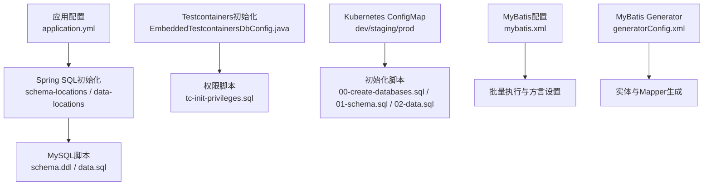
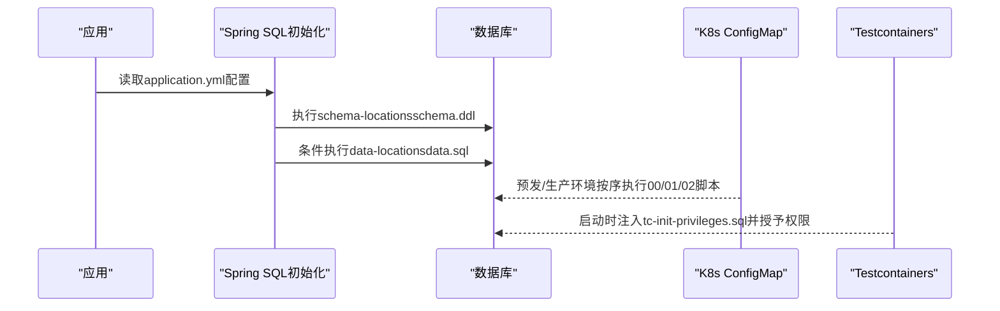
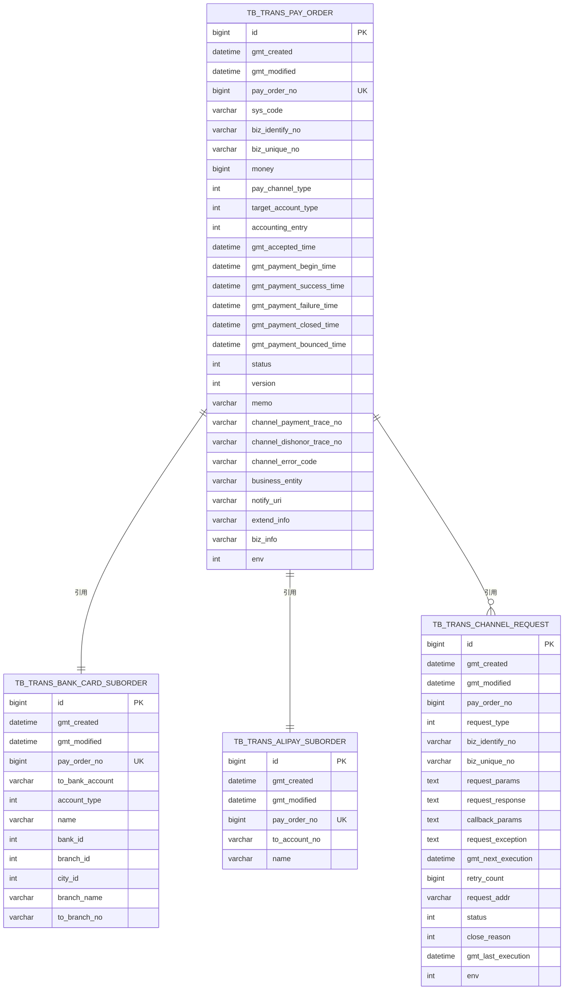
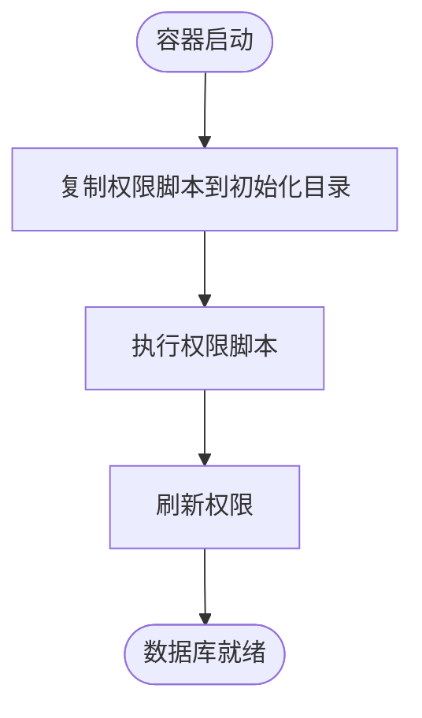
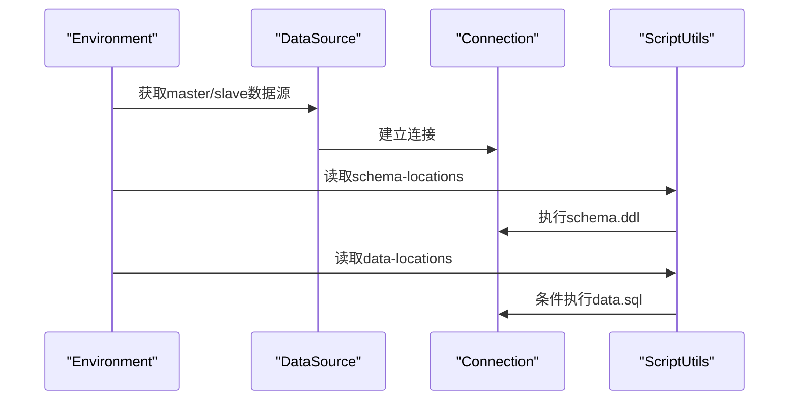
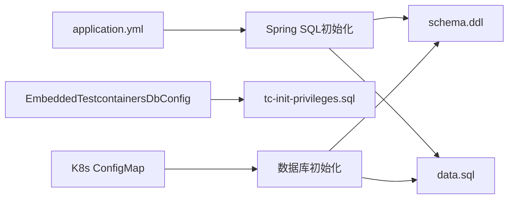

# SQL脚本管理

<cite>
**本文档引用的文件**
- [schema.ddl](file://biz-service-impl/src/main/resources/sql/mysql/schema.ddl)
- [data.sql](file://biz-service-impl/src/main/resources/sql/mysql/data.sql)
- [tc-init-privileges.sql](file://common-dal/src/main/resources/sql/tc-init-privileges.sql)
- [EmbeddedTestcontainersDbConfig.java](file://common-dal/src/main/java/com/magicliang/transaction/sys/common/dal/datasource/EmbeddedTestcontainersDbConfig.java)
- [EmbeddedMariaDbConfig.java](file://common-dal/src/main/java/com/magicliang/transaction/sys/common/dal/datasource/EmbeddedMariaDbConfig.java)
- [application.yml](file://biz-service-impl/src/main/resources/application.yml)
- [02-mariadb-init-configmap.yaml](file://deploy/k8s/dev/02-mariadb-init-configmap.yaml)
- [02-mariadb-init-configmap.yaml](file://deploy/k8s/staging/02-mariadb-init-configmap.yaml)
- [02-mariadb-init-configmap.yaml](file://deploy/k8s/prod/02-mariadb-init-configmap.yaml)
- [mybatis.xml](file://biz-service-impl/src/main/resources/mybatis/mybatis.xml)
- [generatorConfig.xml](file://common-dal/src/main/resources/autogen/generatorConfig.xml)
</cite>

## 目录
1. [简介](#简介)
2. [项目结构](#项目结构)
3. [核心组件](#核心组件)
4. [架构总览](#架构总览)
5. [详细组件分析](#详细组件分析)
6. [依赖分析](#依赖分析)
7. [性能考虑](#性能考虑)
8. [故障排查指南](#故障排查指南)
9. [结论](#结论)
10. [附录](#附录)

## 简介
本文件面向SQL脚本管理，系统化梳理该仓库中数据库脚本的组织方式、命名规范、DDL/DML分类管理、schema设计思想、数据初始化策略、权限初始化脚本实现、版本管理与回滚思路、性能优化建议，以及数据库迁移最佳实践。文档同时结合项目中的Spring Boot配置、Testcontainers/MariaDB嵌入式数据库初始化、Kubernetes ConfigMap初始化脚本等实际实现，给出可落地的实施建议。

## 项目结构
SQL脚本位于资源目录中，按数据库类型分层存放：
- MySQL脚本：biz-service-impl/src/main/resources/sql/mysql
  - schema.ddl：数据库结构定义（DDL）
  - data.sql：种子数据占位（DML）
- MariaDB嵌入式测试初始化：common-dal/src/main/resources/sql/tc-init-privileges.sql
- Kubernetes初始化脚本：deploy/k8s/*/02-mariadb-init-configmap.yaml（包含数据库创建、schema与data占位）

图表来源
- [application.yml:108-140](file://biz-service-impl/src/main/resources/application.yml#L108-L140)
- [EmbeddedTestcontainersDbConfig.java:48-62](file://common-dal/src/main/java/com/magicliang/transaction/sys/common/dal/datasource/EmbeddedTestcontainersDbConfig.java#L48-L62)
- [02-mariadb-init-configmap.yaml:10-224](file://deploy/k8s/dev/02-mariadb-init-configmap.yaml#L10-L224)
- [mybatis.xml:1-18](file://biz-service-impl/src/main/resources/mybatis/mybatis.xml#L1-L18)
- [generatorConfig.xml:47-61](file://common-dal/src/main/resources/autogen/generatorConfig.xml#L47-L61)

章节来源
- [application.yml:108-140](file://biz-service-impl/src/main/resources/application.yml#L108-L140)
- [EmbeddedTestcontainersDbConfig.java:48-62](file://common-dal/src/main/java/com/magicliang/transaction/sys/common/dal/datasource/EmbeddedTestcontainersDbConfig.java#L48-L62)
- [02-mariadb-init-configmap.yaml:10-224](file://deploy/k8s/dev/02-mariadb-init-configmap.yaml#L10-L224)
- [mybatis.xml:1-18](file://biz-service-impl/src/main/resources/mybatis/mybatis.xml#L1-L18)
- [generatorConfig.xml:47-61](file://common-dal/src/main/resources/autogen/generatorConfig.xml#L47-L61)

## 核心组件
- DDL脚本（schema.ddl）
  - 定义核心领域表：支付订单、银行卡子订单、支付宝子订单、渠道请求等
  - 明确字段命名规范、约束与索引策略
- DML脚本（data.sql）
  - 当前为空，预留种子数据占位
- 权限初始化脚本（tc-init-privileges.sql）
  - 为Testcontainers场景授予test用户全局权限，便于动态创建数据库
- Spring SQL初始化
  - 通过application.yml配置schema-locations与data-locations，结合ScriptUtils执行
- Kubernetes初始化
  - 通过ConfigMap提供00-create-databases.sql、01-schema.sql、02-data.sql，按顺序执行

章节来源
- [schema.ddl:1-145](file://biz-service-impl/src/main/resources/sql/mysql/schema.ddl#L1-L145)
- [data.sql:1-2](file://biz-service-impl/src/main/resources/sql/mysql/data.sql#L1-L2)
- [tc-init-privileges.sql:1-4](file://common-dal/src/main/resources/sql/tc-init-privileges.sql#L1-L4)
- [application.yml:108-140](file://biz-service-impl/src/main/resources/application.yml#L108-L140)
- [02-mariadb-init-configmap.yaml:10-224](file://deploy/k8s/dev/02-mariadb-init-configmap.yaml#L10-L224)

## 架构总览
SQL脚本管理贯穿开发、测试、预发、生产四类环境，采用“配置驱动 + 资源脚本 + 容器/集群初始化”的组合方式：

图表来源
- [application.yml:108-140](file://biz-service-impl/src/main/resources/application.yml#L108-L140)
- [EmbeddedTestcontainersDbConfig.java:119-136](file://common-dal/src/main/java/com/magicliang/transaction/sys/common/dal/datasource/EmbeddedTestcontainersDbConfig.java#L119-L136)
- [02-mariadb-init-configmap.yaml:10-224](file://deploy/k8s/dev/02-mariadb-init-configmap.yaml#L10-L224)

## 详细组件分析

### DDL脚本：schema.ddl 设计理念
- 表结构定义
  - 聚合根表：tb_trans_pay_order
  - 子订单表：tb_trans_bank_card_suborder、tb_trans_alipay_suborder
  - 渠道请求表：tb_trans_channel_request
- 约束与索引
  - 主键：单表唯一自增主键
  - 唯一索引：业务主键、上游业务号+标识码组合
  - 辅助索引：状态+修改时间、下次执行时间+状态、上游业务号+标识码
- 字段设计要点
  - 时间字段：gmt_created/gmt_modified统一默认值策略
  - 版本字段：version默认值确保幂等
  - JSON/扩展信息：extend_info、biz_info以VARCHAR存储并约定JSON格式
  - 环境字段：env用于区分dev/test/staging/prod
- 引擎与字符集
  - InnoDB引擎、utf8mb4字符集与排序规则

图表来源
- [schema.ddl:9-78](file://biz-service-impl/src/main/resources/sql/mysql/schema.ddl#L9-L78)
- [schema.ddl:84-103](file://biz-service-impl/src/main/resources/sql/mysql/schema.ddl#L84-L103)
- [schema.ddl:106-117](file://biz-service-impl/src/main/resources/sql/mysql/schema.ddl#L106-L117)
- [schema.ddl:120-144](file://biz-service-impl/src/main/resources/sql/mysql/schema.ddl#L120-L144)

章节来源
- [schema.ddl:1-145](file://biz-service-impl/src/main/resources/sql/mysql/schema.ddl#L1-L145)

### DML脚本：data.sql 数据初始化策略
- 当前内容
  - 仅包含注释占位，未包含实际INSERT语句
- 初始化策略建议
  - 种子数据准备：按表依赖顺序插入，先子订单后主订单
  - 依赖关系处理：子订单pay_order_no引用主订单pay_order_no
  - 环境差异：通过profile切换不同data.sql或在K8s ConfigMap中按环境提供
- 执行时机
  - Spring SQL初始化阶段按配置执行（若存在内容）

章节来源
- [data.sql:1-2](file://biz-service-impl/src/main/resources/sql/mysql/data.sql#L1-L2)
- [application.yml:108-140](file://biz-service-impl/src/main/resources/application.yml#L108-L140)

### 权限初始化：tc-init-privileges.sql
- 目标
  - 为Testcontainers中的test用户授予全局权限，允许其创建额外数据库
- 执行位置
  - EmbeddedTestcontainersDbConfig在容器启动时将脚本复制至/docker-entrypoint-initdb.d并执行
- 安全建议
  - 仅在测试环境使用；生产环境应使用最小权限原则

图表来源
- [EmbeddedTestcontainersDbConfig.java:54-56](file://common-dal/src/main/java/com/magicliang/transaction/sys/common/dal/datasource/EmbeddedTestcontainersDbConfig.java#L54-L56)
- [EmbeddedTestcontainersDbConfig.java:119-136](file://common-dal/src/main/java/com/magicliang/transaction/sys/common/dal/datasource/EmbeddedTestcontainersDbConfig.java#L119-L136)
- [tc-init-privileges.sql:1-4](file://common-dal/src/main/resources/sql/tc-init-privileges.sql#L1-L4)

章节来源
- [EmbeddedTestcontainersDbConfig.java:54-56](file://common-dal/src/main/java/com/magicliang/transaction/sys/common/dal/datasource/EmbeddedTestcontainersDbConfig.java#L54-L56)
- [EmbeddedTestcontainersDbConfig.java:119-136](file://common-dal/src/main/java/com/magicliang/transaction/sys/common/dal/datasource/EmbeddedTestcontainersDbConfig.java#L119-L136)
- [tc-init-privileges.sql:1-4](file://common-dal/src/main/resources/sql/tc-init-privileges.sql#L1-L4)

### Spring SQL初始化与脚本加载
- 配置项
  - schema-locations：指向schema.ddl
  - data-locations：指向data.sql
- 执行逻辑
  - EmbeddedTestcontainersDbConfig与EmbeddedMariaDbConfig均通过ScriptUtils执行脚本
  - hasContent方法会过滤注释与空白，避免空脚本误执行

图表来源
- [application.yml:108-140](file://biz-service-impl/src/main/resources/application.yml#L108-L140)
- [EmbeddedTestcontainersDbConfig.java:122-132](file://common-dal/src/main/java/com/magicliang/transaction/sys/common/dal/datasource/EmbeddedTestcontainersDbConfig.java#L122-L132)
- [EmbeddedMariaDbConfig.java:71-76](file://common-dal/src/main/java/com/magicliang/transaction/sys/common/dal/datasource/EmbeddedMariaDbConfig.java#L71-L76)

章节来源
- [application.yml:108-140](file://biz-service-impl/src/main/resources/application.yml#L108-L140)
- [EmbeddedTestcontainersDbConfig.java:122-132](file://common-dal/src/main/java/com/magicliang/transaction/sys/common/dal/datasource/EmbeddedTestcontainersDbConfig.java#L122-L132)
- [EmbeddedMariaDbConfig.java:71-76](file://common-dal/src/main/java/com/magicliang/transaction/sys/common/dal/datasource/EmbeddedMariaDbConfig.java#L71-L76)

### Kubernetes环境初始化
- ConfigMap结构
  - 00-create-databases.sql：创建主库与从库
  - 01-schema.sql：按顺序创建各表（与schema.ddl一致）
  - 02-data.sql：种子数据占位（当前为空）
- 执行顺序
  - 通过文件名前缀00/01/02确保顺序执行
- 环境差异
  - dev/staging/prod三套ConfigMap，分别对应不同命名空间与数据库

章节来源
- [02-mariadb-init-configmap.yaml:10-224](file://deploy/k8s/dev/02-mariadb-init-configmap.yaml#L10-L224)
- [02-mariadb-init-configmap.yaml:10-222](file://deploy/k8s/staging/02-mariadb-init-configmap.yaml#L10-L222)
- [02-mariadb-init-configmap.yaml:10-222](file://deploy/k8s/prod/02-mariadb-init-configmap.yaml#L10-L222)

### MyBatis与脚本生成
- MyBatis配置
  - dialect=mysql，关闭二级缓存，启用BATCH执行类型
- 代码生成
  - generatorConfig.xml针对四张核心表生成PO与Mapper，含自增主键配置

章节来源
- [mybatis.xml:1-18](file://biz-service-impl/src/main/resources/mybatis/mybatis.xml#L1-L18)
- [generatorConfig.xml:47-61](file://common-dal/src/main/resources/autogen/generatorConfig.xml#L47-L61)

## 依赖分析
- 组件耦合
  - application.yml与Spring SQL初始化强耦合，决定脚本加载路径
  - Testcontainers与权限脚本耦合，保障容器内数据库可用
  - ConfigMap与K8s部署强耦合，决定生产/预发初始化顺序
- 外部依赖
  - MariaDB驱动与Spring JDBC初始化工具
  - MyBatis Generator与MyBatis运行时

图表来源
- [application.yml:108-140](file://biz-service-impl/src/main/resources/application.yml#L108-L140)
- [EmbeddedTestcontainersDbConfig.java:54-56](file://common-dal/src/main/java/com/magicliang/transaction/sys/common/dal/datasource/EmbeddedTestcontainersDbConfig.java#L54-L56)
- [02-mariadb-init-configmap.yaml:10-224](file://deploy/k8s/dev/02-mariadb-init-configmap.yaml#L10-L224)

章节来源
- [application.yml:108-140](file://biz-service-impl/src/main/resources/application.yml#L108-L140)
- [EmbeddedTestcontainersDbConfig.java:54-56](file://common-dal/src/main/java/com/magicliang/transaction/sys/common/dal/datasource/EmbeddedTestcontainersDbConfig.java#L54-L56)
- [02-mariadb-init-configmap.yaml:10-224](file://deploy/k8s/dev/02-mariadb-init-configmap.yaml#L10-L224)

## 性能考虑
- 索引设计
  - 状态+修改时间索引适用于按状态筛选与时间窗口查询
  - 下次执行时间+状态索引服务于定时任务调度
  - 上游业务号+标识码索引服务于幂等与溯源
- 查询优化
  - 避免SELECT *，限定字段
  - 使用EXPLAIN分析执行计划，关注回表与临时表
  - 控制排序范围，必要时使用覆盖索引
- 批量操作
  - MyBatis默认BATCH执行类型，适合高吞吐写入
  - 合理控制批次大小，平衡内存与IO

## 故障排查指南
- 初始化失败
  - 检查application.yml中schema-locations与data-locations是否正确
  - 确认data.sql是否存在有效SQL（hasContent会过滤注释与空白）
- 权限问题
  - Testcontainers环境下确认tc-init-privileges.sql已注入并执行
  - 生产/预发环境下检查K8s ConfigMap中00/01/02脚本顺序
- 环境差异
  - 通过Spring Profile切换不同初始化策略
  - K8s环境通过命名空间与ConfigMap区分dev/staging/prod

章节来源
- [application.yml:108-140](file://biz-service-impl/src/main/resources/application.yml#L108-L140)
- [EmbeddedTestcontainersDbConfig.java:138-147](file://common-dal/src/main/java/com/magicliang/transaction/sys/common/dal/datasource/EmbeddedTestcontainersDbConfig.java#L138-L147)
- [02-mariadb-init-configmap.yaml:10-224](file://deploy/k8s/dev/02-mariadb-init-configmap.yaml#L10-L224)

## 结论
本项目通过“配置驱动 + 资源脚本 + 容器/集群初始化”的方式实现了SQL脚本的规范化管理。DDL与DML分离、索引与约束清晰、初始化流程可控，配合MyBatis生成器形成从数据库到代码的闭环。建议后续完善data.sql种子数据与回滚策略，进一步强化版本管理与环境差异处理。

## 附录

### SQL脚本版本管理与回滚建议
- 版本化命名
  - DDL：schema_ddl_v1.0.sql、schema_ddl_v1.1.sql
  - DML：data_sql_v1.0_seed.sql、data_sql_v1.1_seed.sql
- 变更记录
  - 在脚本头部添加变更说明、负责人、日期、影响范围
- 回滚策略
  - 为关键DDL提供反向SQL（如删除索引、回滚字段）
  - DML回滚通过事务或幂等插入策略实现
- 环境差异
  - 通过Spring Profile与K8s ConfigMap分别管理不同环境脚本

### 数据库迁移最佳实践
- 向后兼容
  - 新增字段保持默认值，避免ALTER TABLE阻塞
  - 使用条件迁移（仅在旧版本存在时执行）
- 零停机更新
  - 先加索引/列，再切换逻辑，最后清理旧逻辑
  - 使用影子表或灰度发布
- 数据一致性
  - 事务包裹关键写入
  - 通过校验脚本与监控保障数据完整性