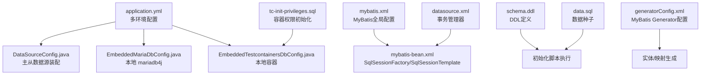
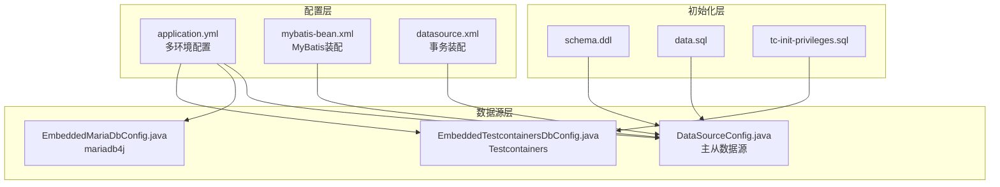
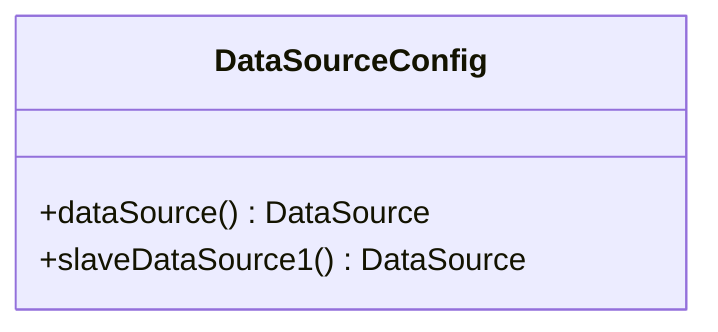
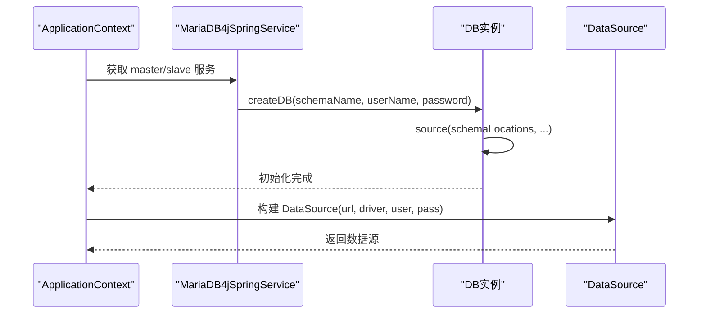
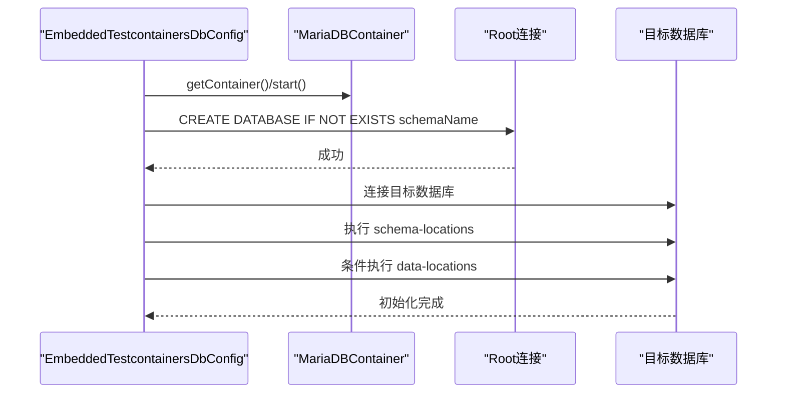
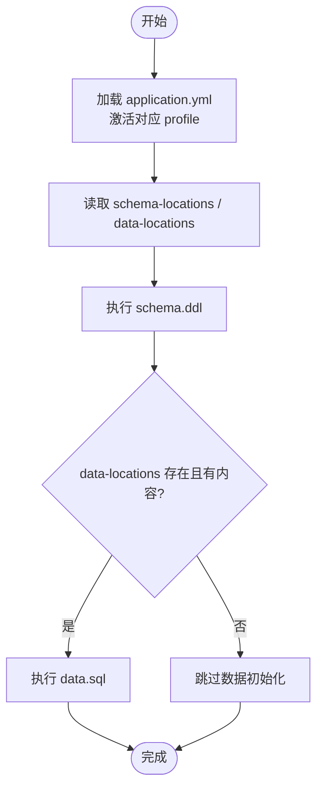
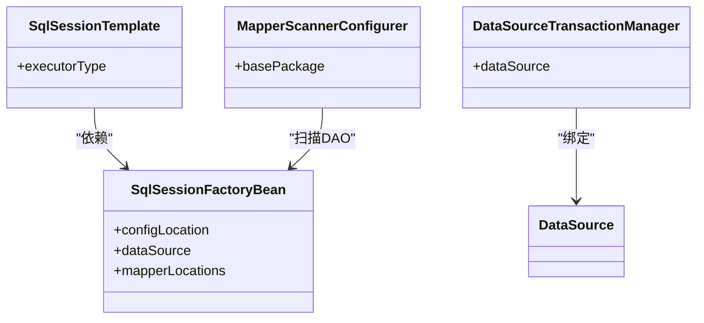
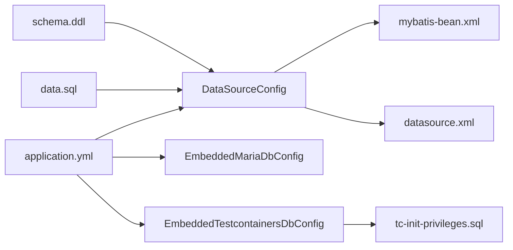

# 数据库配置管理

<cite>
**本文档引用的文件**
- [DataSourceConfig.java](file://common-dal/src/main/java/com/magicliang/transaction/sys/common/dal/datasource/DataSourceConfig.java)
- [EmbeddedMariaDbConfig.java](file://common-dal/src/main/java/com/magicliang/transaction/sys/common/dal/datasource/EmbeddedMariaDbConfig.java)
- [EmbeddedTestcontainersDbConfig.java](file://common-dal/src/main/java/com/magicliang/transaction/sys/common/dal/datasource/EmbeddedTestcontainersDbConfig.java)
- [application.yml](file://biz-service-impl/src/main/resources/application.yml)
- [datasource.xml](file://biz-service-impl/src/main/resources/spring/datasource.xml)
- [mybatis.xml](file://biz-service-impl/src/main/resources/mybatis/mybatis.xml)
- [mybatis-bean.xml](file://biz-service-impl/src/main/resources/spring/mybatis-bean.xml)
- [schema.ddl](file://biz-service-impl/src/main/resources/sql/mysql/schema.ddl)
- [data.sql](file://biz-service-impl/src/main/resources/sql/mysql/data.sql)
- [tc-init-privileges.sql](file://common-dal/src/main/resources/sql/tc-init-privileges.sql)
- [generatorConfig.xml](file://common-dal/src/main/resources/autogen/generatorConfig.xml)
- [DbUtils.java](file://common-util/src/main/java/com/magicliang/transaction/sys/common/util/DbUtils.java)
- [DbErrorCode.java](file://common-util/src/main/java/com/magicliang/transaction/sys/common/constant/DbErrorCode.java)
</cite>

## 目录
1. [简介](#简介)
2. [项目结构](#项目结构)
3. [核心组件](#核心组件)
4. [架构总览](#架构总览)
5. [详细组件分析](#详细组件分析)
6. [依赖分析](#依赖分析)
7. [性能考量](#性能考量)
8. [故障排查指南](#故障排查指南)
9. [结论](#结论)
10. [附录](#附录)

## 简介
本文件聚焦数据库配置管理，系统性解析多数据源配置的实现机制（主从库分离、读写分离与负载均衡策略）、DataSourceConfig 的配置参数（连接池大小、超时设置、连接验证）、嵌入式数据库配置（EmbeddedMariaDbConfig 与 EmbeddedTestcontainersDbConfig 的实现原理）、数据库初始化脚本组织（DDL 定义、数据种子与环境适配策略），并提供连接池性能调优、监控与故障排查、备份恢复策略的实施要点。

## 项目结构
围绕数据库配置的关键模块分布如下：
- 配置层：application.yml 提供多环境 profile 配置；XML 配置用于 MyBatis 与事务管理器装配。
- 数据源层：DataSourceConfig（生产/集群）、EmbeddedMariaDbConfig（本地 mariadb4j）、EmbeddedTestcontainersDbConfig（本地容器）。
- 初始化层：schema.ddl、data.sql、tc-init-privileges.sql。
- MyBatis 层：mybatis.xml、mybatis-bean.xml、generatorConfig.xml。

图表来源
- [application.yml:1-216](file://biz-service-impl/src/main/resources/application.yml#L1-L216)
- [DataSourceConfig.java:22-82](file://common-dal/src/main/java/com/magicliang/transaction/sys/common/dal/datasource/DataSourceConfig.java#L22-L82)
- [EmbeddedMariaDbConfig.java:37-184](file://common-dal/src/main/java/com/magicliang/transaction/sys/common/dal/datasource/EmbeddedMariaDbConfig.java#L37-L184)
- [EmbeddedTestcontainersDbConfig.java:35-154](file://common-dal/src/main/java/com/magicliang/transaction/sys/common/dal/datasource/EmbeddedTestcontainersDbConfig.java#L35-L154)
- [mybatis.xml:1-18](file://biz-service-impl/src/main/resources/mybatis/mybatis.xml#L1-L18)
- [mybatis-bean.xml:1-30](file://biz-service-impl/src/main/resources/spring/mybatis-bean.xml#L1-L30)
- [datasource.xml:1-16](file://biz-service-impl/src/main/resources/spring/datasource.xml#L1-L16)
- [schema.ddl:1-145](file://biz-service-impl/src/main/resources/sql/mysql/schema.ddl#L1-L145)
- [data.sql:1-2](file://biz-service-impl/src/main/resources/sql/mysql/data.sql#L1-L2)
- [tc-init-privileges.sql:1-4](file://common-dal/src/main/resources/sql/tc-init-privileges.sql#L1-L4)
- [generatorConfig.xml:1-64](file://common-dal/src/main/resources/autogen/generatorConfig.xml#L1-L64)

章节来源
- [application.yml:1-216](file://biz-service-impl/src/main/resources/application.yml#L1-L216)
- [mybatis.xml:1-18](file://biz-service-impl/src/main/resources/mybatis/mybatis.xml#L1-L18)
- [mybatis-bean.xml:1-30](file://biz-service-impl/src/main/resources/spring/mybatis-bean.xml#L1-L30)
- [datasource.xml:1-16](file://biz-service-impl/src/main/resources/spring/datasource.xml#L1-L16)

## 核心组件
- 多数据源配置（生产/集群）
  - 主库与从库数据源通过 @Profile 激活，主数据源标注 @Primary，确保自动装配优先选择。
  - 生产/预发/线上环境使用原生 MySQL，配置 jdbc-url、用户名、密码、驱动与 Hikari 连接池参数。
- 嵌入式数据库（本地开发）
  - mariadb4j：启动本地 MariaDB 实例，按 schema-locations 执行 DDL，按 slave/master 配置创建两个 schema。
  - Testcontainers：启动真实 MariaDB 容器，单容器双数据库（test_master/test_slave1），通过不同 URL 访问。
- MyBatis 与事务
  - 通过 XML 配置 SqlSessionFactory、SqlSessionTemplate 与 DataSourceTransactionManager，确保事务管理器与数据源一致。

章节来源
- [DataSourceConfig.java:22-82](file://common-dal/src/main/java/com/magicliang/transaction/sys/common/dal/datasource/DataSourceConfig.java#L22-L82)
- [EmbeddedMariaDbConfig.java:37-184](file://common-dal/src/main/java/com/magicliang/transaction/sys/common/dal/datasource/EmbeddedMariaDbConfig.java#L37-L184)
- [EmbeddedTestcontainersDbConfig.java:35-154](file://common-dal/src/main/java/com/magicliang/transaction/sys/common/dal/datasource/EmbeddedTestcontainersDbConfig.java#L35-L154)
- [datasource.xml:7-14](file://biz-service-impl/src/main/resources/spring/datasource.xml#L7-L14)

## 架构总览
下图展示数据库配置在不同环境下的装配路径与职责边界：

图表来源
- [application.yml:67-216](file://biz-service-impl/src/main/resources/application.yml#L67-L216)
- [DataSourceConfig.java:22-82](file://common-dal/src/main/java/com/magicliang/transaction/sys/common/dal/datasource/DataSourceConfig.java#L22-L82)
- [EmbeddedMariaDbConfig.java:37-184](file://common-dal/src/main/java/com/magicliang/transaction/sys/common/dal/datasource/EmbeddedMariaDbConfig.java#L37-L184)
- [EmbeddedTestcontainersDbConfig.java:35-154](file://common-dal/src/main/java/com/magicliang/transaction/sys/common/dal/datasource/EmbeddedTestcontainersDbConfig.java#L35-L154)
- [mybatis-bean.xml:6-28](file://biz-service-impl/src/main/resources/spring/mybatis-bean.xml#L6-L28)
- [datasource.xml:7-14](file://biz-service-impl/src/main/resources/spring/datasource.xml#L7-L14)
- [schema.ddl:1-145](file://biz-service-impl/src/main/resources/sql/mysql/schema.ddl#L1-L145)
- [data.sql:1-2](file://biz-service-impl/src/main/resources/sql/mysql/data.sql#L1-L2)
- [tc-init-privileges.sql:1-4](file://common-dal/src/main/resources/sql/tc-init-privileges.sql#L1-L4)

## 详细组件分析

### 多数据源配置（DataSourceConfig）
- 功能定位
  - 在本地/集群环境下装配主库与从库数据源，主数据源标注 @Primary，确保 MyBatis/事务管理器默认使用主库。
  - 通过 @Profile 激活不同环境，避免在不适用的环境中加载无关配置。
- 关键点
  - 使用 @ConfigurationProperties 绑定 spring.datasource.master 与 spring.datasource.slave1 前缀的属性。
  - 生产/预发/线上环境采用 Hikari 连接池，配置最小空闲、最大池大小、最大存活时间、连接超时与连接测试查询。
  - 未启用动态数据源 Starter，采用显式装配方式，便于控制与调试。
- 读写分离与负载均衡
  - 该配置仅提供多数据源装配，未内置读写分离路由或负载均衡策略。若需实现读写分离，可在 MyBatis 层面通过注解或 XML 显式指定从库数据源，或引入中间件/路由组件。

图表来源
- [DataSourceConfig.java:22-82](file://common-dal/src/main/java/com/magicliang/transaction/sys/common/dal/datasource/DataSourceConfig.java#L22-L82)

章节来源
- [DataSourceConfig.java:22-82](file://common-dal/src/main/java/com/magicliang/transaction/sys/common/dal/datasource/DataSourceConfig.java#L22-L82)
- [application.yml:148-216](file://biz-service-impl/src/main/resources/application.yml#L148-L216)

### 嵌入式数据库（EmbeddedMariaDbConfig）
- 实现原理
  - 通过 MariaDB4jSpringService 启动本地 MariaDB 实例，按配置端口与凭据创建 master/slave 数据库。
  - 使用 DB.source 执行 schema-locations 指定的 DDL 初始化脚本。
  - 为兼容 mariadb jdbc 驱动，对 URL 添加 permitMysqlScheme 参数。
- 适用场景
  - 本地开发/测试，无需外部数据库，快速拉起双库环境。
- 注意事项
  - 需要正确设置端口与 schema 名称；初始化失败抛出业务异常。
  - 若使用 Hikari，需在初始化阶段显式指定 schema 初始化策略。

图表来源
- [EmbeddedMariaDbConfig.java:55-135](file://common-dal/src/main/java/com/magicliang/transaction/sys/common/dal/datasource/EmbeddedMariaDbConfig.java#L55-L135)

章节来源
- [EmbeddedMariaDbConfig.java:37-184](file://common-dal/src/main/java/com/magicliang/transaction/sys/common/dal/datasource/EmbeddedMariaDbConfig.java#L37-L184)
- [application.yml:82-120](file://biz-service-impl/src/main/resources/application.yml#L82-L120)

### 嵌入式数据库（EmbeddedTestcontainersDbConfig）
- 实现原理
  - 单例 MariaDBContainer，首次访问时启动容器，复制权限初始化脚本至 /docker-entrypoint-initdb.d。
  - 通过 root 用户创建目标数据库（test 用户具备全局权限），随后执行 schema-locations 与 data-locations。
  - 通过不同数据库名拼接 JDBC URL，实现 master 与 slave 的双 schema 访问。
- 适用场景
  - 本地开发/CI，需要与真实 MariaDB 行为一致的容器化环境。
- 注意事项
  - 容器随 JVM 生命周期启动/停止，退出时由 Ryuk 清理。
  - schema/data 脚本通过 ClassPathResource 加载，支持条件执行与内容校验。

图表来源
- [EmbeddedTestcontainersDbConfig.java:43-152](file://common-dal/src/main/java/com/magicliang/transaction/sys/common/dal/datasource/EmbeddedTestcontainersDbConfig.java#L43-L152)
- [tc-init-privileges.sql:1-4](file://common-dal/src/main/resources/sql/tc-init-privileges.sql#L1-L4)

章节来源
- [EmbeddedTestcontainersDbConfig.java:35-154](file://common-dal/src/main/java/com/magicliang/transaction/sys/common/dal/datasource/EmbeddedTestcontainersDbConfig.java#L35-L154)
- [application.yml:121-147](file://biz-service-impl/src/main/resources/application.yml#L121-L147)

### 数据库初始化脚本组织
- DDL 定义
  - schema.ddl 定义核心业务表（支付订单、银行卡子订单、支付宝子订单、渠道请求），包含主键、唯一索引、普通索引与注释。
- 数据种子
  - data.sql 当前为空，预留测试数据注入入口。
- 环境适配
  - application.yml 通过 spring.config.activate.on-profile 控制不同环境的初始化策略与脚本路径。
  - Testcontainers 场景下通过 tc-init-privileges.sql 授予 test 用户全局权限，以便动态创建数据库。

图表来源
- [application.yml:108-140](file://biz-service-impl/src/main/resources/application.yml#L108-L140)
- [schema.ddl:1-145](file://biz-service-impl/src/main/resources/sql/mysql/schema.ddl#L1-L145)
- [data.sql:1-2](file://biz-service-impl/src/main/resources/sql/mysql/data.sql#L1-L2)
- [tc-init-privileges.sql:1-4](file://common-dal/src/main/resources/sql/tc-init-privileges.sql#L1-L4)

章节来源
- [schema.ddl:1-145](file://biz-service-impl/src/main/resources/sql/mysql/schema.ddl#L1-L145)
- [data.sql:1-2](file://biz-service-impl/src/main/resources/sql/mysql/data.sql#L1-L2)
- [application.yml:108-140](file://biz-service-impl/src/main/resources/application.yml#L108-L140)

### MyBatis 与事务管理
- MyBatis 配置
  - mybatis.xml 关闭二级缓存、降低一级缓存作用域、默认批处理执行器，适配高吞吐交易场景。
  - mybatis-bean.xml 通过 SqlSessionFactoryBean 引用全局配置与数据源，MapperScannerConfigurer 扫描 DAO 接口。
- 事务管理
  - datasource.xml 将 DataSourceTransactionManager 绑定到默认数据源，确保事务生效。

图表来源
- [mybatis.xml:1-18](file://biz-service-impl/src/main/resources/mybatis/mybatis.xml#L1-L18)
- [mybatis-bean.xml:6-28](file://biz-service-impl/src/main/resources/spring/mybatis-bean.xml#L6-L28)
- [datasource.xml:7-14](file://biz-service-impl/src/main/resources/spring/datasource.xml#L7-L14)

章节来源
- [mybatis.xml:1-18](file://biz-service-impl/src/main/resources/mybatis/mybatis.xml#L1-L18)
- [mybatis-bean.xml:1-30](file://biz-service-impl/src/main/resources/spring/mybatis-bean.xml#L1-L30)
- [datasource.xml:1-16](file://biz-service-impl/src/main/resources/spring/datasource.xml#L1-L16)

## 依赖分析
- 组件耦合
  - DataSourceConfig 与 application.yml 强耦合，通过 @Profile 与 @ConfigurationProperties 解耦具体实现。
  - EmbeddedMariaDbConfig/EmbeddedTestcontainersDbConfig 依赖环境变量与脚本资源，彼此独立。
  - MyBatis XML 配置与数据源装配强耦合，需确保事务管理器与数据源一致。
- 外部依赖
  - HikariCP（连接池）、Testcontainers（容器化）、MariaDB4j（嵌入式 DB）。
- 潜在风险
  - 多数据源未内置读写分离路由，需在业务层或中间件层面补充。
  - 嵌入式方案与生产环境差异（mariadb4j vs MariaDB 容器）需在 CI/本地保持一致性。

图表来源
- [application.yml:1-216](file://biz-service-impl/src/main/resources/application.yml#L1-L216)
- [DataSourceConfig.java:22-82](file://common-dal/src/main/java/com/magicliang/transaction/sys/common/dal/datasource/DataSourceConfig.java#L22-L82)
- [EmbeddedMariaDbConfig.java:37-184](file://common-dal/src/main/java/com/magicliang/transaction/sys/common/dal/datasource/EmbeddedMariaDbConfig.java#L37-L184)
- [EmbeddedTestcontainersDbConfig.java:35-154](file://common-dal/src/main/java/com/magicliang/transaction/sys/common/dal/datasource/EmbeddedTestcontainersDbConfig.java#L35-L154)
- [mybatis-bean.xml:1-30](file://biz-service-impl/src/main/resources/spring/mybatis-bean.xml#L1-L30)
- [datasource.xml:1-16](file://biz-service-impl/src/main/resources/spring/datasource.xml#L1-L16)
- [schema.ddl:1-145](file://biz-service-impl/src/main/resources/sql/mysql/schema.ddl#L1-L145)
- [data.sql:1-2](file://biz-service-impl/src/main/resources/sql/mysql/data.sql#L1-L2)
- [tc-init-privileges.sql:1-4](file://common-dal/src/main/resources/sql/tc-init-privileges.sql#L1-L4)

章节来源
- [application.yml:1-216](file://biz-service-impl/src/main/resources/application.yml#L1-L216)
- [mybatis-bean.xml:1-30](file://biz-service-impl/src/main/resources/spring/mybatis-bean.xml#L1-L30)
- [datasource.xml:1-16](file://biz-service-impl/src/main/resources/spring/datasource.xml#L1-L16)

## 性能考量
- 连接池参数建议
  - 最小空闲与最大池大小应结合 QPS 与平均事务时长评估，避免过大导致内存压力，过小导致连接等待。
  - 连接超时与最大存活时间需与应用超时策略匹配，防止长时间占用连接。
  - 连接测试查询（connectionTestQuery）用于健康检查，建议使用轻量查询。
- 连接复用与空闲管理
  - 使用批处理执行器（BATCH）减少往返开销；合理设置批大小与提交频率。
  - 监控空闲连接与活跃连接比例，调整最小空闲与最大池大小。
- 连接泄漏防护
  - 确保每个数据库操作均在 try-with-resources 或 finally 中关闭资源。
  - 使用连接池监控工具（如 HikariCP 自带指标）定期巡检。
- 读写分离与负载均衡
  - 未内置路由时，建议在 DAO 层通过注解或 XML 指定从库数据源，或引入中间件统一路由。
  - 从库读取采用轮询或权重策略，结合延迟阈值与复制延迟监控。

## 故障排查指南
- 常见问题定位
  - 连接失败：核对 jdbc-url、用户名/密码、驱动类名与网络连通性。
  - 初始化失败：检查 schema-locations 与 data-locations 是否存在、权限是否足够。
  - 事务无效：确认 DataSourceTransactionManager 与 SqlSessionFactory 使用同一数据源。
- 错误码与断言
  - DbUtils 提供统一的期望与实际条数断言，便于定位插入/更新/查询异常。
  - DbErrorCode 定义数据库操作异常类型，辅助错误分类与上报。

章节来源
- [DbUtils.java:20-110](file://common-util/src/main/java/com/magicliang/transaction/sys/common/util/DbUtils.java#L20-L110)
- [DbErrorCode.java:16-47](file://common-util/src/main/java/com/magicliang/transaction/sys/common/constant/DbErrorCode.java#L16-L47)

## 结论
本项目通过多环境配置与多种嵌入式方案，实现了灵活的数据库配置与初始化策略。DataSourceConfig 提供清晰的主从数据源装配，MyBatis 与事务 XML 配置确保了稳定的 ORM 与事务边界。生产/集群环境采用 Hikari 连接池与标准 JDBC URL，本地开发支持 mariadb4j 与 Testcontainers 两种嵌入式方案。若需进一步完善，建议在 DAO 层或中间件层面补充读写分离路由与负载均衡策略，并强化连接池监控与初始化脚本的幂等性。

## 附录
- MyBatis Generator 配置
  - generatorConfig.xml 定义了 JDBC 连接、模型与映射生成包路径，支持多表生成与注解映射。

章节来源
- [generatorConfig.xml:1-64](file://common-dal/src/main/resources/autogen/generatorConfig.xml#L1-L64)