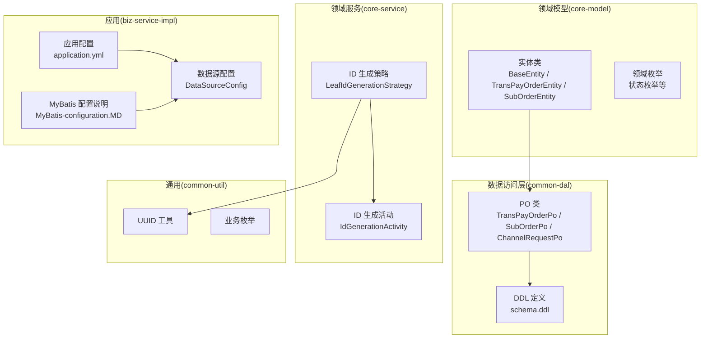
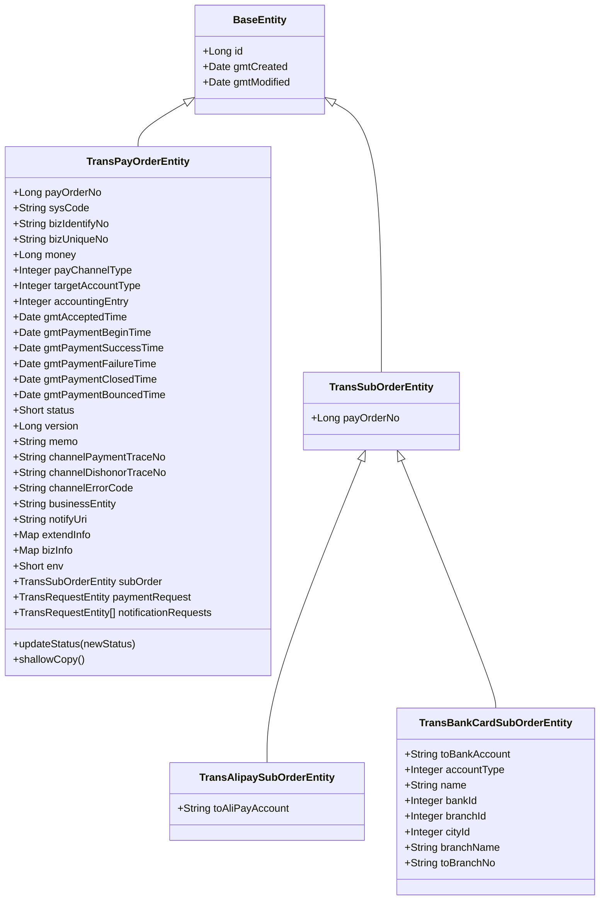
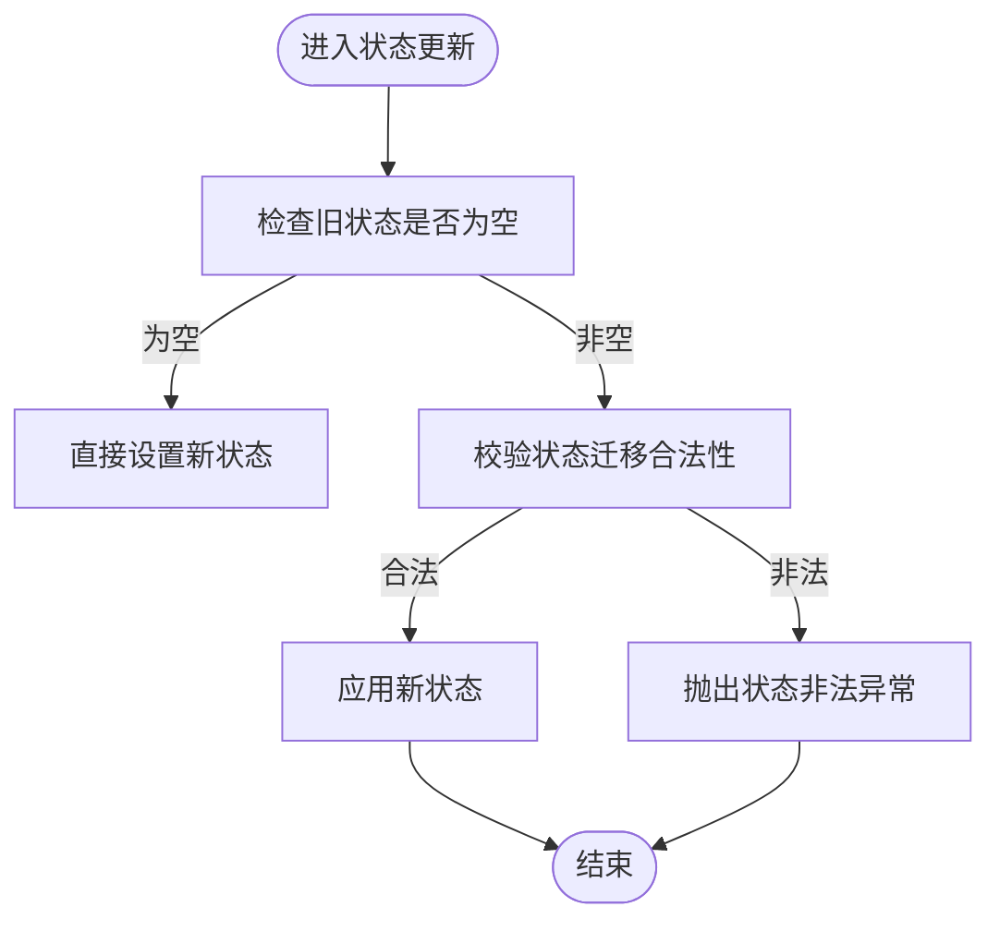
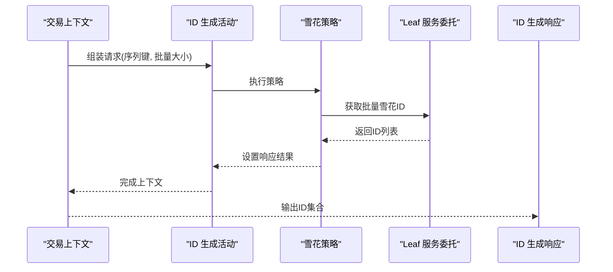
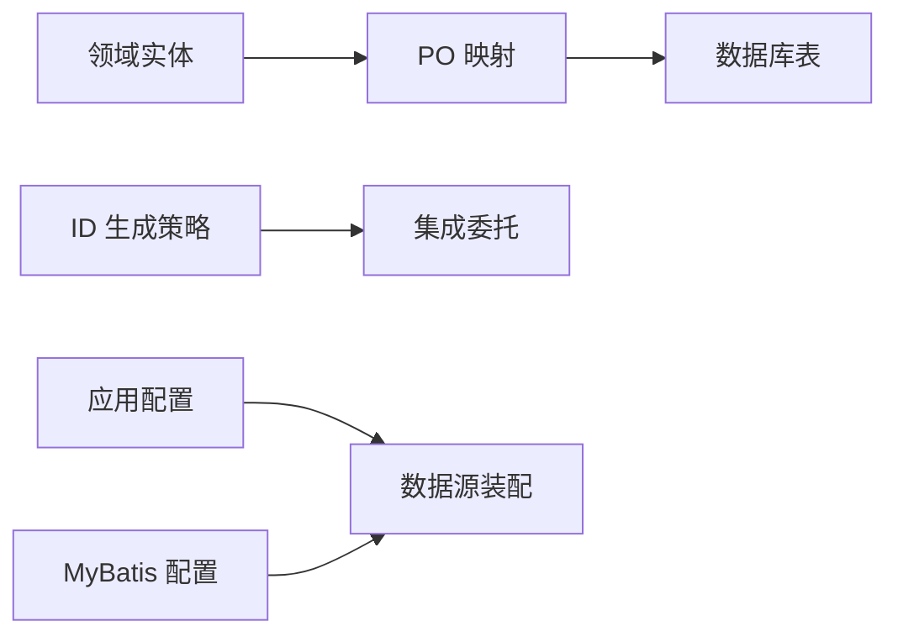

# 数据模型设计

<cite>
**本文引用的文件**   
- [TransPayOrderPo.java](file://common-dal/src/main/java/com/magicliang/transaction/sys/common/dal/mybatis/po/TransPayOrderPo.java)
- [TransAlipaySubOrderPo.java](file://common-dal/src/main/java/com/magicliang/transaction/sys/common/dal/mybatis/po/TransAlipaySubOrderPo.java)
- [TransBankCardSubOrderPo.java](file://common-dal/src/main/java/com/magicliang/transaction/sys/common/dal/mybatis/po/TransBankCardSubOrderPo.java)
- [TransChannelRequestPo.java](file://common-dal/src/main/java/com/magicliang/transaction/sys/common/dal/mybatis/po/TransChannelRequestPo.java)
- [BaseEntity.java](file://core-model/src/main/java/com/magicliang/transaction/sys/core/model/entity/BaseEntity.java)
- [TransPayOrderEntity.java](file://core-model/src/main/java/com/magicliang/transaction/sys/core/model/entity/TransPayOrderEntity.java)
- [TransSubOrderEntity.java](file://core-model/src/main/java/com/magicliang/transaction/sys/core/model/entity/TransSubOrderEntity.java)
- [TransAlipaySubOrderEntity.java](file://core-model/src/main/java/com/magicliang/transaction/sys/core/model/entity/TransAlipaySubOrderEntity.java)
- [schema.ddl](file://biz-service-impl/src/main/resources/sql/mysql/schema.ddl)
- [application.yml](file://biz-service-impl/src/main/resources/application.yml)
- [DataSourceConfig.java](file://common-dal/src/main/java/com/magicliang/transaction/sys/common/dal/datasource/DataSourceConfig.java)
- [MyBatis-configuration.MD](file://common-dal/src/main/java/com/magicliang/transaction/sys/common/dal/mybatis/MyBatis-configuration.MD)
- [TransPayOrderStatusEnum.java](file://common-util/src/main/java/com/magicliang/transaction/sys/common/enums/TransPayOrderStatusEnum.java)
- [UUIDGenerator.java](file://common-util/src/main/java/com/magicliang/transaction/sys/common/util/UUIDGenerator.java)
- [LeafIdGenerationStrategy.java](file://core-service/src/main/java/com/magicliang/transaction/sys/core/domain/strategy/idgeneration/LeafIdGenerationStrategy.java)
- [IdGenerationActivity.java](file://core-service/src/main/java/com/magicliang/transaction/sys/core/domain/activity/idgeneration/IdGenerationActivity.java)
- [IdGenerationStrategyEnum.java](file://core-service/src/main/java/com/magicliang/transaction/sys/core/domain/enums/IdGenerationStrategyEnum.java)
- [IdGenerationResponse.java](file://core-model/src/main/java/com/magicliang/transaction/sys/core/model/response/idgeneration/IdGenerationResponse.java)
</cite>

## 目录
1. [简介](#简介)
2. [项目结构](#项目结构)
3. [核心组件](#核心组件)
4. [架构总览](#架构总览)
5. [详细组件分析](#详细组件分析)
6. [依赖分析](#依赖分析)
7. [性能考量](#性能考量)
8. [故障排查指南](#故障排查指南)
9. [结论](#结论)
10. [附录](#附录)

## 简介
本文件面向交易系统的数据模型设计，系统采用领域驱动设计（DDD）思想，围绕“支付订单”聚合根构建，辅以子订单与通道请求等从属实体，形成清晰的领域边界与数据一致性保障。数据模型涵盖：
- 实体类设计与继承关系
- PO（持久化对象）字段定义、数据类型与约束
- ORM 映射与关系建模（一对一、一对多、多对多）
- 主键生成策略（自增、雪花算法、UUID）
- 索引设计策略（主键、唯一、复合索引）
- 数据模型演进与版本管理
- 数据完整性、外键与业务规则

## 项目结构
交易系统按模块划分，数据模型相关的关键模块如下：
- common-dal：数据访问层，包含 MyBatis PO 与数据库 DDL
- core-model：领域模型层，包含实体与值对象
- core-service：领域服务与策略层，包含 ID 生成策略与业务活动
- common-util：通用工具与枚举
- biz-service-impl：应用服务与资源（配置、SQL）

图表来源
- [schema.ddl:1-145](file://biz-service-impl/src/main/resources/sql/mysql/schema.ddl#L1-L145)
- [application.yml:1-216](file://biz-service-impl/src/main/resources/application.yml#L1-L216)
- [DataSourceConfig.java:1-82](file://common-dal/src/main/java/com/magicliang/transaction/sys/common/dal/datasource/DataSourceConfig.java#L1-L82)
- [MyBatis-configuration.MD:1-34](file://common-dal/src/main/java/com/magicliang/transaction/sys/common/dal/mybatis/MyBatis-configuration.MD#L1-L34)

章节来源
- [schema.ddl:1-145](file://biz-service-impl/src/main/resources/sql/mysql/schema.ddl#L1-L145)
- [application.yml:1-216](file://biz-service-impl/src/main/resources/application.yml#L1-L216)
- [DataSourceConfig.java:1-82](file://common-dal/src/main/java/com/magicliang/transaction/sys/common/dal/datasource/DataSourceConfig.java#L1-L82)
- [MyBatis-configuration.MD:1-34](file://common-dal/src/main/java/com/magicliang/transaction/sys/common/dal/mybatis/MyBatis-configuration.MD#L1-L34)

## 核心组件
- 聚合根：支付订单实体（TransPayOrderEntity），承载业务状态与版本控制，聚合内包含子订单与请求对象
- 子实体：银行卡子订单（TransBankCardSubOrderEntity）、支付宝子订单（TransAlipaySubOrderEntity）、通用子订单基类（TransSubOrderEntity）
- 通道请求：支付通道请求实体（TransChannelRequestPo），用于跟踪请求状态与重试
- 基类：基础实体（BaseEntity），统一 id、创建/修改时间字段
- 枚举：支付订单状态枚举（TransPayOrderStatusEnum），约束状态迁移
- 工具：UUID 生成器（UUIDGenerator），ID 生成策略（LeafIdGenerationStrategy）

章节来源
- [BaseEntity.java:1-37](file://core-model/src/main/java/com/magicliang/transaction/sys/core/model/entity/BaseEntity.java#L1-L37)
- [TransPayOrderEntity.java:1-216](file://core-model/src/main/java/com/magicliang/transaction/sys/core/model/entity/TransPayOrderEntity.java#L1-L216)
- [TransSubOrderEntity.java:1-24](file://core-model/src/main/java/com/magicliang/transaction/sys/core/model/entity/TransSubOrderEntity.java#L1-L24)
- [TransAlipaySubOrderEntity.java:1-24](file://core-model/src/main/java/com/magicliang/transaction/sys/core/model/entity/TransAlipaySubOrderEntity.java#L1-L24)
- [TransPayOrderStatusEnum.java:1-205](file://common-util/src/main/java/com/magicliang/transaction/sys/common/enums/TransPayOrderStatusEnum.java#L1-L205)
- [UUIDGenerator.java:1-44](file://common-util/src/main/java/com/magicliang/transaction/sys/common/util/UUIDGenerator.java#L1-L44)
- [LeafIdGenerationStrategy.java:1-58](file://core-service/src/main/java/com/magicliang/transaction/sys/core/domain/strategy/idgeneration/LeafIdGenerationStrategy.java#L1-L58)

## 架构总览
数据模型遵循“领域模型 → 持久化对象 → 数据库”的映射路径，ORM 层通过 MyBatis 将实体映射到表结构，应用层通过策略与活动完成 ID 生成与状态迁移。

图表来源
- [BaseEntity.java:1-37](file://core-model/src/main/java/com/magicliang/transaction/sys/core/model/entity/BaseEntity.java#L1-L37)
- [TransPayOrderEntity.java:1-216](file://core-model/src/main/java/com/magicliang/transaction/sys/core/model/entity/TransPayOrderEntity.java#L1-L216)
- [TransSubOrderEntity.java:1-24](file://core-model/src/main/java/com/magicliang/transaction/sys/core/model/entity/TransSubOrderEntity.java#L1-L24)
- [TransAlipaySubOrderEntity.java:1-24](file://core-model/src/main/java/com/magicliang/transaction/sys/core/model/entity/TransAlipaySubOrderEntity.java#L1-L24)

## 详细组件分析

### 支付订单实体（聚合根）
- 设计理念：以支付订单为核心聚合，封装状态机与版本号，确保并发安全与幂等更新
- 字段要点：业务主键 pay_order_no、上游标识 biz_identify_no/biz_unique_no、金额 money、通道类型 pay_channel_type、目标账户 target_account_type、会计分录 accounting_entry、各阶段时间戳、状态 status、版本 version、扩展信息 extend_info/biz_info、环境 env
- 状态迁移：通过状态枚举校验状态变迁合法性，防止非法跃迁

图表来源
- [TransPayOrderStatusEnum.java:175-203](file://common-util/src/main/java/com/magicliang/transaction/sys/common/enums/TransPayOrderStatusEnum.java#L175-L203)
- [TransPayOrderEntity.java:197-204](file://core-model/src/main/java/com/magicliang/transaction/sys/core/model/entity/TransPayOrderEntity.java#L197-L204)

章节来源
- [TransPayOrderEntity.java:1-216](file://core-model/src/main/java/com/magicliang/transaction/sys/core/model/entity/TransPayOrderEntity.java#L1-L216)
- [TransPayOrderStatusEnum.java:1-205](file://common-util/src/main/java/com/magicliang/transaction/sys/common/enums/TransPayOrderStatusEnum.java#L1-L205)

### 子订单实体
- 银行卡子订单：包含收款账户、账户类型、户名、银行/支行/城市标识、支行联行号等
- 支付宝子订单：包含目标支付宝账户
- 通用子订单：统一 pay_order_no 引用支付订单

章节来源
- [TransSubOrderEntity.java:1-24](file://core-model/src/main/java/com/magicliang/transaction/sys/core/model/entity/TransSubOrderEntity.java#L1-L24)
- [TransAlipaySubOrderEntity.java:1-24](file://core-model/src/main/java/com/magicliang/transaction/sys/core/model/entity/TransAlipaySubOrderEntity.java#L1-L24)
- [TransBankCardSubOrderEntity.java:1-471](file://core-model/src/main/java/com/magicliang/transaction/sys/core/model/entity/TransBankCardSubOrderEntity.java#L1-L471)

### 通道请求实体
- 用途：跟踪请求类型、业务标识、上游业务号、下次执行时间、重试次数、请求地址、状态、关闭原因、上次执行时间、环境等
- 设计：支持任务调度与重试，具备唯一性约束与复合索引

章节来源
- [TransChannelRequestPo.java:1-544](file://common-dal/src/main/java/com/magicliang/transaction/sys/common/dal/mybatis/po/TransChannelRequestPo.java#L1-L544)
- [schema.ddl:119-144](file://biz-service-impl/src/main/resources/sql/mysql/schema.ddl#L119-L144)

### PO 类字段定义与约束
- 支付订单表（tb_trans_pay_order）：自增主键 id、业务主键 pay_order_no、唯一索引 uniq_biz_request（biz_unique_no,biz_identify_no）、状态+修改时间索引 idx_status_modified、版本 version、环境 env、各阶段时间字段
- 银行卡子订单表（tb_trans_bank_card_suborder）：唯一索引 uniq_pay_order_no（每笔支付仅一个银行卡子订单）
- 支付宝子订单表（tb_trans_alipay_suborder）：唯一索引 uniq_pay_order_no（每笔支付仅一个支付宝子订单）
- 通道请求表（tb_trans_channel_request）：唯一索引 uniq_pay_order_request（pay_order_no,request_type）、业务标识索引 unq_biz_request、下次执行+状态索引 idx_next_execution_status

章节来源
- [TransPayOrderPo.java:1-1046](file://common-dal/src/main/java/com/magicliang/transaction/sys/common/dal/mybatis/po/TransPayOrderPo.java#L1-L1046)
- [TransAlipaySubOrderPo.java:1-257](file://common-dal/src/main/java/com/magicliang/transaction/sys/common/dal/mybatis/po/TransAlipaySubOrderPo.java#L1-L257)
- [TransBankCardSubOrderPo.java:1-471](file://common-dal/src/main/java/com/magicliang/transaction/sys/common/dal/mybatis/po/TransBankCardSubOrderPo.java#L1-L471)
- [TransChannelRequestPo.java:1-544](file://common-dal/src/main/java/com/magicliang/transaction/sys/common/dal/mybatis/po/TransChannelRequestPo.java#L1-L544)
- [schema.ddl:1-145](file://biz-service-impl/src/main/resources/sql/mysql/schema.ddl#L1-L145)

### ORM 设计与关系映射
- 一对一：支付订单与子订单（每支付单对应唯一子订单）
- 一对多：支付订单与通道请求（同一支付单可有多条请求记录）
- 外键：子订单与通道请求均引用支付订单业务主键 pay_order_no
- 映射策略：MyBatis PO 与 DDL 字段一一对应，驼峰命名映射开启

章节来源
- [schema.ddl:1-145](file://biz-service-impl/src/main/resources/sql/mysql/schema.ddl#L1-L145)
- [application.yml:41-47](file://biz-service-impl/src/main/resources/application.yml#L41-L47)

### 主键生成策略
- 自增主键：数据库表 id 字段采用自增策略，满足单表唯一性
- 雪花算法：通过 Leaf 服务委托批量生成全局唯一 ID，适用于高并发场景
- UUID：提供 UUID 工具类，可用于非数据库主键或特殊场景

图表来源
- [IdGenerationActivity.java:80-99](file://core-service/src/main/java/com/magicliang/transaction/sys/core/domain/activity/idgeneration/IdGenerationActivity.java#L80-L99)
- [LeafIdGenerationStrategy.java:40-47](file://core-service/src/main/java/com/magicliang/transaction/sys/core/domain/strategy/idgeneration/LeafIdGenerationStrategy.java#L40-L47)
- [IdGenerationResponse.java:1-23](file://core-model/src/main/java/com/magicliang/transaction/sys/core/model/response/idgeneration/IdGenerationResponse.java#L1-L23)
- [IdGenerationStrategyEnum.java:1-71](file://core-service/src/main/java/com/magicliang/transaction/sys/core/domain/enums/IdGenerationStrategyEnum.java#L1-L71)

章节来源
- [LeafIdGenerationStrategy.java:1-58](file://core-service/src/main/java/com/magicliang/transaction/sys/core/domain/strategy/idgeneration/LeafIdGenerationStrategy.java#L1-L58)
- [IdGenerationActivity.java:66-99](file://core-service/src/main/java/com/magicliang/transaction/sys/core/domain/activity/idgeneration/IdGenerationActivity.java#L66-L99)
- [IdGenerationStrategyEnum.java:1-71](file://core-service/src/main/java/com/magicliang/transaction/sys/core/domain/enums/IdGenerationStrategyEnum.java#L1-L71)
- [UUIDGenerator.java:1-44](file://common-util/src/main/java/com/magicliang/transaction/sys/common/util/UUIDGenerator.java#L1-L44)

### 索引设计策略
- 主键索引：表主键 id
- 唯一索引：
  - 支付订单：uniq_pay_order_no（业务主键）、uniq_biz_request（上游联合唯一）
  - 子订单：uniq_pay_order_no（每支付单唯一子订单）
  - 通道请求：uniq_pay_order_request（支付单+请求类型唯一）
- 复合索引：
  - 支付订单：idx_status_modified（状态+修改时间）
  - 通道请求：idx_next_execution_status（下次执行+状态）
- 选择原则：优先覆盖高频查询与业务唯一性；避免长列索引；结合查询范围与区分度评估

章节来源
- [schema.ddl:67-78](file://biz-service-impl/src/main/resources/sql/mysql/schema.ddl#L67-L78)
- [schema.ddl:100-103](file://biz-service-impl/src/main/resources/sql/mysql/schema.ddl#L100-L103)
- [schema.ddl:115-117](file://biz-service-impl/src/main/resources/sql/mysql/schema.ddl#L115-L117)
- [schema.ddl:140-144](file://biz-service-impl/src/main/resources/sql/mysql/schema.ddl#L140-L144)

### 数据模型演进与版本管理
- 字段变更：新增字段建议使用默认值与非空策略，保持向后兼容；必要时通过迁移脚本与版本号控制
- 表结构调整：遵循 DDL 最小化变更原则，优先添加索引而非删除列；通过唯一性约束保护业务唯一性
- 兼容性处理：状态枚举与状态迁移校验确保历史数据状态机兼容；ID 生成策略可平滑切换

章节来源
- [schema.ddl:1-145](file://biz-service-impl/src/main/resources/sql/mysql/schema.ddl#L1-L145)
- [TransPayOrderStatusEnum.java:175-203](file://common-util/src/main/java/com/magicliang/transaction/sys/common/enums/TransPayOrderStatusEnum.java#L175-L203)

### 数据完整性、外键关系与业务规则
- 外键关系：子订单与通道请求引用支付订单业务主键，保证引用完整性
- 业务规则：
  - 支付订单状态机：INIT/PENDING/SUCCESS/FAILED/CLOSED/BOUNCED，严格的状态迁移校验
  - 唯一性约束：业务主键与上游联合唯一，防止重复
  - 版本控制：version 字段用于乐观锁与幂等更新

章节来源
- [schema.ddl:1-145](file://biz-service-impl/src/main/resources/sql/mysql/schema.ddl#L1-L145)
- [TransPayOrderEntity.java:197-204](file://core-model/src/main/java/com/magicliang/transaction/sys/core/model/entity/TransPayOrderEntity.java#L197-L204)
- [TransPayOrderStatusEnum.java:175-203](file://common-util/src/main/java/com/magicliang/transaction/sys/common/enums/TransPayOrderStatusEnum.java#L175-L203)

## 依赖分析
- 数据访问层依赖数据库 DDL 与 MyBatis 配置
- 领域模型依赖通用枚举与工具
- 领域服务依赖 ID 生成策略与集成委托
- 应用层负责数据源与 MyBatis 的装配

图表来源
- [application.yml:1-216](file://biz-service-impl/src/main/resources/application.yml#L1-L216)
- [DataSourceConfig.java:1-82](file://common-dal/src/main/java/com/magicliang/transaction/sys/common/dal/datasource/DataSourceConfig.java#L1-L82)
- [MyBatis-configuration.MD:1-34](file://common-dal/src/main/java/com/magicliang/transaction/sys/common/dal/mybatis/MyBatis-configuration.MD#L1-L34)

章节来源
- [application.yml:1-216](file://biz-service-impl/src/main/resources/application.yml#L1-L216)
- [DataSourceConfig.java:1-82](file://common-dal/src/main/java/com/magicliang/transaction/sys/common/dal/datasource/DataSourceConfig.java#L1-L82)
- [MyBatis-configuration.MD:1-34](file://common-dal/src/main/java/com/magicliang/transaction/sys/common/dal/mybatis/MyBatis-configuration.MD#L1-L34)

## 性能考量
- 索引优化：针对高频查询与任务调度建立复合索引；避免在大表上滥用唯一索引导致写放大
- 连接池与事务：HikariCP 连接池参数合理配置，确保读写分离与事务一致性
- ID 生成：批量雪花算法降低数据库压力，提升吞吐
- 查询范围：状态+时间复合索引需配合查询范围，避免回表与排序开销

## 故障排查指南
- 状态迁移异常：检查状态枚举与迁移校验逻辑，确认旧状态与新状态是否满足约束
- 唯一性冲突：核对业务主键与上游联合唯一索引，避免重复提交
- 索引失效：检查查询条件是否命中索引，关注区分度与查询范围
- 数据源问题：确认应用配置与数据源装配一致，避免事务与数据源不匹配

章节来源
- [TransPayOrderStatusEnum.java:175-203](file://common-util/src/main/java/com/magicliang/transaction/sys/common/enums/TransPayOrderStatusEnum.java#L175-L203)
- [schema.ddl:67-78](file://biz-service-impl/src/main/resources/sql/mysql/schema.ddl#L67-L78)
- [application.yml:17-33](file://biz-service-impl/src/main/resources/application.yml#L17-L33)
- [DataSourceConfig.java:33-52](file://common-dal/src/main/java/com/magicliang/transaction/sys/common/dal/datasource/DataSourceConfig.java#L33-L52)

## 结论
该数据模型以支付订单为核心聚合，通过清晰的实体继承与 PO 映射，结合唯一性与复合索引策略，实现了高内聚、低耦合的数据结构。配合雪花算法 ID 生成与严格的业务状态机，既满足高性能写入，又保障数据一致性与可演进性。

## 附录
- 数据库初始化脚本与示例数据位置：resources/sql/mysql/schema.ddl、data.sql
- MyBatis 配置与驼峰映射：application.yml 中 mybatis 配置项
- 多数据源与连接池：application.yml 与 DataSourceConfig

章节来源
- [schema.ddl:1-145](file://biz-service-impl/src/main/resources/sql/mysql/schema.ddl#L1-L145)
- [application.yml:41-47](file://biz-service-impl/src/main/resources/application.yml#L41-L47)
- [application.yml:17-33](file://biz-service-impl/src/main/resources/application.yml#L17-L33)
- [DataSourceConfig.java:1-82](file://common-dal/src/main/java/com/magicliang/transaction/sys/common/dal/datasource/DataSourceConfig.java#L1-L82)