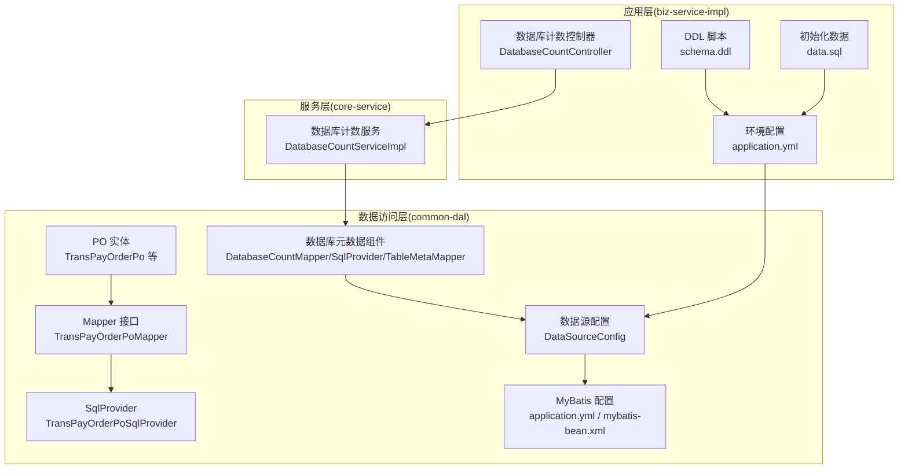
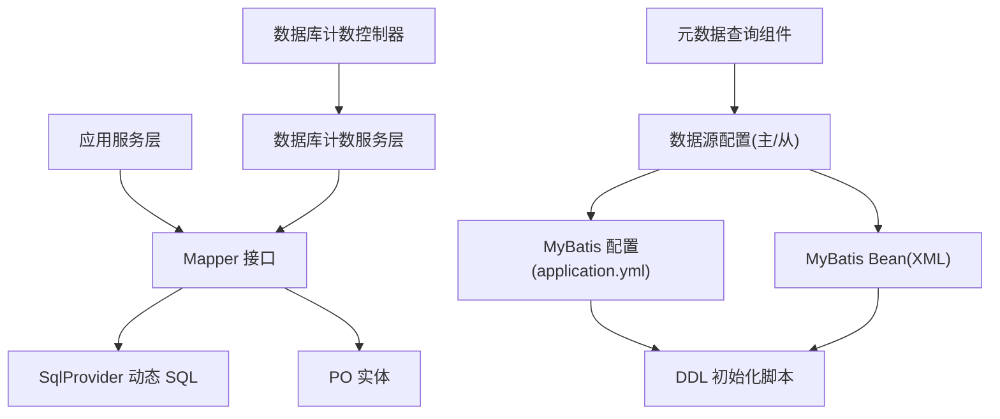
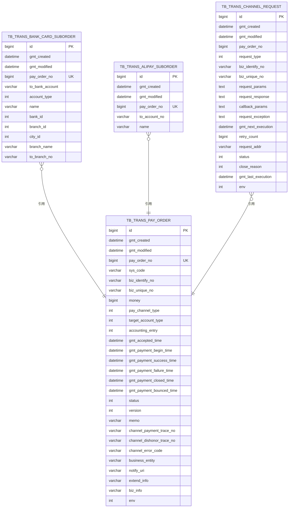
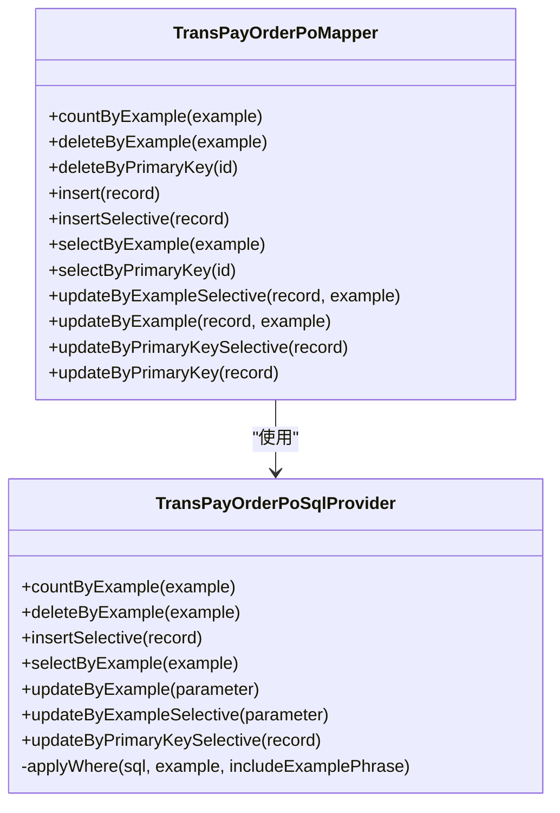
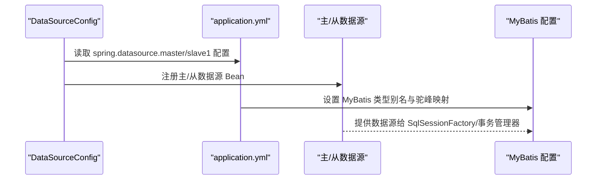
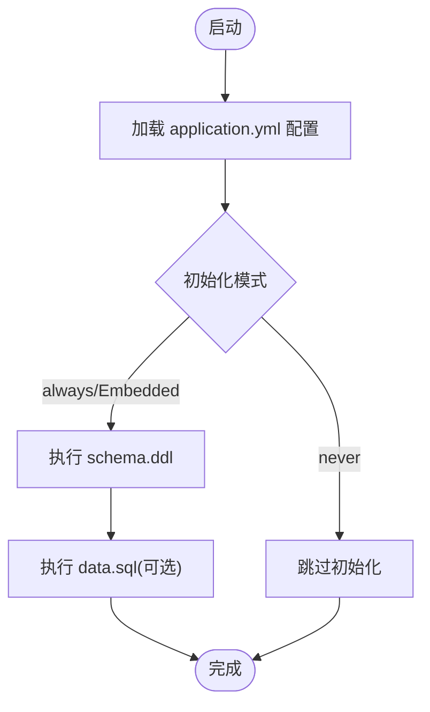
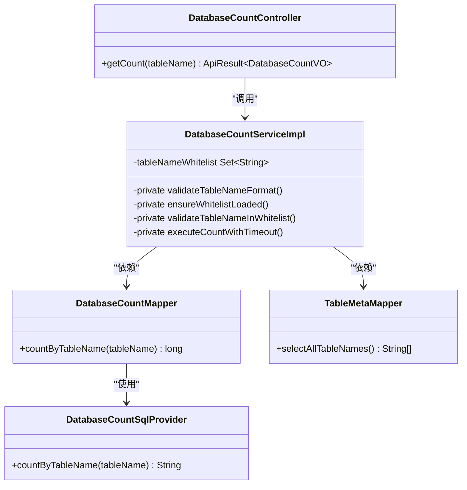
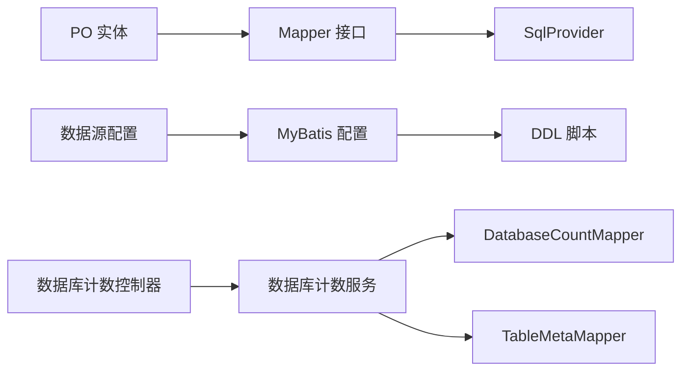

# 数据访问层

<cite>
**本文引用的文件**
- [TransPayOrderPo.java](file://common-dal/src/main/java/com/magicliang/transaction/sys/common/dal/mybatis/po/TransPayOrderPo.java)
- [TransAlipaySubOrderPo.java](file://common-dal/src/main/java/com/magicliang/transaction/sys/common/dal/mybatis/po/TransAlipaySubOrderPo.java)
- [TransBankCardSubOrderPo.java](file://common-dal/src/main/java/com/magicliang/transaction/sys/common/dal/mybatis/po/TransBankCardSubOrderPo.java)
- [TransChannelRequestPo.java](file://common-dal/src/main/java/com/magicliang/transaction/sys/common/dal/mybatis/po/TransChannelRequestPo.java)
- [TransPayOrderPoMapper.java](file://common-dal/src/main/java/com/magicliang/transaction/sys/common/dal/mybatis/mapper/TransPayOrderPoMapper.java)
- [TransPayOrderPoSqlProvider.java](file://common-dal/src/main/java/com/magicliang/transaction/sys/common/dal/mybatis/mapper/TransPayOrderPoSqlProvider.java)
- [DatabaseCountMapper.java](file://common-dal/src/main/java/com/magicliang/transaction/sys/common/dal/mybatis/mapper/DatabaseCountMapper.java)
- [DatabaseCountSqlProvider.java](file://common-dal/src/main/java/com/magicliang/transaction/sys/common/dal/mybatis/mapper/DatabaseCountSqlProvider.java)
- [TableMetaMapper.java](file://common-dal/src/main/java/com/magicliang/transaction/sys/common/dal/mybatis/mapper/TableMetaMapper.java)
- [DataSourceConfig.java](file://common-dal/src/main/java/com/magicliang/transaction/sys/common/dal/datasource/DataSourceConfig.java)
- [application.yml](file://biz-service-impl/src/main/resources/application.yml)
- [generatorConfig.xml](file://common-dal/src/main/resources/autogen/generatorConfig.xml)
- [schema.ddl](file://biz-service-impl/src/main/resources/sql/mysql/schema.ddl)
- [data.sql](file://biz-service-impl/src/main/resources/sql/mysql/data.sql)
- [MyBatis-configuration.MD](file://common-dal/src/main/java/com/magicliang/transaction/sys/common/dal/mybatis/MyBatis-configuration.MD)
- [EmbeddedMariaDbConfig.java](file://common-dal/src/main/java/com/magicliang/transaction/sys/common/dal/datasource/EmbeddedMariaDbConfig.java)
- [EmbeddedTestcontainersDbConfig.java](file://common-dal/src/main/java/com/magicliang/transaction/sys/common/dal/datasource/EmbeddedTestcontainersDbConfig.java)
- [mybatis-bean.xml](file://biz-service-impl/src/main/resources/spring/mybatis-bean.xml)
- [DbUtils.java](file://common-util/src/main/java/com/magicliang/transaction/sys/common/util/DbUtils.java)
- [DatabaseCountController.java](file://biz-service-impl/src/main/java/com/magicliang/transaction/sys/biz/service/impl/web/controller/DatabaseCountController.java)
- [DatabaseCountVO.java](file://biz-service-impl/src/main/java/com/magicliang/transaction/sys/biz/service/impl/web/model/vo/DatabaseCountVO.java)
- [IDatabaseCountService.java](file://core-service/src/main/java/com/magicliang/transaction/sys/core/service/IDatabaseCountService.java)
- [DatabaseCountServiceImpl.java](file://core-service/src/main/java/com/magicliang/transaction/sys/core/service/impl/DatabaseCountServiceImpl.java)
- [DatabaseCountSqlProviderTest.java](file://common-dal/src/test/java/com/magicliang/transaction/sys/common/dal/mybatis/mapper/DatabaseCountSqlProviderTest.java)
- [DatabaseCountServiceImplTest.java](file://core-service/src/test/java/com/magicliang/transaction/sys/core/service/impl/DatabaseCountServiceImplTest.java)
</cite>

## 更新摘要
**所做更改**
- 新增数据库元数据查询组件：DatabaseCountMapper、TableMetaMapper、DatabaseCountSqlProvider
- 新增数据库表计数查询服务层：IDatabaseCountService、DatabaseCountServiceImpl
- 新增数据库表计数查询Web层：DatabaseCountController、DatabaseCountVO
- 增强数据访问层的安全性和功能性，支持动态SQL构建和表名白名单校验
- 添加完整的单元测试和集成测试覆盖

## 目录
1. [简介](#简介)
2. [项目结构](#项目结构)
3. [核心组件](#核心组件)
4. [架构总览](#架构总览)
5. [详细组件分析](#详细组件分析)
6. [新增数据库元数据查询组件](#新增数据库元数据查询组件)
7. [依赖分析](#依赖分析)
8. [性能考量](#性能考量)
9. [故障排查指南](#故障排查指南)
10. [结论](#结论)
11. [附录](#附录)

## 简介
本文件面向领域驱动交易系统的数据访问层，系统采用 MyBatis 作为持久化框架，结合 PO（实体）、Mapper 接口与 SqlProvider 动态 SQL，完成对支付订单及其子订单、渠道请求等领域的数据持久化。本文将从数据模型设计、MyBatis 映射器实现、多数据源与读写分离、数据库初始化与版本管理、以及最佳实践（SQL 优化、批量操作、事务管理）等方面进行深入解析，并提供配置示例与使用指南。

**更新** 新增数据库元数据查询功能，包括表计数查询、表名白名单校验和动态SQL安全构建，增强了数据访问层的安全性和功能性。

## 项目结构
数据访问层位于 common-dal 模块，核心文件组织如下：
- 实体 PO：对应数据库表的 Java 对象，字段与注释均来自 MyBatis Generator。
- Mapper 接口：定义 CRUD 与条件查询方法，部分通过 SqlProvider 生成动态 SQL。
- SqlProvider：集中维护条件查询、更新、插入等动态 SQL。
- 数据源配置：基于 Spring Profile 的多数据源配置，支持主从库分离。
- MyBatis 配置：YAML 中启用驼峰映射、类型别名包等；另有 XML 配置示例。
- 数据库初始化：DDL 定义与初始化脚本，支持多环境配置与容器化测试数据库。
- **新增** 元数据查询组件：DatabaseCountMapper、TableMetaMapper、DatabaseCountSqlProvider 提供安全的动态SQL构建和表名校验。



**图表来源**
- [DatabaseCountMapper.java:1-23](file://common-dal/src/main/java/com/magicliang/transaction/sys/common/dal/mybatis/mapper/DatabaseCountMapper.java#L1-L23)
- [TableMetaMapper.java:1-24](file://common-dal/src/main/java/com/magicliang/transaction/sys/common/dal/mybatis/mapper/TableMetaMapper.java#L1-L24)
- [DatabaseCountSqlProvider.java:1-27](file://common-dal/src/main/java/com/magicliang/transaction/sys/common/dal/mybatis/mapper/DatabaseCountSqlProvider.java#L1-L27)
- [DatabaseCountController.java:1-50](file://biz-service-impl/src/main/java/com/magicliang/transaction/sys/biz/service/impl/web/controller/DatabaseCountController.java#L1-L50)
- [DatabaseCountServiceImpl.java:1-130](file://core-service/src/main/java/com/magicliang/transaction/sys/core/service/impl/DatabaseCountServiceImpl.java#L1-L130)

**章节来源**
- [application.yml:1-216](file://biz-service-impl/src/main/resources/application.yml#L1-L216)
- [schema.ddl:1-145](file://biz-service-impl/src/main/resources/sql/mysql/schema.ddl#L1-L145)

## 核心组件
- 实体 PO：封装数据库表字段，提供标准 getter/setter 与 equals/hashCode，便于 MyBatis 结果映射与判等。
- Mapper 接口：声明 CRUD 与条件查询方法，使用注解或 SqlProvider 提供 SQL，支持按 Example 条件查询与批量更新。
- SqlProvider：集中生成动态 SQL，处理复杂条件拼接、IN/BETWEEN 列表、AND/OR 组合等。
- **新增** 数据库元数据组件：DatabaseCountMapper 提供表计数查询接口，TableMetaMapper 提供表名白名单查询，DatabaseCountSqlProvider 安全构建动态SQL。
- 数据源配置：基于 Profile 的主从库配置，支持 Hikari 连接池参数与初始化脚本加载。
- MyBatis 配置：启用驼峰映射、类型别名包，XML 中可配置批量执行器类型。

**章节来源**
- [TransPayOrderPo.java:1-1046](file://common-dal/src/main/java/com/magicliang/transaction/sys/common/dal/mybatis/po/TransPayOrderPo.java#L1-L1046)
- [TransPayOrderPoMapper.java:1-267](file://common-dal/src/main/java/com/magicliang/transaction/sys/common/dal/mybatis/mapper/TransPayOrderPoMapper.java#L1-L267)
- [TransPayOrderPoSqlProvider.java:1-610](file://common-dal/src/main/java/com/magicliang/transaction/sys/common/dal/mybatis/mapper/TransPayOrderPoSqlProvider.java#L1-L610)
- [DatabaseCountMapper.java:1-23](file://common-dal/src/main/java/com/magicliang/transaction/sys/common/dal/mybatis/mapper/DatabaseCountMapper.java#L1-L23)
- [TableMetaMapper.java:1-24](file://common-dal/src/main/java/com/magicliang/transaction/sys/common/dal/mybatis/mapper/TableMetaMapper.java#L1-L24)
- [DatabaseCountSqlProvider.java:1-27](file://common-dal/src/main/java/com/magicliang/transaction/sys/common/dal/mybatis/mapper/DatabaseCountSqlProvider.java#L1-L27)
- [DataSourceConfig.java:1-82](file://common-dal/src/main/java/com/magicliang/transaction/sys/common/dal/datasource/DataSourceConfig.java#L1-L82)
- [application.yml:41-47](file://biz-service-impl/src/main/resources/application.yml#L41-L47)
- [mybatis-bean.xml:22-29](file://biz-service-impl/src/main/resources/spring/mybatis-bean.xml#L22-L29)

## 架构总览
数据访问层围绕 MyBatis 的核心组件展开：PO 映射数据库表，Mapper 负责 SQL 声明，SqlProvider 提供动态 SQL，DataSourceConfig 提供多数据源 Bean，application.yml 提供 MyBatis 与数据源配置，DDL 脚本负责数据库初始化。**新增**的数据库元数据查询组件通过分层架构提供安全的动态SQL构建和表名校验。



**图表来源**
- [TransPayOrderPoMapper.java:1-267](file://common-dal/src/main/java/com/magicliang/transaction/sys/common/dal/mybatis/mapper/TransPayOrderPoMapper.java#L1-L267)
- [TransPayOrderPoSqlProvider.java:1-610](file://common-dal/src/main/java/com/magicliang/transaction/sys/common/dal/mybatis/mapper/TransPayOrderPoSqlProvider.java#L1-L610)
- [DataSourceConfig.java:1-82](file://common-dal/src/main/java/com/magicliang/transaction/sys/common/dal/datasource/DataSourceConfig.java#L1-L82)
- [application.yml:41-47](file://biz-service-impl/src/main/resources/application.yml#L41-L47)
- [mybatis-bean.xml:22-29](file://biz-service-impl/src/main/resources/spring/mybatis-bean.xml#L22-L29)
- [schema.ddl:1-145](file://biz-service-impl/src/main/resources/sql/mysql/schema.ddl#L1-L145)
- [DatabaseCountServiceImpl.java:1-130](file://core-service/src/main/java/com/magicliang/transaction/sys/core/service/impl/DatabaseCountServiceImpl.java#L1-L130)
- [DatabaseCountController.java:1-50](file://biz-service-impl/src/main/java/com/magicliang/transaction/sys/biz/service/impl/web/controller/DatabaseCountController.java#L1-L50)

## 详细组件分析

### 实体 PO 设计与数据模型
- 支付订单实体：包含业务主键、金额、支付通道类型、目标账户类型、会计分录、各阶段时间戳、状态、版本、扩展信息、环境等字段，满足交易状态演进与审计需求。
- 子订单实体：银行卡子订单与支付宝子订单分别承载不同支付方式的差异化字段，均以支付订单号作为外键引用。
- 渠道请求实体：记录请求类型、业务标识、重试次数、请求地址、状态、下次执行时间等，支撑异步任务调度与幂等控制。



**图表来源**
- [schema.ddl:9-78](file://biz-service-impl/src/main/resources/sql/mysql/schema.ddl#L9-L78)
- [schema.ddl:83-103](file://biz-service-impl/src/main/resources/sql/mysql/schema.ddl#L83-L103)
- [schema.ddl:105-117](file://biz-service-impl/src/main/resources/sql/mysql/schema.ddl#L105-L117)
- [schema.ddl:119-144](file://biz-service-impl/src/main/resources/sql/mysql/schema.ddl#L119-L144)

**章节来源**
- [TransPayOrderPo.java:1-1046](file://common-dal/src/main/java/com/magicliang/transaction/sys/common/dal/mybatis/po/TransPayOrderPo.java#L1-L1046)
- [TransBankCardSubOrderPo.java:1-471](file://common-dal/src/main/java/com/magicliang/transaction/sys/common/dal/mybatis/po/TransBankCardSubOrderPo.java#L1-L471)
- [TransAlipaySubOrderPo.java:1-257](file://common-dal/src/main/java/com/magicliang/transaction/sys/common/dal/mybatis/po/TransAlipaySubOrderPo.java#L1-L257)
- [TransChannelRequestPo.java:1-544](file://common-dal/src/main/java/com/magicliang/transaction/sys/common/dal/mybatis/po/TransChannelRequestPo.java#L1-L544)
- [schema.ddl:1-145](file://biz-service-impl/src/main/resources/sql/mysql/schema.ddl#L1-L145)

### Mapper 接口与 SqlProvider 实现
- Mapper 接口：提供按主键删除/插入/查询、按 Example 条件统计/删除/更新、按 Example 条件查询等方法；使用注解或 SqlProvider 生成 SQL。
- SqlProvider：集中实现动态 SQL，包括 selectByExample、updateByExample、updateByExampleSelective、updateByPrimaryKeySelective 等，支持复杂条件拼接与列表/区间查询。



**图表来源**
- [TransPayOrderPoMapper.java:1-267](file://common-dal/src/main/java/com/magicliang/transaction/sys/common/dal/mybatis/mapper/TransPayOrderPoMapper.java#L1-L267)
- [TransPayOrderPoSqlProvider.java:1-610](file://common-dal/src/main/java/com/magicliang/transaction/sys/common/dal/mybatis/mapper/TransPayOrderPoSqlProvider.java#L1-L610)

**章节来源**
- [TransPayOrderPoMapper.java:1-267](file://common-dal/src/main/java/com/magicliang/transaction/sys/common/dal/mybatis/mapper/TransPayOrderPoMapper.java#L1-L267)
- [TransPayOrderPoSqlProvider.java:1-610](file://common-dal/src/main/java/com/magicliang/transaction/sys/common/dal/mybatis/mapper/TransPayOrderPoSqlProvider.java#L1-L610)

### 多数据源配置与切换机制
- 数据源定义：主库与从库通过 Profile 隔离，分别绑定不同配置前缀，主数据源标注 @Primary。
- 连接池：HikariCP 在 YAML 中配置最小空闲、最大连接、最大存活时间、连接超时等参数。
- 初始化脚本：通过 spring.sql.init 加载 schema 与 data 脚本，支持多环境差异。
- 事务一致性：注释提示若使用分片中间件，需确保 SqlSessionFactory 与 DataSourceTransactionManager 使用同一抽象数据源，避免事务失效。



**图表来源**
- [DataSourceConfig.java:1-82](file://common-dal/src/main/java/com/magicliang/transaction/sys/common/dal/datasource/DataSourceConfig.java#L1-L82)
- [application.yml:17-216](file://biz-service-impl/src/main/resources/application.yml#L17-L216)
- [MyBatis-configuration.MD:18-28](file://common-dal/src/main/java/com/magicliang/transaction/sys/common/dal/mybatis/MyBatis-configuration.MD#L18-L28)

**章节来源**
- [DataSourceConfig.java:1-82](file://common-dal/src/main/java/com/magicliang/transaction/sys/common/dal/datasource/DataSourceConfig.java#L1-L82)
- [application.yml:17-216](file://biz-service-impl/src/main/resources/application.yml#L17-L216)
- [MyBatis-configuration.MD:18-28](file://common-dal/src/main/java/com/magicliang/transaction/sys/common/dal/mybatis/MyBatis-configuration.MD#L18-L28)

### 数据库初始化与版本管理
- DDL 定义：schema.ddl 统一定义表结构、主键、唯一索引与普通索引，明确字段含义与约束。
- 初始化策略：application.yml 中通过 spring.sql.init 指定 schema 与 data 脚本路径；支持按 Profile 控制初始化模式。
- 测试数据库：提供 EmbeddedMariaDbConfig 与 EmbeddedTestcontainersDbConfig，支持本地与容器化测试环境的数据库初始化与权限授予。



**图表来源**
- [application.yml:136-140](file://biz-service-impl/src/main/resources/application.yml#L136-L140)
- [schema.ddl:1-145](file://biz-service-impl/src/main/resources/sql/mysql/schema.ddl#L1-L145)
- [data.sql:1-2](file://biz-service-impl/src/main/resources/sql/mysql/data.sql#L1-L2)
- [EmbeddedMariaDbConfig.java:104-125](file://common-dal/src/main/java/com/magicliang/transaction/sys/common/dal/datasource/EmbeddedMariaDbConfig.java#L104-L125)
- [EmbeddedTestcontainersDbConfig.java:119-136](file://common-dal/src/main/java/com/magicliang/transaction/sys/common/dal/datasource/EmbeddedTestcontainersDbConfig.java#L119-L136)

**章节来源**
- [application.yml:108-140](file://biz-service-impl/src/main/resources/application.yml#L108-L140)
- [schema.ddl:1-145](file://biz-service-impl/src/main/resources/sql/mysql/schema.ddl#L1-L145)
- [EmbeddedMariaDbConfig.java:104-125](file://common-dal/src/main/java/com/magicliang/transaction/sys/common/dal/datasource/EmbeddedMariaDbConfig.java#L104-L125)
- [EmbeddedTestcontainersDbConfig.java:119-136](file://common-dal/src/main/java/com/magicliang/transaction/sys/common/dal/datasource/EmbeddedTestcontainersDbConfig.java#L119-L136)

### MyBatis Generator 与代码生成
- 生成配置：generatorConfig.xml 指定 JDBC 连接、JavaModel 与 JavaClient 生成目录，针对多个表生成 PO 与 Mapper。
- 主键策略：为各表配置自增主键生成，确保 ID 生成与 ORM 映射一致。

**章节来源**
- [generatorConfig.xml:1-64](file://common-dal/src/main/resources/autogen/generatorConfig.xml#L1-L64)

## 新增数据库元数据查询组件

### 组件架构设计
新增的数据库元数据查询组件采用分层架构设计，通过三重安全防护确保动态SQL的安全性：

1. **表名格式校验**：使用正则表达式 `^[a-zA-Z_][a-zA-Z0-9_]*$` 防止SQL注入
2. **表名白名单校验**：从 `information_schema.tables` 动态获取合法表名
3. **动态SQL构建**：通过 `DatabaseCountSqlProvider` 安全构建SQL语句



**图表来源**
- [DatabaseCountMapper.java:1-23](file://common-dal/src/main/java/com/magicliang/transaction/sys/common/dal/mybatis/mapper/DatabaseCountMapper.java#L1-L23)
- [TableMetaMapper.java:1-24](file://common-dal/src/main/java/com/magicliang/transaction/sys/common/dal/mybatis/mapper/TableMetaMapper.java#L1-L24)
- [DatabaseCountSqlProvider.java:1-27](file://common-dal/src/main/java/com/magicliang/transaction/sys/common/dal/mybatis/mapper/DatabaseCountSqlProvider.java#L1-L27)
- [DatabaseCountServiceImpl.java:1-130](file://core-service/src/main/java/com/magicliang/transaction/sys/core/service/impl/DatabaseCountServiceImpl.java#L1-L130)
- [DatabaseCountController.java:1-50](file://biz-service-impl/src/main/java/com/magicliang/transaction/sys/biz/service/impl/web/controller/DatabaseCountController.java#L1-L50)

### 核心功能实现

#### DatabaseCountMapper 接口
提供基于表名的计数查询接口，使用 `@SelectProvider` 注解指向 `DatabaseCountSqlProvider`：

```java
@SelectProvider(type = DatabaseCountSqlProvider.class, method = "countByTableName")
long countByTableName(@Param("tableName") String tableName);
```

#### TableMetaMapper 接口  
查询数据库中所有用户表名，使用静态SQL查询 `information_schema.tables`：

```java
@Select("SELECT TABLE_NAME FROM information_schema.tables WHERE TABLE_SCHEMA = DATABASE()")
List<String> selectAllTableNames();
```

#### DatabaseCountSqlProvider
安全构建动态SQL，使用MyBatis的SQL构造器避免直接字符串拼接：

```java
public String countByTableName(String tableName) {
    SQL sql = new SQL();
    sql.SELECT("COUNT(*)");
    sql.FROM(tableName);
    return sql.toString();
}
```

#### DatabaseCountServiceImpl 服务实现
实现完整的安全校验和查询逻辑：

1. **表名格式校验**：正则表达式验证表名合法性
2. **白名单懒加载**：首次查询时从元数据加载表名列表
3. **白名单缓存**：使用 `ConcurrentHashMap` 缓存合法表名
4. **查询超时控制**：5秒超时防止长时间阻塞
5. **异常处理**：详细的日志记录和异常抛出

**章节来源**
- [DatabaseCountMapper.java:1-23](file://common-dal/src/main/java/com/magicliang/transaction/sys/common/dal/mybatis/mapper/DatabaseCountMapper.java#L1-L23)
- [TableMetaMapper.java:1-24](file://common-dal/src/main/java/com/magicliang/transaction/sys/common/dal/mybatis/mapper/TableMetaMapper.java#L1-L24)
- [DatabaseCountSqlProvider.java:1-27](file://common-dal/src/main/java/com/magicliang/transaction/sys/common/dal/mybatis/mapper/DatabaseCountSqlProvider.java#L1-L27)
- [DatabaseCountServiceImpl.java:1-130](file://core-service/src/main/java/com/magicliang/transaction/sys/core/service/impl/DatabaseCountServiceImpl.java#L1-L130)
- [DatabaseCountController.java:1-50](file://biz-service-impl/src/main/java/com/magicliang/transaction/sys/biz/service/impl/web/controller/DatabaseCountController.java#L1-L50)

### API 接口设计
提供RESTful风格的API接口：

- **端点**：`GET /api/v1/database/count`
- **参数**：`tableName`（表名，必填）
- **响应**：包含表名和总记录数的JSON对象
- **安全**：双重校验防止SQL注入攻击

**章节来源**
- [DatabaseCountController.java:1-50](file://biz-service-impl/src/main/java/com/magicliang/transaction/sys/biz/service/impl/web/controller/DatabaseCountController.java#L1-L50)
- [DatabaseCountVO.java:1-34](file://biz-service-impl/src/main/java/com/magicliang/transaction/sys/biz/service/impl/web/model/vo/DatabaseCountVO.java#L1-L34)

### 安全性设计
- **SQL注入防护**：通过表名白名单和正则校验双重防护
- **输入验证**：严格的表名格式检查
- **白名单机制**：动态从数据库元数据加载合法表名
- **超时控制**：防止长时间运行的COUNT查询阻塞系统
- **日志监控**：详细的查询日志和异常记录

**章节来源**
- [DatabaseCountServiceImpl.java:76-104](file://core-service/src/main/java/com/magicliang/transaction/sys/core/service/impl/DatabaseCountServiceImpl.java#L76-L104)
- [DatabaseCountSqlProvider.java:13-19](file://common-dal/src/main/java/com/magicliang/transaction/sys/common/dal/mybatis/mapper/DatabaseCountSqlProvider.java#L13-L19)

## 依赖分析
- 组件内聚：PO 与 Mapper/SqlProvider 一一对应，职责清晰；SqlProvider 将动态 SQL 与接口解耦。
- 组件耦合：Mapper 依赖 SqlProvider；数据源配置与 MyBatis 配置相互配合；DDL 与初始化脚本决定数据库结构。
- **新增** 元数据查询组件：DatabaseCountServiceImpl 依赖 DatabaseCountMapper 和 TableMetaMapper，形成完整的查询链路。
- 外部依赖：MyBatis、HikariCP、Spring Profile、MariaDB/MySQL 驱动。



**图表来源**
- [TransPayOrderPo.java:1-1046](file://common-dal/src/main/java/com/magicliang/transaction/sys/common/dal/mybatis/po/TransPayOrderPo.java#L1-L1046)
- [TransPayOrderPoMapper.java:1-267](file://common-dal/src/main/java/com/magicliang/transaction/sys/common/dal/mybatis/mapper/TransPayOrderPoMapper.java#L1-L267)
- [TransPayOrderPoSqlProvider.java:1-610](file://common-dal/src/main/java/com/magicliang/transaction/sys/common/dal/mybatis/mapper/TransPayOrderPoSqlProvider.java#L1-L610)
- [DataSourceConfig.java:1-82](file://common-dal/src/main/java/com/magicliang/transaction/sys/common/dal/datasource/DataSourceConfig.java#L1-L82)
- [application.yml:41-47](file://biz-service-impl/src/main/resources/application.yml#L41-L47)
- [schema.ddl:1-145](file://biz-service-impl/src/main/resources/sql/mysql/schema.ddl#L1-L145)
- [DatabaseCountServiceImpl.java:1-130](file://core-service/src/main/java/com/magicliang/transaction/sys/core/service/impl/DatabaseCountServiceImpl.java#L1-L130)
- [DatabaseCountController.java:1-50](file://biz-service-impl/src/main/java/com/magicliang/transaction/sys/biz/service/impl/web/controller/DatabaseCountController.java#L1-L50)

## 性能考量
- 连接池参数：合理设置最小空闲、最大连接、最大存活时间与连接超时，避免高并发下的连接争用与超时。
- 批量执行：在 XML 中将 ExecutorType 设为 BATCH，适用于数据密集型交易系统的批量写入场景。
- 索引设计：遵循 DDL 中的索引策略，为状态与时间维度建立复合索引，减少回表与排序成本。
- 动态 SQL：SqlProvider 将条件拼接集中在一处，避免硬编码 SQL，提升可维护性与可测试性。
- **新增** 查询性能优化：COUNT查询可能在大数据量表上性能较差，通过5秒超时控制防止系统阻塞。

**章节来源**
- [application.yml:24-32](file://biz-service-impl/src/main/resources/application.yml#L24-L32)
- [mybatis-bean.xml:22-29](file://biz-service-impl/src/main/resources/spring/mybatis-bean.xml#L22-L29)
- [schema.ddl:67-78](file://biz-service-impl/src/main/resources/sql/mysql/schema.ddl#L67-L78)
- [DatabaseCountServiceImpl.java:34-36](file://core-service/src/main/java/com/magicliang/transaction/sys/core/service/impl/DatabaseCountServiceImpl.java#L34-L36)

## 故障排查指南
- 查询结果数量校验：DbUtils 提供查询结果数量断言工具，便于在单元测试或集成测试中快速定位查询异常。
- 初始化失败：检查 application.yml 中 spring.sql.init 的 schema-locations 与 data-locations 是否正确，确认脚本路径与权限。
- 事务问题：若使用分片中间件，确保 SqlSessionFactory 与 DataSourceTransactionManager 使用同一抽象数据源，避免事务失效。
- 日志级别：在本地 Profile 下开启 MyBatis SQL 日志输出，便于定位 SQL 与参数问题。
- **新增** 元数据查询故障排查：
  - 表名校验失败：检查表名是否符合正则表达式 `^[a-zA-Z_][a-zA-Z0-9_]*$`
  - 白名单加载失败：确认数据库连接正常，`information_schema.tables` 可访问
  - 查询超时：检查表数据量大小，考虑添加适当的索引或缓存策略

**章节来源**
- [DbUtils.java:1-49](file://common-util/src/main/java/com/magicliang/transaction/sys/common/util/DbUtils.java#L1-L49)
- [application.yml:108-140](file://biz-service-impl/src/main/resources/application.yml#L108-L140)
- [MyBatis-configuration.MD:26-28](file://common-dal/src/main/java/com/magicliang/transaction/sys/common/dal/mybatis/MyBatis-configuration.MD#L26-L28)
- [DatabaseCountServiceImpl.java:109-128](file://core-service/src/main/java/com/magicliang/transaction/sys/core/service/impl/DatabaseCountServiceImpl.java#L109-L128)

## 结论
本数据访问层以 MyBatis 为核心，通过 PO、Mapper、SqlProvider 的清晰分工，实现了对交易领域数据的稳定持久化。结合多数据源配置、连接池参数优化、DDL 与初始化脚本、以及批量执行器等最佳实践，能够满足高并发、可扩展的交易系统需求。

**更新** 新增的数据库元数据查询组件进一步增强了数据访问层的安全性和功能性，通过三重安全防护机制（表名格式校验、表名白名单、动态SQL构建）有效防止SQL注入攻击，同时提供高效的表计数查询能力。建议在生产环境中严格遵循索引设计与事务一致性原则，并持续完善初始化脚本与监控日志。

## 附录
- 配置示例
  - MyBatis 驼峰映射与类型别名包：参考 application.yml 中 mybatis 配置段。
  - HikariCP 连接池参数：参考 application.yml 中 datasource.hikari 配置段。
  - 批量执行器：参考 mybatis-bean.xml 中 sqlSession 的 executorType 设置为 BATCH。
  - 多数据源：参考 application.yml 中 spring.datasource.master/slave1 与 DataSourceConfig。
  - **新增** 数据库元数据查询：无需额外配置，组件自动从 `information_schema` 加载表名白名单。
- 使用指南
  - 新增实体：在 generatorConfig.xml 中添加 table 节点，运行 MyBatis Generator 生成 PO 与 Mapper。
  - 动态查询：在 Mapper 中使用 @SelectProvider 指向 SqlProvider 方法，或在 SqlProvider 中实现复杂条件拼接。
  - 初始化数据库：在 application.yml 中配置 spring.sql.init，确保 schema-locations 与 data-locations 正确指向 DDL 与 data 脚本。
  - **新增** 数据库计数查询：调用 `GET /api/v1/database/count?tableName=表名` 获取指定表的总记录数。
  - **新增** 安全注意事项：表名必须符合正则表达式 `^[a-zA-Z_][a-zA-Z0-9_]*$`，且必须存在于数据库表名白名单中。

**章节来源**
- [application.yml:41-47](file://biz-service-impl/src/main/resources/application.yml#L41-L47)
- [application.yml:24-32](file://biz-service-impl/src/main/resources/application.yml#L24-L32)
- [mybatis-bean.xml:22-29](file://biz-service-impl/src/main/resources/spring/mybatis-bean.xml#L22-L29)
- [generatorConfig.xml:47-61](file://common-dal/src/main/resources/autogen/generatorConfig.xml#L47-L61)
- [application.yml:152-173](file://biz-service-impl/src/main/resources/application.yml#L152-L173)
- [DataSourceConfig.java:33-52](file://common-dal/src/main/java/com/magicliang/transaction/sys/common/dal/datasource/DataSourceConfig.java#L33-L52)
- [DatabaseCountController.java:33-48](file://biz-service-impl/src/main/java/com/magicliang/transaction/sys/biz/service/impl/web/controller/DatabaseCountController.java#L33-L48)