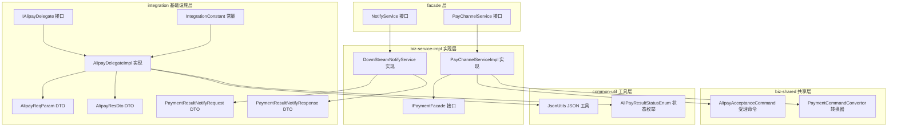
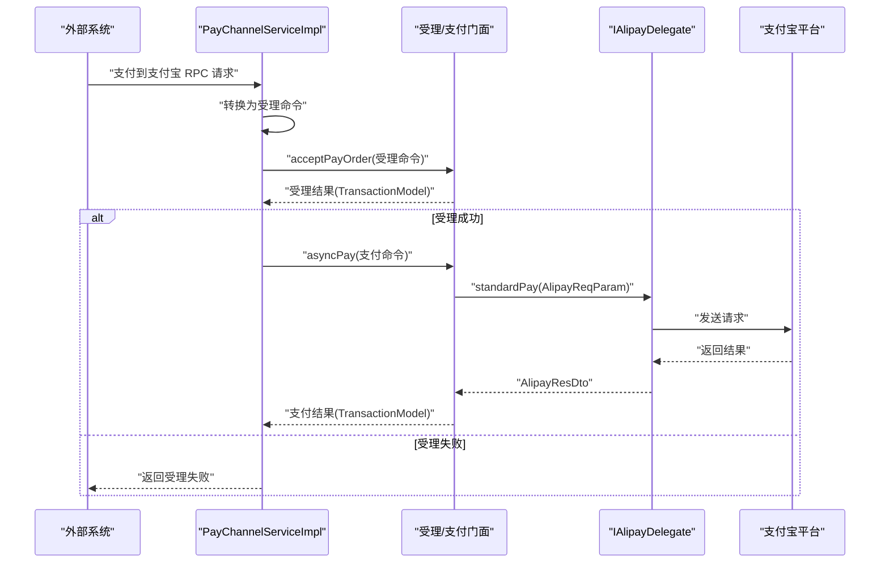
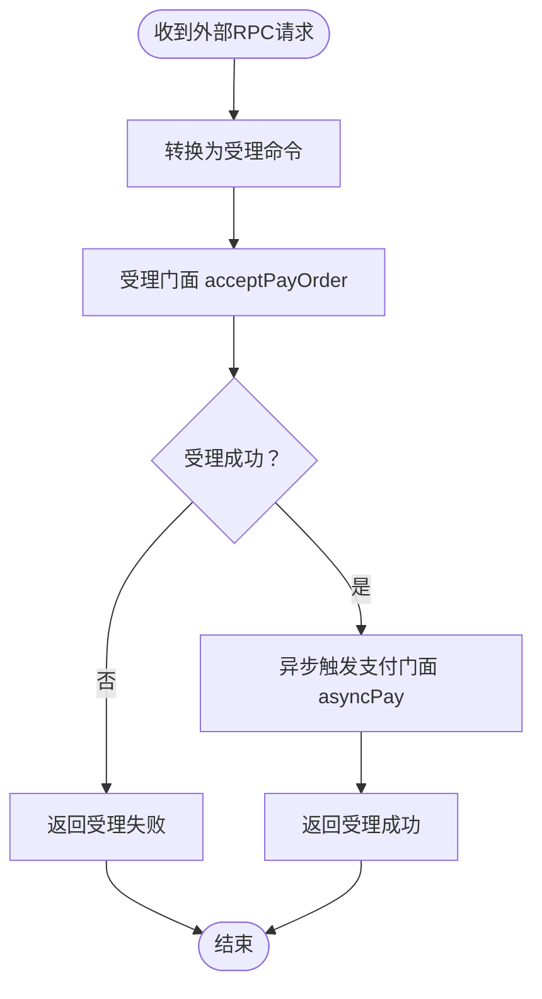
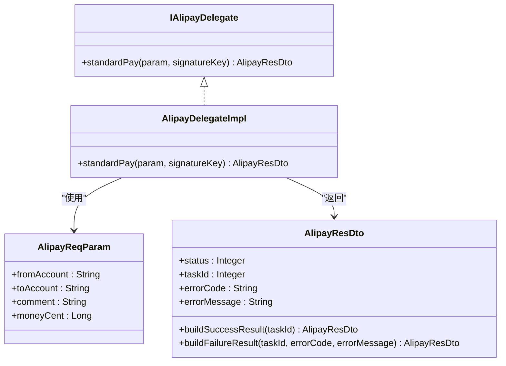
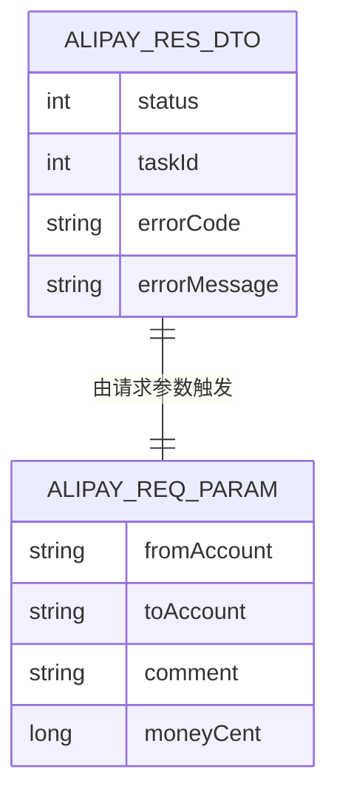
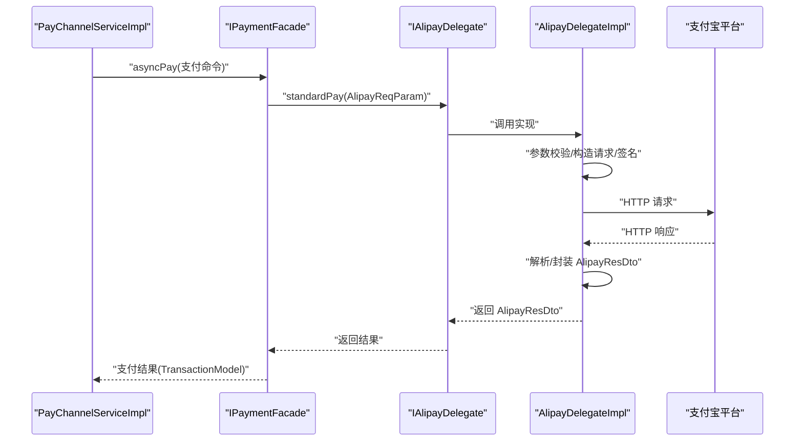
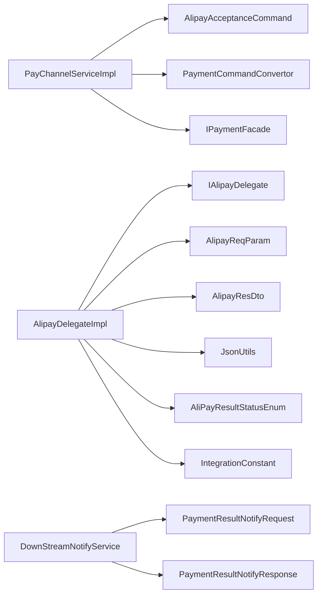

# 服务集成层

<cite>
**本文引用的文件**
- [PayChannelService.java](file://common-service-facade/src/main/java/com/magicliang/transaction/sys/common/service/facade/PayChannelService.java)
- [NotifyService.java](file://common-service-facade/src/main/java/com/magicliang/transaction/sys/common/service/facade/NotifyService.java)
- [PayChannelServiceImpl.java](file://biz-service-impl/src/main/java/com/magicliang/transaction/sys/biz/service/impl/rpc/PayChannelServiceImpl.java)
- [DownStreamNotifyService.java](file://biz-service-impl/src/main/java/com/magicliang/transaction/sys/biz/service/impl/rpc/DownStreamNotifyService.java)
- [IAlipayDelegate.java](file://common-service-integration/src/main/java/com/magicliang/transaction/sys/common/service/integration/delegate/alipay/IAlipayDelegate.java)
- [AlipayDelegateImpl.java](file://common-service-integration/src/main/java/com/magicliang/transaction/sys/common/service/integration/delegate/alipay/impl/AlipayDelegateImpl.java)
- [AlipayReqParam.java](file://common-service-integration/src/main/java/com/magicliang/transaction/sys/common/service/integration/param/AlipayReqParam.java)
- [AlipayResDto.java](file://common-service-integration/src/main/java/com/magicliang/transaction/sys/common/service/integration/param/AlipayResDto.java)
- [PaymentResultNotifyRequest.java](file://common-service-integration/src/main/java/com/magicliang/transaction/sys/common/service/integration/param/PaymentResultNotifyRequest.java)
- [PaymentResultNotifyResponse.java](file://common-service-integration/src/main/java/com/magicliang/transaction/sys/common/service/integration/param/PaymentResultNotifyResponse.java)
- [AliPayResultStatusEnum.java](file://common-util/src/main/java/com/magicliang/transaction/sys/common/enums/AliPayResultStatusEnum.java)
- [JsonUtils.java](file://common-util/src/main/java/com/magicliang/transaction/sys/common/util/JsonUtils.java)
- [IntegrationConstant.java](file://common-service-integration/src/main/java/com/magicliang/transaction/sys/common/service/integration/constant/IntegrationConstant.java)
- [AlipayAcceptanceCommand.java](file://biz-shared/src/main/java/com/magicliang/transaction/sys/biz/shared/request/acceptance/AlipayAcceptanceCommand.java)
- [PaymentCommandConvertor.java](file://biz-shared/src/main/java/com/magicliang/transaction/sys/biz/shared/request/payment/convertor/PaymentCommandConvertor.java)
- [IPaymentFacade.java](file://biz-service-impl/src/main/java/com/magicliang/transaction/sys/biz/service/impl/facade/IPaymentFacade.java)
</cite>

## 目录
1. [引言](#引言)
2. [项目结构](#项目结构)
3. [核心组件](#核心组件)
4. [架构总览](#架构总览)
5. [详细组件分析](#详细组件分析)
6. [依赖分析](#依赖分析)
7. [性能考量](#性能考量)
8. [故障排查指南](#故障排查指南)
9. [结论](#结论)
10. [附录](#附录)

## 引言
本技术文档聚焦于服务集成层，系统性阐述领域驱动交易系统与第三方支付渠道（以支付宝为例）的集成实现。内容涵盖对外服务接口设计与实现（PayChannelService、NotifyService）、第三方支付通道集成方案（尤其是支付宝集成）、服务代理模式（IAlipayDelegate、AlipayDelegateImpl）、参数封装与DTO设计（AlipayReqParam、AlipayResDto等），并提供完整集成示例与配置要点、安全与性能优化建议。

## 项目结构
服务集成层横跨多个模块：
- common-service-facade：对外服务接口定义（门面标记接口）
- biz-service-impl：RPC实现（支付通道服务、下游通知服务）
- common-service-integration：第三方集成基础设施（代理、参数、常量）
- common-util：通用工具（JSON序列化、枚举等）
- biz-shared：共享请求模型与转换器（受理命令、支付命令转换）

图表来源
- [PayChannelService.java:1-15](file://common-service-facade/src/main/java/com/magicliang/transaction/sys/common/service/facade/PayChannelService.java#L1-L15)
- [NotifyService.java:1-16](file://common-service-facade/src/main/java/com/magicliang/transaction/sys/common/service/facade/NotifyService.java#L1-L16)
- [PayChannelServiceImpl.java:1-81](file://biz-service-impl/src/main/java/com/magicliang/transaction/sys/biz/service/impl/rpc/PayChannelServiceImpl.java#L1-L81)
- [DownStreamNotifyService.java:1-80](file://biz-service-impl/src/main/java/com/magicliang/transaction/sys/biz/service/impl/rpc/DownStreamNotifyService.java#L1-L80)
- [IAlipayDelegate.java:1-30](file://common-service-integration/src/main/java/com/magicliang/transaction/sys/common/service/integration/delegate/alipay/IAlipayDelegate.java#L1-L30)
- [AlipayDelegateImpl.java:1-55](file://common-service-integration/src/main/java/com/magicliang/transaction/sys/common/service/integration/delegate/alipay/impl/AlipayDelegateImpl.java#L1-L55)
- [AlipayReqParam.java:1-49](file://common-service-integration/src/main/java/com/magicliang/transaction/sys/common/service/integration/param/AlipayReqParam.java#L1-L49)
- [AlipayResDto.java:1-187](file://common-service-integration/src/main/java/com/magicliang/transaction/sys/common/service/integration/param/AlipayResDto.java#L1-L187)
- [PaymentResultNotifyRequest.java:1-55](file://common-service-integration/src/main/java/com/magicliang/transaction/sys/common/service/integration/param/PaymentResultNotifyRequest.java#L1-L55)
- [PaymentResultNotifyResponse.java:1-142](file://common-service-integration/src/main/java/com/magicliang/transaction/sys/common/service/integration/param/PaymentResultNotifyResponse.java#L1-L142)
- [IntegrationConstant.java:1-45](file://common-service-integration/src/main/java/com/magicliang/transaction/sys/common/service/integration/constant/IntegrationConstant.java#L1-L45)
- [AlipayAcceptanceCommand.java:1-25](file://biz-shared/src/main/java/com/magicliang/transaction/sys/biz/shared/request/acceptance/AlipayAcceptanceCommand.java#L1-L25)
- [PaymentCommandConvertor.java:1-38](file://biz-shared/src/main/java/com/magicliang/transaction/sys/biz/shared/request/payment/convertor/PaymentCommandConvertor.java#L1-L38)
- [IPaymentFacade.java:1-58](file://biz-service-impl/src/main/java/com/magicliang/transaction/sys/biz/service/impl/facade/IPaymentFacade.java#L1-L58)
- [JsonUtils.java:1-293](file://common-util/src/main/java/com/magicliang/transaction/sys/common/util/JsonUtils.java#L1-L293)
- [AliPayResultStatusEnum.java:1-62](file://common-util/src/main/java/com/magicliang/transaction/sys/common/enums/AliPayResultStatusEnum.java#L1-L62)

章节来源
- [PayChannelService.java:1-15](file://common-service-facade/src/main/java/com/magicliang/transaction/sys/common/service/facade/PayChannelService.java#L1-L15)
- [NotifyService.java:1-16](file://common-service-facade/src/main/java/com/magicliang/transaction/sys/common/service/facade/NotifyService.java#L1-L16)
- [PayChannelServiceImpl.java:1-81](file://biz-service-impl/src/main/java/com/magicliang/transaction/sys/biz/service/impl/rpc/PayChannelServiceImpl.java#L1-L81)
- [DownStreamNotifyService.java:1-80](file://biz-service-impl/src/main/java/com/magicliang/transaction/sys/biz/service/impl/rpc/DownStreamNotifyService.java#L1-L80)
- [IAlipayDelegate.java:1-30](file://common-service-integration/src/main/java/com/magicliang/transaction/sys/common/service/integration/delegate/alipay/IAlipayDelegate.java#L1-L30)
- [AlipayDelegateImpl.java:1-55](file://common-service-integration/src/main/java/com/magicliang/transaction/sys/common/service/integration/delegate/alipay/impl/AlipayDelegateImpl.java#L1-L55)
- [AlipayReqParam.java:1-49](file://common-service-integration/src/main/java/com/magicliang/transaction/sys/common/service/integration/param/AlipayReqParam.java#L1-L49)
- [AlipayResDto.java:1-187](file://common-service-integration/src/main/java/com/magicliang/transaction/sys/common/service/integration/param/AlipayResDto.java#L1-L187)
- [PaymentResultNotifyRequest.java:1-55](file://common-service-integration/src/main/java/com/magicliang/transaction/sys/common/service/integration/param/PaymentResultNotifyRequest.java#L1-L55)
- [PaymentResultNotifyResponse.java:1-142](file://common-service-integration/src/main/java/com/magicliang/transaction/sys/common/service/integration/param/PaymentResultNotifyResponse.java#L1-L142)
- [IntegrationConstant.java:1-45](file://common-service-integration/src/main/java/com/magicliang/transaction/sys/common/service/integration/constant/IntegrationConstant.java#L1-L45)
- [AlipayAcceptanceCommand.java:1-25](file://biz-shared/src/main/java/com/magicliang/transaction/sys/biz/shared/request/acceptance/AlipayAcceptanceCommand.java#L1-L25)
- [PaymentCommandConvertor.java:1-38](file://biz-shared/src/main/java/com/magicliang/transaction/sys/biz/shared/request/payment/convertor/PaymentCommandConvertor.java#L1-L38)
- [IPaymentFacade.java:1-58](file://biz-service-impl/src/main/java/com/magicliang/transaction/sys/biz/service/impl/facade/IPaymentFacade.java#L1-L58)
- [JsonUtils.java:1-293](file://common-util/src/main/java/com/magicliang/transaction/sys/common/util/JsonUtils.java#L1-L293)
- [AliPayResultStatusEnum.java:1-62](file://common-util/src/main/java/com/magicliang/transaction/sys/common/enums/AliPayResultStatusEnum.java#L1-L62)

## 核心组件
- 对外服务接口
  - PayChannelService：支付通道服务接口（标记接口）
  - NotifyService：通知服务接口（标记接口）
- RPC实现
  - PayChannelServiceImpl：将外部RPC请求转换为领域受理与支付流程
  - DownStreamNotifyService：下游支付通道回调入口
- 支付宝集成
  - IAlipayDelegate：支付宝委托接口
  - AlipayDelegateImpl：支付宝委托实现骨架
  - AlipayReqParam、AlipayResDto：支付宝请求/响应参数与结果DTO
- 参数与通知
  - PaymentResultNotifyRequest/Response：支付结果回调请求/响应
- 常量与工具
  - IntegrationConstant：集成常量
  - JsonUtils：JSON序列化工具
  - AliPayResultStatusEnum：支付宝结果状态枚举

章节来源
- [PayChannelService.java:1-15](file://common-service-facade/src/main/java/com/magicliang/transaction/sys/common/service/facade/PayChannelService.java#L1-L15)
- [NotifyService.java:1-16](file://common-service-facade/src/main/java/com/magicliang/transaction/sys/common/service/facade/NotifyService.java#L1-L16)
- [PayChannelServiceImpl.java:1-81](file://biz-service-impl/src/main/java/com/magicliang/transaction/sys/biz/service/impl/rpc/PayChannelServiceImpl.java#L1-L81)
- [DownStreamNotifyService.java:1-80](file://biz-service-impl/src/main/java/com/magicliang/transaction/sys/biz/service/impl/rpc/DownStreamNotifyService.java#L1-L80)
- [IAlipayDelegate.java:1-30](file://common-service-integration/src/main/java/com/magicliang/transaction/sys/common/service/integration/delegate/alipay/IAlipayDelegate.java#L1-L30)
- [AlipayDelegateImpl.java:1-55](file://common-service-integration/src/main/java/com/magicliang/transaction/sys/common/service/integration/delegate/alipay/impl/AlipayDelegateImpl.java#L1-L55)
- [AlipayReqParam.java:1-49](file://common-service-integration/src/main/java/com/magicliang/transaction/sys/common/service/integration/param/AlipayReqParam.java#L1-L49)
- [AlipayResDto.java:1-187](file://common-service-integration/src/main/java/com/magicliang/transaction/sys/common/service/integration/param/AlipayResDto.java#L1-L187)
- [PaymentResultNotifyRequest.java:1-55](file://common-service-integration/src/main/java/com/magicliang/transaction/sys/common/service/integration/param/PaymentResultNotifyRequest.java#L1-L55)
- [PaymentResultNotifyResponse.java:1-142](file://common-service-integration/src/main/java/com/magicliang/transaction/sys/common/service/integration/param/PaymentResultNotifyResponse.java#L1-L142)
- [IntegrationConstant.java:1-45](file://common-service-integration/src/main/java/com/magicliang/transaction/sys/common/service/integration/constant/IntegrationConstant.java#L1-L45)
- [AliPayResultStatusEnum.java:1-62](file://common-util/src/main/java/com/magicliang/transaction/sys/common/enums/AliPayResultStatusEnum.java#L1-L62)
- [JsonUtils.java:1-293](file://common-util/src/main/java/com/magicliang/transaction/sys/common/util/JsonUtils.java#L1-L293)

## 架构总览
服务集成层采用“门面接口 + RPC实现 + 第三方委托 + DTO参数”的分层设计，核心流程如下：
- 外部RPC调用进入PayChannelServiceImpl，将请求转换为受理命令，触发受理门面；受理成功后异步触发支付门面
- 支付门面通过委托接口IAlipayDelegate对接支付宝，完成请求封装、签名、调用与结果解析
- 下游支付通道回调进入DownStreamNotifyService，构建回调命令并交由回调门面处理

图表来源
- [PayChannelServiceImpl.java:45-68](file://biz-service-impl/src/main/java/com/magicliang/transaction/sys/biz/service/impl/rpc/PayChannelServiceImpl.java#L45-L68)
- [IPaymentFacade.java:52-56](file://biz-service-impl/src/main/java/com/magicliang/transaction/sys/biz/service/impl/facade/IPaymentFacade.java#L52-L56)
- [IAlipayDelegate.java:28-28](file://common-service-integration/src/main/java/com/magicliang/transaction/sys/common/service/integration/delegate/alipay/IAlipayDelegate.java#L28-L28)
- [AlipayDelegateImpl.java:40-53](file://common-service-integration/src/main/java/com/magicliang/transaction/sys/common/service/integration/delegate/alipay/impl/AlipayDelegateImpl.java#L40-L53)
- [AlipayReqParam.java:17-48](file://common-service-integration/src/main/java/com/magicliang/transaction/sys/common/service/integration/param/AlipayReqParam.java#L17-L48)
- [AlipayResDto.java:21-64](file://common-service-integration/src/main/java/com/magicliang/transaction/sys/common/service/integration/param/AlipayResDto.java#L21-L64)

## 详细组件分析

### 对外服务接口：PayChannelService 与 NotifyService
- PayChannelService：标记接口，用于暴露支付通道服务能力
- NotifyService：标记接口，用于暴露下游通知服务能力

章节来源
- [PayChannelService.java:12-14](file://common-service-facade/src/main/java/com/magicliang/transaction/sys/common/service/facade/PayChannelService.java#L12-L14)
- [NotifyService.java:13-15](file://common-service-facade/src/main/java/com/magicliang/transaction/sys/common/service/facade/NotifyService.java#L13-L15)

### RPC实现：PayChannelServiceImpl 与 DownStreamNotifyService
- PayChannelServiceImpl
  - 接收外部RPC请求，转换为受理命令（AlipayAcceptanceCommand）
  - 调用受理门面完成受理；受理成功后异步触发支付门面
  - 返回RPC响应对象（当前为占位对象，后续可填充业务标识、支付单号、幂等标识等）
- DownStreamNotifyService
  - 接收下游支付通道回调请求
  - 构建回调命令（CallbackCommand），调用回调门面处理
  - 统一记录日志与异常，返回统一响应对象（当前为占位对象）

图表来源
- [PayChannelServiceImpl.java:45-68](file://biz-service-impl/src/main/java/com/magicliang/transaction/sys/biz/service/impl/rpc/PayChannelServiceImpl.java#L45-L68)
- [AlipayAcceptanceCommand.java:17-24](file://biz-shared/src/main/java/com/magicliang/transaction/sys/biz/shared/request/acceptance/AlipayAcceptanceCommand.java#L17-L24)
- [PaymentCommandConvertor.java:30-36](file://biz-shared/src/main/java/com/magicliang/transaction/sys/biz/shared/request/payment/convertor/PaymentCommandConvertor.java#L30-L36)

章节来源
- [PayChannelServiceImpl.java:1-81](file://biz-service-impl/src/main/java/com/magicliang/transaction/sys/biz/service/impl/rpc/PayChannelServiceImpl.java#L1-L81)
- [DownStreamNotifyService.java:1-80](file://biz-service-impl/src/main/java/com/magicliang/transaction/sys/biz/service/impl/rpc/DownStreamNotifyService.java#L1-L80)

### 支付宝集成：IAlipayDelegate 与 AlipayDelegateImpl
- IAlipayDelegate
  - 定义标准支付方法，接收AlipayReqParam与签名密钥，返回AlipayResDto
  - 明确跨支付通道的鉴权与回调关注点
- AlipayDelegateImpl
  - 提供standardPay实现骨架：参数校验、请求构造与签名、真实请求、结果解析与日志
  - 当前抛出业务异常作为占位，实际应根据平台返回组装AlipayResDto

图表来源
- [IAlipayDelegate.java:15-29](file://common-service-integration/src/main/java/com/magicliang/transaction/sys/common/service/integration/delegate/alipay/IAlipayDelegate.java#L15-L29)
- [AlipayDelegateImpl.java:24-53](file://common-service-integration/src/main/java/com/magicliang/transaction/sys/common/service/integration/delegate/alipay/impl/AlipayDelegateImpl.java#L24-L53)
- [AlipayReqParam.java:21-48](file://common-service-integration/src/main/java/com/magicliang/transaction/sys/common/service/integration/param/AlipayReqParam.java#L21-L48)
- [AlipayResDto.java:24-185](file://common-service-integration/src/main/java/com/magicliang/transaction/sys/common/service/integration/param/AlipayResDto.java#L24-L185)

章节来源
- [IAlipayDelegate.java:1-30](file://common-service-integration/src/main/java/com/magicliang/transaction/sys/common/service/integration/delegate/alipay/IAlipayDelegate.java#L1-L30)
- [AlipayDelegateImpl.java:1-55](file://common-service-integration/src/main/java/com/magicliang/transaction/sys/common/service/integration/delegate/alipay/impl/AlipayDelegateImpl.java#L1-L55)

### 参数封装与DTO设计：AlipayReqParam 与 AlipayResDto
- AlipayReqParam
  - 字段：出资账户、进款账户、支付备注、金额（分）
  - 设计要点：金额使用Long避免浮点误差；Builder模式便于构造
- AlipayResDto
  - 字段：受理状态、任务ID、错误码、错误信息
  - 提供静态建造器，支持成功/失败两种结果构造
  - 与AliPayResultStatusEnum配合使用

图表来源
- [AlipayReqParam.java:17-48](file://common-service-integration/src/main/java/com/magicliang/transaction/sys/common/service/integration/param/AlipayReqParam.java#L17-L48)
- [AlipayResDto.java:24-64](file://common-service-integration/src/main/java/com/magicliang/transaction/sys/common/service/integration/param/AlipayResDto.java#L24-L64)
- [AliPayResultStatusEnum.java:18-30](file://common-util/src/main/java/com/magicliang/transaction/sys/common/enums/AliPayResultStatusEnum.java#L18-L30)

章节来源
- [AlipayReqParam.java:1-49](file://common-service-integration/src/main/java/com/magicliang/transaction/sys/common/service/integration/param/AlipayReqParam.java#L1-L49)
- [AlipayResDto.java:1-187](file://common-service-integration/src/main/java/com/magicliang/transaction/sys/common/service/integration/param/AlipayResDto.java#L1-L187)
- [AliPayResultStatusEnum.java:1-62](file://common-util/src/main/java/com/magicliang/transaction/sys/common/enums/AliPayResultStatusEnum.java#L1-L62)

### 回调参数与响应：PaymentResultNotifyRequest 与 PaymentResultNotifyResponse
- PaymentResultNotifyRequest
  - 字段：支付订单号、来源系统代码、业务标识码、业务唯一号、是否成功、错误码、错误信息
- PaymentResultNotifyResponse
  - 字段：是否成功、错误码、错误信息
  - 提供静态建造器，支持成功/失败两种结果构造

章节来源
- [PaymentResultNotifyRequest.java:1-55](file://common-service-integration/src/main/java/com/magicliang/transaction/sys/common/service/integration/param/PaymentResultNotifyRequest.java#L1-L55)
- [PaymentResultNotifyResponse.java:1-142](file://common-service-integration/src/main/java/com/magicliang/transaction/sys/common/service/integration/param/PaymentResultNotifyResponse.java#L1-L142)

### 支付宝集成流程（序列图）

图表来源
- [PayChannelServiceImpl.java:62-62](file://biz-service-impl/src/main/java/com/magicliang/transaction/sys/biz/service/impl/rpc/PayChannelServiceImpl.java#L62-L62)
- [IPaymentFacade.java:52-56](file://biz-service-impl/src/main/java/com/magicliang/transaction/sys/biz/service/impl/facade/IPaymentFacade.java#L52-L56)
- [IAlipayDelegate.java:28-28](file://common-service-integration/src/main/java/com/magicliang/transaction/sys/common/service/integration/delegate/alipay/IAlipayDelegate.java#L28-L28)
- [AlipayDelegateImpl.java:40-53](file://common-service-integration/src/main/java/com/magicliang/transaction/sys/common/service/integration/delegate/alipay/impl/AlipayDelegateImpl.java#L40-L53)
- [AlipayReqParam.java:17-48](file://common-service-integration/src/main/java/com/magicliang/transaction/sys/common/service/integration/param/AlipayReqParam.java#L17-L48)
- [AlipayResDto.java:69-185](file://common-service-integration/src/main/java/com/magicliang/transaction/sys/common/service/integration/param/AlipayResDto.java#L69-L185)

## 依赖分析
- 组件耦合
  - PayChannelServiceImpl依赖受理/支付门面与受理命令转换器
  - IAlipayDelegate与AlipayDelegateImpl之间为接口与实现分离
  - AlipayResDto与AliPayResultStatusEnum存在语义关联
  - DownStreamNotifyService依赖回调门面与回调命令
- 外部依赖
  - JSON序列化依赖JsonUtils
  - 支付宝集成常量依赖IntegrationConstant

图表来源
- [PayChannelServiceImpl.java:1-81](file://biz-service-impl/src/main/java/com/magicliang/transaction/sys/biz/service/impl/rpc/PayChannelServiceImpl.java#L1-L81)
- [DownStreamNotifyService.java:1-80](file://biz-service-impl/src/main/java/com/magicliang/transaction/sys/biz/service/impl/rpc/DownStreamNotifyService.java#L1-L80)
- [IAlipayDelegate.java:1-30](file://common-service-integration/src/main/java/com/magicliang/transaction/sys/common/service/integration/delegate/alipay/IAlipayDelegate.java#L1-L30)
- [AlipayDelegateImpl.java:1-55](file://common-service-integration/src/main/java/com/magicliang/transaction/sys/common/service/integration/delegate/alipay/impl/AlipayDelegateImpl.java#L1-L55)
- [AlipayReqParam.java:1-49](file://common-service-integration/src/main/java/com/magicliang/transaction/sys/common/service/integration/param/AlipayReqParam.java#L1-L49)
- [AlipayResDto.java:1-187](file://common-service-integration/src/main/java/com/magicliang/transaction/sys/common/service/integration/param/AlipayResDto.java#L1-L187)
- [PaymentResultNotifyRequest.java:1-55](file://common-service-integration/src/main/java/com/magicliang/transaction/sys/common/service/integration/param/PaymentResultNotifyRequest.java#L1-L55)
- [PaymentResultNotifyResponse.java:1-142](file://common-service-integration/src/main/java/com/magicliang/transaction/sys/common/service/integration/param/PaymentResultNotifyResponse.java#L1-L142)
- [AliPayResultStatusEnum.java:1-62](file://common-util/src/main/java/com/magicliang/transaction/sys/common/enums/AliPayResultStatusEnum.java#L1-L62)
- [JsonUtils.java:1-293](file://common-util/src/main/java/com/magicliang/transaction/sys/common/util/JsonUtils.java#L1-L293)
- [IntegrationConstant.java:1-45](file://common-service-integration/src/main/java/com/magicliang/transaction/sys/common/service/integration/constant/IntegrationConstant.java#L1-L45)

章节来源
- [PayChannelServiceImpl.java:1-81](file://biz-service-impl/src/main/java/com/magicliang/transaction/sys/biz/service/impl/rpc/PayChannelServiceImpl.java#L1-L81)
- [DownStreamNotifyService.java:1-80](file://biz-service-impl/src/main/java/com/magicliang/transaction/sys/biz/service/impl/rpc/DownStreamNotifyService.java#L1-L80)
- [IAlipayDelegate.java:1-30](file://common-service-integration/src/main/java/com/magicliang/transaction/sys/common/service/integration/delegate/alipay/IAlipayDelegate.java#L1-L30)
- [AlipayDelegateImpl.java:1-55](file://common-service-integration/src/main/java/com/magicliang/transaction/sys/common/service/integration/delegate/alipay/impl/AlipayDelegateImpl.java#L1-L55)
- [AlipayReqParam.java:1-49](file://common-service-integration/src/main/java/com/magicliang/transaction/sys/common/service/integration/param/AlipayReqParam.java#L1-L49)
- [AlipayResDto.java:1-187](file://common-service-integration/src/main/java/com/magicliang/transaction/sys/common/service/integration/param/AlipayResDto.java#L1-L187)
- [PaymentResultNotifyRequest.java:1-55](file://common-service-integration/src/main/java/com/magicliang/transaction/sys/common/service/integration/param/PaymentResultNotifyRequest.java#L1-L55)
- [PaymentResultNotifyResponse.java:1-142](file://common-service-integration/src/main/java/com/magicliang/transaction/sys/common/service/integration/param/PaymentResultNotifyResponse.java#L1-L142)
- [AliPayResultStatusEnum.java:1-62](file://common-util/src/main/java/com/magicliang/transaction/sys/common/enums/AliPayResultStatusEnum.java#L1-L62)
- [JsonUtils.java:1-293](file://common-util/src/main/java/com/magicliang/transaction/sys/common/util/JsonUtils.java#L1-L293)
- [IntegrationConstant.java:1-45](file://common-service-integration/src/main/java/com/magicliang/transaction/sys/common/service/integration/constant/IntegrationConstant.java#L1-L45)

## 性能考量
- JSON序列化
  - 使用JsonUtils进行序列化与反序列化，支持多种包含策略与缓存开关，建议在高频路径启用缓存版本以降低GC压力
- 日志与监控
  - AlipayDelegateImpl中已记录请求与响应日志，建议结合APM埋点统计请求耗时与成功率
- 并发与异步
  - 支付门面提供异步支付接口，建议结合线程池与队列实现削峰填谷
- DTO与对象复用
  - DTO采用Builder模式，建议在高并发场景下避免频繁创建对象，必要时引入对象池或复用策略

章节来源
- [JsonUtils.java:99-177](file://common-util/src/main/java/com/magicliang/transaction/sys/common/util/JsonUtils.java#L99-L177)
- [AlipayDelegateImpl.java:49-49](file://common-service-integration/src/main/java/com/magicliang/transaction/sys/common/service/integration/delegate/alipay/impl/AlipayDelegateImpl.java#L49-L49)
- [IPaymentFacade.java:52-56](file://biz-service-impl/src/main/java/com/magicliang/transaction/sys/biz/service/impl/facade/IPaymentFacade.java#L52-L56)

## 故障排查指南
- 支付宝委托实现
  - 当前实现抛出业务异常作为兜底，需补充真实请求与结果解析逻辑，并完善错误码映射
- 回调处理
  - DownStreamNotifyService中预留验签逻辑，需按平台规范实现验签与幂等控制
- 日志定位
  - 关注RPC实现与委托实现中的日志输出，结合异常栈快速定位问题
- DTO一致性
  - 确保AlipayReqParam与AlipayResDto与支付宝平台协议一致，避免因字段缺失导致调用失败

章节来源
- [AlipayDelegateImpl.java:40-53](file://common-service-integration/src/main/java/com/magicliang/transaction/sys/common/service/integration/delegate/alipay/impl/AlipayDelegateImpl.java#L40-L53)
- [DownStreamNotifyService.java:49-66](file://biz-service-impl/src/main/java/com/magicliang/transaction/sys/biz/service/impl/rpc/DownStreamNotifyService.java#L49-L66)

## 结论
服务集成层通过清晰的接口分层与职责划分，实现了与第三方支付渠道（支付宝）的可扩展集成。当前实现提供了完整的骨架与DTO设计，建议在后续迭代中补齐真实请求与验签逻辑、完善错误处理与监控埋点，并结合性能工具持续优化吞吐与延迟。

## 附录

### 集成示例与配置指南（步骤说明）
- 配置与初始化
  - 在IntegrationConstant中维护应用级常量（如订单号生成key）
  - 在IAlipayDelegate实现中完成请求构造、签名与HTTP调用
- 参数封装
  - 使用AlipayReqParam封装请求参数，确保金额单位与账户字段符合平台要求
- 结果处理
  - 使用AlipayResDto承载受理状态与错误信息，结合AliPayResultStatusEnum进行状态判定
- 回调集成
  - 使用PaymentResultNotifyRequest/Response承载回调请求与响应，确保幂等与验签
- 安全与合规
  - 严格实现验签逻辑，避免请求篡改
  - 限制日志中敏感字段输出，遵循最小披露原则

章节来源
- [IntegrationConstant.java:12-44](file://common-service-integration/src/main/java/com/magicliang/transaction/sys/common/service/integration/constant/IntegrationConstant.java#L12-L44)
- [IAlipayDelegate.java:15-29](file://common-service-integration/src/main/java/com/magicliang/transaction/sys/common/service/integration/delegate/alipay/IAlipayDelegate.java#L15-L29)
- [AlipayReqParam.java:17-48](file://common-service-integration/src/main/java/com/magicliang/transaction/sys/common/service/integration/param/AlipayReqParam.java#L17-L48)
- [AlipayResDto.java:24-185](file://common-service-integration/src/main/java/com/magicliang/transaction/sys/common/service/integration/param/AlipayResDto.java#L24-L185)
- [AliPayResultStatusEnum.java:18-30](file://common-util/src/main/java/com/magicliang/transaction/sys/common/enums/AliPayResultStatusEnum.java#L18-L30)
- [PaymentResultNotifyRequest.java:15-54](file://common-service-integration/src/main/java/com/magicliang/transaction/sys/common/service/integration/param/PaymentResultNotifyRequest.java#L15-L54)
- [PaymentResultNotifyResponse.java:14-141](file://common-service-integration/src/main/java/com/magicliang/transaction/sys/common/service/integration/param/PaymentResultNotifyResponse.java#L14-L141)