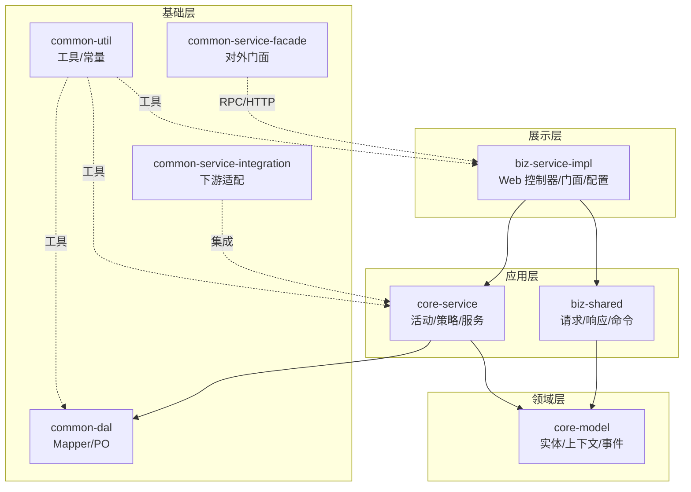
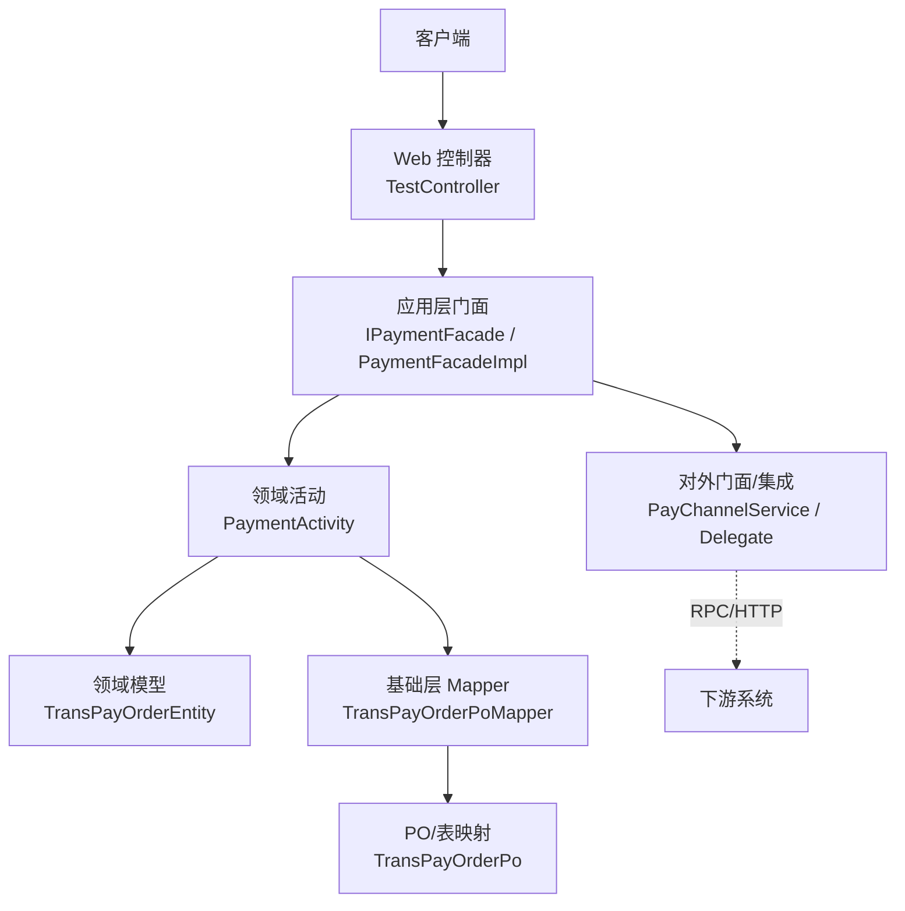
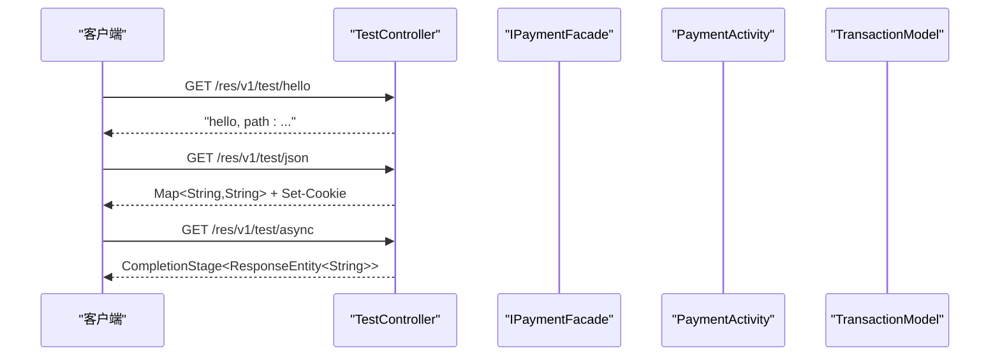
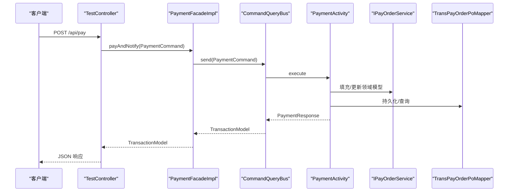
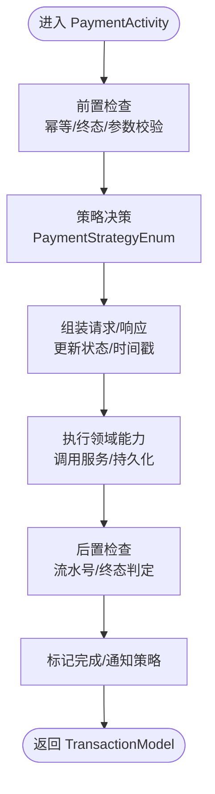
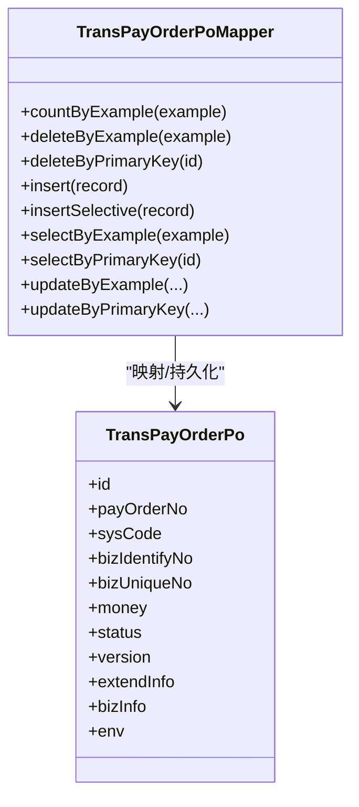
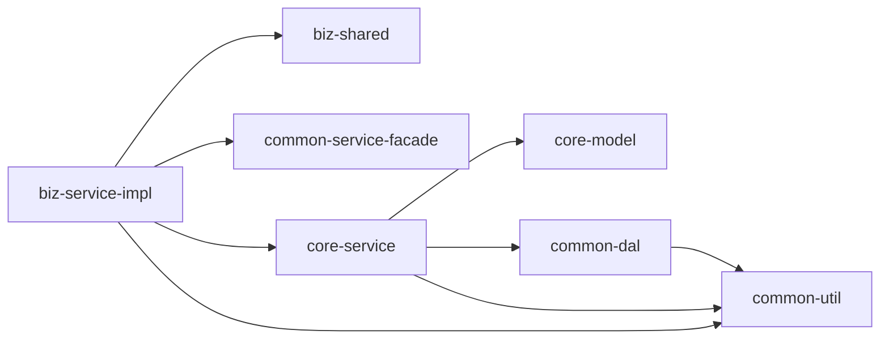

# 分层架构设计

<cite>
**本文引用的文件**
- [DomainDrivenTransactionSysApplication.java](file://biz-service-impl/src/main/java/com/magicliang/transaction/sys/DomainDrivenTransactionSysApplication.java)
- [TestController.java](file://biz-service-impl/src/main/java/com/magicliang/transaction/sys/biz/service/impl/web/controller/TestController.java)
- [IPaymentFacade.java](file://biz-service-impl/src/main/java/com/magicliang/transaction/sys/biz/service/impl/facade/IPaymentFacade.java)
- [PaymentFacadeImpl.java](file://biz-service-impl/src/main/java/com/magicliang/transaction/sys/biz/service/impl/facade/impl/PaymentFacadeImpl.java)
- [PaymentActivity.java](file://core-service/src/main/java/com/magicliang/transaction/sys/core/domain/activity/payment/PaymentActivity.java)
- [IPayOrderService.java](file://core-service/src/main/java/com/magicliang/transaction/sys/core/service/IPayOrderService.java)
- [TransPayOrderEntity.java](file://core-model/src/main/java/com/magicliang/transaction/sys/core/model/entity/TransPayOrderEntity.java)
- [TransPayOrderPoMapper.java](file://common-dal/src/main/java/com/magicliang/transaction/sys/common/dal/mybatis/mapper/TransPayOrderPoMapper.java)
- [TransPayOrderPo.java](file://common-dal/src/main/java/com/magicliang/transaction/sys/common/dal/mybatis/po/TransPayOrderPo.java)
- [PaymentCommand.java](file://biz-shared/src/main/java/com/magicliang/transaction/sys/biz/shared/request/payment/PaymentCommand.java)
- [TransactionModel.java](file://core-model/src/main/java/com/magicliang/transaction/sys/core/model/context/TransactionModel.java)
- [application.yml](file://biz-service-impl/src/main/resources/application.yml)
- [settings.gradle](file://settings.gradle)
- [build.gradle](file://build.gradle)
- [biz-service-impl/build.gradle](file://biz-service-impl/build.gradle)
</cite>

## 目录
1. [引言](#引言)
2. [项目结构](#项目结构)
3. [核心组件](#核心组件)
4. [架构总览](#架构总览)
5. [详细组件分析](#详细组件分析)
6. [依赖分析](#依赖分析)
7. [性能考量](#性能考量)
8. [故障排查指南](#故障排查指南)
9. [结论](#结论)
10. [附录](#附录)

## 引言
本文件面向领域驱动交易系统，围绕 SOA 分层架构的四个核心层次进行系统化设计与说明：展示层（Presentation Layer）、应用层（Application Layer）、领域层（Domain Layer）、基础层（Infrastructure Layer）。文档旨在帮助开发者理解各层职责边界、接口定义与交互规则，掌握从展示层到领域层的调用链路与依赖倒置原则的应用，并通过图示化方式呈现模块依赖关系与数据流。

## 项目结构
本项目采用多模块 Gradle 构建，模块划分遵循“按职责与边界”组织，体现清晰的分层与解耦：
- biz-service-impl：对外服务入口与 Web 控制器、门面实现、Web 配置与异常处理等
- biz-shared：跨模块共享的请求/响应模型、枚举与命令转换器等
- core-model：领域模型、实体、值对象、上下文与事件等
- core-service：核心业务活动、策略、服务与管理器
- common-dal：数据访问层（MyBatis Mapper/PO）
- common-service-facade：对外服务门面（RPC/HTTP）
- common-service-integration：下游集成适配器
- common-util：通用工具与常量
- settings.gradle 与根 build.gradle：统一依赖与插件管理

图表来源
- [settings.gradle:6-14](file://settings.gradle#L6-L14)
- [build.gradle:165-284](file://build.gradle#L165-L284)
- [biz-service-impl/build.gradle:5-23](file://biz-service-impl/build.gradle#L5-L23)

章节来源
- [settings.gradle:1-16](file://settings.gradle#L1-L16)
- [build.gradle:1-310](file://build.gradle#L1-L310)
- [biz-service-impl/build.gradle:1-80](file://biz-service-impl/build.gradle#L1-L80)

## 核心组件
- 展示层（Web 控制器）：负责接收 HTTP 请求、封装响应、处理跨域与过滤器等，典型入口为测试控制器。
- 应用层（门面/服务编排）：对外暴露业务能力，协调领域活动与基础设施，典型为支付门面。
- 领域层（实体/活动/策略）：承载核心业务规则与状态迁移，典型为支付活动与支付订单实体。
- 基础层（数据访问/集成）：提供持久化与外部系统集成能力，典型为 MyBatis Mapper 与对外门面。

章节来源
- [TestController.java:38-241](file://biz-service-impl/src/main/java/com/magicliang/transaction/sys/biz/service/impl/web/controller/TestController.java#L38-L241)
- [IPaymentFacade.java:18-57](file://biz-service-impl/src/main/java/com/magicliang/transaction/sys/biz/service/impl/facade/IPaymentFacade.java#L18-L57)
- [PaymentFacadeImpl.java:32-165](file://biz-service-impl/src/main/java/com/magicliang/transaction/sys/biz/service/impl/facade/impl/PaymentFacadeImpl.java#L32-L165)
- [PaymentActivity.java:36-201](file://core-service/src/main/java/com/magicliang/transaction/sys/core/domain/activity/payment/PaymentActivity.java#L36-L201)
- [TransPayOrderEntity.java:32-215](file://core-model/src/main/java/com/magicliang/transaction/sys/core/model/entity/TransPayOrderEntity.java#L32-L215)
- [TransPayOrderPoMapper.java:20-266](file://common-dal/src/main/java/com/magicliang/transaction/sys/common/dal/mybatis/mapper/TransPayOrderPoMapper.java#L20-L266)

## 架构总览
SOA 分层架构在本项目中的落地要点：
- 展示层仅负责请求接入与响应封装，不包含业务逻辑
- 应用层通过门面/服务编排领域活动，承担事务边界与并发控制
- 领域层聚焦业务规则与状态机，保持高内聚低耦合
- 基础层屏蔽数据源与外部系统差异，向上提供稳定接口

图表来源
- [TestController.java:48-70](file://biz-service-impl/src/main/java/com/magicliang/transaction/sys/biz/service/impl/web/controller/TestController.java#L48-L70)
- [IPaymentFacade.java:18-57](file://biz-service-impl/src/main/java/com/magicliang/transaction/sys/biz/service/impl/facade/IPaymentFacade.java#L18-L57)
- [PaymentFacadeImpl.java:115-147](file://biz-service-impl/src/main/java/com/magicliang/transaction/sys/biz/service/impl/facade/impl/PaymentFacadeImpl.java#L115-L147)
- [PaymentActivity.java:38-169](file://core-service/src/main/java/com/magicliang/transaction/sys/core/domain/activity/payment/PaymentActivity.java#L38-L169)
- [TransPayOrderEntity.java:32-215](file://core-model/src/main/java/com/magicliang/transaction/sys/core/model/entity/TransPayOrderEntity.java#L32-L215)
- [TransPayOrderPoMapper.java:20-266](file://common-dal/src/main/java/com/magicliang/transaction/sys/common/dal/mybatis/mapper/TransPayOrderPoMapper.java#L20-L266)

## 详细组件分析

### 展示层（Web 控制器）
- 职责边界：接收 HTTP 请求、设置响应头/Cookie、处理重定向与流式响应；不包含业务逻辑
- 典型入口：测试控制器提供健康检查、JSON 返回、异步响应、重定向与多媒体下载等示例
- 交互规则：通过应用层门面进行业务编排，返回标准化响应体

图表来源
- [TestController.java:65-105](file://biz-service-impl/src/main/java/com/magicliang/transaction/sys/biz/service/impl/web/controller/TestController.java#L65-L105)

章节来源
- [TestController.java:38-241](file://biz-service-impl/src/main/java/com/magicliang/transaction/sys/biz/service/impl/web/controller/TestController.java#L38-L241)

### 应用层（门面与服务编排）
- 职责边界：对外暴露业务能力，协调领域活动与基础设施，承担事务边界与并发控制
- 典型接口：支付门面接口定义批量支付、单笔支付、异步支付与支付+通知
- 典型实现：支付门面实现通过命令总线发送命令、批量任务提交、通知门面异步通知

图表来源
- [IPaymentFacade.java:18-57](file://biz-service-impl/src/main/java/com/magicliang/transaction/sys/biz/service/impl/facade/IPaymentFacade.java#L18-L57)
- [PaymentFacadeImpl.java:115-147](file://biz-service-impl/src/main/java/com/magicliang/transaction/sys/biz/service/impl/facade/impl/PaymentFacadeImpl.java#L115-L147)
- [PaymentActivity.java:95-120](file://core-service/src/main/java/com/magicliang/transaction/sys/core/domain/activity/payment/PaymentActivity.java#L95-L120)
- [IPayOrderService.java:16-157](file://core-service/src/main/java/com/magicliang/transaction/sys/core/service/IPayOrderService.java#L16-L157)
- [TransPayOrderPoMapper.java:20-266](file://common-dal/src/main/java/com/magicliang/transaction/sys/common/dal/mybatis/mapper/TransPayOrderPoMapper.java#L20-L266)

章节来源
- [IPaymentFacade.java:18-57](file://biz-service-impl/src/main/java/com/magicliang/transaction/sys/biz/service/impl/facade/IPaymentFacade.java#L18-L57)
- [PaymentFacadeImpl.java:32-165](file://biz-service-impl/src/main/java/com/magicliang/transaction/sys/biz/service/impl/facade/impl/PaymentFacadeImpl.java#L32-L165)

### 领域层（业务逻辑与状态机）
- 职责边界：承载核心业务规则与状态迁移，保证业务一致性与幂等性
- 典型组件：支付活动负责前置检查、策略决策、前后置钩子与状态迁移；支付订单实体承载业务属性与状态变更

图表来源
- [PaymentActivity.java:52-169](file://core-service/src/main/java/com/magicliang/transaction/sys/core/domain/activity/payment/PaymentActivity.java#L52-L169)
- [TransPayOrderEntity.java:196-204](file://core-model/src/main/java/com/magicliang/transaction/sys/core/model/entity/TransPayOrderEntity.java#L196-L204)

章节来源
- [PaymentActivity.java:36-201](file://core-service/src/main/java/com/magicliang/transaction/sys/core/domain/activity/payment/PaymentActivity.java#L36-L201)
- [TransPayOrderEntity.java:32-215](file://core-model/src/main/java/com/magicliang/transaction/sys/core/model/entity/TransPayOrderEntity.java#L32-L215)

### 基础层（数据访问与集成）
- 职责边界：屏蔽数据源与外部系统差异，向上提供稳定接口
- 典型组件：MyBatis Mapper 提供 PO 与 SQL 映射；对外门面/集成适配器对接下游系统

图表来源
- [TransPayOrderPoMapper.java:20-266](file://common-dal/src/main/java/com/magicliang/transaction/sys/common/dal/mybatis/mapper/TransPayOrderPoMapper.java#L20-L266)
- [TransPayOrderPo.java:9-800](file://common-dal/src/main/java/com/magicliang/transaction/sys/common/dal/mybatis/po/TransPayOrderPo.java#L9-L800)

章节来源
- [TransPayOrderPoMapper.java:20-266](file://common-dal/src/main/java/com/magicliang/transaction/sys/common/dal/mybatis/mapper/TransPayOrderPoMapper.java#L20-L266)
- [TransPayOrderPo.java:9-800](file://common-dal/src/main/java/com/magicliang/transaction/sys/common/dal/mybatis/po/TransPayOrderPo.java#L9-L800)

## 依赖分析
- 模块依赖：biz-service-impl 依赖 biz-shared 与 common-service-facade；核心业务在 core-service 中实现；数据访问在 common-dal；工具与常量在 common-util
- 配置与运行：根工程统一管理插件与依赖；biz-service-impl 通过 Spring Boot 启动入口加载上下文与数据源配置

图表来源
- [settings.gradle:6-14](file://settings.gradle#L6-L14)
- [build.gradle:165-284](file://build.gradle#L165-L284)
- [biz-service-impl/build.gradle:5-23](file://biz-service-impl/build.gradle#L5-L23)

章节来源
- [settings.gradle:1-16](file://settings.gradle#L1-L16)
- [build.gradle:1-310](file://build.gradle#L1-L310)
- [biz-service-impl/build.gradle:1-80](file://biz-service-impl/build.gradle#L1-L80)

## 性能考量
- 并发与吞吐：支付门面实现中对批量支付线程池与吞吐量估算体现了对并发与资源限制的考虑
- 数据访问：MyBatis Mapper 提供批量操作与条件查询，建议结合分页与索引优化
- 配置与连接池：应用配置中包含 Hikari 连接池参数，需根据环境调优

章节来源
- [PaymentFacadeImpl.java:37-52](file://biz-service-impl/src/main/java/com/magicliang/transaction/sys/biz/service/impl/facade/impl/PaymentFacadeImpl.java#L37-L52)
- [application.yml:24-32](file://biz-service-impl/src/main/resources/application.yml#L24-L32)

## 故障排查指南
- 启动与数据源：应用入口明确指出若使用 XML 或自定义配置需排除自动数据源配置，避免启动失败
- 日志与配置：不同 Profile 下的日志级别与 SQL 打印可通过配置文件切换
- 异常处理：Web 层提供统一异常处理与响应封装，便于定位问题

章节来源
- [DomainDrivenTransactionSysApplication.java:22-51](file://biz-service-impl/src/main/java/com/magicliang/transaction/sys/DomainDrivenTransactionSysApplication.java#L22-L51)
- [application.yml:48-80](file://biz-service-impl/src/main/resources/application.yml#L48-L80)

## 结论
本项目通过清晰的分层架构与模块划分，实现了展示层、应用层、领域层与基础层的职责分离与依赖倒置。展示层仅负责接入与响应，应用层承担编排与事务边界，领域层专注业务规则与状态机，基础层屏蔽外部差异。配合命令总线、活动与策略模式，系统具备良好的扩展性与可维护性。

## 附录
- 启动入口与配置：应用主类加载 Spring 上下文与数据源配置，支持多 Profile 与连接池参数
- 模块清单：settings.gradle 定义模块集合，根 build.gradle 统一插件与依赖管理

章节来源
- [DomainDrivenTransactionSysApplication.java:52-73](file://biz-service-impl/src/main/java/com/magicliang/transaction/sys/DomainDrivenTransactionSysApplication.java#L52-L73)
- [application.yml:1-216](file://biz-service-impl/src/main/resources/application.yml#L1-L216)
- [settings.gradle:1-16](file://settings.gradle#L1-L16)
- [build.gradle:1-310](file://build.gradle#L1-L310)