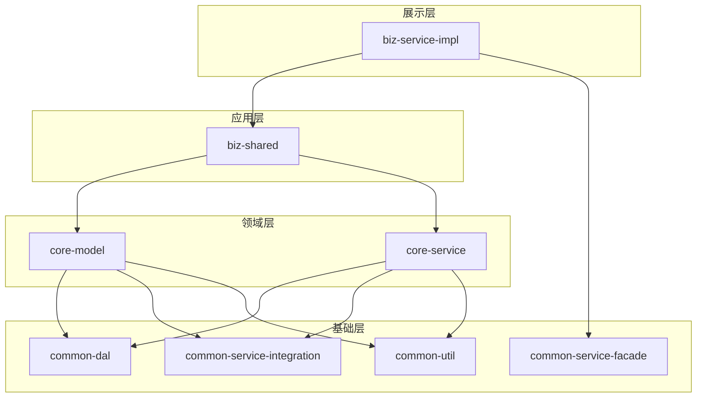
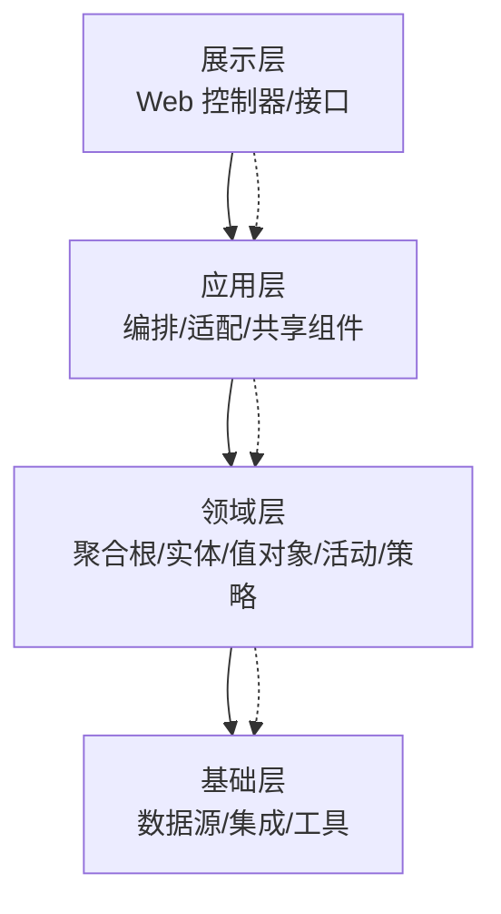
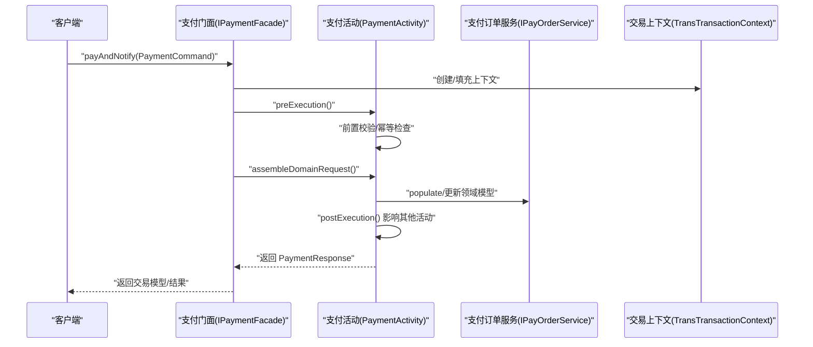
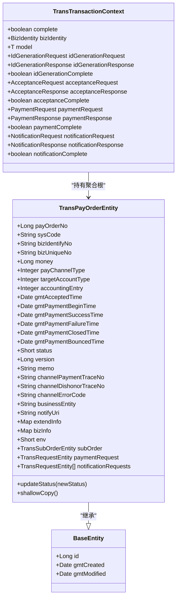
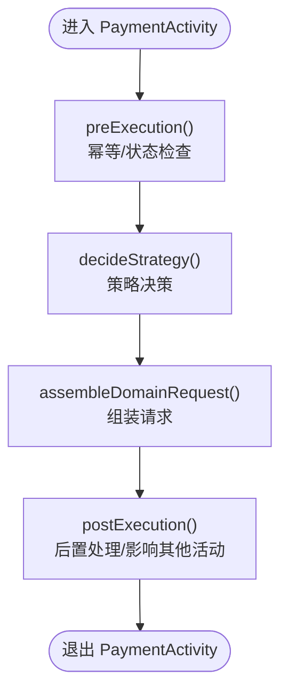
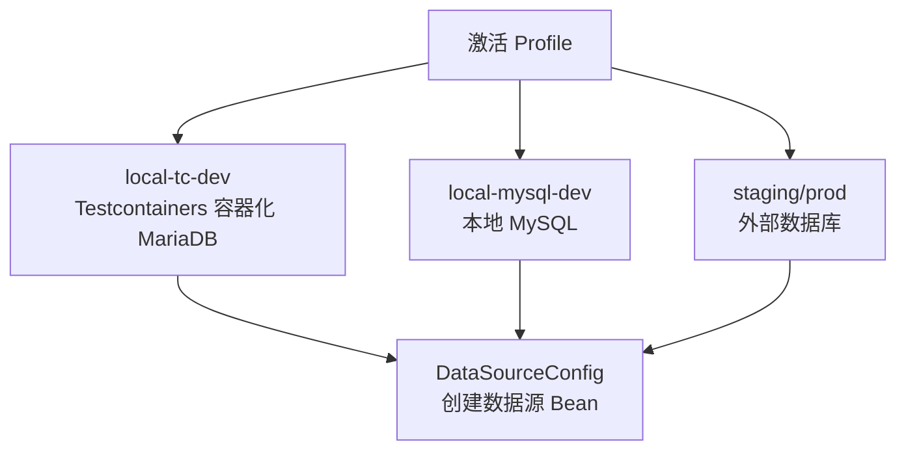
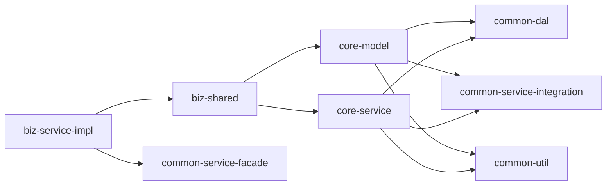

# 架构设计

<cite>
**本文档引用的文件**
- [README.md](file://README.md)
- [build.gradle](file://build.gradle)
- [settings.gradle](file://settings.gradle)
- [DomainDrivenTransactionSysApplication.java](file://biz-service-impl/src/main/java/com/magicliang/transaction/sys/DomainDrivenTransactionSysApplication.java)
- [build.gradle](file://biz-service-impl/build.gradle)
- [TransPayOrderEntity.java](file://core-model/src/main/java/com/magicliang/transaction/sys/core/model/entity/TransPayOrderEntity.java)
- [BaseEntity.java](file://core-model/src/main/java/com/magicliang/transaction/sys/core/model/entity/BaseEntity.java)
- [Entity.java](file://core-model/src/main/java/com/magicliang/transaction/sys/core/shared/Entity.java)
- [ValueObject.java](file://core-model/src/main/java/com/magicliang/transaction/sys/core/shared/ValueObject.java)
- [TransTransactionContext.java](file://core-model/src/main/java/com/magicliang/transaction/sys/core/model/context/TransTransactionContext.java)
- [PaymentActivity.java](file://core-service/src/main/java/com/magicliang/transaction/sys/core/domain/activity/payment/PaymentActivity.java)
- [IPaymentFacade.java](file://biz-service-impl/src/main/java/com/magicliang/transaction/sys/biz/service/impl/facade/IPaymentFacade.java)
- [IPayOrderService.java](file://core-service/src/main/java/com/magicliang/transaction/sys/core/service/IPayOrderService.java)
- [DataSourceConfig.java](file://common-dal/src/main/java/com/magicliang/transaction/sys/common/dal/datasource/DataSourceConfig.java)
- [PaymentCommand.java](file://biz-shared/src/main/java/com/magicliang/transaction/sys/biz/shared/request/payment/PaymentCommand.java)
</cite>

## 目录
1. [引言](#引言)
2. [项目结构](#项目结构)
3. [核心组件](#核心组件)
4. [架构总览](#架构总览)
5. [详细组件分析](#详细组件分析)
6. [依赖分析](#依赖分析)
7. [性能考量](#性能考量)
8. [故障排查指南](#故障排查指南)
9. [结论](#结论)
10. [附录](#附录)

## 引言
本项目是一个基于领域驱动设计（DDD）思想的交易系统示例，采用 SOFA 分层架构与 Gradle 多模块组织方式，结合 Spring Boot 2.7.18 与 MyBatis，演示企业级交易系统的分层职责、模块边界与交互关系。本文档旨在帮助开发者快速理解系统整体结构、分层职责、模块依赖、领域模型与核心流程，并提供架构演进与最佳实践建议。

## 项目结构
项目采用 Gradle 多模块构建，模块划分遵循“展示层-应用层-领域层-基础层”的 SOFA 分层原则，同时在业务与技术层面进一步拆分共享与公共能力模块，形成清晰的职责边界与依赖方向。

- 展示层（biz-service-impl）：提供 Web MVC/WebFlux 接口与控制器，负责请求接入、参数校验与响应封装，作为可启动模块。
- 应用层（biz-shared）：提供业务共享组件（请求/响应、处理器、事件、命令总线等），为展示层与领域层之间提供编排与适配。
- 领域层（core-model、core-service）：核心领域模型与业务服务，包含聚合根、实体、值对象、领域活动与策略等，承载核心业务规则。
- 基础层（common-dal、common-service-facade、common-service-integration、common-util）：数据访问、服务门面、第三方集成与通用工具，为上层提供技术支撑。

**图表来源**
- [settings.gradle:6-14](file://settings.gradle#L6-L14)
- [build.gradle:7-11](file://biz-service-impl/build.gradle#L7-L11)

**章节来源**
- [README.md:23-46](file://README.md#L23-L46)
- [settings.gradle:6-14](file://settings.gradle#L6-L14)
- [build.gradle:165-284](file://build.gradle#L165-L284)

## 核心组件
- 展示层入口与启动配置：biz-service-impl 提供 Spring Boot 启动类，启用事务管理与 XML 配置导入，负责应用初始化与资源清理。
- 应用层接口与命令：biz-shared 定义业务命令与请求/响应模型，以及处理器与命令总线等共享能力。
- 领域模型与上下文：core-model 定义实体、值对象、聚合根与交易上下文；core-service 提供领域活动与策略，承载核心业务编排。
- 基础设施：common-dal 提供数据源配置；common-service-facade 与 common-service-integration 提供对外服务门面与第三方集成能力；common-util 提供通用工具与异常体系。

**章节来源**
- [DomainDrivenTransactionSysApplication.java:52-73](file://biz-service-impl/src/main/java/com/magicliang/transaction/sys/DomainDrivenTransactionSysApplication.java#L52-L73)
- [IPaymentFacade.java:18-57](file://biz-service-impl/src/main/java/com/magicliang/transaction/sys/biz/service/impl/facade/IPaymentFacade.java#L18-L57)
- [TransPayOrderEntity.java:21-32](file://core-model/src/main/java/com/magicliang/transaction/sys/core/model/entity/TransPayOrderEntity.java#L21-L32)
- [TransTransactionContext.java:26-138](file://core-model/src/main/java/com/magicliang/transaction/sys/core/model/context/TransTransactionContext.java#L26-L138)
- [IPayOrderService.java:16-157](file://core-service/src/main/java/com/magicliang/transaction/sys/core/service/IPayOrderService.java#L16-L157)
- [DataSourceConfig.java:22-52](file://common-dal/src/main/java/com/magicliang/transaction/sys/common/dal/datasource/DataSourceConfig.java#L22-L52)

## 架构总览
SOFA 分层架构强调“展示层-应用层-领域层-基础层”的职责分离与依赖方向，避免跨层耦合，确保业务逻辑集中在领域层，基础设施下沉至基础层。

**图表来源**
- [README.md:547-560](file://README.md#L547-L560)

**章节来源**
- [README.md:547-560](file://README.md#L547-L560)

## 详细组件分析

### 分层职责与交互
- 展示层：接收请求、参数校验、响应封装，必要时触发应用层编排。
- 应用层：编排业务流程、协调领域活动、管理事务边界，向上提供稳定接口。
- 领域层：实现核心业务规则与状态迁移，维护聚合一致性。
- 基础层：提供数据访问、第三方集成与通用工具，屏蔽技术细节。

**图表来源**
- [IPaymentFacade.java:33-56](file://biz-service-impl/src/main/java/com/magicliang/transaction/sys/biz/service/impl/facade/IPaymentFacade.java#L33-L56)
- [PaymentActivity.java:52-169](file://core-service/src/main/java/com/magicliang/transaction/sys/core/domain/activity/payment/PaymentActivity.java#L52-L169)
- [IPayOrderService.java:135-147](file://core-service/src/main/java/com/magicliang/transaction/sys/core/service/IPayOrderService.java#L135-L147)
- [TransTransactionContext.java:26-138](file://core-model/src/main/java/com/magicliang/transaction/sys/core/model/context/TransTransactionContext.java#L26-L138)

**章节来源**
- [IPaymentFacade.java:18-57](file://biz-service-impl/src/main/java/com/magicliang/transaction/sys/biz/service/impl/facade/IPaymentFacade.java#L18-L57)
- [PaymentActivity.java:36-169](file://core-service/src/main/java/com/magicliang/transaction/sys/core/domain/activity/payment/PaymentActivity.java#L36-L169)
- [IPayOrderService.java:16-157](file://core-service/src/main/java/com/magicliang/transaction/sys/core/service/IPayOrderService.java#L16-L157)
- [TransTransactionContext.java:26-138](file://core-model/src/main/java/com/magicliang/transaction/sys/core/model/context/TransTransactionContext.java#L26-L138)

### 领域模型与聚合设计
- 聚合根：支付订单实体（TransPayOrderEntity）作为聚合根，聚合内包含子订单、支付请求与通知请求等附属对象，负责状态迁移与一致性。
- 实体与值对象：基础实体（BaseEntity）提供通用字段；领域共享接口（Entity、ValueObject）定义身份与值相等性约定。
- 交易上下文：TransTransactionContext 统一承载各活动的请求/响应与完成状态，贯穿一次交易全流程。

**图表来源**
- [BaseEntity.java:17-36](file://core-model/src/main/java/com/magicliang/transaction/sys/core/model/entity/BaseEntity.java#L17-L36)
- [TransPayOrderEntity.java:27-215](file://core-model/src/main/java/com/magicliang/transaction/sys/core/model/entity/TransPayOrderEntity.java#L27-L215)
- [TransTransactionContext.java:26-138](file://core-model/src/main/java/com/magicliang/transaction/sys/core/model/context/TransTransactionContext.java#L26-L138)

**章节来源**
- [BaseEntity.java:17-36](file://core-model/src/main/java/com/magicliang/transaction/sys/core/model/entity/BaseEntity.java#L17-L36)
- [TransPayOrderEntity.java:18-215](file://core-model/src/main/java/com/magicliang/transaction/sys/core/model/entity/TransPayOrderEntity.java#L18-L215)
- [Entity.java:6-16](file://core-model/src/main/java/com/magicliang/transaction/sys/core/shared/Entity.java#L6-L16)
- [ValueObject.java:8-18](file://core-model/src/main/java/com/magicliang/transaction/sys/core/shared/ValueObject.java#L8-L18)
- [TransTransactionContext.java:26-138](file://core-model/src/main/java/com/magicliang/transaction/sys/core/model/context/TransTransactionContext.java#L26-L138)

### 领域活动与策略
- PaymentActivity 负责支付活动的前置校验、请求组装、策略决策与后置处理，确保幂等与状态迁移正确。
- 通过策略枚举与策略集合，实现支付策略的可插拔扩展。

**图表来源**
- [PaymentActivity.java:52-169](file://core-service/src/main/java/com/magicliang/transaction/sys/core/domain/activity/payment/PaymentActivity.java#L52-L169)

**章节来源**
- [PaymentActivity.java:36-169](file://core-service/src/main/java/com/magicliang/transaction/sys/core/domain/activity/payment/PaymentActivity.java#L36-L169)

### 数据源与持久化
- 通过 DataSourceConfig 在不同 Profile 下创建主/从数据源 Bean，支持本地 MySQL 与生产环境外部数据库。
- 项目通过 Spring Profile 切换数据库接入方式，支持 Testcontainers 自动化容器化数据库与嵌入式 MariaDB。

**图表来源**
- [DataSourceConfig.java:22-52](file://common-dal/src/main/java/com/magicliang/transaction/sys/common/dal/datasource/DataSourceConfig.java#L22-L52)
- [README.md:84-130](file://README.md#L84-L130)

**章节来源**
- [DataSourceConfig.java:22-52](file://common-dal/src/main/java/com/magicliang/transaction/sys/common/dal/datasource/DataSourceConfig.java#L22-L52)
- [README.md:84-130](file://README.md#L84-L130)

## 依赖分析
- 模块间依赖方向：展示层依赖应用层与服务门面；应用层依赖领域模型与服务；领域层依赖数据访问与集成；基础层为上层提供基础设施。
- 构建与插件：根工程统一管理 Spring Cloud 版本与 JUnit 版本，子模块统一引入 Spring Boot Starter、Log4j2、OpenTelemetry 等依赖。
- 启动与打包：biz-service-impl 作为可启动模块，启用 bootJar；其他模块以库形式提供能力。

**图表来源**
- [settings.gradle:6-14](file://settings.gradle#L6-L14)
- [build.gradle:7-11](file://biz-service-impl/build.gradle#L7-L11)

**章节来源**
- [settings.gradle:6-14](file://settings.gradle#L6-L14)
- [build.gradle:165-284](file://build.gradle#L165-L284)
- [build.gradle:5-23](file://biz-service-impl/build.gradle#L5-L23)

## 性能考量
- 并行测试：根工程配置测试任务并行执行，提升测试效率。
- 观测性：引入 OpenTelemetry 仪器化，便于追踪与性能分析。
- 数据库 Profile：推荐使用 Testcontainers（local-tc-dev）进行本地开发，避免外部依赖；生产环境通过 K8s 注入配置，确保连接参数与资源限制合理。

**章节来源**
- [build.gradle:253-272](file://build.gradle#L253-L272)
- [README.md:21-22](file://README.md#L21-L22)
- [README.md:334-340](file://README.md#L334-L340)

## 故障排查指南
- 启动失败（数据源未配置）：若使用自定义数据源配置，请确保排除自动数据源配置或正确提供 URL/驱动等属性。
- Profile 切换：确认启动参数或环境变量中 SPRING_PROFILES_ACTIVE 与 application.yml 中的 profile 段一致。
- 数据库初始化：K8s 环境首次启动会执行初始化 SQL；如需变更，修改 ConfigMap 后重建环境。
- 日志级别：通过 ConfigMap 覆盖 LOGGING_CONFIG，区分线下详细日志与线上精简日志。

**章节来源**
- [DomainDrivenTransactionSysApplication.java:22-51](file://biz-service-impl/src/main/java/com/magicliang/transaction/sys/DomainDrivenTransactionSysApplication.java#L22-L51)
- [README.md:347-521](file://README.md#L347-L521)

## 结论
本项目以 DDD 为核心，结合 SOFA 分层与 Gradle 多模块，实现了清晰的职责边界与可演进的架构形态。通过交易上下文与领域活动的组合，系统在保持领域逻辑内聚的同时，具备良好的扩展性与可测试性。建议在后续迭代中持续完善测试用例、引入微服务拆分与事件驱动，以支撑更大规模的业务增长。

## 附录
- 快速开始与测试：参考根 README 的构建与测试命令，确保本地环境满足 JDK 与 Gradle 版本要求。
- 部署策略：支持 Docker + K8s 部署，提供 dev/staging/prod 三套环境模板，建议结合 CI/CD 自动化部署。

**章节来源**
- [README.md:48-82](file://README.md#L48-L82)
- [README.md:216-321](file://README.md#L216-L321)