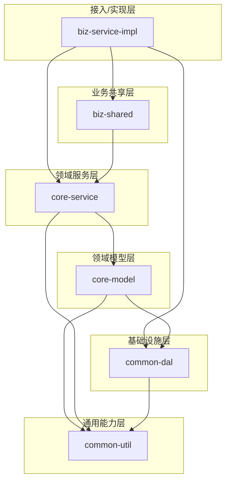
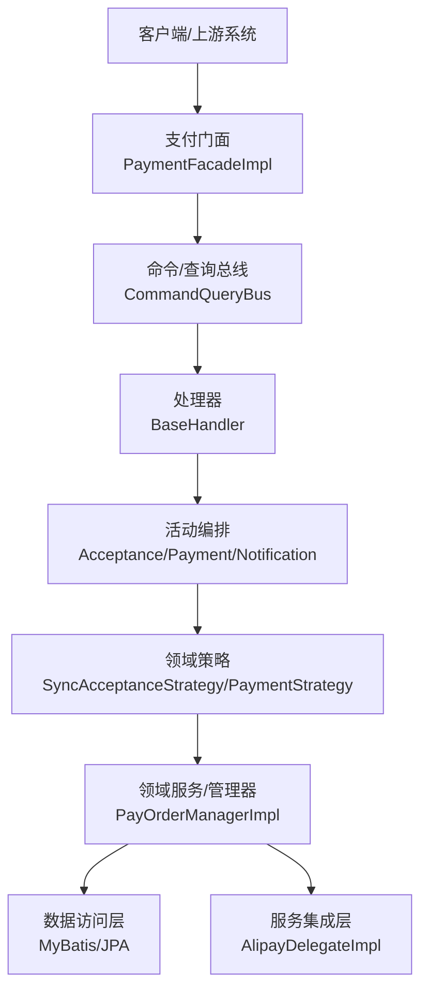
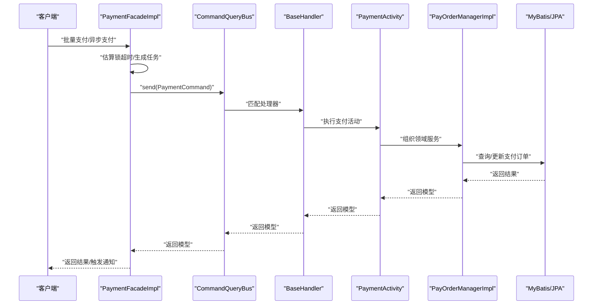
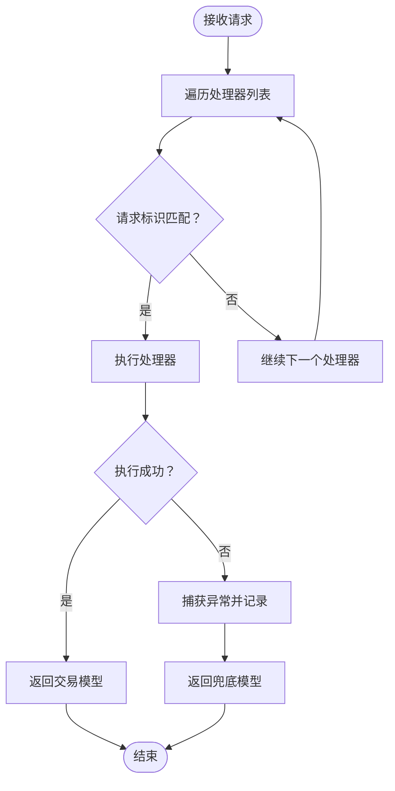
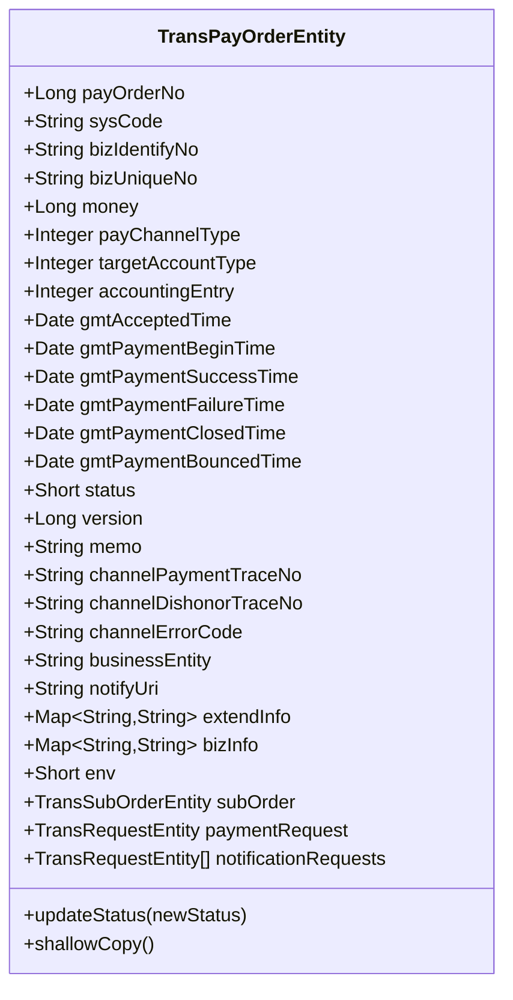
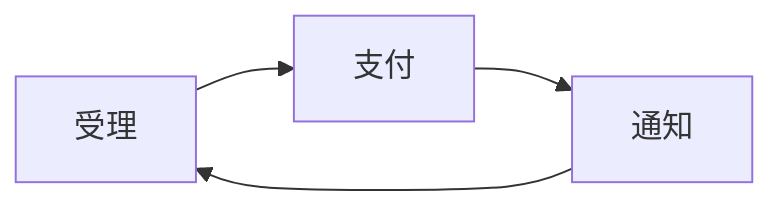
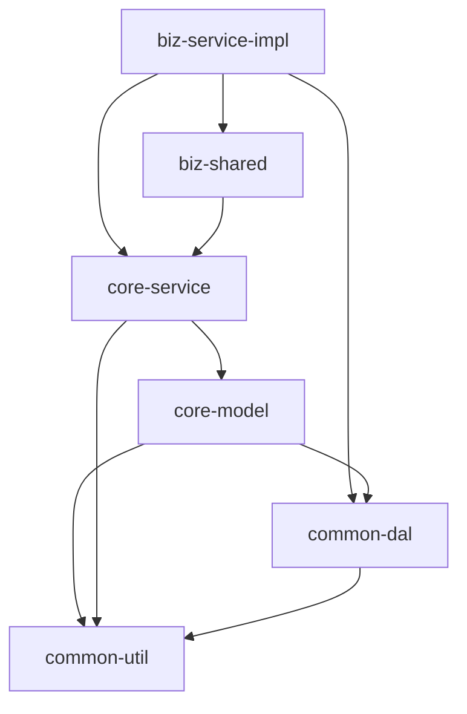

# 架构评估报告-DDD-COLA-SOFA

<cite>
**本文档引用的文件**
- [README.md](file://README.md)
- [架构评估报告-DDD-COLA-SOFA.md](file://架构评估报告-DDD-COLA-SOFA.md)
- [settings.gradle](file://settings.gradle)
- [build.gradle](file://build.gradle)
- [biz-service-impl/build.gradle](file://biz-service-impl/build.gradle)
- [core-model/build.gradle](file://core-model/build.gradle)
- [core-service/build.gradle](file://core-service/build.gradle)
- [biz-shared/build.gradle](file://biz-shared/build.gradle)
- [common-dal/build.gradle](file://common-dal/build.gradle)
- [DomainDrivenTransactionSysApplication.java](file://biz-service-impl/src/main/java/com/magicliang/transaction/sys/DomainDrivenTransactionSysApplication.java)
- [PaymentFacadeImpl.java](file://biz-service-impl/src/main/java/com/magicliang/transaction/sys/biz/service/impl/facade/impl/PaymentFacadeImpl.java)
- [CommandQueryBus.java](file://biz-shared/src/main/java/com/magicliang/transaction/sys/biz/shared/locator/CommandQueryBus.java)
- [TransPayOrderEntity.java](file://core-model/src/main/java/com/magicliang/transaction/sys/core/model/entity/TransPayOrderEntity.java)
</cite>

## 目录
1. [引言](#引言)
2. [项目结构](#项目结构)
3. [核心组件](#核心组件)
4. [架构总览](#架构总览)
5. [详细组件分析](#详细组件分析)
6. [依赖分析](#依赖分析)
7. [性能考量](#性能考量)
8. [故障排查指南](#故障排查指南)
9. [结论](#结论)
10. [附录](#附录)

## 引言
本报告围绕 domain-driven-transaction-sys 项目，基于 DDD（领域驱动设计）、COLA（面向对象与领域驱动设计的工程化落地）与蚂蚁 SOFA 分层架构进行对比评估。项目采用 Gradle 多模块构建，遵循 SOFA 分层理念，划分出接入/实现层、业务共享层、领域模型层、领域服务层、基础设施层与通用能力层。当前系统在模块分层与主链路设计方面表现良好，但在领域层与基础设施层的依赖倒置、关键路径空实现、以及工程规范一致性等方面存在改进空间。

## 项目结构
项目采用 Gradle 多模块结构，根项目负责统一依赖管理与测试配置，子模块按职责拆分，形成清晰的分层架构：

- 接入/实现层：biz-service-impl（Web 入口、门面编排、线程池与异步处理）
- 业务共享层：biz-shared（命令/查询总线、处理器、事件与公共请求/响应模型）
- 领域模型层：core-model（聚合根、实体、值对象、领域事件与转换器）
- 领域服务层：core-service（活动编排、策略、分布式锁与服务实现）
- 基础设施层：common-dal（MyBatis/JPA、数据源配置、Testcontainers/mariadb4j）
- 通用能力层：common-util（工具类、枚举、常量、异常与 APM 工具）

图表来源
- [settings.gradle:6-14](file://settings.gradle#L6-L14)
- [build.gradle:165-284](file://build.gradle#L165-L284)
- [biz-service-impl/build.gradle:5-23](file://biz-service-impl/build.gradle#L5-L23)
- [core-model/build.gradle:1-5](file://core-model/build.gradle#L1-L5)
- [core-service/build.gradle:1-5](file://core-service/build.gradle#L1-L5)
- [biz-shared/build.gradle:1-3](file://biz-shared/build.gradle#L1-L3)
- [common-dal/build.gradle:28-53](file://common-dal/build.gradle#L28-L53)

章节来源
- [settings.gradle:1-16](file://settings.gradle#L1-L16)
- [build.gradle:165-284](file://build.gradle#L165-L284)

## 核心组件
- 启动入口：DomainDrivenTransactionSysApplication 负责应用启动、Bean 初始化与资源清理，提供命令行启动钩子与调试信息输出。
- 支付门面：PaymentFacadeImpl 提供批量支付、异步支付与支付后通知的编排能力，使用线程池与分布式锁保障并发与幂等。
- 命令/查询总线：CommandQueryBus 通过处理器列表路由请求，支持异常捕获与耗时统计，当前采用线性扫描匹配。
- 聚合根实体：TransPayOrderEntity 作为支付订单聚合根，包含状态迁移与浅拷贝等行为，体现领域模型的职责。

章节来源
- [DomainDrivenTransactionSysApplication.java:62-149](file://biz-service-impl/src/main/java/com/magicliang/transaction/sys/DomainDrivenTransactionSysApplication.java#L62-L149)
- [PaymentFacadeImpl.java:34-165](file://biz-service-impl/src/main/java/com/magicliang/transaction/sys/biz/service/impl/facade/impl/PaymentFacadeImpl.java#L34-L165)
- [CommandQueryBus.java:27-78](file://biz-shared/src/main/java/com/magicliang/transaction/sys/biz/shared/locator/CommandQueryBus.java#L27-L78)
- [TransPayOrderEntity.java:32-215](file://core-model/src/main/java/com/magicliang/transaction/sys/core/model/entity/TransPayOrderEntity.java#L32-L215)

## 架构总览
系统采用 SOFA 分层与 DDD 工程化落地相结合的架构风格，主交易链路由门面层通过命令/查询总线分发至处理器，处理器组织活动（受理/支付/通知），活动根据策略执行，最终通过管理器与委托触达数据库与外部通道。该链路具备业务主干可读、可追踪与可扩展策略点的优势。

图表来源
- [PaymentFacadeImpl.java:66-147](file://biz-service-impl/src/main/java/com/magicliang/transaction/sys/biz/service/impl/facade/impl/PaymentFacadeImpl.java#L66-L147)
- [CommandQueryBus.java:42-77](file://biz-shared/src/main/java/com/magicliang/transaction/sys/biz/shared/locator/CommandQueryBus.java#L42-L77)
- [TransPayOrderEntity.java:32-215](file://core-model/src/main/java/com/magicliang/transaction/sys/core/model/entity/TransPayOrderEntity.java#L32-L215)

## 详细组件分析

### 支付门面组件分析
- 并发与吞吐：通过估算锁超时与线程池参数，实现批量支付的弹性控制；异步支付在成功后触发通知门面。
- 幂等与锁：使用分布式锁保护批量支付流程，避免重复执行。
- 任务映射：将支付订单映射为 Callable 任务，统一在线程池中执行。

图表来源
- [PaymentFacadeImpl.java:66-147](file://biz-service-impl/src/main/java/com/magicliang/transaction/sys/biz/service/impl/facade/impl/PaymentFacadeImpl.java#L66-L147)
- [CommandQueryBus.java:42-77](file://biz-shared/src/main/java/com/magicliang/transaction/sys/biz/shared/locator/CommandQueryBus.java#L42-L77)

章节来源
- [PaymentFacadeImpl.java:34-165](file://biz-service-impl/src/main/java/com/magicliang/transaction/sys/biz/service/impl/facade/impl/PaymentFacadeImpl.java#L34-L165)

### 命令/查询总线组件分析
- 路由机制：遍历处理器列表，通过请求标识匹配处理器并执行，异常被捕获并记录，最终返回交易模型。
- 可观测性：记录执行耗时与请求/响应 JSON，便于问题定位。
- 优化建议：当前为线性扫描，建议引入映射表以提升大规模场景下的匹配效率与可观测性。

图表来源
- [CommandQueryBus.java:42-77](file://biz-shared/src/main/java/com/magicliang/transaction/sys/biz/shared/locator/CommandQueryBus.java#L42-L77)

章节来源
- [CommandQueryBus.java:27-78](file://biz-shared/src/main/java/com/magicliang/transaction/sys/biz/shared/locator/CommandQueryBus.java#L27-L78)

### 聚合根实体组件分析
- 聚合根职责：包含支付订单的核心字段与状态迁移方法，提供浅拷贝能力，确保不变式与状态变更的可控性。
- 关系建模：聚合根持有子订单与请求等关联对象，体现领域聚合的边界与一致性。

图表来源
- [TransPayOrderEntity.java:32-215](file://core-model/src/main/java/com/magicliang/transaction/sys/core/model/entity/TransPayOrderEntity.java#L32-L215)

章节来源
- [TransPayOrderEntity.java:18-215](file://core-model/src/main/java/com/magicliang/transaction/sys/core/model/entity/TransPayOrderEntity.java#L18-L215)

### 概念性总览
系统主交易链路（受理 → 支付 → 通知）在架构上具备清晰的分层与可扩展性，适合在保持 SOFA 分层骨架的前提下，进一步通过 DDD 原则与 COLA 工程约束完善边界治理与规范落地。

（本图为概念性流程示意，不直接映射具体源文件）

## 依赖分析
模块间依赖关系体现了 SOFA 分层的工程化落地，但存在领域层对基础设施的反向依赖，建议通过引入适配器与仓储接口进行隔离。

图表来源
- [settings.gradle:6-14](file://settings.gradle#L6-L14)
- [biz-service-impl/build.gradle:5-12](file://biz-service-impl/build.gradle#L5-L12)
- [core-model/build.gradle:1-5](file://core-model/build.gradle#L1-L5)
- [core-service/build.gradle:1-5](file://core-service/build.gradle#L1-L5)
- [common-dal/build.gradle:28-53](file://common-dal/build.gradle#L28-L53)

章节来源
- [settings.gradle:1-16](file://settings.gradle#L1-L16)
- [build.gradle:165-284](file://build.gradle#L165-L284)

## 性能考量
- 并发与吞吐：通过估算锁超时与线程池参数控制批量支付的吞吐与稳定性；建议结合监控指标持续优化线程数与队列容量。
- 路由性能：命令/查询总线当前采用线性扫描，建议引入映射表以降低匹配成本与提升可观测性。
- 数据访问：MyBatis/JPA 与 Testcontainers/mariadb4j 的组合满足开发与测试需求，建议在生产环境明确 Profile 与资源限制。

（本节为通用性能讨论，不直接分析具体文件）

## 故障排查指南
- 启动与连接：启动类提供 Bean 列表与配置读取演示，建议在生产环境去除演示逻辑，保留必要的初始化与健康检查。
- 异常处理：命令/查询总线对处理器异常进行捕获与记录，建议完善错误码与告警策略，确保问题可追踪。
- 并发与锁：分布式锁用于保护批量支付流程，建议监控锁竞争与超时情况，避免死锁与长时间阻塞。

章节来源
- [DomainDrivenTransactionSysApplication.java:82-149](file://biz-service-impl/src/main/java/com/magicliang/transaction/sys/DomainDrivenTransactionSysApplication.java#L82-L149)
- [CommandQueryBus.java:55-77](file://biz-shared/src/main/java/com/magicliang/transaction/sys/biz/shared/locator/CommandQueryBus.java#L55-L77)

## 结论
本项目在 SOFA 分层骨架与 DDD 工程化落地方面具备良好基础，模块分层清晰、主链路可读性强。当前的核心短板在于领域层与基础设施层的依赖倒置尚未完全建立、关键路径存在空实现、以及工程规范一致性有待提升。建议采取“保留 SOFA 骨架 + 引入 DDD/COLA 边界治理”的渐进式演进策略，优先补齐主链路行为闭环，再逐步引入仓储与适配器隔离，最后在协作痛点突出时引入 COLA 的工程约束。

## 附录
- 项目背景与目标：基于 DDD 原则构建企业级交易系统，采用 Gradle 多模块与 SOFA 分层，支持多种数据库 Profile 与容器化部署。
- 评估范围与证据：模块结构、领域模型、活动编排、业务总线、门面编排、数据访问与模型转换、启动入口等。
- 决策建议：优先采用“先行为闭环，再边界治理，再范式化”的分阶段路线图，重点关注一致性模型、失败恢复与可观测性等交易系统关键风险。

章节来源
- [README.md:1-691](file://README.md#L1-L691)
- [架构评估报告-DDD-COLA-SOFA.md:1-335](file://架构评估报告-DDD-COLA-SOFA.md#L1-L335)