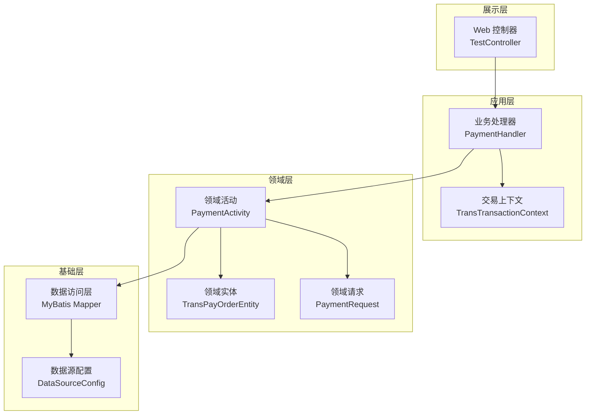
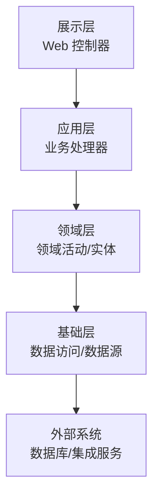
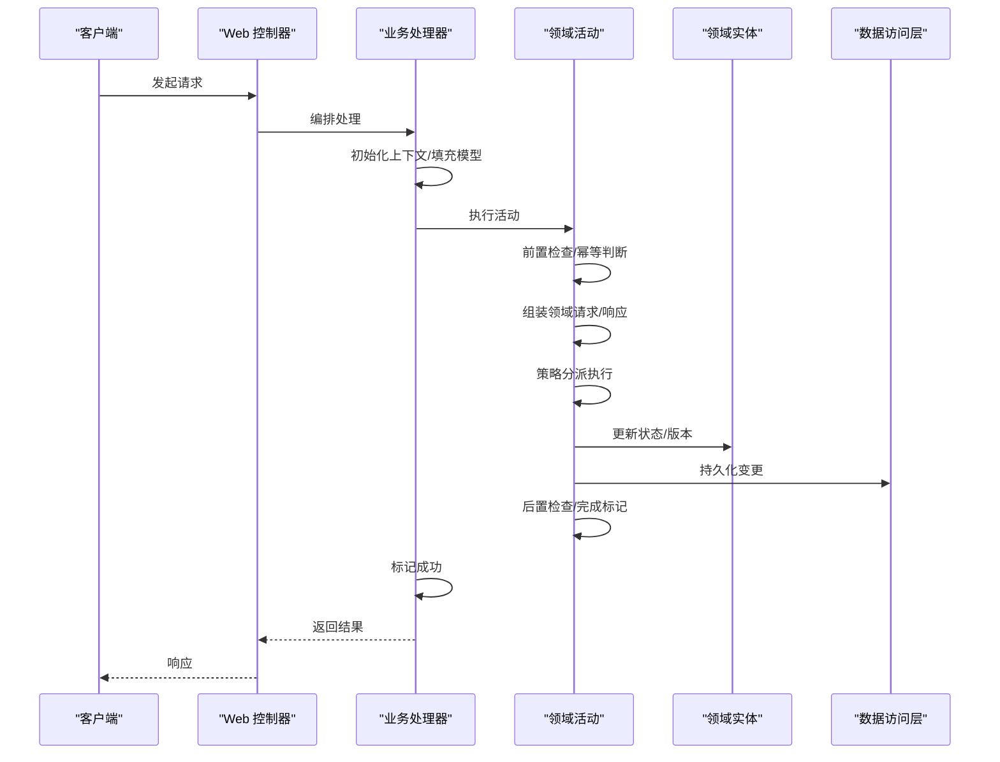
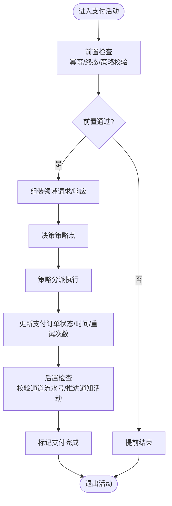
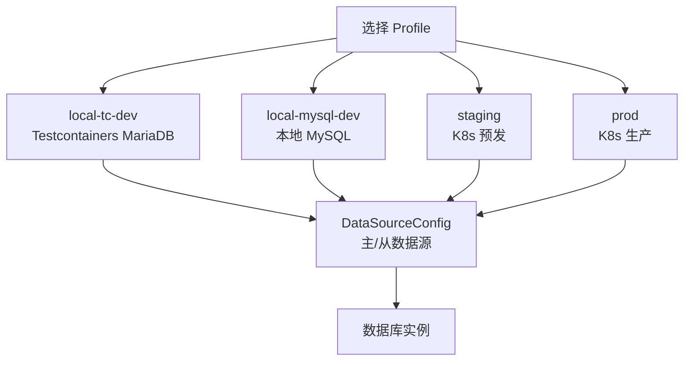
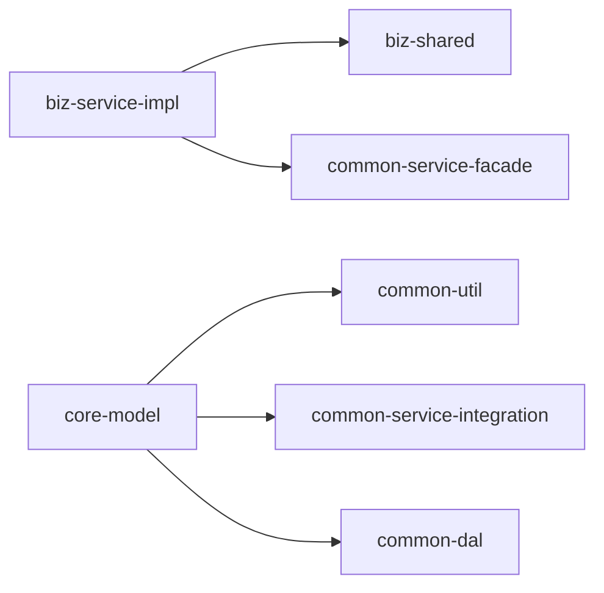

# 架构评估报告-DDD-COLA-SOFA

<cite>
**本文档引用的文件**
- [README.md](file://README.md)
- [DomainDrivenTransactionSysApplication.java](file://biz-service-impl/src/main/java/com/magicliang/transaction/sys/DomainDrivenTransactionSysApplication.java)
- [application.yml](file://biz-service-impl/src/main/resources/application.yml)
- [BaseActivity.java](file://core-service/src/main/java/com/magicliang/transaction/sys/core/domain/activity/BaseActivity.java)
- [PaymentActivity.java](file://core-service/src/main/java/com/magicliang/transaction/sys/core/domain/activity/payment/PaymentActivity.java)
- [TransTransactionContext.java](file://core-model/src/main/java/com/magicliang/transaction/sys/core/model/context/TransTransactionContext.java)
- [TransPayOrderEntity.java](file://core-model/src/main/java/com/magicliang/transaction/sys/core/model/entity/TransPayOrderEntity.java)
- [IPayOrderService.java](file://core-service/src/main/java/com/magicliang/transaction/sys/core/service/IPayOrderService.java)
- [PaymentHandler.java](file://biz-shared/src/main/java/com/magicliang/transaction/sys/biz/shared/handler/PaymentHandler.java)
- [PaymentCommand.java](file://biz-shared/src/main/java/com/magicliang/transaction/sys/biz/shared/request/payment/PaymentCommand.java)
- [PaymentRequest.java](file://core-model/src/main/java/com/magicliang/transaction/sys/core/model/request/payment/PaymentRequest.java)
- [DataSourceConfig.java](file://common-dal/src/main/java/com/magicliang/transaction/sys/common/dal/datasource/DataSourceConfig.java)
- [TestController.java](file://biz-service-impl/src/main/java/com/magicliang/transaction/sys/biz/service/impl/web/controller/TestController.java)
- [build.gradle](file://build.gradle)
</cite>

## 目录
1. [引言](#引言)
2. [项目结构](#项目结构)
3. [核心组件](#核心组件)
4. [架构总览](#架构总览)
5. [详细组件分析](#详细组件分析)
6. [依赖分析](#依赖分析)
7. [性能考量](#性能考量)
8. [故障排查指南](#故障排查指南)
9. [结论](#结论)
10. [附录](#附录)

## 引言
本项目是一个基于领域驱动设计（DDD）与 COLA 架构思想的企业级交易系统示例，采用 SOFA 分层架构（展示层、应用层、领域层、基础层），结合 Gradle 多模块构建，演示了从请求到领域模型、再到基础设施的完整流转过程。项目同时提供了丰富的数据库 Profile 支持与容器化部署能力，便于在本地、预发与生产环境快速落地。

## 项目结构
项目采用典型的 SOFA 分层与模块化组织方式：
- biz-service-impl：业务服务实现层，包含 Web 控制器、拦截器、过滤器、线程池配置等，是应用的可启动模块
- biz-shared：业务共享模块，提供业务级别的共享组件（处理器、请求/响应模型、枚举等）
- core-model：核心领域模型，包含实体、值对象、聚合根、上下文与事件等
- core-service：核心领域服务，实现业务活动、策略、服务接口与管理器
- common-dal：数据访问层，集成 MyBatis 与多数据源配置
- common-service-facade：服务门面层（当前模块暂未在本报告中深入分析）
- common-service-integration：服务集成层（当前模块暂未在本报告中深入分析）
- common-util：通用工具类库
- deploy：Docker 与 Kubernetes 部署清单与脚本

图表来源
- [TestController.java:1-241](file://biz-service-impl/src/main/java/com/magicliang/transaction/sys/biz/service/impl/web/controller/TestController.java#L1-L241)
- [PaymentHandler.java:1-139](file://biz-shared/src/main/java/com/magicliang/transaction/sys/biz/shared/handler/PaymentHandler.java#L1-L139)
- [TransTransactionContext.java:1-139](file://core-model/src/main/java/com/magicliang/transaction/sys/core/model/context/TransTransactionContext.java#L1-L139)
- [PaymentActivity.java:1-202](file://core-service/src/main/java/com/magicliang/transaction/sys/core/domain/activity/payment/PaymentActivity.java#L1-L202)
- [TransPayOrderEntity.java:1-216](file://core-model/src/main/java/com/magicliang/transaction/sys/core/model/entity/TransPayOrderEntity.java#L1-L216)
- [PaymentRequest.java:1-20](file://core-model/src/main/java/com/magicliang/transaction/sys/core/model/request/payment/PaymentRequest.java#L1-L20)
- [DataSourceConfig.java:1-82](file://common-dal/src/main/java/com/magicliang/transaction/sys/common/dal/datasource/DataSourceConfig.java#L1-L82)

章节来源
- [README.md:23-46](file://README.md#L23-L46)
- [build.gradle:164-284](file://build.gradle#L164-L284)

## 核心组件
- 交易上下文（TransTransactionContext）：承载一次交易的全生命周期状态，包含各活动的请求/响应与完成标志
- 领域活动（BaseActivity/PaymentActivity）：封装活动的前置/后置钩子、策略分派与幂等控制
- 领域实体（TransPayOrderEntity）：聚合根，维护状态迁移与版本控制
- 业务处理器（PaymentHandler）：应用层编排者，负责上下文初始化、模型填充与活动执行
- 数据源配置（DataSourceConfig）：多数据源与 Profile 隔离，配合 application.yml 实现环境切换
- Web 控制器（TestController）：演示 HTTP 接口与响应类型

章节来源
- [TransTransactionContext.java:27-139](file://core-model/src/main/java/com/magicliang/transaction/sys/core/model/context/TransTransactionContext.java#L27-L139)
- [BaseActivity.java:28-139](file://core-service/src/main/java/com/magicliang/transaction/sys/core/domain/activity/BaseActivity.java#L28-L139)
- [PaymentActivity.java:38-202](file://core-service/src/main/java/com/magicliang/transaction/sys/core/domain/activity/payment/PaymentActivity.java#L38-L202)
- [TransPayOrderEntity.java:32-216](file://core-model/src/main/java/com/magicliang/transaction/sys/core/model/entity/TransPayOrderEntity.java#L32-L216)
- [PaymentHandler.java:28-139](file://biz-shared/src/main/java/com/magicliang/transaction/sys/biz/shared/handler/PaymentHandler.java#L28-L139)
- [DataSourceConfig.java:24-82](file://common-dal/src/main/java/com/magicliang/transaction/sys/common/dal/datasource/DataSourceConfig.java#L24-L82)
- [TestController.java:48-241](file://biz-service-impl/src/main/java/com/magicliang/transaction/sys/biz/service/impl/web/controller/TestController.java#L48-L241)

## 架构总览
系统遵循 SOFA 分层原则，展示层负责请求接入与响应封装；应用层负责业务流程编排与幂等控制；领域层封装核心业务逻辑与状态迁移；基础层提供数据访问与第三方集成。通过 Profile 机制与多数据源配置，系统可在不同环境间无缝切换。

图表来源
- [TestController.java:48-241](file://biz-service-impl/src/main/java/com/magicliang/transaction/sys/biz/service/impl/web/controller/TestController.java#L48-L241)
- [PaymentHandler.java:64-70](file://biz-shared/src/main/java/com/magicliang/transaction/sys/biz/shared/handler/PaymentHandler.java#L64-L70)
- [PaymentActivity.java:42-52](file://core-service/src/main/java/com/magicliang/transaction/sys/core/domain/activity/payment/PaymentActivity.java#L42-L52)
- [DataSourceConfig.java:33-52](file://common-dal/src/main/java/com/magicliang/transaction/sys/common/dal/datasource/DataSourceConfig.java#L33-L52)

## 详细组件分析

### 交易上下文与活动执行流程
交易上下文贯穿一次业务请求的全生命周期，记录各活动的请求/响应与完成状态。领域活动在执行前后分别进行前置/后置钩子处理，策略通过集合分派执行，最终完成上下文的装填与状态推进。

图表来源
- [TransTransactionContext.java:112-137](file://core-model/src/main/java/com/magicliang/transaction/sys/core/model/context/TransTransactionContext.java#L112-L137)
- [BaseActivity.java:42-84](file://core-service/src/main/java/com/magicliang/transaction/sys/core/domain/activity/BaseActivity.java#L42-L84)
- [PaymentActivity.java:52-169](file://core-service/src/main/java/com/magicliang/transaction/sys/core/domain/activity/payment/PaymentActivity.java#L52-L169)
- [TransPayOrderEntity.java:197-204](file://core-model/src/main/java/com/magicliang/transaction/sys/core/model/entity/TransPayOrderEntity.java#L197-L204)

章节来源
- [TransTransactionContext.java:27-139](file://core-model/src/main/java/com/magicliang/transaction/sys/core/model/context/TransTransactionContext.java#L27-L139)
- [BaseActivity.java:28-139](file://core-service/src/main/java/com/magicliang/transaction/sys/core/domain/activity/BaseActivity.java#L28-L139)
- [PaymentActivity.java:38-202](file://core-service/src/main/java/com/magicliang/transaction/sys/core/domain/activity/payment/PaymentActivity.java#L38-L202)

### 支付活动与状态迁移
支付活动负责在前置阶段进行幂等与状态校验，在执行阶段组装请求并分派策略，最后在后置阶段校验响应并推进通知活动的完成状态。支付订单实体提供状态迁移与版本控制，确保并发安全。

图表来源
- [PaymentActivity.java:52-202](file://core-service/src/main/java/com/magicliang/transaction/sys/core/domain/activity/payment/PaymentActivity.java#L52-L202)
- [TransPayOrderEntity.java:197-204](file://core-model/src/main/java/com/magicliang/transaction/sys/core/model/entity/TransPayOrderEntity.java#L197-L204)

章节来源
- [PaymentActivity.java:38-202](file://core-service/src/main/java/com/magicliang/transaction/sys/core/domain/activity/payment/PaymentActivity.java#L38-L202)
- [TransPayOrderEntity.java:32-216](file://core-model/src/main/java/com/magicliang/transaction/sys/core/model/entity/TransPayOrderEntity.java#L32-L216)

### 数据源与多环境配置
系统通过 Profile 机制与多数据源配置实现环境隔离。application.yml 定义了多 Profile 的数据源参数，DataSourceConfig 在指定 Profile 下创建主从数据源 Bean，配合 K8s 环境变量实现线上部署。

图表来源
- [application.yml:6-216](file://biz-service-impl/src/main/resources/application.yml#L6-L216)
- [DataSourceConfig.java:33-52](file://common-dal/src/main/java/com/magicliang/transaction/sys/common/dal/datasource/DataSourceConfig.java#L33-L52)

章节来源
- [application.yml:6-216](file://biz-service-impl/src/main/resources/application.yml#L6-L216)
- [DataSourceConfig.java:24-82](file://common-dal/src/main/java/com/magicliang/transaction/sys/common/dal/datasource/DataSourceConfig.java#L24-L82)

### Web 层与测试控制器
Web 层提供健康检查、异步响应、重定向与多媒体下载等演示接口，便于验证服务可用性与响应类型多样性。

章节来源
- [TestController.java:48-241](file://biz-service-impl/src/main/java/com/magicliang/transaction/sys/biz/service/impl/web/controller/TestController.java#L48-L241)

## 依赖分析
- 模块依赖：biz-service-impl 依赖 biz-shared 与 common-service-facade；core-model 依赖 common-util、common-service-integration 与 common-dal
- 运行时依赖：Spring Boot 2.7.x、MyBatis、Log4j2、OpenTelemetry、JUnit 5 等
- 构建工具：Gradle 8.6，使用工具链与依赖管理插件统一版本

图表来源
- [build.gradle:164-284](file://build.gradle#L164-L284)

章节来源
- [build.gradle:164-284](file://build.gradle#L164-L284)

## 性能考量
- 并发与幂等：活动执行前进行局部幂等与终态校验，避免重复处理
- 策略分派：通过策略集合进行分派，便于扩展不同支付渠道策略
- 数据库连接池：HikariCP 提供高性能连接池配置，建议结合环境压力测试调优
- 日志与可观测性：Log4j2 与 OpenTelemetry 配置，便于线上问题定位与性能分析

## 故障排查指南
- 启动失败（数据源相关）：检查 application.yml 中 Profile 是否正确，确认 DataSourceConfig 在对应 Profile 下创建 Bean
- 线程池与资源：关注 CommandLineRunner 中的资源初始化与销毁钩子，确保优雅停机
- 数据库连接：根据环境 Profile 检查 JDBC URL、用户名与密码，必要时启用日志打印 SQL 以辅助诊断

章节来源
- [DomainDrivenTransactionSysApplication.java:82-147](file://biz-service-impl/src/main/java/com/magicliang/transaction/sys/DomainDrivenTransactionSysApplication.java#L82-L147)
- [application.yml:14-50](file://biz-service-impl/src/main/resources/application.yml#L14-L50)

## 结论
本项目在 DDD 与 COLA 思想指导下，结合 SOFA 分层与多模块架构，形成了清晰的职责边界与可扩展的领域模型。通过 Profile 与多数据源配置，系统具备良好的环境适配能力；借助 Gradle 多模块与测试体系，提升了开发与交付效率。建议持续完善领域模型与策略扩展点，增强跨模块协作与可观测性建设。

## 附录
- 快速启动与测试：参考根目录 README 的构建与测试命令
- 数据库 Profile：local-tc-dev、local-mariadb4j-dev、local-mysql-dev、staging、prod
- 部署：Docker 与 K8s 清单与脚本位于 deploy 目录

章节来源
- [README.md:48-82](file://README.md#L48-L82)
- [README.md:84-129](file://README.md#L84-L129)
- [README.md:216-321](file://README.md#L216-L321)