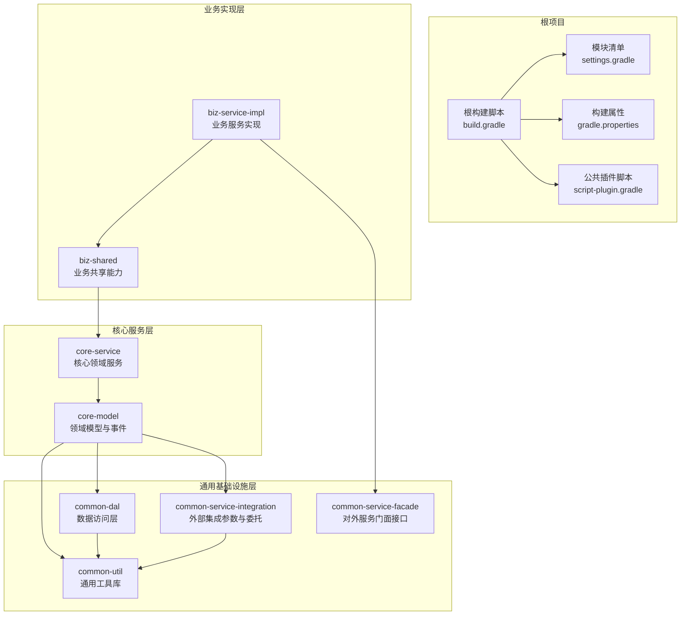
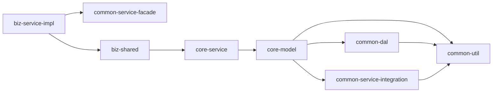
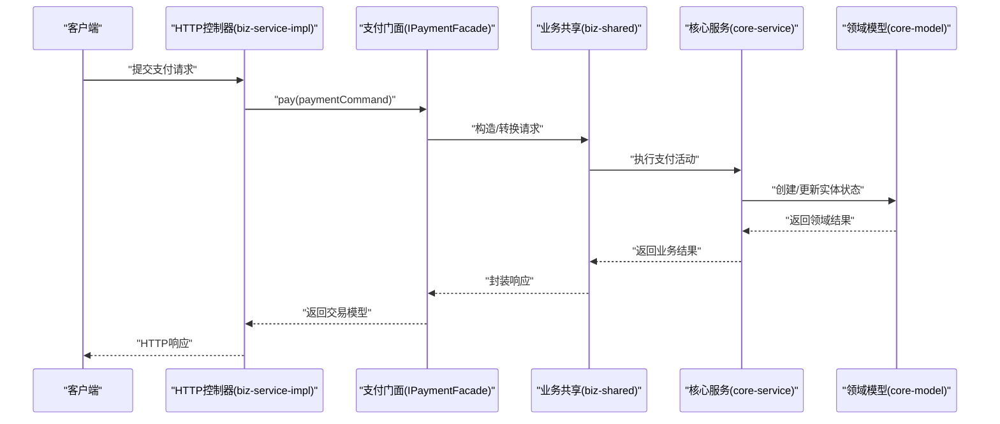
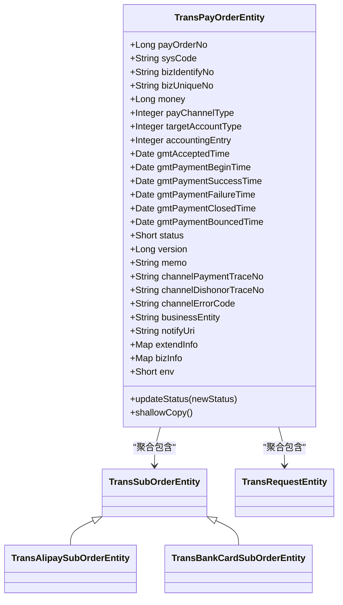
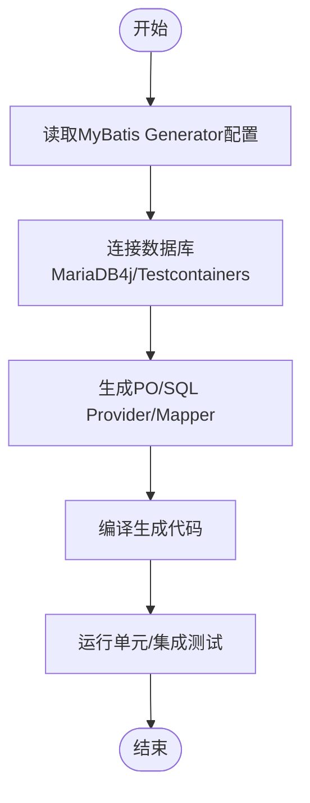
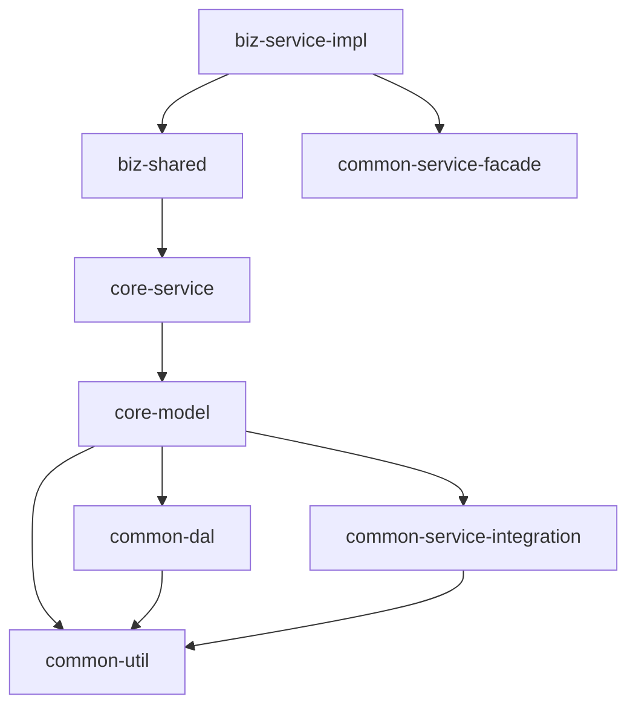

# 模块化架构设计

<cite>
**本文档引用的文件**
- [build.gradle](file://build.gradle)
- [settings.gradle](file://settings.gradle)
- [gradle.properties](file://gradle.properties)
- [script-plugin.gradle](file://script-plugin.gradle)
- [biz-service-impl/build.gradle](file://biz-service-impl/build.gradle)
- [core-service/build.gradle](file://core-service/build.gradle)
- [core-model/build.gradle](file://core-model/build.gradle)
- [common-dal/build.gradle](file://common-dal/build.gradle)
- [common-util/build.gradle](file://common-util/build.gradle)
- [common-service-facade/build.gradle](file://common-service-facade/build.gradle)
- [common-service-integration/build.gradle](file://common-service-integration/build.gradle)
- [biz-shared/build.gradle](file://biz-shared/build.gradle)
- [core-model/src/main/java/com/magicliang/transaction/sys/core/model/entity/TransPayOrderEntity.java](file://core-model/src/main/java/com/magicliang/transaction/sys/core/model/entity/TransPayOrderEntity.java)
- [biz-service-impl/src/main/java/com/magicliang/transaction/sys/biz/service/impl/facade/IPaymentFacade.java](file://biz-service-impl/src/main/java/com/magicliang/transaction/sys/biz/service/impl/facade/IPaymentFacade.java)
- [common-dal/src/main/java/com/magicliang/transaction/sys/common/dal/mybatis/po/TransPayOrderPo.java](file://common-dal/src/main/java/com/magicliang/transaction/sys/common/dal/mybatis/po/TransPayOrderPo.java)
</cite>

## 目录
1. [简介](#简介)
2. [项目结构](#项目结构)
3. [核心组件](#核心组件)
4. [架构总览](#架构总览)
5. [详细组件分析](#详细组件分析)
6. [依赖分析](#依赖分析)
7. [性能考虑](#性能考虑)
8. [故障排查指南](#故障排查指南)
9. [结论](#结论)
10. [附录](#附录)

## 简介
本项目采用领域驱动设计（DDD）思想，围绕“交易”核心域构建模块化体系，目标是实现关注点分离、高内聚低耦合、可测试与可演进的工程化架构。通过Gradle多模块组织，将业务能力、模型、服务、数据访问与通用工具分层解耦，形成清晰的依赖边界与接口契约，便于团队协作与长期维护。

## 项目结构
项目采用Gradle多模块结构，根项目统一管理插件、依赖与构建行为，各子模块按职责划分，遵循“低层基础设施向上层开放接口”的依赖方向，避免循环依赖并提升可测试性。

图表来源
- [settings.gradle:1-16](file://settings.gradle#L1-L16)
- [build.gradle:165-284](file://build.gradle#L165-L284)
- [biz-service-impl/build.gradle:1-80](file://biz-service-impl/build.gradle#L1-L80)
- [core-service/build.gradle:1-13](file://core-service/build.gradle#L1-L13)
- [core-model/build.gradle:1-15](file://core-model/build.gradle#L1-L15)
- [common-dal/build.gradle:1-62](file://common-dal/build.gradle#L1-L62)
- [common-util/build.gradle:1-47](file://common-util/build.gradle#L1-L47)
- [common-service-integration/build.gradle:1-11](file://common-service-integration/build.gradle#L1-L11)
- [common-service-facade/build.gradle:1-11](file://common-service-facade/build.gradle#L1-L11)
- [biz-shared/build.gradle:1-11](file://biz-shared/build.gradle#L1-L11)

章节来源
- [settings.gradle:1-16](file://settings.gradle#L1-L16)
- [build.gradle:165-284](file://build.gradle#L165-L284)

## 核心组件
- 业务实现层
  - biz-service-impl：对外HTTP入口、Web配置、异常处理、过滤器、拦截器、控制器与RPC适配，聚合业务门面与策略执行，负责请求接入与响应输出。
  - biz-shared：业务共享的命令/查询/处理器、事件发布器、命令查询总线，屏蔽具体实现细节，向上提供稳定接口。
- 核心服务层
  - core-service：领域活动（acceptance/payment/notification/id generation）、策略（同步/异步、Kafka/RPC）、分布式锁、服务接口与实现，承载核心业务规则。
  - core-model：领域实体、值对象、事件、工厂、规格与校验器，定义业务不变量与状态变迁。
- 通用基础设施层
  - common-util：集合、字符串、JSON、日期、并发、断言、工具类与APM埋点等通用能力。
  - common-dal：MyBatis/JPA、PageHelper、Testcontainers/MariaDB4j、MyBatis Generator配置与PO映射。
  - common-service-facade：对外服务门面接口（如支付、通知）定义，供biz-service-impl直接依赖。
  - common-service-integration：外部集成参数、委托接口与实现（如支付宝、Leaf ID分配）。

章节来源
- [biz-service-impl/build.gradle:1-80](file://biz-service-impl/build.gradle#L1-L80)
- [core-service/build.gradle:1-13](file://core-service/build.gradle#L1-L13)
- [core-model/build.gradle:1-15](file://core-model/build.gradle#L1-L15)
- [common-dal/build.gradle:1-62](file://common-dal/build.gradle#L1-L62)
- [common-util/build.gradle:1-47](file://common-util/build.gradle#L1-L47)
- [common-service-facade/build.gradle:1-11](file://common-service-facade/build.gradle#L1-L11)
- [common-service-integration/build.gradle:1-11](file://common-service-integration/build.gradle#L1-L11)
- [biz-shared/build.gradle:1-11](file://biz-shared/build.gradle#L1-L11)

## 架构总览
整体采用“接口向下、实现向上”的依赖方向，业务实现仅依赖门面与共享层，核心服务依赖模型，模型再依赖通用工具与数据访问，保证高层不依赖低层，降低变更成本。

图表来源
- [biz-service-impl/build.gradle:5-23](file://biz-service-impl/build.gradle#L5-L23)
- [core-service/build.gradle:1-5](file://core-service/build.gradle#L1-L5)
- [core-model/build.gradle:1-5](file://core-model/build.gradle#L1-L5)
- [common-dal/build.gradle:28-53](file://common-dal/build.gradle#L28-L53)
- [common-util/build.gradle:8-39](file://common-util/build.gradle#L8-L39)
- [common-service-integration/build.gradle:1-3](file://common-service-integration/build.gradle#L1-L3)
- [common-service-facade/build.gradle:1-11](file://common-service-facade/build.gradle#L1-L11)
- [biz-shared/build.gradle:1-3](file://biz-shared/build.gradle#L1-L3)

## 详细组件分析

### 业务门面与控制器交互序列
展示从HTTP入口到业务门面再到核心服务的调用链路，体现接口契约与职责边界。

图表来源
- [IPaymentFacade.java:18-57](file://biz-service-impl/src/main/java/com/magicliang/transaction/sys/biz/service/impl/facade/IPaymentFacade.java#L18-L57)
- [biz-service-impl/build.gradle:5-23](file://biz-service-impl/build.gradle#L5-L23)
- [core-service/build.gradle:1-5](file://core-service/build.gradle#L1-L5)
- [core-model/build.gradle:1-5](file://core-model/build.gradle#L1-L5)

章节来源
- [IPaymentFacade.java:18-57](file://biz-service-impl/src/main/java/com/magicliang/transaction/sys/biz/service/impl/facade/IPaymentFacade.java#L18-L57)

### 领域模型类图
展示核心实体与事件的关系，强调聚合根与状态变更约束。

图表来源
- [TransPayOrderEntity.java:32-215](file://core-model/src/main/java/com/magicliang/transaction/sys/core/model/entity/TransPayOrderEntity.java#L32-L215)

章节来源
- [TransPayOrderEntity.java:1-216](file://core-model/src/main/java/com/magicliang/transaction/sys/core/model/entity/TransPayOrderEntity.java#L1-L216)

### 数据持久化映射流程
展示从PO到DAO的映射与生成流程，体现数据访问层的自动生成与测试环境支持。

图表来源
- [common-dal/build.gradle:10-26](file://common-dal/build.gradle#L10-L26)
- [common-dal/build.gradle:28-53](file://common-dal/build.gradle#L28-L53)

章节来源
- [common-dal/build.gradle:1-62](file://common-dal/build.gradle#L1-L62)

## 依赖分析
- 模块间依赖方向
  - 业务实现层仅依赖门面与共享层，不直接依赖核心服务，保证UI/接口层与业务规则解耦。
  - 核心服务依赖领域模型，模型再依赖通用工具与数据访问，形成稳定的向上依赖。
  - 数据访问层依赖通用工具与测试框架，提供可替换的数据源与测试支撑。
- 关键依赖关系
  - biz-service-impl -> biz-shared, common-service-facade
  - biz-shared -> core-service
  - core-service -> core-model
  - core-model -> common-util, common-dal, common-service-integration
  - common-dal -> common-util
  - common-service-integration -> common-util

图表来源
- [biz-service-impl/build.gradle:5-23](file://biz-service-impl/build.gradle#L5-L23)
- [core-service/build.gradle:1-5](file://core-service/build.gradle#L1-L5)
- [core-model/build.gradle:1-5](file://core-model/build.gradle#L1-L5)
- [common-dal/build.gradle:28-53](file://common-dal/build.gradle#L28-L53)
- [common-util/build.gradle:8-39](file://common-util/build.gradle#L8-L39)
- [common-service-integration/build.gradle:1-3](file://common-service-integration/build.gradle#L1-L3)
- [common-service-facade/build.gradle:1-11](file://common-service-facade/build.gradle#L1-L11)
- [biz-shared/build.gradle:1-3](file://biz-shared/build.gradle#L1-L3)

章节来源
- [biz-service-impl/build.gradle:5-23](file://biz-service-impl/build.gradle#L5-L23)
- [core-service/build.gradle:1-5](file://core-service/build.gradle#L1-L5)
- [core-model/build.gradle:1-5](file://core-model/build.gradle#L1-L5)
- [common-dal/build.gradle:28-53](file://common-dal/build.gradle#L28-L53)
- [common-util/build.gradle:8-39](file://common-util/build.gradle#L8-L39)
- [common-service-integration/build.gradle:1-3](file://common-service-integration/build.gradle#L1-L3)
- [common-service-facade/build.gradle:1-11](file://common-service-facade/build.gradle#L1-L11)
- [biz-shared/build.gradle:1-3](file://biz-shared/build.gradle#L1-L3)

## 性能考虑
- 并行构建与缓存
  - 启用并行构建与构建缓存，缩短增量构建时间，提升迭代效率。
- 测试隔离与并行
  - 单元与集成测试分离，充分利用JVM并行执行能力，减少测试串扰。
- 数据访问优化
  - 使用分页组件与嵌入式数据库测试方案，降低测试环境搭建成本与执行时延。
- 日志与监控
  - 统一使用Log4j2与OpenTelemetry埋点，保障可观测性与性能追踪。

章节来源
- [gradle.properties:9-11](file://gradle.properties#L9-L11)
- [build.gradle:253-272](file://build.gradle#L253-L272)
- [common-dal/build.gradle:37-41](file://common-dal/build.gradle#L37-L41)

## 故障排查指南
- 构建问题
  - 若出现依赖冲突或版本不一致，优先检查根构建脚本中的依赖管理与子模块依赖声明。
  - 确认MyBatis Generator配置与数据库连接参数正确，避免生成失败。
- 运行问题
  - 若日志输出异常，检查Log4j2配置与排除默认日志依赖。
  - 若测试失败，确认测试资源目录与数据源初始化脚本位置正确。
- 性能问题
  - 启用并行测试与构建缓存，观察任务执行时间；必要时调整JVM参数。

章节来源
- [build.gradle:105-117](file://build.gradle#L105-L117)
- [build.gradle:187-191](file://build.gradle#L187-L191)
- [common-dal/build.gradle:10-26](file://common-dal/build.gradle#L10-L26)

## 结论
本项目通过清晰的模块划分与稳定的依赖方向，实现了业务与技术的解耦、接口与实现的分离。配合统一的构建与测试策略，既满足当前业务需求，也为后续扩展与演进提供了坚实基础。

## 附录

### 模块职责与接口契约
- biz-service-impl
  - 职责：HTTP入口、Web配置、异常处理、过滤器/拦截器、控制器与RPC适配。
  - 依赖：biz-shared、common-service-facade。
- biz-shared
  - 职责：业务命令/查询、处理器、事件发布与总线。
  - 依赖：core-service。
- core-service
  - 职责：领域活动、策略、分布式锁、服务接口与实现。
  - 依赖：core-model。
- core-model
  - 职责：实体、事件、工厂、规格与校验器。
  - 依赖：common-util、common-dal、common-service-integration。
- common-dal
  - 职责：MyBatis/JPA、分页、Testcontainers/MariaDB4j、MyBatis Generator。
  - 依赖：common-util。
- common-util
  - 职责：通用工具、APM、并发、断言、JSON/HTTP等。
- common-service-facade
  - 职责：对外服务门面接口定义。
- common-service-integration
  - 职责：外部集成参数与委托接口实现。

章节来源
- [biz-service-impl/build.gradle:5-23](file://biz-service-impl/build.gradle#L5-L23)
- [biz-shared/build.gradle:1-3](file://biz-shared/build.gradle#L1-L3)
- [core-service/build.gradle:1-5](file://core-service/build.gradle#L1-L5)
- [core-model/build.gradle:1-5](file://core-model/build.gradle#L1-L5)
- [common-dal/build.gradle:28-53](file://common-dal/build.gradle#L28-L53)
- [common-util/build.gradle:8-39](file://common-util/build.gradle#L8-L39)
- [common-service-facade/build.gradle:1-11](file://common-service-facade/build.gradle#L1-L11)
- [common-service-integration/build.gradle:1-3](file://common-service-integration/build.gradle#L1-L3)

### 构建配置与版本管理
- 根构建脚本
  - 统一插件与依赖管理，启用Spring Boot与依赖管理插件，配置JVM工具链与仓库镜像。
  - 子模块统一应用Java库与Spring Boot插件，排除默认日志，引入Log4j2与统一JUnit版本。
- 模块构建脚本
  - 各模块按需声明内部与外部依赖，明确bootJar/jar启用策略，配置测试源集与MyBatis Generator。
- 发布策略
  - 通过maven-publish插件脚本统一启用，结合版本号与仓库配置实现制品发布。

章节来源
- [build.gradle:15-34](file://build.gradle#L15-L34)
- [build.gradle:85-162](file://build.gradle#L85-L162)
- [build.gradle:165-284](file://build.gradle#L165-L284)
- [script-plugin.gradle:1-11](file://script-plugin.gradle#L1-L11)
- [common-dal/build.gradle:2-4](file://common-dal/build.gradle#L2-L4)

### 模块扩展指南与最佳实践
- 新增领域功能
  - 在core-model中定义实体与事件，在core-service中实现活动与策略，通过biz-shared暴露命令/查询，最后在biz-service-impl中接入控制器。
- 新增外部集成
  - 在common-service-integration中新增参数与委托接口实现，保持对common-util的依赖最小化。
- 数据访问扩展
  - 使用MyBatis Generator生成代码，确保测试环境可用的嵌入式数据库配置。
- 测试策略
  - 单元测试聚焦模型与服务逻辑，集成测试覆盖端到端流程，利用Testcontainers与嵌入式数据库。
- 版本与发布
  - 统一在根构建脚本管理版本与依赖，模块内仅声明必要依赖，发布前进行全量构建与测试。

章节来源
- [core-model/build.gradle:1-5](file://core-model/build.gradle#L1-L5)
- [core-service/build.gradle:1-5](file://core-service/build.gradle#L1-L5)
- [common-service-integration/build.gradle:1-3](file://common-service-integration/build.gradle#L1-L3)
- [common-dal/build.gradle:10-26](file://common-dal/build.gradle#L10-L26)
- [build.gradle:165-284](file://build.gradle#L165-L284)
- [script-plugin.gradle:1-11](file://script-plugin.gradle#L1-L11)