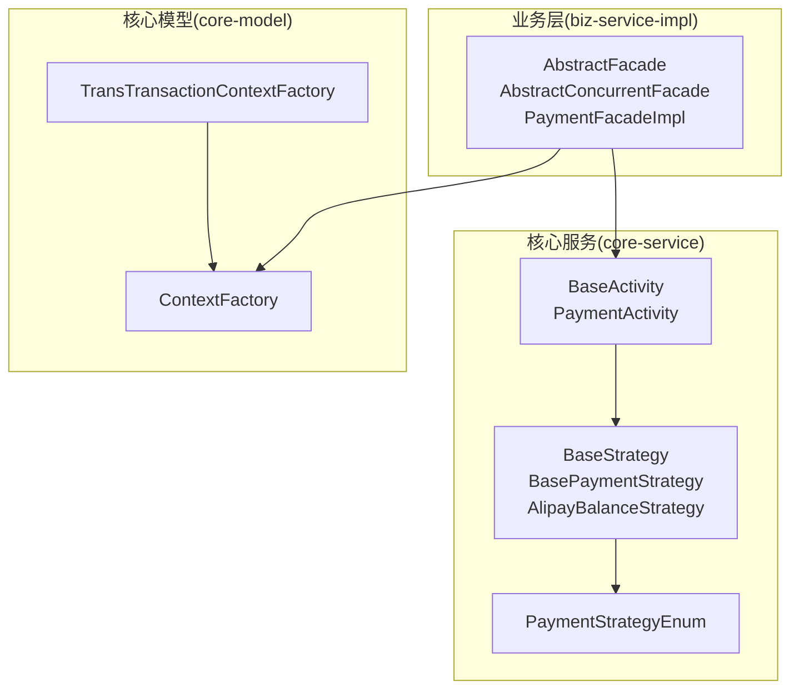
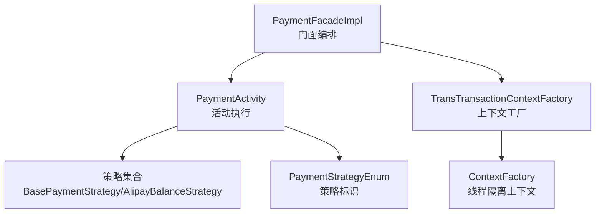
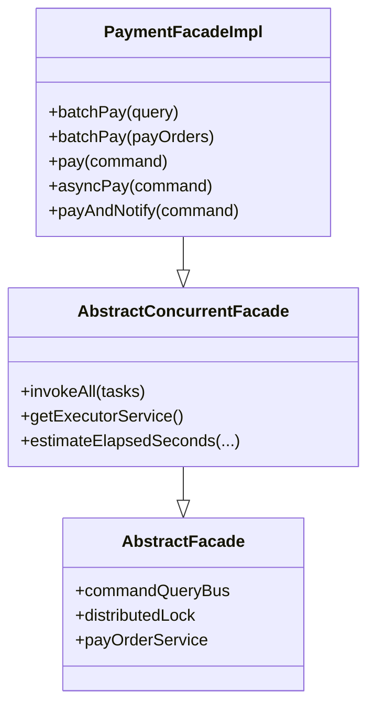
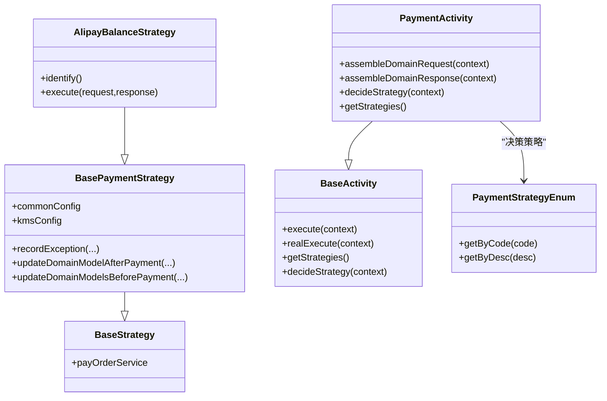
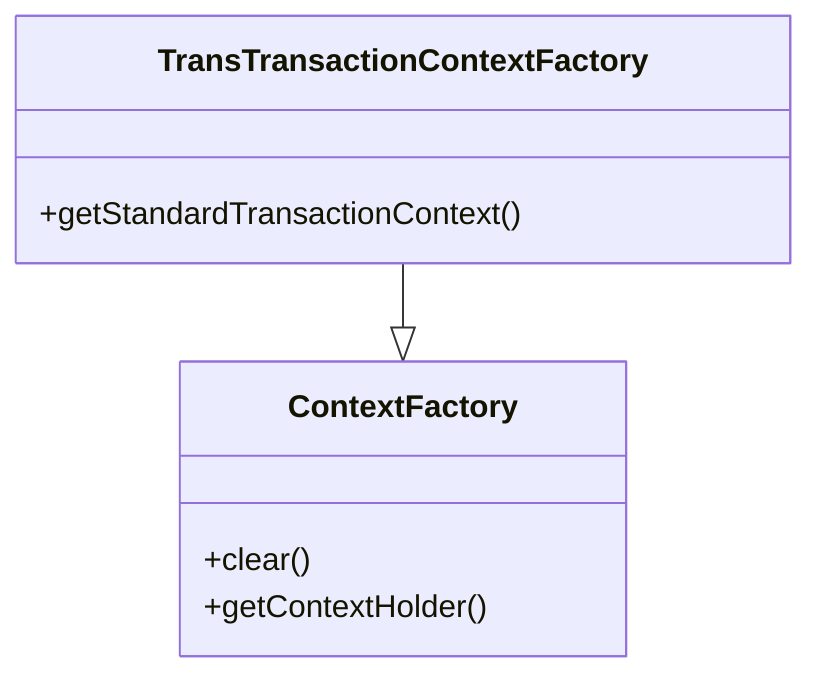
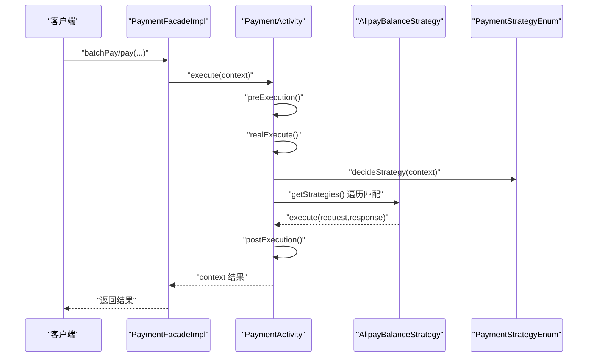
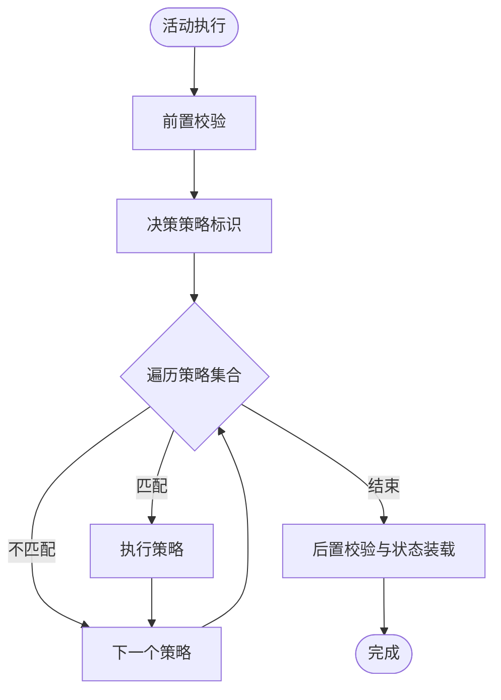
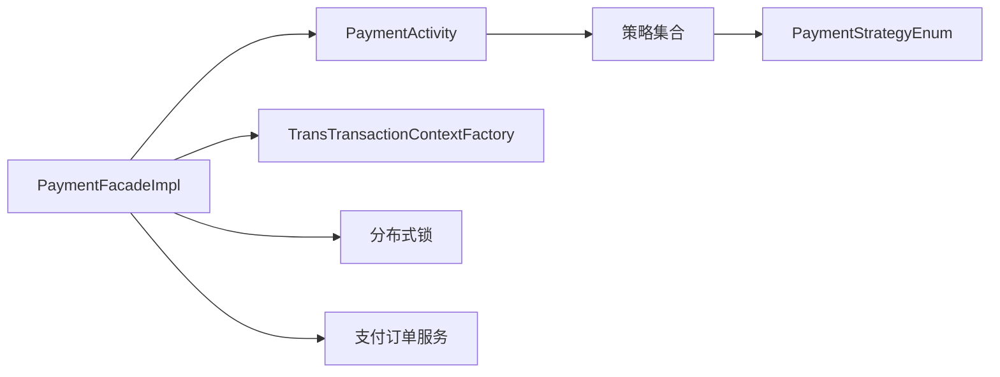

# 设计模式应用

<cite>
**本文引用的文件**
- [AbstractFacade.java](file://biz-service-impl/src/main/java/com/magicliang/transaction/sys/biz/service/impl/facade/impl/AbstractFacade.java)
- [AbstractConcurrentFacade.java](file://biz-service-impl/src/main/java/com/magicliang/transaction/sys/biz/service/impl/facade/impl/AbstractConcurrentFacade.java)
- [PaymentFacadeImpl.java](file://biz-service-impl/src/main/java/com/magicliang/transaction/sys/biz/service/impl/facade/impl/PaymentFacadeImpl.java)
- [ContextFactory.java](file://core-model/src/main/java/com/magicliang/transaction/sys/core/factory/ContextFactory.java)
- [TransTransactionContextFactory.java](file://core-model/src/main/java/com/magicliang/transaction/sys/core/factory/TransTransactionContextFactory.java)
- [BaseStrategy.java](file://core-service/src/main/java/com/magicliang/transaction/sys/core/domain/strategy/BaseStrategy.java)
- [BaseActivity.java](file://core-service/src/main/java/com/magicliang/transaction/sys/core/domain/activity/BaseActivity.java)
- [PaymentActivity.java](file://core-service/src/main/java/com/magicliang/transaction/sys/core/domain/activity/payment/PaymentActivity.java)
- [BasePaymentStrategy.java](file://core-service/src/main/java/com/magicliang/transaction/sys/core/domain/strategy/payment/BasePaymentStrategy.java)
- [AlipayBalanceStrategy.java](file://core-service/src/main/java/com/magicliang/transaction/sys/core/domain/strategy/payment/AlipayBalanceStrategy.java)
- [PaymentStrategyEnum.java](file://core-service/src/main/java/com/magicliang/transaction/sys/core/domain/enums/PaymentStrategyEnum.java)
</cite>

## 目录
1. [引言](#引言)
2. [项目结构](#项目结构)
3. [核心组件](#核心组件)
4. [架构总览](#架构总览)
5. [详细组件分析](#详细组件分析)
6. [依赖分析](#依赖分析)
7. [性能考量](#性能考量)
8. [故障排查指南](#故障排查指南)
9. [结论](#结论)
10. [附录](#附录)

## 引言
本文件围绕领域驱动交易系统，系统梳理并解析其中的关键设计模式与实现要点，重点涵盖以下模式：
- 门面模式（Facade Pattern）：通过统一入口封装复杂业务流程，降低客户端耦合度。
- 策略模式（Strategy Pattern）：在运行期按条件选择不同算法或行为，提升扩展性与可维护性。
- 工厂模式（Factory Pattern）：通过工厂集中创建上下文与实例，确保线程隔离与一致性。
- 活动模式（Activity Pattern）：以“活动”为单位组织领域动作，串联前置/真实/后置钩子与策略分派。
- 责任链模式（Chain of Responsibility Pattern）：在活动内部以策略集合进行条件匹配与执行。

文档以 AbstractFacade、BaseStrategy、ContextFactory、BaseActivity 等核心类为线索，结合具体实现类（如 PaymentFacadeImpl、PaymentActivity、AlipayBalanceStrategy、TransTransactionContextFactory），解释各模式的落地方式、适用场景与最佳实践，并给出设计决策建议与排障指引。

## 项目结构
系统采用多模块分层组织，核心模块与职责如下：
- biz-service-impl：业务服务实现，包含门面、控制器、过滤器、Web配置等。
- core-service：核心领域服务，包含活动、策略、领域管理器、事件监听等。
- core-model：核心模型与工厂，包含上下文、实体、请求/响应、规范等。
- common-*：公共工具、异常、枚举、DAL等基础能力。
- common-service-*：对外集成服务的适配层与委托。

图表来源
- [AbstractFacade.java:17-36](file://biz-service-impl/src/main/java/com/magicliang/transaction/sys/biz/service/impl/facade/impl/AbstractFacade.java#L17-L36)
- [AbstractConcurrentFacade.java:25-94](file://biz-service-impl/src/main/java/com/magicliang/transaction/sys/biz/service/impl/facade/impl/AbstractConcurrentFacade.java#L25-L94)
- [PaymentFacadeImpl.java:34-166](file://biz-service-impl/src/main/java/com/magicliang/transaction/sys/biz/service/impl/facade/impl/PaymentFacadeImpl.java#L34-L166)
- [BaseActivity.java:28-139](file://core-service/src/main/java/com/magicliang/transaction/sys/core/domain/activity/BaseActivity.java#L28-L139)
- [PaymentActivity.java:38-202](file://core-service/src/main/java/com/magicliang/transaction/sys/core/domain/activity/payment/PaymentActivity.java#L38-L202)
- [BaseStrategy.java:15-23](file://core-service/src/main/java/com/magicliang/transaction/sys/core/domain/strategy/BaseStrategy.java#L15-L23)
- [BasePaymentStrategy.java:28-93](file://core-service/src/main/java/com/magicliang/transaction/sys/core/domain/strategy/payment/BasePaymentStrategy.java#L28-L93)
- [AlipayBalanceStrategy.java:32-138](file://core-service/src/main/java/com/magicliang/transaction/sys/core/domain/strategy/payment/AlipayBalanceStrategy.java#L32-L138)
- [ContextFactory.java:16-88](file://core-model/src/main/java/com/magicliang/transaction/sys/core/factory/ContextFactory.java#L16-L88)
- [TransTransactionContextFactory.java:17-95](file://core-model/src/main/java/com/magicliang/transaction/sys/core/factory/TransTransactionContextFactory.java#L17-L95)

章节来源
- [AbstractFacade.java:17-36](file://biz-service-impl/src/main/java/com/magicliang/transaction/sys/biz/service/impl/facade/impl/AbstractFacade.java#L17-L36)
- [AbstractConcurrentFacade.java:25-94](file://biz-service-impl/src/main/java/com/magicliang/transaction/sys/biz/service/impl/facade/impl/AbstractConcurrentFacade.java#L25-L94)
- [PaymentFacadeImpl.java:34-166](file://biz-service-impl/src/main/java/com/magicliang/transaction/sys/biz/service/impl/facade/impl/PaymentFacadeImpl.java#L34-L166)
- [BaseActivity.java:28-139](file://core-service/src/main/java/com/magicliang/transaction/sys/core/domain/activity/BaseActivity.java#L28-L139)
- [PaymentActivity.java:38-202](file://core-service/src/main/java/com/magicliang/transaction/sys/core/domain/activity/payment/PaymentActivity.java#L38-L202)
- [BaseStrategy.java:15-23](file://core-service/src/main/java/com/magicliang/transaction/sys/core/domain/strategy/BaseStrategy.java#L15-L23)
- [BasePaymentStrategy.java:28-93](file://core-service/src/main/java/com/magicliang/transaction/sys/core/domain/strategy/payment/BasePaymentStrategy.java#L28-L93)
- [AlipayBalanceStrategy.java:32-138](file://core-service/src/main/java/com/magicliang/transaction/sys/core/domain/strategy/payment/AlipayBalanceStrategy.java#L32-L138)
- [ContextFactory.java:16-88](file://core-model/src/main/java/com/magicliang/transaction/sys/core/factory/ContextFactory.java#L16-L88)
- [TransTransactionContextFactory.java:17-95](file://core-model/src/main/java/com/magicliang/transaction/sys/core/factory/TransTransactionContextFactory.java#L17-L95)

## 核心组件
- 门面层（Facade）
  - AbstractFacade：统一注入命令查询总线、分布式锁、支付订单服务，作为业务门面的抽象基类。
  - AbstractConcurrentFacade：在抽象门面基础上增加并发执行能力，提供批量任务执行、结果统计与异常包装。
  - PaymentFacadeImpl：具体门面实现，负责批量支付、单笔支付、异步支付与支付后通知编排，体现门面模式的统一入口与编排职责。
- 活动层（Activity）
  - BaseActivity：定义活动生命周期钩子（前置/真实/后置），并提供策略集合的统一分派入口。
  - PaymentActivity：支付活动的具体实现，完成前置校验、组装请求/响应、策略决策与后置结果装载。
- 策略层（Strategy）
  - BaseStrategy：策略基类，注入支付订单服务。
  - BasePaymentStrategy：支付策略基类，封装支付前后模型更新、异常记录与统一更新逻辑。
  - AlipayBalanceStrategy：具体策略实现，对接外部支付通道，完成参数构建、请求发送、结果记录与状态迁移。
- 工厂层（Factory）
  - ContextFactory：线程隔离的上下文持有者工厂，提供线程本地上下文与清理能力。
  - TransTransactionContextFactory：基于上下文工厂的交易上下文实例化与懒加载，确保线程封闭与一致性。

章节来源
- [AbstractFacade.java:17-36](file://biz-service-impl/src/main/java/com/magicliang/transaction/sys/biz/service/impl/facade/impl/AbstractFacade.java#L17-L36)
- [AbstractConcurrentFacade.java:25-94](file://biz-service-impl/src/main/java/com/magicliang/transaction/sys/biz/service/impl/facade/impl/AbstractConcurrentFacade.java#L25-L94)
- [PaymentFacadeImpl.java:34-166](file://biz-service-impl/src/main/java/com/magicliang/transaction/sys/biz/service/impl/facade/impl/PaymentFacadeImpl.java#L34-L166)
- [BaseActivity.java:28-139](file://core-service/src/main/java/com/magicliang/transaction/sys/core/domain/activity/BaseActivity.java#L28-L139)
- [PaymentActivity.java:38-202](file://core-service/src/main/java/com/magicliang/transaction/sys/core/domain/activity/payment/PaymentActivity.java#L38-L202)
- [BaseStrategy.java:15-23](file://core-service/src/main/java/com/magicliang/transaction/sys/core/domain/strategy/BaseStrategy.java#L15-L23)
- [BasePaymentStrategy.java:28-93](file://core-service/src/main/java/com/magicliang/transaction/sys/core/domain/strategy/payment/BasePaymentStrategy.java#L28-L93)
- [AlipayBalanceStrategy.java:32-138](file://core-service/src/main/java/com/magicliang/transaction/sys/core/domain/strategy/payment/AlipayBalanceStrategy.java#L32-L138)
- [ContextFactory.java:16-88](file://core-model/src/main/java/com/magicliang/transaction/sys/core/factory/ContextFactory.java#L16-L88)
- [TransTransactionContextFactory.java:17-95](file://core-model/src/main/java/com/magicliang/transaction/sys/core/factory/TransTransactionContextFactory.java#L17-L95)

## 架构总览
整体架构以“门面-活动-策略-上下文工厂”的层次展开，门面负责编排与并发控制，活动负责领域动作与策略分派，策略负责具体算法实现，上下文工厂负责线程隔离的数据承载。

图表来源
- [PaymentFacadeImpl.java:34-166](file://biz-service-impl/src/main/java/com/magicliang/transaction/sys/biz/service/impl/facade/impl/PaymentFacadeImpl.java#L34-L166)
- [PaymentActivity.java:38-202](file://core-service/src/main/java/com/magicliang/transaction/sys/core/domain/activity/payment/PaymentActivity.java#L38-L202)
- [BasePaymentStrategy.java:28-93](file://core-service/src/main/java/com/magicliang/transaction/sys/core/domain/strategy/payment/BasePaymentStrategy.java#L28-L93)
- [AlipayBalanceStrategy.java:32-138](file://core-service/src/main/java/com/magicliang/transaction/sys/core/domain/strategy/payment/AlipayBalanceStrategy.java#L32-L138)
- [TransTransactionContextFactory.java:17-95](file://core-model/src/main/java/com/magicliang/transaction/sys/core/factory/TransTransactionContextFactory.java#L17-L95)
- [ContextFactory.java:16-88](file://core-model/src/main/java/com/magicliang/transaction/sys/core/factory/ContextFactory.java#L16-L88)
- [PaymentStrategyEnum.java:18-73](file://core-service/src/main/java/com/magicliang/transaction/sys/core/domain/enums/PaymentStrategyEnum.java#L18-L73)

## 详细组件分析

### 门面模式（Facade Pattern）
- 抽象与并发门面
  - AbstractFacade：统一注入命令查询总线、分布式锁与支付订单服务，作为所有业务门面的基类，屏蔽底层依赖细节。
  - AbstractConcurrentFacade：在抽象门面之上提供批量任务并发执行能力，封装 invokeAll、线程池获取与执行时间估算。
  - PaymentFacadeImpl：具体门面实现，负责批量支付、单笔支付、异步支付与支付后通知编排，体现门面的统一入口与编排职责。
- 设计要点
  - 将复杂流程（查询未支付订单、批量分片、并发执行、结果汇总、通知编排）收敛到门面，客户端仅感知门面接口。
  - 并发门面通过线程池与 Future 收敛异步执行，统一统计成功/失败/幂等数量，便于可观测与排障。
- 适用场景
  - 大批量订单处理、跨服务编排、幂等与重试控制、线程池资源治理。

图表来源
- [AbstractFacade.java:17-36](file://biz-service-impl/src/main/java/com/magicliang/transaction/sys/biz/service/impl/facade/impl/AbstractFacade.java#L17-L36)
- [AbstractConcurrentFacade.java:25-94](file://biz-service-impl/src/main/java/com/magicliang/transaction/sys/biz/service/impl/facade/impl/AbstractConcurrentFacade.java#L25-L94)
- [PaymentFacadeImpl.java:34-166](file://biz-service-impl/src/main/java/com/magicliang/transaction/sys/biz/service/impl/facade/impl/PaymentFacadeImpl.java#L34-L166)

章节来源
- [AbstractFacade.java:17-36](file://biz-service-impl/src/main/java/com/magicliang/transaction/sys/biz/service/impl/facade/impl/AbstractFacade.java#L17-L36)
- [AbstractConcurrentFacade.java:25-94](file://biz-service-impl/src/main/java/com/magicliang/transaction/sys/biz/service/impl/facade/impl/AbstractConcurrentFacade.java#L25-L94)
- [PaymentFacadeImpl.java:34-166](file://biz-service-impl/src/main/java/com/magicliang/transaction/sys/biz/service/impl/facade/impl/PaymentFacadeImpl.java#L34-L166)

### 策略模式（Strategy Pattern）
- 策略基类与支付策略
  - BaseStrategy：策略基类，注入支付订单服务，作为所有策略的抽象。
  - BasePaymentStrategy：支付策略基类，封装支付前后模型更新、异常记录与统一更新逻辑。
  - AlipayBalanceStrategy：具体策略实现，对接外部支付通道，完成参数构建、请求发送、结果记录与状态迁移。
- 活动内的策略分派
  - BaseActivity：提供策略集合的统一分派入口，按策略标识判断是否支持并执行。
  - PaymentActivity：在活动生命周期中，根据上下文决策策略标识，遍历策略集合并执行匹配策略。
- 设计要点
  - 策略通过枚举标识区分，活动在执行阶段动态决策策略，实现“同一活动、多策略可插拔”。
  - 策略内部封装具体算法与副作用（如外部调用、状态变更），保持活动与策略的低耦合。

图表来源
- [BaseStrategy.java:15-23](file://core-service/src/main/java/com/magicliang/transaction/sys/core/domain/strategy/BaseStrategy.java#L15-L23)
- [BasePaymentStrategy.java:28-93](file://core-service/src/main/java/com/magicliang/transaction/sys/core/domain/strategy/payment/BasePaymentStrategy.java#L28-L93)
- [AlipayBalanceStrategy.java:32-138](file://core-service/src/main/java/com/magicliang/transaction/sys/core/domain/strategy/payment/AlipayBalanceStrategy.java#L32-L138)
- [BaseActivity.java:28-139](file://core-service/src/main/java/com/magicliang/transaction/sys/core/domain/activity/BaseActivity.java#L28-L139)
- [PaymentActivity.java:38-202](file://core-service/src/main/java/com/magicliang/transaction/sys/core/domain/activity/payment/PaymentActivity.java#L38-L202)
- [PaymentStrategyEnum.java:18-73](file://core-service/src/main/java/com/magicliang/transaction/sys/core/domain/enums/PaymentStrategyEnum.java#L18-L73)

章节来源
- [BaseStrategy.java:15-23](file://core-service/src/main/java/com/magicliang/transaction/sys/core/domain/strategy/BaseStrategy.java#L15-L23)
- [BasePaymentStrategy.java:28-93](file://core-service/src/main/java/com/magicliang/transaction/sys/core/domain/strategy/payment/BasePaymentStrategy.java#L28-L93)
- [AlipayBalanceStrategy.java:32-138](file://core-service/src/main/java/com/magicliang/transaction/sys/core/domain/strategy/payment/AlipayBalanceStrategy.java#L32-L138)
- [BaseActivity.java:28-139](file://core-service/src/main/java/com/magicliang/transaction/sys/core/domain/activity/BaseActivity.java#L28-L139)
- [PaymentActivity.java:38-202](file://core-service/src/main/java/com/magicliang/transaction/sys/core/domain/activity/payment/PaymentActivity.java#L38-L202)
- [PaymentStrategyEnum.java:18-73](file://core-service/src/main/java/com/magicliang/transaction/sys/core/domain/enums/PaymentStrategyEnum.java#L18-L73)

### 工厂模式（Factory Pattern）
- 上下文工厂
  - ContextFactory：提供线程隔离的上下文持有者（ThreadLocal + ConcurrentHashMap），支持清理与兜底初始化。
  - TransTransactionContextFactory：在上下文工厂基础上，提供交易上下文实例化与懒加载，确保线程封闭与一致性。
- 设计要点
  - 通过静态工厂方法与线程本地存储，避免跨线程污染，减少共享状态带来的竞态风险。
  - 懒加载与双检锁优化，兼顾线程安全与性能。

图表来源
- [ContextFactory.java:16-88](file://core-model/src/main/java/com/magicliang/transaction/sys/core/factory/ContextFactory.java#L16-L88)
- [TransTransactionContextFactory.java:17-95](file://core-model/src/main/java/com/magicliang/transaction/sys/core/factory/TransTransactionContextFactory.java#L17-L95)

章节来源
- [ContextFactory.java:16-88](file://core-model/src/main/java/com/magicliang/transaction/sys/core/factory/ContextFactory.java#L16-L88)
- [TransTransactionContextFactory.java:17-95](file://core-model/src/main/java/com/magicliang/transaction/sys/core/factory/TransTransactionContextFactory.java#L17-L95)

### 活动模式（Activity Pattern）
- BaseActivity 生命周期
  - execute：统一入口，依次调用前置钩子、真实执行、后置钩子。
  - realExecute：组装请求/响应、决策策略、遍历策略执行。
  - getStrategies：默认空集合，子类可注入策略集合。
  - decideStrategy：策略决策钩子，子类实现策略标识。
- PaymentActivity 实现
  - preExecution：前置校验（支付订单/请求非空、终态幂等、策略非空）。
  - assembleDomainRequest/assembleDomainResponse：组装支付请求与响应。
  - decideStrategy：返回策略枚举标识。
  - postExecution：后置校验（通道流水号非空）、设置通知活动完成状态、标记支付活动完成。
- 设计要点
  - 活动模式将“动作”与“策略”解耦，活动负责流程编排，策略负责算法实现。
  - 通过上下文传递领域模型与中间状态，便于跨活动协作与幂等控制。

图表来源
- [PaymentActivity.java:38-202](file://core-service/src/main/java/com/magicliang/transaction/sys/core/domain/activity/payment/PaymentActivity.java#L38-L202)
- [BaseActivity.java:28-139](file://core-service/src/main/java/com/magicliang/transaction/sys/core/domain/activity/BaseActivity.java#L28-L139)
- [AlipayBalanceStrategy.java:32-138](file://core-service/src/main/java/com/magicliang/transaction/sys/core/domain/strategy/payment/AlipayBalanceStrategy.java#L32-L138)
- [PaymentStrategyEnum.java:18-73](file://core-service/src/main/java/com/magicliang/transaction/sys/core/domain/enums/PaymentStrategyEnum.java#L18-L73)

章节来源
- [BaseActivity.java:28-139](file://core-service/src/main/java/com/magicliang/transaction/sys/core/domain/activity/BaseActivity.java#L28-L139)
- [PaymentActivity.java:38-202](file://core-service/src/main/java/com/magicliang/transaction/sys/core/domain/activity/payment/PaymentActivity.java#L38-L202)

### 责任链模式（Chain of Responsibility Pattern）
- 在 BaseActivity 中，活动通过 getStrategies() 获取策略集合，并在 realExecute 中遍历执行，满足“条件匹配 + 顺序执行”的责任链特征。
- PaymentActivity 注入策略集合，形成“活动-策略集合”的责任链结构；策略内部再根据 identify() 与 decideStrategy() 判断是否执行。
- 设计要点
  - 责任链的“短路”由策略的 isSupport 决定；若某策略不支持，则跳过，避免无效执行。
  - 通过策略标识与枚举决策，责任链具备清晰的判定边界。

图表来源
- [BaseActivity.java:69-84](file://core-service/src/main/java/com/magicliang/transaction/sys/core/domain/activity/BaseActivity.java#L69-L84)
- [PaymentActivity.java:140-143](file://core-service/src/main/java/com/magicliang/transaction/sys/core/domain/activity/payment/PaymentActivity.java#L140-L143)

章节来源
- [BaseActivity.java:69-84](file://core-service/src/main/java/com/magicliang/transaction/sys/core/domain/activity/BaseActivity.java#L69-L84)
- [PaymentActivity.java:140-143](file://core-service/src/main/java/com/magicliang/transaction/sys/core/domain/activity/payment/PaymentActivity.java#L140-L143)

## 依赖分析
- 组件耦合
  - 门面依赖活动与上下文工厂；活动依赖策略集合与配置；策略依赖支付订单服务与外部委托。
  - PaymentFacadeImpl 依赖分布式锁与支付订单服务，用于批量支付的并发控制与数据一致性。
- 外部依赖
  - 线程池、日志、断言工具、JSON 工具等，支撑并发、可观测与数据序列化。
- 循环依赖规避
  - 通过接口注入与 Spring 容器管理，避免类间直接循环引用；上下文工厂与活动/策略通过接口交互。

图表来源
- [PaymentFacadeImpl.java:34-166](file://biz-service-impl/src/main/java/com/magicliang/transaction/sys/biz/service/impl/facade/impl/PaymentFacadeImpl.java#L34-L166)
- [PaymentActivity.java:38-202](file://core-service/src/main/java/com/magicliang/transaction/sys/core/domain/activity/payment/PaymentActivity.java#L38-L202)
- [TransTransactionContextFactory.java:17-95](file://core-model/src/main/java/com/magicliang/transaction/sys/core/factory/TransTransactionContextFactory.java#L17-L95)
- [PaymentStrategyEnum.java:18-73](file://core-service/src/main/java/com/magicliang/transaction/sys/core/domain/enums/PaymentStrategyEnum.java#L18-L73)

章节来源
- [PaymentFacadeImpl.java:34-166](file://biz-service-impl/src/main/java/com/magicliang/transaction/sys/biz/service/impl/facade/impl/PaymentFacadeImpl.java#L34-L166)
- [PaymentActivity.java:38-202](file://core-service/src/main/java/com/magicliang/transaction/sys/core/domain/activity/payment/PaymentActivity.java#L38-L202)
- [TransTransactionContextFactory.java:17-95](file://core-model/src/main/java/com/magicliang/transaction/sys/core/factory/TransTransactionContextFactory.java#L17-L95)
- [PaymentStrategyEnum.java:18-73](file://core-service/src/main/java/com/magicliang/transaction/sys/core/domain/enums/PaymentStrategyEnum.java#L18-L73)

## 性能考量
- 并发与吞吐
  - 并发门面通过线程池并发执行任务，invokeAll 收敛结果并统计成功/失败/幂等数量，便于监控与限流。
  - 通过估算执行时间（线程数、任务数、单线程吞吐量）设定锁超时，避免长时间占用与死锁风险。
- 资源治理
  - 线程池大小与队列容量需结合压测与 SLA 调优；异常包装与中断处理保障线程安全。
- 上下文隔离
  - 线程本地上下文避免跨线程共享状态，减少锁竞争与 GC 压力；及时清理上下文，防止内存泄漏。

## 故障排查指南
- 并发执行异常
  - 关注 invokeAll 的异常包装与线程中断处理，定位具体任务失败原因与幂等状态。
- 策略执行问题
  - 核查策略标识是否正确、策略集合是否注入、策略 isSupport 判定是否生效。
- 上下文泄漏
  - 确保在合适时机调用上下文清理方法，避免线程池复用导致的上下文残留。
- 支付状态不一致
  - 核查前置/后置钩子中的状态迁移与终态判断，确保异常路径与成功路径均更新领域模型。

章节来源
- [AbstractConcurrentFacade.java:37-73](file://biz-service-impl/src/main/java/com/magicliang/transaction/sys/biz/service/impl/facade/impl/AbstractConcurrentFacade.java#L37-L73)
- [PaymentActivity.java:52-87](file://core-service/src/main/java/com/magicliang/transaction/sys/core/domain/activity/payment/PaymentActivity.java#L52-L87)
- [ContextFactory.java:59-77](file://core-model/src/main/java/com/magicliang/transaction/sys/core/factory/ContextFactory.java#L59-L77)
- [BasePaymentStrategy.java:50-64](file://core-service/src/main/java/com/magicliang/transaction/sys/core/domain/strategy/payment/BasePaymentStrategy.java#L50-L64)

## 结论
本系统通过门面、活动、策略、工厂与责任链等设计模式，实现了业务编排与算法解耦、线程隔离与可扩展性。门面统一入口与并发控制简化了客户端复杂度；活动与策略将流程与算法分离，便于演进与测试；工厂确保上下文线程安全与一致性；责任链使策略选择与执行具备清晰边界。建议在类似场景中优先采用“门面+活动+策略+工厂”的组合拳，配合完善的监控与排障机制，持续提升系统的可维护性与扩展性。

## 附录
- 设计模式选择决策树（文字版）
  - 是否需要统一入口与编排：是 → 门面模式；否 → 跳过门面。
  - 是否存在多种算法/分支且需动态切换：是 → 策略模式；否 → 跳过策略。
  - 是否需要集中创建/管理对象且需线程隔离：是 → 工厂模式；否 → 跳过工厂。
  - 是否需要以“动作”为单位组织流程并分派策略：是 → 活动模式；否 → 跳过活动。
  - 是否需要按条件顺序执行多个处理器：是 → 责任链模式；否 → 跳过责任链。
- 最佳实践
  - 明确职责边界：门面只编排，活动只编排流程，策略只实现算法。
  - 保持策略无状态或可重入，避免共享可变状态。
  - 使用线程本地上下文承载跨层数据，及时清理。
  - 通过枚举/配置驱动策略决策，避免硬编码分支。
  - 对并发执行进行可观测与限流，确保异常可追踪与可恢复。