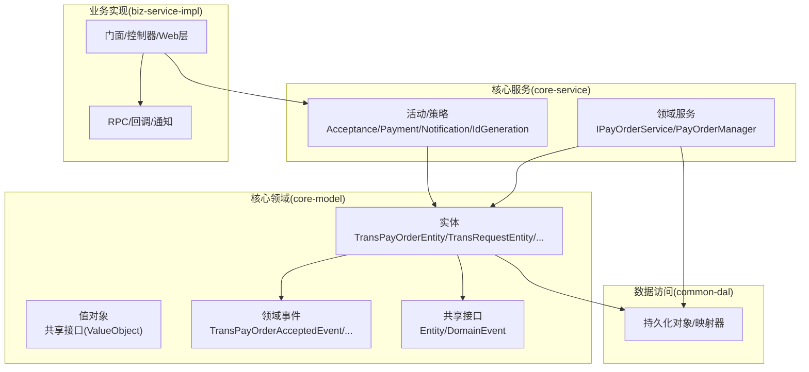
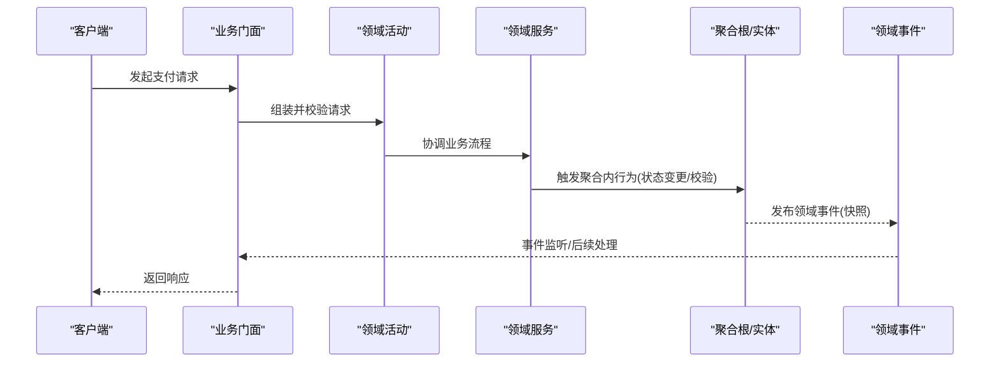
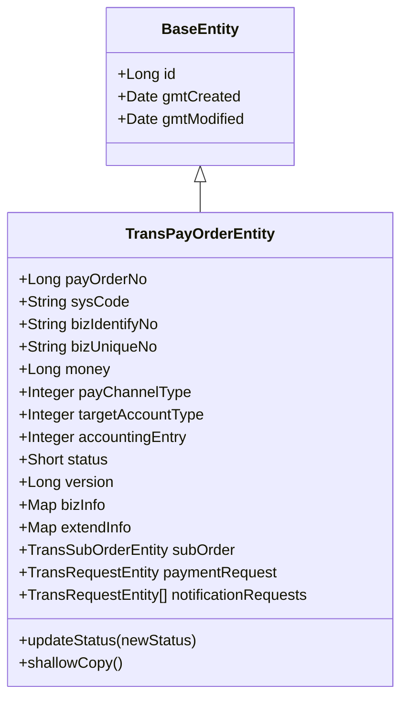
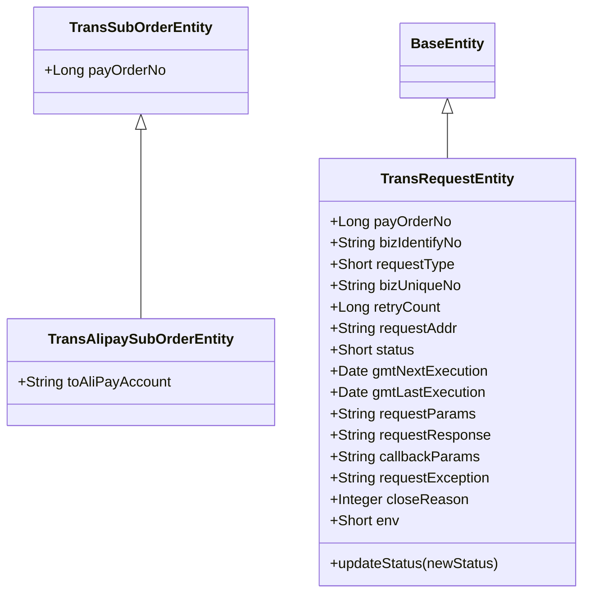
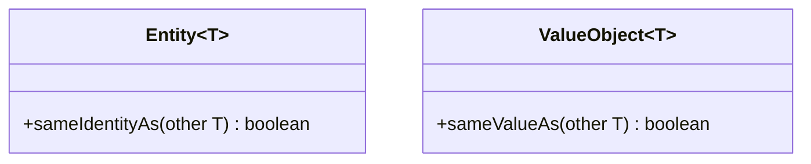
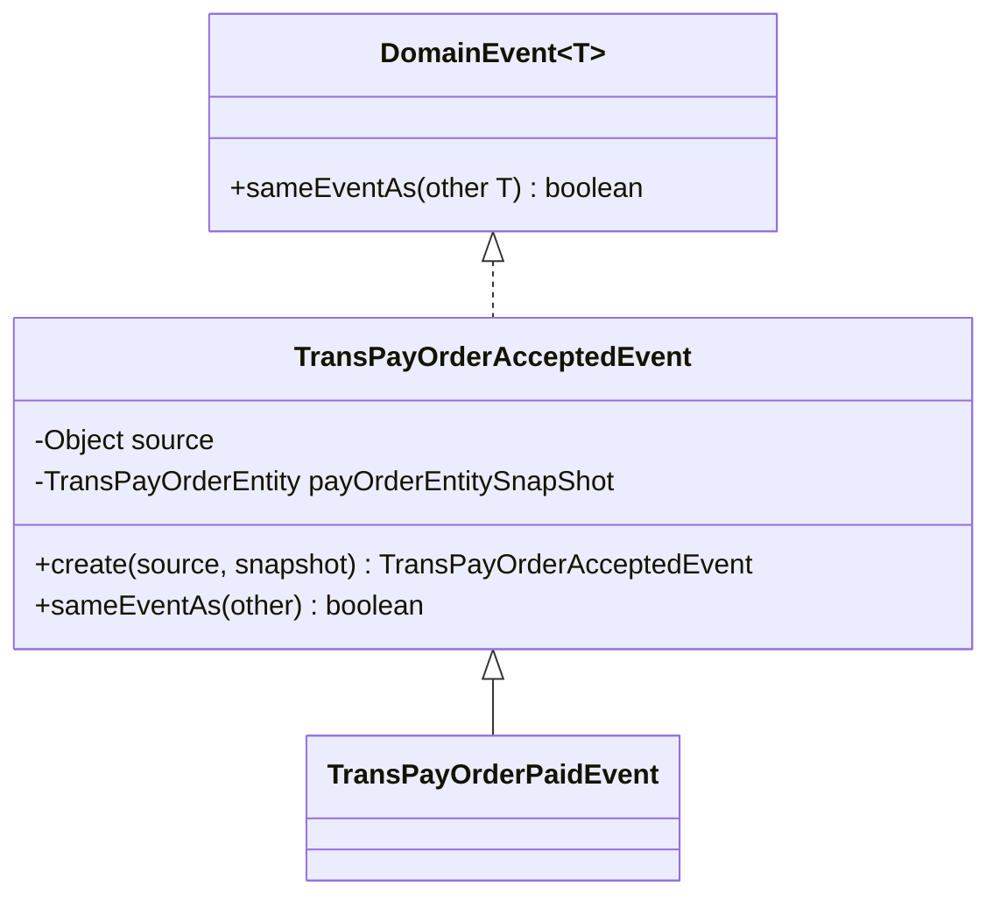
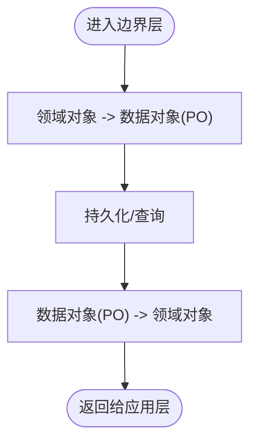
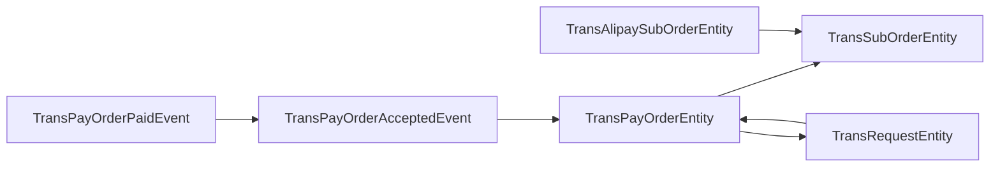

# 领域驱动设计概念

<cite>
**本文引用的文件**
- [TransPayOrderEntity.java](file://core-model/src/main/java/com/magicliang/transaction/sys/core/model/entity/TransPayOrderEntity.java)
- [TransRequestEntity.java](file://core-model/src/main/java/com/magicliang/transaction/sys/core/model/entity/TransRequestEntity.java)
- [TransSubOrderEntity.java](file://core-model/src/main/java/com/magicliang/transaction/sys/core/model/entity/TransSubOrderEntity.java)
- [TransAlipaySubOrderEntity.java](file://core-model/src/main/java/com/magicliang/transaction/sys/core/model/entity/TransAlipaySubOrderEntity.java)
- [BaseEntity.java](file://core-model/src/main/java/com/magicliang/transaction/sys/core/model/entity/BaseEntity.java)
- [Entity.java](file://core-model/src/main/java/com/magicliang/transaction/sys/core/shared/Entity.java)
- [ValueObject.java](file://core-model/src/main/java/com/magicliang/transaction/sys/core/shared/ValueObject.java)
- [DomainEvent.java](file://core-model/src/main/java/com/magicliang/transaction/sys/core/shared/DomainEvent.java)
- [TransPayOrderAcceptedEvent.java](file://core-model/src/main/java/com/magicliang/transaction/sys/core/model/event/TransPayOrderAcceptedEvent.java)
- [TransPayOrderPaidEvent.java](file://core-model/src/main/java/com/magicliang/transaction/sys/core/model/event/TransPayOrderPaidEvent.java)
- [PaymentRequest.java](file://core-model/src/main/java/com/magicliang/transaction/sys/core/model/request/payment/PaymentRequest.java)
- [PaymentResponse.java](file://core-model/src/main/java/com/magicliang/transaction/sys/core/model/response/payment/PaymentResponse.java)
</cite>

## 目录
1. [引言](#引言)
2. [项目结构](#项目结构)
3. [核心组件](#核心组件)
4. [架构总览](#架构总览)
5. [详细组件分析](#详细组件分析)
6. [依赖分析](#依赖分析)
7. [性能考量](#性能考量)
8. [故障排查指南](#故障排查指南)
9. [结论](#结论)
10. [附录](#附录)

## 引言
本文件面向领域驱动交易系统，系统性阐述DDD核心概念在项目中的落地方式：聚合根、实体、值对象、领域事件与领域服务的设计模式与实现要点。通过对TransPayOrderEntity、TransRequestEntity等核心实体的剖析，解释聚合边界划分原则与不变量维护机制；说明领域模型与数据模型的区别及转换路径；给出充血模型与贫血模型的选择策略；并总结领域建模最佳实践与常见陷阱，帮助开发者以DDD思维高效解决复杂业务问题。

## 项目结构
该系统采用多模块分层组织，核心领域模型位于core-model模块，包含实体、值对象、领域事件与共享接口；业务编排与活动位于core-service模块；对外RPC与Web适配位于biz-service-impl模块；通用数据访问位于common-dal模块；公共工具与枚举位于common-util模块；公共门面与集成位于common-service-facade与common-service-integration模块。

## 核心组件
- 聚合根与实体：以TransPayOrderEntity为核心聚合根，聚合内包含子订单与支付请求等从属对象，通过状态变更方法维护聚合不变量。
- 值对象：通过共享接口定义值对象比较规则，强调按属性值而非身份标识进行相等性判断。
- 领域事件：以ApplicationEvent为载体，事件携带实体快照，确保事件发布后的数据一致性与可追踪性。
- 领域服务：封装跨实体的业务操作，如支付订单管理与分布式锁协调。
- 请求/响应模型：区分领域内的IRequest/IResponse与外部RPC交互的Request/Response，避免污染领域模型。

**章节来源**
- [TransPayOrderEntity.java:18-32](file://core-model/src/main/java/com/magicliang/transaction/sys/core/model/entity/TransPayOrderEntity.java#L18-L32)
- [TransRequestEntity.java:11-22](file://core-model/src/main/java/com/magicliang/transaction/sys/core/model/entity/TransRequestEntity.java#L11-L22)
- [Entity.java:6-16](file://core-model/src/main/java/com/magicliang/transaction/sys/core/shared/Entity.java#L6-L16)
- [ValueObject.java:8-18](file://core-model/src/main/java/com/magicliang/transaction/sys/core/shared/ValueObject.java#L8-L18)
- [DomainEvent.java:9-17](file://core-model/src/main/java/com/magicliang/transaction/sys/core/shared/DomainEvent.java#L9-L17)

## 架构总览
下图展示领域模型与外部交互的关键路径：业务门面触发活动，活动协调领域服务与实体行为，产生领域事件并经由事件总线传播，最终通过RPC或Web层对外输出。

## 详细组件分析

### 聚合根与不变量：TransPayOrderEntity
- 聚合边界：以支付订单为聚合根，聚合内包含子订单与支付请求等从属对象，保证同一事务内的强一致更新。
- 不变量维护：
  - 状态迁移校验：通过状态枚举校验器确保状态变更顺序合法。
  - 版本字段：用于并发控制与乐观锁。
  - 时间戳：受理、支付开始、成功、失败、退票、关闭等生命周期时间点，便于审计与重试策略。
- 行为方法：
  - 更新状态：封装状态变更逻辑，避免外部直接写入导致状态非法。
  - 浅拷贝：提供toBuilder构建器复制，便于事件快照与不可变传递。

**图表来源**
- [BaseEntity.java:20-36](file://core-model/src/main/java/com/magicliang/transaction/sys/core/model/entity/BaseEntity.java#L20-L36)
- [TransPayOrderEntity.java:32-215](file://core-model/src/main/java/com/magicliang/transaction/sys/core/model/entity/TransPayOrderEntity.java#L32-L215)

**章节来源**
- [TransPayOrderEntity.java:197-204](file://core-model/src/main/java/com/magicliang/transaction/sys/core/model/entity/TransPayOrderEntity.java#L197-L204)
- [TransPayOrderEntity.java:211-214](file://core-model/src/main/java/com/magicliang/transaction/sys/core/model/entity/TransPayOrderEntity.java#L211-L214)

### 实体与从属对象：TransRequestEntity、TransSubOrderEntity、TransAlipaySubOrderEntity
- TransRequestEntity：承载支付请求的上下文与状态，包含请求地址、参数、响应、异常、重试计数与下次执行时间等，体现请求生命周期管理。
- TransSubOrderEntity：子订单基础实体，与支付订单建立一对一/一对一扩展关系。
- TransAlipaySubOrderEntity：针对支付宝渠道的子订单扩展，体现多态与渠道特化。

**图表来源**
- [TransRequestEntity.java:22-121](file://core-model/src/main/java/com/magicliang/transaction/sys/core/model/entity/TransRequestEntity.java#L22-L121)
- [TransSubOrderEntity.java:17-23](file://core-model/src/main/java/com/magicliang/transaction/sys/core/model/entity/TransSubOrderEntity.java#L17-L23)
- [TransAlipaySubOrderEntity.java:17-23](file://core-model/src/main/java/com/magicliang/transaction/sys/core/model/entity/TransAlipaySubOrderEntity.java#L17-L23)

**章节来源**
- [TransRequestEntity.java:113-120](file://core-model/src/main/java/com/magicliang/transaction/sys/core/model/entity/TransRequestEntity.java#L113-L120)

### 值对象与实体接口：Entity、ValueObject
- Entity接口：强调实体按身份标识比较，而非属性值，确保聚合内唯一性与一致性。
- ValueObject接口：强调按属性值比较，适合封装不可变的复合属性或坐标型数据。

**图表来源**
- [Entity.java:6-16](file://core-model/src/main/java/com/magicliang/transaction/sys/core/shared/Entity.java#L6-L16)
- [ValueObject.java:8-18](file://core-model/src/main/java/com/magicliang/transaction/sys/core/shared/ValueObject.java#L8-L18)

**章节来源**
- [Entity.java:3-16](file://core-model/src/main/java/com/magicliang/transaction/sys/core/shared/Entity.java#L3-L16)
- [ValueObject.java:3-18](file://core-model/src/main/java/com/magicliang/transaction/sys/core/shared/ValueObject.java#L3-L18)

### 领域事件：TransPayOrderAcceptedEvent、TransPayOrderPaidEvent
- 事件载体：继承Spring ApplicationEvent，事件对象本身作为payload，同时保留source以兼容事件源。
- 事件快照：事件构造时对实体做浅拷贝，确保事件发布后数据变化不影响事件内容。
- 事件判等：基于实体业务主键进行事件去重，避免重复处理。

**图表来源**
- [DomainEvent.java:9-17](file://core-model/src/main/java/com/magicliang/transaction/sys/core/shared/DomainEvent.java#L9-L17)
- [TransPayOrderAcceptedEvent.java:19-53](file://core-model/src/main/java/com/magicliang/transaction/sys/core/model/event/TransPayOrderAcceptedEvent.java#L19-L53)
- [TransPayOrderPaidEvent.java:14-19](file://core-model/src/main/java/com/magicliang/transaction/sys/core/model/event/TransPayOrderPaidEvent.java#L14-L19)

**章节来源**
- [TransPayOrderAcceptedEvent.java:28-39](file://core-model/src/main/java/com/magicliang/transaction/sys/core/model/event/TransPayOrderAcceptedEvent.java#L28-L39)
- [TransPayOrderAcceptedEvent.java:46-52](file://core-model/src/main/java/com/magicliang/transaction/sys/core/model/event/TransPayOrderAcceptedEvent.java#L46-L52)

### 充血模型与贫血模型选择策略
- 充血模型（推荐于领域核心）：将业务行为封装在实体内，如状态变更、校验与快照生成，提升内聚性与可测试性。
- 减少贫血：避免仅暴露getter/setter的纯数据载体，防止业务逻辑外溢至应用层或基础设施层。
- 请求/响应分离：领域内使用IRequest/IResponse，对外RPC使用Request/Response，避免污染领域模型。

**章节来源**
- [TransPayOrderEntity.java:197-204](file://core-model/src/main/java/com/magicliang/transaction/sys/core/model/entity/TransPayOrderEntity.java#L197-L204)
- [PaymentRequest.java:18](file://core-model/src/main/java/com/magicliang/transaction/sys/core/model/request/payment/PaymentRequest.java#L18)
- [PaymentResponse.java:16](file://core-model/src/main/java/com/magicliang/transaction/sys/core/model/response/payment/PaymentResponse.java#L16)

### 领域模型与数据模型的转换
- 领域模型：以业务为中心，强调行为与不变量，如TransPayOrderEntity、TransRequestEntity。
- 数据模型：以存储为中心，PO/DAO负责持久化映射，如common-dal中的PO与Mapper。
- 转换策略：通过convertor在边界层完成领域对象与数据对象的双向映射，保持领域模型纯净。

## 依赖分析
- 聚合内依赖：聚合根持有子订单与请求对象，形成强聚合内耦合，弱外部依赖。
- 接口契约：共享接口Entity/ValueObject/DomainEvent定义了跨模块的一致性约定。
- 外部事件：领域事件通过Spring ApplicationEvent传播，解耦事件发布者与订阅者。

**图表来源**
- [TransPayOrderEntity.java:176-190](file://core-model/src/main/java/com/magicliang/transaction/sys/core/model/entity/TransPayOrderEntity.java#L176-L190)
- [TransRequestEntity.java:22-121](file://core-model/src/main/java/com/magicliang/transaction/sys/core/model/entity/TransRequestEntity.java#L22-L121)
- [TransAlipaySubOrderEntity.java:17-23](file://core-model/src/main/java/com/magicliang/transaction/sys/core/model/entity/TransAlipaySubOrderEntity.java#L17-L23)
- [TransPayOrderAcceptedEvent.java:19-39](file://core-model/src/main/java/com/magicliang/transaction/sys/core/model/event/TransPayOrderAcceptedEvent.java#L19-L39)
- [TransPayOrderPaidEvent.java:14-19](file://core-model/src/main/java/com/magicliang/transaction/sys/core/model/event/TransPayOrderPaidEvent.java#L14-L19)

## 性能考量
- 状态变更与版本控制：通过状态校验与版本字段降低并发冲突概率，减少回滚成本。
- 事件快照：对实体做浅拷贝快照，避免事件监听期间的数据漂移，提高事件处理稳定性。
- 请求调度：请求实体包含下次执行时间与重试计数，结合调度策略实现低延迟与高吞吐。

## 故障排查指南
- 状态非法变更：检查状态校验逻辑与调用顺序，定位updateStatus调用点。
- 并发写入冲突：核对版本字段与乐观锁策略，确认是否重复提交或未刷新最新版本。
- 事件重复消费：利用事件快照中的业务主键进行sameEventAs判等，避免重复处理。
- 请求超时/重试：核查请求实体的时间戳与重试计数，评估调度策略与下游可用性。

**章节来源**
- [TransPayOrderEntity.java:202](file://core-model/src/main/java/com/magicliang/transaction/sys/core/model/entity/TransPayOrderEntity.java#L202)
- [TransPayOrderAcceptedEvent.java:46-52](file://core-model/src/main/java/com/magicliang/transaction/sys/core/model/event/TransPayOrderAcceptedEvent.java#L46-L52)
- [TransRequestEntity.java:113-120](file://core-model/src/main/java/com/magicliang/transaction/sys/core/model/entity/TransRequestEntity.java#L113-L120)

## 结论
本系统以TransPayOrderEntity为核心聚合根，围绕状态机与生命周期时间点构建聚合不变量，通过领域事件实现松耦合的跨模块协作。共享接口统一了实体与值对象的比较契约，确保领域模型的内聚与可演进。建议在核心领域坚持充血模型，将业务行为保留在实体内，借助convertor完成与数据模型的转换，从而以DDD思想有效应对复杂交易场景。

## 附录
- 最佳实践
  - 明确聚合边界，聚合内强一致，聚合间弱耦合。
  - 将业务规则内聚到实体与值对象，避免贫血模型。
  - 使用领域事件表达跨边界的业务事实，事件快照保障可追溯性。
  - 通过接口契约约束跨模块一致性，减少隐式依赖。
- 常见陷阱
  - 将状态变更逻辑散落各处，破坏聚合内不变量。
  - 在实体外直接操作底层PO，污染领域模型。
  - 忽视事件幂等，导致重复处理引发副作用。
  - 过度使用继承，模糊聚合边界与职责划分。