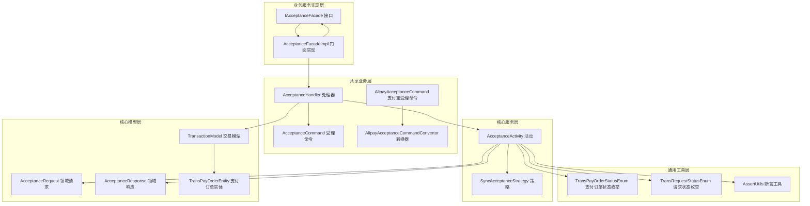
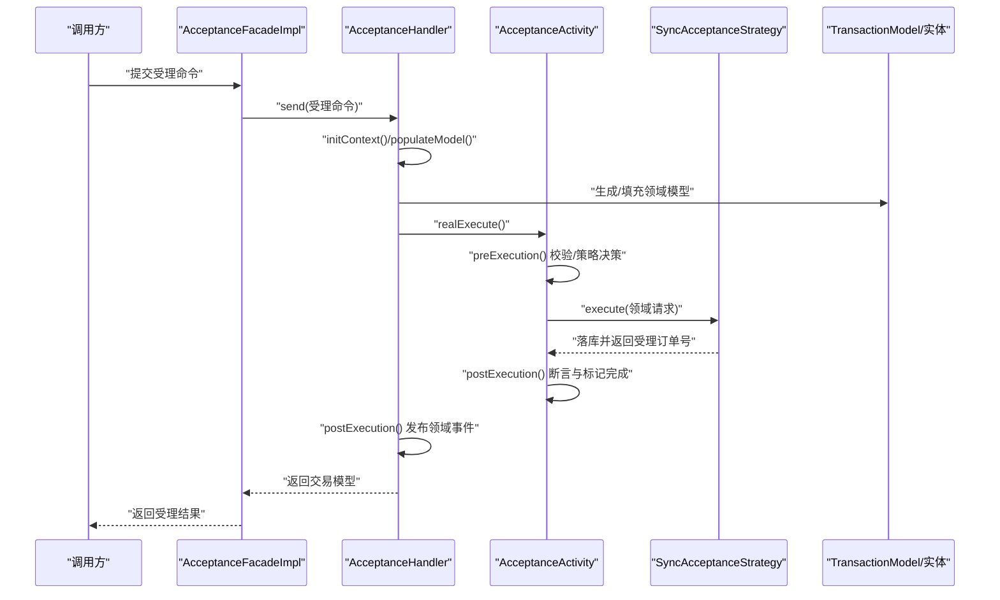
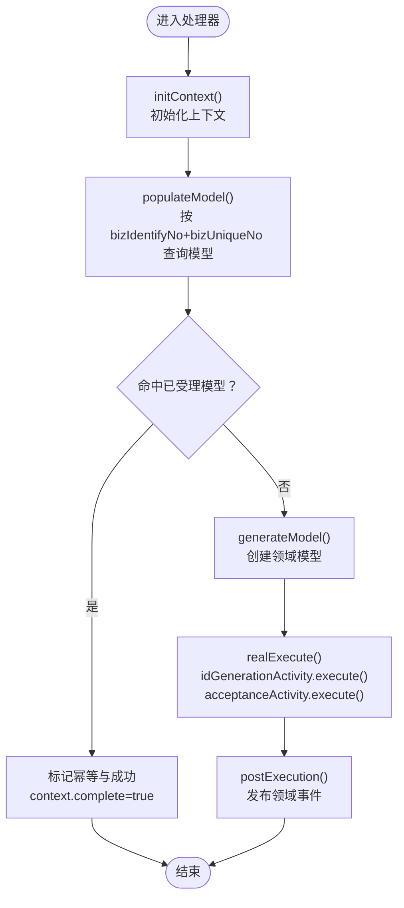
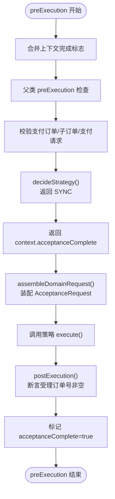
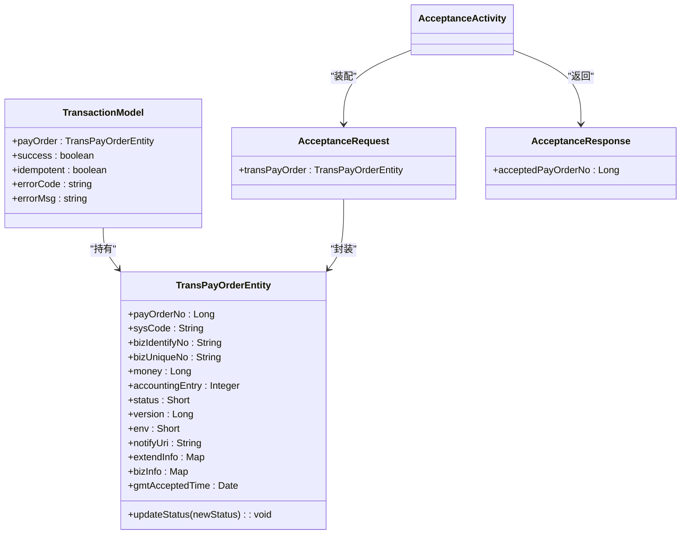
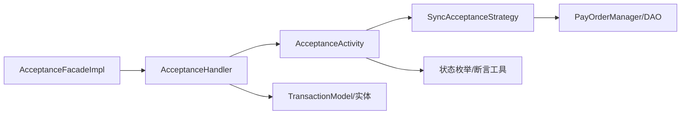

# 支付受理功能

<cite>
**本文引用的文件**   
- [AcceptanceFacadeImpl.java](file://biz-service-impl/src/main/java/com/magicliang/transaction/sys/biz/service/impl/facade/impl/AcceptanceFacadeImpl.java)
- [IAcceptanceFacade.java](file://biz-service-impl/src/main/java/com/magicliang/transaction/sys/biz/service/impl/facade/IAcceptanceFacade.java)
- [AbstractFacade.java](file://biz-service-impl/src/main/java/com/magicliang/transaction/sys/biz/service/impl/facade/impl/AbstractFacade.java)
- [AcceptanceHandler.java](file://biz-shared/src/main/java/com/magicliang/transaction/sys/biz/shared/handler/AcceptanceHandler.java)
- [AcceptanceCommand.java](file://biz-shared/src/main/java/com/magicliang/transaction/sys/biz/shared/request/acceptance/AcceptanceCommand.java)
- [AlipayAcceptanceCommand.java](file://biz-shared/src/main/java/com/magicliang/transaction/sys/biz/shared/request/acceptance/AlipayAcceptanceCommand.java)
- [AlipayAcceptanceCommandConvertor.java](file://biz-shared/src/main/java/com/magicliang/transaction/sys/biz/shared/request/acceptance/convertor/AlipayAcceptanceCommandConvertor.java)
- [AcceptanceActivity.java](file://core-service/src/main/java/com/magicliang/transaction/sys/core/domain/activity/acceptance/AcceptanceActivity.java)
- [SyncAcceptanceStrategy.java](file://core-service/src/main/java/com/magicliang/transaction/sys/core/domain/strategy/acceptance/SyncAcceptanceStrategy.java)
- [AcceptanceRequest.java](file://core-model/src/main/java/com/magicliang/transaction/sys/core/model/request/acceptance/AcceptanceRequest.java)
- [AcceptanceResponse.java](file://core-model/src/main/java/com/magicliang/transaction/sys/core/model/response/acceptance/AcceptanceResponse.java)
- [TransactionModel.java](file://core-model/src/main/java/com/magicliang/transaction/sys/core/model/context/TransactionModel.java)
- [TransPayOrderEntity.java](file://core-model/src/main/java/com/magicliang/transaction/sys/core/model/entity/TransPayOrderEntity.java)
- [TransPayOrderStatusEnum.java](file://common-util/src/main/java/com/magicliang/transaction/sys/common/enums/TransPayOrderStatusEnum.java)
- [TransRequestStatusEnum.java](file://common-util/src/main/java/com/magicliang/transaction/sys/common/enums/TransRequestStatusEnum.java)
- [AssertUtils.java](file://common-util/src/main/java/com/magicliang/transaction/sys/common/util/AssertUtils.java)
</cite>

## 目录
1. [简介](#简介)
2. [项目结构](#项目结构)
3. [核心组件](#核心组件)
4. [架构概览](#架构概览)
5. [详细组件分析](#详细组件分析)
6. [依赖分析](#依赖分析)
7. [性能考虑](#性能考虑)
8. [故障排查指南](#故障排查指南)
9. [结论](#结论)
10. [附录](#附录)

## 简介
本文件面向支付受理功能，系统化梳理从请求接入到领域模型创建、幂等性处理、状态转换与最终落库的完整业务流程。重点覆盖以下内容：
- 订单创建与参数校验：受理命令到领域模型的装配与校验
- 幂等性处理：上下文级别与模型级别的幂等判定与回放
- 状态转换机制：支付订单与请求的状态机迁移规则
- 门面与处理器职责：AcceptanceFacadeImpl 如何转发请求；AcceptanceHandler 如何完成参数校验、模型创建与事件发布
- 活动层逻辑：AcceptanceActivity 的前置校验、策略决策与后置断言
- API 接口文档：请求参数、响应格式与错误码说明
- 使用示例与集成指南：如何正确调用支付受理接口

## 项目结构
支付受理功能横跨“业务服务实现层”“共享业务层”“核心服务层”“核心模型层”“通用工具层”，采用命令-处理器-活动-策略的分层解耦设计，确保职责清晰、可扩展性强。

**图表来源**
- [AcceptanceFacadeImpl.java:1-33](file://biz-service-impl/src/main/java/com/magicliang/transaction/sys/biz/service/impl/facade/impl/AcceptanceFacadeImpl.java#L1-L33)
- [IAcceptanceFacade.java:1-25](file://biz-service-impl/src/main/java/com/magicliang/transaction/sys/biz/service/impl/facade/IAcceptanceFacade.java#L1-L25)
- [AcceptanceHandler.java:1-231](file://biz-shared/src/main/java/com/magicliang/transaction/sys/biz/shared/handler/AcceptanceHandler.java#L1-L231)
- [AcceptanceActivity.java:1-198](file://core-service/src/main/java/com/magicliang/transaction/sys/core/domain/activity/acceptance/AcceptanceActivity.java#L1-L198)
- [SyncAcceptanceStrategy.java:1-80](file://core-service/src/main/java/com/magicliang/transaction/sys/core/domain/strategy/acceptance/SyncAcceptanceStrategy.java#L1-L80)
- [AcceptanceRequest.java:1-24](file://core-model/src/main/java/com/magicliang/transaction/sys/core/model/request/acceptance/AcceptanceRequest.java#L1-L24)
- [AcceptanceResponse.java:1-23](file://core-model/src/main/java/com/magicliang/transaction/sys/core/model/response/acceptance/AcceptanceResponse.java#L1-L23)
- [TransactionModel.java:1-44](file://core-model/src/main/java/com/magicliang/transaction/sys/core/model/context/TransactionModel.java#L1-L44)
- [TransPayOrderEntity.java:1-216](file://core-model/src/main/java/com/magicliang/transaction/sys/core/model/entity/TransPayOrderEntity.java#L1-L216)
- [TransPayOrderStatusEnum.java:1-205](file://common-util/src/main/java/com/magicliang/transaction/sys/common/enums/TransPayOrderStatusEnum.java#L1-L205)
- [TransRequestStatusEnum.java:1-163](file://common-util/src/main/java/com/magicliang/transaction/sys/common/enums/TransRequestStatusEnum.java#L1-L163)
- [AssertUtils.java:1-109](file://common-util/src/main/java/com/magicliang/transaction/sys/common/util/AssertUtils.java#L1-L109)

**章节来源**
- [AcceptanceFacadeImpl.java:1-33](file://biz-service-impl/src/main/java/com/magicliang/transaction/sys/biz/service/impl/facade/impl/AcceptanceFacadeImpl.java#L1-L33)
- [AcceptanceHandler.java:1-231](file://biz-shared/src/main/java/com/magicliang/transaction/sys/biz/shared/handler/AcceptanceHandler.java#L1-L231)
- [AcceptanceActivity.java:1-198](file://core-service/src/main/java/com/magicliang/transaction/sys/core/domain/activity/acceptance/AcceptanceActivity.java#L1-L198)

## 核心组件
- 门面层：IAcceptanceFacade 定义受理入口；AcceptanceFacadeImpl 将受理命令通过命令查询总线转发给处理器。
- 处理器层：AcceptanceHandler 负责上下文初始化、幂等判定、领域模型创建、业务规则校验与事件发布。
- 活动层：AcceptanceActivity 负责活动级幂等、实体完整性校验、策略决策与前后置断言。
- 策略层：SyncAcceptanceStrategy 实现同步受理策略，负责落库与响应组装。
- 模型层：TransactionModel、AcceptanceRequest/Response、TransPayOrderEntity 等承载领域数据与状态。
- 工具层：状态枚举与断言工具保障状态迁移合法性与运行期校验。

**章节来源**
- [IAcceptanceFacade.java:1-25](file://biz-service-impl/src/main/java/com/magicliang/transaction/sys/biz/service/impl/facade/IAcceptanceFacade.java#L1-L25)
- [AcceptanceFacadeImpl.java:1-33](file://biz-service-impl/src/main/java/com/magicliang/transaction/sys/biz/service/impl/facade/impl/AcceptanceFacadeImpl.java#L1-L33)
- [AcceptanceHandler.java:1-231](file://biz-shared/src/main/java/com/magicliang/transaction/sys/biz/shared/handler/AcceptanceHandler.java#L1-L231)
- [AcceptanceActivity.java:1-198](file://core-service/src/main/java/com/magicliang/transaction/sys/core/domain/activity/acceptance/AcceptanceActivity.java#L1-L198)
- [SyncAcceptanceStrategy.java:1-80](file://core-service/src/main/java/com/magicliang/transaction/sys/core/domain/strategy/acceptance/SyncAcceptanceStrategy.java#L1-L80)
- [TransactionModel.java:1-44](file://core-model/src/main/java/com/magicliang/transaction/sys/core/model/context/TransactionModel.java#L1-L44)
- [AcceptanceRequest.java:1-24](file://core-model/src/main/java/com/magicliang/transaction/sys/core/model/request/acceptance/AcceptanceRequest.java#L1-L24)
- [AcceptanceResponse.java:1-23](file://core-model/src/main/java/com/magicliang/transaction/sys/core/model/response/acceptance/AcceptanceResponse.java#L1-L23)
- [TransPayOrderEntity.java:1-216](file://core-model/src/main/java/com/magicliang/transaction/sys/core/model/entity/TransPayOrderEntity.java#L1-L216)

## 架构概览
支付受理的端到端调用链如下：

**图表来源**
- [AcceptanceFacadeImpl.java:28-31](file://biz-service-impl/src/main/java/com/magicliang/transaction/sys/biz/service/impl/facade/impl/AcceptanceFacadeImpl.java#L28-L31)
- [AcceptanceHandler.java:70-79](file://biz-shared/src/main/java/com/magicliang/transaction/sys/biz/shared/handler/AcceptanceHandler.java#L70-L79)
- [AcceptanceActivity.java:56-92](file://core-service/src/main/java/com/magicliang/transaction/sys/core/domain/activity/acceptance/AcceptanceActivity.java#L56-L92)
- [SyncAcceptanceStrategy.java:59-78](file://core-service/src/main/java/com/magicliang/transaction/sys/core/domain/strategy/acceptance/SyncAcceptanceStrategy.java#L59-L78)

## 详细组件分析

### 门面层：AcceptanceFacadeImpl
- 职责：对外暴露受理入口，将受理命令通过命令查询总线转发给处理器，屏蔽上层与具体处理器实现的耦合。
- 关键点：仅做“转发”，不做业务逻辑；幂等与模型填充在处理器层完成。

**章节来源**
- [AcceptanceFacadeImpl.java:18-31](file://biz-service-impl/src/main/java/com/magicliang/transaction/sys/biz/service/impl/facade/impl/AcceptanceFacadeImpl.java#L18-L31)
- [IAcceptanceFacade.java:15-23](file://biz-service-impl/src/main/java/com/magicliang/transaction/sys/biz/service/impl/facade/IAcceptanceFacade.java#L15-L23)

### 处理器层：AcceptanceHandler
- 上下文初始化与幂等：initContext 中调用 populateModel，按业务标识码与业务唯一号查询是否存在已受理的领域模型；若命中则直接回放旧模型并标记成功与幂等。
- 领域模型创建：generateModel/generatePayOrder/generateSubOrder/generatePayRequest 将受理命令装配为支付订单、子订单与支付请求。
- 业务规则与事件：realExecute 串行执行 ID 生成与受理活动；postExecution 发布“支付订单已受理”领域事件。

**图表来源**
- [AcceptanceHandler.java:54-128](file://biz-shared/src/main/java/com/magicliang/transaction/sys/biz/shared/handler/AcceptanceHandler.java#L54-L128)
- [AcceptanceHandler.java:218-228](file://biz-shared/src/main/java/com/magicliang/transaction/sys/biz/shared/handler/AcceptanceHandler.java#L218-L228)

**章节来源**
- [AcceptanceHandler.java:54-128](file://biz-shared/src/main/java/com/magicliang/transaction/sys/biz/shared/handler/AcceptanceHandler.java#L54-L128)
- [AcceptanceHandler.java:136-216](file://biz-shared/src/main/java/com/magicliang/transaction/sys/biz/shared/handler/AcceptanceHandler.java#L136-L216)

### 活动层：AcceptanceActivity
- 前置校验：合并上下文完成标志，执行父类检查；对支付订单、子订单、支付请求进行插入前校验；断言策略与支付请求非空。
- 领域请求装配：将 TransactionModel 中的支付订单与请求装配到 AcceptanceRequest。
- 策略决策：当前固定返回同步受理策略。
- 后置断言：断言受理返回的支付订单号非空，标记活动完成。

**图表来源**
- [AcceptanceActivity.java:56-92](file://core-service/src/main/java/com/magicliang/transaction/sys/core/domain/activity/acceptance/AcceptanceActivity.java#L56-L92)
- [AcceptanceActivity.java:100-122](file://core-service/src/main/java/com/magicliang/transaction/sys/core/domain/activity/acceptance/AcceptanceActivity.java#L100-L122)
- [AcceptanceActivity.java:130-134](file://core-service/src/main/java/com/magicliang/transaction/sys/core/domain/activity/acceptance/AcceptanceActivity.java#L130-L134)
- [AcceptanceActivity.java:151-162](file://core-service/src/main/java/com/magicliang/transaction/sys/core/domain/activity/acceptance/AcceptanceActivity.java#L151-L162)

**章节来源**
- [AcceptanceActivity.java:56-92](file://core-service/src/main/java/com/magicliang/transaction/sys/core/domain/activity/acceptance/AcceptanceActivity.java#L56-L92)
- [AcceptanceActivity.java:100-122](file://core-service/src/main/java/com/magicliang/transaction/sys/core/domain/activity/acceptance/AcceptanceActivity.java#L100-L122)
- [AcceptanceActivity.java:130-134](file://core-service/src/main/java/com/magicliang/transaction/sys/core/domain/activity/acceptance/AcceptanceActivity.java#L130-L134)
- [AcceptanceActivity.java:151-162](file://core-service/src/main/java/com/magicliang/transaction/sys/core/domain/activity/acceptance/AcceptanceActivity.java#L151-L162)

### 策略层：SyncAcceptanceStrategy
- 职责：在单事务内插入支付订单、支付请求与子订单 PO，并回填 ID；返回受理后的支付订单号。
- 关键点：当子订单为支付宝余额子订单时，转换为对应 PO 并一并插入。

**章节来源**
- [SyncAcceptanceStrategy.java:59-78](file://core-service/src/main/java/com/magicliang/transaction/sys/core/domain/strategy/acceptance/SyncAcceptanceStrategy.java#L59-L78)

### 数据模型与状态机
- 支付订单实体：包含业务标识、金额、会计分录、状态、版本、环境、通知地址、扩展信息等字段，并提供状态变更方法。
- 支付订单状态：INIT/PENDING/SUCCESS/FAILED/CLOSED/BOUNCED，支持状态迁移校验。
- 支付请求状态：INIT/PENDING/SUCCESS/FAILED/CLOSED，支持状态迁移校验。
- 断言工具：统一的断言方法，用于运行期校验与异常抛出。

**图表来源**
- [TransactionModel.java:16-44](file://core-model/src/main/java/com/magicliang/transaction/sys/core/model/context/TransactionModel.java#L16-L44)
- [TransPayOrderEntity.java:32-216](file://core-model/src/main/java/com/magicliang/transaction/sys/core/model/entity/TransPayOrderEntity.java#L32-L216)
- [AcceptanceRequest.java:16-23](file://core-model/src/main/java/com/magicliang/transaction/sys/core/model/request/acceptance/AcceptanceRequest.java#L16-L23)
- [AcceptanceResponse.java:15-23](file://core-model/src/main/java/com/magicliang/transaction/sys/core/model/response/acceptance/AcceptanceResponse.java#L15-L23)

**章节来源**
- [TransPayOrderEntity.java:32-216](file://core-model/src/main/java/com/magicliang/transaction/sys/core/model/entity/TransPayOrderEntity.java#L32-L216)
- [TransPayOrderStatusEnum.java:26-62](file://common-util/src/main/java/com/magicliang/transaction/sys/common/enums/TransPayOrderStatusEnum.java#L26-L62)
- [TransRequestStatusEnum.java:27-55](file://common-util/src/main/java/com/magicliang/transaction/sys/common/enums/TransRequestStatusEnum.java#L27-L55)
- [AssertUtils.java:35-48](file://common-util/src/main/java/com/magicliang/transaction/sys/common/util/AssertUtils.java#L35-L48)

## 依赖分析
- 低耦合高内聚：门面仅负责转发，处理器负责上下文与模型，活动负责校验与策略，策略负责落库，职责边界清晰。
- 可扩展性：策略可替换，状态枚举可扩展，命令转换器可扩展。
- 关键依赖链：门面 → 处理器 → 活动 → 策略 → DAO 层（通过 Manager/Service）。

**图表来源**
- [AcceptanceFacadeImpl.java:28-31](file://biz-service-impl/src/main/java/com/magicliang/transaction/sys/biz/service/impl/facade/impl/AcceptanceFacadeImpl.java#L28-L31)
- [AcceptanceHandler.java:70-79](file://biz-shared/src/main/java/com/magicliang/transaction/sys/biz/shared/handler/AcceptanceHandler.java#L70-L79)
- [AcceptanceActivity.java:100-122](file://core-service/src/main/java/com/magicliang/transaction/sys/core/domain/activity/acceptance/AcceptanceActivity.java#L100-L122)
- [SyncAcceptanceStrategy.java:60-78](file://core-service/src/main/java/com/magicliang/transaction/sys/core/domain/strategy/acceptance/SyncAcceptanceStrategy.java#L60-L78)

**章节来源**
- [AbstractFacade.java:17-36](file://biz-service-impl/src/main/java/com/magicliang/transaction/sys/biz/service/impl/facade/impl/AbstractFacade.java#L17-L36)
- [AcceptanceHandler.java:32-46](file://biz-shared/src/main/java/com/magicliang/transaction/sys/biz/shared/handler/AcceptanceHandler.java#L32-L46)

## 性能考虑
- 幂等命中快速返回：处理器层按业务标识码与业务唯一号查询已受理模型，命中即直接回放，避免重复落库与计算。
- 单事务落库：同步策略在单事务内插入支付订单、支付请求与子订单，减少跨事务一致性成本。
- 状态迁移校验：通过状态枚举与断言工具在入参阶段拦截非法状态迁移，降低后续处理失败概率。
- 建议：对高频幂等查询建立合适索引；对落库路径进行慢查询监控；合理设置活动完成标志以避免重复执行。

[本节为通用建议，无需特定文件来源]

## 故障排查指南
- 常见错误定位
  - 参数缺失或非法：断言工具会在前置校验阶段抛出异常，优先检查受理命令字段与状态枚举取值。
  - 支付请求为空：活动层对支付请求进行非空断言，需确认受理命令是否正确装配支付请求。
  - 策略未决策：活动层策略断言失败，需检查策略注册与识别逻辑。
  - 幂等命中但状态异常：处理器层命中幂等后仍需校验是否处于终态，避免重复受理。
- 排查步骤
  - 核对受理命令字段：金额、会计分录、回调地址、业务标识等。
  - 观察活动层日志：preExecution/assemble/postExecution 关键节点。
  - 检查策略执行：确认落库是否成功与返回的受理订单号。
  - 校验状态迁移：使用状态枚举工具核对状态变更是否合法。

**章节来源**
- [AssertUtils.java:103-107](file://common-util/src/main/java/com/magicliang/transaction/sys/common/util/AssertUtils.java#L103-L107)
- [AcceptanceActivity.java:82-84](file://core-service/src/main/java/com/magicliang/transaction/sys/core/domain/activity/acceptance/AcceptanceActivity.java#L82-L84)
- [AcceptanceActivity.java:157-159](file://core-service/src/main/java/com/magicliang/transaction/sys/core/domain/activity/acceptance/AcceptanceActivity.java#L157-L159)
- [TransPayOrderStatusEnum.java:174-203](file://common-util/src/main/java/com/magicliang/transaction/sys/common/enums/TransPayOrderStatusEnum.java#L174-L203)
- [TransRequestStatusEnum.java:137-161](file://common-util/src/main/java/com/magicliang/transaction/sys/common/enums/TransRequestStatusEnum.java#L137-L161)

## 结论
支付受理功能通过“门面-处理器-活动-策略”的分层设计，实现了请求转发、幂等判定、领域模型装配、状态校验与落库的完整闭环。其核心优势在于：
- 明确的职责划分与良好的扩展性
- 强约束的状态机与断言工具，保障数据一致性
- 幂等与单事务落库提升吞吐与可靠性

[本节为总结，无需特定文件来源]

## 附录

### API 接口文档

- 接口名称
  - 受理支付订单
- 请求方法
  - POST
- 请求路径
  - /api/acceptance
- 请求头
  - Content-Type: application/json
- 请求参数

| 字段名 | 类型 | 必填 | 描述 | 示例 |
|---|---|---|---|---|
| sysCode | string | 是 | 支付订单来源系统编码 | "UPSTREAM_SYS_A" |
| bizIdentifyNo | string | 是 | 业务标识码 | "BIZ_ID_001" |
| bizUniqueNo | string | 是 | 上游业务号（与业务标识码联合全局唯一） | "ORDER_NO_123456" |
| money | long | 是 | 支付单金额（分） | 100 |
| accountingEntry | int | 是 | 会计账目条目（1 借/2 贷） | 1 |
| notifyUri | string | 是 | 回调地址 | "https://example.com/notify" |
| memo | string | 否 | 支付备注 | "测试订单" |
| businessEntity | string | 否 | 支付主体 | "TEST_ENTITY" |
| extendInfo | map[string]string | 否 | 平台能力抽象（json 字符串键值对） | {"key":"value"} |
| bizInfo | map[string]string | 否 | 透传业务信息（json 字符串键值对） | {"ext":"data"} |

- 响应参数

| 字段名 | 类型 | 描述 |
|---|---|---|
| success | boolean | 是否受理成功（幂等命中也视为成功） |
| errorCode | string | 错误码（成功时为空） |
| errorMsg | string | 错误信息（成功时为空） |
| acceptedPayOrderNo | long | 受理后的支付订单号（成功时返回） |

- 错误码说明

| 错误码 | 场景 | 说明 |
|---|---|---|
| INVALID_ACCEPTANCE_STRATEGY_ERROR | 活动层策略决策失败 | 策略未识别或为空 |
| INVALID_PAYMENT_REQUEST_ERROR | 支付请求缺失 | 支付请求为空或未装配 |
| ACCEPTANCE_FAILURE_ERROR | 策略执行失败 | 受理订单号为空或落库失败 |
| INVALID_PAY_ORDER_STATUS_ERROR | 支付订单状态非法 | 状态迁移不符合状态机 |
| INVALID_CHANNEL_REQUEST_STATUS_ERROR | 支付请求状态非法 | 请求状态迁移不符合状态机 |

- 使用示例（请求体）
  - 示例 1：支付宝余额支付
    - sysCode: "UPSTREAM_SYS_A"
    - bizIdentifyNo: "BIZ_ID_001"
    - bizUniqueNo: "ORDER_NO_123456"
    - money: 100
    - accountingEntry: 1
    - notifyUri: "https://example.com/notify"
    - extendInfo: {"channel":"ALIPAY_BALANCE","scene":"TEST"}
    - bizInfo: {"remark":"test order"}

- 集成指南
  - 步骤 1：构造受理命令，填写必填字段并按需补充扩展信息
  - 步骤 2：调用受理接口，接收受理结果
  - 步骤 3：根据 acceptedPayOrderNo 进行业务后续处理
  - 步骤 4：监听回调地址，处理支付结果通知

**章节来源**
- [AcceptanceCommand.java:21-72](file://biz-shared/src/main/java/com/magicliang/transaction/sys/biz/shared/request/acceptance/AcceptanceCommand.java#L21-L72)
- [AlipayAcceptanceCommand.java:17-24](file://biz-shared/src/main/java/com/magicliang/transaction/sys/biz/shared/request/acceptance/AlipayAcceptanceCommand.java#L17-L24)
- [AcceptanceResponse.java:15-23](file://core-model/src/main/java/com/magicliang/transaction/sys/core/model/response/acceptance/AcceptanceResponse.java#L15-L23)
- [TransPayOrderStatusEnum.java:174-203](file://common-util/src/main/java/com/magicliang/transaction/sys/common/enums/TransPayOrderStatusEnum.java#L174-L203)
- [TransRequestStatusEnum.java:137-161](file://common-util/src/main/java/com/magicliang/transaction/sys/common/enums/TransRequestStatusEnum.java#L137-L161)