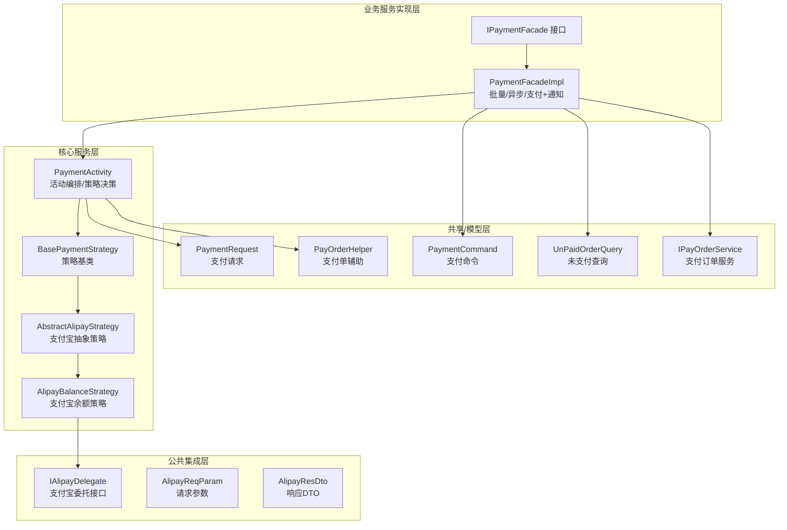
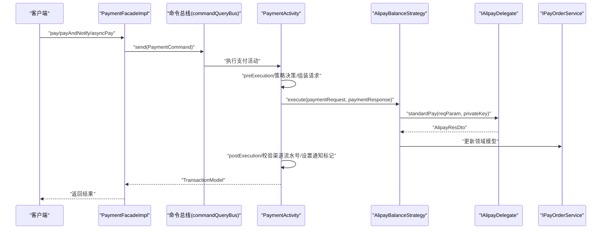
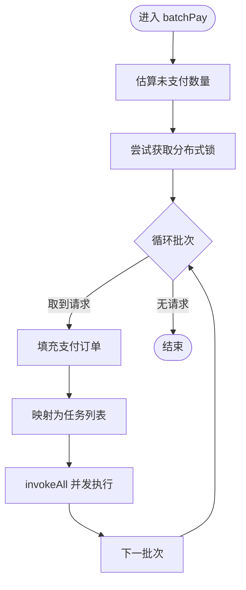
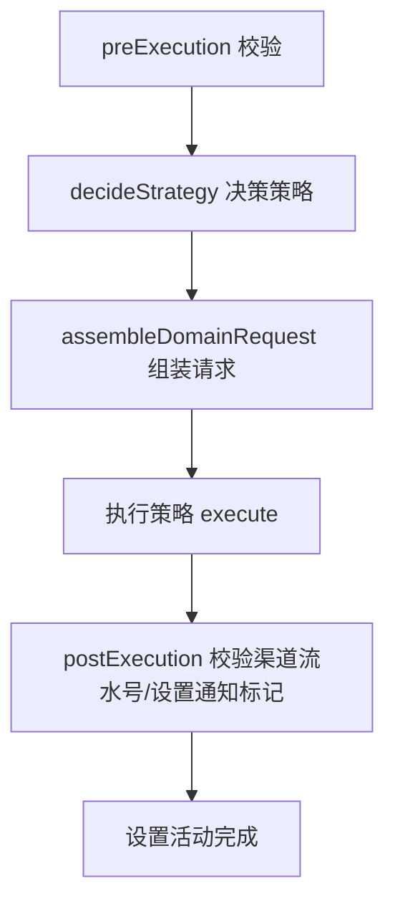
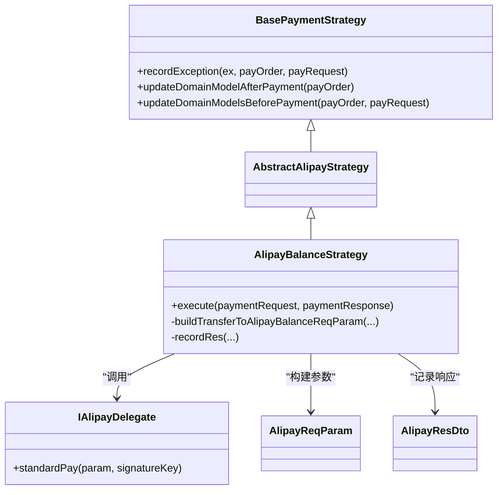
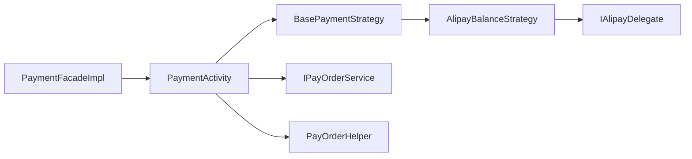

# 支付执行功能

<cite>
**本文引用的文件**
- [PaymentFacadeImpl.java](file://biz-service-impl/src/main/java/com/magicliang/transaction/sys/biz/service/impl/facade/impl/PaymentFacadeImpl.java)
- [IPaymentFacade.java](file://biz-service-impl/src/main/java/com/magicliang/transaction/sys/biz/service/impl/facade/IPaymentFacade.java)
- [PaymentActivity.java](file://core-service/src/main/java/com/magicliang/transaction/sys/core/domain/activity/payment/PaymentActivity.java)
- [BasePaymentStrategy.java](file://core-service/src/main/java/com/magicliang/transaction/sys/core/domain/strategy/payment/BasePaymentStrategy.java)
- [AlipayBalanceStrategy.java](file://core-service/src/main/java/com/magicliang/transaction/sys/core/domain/strategy/payment/AlipayBalanceStrategy.java)
- [AbstractAlipayStrategy.java](file://core-service/src/main/java/com/magicliang/transaction/sys/core/domain/strategy/payment/AbstractAlipayStrategy.java)
- [IAlipayDelegate.java](file://common-service-integration/src/main/java/com/magicliang/transaction/sys/common/service/integration/delegate/alipay/IAlipayDelegate.java)
- [AlipayReqParam.java](file://common-service-integration/src/main/java/com/magicliang/transaction/sys/common/service/integration/param/AlipayReqParam.java)
- [AlipayResDto.java](file://common-service-integration/src/main/java/com/magicliang/transaction/sys/common/service/integration/param/AlipayResDto.java)
- [PaymentCommand.java](file://biz-shared/src/main/java/com/magicliang/transaction/sys/biz/shared/request/payment/PaymentCommand.java)
- [UnPaidOrderQuery.java](file://biz-shared/src/main/java/com/magicliang/transaction/sys/biz/shared/request/payment/UnPaidOrderQuery.java)
- [PaymentRequest.java](file://core-model/src/main/java/com/magicliang/transaction/sys/core/model/request/payment/PaymentRequest.java)
- [IPayOrderService.java](file://core-service/src/main/java/com/magicliang/transaction/sys/core/service/IPayOrderService.java)
- [PayOrderHelper.java](file://core-model/src/main/java/com/magicliang/transaction/sys/core/model/entity/helper/PayOrderHelper.java)
</cite>

## 目录
1. [简介](#简介)
2. [项目结构](#项目结构)
3. [核心组件](#核心组件)
4. [架构总览](#架构总览)
5. [组件详解](#组件详解)
6. [依赖关系分析](#依赖关系分析)
7. [性能考量](#性能考量)
8. [故障排查指南](#故障排查指南)
9. [结论](#结论)
10. [附录](#附录)

## 简介
本文件围绕支付执行功能，系统性梳理从门面层到活动层、策略层与第三方集成的整体流程，重点覆盖以下方面：
- 支付策略选择与扩展点
- 第三方渠道（以支付宝余额为例）集成与数据流转
- 支付与通知一体化处理（即时通知与后续通知）
- 批量支付、异步支付与支付状态跟踪机制
- 完整的API接口定义与使用示例
- 性能优化建议与最佳实践

## 项目结构
支付执行功能横跨“业务服务实现层”、“核心服务层”、“公共集成层”与“共享模型层”，采用分层职责清晰的DDD组织方式：
- 门面层：统一对外入口，负责批量调度、异步执行与支付+通知一体化
- 活动层：封装支付活动的前置校验、策略决策、前后置处理与状态迁移
- 策略层：按渠道/产品形态拆分策略，当前包含支付宝余额策略
- 集成层：对接第三方通道（如支付宝），屏蔽底层差异
- 共享层：跨层的请求/查询对象与工具

图表来源
- [PaymentFacadeImpl.java:1-166](file://biz-service-impl/src/main/java/com/magicliang/transaction/sys/biz/service/impl/facade/impl/PaymentFacadeImpl.java#L1-L166)
- [IPaymentFacade.java:1-58](file://biz-service-impl/src/main/java/com/magicliang/transaction/sys/biz/service/impl/facade/IPaymentFacade.java#L1-L58)
- [PaymentActivity.java:1-202](file://core-service/src/main/java/com/magicliang/transaction/sys/core/domain/activity/payment/PaymentActivity.java#L1-L202)
- [BasePaymentStrategy.java:1-93](file://core-service/src/main/java/com/magicliang/transaction/sys/core/domain/strategy/payment/BasePaymentStrategy.java#L1-L93)
- [AbstractAlipayStrategy.java:1-15](file://core-service/src/main/java/com/magicliang/transaction/sys/core/domain/strategy/payment/AbstractAlipayStrategy.java#L1-L15)
- [AlipayBalanceStrategy.java:1-138](file://core-service/src/main/java/com/magicliang/transaction/sys/core/domain/strategy/payment/AlipayBalanceStrategy.java#L1-L138)
- [IAlipayDelegate.java:1-30](file://common-service-integration/src/main/java/com/magicliang/transaction/sys/common/service/integration/delegate/alipay/IAlipayDelegate.java#L1-L30)
- [AlipayReqParam.java:1-49](file://common-service-integration/src/main/java/com/magicliang/transaction/sys/common/service/integration/param/AlipayReqParam.java#L1-L49)
- [AlipayResDto.java:1-187](file://common-service-integration/src/main/java/com/magicliang/transaction/sys/common/service/integration/param/AlipayResDto.java#L1-L187)
- [PaymentCommand.java:1-44](file://biz-shared/src/main/java/com/magicliang/transaction/sys/biz/shared/request/payment/PaymentCommand.java#L1-L44)
- [UnPaidOrderQuery.java:1-40](file://biz-shared/src/main/java/com/magicliang/transaction/sys/biz/shared/request/payment/UnPaidOrderQuery.java#L1-L40)
- [PaymentRequest.java:1-20](file://core-model/src/main/java/com/magicliang/transaction/sys/core/model/request/payment/PaymentRequest.java#L1-L20)
- [IPayOrderService.java:44-91](file://core-service/src/main/java/com/magicliang/transaction/sys/core/service/IPayOrderService.java#L44-L91)
- [PayOrderHelper.java:92-119](file://core-model/src/main/java/com/magicliang/transaction/sys/core/model/entity/helper/PayOrderHelper.java#L92-L119)

章节来源
- [PaymentFacadeImpl.java:1-166](file://biz-service-impl/src/main/java/com/magicliang/transaction/sys/biz/service/impl/facade/impl/PaymentFacadeImpl.java#L1-L166)
- [IPaymentFacade.java:1-58](file://biz-service-impl/src/main/java/com/magicliang/transaction/sys/biz/service/impl/facade/IPaymentFacade.java#L1-L58)
- [PaymentActivity.java:1-202](file://core-service/src/main/java/com/magicliang/transaction/sys/core/domain/activity/payment/PaymentActivity.java#L1-L202)
- [BasePaymentStrategy.java:1-93](file://core-service/src/main/java/com/magicliang/transaction/sys/core/domain/strategy/payment/BasePaymentStrategy.java#L1-L93)
- [AbstractAlipayStrategy.java:1-15](file://core-service/src/main/java/com/magicliang/transaction/sys/core/domain/strategy/payment/AbstractAlipayStrategy.java#L1-L15)
- [AlipayBalanceStrategy.java:1-138](file://core-service/src/main/java/com/magicliang/transaction/sys/core/domain/strategy/payment/AlipayBalanceStrategy.java#L1-L138)
- [IAlipayDelegate.java:1-30](file://common-service-integration/src/main/java/com/magicliang/transaction/sys/common/service/integration/delegate/alipay/IAlipayDelegate.java#L1-L30)
- [AlipayReqParam.java:1-49](file://common-service-integration/src/main/java/com/magicliang/transaction/sys/common/service/integration/param/AlipayReqParam.java#L1-L49)
- [AlipayResDto.java:1-187](file://common-service-integration/src/main/java/com/magicliang/transaction/sys/common/service/integration/param/AlipayResDto.java#L1-L187)
- [PaymentCommand.java:1-44](file://biz-shared/src/main/java/com/magicliang/transaction/sys/biz/shared/request/payment/PaymentCommand.java#L1-L44)
- [UnPaidOrderQuery.java:1-40](file://biz-shared/src/main/java/com/magicliang/transaction/sys/biz/shared/request/payment/UnPaidOrderQuery.java#L1-L40)
- [PaymentRequest.java:1-20](file://core-model/src/main/java/com/magicliang/transaction/sys/core/model/request/payment/PaymentRequest.java#L1-L20)
- [IPayOrderService.java:44-91](file://core-service/src/main/java/com/magicliang/transaction/sys/core/service/IPayOrderService.java#L44-L91)
- [PayOrderHelper.java:92-119](file://core-model/src/main/java/com/magicliang/transaction/sys/core/model/entity/helper/PayOrderHelper.java#L92-L119)

## 核心组件
- 支付门面（PaymentFacadeImpl）
  - 提供批量支付、异步支付与“支付+通知”一体化接口
  - 基于分布式锁与弹性估算控制并发吞吐
  - 将领域实体映射为任务并交由线程池并发执行
- 支付活动（PaymentActivity）
  - 负责活动前置校验、策略决策、请求组装、响应装配与后置处理
  - 决策当前活动采用的支付策略（当前固定为支付宝余额）
  - 校验渠道流水号、设置通知完成标记、推进活动终态
- 支付策略（BasePaymentStrategy/AbstractAlipayStrategy/AlipayBalanceStrategy）
  - 抽象策略基类统一处理异常记录、前置/后置模型更新
  - 支付宝余额策略封装请求参数构建、调用第三方委托、记录响应/异常
- 第三方集成（IAlipayDelegate/AlipayReqParam/AlipayResDto）
  - IAlipayDelegate 定义标准支付接口
  - AlipayReqParam/AlipayResDto 描述请求与响应结构
- 共享请求/查询（PaymentCommand/UnPaidOrderQuery）
  - PaymentCommand 表达支付命令，支持传入已有支付单或按标识查询
  - UnPaidOrderQuery 用于批量支付场景的批次与环境参数

章节来源
- [PaymentFacadeImpl.java:34-166](file://biz-service-impl/src/main/java/com/magicliang/transaction/sys/biz/service/impl/facade/impl/PaymentFacadeImpl.java#L34-L166)
- [PaymentActivity.java:38-202](file://core-service/src/main/java/com/magicliang/transaction/sys/core/domain/activity/payment/PaymentActivity.java#L38-L202)
- [BasePaymentStrategy.java:28-93](file://core-service/src/main/java/com/magicliang/transaction/sys/core/domain/strategy/payment/BasePaymentStrategy.java#L28-L93)
- [AbstractAlipayStrategy.java:12-15](file://core-service/src/main/java/com/magicliang/transaction/sys/core/domain/strategy/payment/AbstractAlipayStrategy.java#L12-L15)
- [AlipayBalanceStrategy.java:32-138](file://core-service/src/main/java/com/magicliang/transaction/sys/core/domain/strategy/payment/AlipayBalanceStrategy.java#L32-L138)
- [IAlipayDelegate.java:15-30](file://common-service-integration/src/main/java/com/magicliang/transaction/sys/common/service/integration/delegate/alipay/IAlipayDelegate.java#L15-L30)
- [AlipayReqParam.java:21-49](file://common-service-integration/src/main/java/com/magicliang/transaction/sys/common/service/integration/param/AlipayReqParam.java#L21-L49)
- [AlipayResDto.java:24-187](file://common-service-integration/src/main/java/com/magicliang/transaction/sys/common/service/integration/param/AlipayResDto.java#L24-L187)
- [PaymentCommand.java:20-44](file://biz-shared/src/main/java/com/magicliang/transaction/sys/biz/shared/request/payment/PaymentCommand.java#L20-L44)
- [UnPaidOrderQuery.java:19-40](file://biz-shared/src/main/java/com/magicliang/transaction/sys/biz/shared/request/payment/UnPaidOrderQuery.java#L19-L40)

## 架构总览
支付执行端到端流程如下：
- 门面层接收请求，根据场景选择批量/异步/同步路径
- 活动层进行幂等与状态校验，决策策略并组装请求
- 策略层调用第三方委托接口，记录请求/响应与异常
- 活动层后置处理校验渠道流水号并决定是否触发通知
- 服务层持久化更新领域模型，驱动后续通知与回调处理

图表来源
- [PaymentFacadeImpl.java:115-147](file://biz-service-impl/src/main/java/com/magicliang/transaction/sys/biz/service/impl/facade/impl/PaymentFacadeImpl.java#L115-L147)
- [PaymentActivity.java:52-169](file://core-service/src/main/java/com/magicliang/transaction/sys/core/domain/activity/payment/PaymentActivity.java#L52-L169)
- [AlipayBalanceStrategy.java:56-81](file://core-service/src/main/java/com/magicliang/transaction/sys/core/domain/strategy/payment/AlipayBalanceStrategy.java#L56-L81)
- [IAlipayDelegate.java:28-28](file://common-service-integration/src/main/java/com/magicliang/transaction/sys/common/service/integration/delegate/alipay/IAlipayDelegate.java#L28-L28)
- [IPayOrderService.java:44-91](file://core-service/src/main/java/com/magicliang/transaction/sys/core/service/IPayOrderService.java#L44-L91)

## 组件详解

### 支付门面（PaymentFacadeImpl）
- 批量支付
  - 通过计数与分布式锁控制并发，按批次拉取未支付请求，映射为任务并发执行
  - 锁超时基于线程数、待处理量与吞吐估算
- 异步支付
  - 将支付与通知分离，支付完成后异步触发通知
- 支付+通知一体化
  - 成功支付后异步发送通知，保证主流程快速返回

图表来源
- [PaymentFacadeImpl.java:66-93](file://biz-service-impl/src/main/java/com/magicliang/transaction/sys/biz/service/impl/facade/impl/PaymentFacadeImpl.java#L66-L93)
- [PaymentFacadeImpl.java:100-107](file://biz-service-impl/src/main/java/com/magicliang/transaction/sys/biz/service/impl/facade/impl/PaymentFacadeImpl.java#L100-L107)
- [IPayOrderService.java:66-75](file://core-service/src/main/java/com/magicliang/transaction/sys/core/service/IPayOrderService.java#L66-L75)

章节来源
- [PaymentFacadeImpl.java:34-166](file://biz-service-impl/src/main/java/com/magicliang/transaction/sys/biz/service/impl/facade/impl/PaymentFacadeImpl.java#L34-L166)
- [IPaymentFacade.java:18-57](file://biz-service-impl/src/main/java/com/magicliang/transaction/sys/biz/service/impl/facade/IPaymentFacade.java#L18-L57)
- [IPayOrderService.java:66-75](file://core-service/src/main/java/com/magicliang/transaction/sys/core/service/IPayOrderService.java#L66-L75)

### 支付活动（PaymentActivity）
- 前置校验
  - 活动级幂等、支付订单与支付请求非空校验、终态保护
- 策略决策
  - 当前固定返回支付宝余额策略（可扩展为流程引擎/配置）
- 请求组装
  - 更新支付订单与支付请求状态、时间与重试次数
- 后置处理
  - 校验渠道流水号，若未达终态则延迟通知，推进活动完成标记

图表来源
- [PaymentActivity.java:52-87](file://core-service/src/main/java/com/magicliang/transaction/sys/core/domain/activity/payment/PaymentActivity.java#L52-L87)
- [PaymentActivity.java:129-133](file://core-service/src/main/java/com/magicliang/transaction/sys/core/domain/activity/payment/PaymentActivity.java#L129-L133)
- [PaymentActivity.java:95-120](file://core-service/src/main/java/com/magicliang/transaction/sys/core/domain/activity/payment/PaymentActivity.java#L95-L120)
- [PaymentActivity.java:150-169](file://core-service/src/main/java/com/magicliang/transaction/sys/core/domain/activity/payment/PaymentActivity.java#L150-L169)

章节来源
- [PaymentActivity.java:38-202](file://core-service/src/main/java/com/magicliang/transaction/sys/core/domain/activity/payment/PaymentActivity.java#L38-L202)

### 支付策略（BasePaymentStrategy/AbstractAlipayStrategy/AlipayBalanceStrategy）
- 基类职责
  - 统一记录异常、前置/后置模型更新（含时间戳与状态迁移）
- 支付宝余额策略
  - 构建请求参数、记录请求参数、调用委托接口、记录响应/异常
  - 成功：更新支付订单与支付请求至终态；失败：维持中间态并记录错误
  - 后置更新持久化领域模型

图表来源
- [BasePaymentStrategy.java:28-93](file://core-service/src/main/java/com/magicliang/transaction/sys/core/domain/strategy/payment/BasePaymentStrategy.java#L28-L93)
- [AbstractAlipayStrategy.java:12-15](file://core-service/src/main/java/com/magicliang/transaction/sys/core/domain/strategy/payment/AbstractAlipayStrategy.java#L12-L15)
- [AlipayBalanceStrategy.java:32-138](file://core-service/src/main/java/com/magicliang/transaction/sys/core/domain/strategy/payment/AlipayBalanceStrategy.java#L32-L138)
- [IAlipayDelegate.java:15-30](file://common-service-integration/src/main/java/com/magicliang/transaction/sys/common/service/integration/delegate/alipay/IAlipayDelegate.java#L15-L30)
- [AlipayReqParam.java:21-49](file://common-service-integration/src/main/java/com/magicliang/transaction/sys/common/service/integration/param/AlipayReqParam.java#L21-L49)
- [AlipayResDto.java:24-187](file://common-service-integration/src/main/java/com/magicliang/transaction/sys/common/service/integration/param/AlipayResDto.java#L24-L187)

章节来源
- [BasePaymentStrategy.java:28-93](file://core-service/src/main/java/com/magicliang/transaction/sys/core/domain/strategy/payment/BasePaymentStrategy.java#L28-L93)
- [AbstractAlipayStrategy.java:12-15](file://core-service/src/main/java/com/magicliang/transaction/sys/core/domain/strategy/payment/AbstractAlipayStrategy.java#L12-L15)
- [AlipayBalanceStrategy.java:32-138](file://core-service/src/main/java/com/magicliang/transaction/sys/core/domain/strategy/payment/AlipayBalanceStrategy.java#L32-L138)

### 第三方渠道集成（支付宝）
- 接口契约
  - IAlipayDelegate.standardPay 提供标准支付能力，支持签名与回调扩展
- 参数与响应
  - AlipayReqParam 定义转账账户、金额与备注等字段
  - AlipayResDto 统一封装受理状态、任务ID与错误信息

章节来源
- [IAlipayDelegate.java:15-30](file://common-service-integration/src/main/java/com/magicliang/transaction/sys/common/service/integration/delegate/alipay/IAlipayDelegate.java#L15-L30)
- [AlipayReqParam.java:21-49](file://common-service-integration/src/main/java/com/magicliang/transaction/sys/common/service/integration/param/AlipayReqParam.java#L21-L49)
- [AlipayResDto.java:24-187](file://common-service-integration/src/main/java/com/magicliang/transaction/sys/common/service/integration/param/AlipayResDto.java#L24-L187)

### 支付与通知一体化
- 支付成功后，门面层异步触发通知，避免阻塞主支付流程
- 活动层在postExecution阶段依据支付订单状态决定是否立即通知
- 辅助工具（PayOrderHelper）判定是否需要基础通知或退票通知

章节来源
- [PaymentFacadeImpl.java:136-147](file://biz-service-impl/src/main/java/com/magicliang/transaction/sys/biz/service/impl/facade/impl/PaymentFacadeImpl.java#L136-L147)
- [PaymentActivity.java:150-169](file://core-service/src/main/java/com/magicliang/transaction/sys/core/domain/activity/payment/PaymentActivity.java#L150-L169)
- [PayOrderHelper.java:92-119](file://core-model/src/main/java/com/magicliang/transaction/sys/core/model/entity/helper/PayOrderHelper.java#L92-L119)

## 依赖关系分析
- 低耦合高内聚
  - 门面层仅依赖活动层与服务层接口，不直接依赖具体策略实现
  - 策略层通过接口与第三方委托交互，便于替换与扩展
- 关键依赖链
  - PaymentFacadeImpl → PaymentActivity → 支付策略 → IAlipayDelegate
  - PaymentActivity → IPayOrderService（持久化更新）
  - PaymentActivity → PayOrderHelper（通知判定）

图表来源
- [PaymentFacadeImpl.java:34-166](file://biz-service-impl/src/main/java/com/magicliang/transaction/sys/biz/service/impl/facade/impl/PaymentFacadeImpl.java#L34-L166)
- [PaymentActivity.java:38-202](file://core-service/src/main/java/com/magicliang/transaction/sys/core/domain/activity/payment/PaymentActivity.java#L38-L202)
- [BasePaymentStrategy.java:28-93](file://core-service/src/main/java/com/magicliang/transaction/sys/core/domain/strategy/payment/BasePaymentStrategy.java#L28-L93)
- [AlipayBalanceStrategy.java:32-138](file://core-service/src/main/java/com/magicliang/transaction/sys/core/domain/strategy/payment/AlipayBalanceStrategy.java#L32-L138)
- [IAlipayDelegate.java:15-30](file://common-service-integration/src/main/java/com/magicliang/transaction/sys/common/service/integration/delegate/alipay/IAlipayDelegate.java#L15-L30)
- [IPayOrderService.java:44-91](file://core-service/src/main/java/com/magicliang/transaction/sys/core/service/IPayOrderService.java#L44-L91)
- [PayOrderHelper.java:92-119](file://core-model/src/main/java/com/magicliang/transaction/sys/core/model/entity/helper/PayOrderHelper.java#L92-L119)

## 性能考量
- 吞吐估算与锁控制
  - 门面层通过线程数、待处理量与单线程吞吐估算锁超时，避免长时间持锁
- 并发执行
  - 批量支付将任务映射为并发执行，提升整体吞吐
- 数据库写入开销
  - 文档注释给出单线程TP99约100ms，加上数据库写入约40ms，估算单线程每秒约7笔支付
- 建议
  - 根据实际TP99与数据库性能动态调整线程数与批次大小
  - 对热点支付单加必要的读写分离与索引优化（参考支付订单表索引设计）

章节来源
- [PaymentFacadeImpl.java:36-39](file://biz-service-impl/src/main/java/com/magicliang/transaction/sys/biz/service/impl/facade/impl/PaymentFacadeImpl.java#L36-L39)
- [PaymentFacadeImpl.java:72-78](file://biz-service-impl/src/main/java/com/magicliang/transaction/sys/biz/service/impl/facade/impl/PaymentFacadeImpl.java#L72-L78)
- [IPayOrderService.java:66-75](file://core-service/src/main/java/com/magicliang/transaction/sys/core/service/IPayOrderService.java#L66-L75)

## 故障排查指南
- 支付失败与重试
  - 策略基类在记录异常后将支付订单与支付请求置于中间态，便于后续重试
- 渠道流水号缺失
  - 活动层在postExecution阶段校验渠道流水号，缺失将触发错误
- 通知时机
  - 若支付未达终态，活动层会延迟通知；可通过辅助工具判定是否需要基础通知或退票通知

章节来源
- [BasePaymentStrategy.java:50-64](file://core-service/src/main/java/com/magicliang/transaction/sys/core/domain/strategy/payment/BasePaymentStrategy.java#L50-L64)
- [PaymentActivity.java:157-161](file://core-service/src/main/java/com/magicliang/transaction/sys/core/domain/activity/payment/PaymentActivity.java#L157-L161)
- [PayOrderHelper.java:92-119](file://core-model/src/main/java/com/magicliang/transaction/sys/core/model/entity/helper/PayOrderHelper.java#L92-L119)

## 结论
本支付执行功能以门面-活动-策略三层架构实现，具备良好的扩展性与可维护性。当前以支付宝余额策略为核心实现，后续可按需扩展银行卡等其他策略。通过门面层的批量与异步能力、活动层的幂等与状态机管理、策略层的渠道抽象与第三方集成，形成一套稳定高效的支付执行体系。

## 附录

### API 接口定义
- 批量支付
  - 方法：batchPay(UnPaidOrderQuery)
  - 输入：批次大小、环境标识
  - 行为：拉取未支付请求并并发执行支付
- 批量支付（显式订单列表）
  - 方法：batchPay(List<TransPayOrderEntity>)
  - 输入：支付订单列表
  - 行为：映射为任务并发执行
- 同步支付
  - 方法：pay(PaymentCommand)
  - 输入：支付命令（可带已有支付单或标识）
  - 返回：交易模型
- 异步支付
  - 方法：asyncPay(PaymentCommand)
  - 输入：支付命令
  - 行为：提交任务异步执行支付
- 支付+通知一体化
  - 方法：payAndNotify(PaymentCommand)
  - 输入：支付命令
  - 行为：支付成功后异步通知

章节来源
- [IPaymentFacade.java:18-57](file://biz-service-impl/src/main/java/com/magicliang/transaction/sys/biz/service/impl/facade/IPaymentFacade.java#L18-L57)
- [PaymentCommand.java:20-44](file://biz-shared/src/main/java/com/magicliang/transaction/sys/biz/shared/request/payment/PaymentCommand.java#L20-L44)
- [UnPaidOrderQuery.java:19-40](file://biz-shared/src/main/java/com/magicliang/transaction/sys/biz/shared/request/payment/UnPaidOrderQuery.java#L19-L40)

### 使用示例
- 批量支付
  - 准备 UnPaidOrderQuery（设置 batchSize 与 env），调用 batchPay
  - 门面层自动估算锁超时并并发执行
- 异步支付
  - 准备 PaymentCommand，调用 asyncPay
  - 支付完成后异步触发通知
- 支付+通知一体化
  - 准备 PaymentCommand，调用 payAndNotify
  - 成功后自动异步通知

章节来源
- [PaymentFacadeImpl.java:66-93](file://biz-service-impl/src/main/java/com/magicliang/transaction/sys/biz/service/impl/facade/impl/PaymentFacadeImpl.java#L66-L93)
- [PaymentFacadeImpl.java:125-147](file://biz-service-impl/src/main/java/com/magicliang/transaction/sys/biz/service/impl/facade/impl/PaymentFacadeImpl.java#L125-L147)