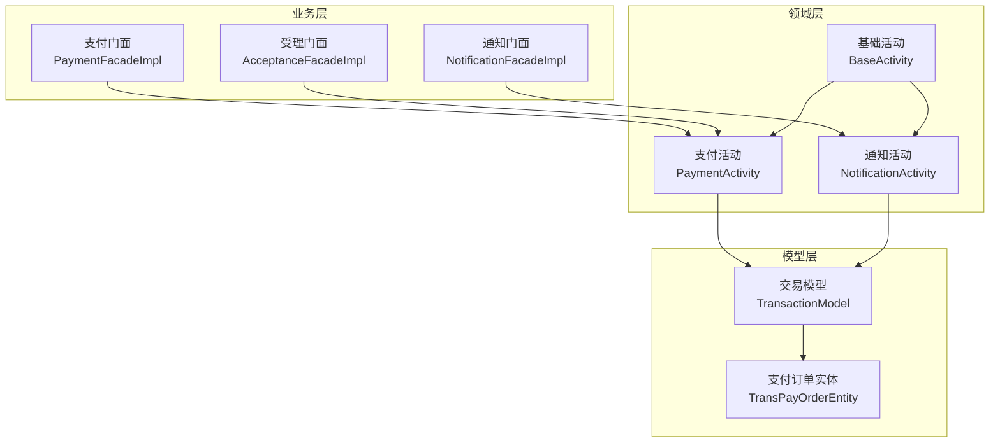
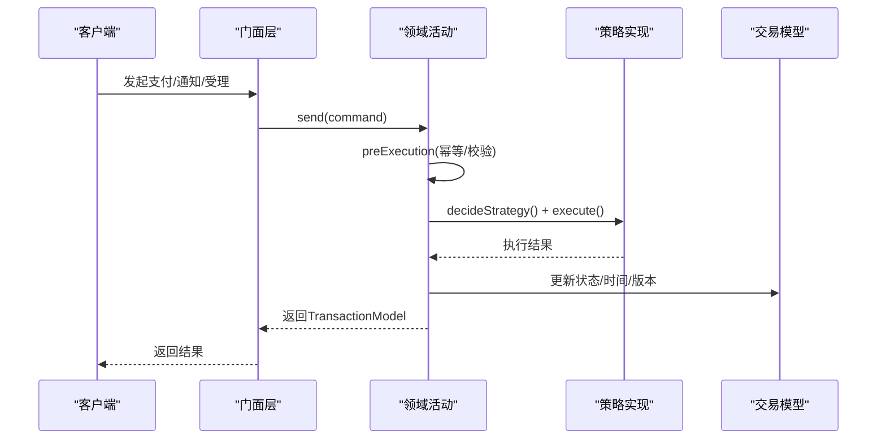
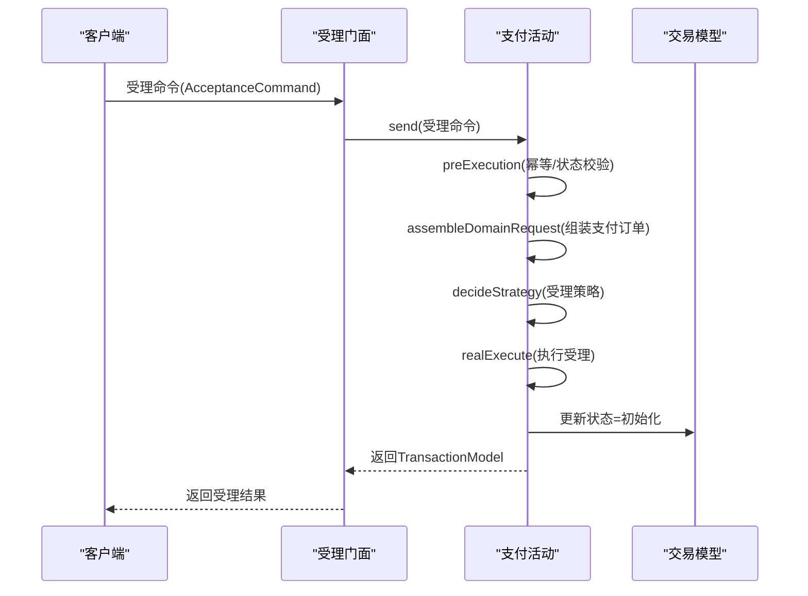
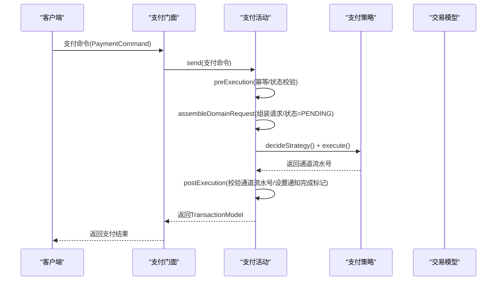
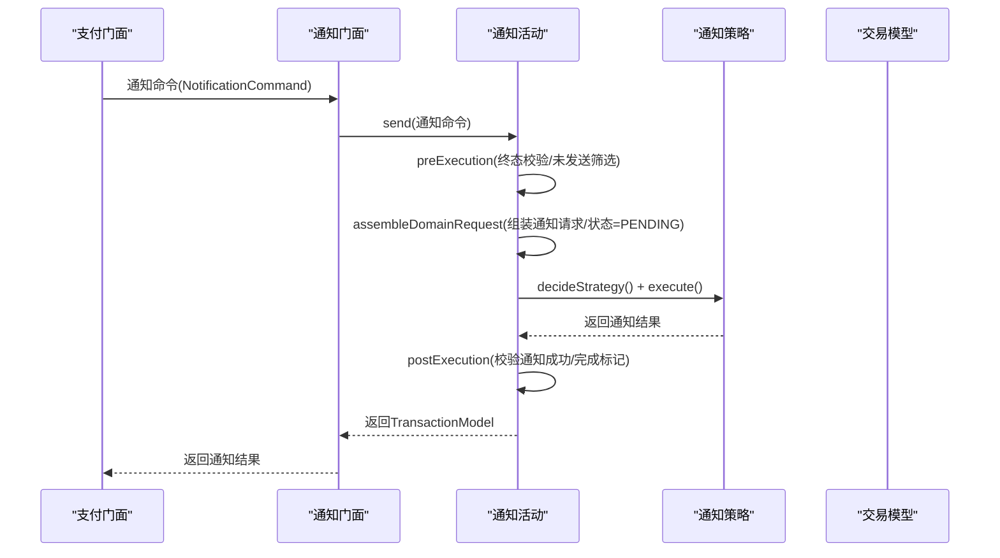
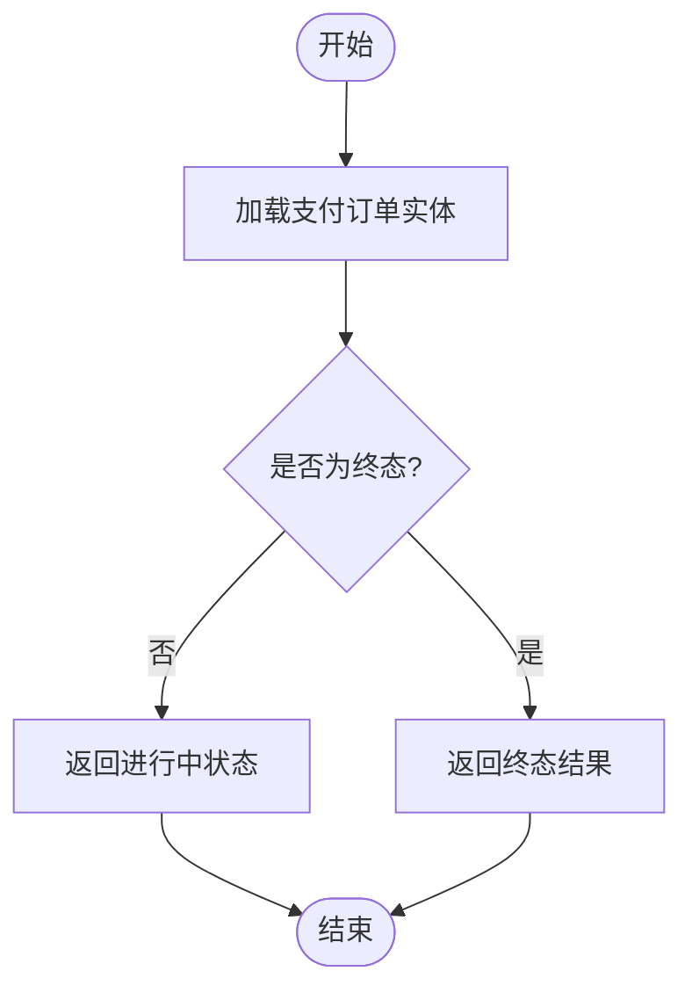
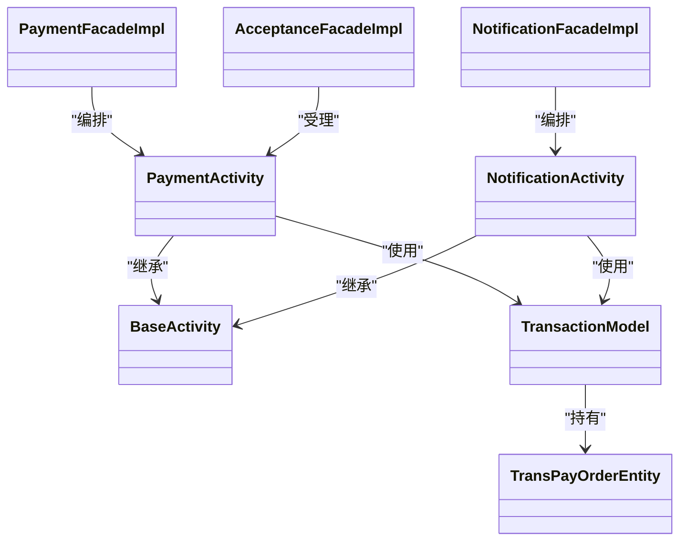

# 核心业务功能

<cite>
**本文引用的文件**
- [IPaymentFacade.java](file://biz-service-impl/src/main/java/com/magicliang/transaction/sys/biz/service/impl/facade/IPaymentFacade.java)
- [PaymentFacadeImpl.java](file://biz-service-impl/src/main/java/com/magicliang/transaction/sys/biz/service/impl/facade/impl/PaymentFacadeImpl.java)
- [INotificationFacade.java](file://biz-service-impl/src/main/java/com/magicliang/transaction/sys/biz/service/impl/facade/INotificationFacade.java)
- [NotificationFacadeImpl.java](file://biz-service-impl/src/main/java/com/magicliang/transaction/sys/biz/service/impl/facade/impl/NotificationFacadeImpl.java)
- [IAcceptanceFacade.java](file://biz-service-impl/src/main/java/com/magicliang/transaction/sys/biz/service/impl/facade/IAcceptanceFacade.java)
- [AcceptanceFacadeImpl.java](file://biz-service-impl/src/main/java/com/magicliang/transaction/sys/biz/service/impl/facade/impl/AcceptanceFacadeImpl.java)
- [BaseActivity.java](file://core-service/src/main/java/com/magicliang/transaction/sys/core/domain/activity/BaseActivity.java)
- [PaymentActivity.java](file://core-service/src/main/java/com/magicliang/transaction/sys/core/domain/activity/payment/PaymentActivity.java)
- [NotificationActivity.java](file://core-service/src/main/java/com/magicliang/transaction/sys/core/domain/activity/notification/NotificationActivity.java)
- [TransPayOrderEntity.java](file://core-model/src/main/java/com/magicliang/transaction/sys/core/model/entity/TransPayOrderEntity.java)
- [TransactionModel.java](file://core-model/src/main/java/com/magicliang/transaction/sys/core/model/context/TransactionModel.java)
- [TransPayOrderStatusEnum.java](file://common-util/src/main/java/com/magicliang/transaction/sys/common/enums/TransPayOrderStatusEnum.java)
- [PaymentCommand.java](file://biz-shared/src/main/java/com/magicliang/transaction/sys/biz/shared/request/payment/PaymentCommand.java)
- [NotificationCommand.java](file://biz-shared/src/main/java/com/magicliang/transaction/sys/biz/shared/request/notification/NotificationCommand.java)
- [AcceptanceCommand.java](file://biz-shared/src/main/java/com/magicliang/transaction/sys/biz/shared/request/acceptance/AcceptanceCommand.java)
</cite>

## 目录
1. [简介](#简介)
2. [项目结构](#项目结构)
3. [核心组件](#核心组件)
4. [架构总览](#架构总览)
5. [详细组件分析](#详细组件分析)
6. [依赖分析](#依赖分析)
7. [性能考虑](#性能考虑)
8. [故障排查指南](#故障排查指南)
9. [结论](#结论)
10. [附录](#附录)

## 简介
本文件面向领域驱动交易系统的核心业务功能，围绕“支付受理”、“支付执行”、“通知处理”、“状态查询”四大能力，提供从架构到实现细节、从流程图到API说明的完整文档。重点覆盖：
- 订单创建与受理流程、参数校验、幂等性处理与状态转换机制
- 支付执行策略选择、第三方渠道集成与状态跟踪
- 通知接收、签名验证、重试机制与状态更新
- 订单状态查询、支付进度跟踪与异常状态处理
- 每个功能的完整API定义（请求参数、响应格式、错误码）
- 实际使用示例与集成指南

## 项目结构
系统采用分层+领域驱动的组织方式：
- biz-service-impl：业务门面与Web适配层，负责对外暴露能力、编排与并发控制
- biz-shared：跨模块共享的请求/查询模型与转换器
- core-service：领域活动与策略层，承载核心业务规则与状态机
- core-model：领域模型与上下文，承载实体、事件、请求/响应模型
- common-*：公共枚举、常量、工具与异常定义
- common-dal：数据访问层（MyBatis PO/Mapper）

图表来源
- [PaymentFacadeImpl.java:1-166](file://biz-service-impl/src/main/java/com/magicliang/transaction/sys/biz/service/impl/facade/impl/PaymentFacadeImpl.java#L1-L166)
- [NotificationFacadeImpl.java:1-127](file://biz-service-impl/src/main/java/com/magicliang/transaction/sys/biz/service/impl/facade/impl/NotificationFacadeImpl.java#L1-L127)
- [AcceptanceFacadeImpl.java:1-33](file://biz-service-impl/src/main/java/com/magicliang/transaction/sys/biz/service/impl/facade/impl/AcceptanceFacadeImpl.java#L1-L33)
- [PaymentActivity.java:1-202](file://core-service/src/main/java/com/magicliang/transaction/sys/core/domain/activity/payment/PaymentActivity.java#L1-L202)
- [NotificationActivity.java:1-183](file://core-service/src/main/java/com/magicliang/transaction/sys/core/domain/activity/notification/NotificationActivity.java#L1-L183)
- [BaseActivity.java:1-139](file://core-service/src/main/java/com/magicliang/transaction/sys/core/domain/activity/BaseActivity.java#L1-L139)
- [TransactionModel.java:1-44](file://core-model/src/main/java/com/magicliang/transaction/sys/core/model/context/TransactionModel.java#L1-L44)
- [TransPayOrderEntity.java:1-216](file://core-model/src/main/java/com/magicliang/transaction/sys/core/model/entity/TransPayOrderEntity.java#L1-L216)

章节来源
- [PaymentFacadeImpl.java:1-166](file://biz-service-impl/src/main/java/com/magicliang/transaction/sys/biz/service/impl/facade/impl/PaymentFacadeImpl.java#L1-L166)
- [NotificationFacadeImpl.java:1-127](file://biz-service-impl/src/main/java/com/magicliang/transaction/sys/biz/service/impl/facade/impl/NotificationFacadeImpl.java#L1-L127)
- [AcceptanceFacadeImpl.java:1-33](file://biz-service-impl/src/main/java/com/magicliang/transaction/sys/biz/service/impl/facade/impl/AcceptanceFacadeImpl.java#L1-L33)
- [PaymentActivity.java:1-202](file://core-service/src/main/java/com/magicliang/transaction/sys/core/domain/activity/payment/PaymentActivity.java#L1-L202)
- [NotificationActivity.java:1-183](file://core-service/src/main/java/com/magicliang/transaction/sys/core/domain/activity/notification/NotificationActivity.java#L1-L183)
- [BaseActivity.java:1-139](file://core-service/src/main/java/com/magicliang/transaction/sys/core/domain/activity/BaseActivity.java#L1-L139)
- [TransactionModel.java:1-44](file://core-model/src/main/java/com/magicliang/transaction/sys/core/model/context/TransactionModel.java#L1-L44)
- [TransPayOrderEntity.java:1-216](file://core-model/src/main/java/com/magicliang/transaction/sys/core/model/entity/TransPayOrderEntity.java#L1-L216)

## 核心组件
- 支付门面（IPaymentFacade、PaymentFacadeImpl）：对外提供支付受理、支付执行、异步支付与批量支付能力；内置并发与锁控制，保障批处理稳定性
- 通知门面（INotificationFacade、NotificationFacadeImpl）：对外提供通知受理、通知执行与批量通知能力；内置并发与锁控制，保障通知可靠性
- 受理门面（IAcceptanceFacade、AcceptanceFacadeImpl）：对外提供受理支付订单能力，完成订单创建与参数校验
- 支付活动（PaymentActivity）：封装支付前置校验、幂等判断、状态迁移、请求组装与策略执行
- 通知活动（NotificationActivity）：封装通知前置校验、幂等判断、未发送通知筛选、请求组装与策略执行
- 交易模型（TransactionModel）：承载支付订单、成功标志、幂等标志、错误码与错误信息
- 支付订单实体（TransPayOrderEntity）：聚合根，包含状态、版本、时间戳、扩展信息、子订单与请求集合
- 状态枚举（TransPayOrderStatusEnum）：定义初始化、支付中、成功、失败、关闭、退票等状态及状态迁移规则

章节来源
- [IPaymentFacade.java:1-58](file://biz-service-impl/src/main/java/com/magicliang/transaction/sys/biz/service/impl/facade/IPaymentFacade.java#L1-L58)
- [PaymentFacadeImpl.java:1-166](file://biz-service-impl/src/main/java/com/magicliang/transaction/sys/biz/service/impl/facade/impl/PaymentFacadeImpl.java#L1-L166)
- [INotificationFacade.java:1-43](file://biz-service-impl/src/main/java/com/magicliang/transaction/sys/biz/service/impl/facade/INotificationFacade.java#L1-L43)
- [NotificationFacadeImpl.java:1-127](file://biz-service-impl/src/main/java/com/magicliang/transaction/sys/biz/service/impl/facade/impl/NotificationFacadeImpl.java#L1-L127)
- [IAcceptanceFacade.java:1-25](file://biz-service-impl/src/main/java/com/magicliang/transaction/sys/biz/service/impl/facade/IAcceptanceFacade.java#L1-L25)
- [AcceptanceFacadeImpl.java:1-33](file://biz-service-impl/src/main/java/com/magicliang/transaction/sys/biz/service/impl/facade/impl/AcceptanceFacadeImpl.java#L1-L33)
- [PaymentActivity.java:1-202](file://core-service/src/main/java/com/magicliang/transaction/sys/core/domain/activity/payment/PaymentActivity.java#L1-L202)
- [NotificationActivity.java:1-183](file://core-service/src/main/java/com/magicliang/transaction/sys/core/domain/activity/notification/NotificationActivity.java#L1-L183)
- [TransactionModel.java:1-44](file://core-model/src/main/java/com/magicliang/transaction/sys/core/model/context/TransactionModel.java#L1-L44)
- [TransPayOrderEntity.java:1-216](file://core-model/src/main/java/com/magicliang/transaction/sys/core/model/entity/TransPayOrderEntity.java#L1-L216)
- [TransPayOrderStatusEnum.java:1-205](file://common-util/src/main/java/com/magicliang/transaction/sys/common/enums/TransPayOrderStatusEnum.java#L1-L205)

## 架构总览
系统以“门面-活动-策略-模型”的分层架构实现，门面负责编排与并发控制，活动负责业务规则与状态机，策略负责具体渠道实现，模型承载状态与上下文。

图表来源
- [BaseActivity.java:42-84](file://core-service/src/main/java/com/magicliang/transaction/sys/core/domain/activity/BaseActivity.java#L42-L84)
- [PaymentActivity.java:52-87](file://core-service/src/main/java/com/magicliang/transaction/sys/core/domain/activity/payment/PaymentActivity.java#L52-L87)
- [NotificationActivity.java:55-88](file://core-service/src/main/java/com/magicliang/transaction/sys/core/domain/activity/notification/NotificationActivity.java#L55-L88)

## 详细组件分析

### 支付受理功能（受理门面 + 支付活动）
- 功能概述
  - 接收受理命令，完成参数校验与订单创建
  - 将受理后的订单放入交易上下文，供后续支付活动使用
- 幂等性与状态转换
  - 受理门面直接转发至领域活动，幂等与状态校验在活动层完成
  - 支付订单状态从“初始化”迁移到“支付中”，并记录相关时间戳
- 数据流
  - 输入：受理命令（金额、会计分录、回调地址、扩展信息等）
  - 输出：交易模型（包含支付订单、成功标志、幂等标志）

图表来源
- [AcceptanceFacadeImpl.java:28-31](file://biz-service-impl/src/main/java/com/magicliang/transaction/sys/biz/service/impl/facade/impl/AcceptanceFacadeImpl.java#L28-L31)
- [AcceptanceCommand.java:1-74](file://biz-shared/src/main/java/com/magicliang/transaction/sys/biz/shared/request/acceptance/AcceptanceCommand.java#L1-L74)
- [PaymentActivity.java:95-108](file://core-service/src/main/java/com/magicliang/transaction/sys/core/domain/activity/payment/PaymentActivity.java#L95-L108)

章节来源
- [IAcceptanceFacade.java:15-24](file://biz-service-impl/src/main/java/com/magicliang/transaction/sys/biz/service/impl/facade/IAcceptanceFacade.java#L15-L24)
- [AcceptanceFacadeImpl.java:28-31](file://biz-service-impl/src/main/java/com/magicliang/transaction/sys/biz/service/impl/facade/impl/AcceptanceFacadeImpl.java#L28-L31)
- [AcceptanceCommand.java:1-74](file://biz-shared/src/main/java/com/magicliang/transaction/sys/biz/shared/request/acceptance/AcceptanceCommand.java#L1-L74)
- [PaymentActivity.java:95-108](file://core-service/src/main/java/com/magicliang/transaction/sys/core/domain/activity/payment/PaymentActivity.java#L95-L108)

### 支付执行功能（支付门面 + 支付活动 + 策略）
- 功能概述
  - 支付门面支持单笔、批量、异步三种支付入口
  - 支付活动负责幂等校验、状态迁移、请求组装与策略执行
  - 策略层根据决策结果选择具体支付渠道（如支付宝余额）
- 幂等性与状态转换
  - 若支付订单或支付请求已处于终态，活动直接返回成功
  - 支付开始前将状态迁移到“支付中”，并更新时间戳与重试次数
- 第三方渠道集成
  - 通过策略枚举与策略集合实现扩展，当前默认策略为“支付宝余额”
- 状态跟踪
  - 支付完成后，若订单未达终态，则通知活动不会立即触发

图表来源
- [IPaymentFacade.java:18-57](file://biz-service-impl/src/main/java/com/magicliang/transaction/sys/biz/service/impl/facade/IPaymentFacade.java#L18-L57)
- [PaymentFacadeImpl.java:115-147](file://biz-service-impl/src/main/java/com/magicliang/transaction/sys/biz/service/impl/facade/impl/PaymentFacadeImpl.java#L115-L147)
- [PaymentActivity.java:52-87](file://core-service/src/main/java/com/magicliang/transaction/sys/core/domain/activity/payment/PaymentActivity.java#L52-L87)
- [PaymentActivity.java:150-169](file://core-service/src/main/java/com/magicliang/transaction/sys/core/domain/activity/payment/PaymentActivity.java#L150-L169)

章节来源
- [IPaymentFacade.java:18-57](file://biz-service-impl/src/main/java/com/magicliang/transaction/sys/biz/service/impl/facade/IPaymentFacade.java#L18-L57)
- [PaymentFacadeImpl.java:66-93](file://biz-service-impl/src/main/java/com/magicliang/transaction/sys/biz/service/impl/facade/impl/PaymentFacadeImpl.java#L66-L93)
- [PaymentFacadeImpl.java:100-107](file://biz-service-impl/src/main/java/com/magicliang/transaction/sys/biz/service/impl/facade/impl/PaymentFacadeImpl.java#L100-L107)
- [PaymentFacadeImpl.java:115-147](file://biz-service-impl/src/main/java/com/magicliang/transaction/sys/biz/service/impl/facade/impl/PaymentFacadeImpl.java#L115-L147)
- [PaymentActivity.java:52-87](file://core-service/src/main/java/com/magicliang/transaction/sys/core/domain/activity/payment/PaymentActivity.java#L52-L87)
- [PaymentActivity.java:150-169](file://core-service/src/main/java/com/magicliang/transaction/sys/core/domain/activity/payment/PaymentActivity.java#L150-L169)

### 通知处理功能（通知门面 + 通知活动 + 策略）
- 功能概述
  - 通知门面支持单笔、批量通知与异步通知
  - 通知活动仅处理“终态”支付订单的未发送通知，具备幂等保护
  - 策略层默认使用RPC策略向下游通知
- 幂等性与状态转换
  - 若支付订单未达终态或已无未发送通知，活动直接返回成功
  - 通知开始前将未发送通知的状态迁移到“支付中”，并更新时间戳与重试次数
- 重试机制
  - 通知请求的重试次数在每次执行前递增，便于追踪与限流

图表来源
- [INotificationFacade.java:18-42](file://biz-service-impl/src/main/java/com/magicliang/transaction/sys/biz/service/impl/facade/INotificationFacade.java#L18-L42)
- [NotificationFacadeImpl.java:107-110](file://biz-service-impl/src/main/java/com/magicliang/transaction/sys/biz/service/impl/facade/impl/NotificationFacadeImpl.java#L107-L110)
- [NotificationActivity.java:55-88](file://core-service/src/main/java/com/magicliang/transaction/sys/core/domain/activity/notification/NotificationActivity.java#L55-L88)
- [NotificationActivity.java:171-181](file://core-service/src/main/java/com/magicliang/transaction/sys/core/domain/activity/notification/NotificationActivity.java#L171-L181)

章节来源
- [INotificationFacade.java:18-42](file://biz-service-impl/src/main/java/com/magicliang/transaction/sys/biz/service/impl/facade/INotificationFacade.java#L18-L42)
- [NotificationFacadeImpl.java:57-85](file://biz-service-impl/src/main/java/com/magicliang/transaction/sys/biz/service/impl/facade/impl/NotificationFacadeImpl.java#L57-L85)
- [NotificationFacadeImpl.java:107-110](file://biz-service-impl/src/main/java/com/magicliang/transaction/sys/biz/service/impl/facade/impl/NotificationFacadeImpl.java#L107-L110)
- [NotificationActivity.java:55-88](file://core-service/src/main/java/com/magicliang/transaction/sys/core/domain/activity/notification/NotificationActivity.java#L55-L88)
- [NotificationActivity.java:171-181](file://core-service/src/main/java/com/magicliang/transaction/sys/core/domain/activity/notification/NotificationActivity.java#L171-L181)

### 状态查询功能（订单状态查询与进度跟踪）
- 功能概述
  - 通过支付订单实体的状态字段与时间戳，实现订单状态查询与进度跟踪
  - 终态判定与异常状态处理由状态枚举统一管理
- 状态定义与迁移
  - 支付订单状态包括：初始化、支付中、成功、失败、关闭、退票
  - 状态迁移严格受控，避免非法跃迁
- 异常状态处理
  - 失败、关闭、退票等非成功终态需单独处理，不可再次重试

图表来源
- [TransPayOrderEntity.java:196-204](file://core-model/src/main/java/com/magicliang/transaction/sys/core/model/entity/TransPayOrderEntity.java#L196-L204)
- [TransPayOrderStatusEnum.java:132-156](file://common-util/src/main/java/com/magicliang/transaction/sys/common/enums/TransPayOrderStatusEnum.java#L132-L156)

章节来源
- [TransPayOrderEntity.java:196-204](file://core-model/src/main/java/com/magicliang/transaction/sys/core/model/entity/TransPayOrderEntity.java#L196-L204)
- [TransPayOrderStatusEnum.java:132-156](file://common-util/src/main/java/com/magicliang/transaction/sys/common/enums/TransPayOrderStatusEnum.java#L132-L156)

## 依赖分析
- 门面与活动解耦：门面仅负责编排与并发，核心业务规则集中在活动层
- 活动与策略解耦：活动通过策略枚举与集合实现扩展，便于新增渠道
- 模型与上下文：交易模型承载状态与结果，活动通过上下文传递与更新

图表来源
- [PaymentFacadeImpl.java:34](file://biz-service-impl/src/main/java/com/magicliang/transaction/sys/biz/service/impl/facade/impl/PaymentFacadeImpl.java#L34)
- [NotificationFacadeImpl.java:31](file://biz-service-impl/src/main/java/com/magicliang/transaction/sys/biz/service/impl/facade/impl/NotificationFacadeImpl.java#L31)
- [AcceptanceFacadeImpl.java:20](file://biz-service-impl/src/main/java/com/magicliang/transaction/sys/biz/service/impl/facade/impl/AcceptanceFacadeImpl.java#L20)
- [PaymentActivity.java:38](file://core-service/src/main/java/com/magicliang/transaction/sys/core/domain/activity/payment/PaymentActivity.java#L38)
- [NotificationActivity.java:41](file://core-service/src/main/java/com/magicliang/transaction/sys/core/domain/activity/notification/NotificationActivity.java#L41)
- [BaseActivity.java:28](file://core-service/src/main/java/com/magicliang/transaction/sys/core/domain/activity/BaseActivity.java#L28)
- [TransactionModel.java:16-44](file://core-model/src/main/java/com/magicliang/transaction/sys/core/model/context/TransactionModel.java#L16-L44)
- [TransPayOrderEntity.java:32](file://core-model/src/main/java/com/magicliang/transaction/sys/core/model/entity/TransPayOrderEntity.java#L32)

章节来源
- [PaymentFacadeImpl.java:34](file://biz-service-impl/src/main/java/com/magicliang/transaction/sys/biz/service/impl/facade/impl/PaymentFacadeImpl.java#L34)
- [NotificationFacadeImpl.java:31](file://biz-service-impl/src/main/java/com/magicliang/transaction/sys/biz/service/impl/facade/impl/NotificationFacadeImpl.java#L31)
- [AcceptanceFacadeImpl.java:20](file://biz-service-impl/src/main/java/com/magicliang/transaction/sys/biz/service/impl/facade/impl/AcceptanceFacadeImpl.java#L20)
- [PaymentActivity.java:38](file://core-service/src/main/java/com/magicliang/transaction/sys/core/domain/activity/payment/PaymentActivity.java#L38)
- [NotificationActivity.java:41](file://core-service/src/main/java/com/magicliang/transaction/sys/core/domain/activity/notification/NotificationActivity.java#L41)
- [BaseActivity.java:28](file://core-service/src/main/java/com/magicliang/transaction/sys/core/domain/activity/BaseActivity.java#L28)
- [TransactionModel.java:16-44](file://core-model/src/main/java/com/magicliang/transaction/sys/core/model/context/TransactionModel.java#L16-L44)
- [TransPayOrderEntity.java:32](file://core-model/src/main/java/com/magicliang/transaction/sys/core/model/entity/TransPayOrderEntity.java#L32)

## 性能考虑
- 批处理吞吐估算
  - 支付：单线程每秒约7笔，线程池大小为300
  - 通知：单线程每秒约10次，线程池大小为100
- 锁与弹性超时
  - 批处理前根据待处理数量与线程数估算锁超时，避免长时间阻塞
- 并发与队列
  - 使用线程池将任务拆分为可执行单元，提升整体吞吐
- I/O与数据库
  - 写库耗时约40ms/笔，需结合TP99与队列容量做容量规划

章节来源
- [PaymentFacadeImpl.java:36-44](file://biz-service-impl/src/main/java/com/magicliang/transaction/sys/biz/service/impl/facade/impl/PaymentFacadeImpl.java#L36-L44)
- [NotificationFacadeImpl.java:33-41](file://biz-service-impl/src/main/java/com/magicliang/transaction/sys/biz/service/impl/facade/impl/NotificationFacadeImpl.java#L33-L41)
- [PaymentFacadeImpl.java:72-78](file://biz-service-impl/src/main/java/com/magicliang/transaction/sys/biz/service/impl/facade/impl/PaymentFacadeImpl.java#L72-L78)
- [NotificationFacadeImpl.java:64-66](file://biz-service-impl/src/main/java/com/magicliang/transaction/sys/biz/service/impl/facade/impl/NotificationFacadeImpl.java#L64-L66)

## 故障排查指南
- 支付失败与状态异常
  - 检查支付订单状态是否为终态，非成功终态不可再次支付
  - 核对通道流水号是否为空，活动后置校验会保证其存在
- 通知失败
  - 确认支付订单是否为终态且存在未发送通知
  - 查看通知请求重试次数与时间戳，定位重试瓶颈
- 参数校验与幂等
  - 受理与支付活动均包含前置校验，失败时返回对应错误码
  - 若重复提交，活动会识别终态并直接返回成功（幂等）

章节来源
- [TransPayOrderStatusEnum.java:174-203](file://common-util/src/main/java/com/magicliang/transaction/sys/common/enums/TransPayOrderStatusEnum.java#L174-L203)
- [PaymentActivity.java:150-169](file://core-service/src/main/java/com/magicliang/transaction/sys/core/domain/activity/payment/PaymentActivity.java#L150-L169)
- [NotificationActivity.java:171-181](file://core-service/src/main/java/com/magicliang/transaction/sys/core/domain/activity/notification/NotificationActivity.java#L171-L181)

## 结论
该系统通过门面-活动-策略-模型的清晰分层，实现了高内聚、低耦合的核心业务能力。支付受理、支付执行、通知处理与状态查询均具备完善的幂等性、状态机与扩展点，适合在高并发与多渠道场景下稳定运行。建议在生产环境结合容量评估与监控告警，持续优化批处理与重试策略。

## 附录

### API 文档

#### 受理接口
- 接口名称：受理支付订单
- 请求方法：POST
- 路径：/api/acceptance
- 请求头：Content-Type: application/json
- 请求体字段
  - money: 数字，单位分，必填
  - accountingEntry: 枚举（借/贷），必填
  - notifyUri: 字符串，回调地址，必填
  - memo: 字符串，备注，选填
  - businessEntity: 字符串，支付主体，选填
  - extendInfo: 对象，平台扩展信息，选填
  - bizInfo: 对象，业务透传信息，选填
- 响应体字段
  - success: 布尔，受理是否成功
  - idempotent: 布尔，是否幂等
  - errorCode: 字符串，错误码
  - errorMsg: 字符串，错误信息
  - payOrder: 支付订单实体（包含状态、时间戳、扩展信息等）
- 错误码
  - 参数缺失或非法：INVALID_ACCEPTANCE_PARAM_ERROR
  - 订单状态非法：INVALID_PAY_ORDER_STATUS_ERROR

章节来源
- [AcceptanceCommand.java:24-60](file://biz-shared/src/main/java/com/magicliang/transaction/sys/biz/shared/request/acceptance/AcceptanceCommand.java#L24-L60)
- [AcceptanceFacadeImpl.java:28-31](file://biz-service-impl/src/main/java/com/magicliang/transaction/sys/biz/service/impl/facade/impl/AcceptanceFacadeImpl.java#L28-L31)
- [TransactionModel.java:16-44](file://core-model/src/main/java/com/magicliang/transaction/sys/core/model/context/TransactionModel.java#L16-L44)

#### 支付接口
- 接口名称：支付执行
- 请求方法：POST
- 路径：/api/payment
- 请求头：Content-Type: application/json
- 请求体字段
  - payOrderNo: 数字，支付订单号，二选一
  - payOrder: 支付订单实体，二选一
  - 其他：由命令转换器处理
- 响应体字段
  - success: 布尔，支付是否成功
  - idempotent: 布尔，是否幂等
  - errorCode: 字符串，错误码
  - errorMsg: 字符串，错误信息
  - payOrder: 支付订单实体（包含状态、时间戳、扩展信息等）
- 错误码
  - 订单不存在：INVALID_PAY_ORDER_ERROR
  - 支付请求非法：INVALID_PAYMENT_REQUEST_ERROR
  - 支付策略非法：INVALID_PAYMENT_STRATEGY_ERROR
  - 通道流水号非法：INVALID_CHANNEL_PAYMENT_TRACE_NO_ERROR

章节来源
- [PaymentCommand.java:22-41](file://biz-shared/src/main/java/com/magicliang/transaction/sys/biz/shared/request/payment/PaymentCommand.java#L22-L41)
- [IPaymentFacade.java:41-49](file://biz-service-impl/src/main/java/com/magicliang/transaction/sys/biz/service/impl/facade/IPaymentFacade.java#L41-L49)
- [PaymentActivity.java:52-87](file://core-service/src/main/java/com/magicliang/transaction/sys/core/domain/activity/payment/PaymentActivity.java#L52-L87)

#### 通知接口
- 接口名称：通知执行
- 请求方法：POST
- 路径：/api/notification
- 请求头：Content-Type: application/json
- 请求体字段
  - payOrderNo: 数字，支付订单号，二选一
  - payOrder: 支付订单实体，二选一
- 响应体字段
  - success: 布尔，通知是否成功
  - idempotent: 布尔，是否幂等
  - errorCode: 字符串，错误码
  - errorMsg: 字符串，错误信息
  - payOrder: 支付订单实体（包含状态、时间戳、扩展信息等）
- 错误码
  - 订单状态非法：INVALID_PAY_ORDER_ERROR
  - 通知请求非法：INVALID_NOTIFICATION_REQUEST_ERROR
  - 通知失败：NOTIFICATION_FAILURE_ERROR

章节来源
- [NotificationCommand.java:22-41](file://biz-shared/src/main/java/com/magicliang/transaction/sys/biz/shared/request/notification/NotificationCommand.java#L22-L41)
- [INotificationFacade.java:41](file://biz-service-impl/src/main/java/com/magicliang/transaction/sys/biz/service/impl/facade/INotificationFacade.java#L41)
- [NotificationActivity.java:55-88](file://core-service/src/main/java/com/magicliang/transaction/sys/core/domain/activity/notification/NotificationActivity.java#L55-L88)

#### 状态查询接口
- 接口名称：订单状态查询
- 请求方法：GET
- 路径：/api/query/status/{payOrderNo}
- 请求头：Content-Type: application/json
- 响应体字段
  - status: 枚举（初始化/支付中/成功/失败/关闭/退票）
  - gmtAcceptedTime/gmtPaymentBeginTime/gmtPaymentSuccessTime/gmtPaymentFailureTime/gmtPaymentClosedTime/gmtPaymentBouncedTime: 时间戳
  - version: 数字，版本号
  - errorCode/errorMsg: 字段（若异常）
- 错误码
  - 订单不存在：INVALID_PAY_ORDER_ERROR
  - 状态非法：INVALID_PAY_ORDER_STATUS_ERROR

章节来源
- [TransPayOrderEntity.java:113-118](file://core-model/src/main/java/com/magicliang/transaction/sys/core/model/entity/TransPayOrderEntity.java#L113-L118)
- [TransPayOrderStatusEnum.java:132-156](file://common-util/src/main/java/com/magicliang/transaction/sys/common/enums/TransPayOrderStatusEnum.java#L132-L156)

### 使用示例与集成指南
- 受理与支付
  - 步骤：先受理（生成初始化订单），再支付（迁移到支付中并执行策略），最后通知（若订单达终态）
  - 幂等：重复提交受理或支付在终态下会直接返回成功
- 批量处理
  - 使用门面提供的批量方法，自动估算锁超时与批大小，避免长时间阻塞
- 通知集成
  - 默认使用RPC策略通知下游，确保回调地址可用并支持幂等消费
- 监控与告警
  - 关注通道流水号、重试次数、终态分布与异常错误码，及时发现与处置

章节来源
- [PaymentFacadeImpl.java:66-93](file://biz-service-impl/src/main/java/com/magicliang/transaction/sys/biz/service/impl/facade/impl/PaymentFacadeImpl.java#L66-L93)
- [NotificationFacadeImpl.java:57-85](file://biz-service-impl/src/main/java/com/magicliang/transaction/sys/biz/service/impl/facade/impl/NotificationFacadeImpl.java#L57-L85)
- [PaymentActivity.java:150-169](file://core-service/src/main/java/com/magicliang/transaction/sys/core/domain/activity/payment/PaymentActivity.java#L150-L169)
- [NotificationActivity.java:171-181](file://core-service/src/main/java/com/magicliang/transaction/sys/core/domain/activity/notification/NotificationActivity.java#L171-L181)