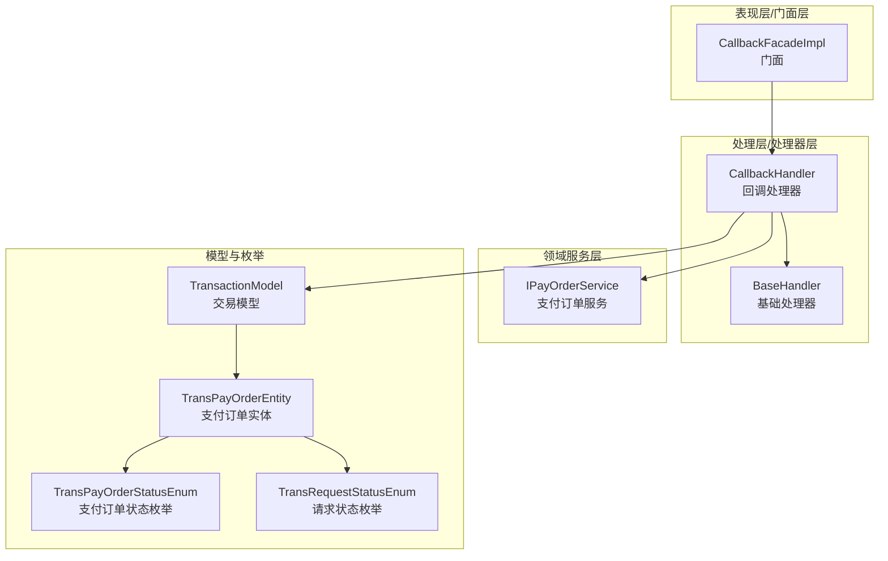
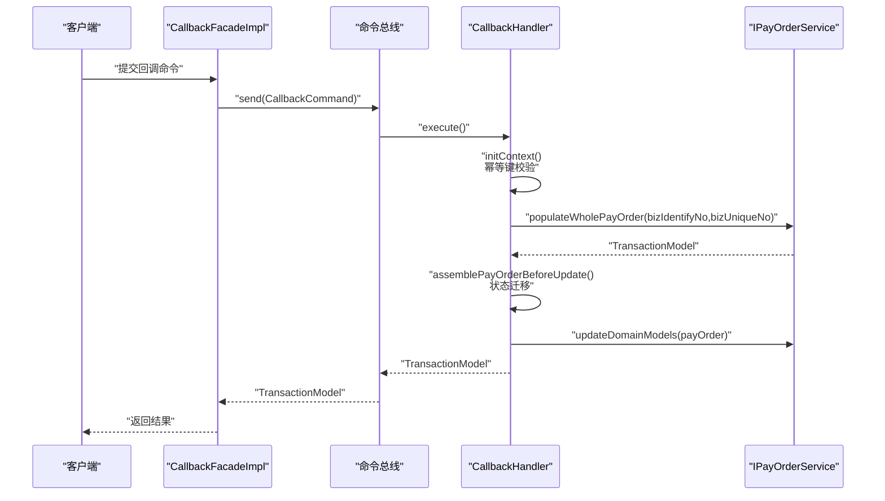
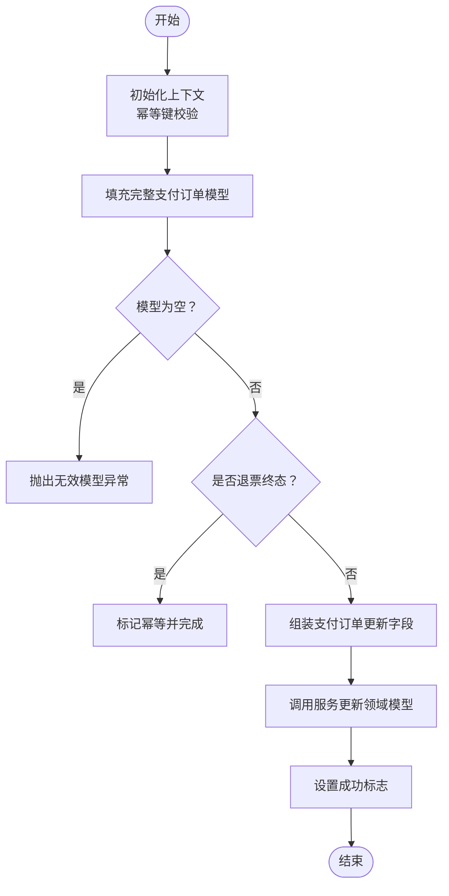
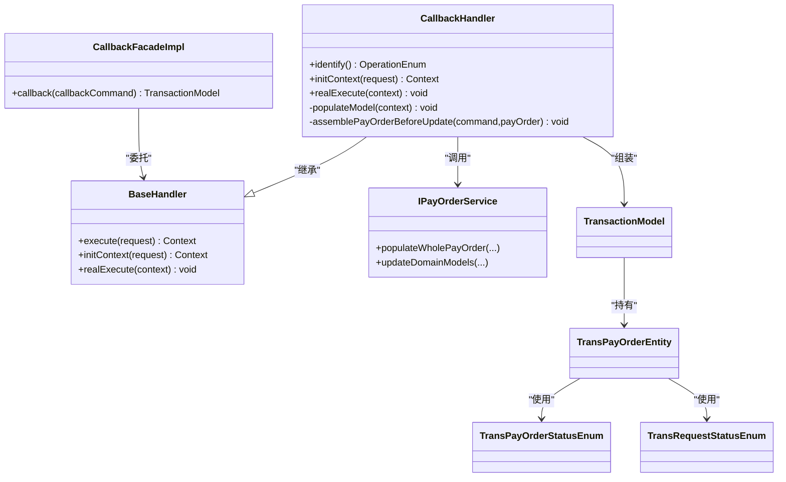

# 状态查询功能

<cite>
**本文引用的文件**
- [CallbackFacadeImpl.java](file://biz-service-impl/src/main/java/com/magicliang/transaction/sys/biz/service/impl/facade/impl/CallbackFacadeImpl.java)
- [CallbackHandler.java](file://biz-shared/src/main/java/com/magicliang/transaction/sys/biz/shared/handler/CallbackHandler.java)
- [CallbackCommand.java](file://biz-shared/src/main/java/com/magicliang/transaction/sys/biz/shared/request/callback/CallbackCommand.java)
- [UnPaidOrderQuery.java](file://biz-shared/src/main/java/com/magicliang/transaction/sys/biz/shared/request/payment/UnPaidOrderQuery.java)
- [UnSentNotificationQuery.java](file://biz-shared/src/main/java/com/magicliang/transaction/sys/biz/shared/request/notification/UnSentNotificationQuery.java)
- [AbstractFacade.java](file://biz-service-impl/src/main/java/com/magicliang/transaction/sys/biz/service/impl/facade/impl/AbstractFacade.java)
- [BaseHandler.java](file://biz-shared/src/main/java/com/magicliang/transaction/sys/biz/shared/handler/BaseHandler.java)
- [IPayOrderService.java](file://core-service/src/main/java/com/magicliang/transaction/sys/core/service/IPayOrderService.java)
- [TransPayOrderStatusEnum.java](file://common-util/src/main/java/com/magicliang/transaction/sys/common/enums/TransPayOrderStatusEnum.java)
- [TransRequestStatusEnum.java](file://common-util/src/main/java/com/magicliang/transaction/sys/common/enums/TransRequestStatusEnum.java)
- [TransPayOrderEntity.java](file://core-model/src/main/java/com/magicliang/transaction/sys/core/model/entity/TransPayOrderEntity.java)
- [TransactionModel.java](file://core-model/src/main/java/com/magicliang/transaction/sys/core/model/context/TransactionModel.java)
- [HandlerRequest.java](file://biz-shared/src/main/java/com/magicliang/transaction/sys/biz/shared/request/HandlerRequest.java)
- [HandlerQuery.java](file://biz-shared/src/main/java/com/magicliang/transaction/sys/biz/shared/request/HandlerQuery.java)
- [TestController.java](file://biz-service-impl/src/main/java/com/magicliang/transaction/sys/biz/service/impl/web/controller/TestController.java)
</cite>

## 目录
1. [简介](#简介)
2. [项目结构](#项目结构)
3. [核心组件](#核心组件)
4. [架构总览](#架构总览)
5. [详细组件分析](#详细组件分析)
6. [依赖关系分析](#依赖关系分析)
7. [性能考量](#性能考量)
8. [故障排查指南](#故障排查指南)
9. [结论](#结论)
10. [附录](#附录)

## 简介
本文件围绕“状态查询功能”展开，重点覆盖以下方面：
- 订单状态查询、支付进度跟踪与异常状态处理的完整业务流程
- CallbackFacadeImpl 门面如何接收并转发状态查询请求
- CallbackHandler 处理器的业务逻辑：查询条件构建、数据过滤与结果组装
- 不同查询类型的实现差异：订单状态查询、支付进度查询、异常状态查询
- 完整的 API 接口文档与使用示例
- 性能优化建议与最佳实践

## 项目结构
状态查询功能涉及三层：
- 表现层/门面层：负责接收外部请求并委派给处理层
- 处理层/处理器层：封装业务逻辑、幂等控制、状态迁移与结果组装
- 领域服务层：提供订单与请求的查询、计数与更新能力

图表来源
- [CallbackFacadeImpl.java:1-34](file://biz-service-impl/src/main/java/com/magicliang/transaction/sys/biz/service/impl/facade/impl/CallbackFacadeImpl.java#L1-L34)
- [BaseHandler.java:1-244](file://biz-shared/src/main/java/com/magicliang/transaction/sys/biz/shared/handler/BaseHandler.java#L1-L244)
- [CallbackHandler.java:1-190](file://biz-shared/src/main/java/com/magicliang/transaction/sys/biz/shared/handler/CallbackHandler.java#L1-L190)
- [IPayOrderService.java:1-158](file://core-service/src/main/java/com/magicliang/transaction/sys/core/service/IPayOrderService.java#L1-L158)
- [TransactionModel.java:1-44](file://core-model/src/main/java/com/magicliang/transaction/sys/core/model/context/TransactionModel.java#L1-L44)
- [TransPayOrderEntity.java:1-216](file://core-model/src/main/java/com/magicliang/transaction/sys/core/model/entity/TransPayOrderEntity.java#L1-L216)
- [TransPayOrderStatusEnum.java:1-205](file://common-util/src/main/java/com/magicliang/transaction/sys/common/enums/TransPayOrderStatusEnum.java#L1-L205)
- [TransRequestStatusEnum.java:1-163](file://common-util/src/main/java/com/magicliang/transaction/sys/common/enums/TransRequestStatusEnum.java#L1-L163)

章节来源
- [CallbackFacadeImpl.java:1-34](file://biz-service-impl/src/main/java/com/magicliang/transaction/sys/biz/service/impl/facade/impl/CallbackFacadeImpl.java#L1-L34)
- [BaseHandler.java:1-244](file://biz-shared/src/main/java/com/magicliang/transaction/sys/biz/shared/handler/BaseHandler.java#L1-L244)
- [CallbackHandler.java:1-190](file://biz-shared/src/main/java/com/magicliang/transaction/sys/biz/shared/handler/CallbackHandler.java#L1-L190)
- [IPayOrderService.java:1-158](file://core-service/src/main/java/com/magicliang/transaction/sys/core/service/IPayOrderService.java#L1-L158)
- [TransactionModel.java:1-44](file://core-model/src/main/java/com/magicliang/transaction/sys/core/model/context/TransactionModel.java#L1-L44)
- [TransPayOrderEntity.java:1-216](file://core-model/src/main/java/com/magicliang/transaction/sys/core/model/entity/TransPayOrderEntity.java#L1-L216)
- [TransPayOrderStatusEnum.java:1-205](file://common-util/src/main/java/com/magicliang/transaction/sys/common/enums/TransPayOrderStatusEnum.java#L1-L205)
- [TransRequestStatusEnum.java:1-163](file://common-util/src/main/java/com/magicliang/transaction/sys/common/enums/TransRequestStatusEnum.java#L1-L163)

## 核心组件
- CallbackFacadeImpl：门面层入口，将回调命令通过命令总线转发至处理器
- CallbackHandler：回调处理器，负责幂等校验、模型填充、状态迁移与结果组装
- BaseHandler：基础处理器，统一执行流程、分布式锁与上下文管理
- IPayOrderService：领域服务，提供订单与请求的查询、计数与更新能力
- TransactionModel/TransPayOrderEntity：交易模型与支付订单实体，承载状态与时间戳
- TransPayOrderStatusEnum/TransRequestStatusEnum：状态枚举，定义状态机与迁移规则

章节来源
- [CallbackFacadeImpl.java:18-33](file://biz-service-impl/src/main/java/com/magicliang/transaction/sys/biz/service/impl/facade/impl/CallbackFacadeImpl.java#L18-L33)
- [CallbackHandler.java:32-189](file://biz-shared/src/main/java/com/magicliang/transaction/sys/biz/shared/handler/CallbackHandler.java#L32-L189)
- [BaseHandler.java:93-121](file://biz-shared/src/main/java/com/magicliang/transaction/sys/biz/shared/handler/BaseHandler.java#L93-L121)
- [IPayOrderService.java:24-156](file://core-service/src/main/java/com/magicliang/transaction/sys/core/service/IPayOrderService.java#L24-L156)
- [TransactionModel.java:17-43](file://core-model/src/main/java/com/magicliang/transaction/sys/core/model/context/TransactionModel.java#L17-L43)
- [TransPayOrderEntity.java:32-215](file://core-model/src/main/java/com/magicliang/transaction/sys/core/model/entity/TransPayOrderEntity.java#L32-L215)
- [TransPayOrderStatusEnum.java:26-204](file://common-util/src/main/java/com/magicliang/transaction/sys/common/enums/TransPayOrderStatusEnum.java#L26-L204)
- [TransRequestStatusEnum.java:27-162](file://common-util/src/main/java/com/magicliang/transaction/sys/common/enums/TransRequestStatusEnum.java#L27-L162)

## 架构总览
状态查询功能采用“门面-处理器-服务-模型”的分层架构，结合分布式锁保证幂等性与一致性。

图表来源
- [CallbackFacadeImpl.java:28-31](file://biz-service-impl/src/main/java/com/magicliang/transaction/sys/biz/service/impl/facade/impl/CallbackFacadeImpl.java#L28-L31)
- [CallbackHandler.java:50-127](file://biz-shared/src/main/java/com/magicliang/transaction/sys/biz/shared/handler/CallbackHandler.java#L50-L127)
- [IPayOrderService.java:34-126](file://core-service/src/main/java/com/magicliang/transaction/sys/core/service/IPayOrderService.java#L34-L126)

## 详细组件分析

### CallbackFacadeImpl 门面实现
- 角色定位：接收外部回调命令，通过命令总线转发给对应处理器
- 关键点：
  - 使用命令总线 send 将 CallbackCommand 发送出去
  - 返回 TransactionModel 作为处理结果
- 适用场景：订单状态查询、支付进度跟踪、异常状态处理的统一入口

章节来源
- [CallbackFacadeImpl.java:28-31](file://biz-service-impl/src/main/java/com/magicliang/transaction/sys/biz/service/impl/facade/impl/CallbackFacadeImpl.java#L28-L31)

### CallbackHandler 处理器
- 幂等与上下文：
  - 通过幂等键 bizIdentifyNo + “:” + bizUniqueNo 构建
  - 初始化标准交易上下文，填充领域模型
- 模型填充：
  - 依据业务标识码与业务号填充完整支付订单模型
  - 若模型为空，抛出无效模型异常
- 幂等与退票判定：
  - 若支付订单已是退票终态，标记幂等并直接完成
- 状态迁移与时间戳设置：
  - 成功终态：设置成功时间，覆盖通道支付流水号
  - 失败/关闭/退票终态：设置相应时间戳与错误码
  - 同步支付请求状态：若请求未达终态，按支付订单状态同步为成功或关闭
- 结果组装：
  - 设置 TransactionModel.success 为 true
  - 返回上下文

图表来源
- [CallbackHandler.java:50-127](file://biz-shared/src/main/java/com/magicliang/transaction/sys/biz/shared/handler/CallbackHandler.java#L50-L127)
- [CallbackHandler.java:135-189](file://biz-shared/src/main/java/com/magicliang/transaction/sys/biz/shared/handler/CallbackHandler.java#L135-L189)

章节来源
- [CallbackHandler.java:50-127](file://biz-shared/src/main/java/com/magicliang/transaction/sys/biz/shared/handler/CallbackHandler.java#L50-L127)
- [CallbackHandler.java:135-189](file://biz-shared/src/main/java/com/magicliang/transaction/sys/biz/shared/handler/CallbackHandler.java#L135-L189)

### BaseHandler 基础处理器
- 统一流程：
  - 获取分布式锁，执行 initContext → preExecution → realExecute → postExecution
  - 最终清理上下文并释放锁
- 幂等键：
  - 从 HandlerRequest.getIdempotentKey() 获取
- 通用能力：
  - 提供 populateNecessaryModel 抽象方法，由具体处理器实现
  - 提供 checkIsBounced 与 getErrorMessage 等工具方法

章节来源
- [BaseHandler.java:93-121](file://biz-shared/src/main/java/com/magicliang/transaction/sys/biz/shared/handler/BaseHandler.java#L93-L121)
- [BaseHandler.java:174-179](file://biz-shared/src/main/java/com/magicliang/transaction/sys/biz/shared/handler/BaseHandler.java#L174-L179)
- [HandlerRequest.java:42-44](file://biz-shared/src/main/java/com/magicliang/transaction/sys/biz/shared/request/HandlerRequest.java#L42-L44)

### IPayOrderService 领域服务
- 订单与请求查询：
  - populateWholePayOrder：按业务标识码与业务号填充完整支付订单
  - populateUnpaidRequest/populateUnSentNotifications：按批次与环境查询未支付/未发送通知
- 计数与更新：
  - countUnPaidRequests/countUnSentNotifications：统计未完成数量
  - updateDomainModels/updatePayOrderAndRequest：更新订单与请求

章节来源
- [IPayOrderService.java:34-91](file://core-service/src/main/java/com/magicliang/transaction/sys/core/service/IPayOrderService.java#L34-L91)
- [IPayOrderService.java:122-147](file://core-service/src/main/java/com/magicliang/transaction/sys/core/service/IPayOrderService.java#L122-L147)

### 数据模型与状态枚举
- TransactionModel：承载支付订单、成功标志、幂等标志、错误码与错误信息
- TransPayOrderEntity：聚合根，包含状态、时间戳、错误码、请求与子订单等
- TransPayOrderStatusEnum：定义 INIT/PENDING/SUCCESS/FAILED/CLOSED/BOUNCED 状态及终态判断
- TransRequestStatusEnum：定义 INIT/PENDING/SUCCESS/FAILED/CLOSED 状态及终态判断

章节来源
- [TransactionModel.java:17-43](file://core-model/src/main/java/com/magicliang/transaction/sys/core/model/context/TransactionModel.java#L17-L43)
- [TransPayOrderEntity.java:32-215](file://core-model/src/main/java/com/magicliang/transaction/sys/core/model/entity/TransPayOrderEntity.java#L32-L215)
- [TransPayOrderStatusEnum.java:26-204](file://common-util/src/main/java/com/magicliang/transaction/sys/common/enums/TransPayOrderStatusEnum.java#L26-L204)
- [TransRequestStatusEnum.java:27-162](file://common-util/src/main/java/com/magicliang/transaction/sys/common/enums/TransRequestStatusEnum.java#L27-L162)

## 依赖关系分析
- 门面依赖命令总线与支付服务
- 处理器继承基础处理器，复用分布式锁与上下文管理
- 处理器依赖支付服务进行模型填充与更新
- 模型依赖状态枚举进行状态迁移校验

图表来源
- [CallbackFacadeImpl.java:28-31](file://biz-service-impl/src/main/java/com/magicliang/transaction/sys/biz/service/impl/facade/impl/CallbackFacadeImpl.java#L28-L31)
- [BaseHandler.java:38-155](file://biz-shared/src/main/java/com/magicliang/transaction/sys/biz/shared/handler/BaseHandler.java#L38-L155)
- [CallbackHandler.java:32-189](file://biz-shared/src/main/java/com/magicliang/transaction/sys/biz/shared/handler/CallbackHandler.java#L32-L189)
- [IPayOrderService.java:34-126](file://core-service/src/main/java/com/magicliang/transaction/sys/core/service/IPayOrderService.java#L34-L126)
- [TransactionModel.java:22](file://core-model/src/main/java/com/magicliang/transaction/sys/core/model/context/TransactionModel.java#L22)
- [TransPayOrderEntity.java:118](file://core-model/src/main/java/com/magicliang/transaction/sys/core/model/entity/TransPayOrderEntity.java#L118)
- [TransPayOrderStatusEnum.java:96-156](file://common-util/src/main/java/com/magicliang/transaction/sys/common/enums/TransPayOrderStatusEnum.java#L96-L156)
- [TransRequestStatusEnum.java:89-129](file://common-util/src/main/java/com/magicliang/transaction/sys/common/enums/TransRequestStatusEnum.java#L89-L129)

章节来源
- [CallbackFacadeImpl.java:28-31](file://biz-service-impl/src/main/java/com/magicliang/transaction/sys/biz/service/impl/facade/impl/CallbackFacadeImpl.java#L28-L31)
- [BaseHandler.java:38-155](file://biz-shared/src/main/java/com/magicliang/transaction/sys/biz/shared/handler/BaseHandler.java#L38-L155)
- [CallbackHandler.java:32-189](file://biz-shared/src/main/java/com/magicliang/transaction/sys/biz/shared/handler/CallbackHandler.java#L32-L189)
- [IPayOrderService.java:34-126](file://core-service/src/main/java/com/magicliang/transaction/sys/core/service/IPayOrderService.java#L34-L126)
- [TransactionModel.java:22](file://core-model/src/main/java/com/magicliang/transaction/sys/core/model/context/TransactionModel.java#L22)
- [TransPayOrderEntity.java:118](file://core-model/src/main/java/com/magicliang/transaction/sys/core/model/entity/TransPayOrderEntity.java#L118)
- [TransPayOrderStatusEnum.java:96-156](file://common-util/src/main/java/com/magicliang/transaction/sys/common/enums/TransPayOrderStatusEnum.java#L96-L156)
- [TransRequestStatusEnum.java:89-129](file://common-util/src/main/java/com/magicliang/transaction/sys/common/enums/TransRequestStatusEnum.java#L89-L129)

## 性能考量
- 幂等与锁粒度
  - 使用 bizIdentifyNo + “:” + bizUniqueNo 作为幂等键，避免重复处理
  - 基础处理器在分布式锁保护下执行，确保并发安全
- 批量查询
  - 未支付订单与未发送通知支持 batchSize 与 env 参数，便于批量拉取与限流
- 状态迁移最小化
  - 仅在必要时更新支付订单与请求状态，减少数据库写放大
- 时间戳与字段覆盖策略
  - 成功终态覆盖通道流水号；退票终态覆盖退票流水号；失败/关闭终态设置相应时间戳，避免冗余更新

章节来源
- [HandlerRequest.java:42-44](file://biz-shared/src/main/java/com/magicliang/transaction/sys/biz/shared/request/HandlerRequest.java#L42-L44)
- [BaseHandler.java:93-121](file://biz-shared/src/main/java/com/magicliang/transaction/sys/biz/shared/handler/BaseHandler.java#L93-L121)
- [UnPaidOrderQuery.java:24-39](file://biz-shared/src/main/java/com/magicliang/transaction/sys/biz/shared/request/payment/UnPaidOrderQuery.java#L24-L39)
- [UnSentNotificationQuery.java:24-39](file://biz-shared/src/main/java/com/magicliang/transaction/sys/biz/shared/request/notification/UnSentNotificationQuery.java#L24-L39)
- [CallbackHandler.java:135-189](file://biz-shared/src/main/java/com/magicliang/transaction/sys/biz/shared/handler/CallbackHandler.java#L135-L189)

## 故障排查指南
- 无效模型错误
  - 现象：模型填充失败，抛出无效模型异常
  - 排查：确认业务标识码与业务号是否正确，是否存在对应支付订单
- 无效支付订单状态
  - 现象：状态码非法或状态迁移不合法
  - 排查：核对 TransPayOrderStatusEnum 的状态迁移规则，确保旧状态与新状态符合约束
- 退票终态提前结束
  - 现象：退票终态直接标记幂等并完成
  - 排查：确认上游是否重复回调退票状态
- 请求状态终态不一致
  - 现象：支付订单非成功终态但请求仍为非终态
  - 排查：处理器会自动同步请求状态，确认逻辑分支是否命中

章节来源
- [CallbackHandler.java:108-111](file://biz-shared/src/main/java/com/magicliang/transaction/sys/biz/shared/handler/CallbackHandler.java#L108-L111)
- [CallbackHandler.java:145-172](file://biz-shared/src/main/java/com/magicliang/transaction/sys/biz/shared/handler/CallbackHandler.java#L145-L172)
- [TransPayOrderStatusEnum.java:175-203](file://common-util/src/main/java/com/magicliang/transaction/sys/common/enums/TransPayOrderStatusEnum.java#L175-L203)
- [BaseHandler.java:222-232](file://biz-shared/src/main/java/com/magicliang/transaction/sys/biz/shared/handler/BaseHandler.java#L222-L232)

## 结论
状态查询功能通过门面-处理器-服务-模型的清晰分层，实现了对订单状态、支付进度与异常状态的统一处理。处理器在分布式锁保护下完成幂等校验、模型填充与状态迁移，并通过领域服务完成最终更新。配合批量查询与严格的终态校验，系统在高并发场景下具备良好的一致性与可维护性。

## 附录

### API 接口文档

- 订单状态查询接口
  - 方法：POST /callback
  - 请求体：CallbackCommand
    - 字段说明：
      - sysCode：来源系统编码
      - bizIdentifyNo：业务标识码
      - bizUniqueNo：业务唯一标识
      - payOrderStatus：支付订单状态（参考支付订单状态枚举）
      - callbackBizNo：回调业务号（退票场景下为退票流水号）
      - callBackTime：回调时间
      - callBackBizTime：业务时间
      - callBackParams：回调参数
      - errorCode/errorMsg：错误码与错误信息
  - 响应体：TransactionModel
    - 字段说明：
      - payOrder：支付订单实体
      - success：是否成功
      - idempotent：是否幂等
      - errorCode/errorMsg：错误码与错误信息
  - 示例路径：
    - [CallbackCommand.java:20-67](file://biz-shared/src/main/java/com/magicliang/transaction/sys/biz/shared/request/callback/CallbackCommand.java#L20-L67)
    - [TransactionModel.java:17-43](file://core-model/src/main/java/com/magicliang/transaction/sys/core/model/context/TransactionModel.java#L17-L43)

- 支付进度查询接口
  - 方法：GET /orders/unpaid
  - 查询参数：
    - batchSize：批次大小
    - env：环境
  - 响应：未支付请求列表（由 IPayOrderService 提供）
  - 示例路径：
    - [UnPaidOrderQuery.java:19-40](file://biz-shared/src/main/java/com/magicliang/transaction/sys/biz/shared/request/payment/UnPaidOrderQuery.java#L19-L40)
    - [IPayOrderService.java:75-75](file://core-service/src/main/java/com/magicliang/transaction/sys/core/service/IPayOrderService.java#L75-L75)

- 异常状态查询接口
  - 方法：GET /notifications/unsent
  - 查询参数：
    - batchSize：批次大小
    - env：环境
  - 响应：未发送通知请求列表（由 IPayOrderService 提供）
  - 示例路径：
    - [UnSentNotificationQuery.java:19-40](file://biz-shared/src/main/java/com/magicliang/transaction/sys/biz/shared/request/notification/UnSentNotificationQuery.java#L19-L40)
    - [IPayOrderService.java:91-91](file://core-service/src/main/java/com/magicliang/transaction/sys/core/service/IPayOrderService.java#L91-L91)

### 使用示例
- 订单状态查询
  - 步骤：
    1) 通过门面提交 CallbackCommand
    2) 处理器填充完整支付订单模型
    3) 根据 payOrderStatus 设置相应时间戳与错误码
    4) 更新支付订单与支付请求
    5) 返回 TransactionModel
  - 示例路径：
    - [CallbackFacadeImpl.java:28-31](file://biz-service-impl/src/main/java/com/magicliang/transaction/sys/biz/service/impl/facade/impl/CallbackFacadeImpl.java#L28-L31)
    - [CallbackHandler.java:135-189](file://biz-shared/src/main/java/com/magicliang/transaction/sys/biz/shared/handler/CallbackHandler.java#L135-L189)

- 支付进度查询
  - 步骤：
    1) 调用 IPayOrderService.populateUnpaidRequest(batchSize, env)
    2) 返回未支付请求列表
  - 示例路径：
    - [IPayOrderService.java:75-75](file://core-service/src/main/java/com/magicliang/transaction/sys/core/service/IPayOrderService.java#L75-L75)

- 异常状态查询
  - 步骤：
    1) 调用 IPayOrderService.populateUnSentNotifications(batchSize, env)
    2) 返回未发送通知列表
  - 示例路径：
    - [IPayOrderService.java:91-91](file://core-service/src/main/java/com/magicliang/transaction/sys/core/service/IPayOrderService.java#L91-L91)

### 性能优化建议
- 合理设置 batchSize：根据下游处理能力与数据库压力调整批次大小
- 使用幂等键避免重复处理：确保 bizIdentifyNo + “:” + bizUniqueNo 唯一且稳定
- 优先使用终态判断：利用状态枚举的终态判断，减少不必要的状态迁移
- 控制回调频率：对退票与失败场景进行限频，降低数据库写入压力

章节来源
- [UnPaidOrderQuery.java:24-39](file://biz-shared/src/main/java/com/magicliang/transaction/sys/biz/shared/request/payment/UnPaidOrderQuery.java#L24-L39)
- [UnSentNotificationQuery.java:24-39](file://biz-shared/src/main/java/com/magicliang/transaction/sys/biz/shared/request/notification/UnSentNotificationQuery.java#L24-L39)
- [HandlerRequest.java:42-44](file://biz-shared/src/main/java/com/magicliang/transaction/sys/biz/shared/request/HandlerRequest.java#L42-L44)
- [TransPayOrderStatusEnum.java:132-156](file://common-util/src/main/java/com/magicliang/transaction/sys/common/enums/TransPayOrderStatusEnum.java#L132-L156)