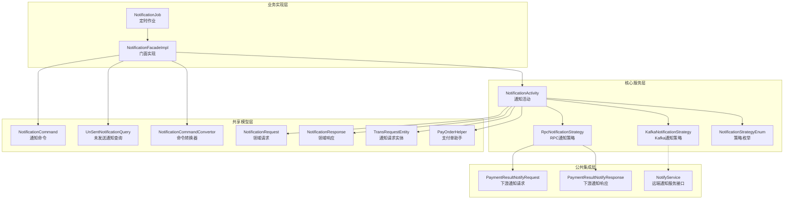
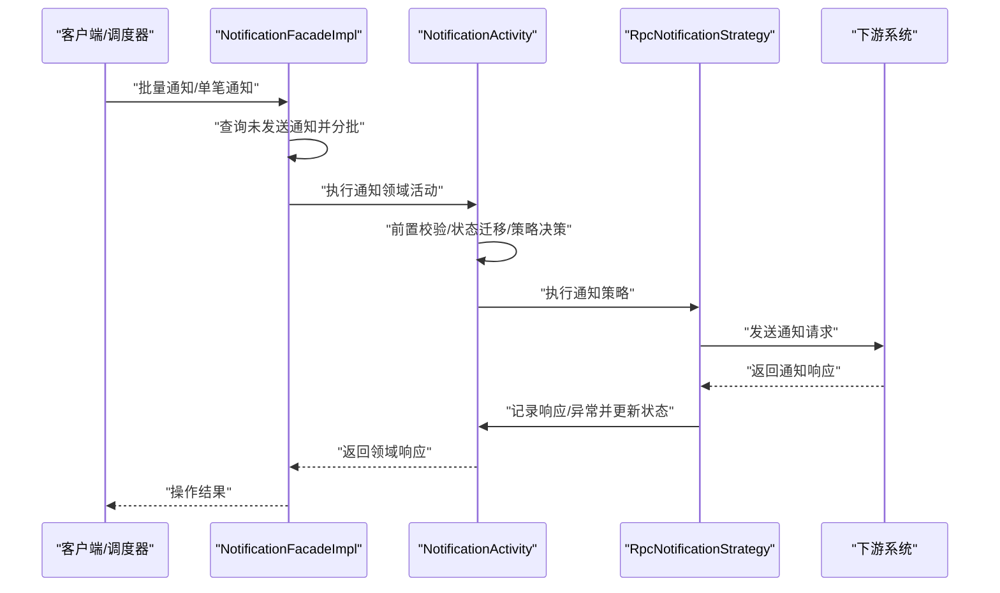
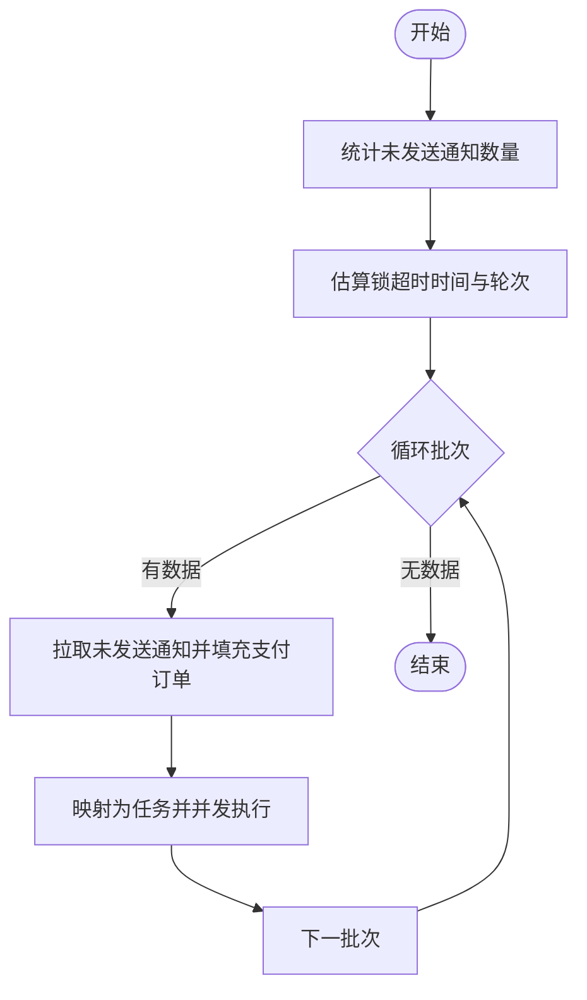
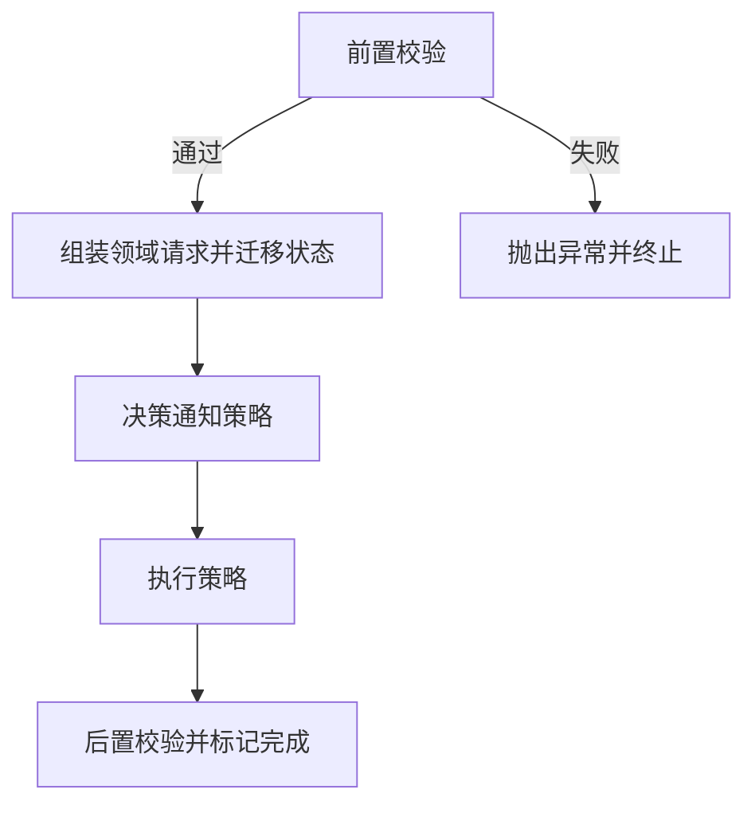
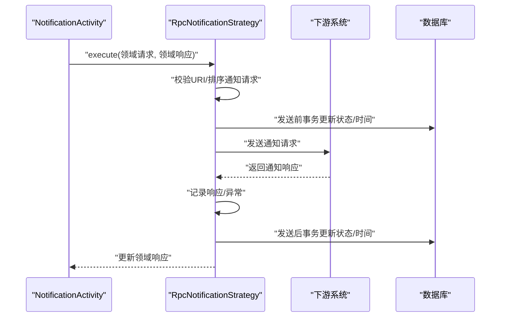
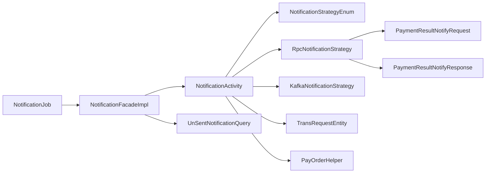

# 通知处理功能

<cite>
**本文引用的文件**
- [NotificationFacadeImpl.java](file://biz-service-impl/src/main/java/com/magicliang/transaction/sys/biz/service/impl/facade/impl/NotificationFacadeImpl.java)
- [INotificationFacade.java](file://biz-service-impl/src/main/java/com/magicliang/transaction/sys/biz/service/impl/facade/INotificationFacade.java)
- [NotificationActivity.java](file://core-service/src/main/java/com/magicliang/transaction/sys/core/domain/activity/notification/NotificationActivity.java)
- [RpcNotificationStrategy.java](file://core-service/src/main/java/com/magicliang/transaction/sys/core/domain/strategy/notification/RpcNotificationStrategy.java)
- [KafkaNotificationStrategy.java](file://core-service/src/main/java/com/magicliang/transaction/sys/core/domain/strategy/notification/KafkaNotificationStrategy.java)
- [NotificationStrategyEnum.java](file://core-service/src/main/java/com/magicliang/transaction/sys/core/domain/enums/NotificationStrategyEnum.java)
- [NotificationCommand.java](file://biz-shared/src/main/java/com/magicliang/transaction/sys/biz/shared/request/notification/NotificationCommand.java)
- [UnSentNotificationQuery.java](file://biz-shared/src/main/java/com/magicliang/transaction/sys/biz/shared/request/notification/UnSentNotificationQuery.java)
- [NotificationCommandConvertor.java](file://biz-shared/src/main/java/com/magicliang/transaction/sys/biz/shared/request/notification/convertor/NotificationCommandConvertor.java)
- [NotificationRequest.java](file://core-model/src/main/java/com/magicliang/transaction/sys/core/model/request/notification/NotificationRequest.java)
- [NotificationResponse.java](file://core-model/src/main/java/com/magicliang/transaction/sys/core/model/response/notification/NotificationResponse.java)
- [TransRequestEntity.java](file://core-model/src/main/java/com/magicliang/transaction/sys/core/model/entity/TransRequestEntity.java)
- [PayOrderHelper.java](file://core-model/src/main/java/com/magicliang/transaction/sys/core/model/entity/helper/PayOrderHelper.java)
- [PaymentResultNotifyRequest.java](file://common-service-integration/src/main/java/com/magicliang/transaction/sys/common/service/integration/param/PaymentResultNotifyRequest.java)
- [PaymentResultNotifyResponse.java](file://common-service-integration/src/main/java/com/magicliang/transaction/sys/common/service/integration/param/PaymentResultNotifyResponse.java)
- [NotifyService.java](file://common-service-facade/src/main/java/com/magicliang/transaction/sys/common/service/facade/NotifyService.java)
- [NotificationJob.java](file://biz-service-impl/src/main/java/com/magicliang/transaction/sys/biz/service/impl/job/NotificationJob.java)
</cite>

## 目录
1. [简介](#简介)
2. [项目结构](#项目结构)
3. [核心组件](#核心组件)
4. [架构总览](#架构总览)
5. [详细组件分析](#详细组件分析)
6. [依赖分析](#依赖分析)
7. [性能考量](#性能考量)
8. [故障排查指南](#故障排查指南)
9. [结论](#结论)
10. [附录](#附录)

## 简介
本文件围绕“通知处理功能”展开，系统性阐述支付结果通知的完整业务流程，包括通知接收、签名验证、重试机制与状态更新；详解 NotificationFacadeImpl 门面如何处理第三方支付渠道的通知请求，包括参数解析、业务逻辑验证与状态更新；说明 NotificationActivity 活动层的业务逻辑，包括通知状态管理、重复通知处理与异常通知处理；解释通知策略（RPC 与 Kafka）的实现差异；并提供通知相关的 API 接口定义、使用示例与安全注意事项。

## 项目结构
通知处理功能横跨“业务实现层”、“核心服务层”、“共享模型层”、“公共集成层”等多个模块，采用分层与职责分离的设计：
- 业务实现层：负责对外暴露的门面接口与作业调度，承担批量通知的拉取、并发执行与锁控制。
- 核心服务层：封装领域活动与策略，负责通知状态迁移、策略选择与执行。
- 共享模型层：定义通知命令、查询、请求/响应模型与辅助工具。
- 公共集成层：定义与下游通信的请求/响应参数结构。

图表来源
- [NotificationFacadeImpl.java:1-127](file://biz-service-impl/src/main/java/com/magicliang/transaction/sys/biz/service/impl/facade/impl/NotificationFacadeImpl.java#L1-L127)
- [NotificationActivity.java:1-183](file://core-service/src/main/java/com/magicliang/transaction/sys/core/domain/activity/notification/NotificationActivity.java#L1-L183)
- [RpcNotificationStrategy.java:1-241](file://core-service/src/main/java/com/magicliang/transaction/sys/core/domain/strategy/notification/RpcNotificationStrategy.java#L1-L241)
- [KafkaNotificationStrategy.java:1-47](file://core-service/src/main/java/com/magicliang/transaction/sys/core/domain/strategy/notification/KafkaNotificationStrategy.java#L1-L47)
- [NotificationStrategyEnum.java:1-76](file://core-service/src/main/java/com/magicliang/transaction/sys/core/domain/enums/NotificationStrategyEnum.java#L1-L76)
- [NotificationCommand.java:1-43](file://biz-shared/src/main/java/com/magicliang/transaction/sys/biz/shared/request/notification/NotificationCommand.java#L1-L43)
- [UnSentNotificationQuery.java:1-40](file://biz-shared/src/main/java/com/magicliang/transaction/sys/biz/shared/request/notification/UnSentNotificationQuery.java#L1-L40)
- [NotificationCommandConvertor.java:1-36](file://biz-shared/src/main/java/com/magicliang/transaction/sys/biz/shared/request/notification/convertor/NotificationCommandConvertor.java#L1-L36)
- [NotificationRequest.java:1-25](file://core-model/src/main/java/com/magicliang/transaction/sys/core/model/request/notification/NotificationRequest.java#L1-L25)
- [NotificationResponse.java:1-23](file://core-model/src/main/java/com/magicliang/transaction/sys/core/model/response/notification/NotificationResponse.java#L1-L23)
- [TransRequestEntity.java:1-122](file://core-model/src/main/java/com/magicliang/transaction/sys/core/model/entity/TransRequestEntity.java#L1-L122)
- [PayOrderHelper.java:1-204](file://core-model/src/main/java/com/magicliang/transaction/sys/core/model/entity/helper/PayOrderHelper.java#L1-L204)
- [PaymentResultNotifyRequest.java:1-55](file://common-service-integration/src/main/java/com/magicliang/transaction/sys/common/service/integration/param/PaymentResultNotifyRequest.java#L1-L55)
- [PaymentResultNotifyResponse.java:121-141](file://common-service-integration/src/main/java/com/magicliang/transaction/sys/common/service/integration/param/PaymentResultNotifyResponse.java#L121-L141)
- [NotifyService.java:1-15](file://common-service-facade/src/main/java/com/magicliang/transaction/sys/common/service/facade/NotifyService.java#L1-L15)
- [NotificationJob.java:1-39](file://biz-service-impl/src/main/java/com/magicliang/transaction/sys/biz/service/impl/job/NotificationJob.java#L1-L39)

章节来源
- [NotificationFacadeImpl.java:1-127](file://biz-service-impl/src/main/java/com/magicliang/transaction/sys/biz/service/impl/facade/impl/NotificationFacadeImpl.java#L1-L127)
- [NotificationActivity.java:1-183](file://core-service/src/main/java/com/magicliang/transaction/sys/core/domain/activity/notification/NotificationActivity.java#L1-L183)

## 核心组件
- 通知门面（NotificationFacadeImpl）：负责批量查询未发送通知、并发执行通知任务、分布式锁保护与弹性锁超时计算。
- 通知活动（NotificationActivity）：负责前置校验（支付单终态、通知请求存在、策略可用）、组装领域请求、状态迁移、策略决策与后置校验。
- 通知策略（RpcNotificationStrategy / KafkaNotificationStrategy）：RPC 策略负责按优先级发送通知并记录响应/异常；Kafka 策略当前未实现。
- 通知命令与查询（NotificationCommand / UnSentNotificationQuery）：承载通知触发与批量查询的输入参数。
- 领域请求/响应（NotificationRequest / NotificationResponse）：通知活动的输入输出载体。
- 实体与助手（TransRequestEntity / PayOrderHelper）：维护通知请求状态、时间与过滤未发送通知。
- 集成参数（PaymentResultNotifyRequest / PaymentResultNotifyResponse）：下游通知请求/响应的数据结构。
- 通知作业（NotificationJob）：定时拉起批量通知流程。

章节来源
- [INotificationFacade.java:1-42](file://biz-service-impl/src/main/java/com/magicliang/transaction/sys/biz/service/impl/facade/INotificationFacade.java#L1-L42)
- [NotificationCommand.java:1-43](file://biz-shared/src/main/java/com/magicliang/transaction/sys/biz/shared/request/notification/NotificationCommand.java#L1-L43)
- [UnSentNotificationQuery.java:1-40](file://biz-shared/src/main/java/com/magicliang/transaction/sys/biz/shared/request/notification/UnSentNotificationQuery.java#L1-L40)
- [NotificationRequest.java:1-25](file://core-model/src/main/java/com/magicliang/transaction/sys/core/model/request/notification/NotificationRequest.java#L1-L25)
- [NotificationResponse.java:1-23](file://core-model/src/main/java/com/magicliang/transaction/sys/core/model/response/notification/NotificationResponse.java#L1-L23)
- [TransRequestEntity.java:1-122](file://core-model/src/main/java/com/magicliang/transaction/sys/core/model/entity/TransRequestEntity.java#L1-L122)
- [PayOrderHelper.java:1-204](file://core-model/src/main/java/com/magicliang/transaction/sys/core/model/entity/helper/PayOrderHelper.java#L1-L204)
- [PaymentResultNotifyRequest.java:1-55](file://common-service-integration/src/main/java/com/magicliang/transaction/sys/common/service/integration/param/PaymentResultNotifyRequest.java#L1-L55)
- [PaymentResultNotifyResponse.java:121-141](file://common-service-integration/src/main/java/com/magicliang/transaction/sys/common/service/integration/param/PaymentResultNotifyResponse.java#L121-L141)
- [NotificationJob.java:1-39](file://biz-service-impl/src/main/java/com/magicliang/transaction/sys/biz/service/impl/job/NotificationJob.java#L1-L39)

## 架构总览
通知处理的整体流程如下：
- 业务层通过门面发起批量通知或单笔通知。
- 门面根据环境与批次大小查询未发送通知，构建支付订单集合，映射为任务并发执行。
- 领域活动进行前置校验与状态迁移，决策通知策略。
- 策略根据支付单状态与通知类型构造下游通知请求，记录响应或异常，并更新通知请求状态与下次执行时间。
- 作业层定期扫描未发送通知，保证兜底补偿。

图表来源
- [NotificationFacadeImpl.java:57-110](file://biz-service-impl/src/main/java/com/magicliang/transaction/sys/biz/service/impl/facade/impl/NotificationFacadeImpl.java#L57-L110)
- [NotificationActivity.java:55-181](file://core-service/src/main/java/com/magicliang/transaction/sys/core/domain/activity/notification/NotificationActivity.java#L55-L181)
- [RpcNotificationStrategy.java:79-121](file://core-service/src/main/java/com/magicliang/transaction/sys/core/domain/strategy/notification/RpcNotificationStrategy.java#L79-L121)
- [PaymentResultNotifyRequest.java:1-55](file://common-service-integration/src/main/java/com/magicliang/transaction/sys/common/service/integration/param/PaymentResultNotifyRequest.java#L1-L55)
- [PaymentResultNotifyResponse.java:121-141](file://common-service-integration/src/main/java/com/magicliang/transaction/sys/common/service/integration/param/PaymentResultNotifyResponse.java#L121-L141)

## 详细组件分析

### 通知门面（NotificationFacadeImpl）
- 批量通知：根据批次大小与近似未发送数量估算锁超时时间，循环拉取未发送通知，填充完整支付订单并并发执行。
- 并发执行：将支付订单映射为任务，统一提交执行，支持线程池并发。
- 单笔通知：将领域实体转换为命令后通过命令总线发送执行。
- 锁与节流：通过分布式锁保护批量执行，避免并发冲突；吞吐量与线程数用于估算锁超时。

图表来源
- [NotificationFacadeImpl.java:57-110](file://biz-service-impl/src/main/java/com/magicliang/transaction/sys/biz/service/impl/facade/impl/NotificationFacadeImpl.java#L57-L110)

章节来源
- [NotificationFacadeImpl.java:1-127](file://biz-service-impl/src/main/java/com/magicliang/transaction/sys/biz/service/impl/facade/impl/NotificationFacadeImpl.java#L1-L127)
- [INotificationFacade.java:1-42](file://biz-service-impl/src/main/java/com/magicliang/transaction/sys/biz/service/impl/facade/INotificationFacade.java#L1-L42)

### 通知活动（NotificationActivity）
- 前置校验：校验支付单存在、状态为终态、通知请求非空；若无未发送通知则标记活动完成。
- 请求组装：将支付单上的通知请求迁移到领域请求，并在发送前将状态置为“待处理”，更新时间与重试次数。
- 策略决策：当前固定返回 RPC 策略。
- 后置校验：断言通知成功，标记活动完成。

图表来源
- [NotificationActivity.java:55-181](file://core-service/src/main/java/com/magicliang/transaction/sys/core/domain/activity/notification/NotificationActivity.java#L55-L181)

章节来源
- [NotificationActivity.java:1-183](file://core-service/src/main/java/com/magicliang/transaction/sys/core/domain/activity/notification/NotificationActivity.java#L1-L183)

### RPC 通知策略（RpcNotificationStrategy）
- 通知请求准备：从支付单提取未发送通知请求，按优先级排序；校验通知 URI 格式。
- 发送前事务：更新通知请求状态为“待处理”，并更新下次执行时间。
- 发送与记录：构造下游通知请求，发送后记录响应或异常；更新通知请求状态、响应内容与时间。
- 发送后事务：再次持久化更新，确保状态一致性。

图表来源
- [RpcNotificationStrategy.java:79-121](file://core-service/src/main/java/com/magicliang/transaction/sys/core/domain/strategy/notification/RpcNotificationStrategy.java#L79-L121)
- [TransRequestEntity.java:109-121](file://core-model/src/main/java/com/magicliang/transaction/sys/core/model/entity/TransRequestEntity.java#L109-L121)

章节来源
- [RpcNotificationStrategy.java:1-241](file://core-service/src/main/java/com/magicliang/transaction/sys/core/domain/strategy/notification/RpcNotificationStrategy.java#L1-L241)

### Kafka 通知策略（KafkaNotificationStrategy）
- 当前实现：抛出不支持异常，表示暂未实现 Kafka 通知策略。
- 设计建议：可参考 RPC 策略的结构，将通知请求序列化后投递至 Kafka 主题，并在消费端完成下游通知与状态更新。

章节来源
- [KafkaNotificationStrategy.java:1-47](file://core-service/src/main/java/com/magicliang/transaction/sys/core/domain/strategy/notification/KafkaNotificationStrategy.java#L1-L47)
- [NotificationStrategyEnum.java:1-76](file://core-service/src/main/java/com/magicliang/transaction/sys/core/domain/enums/NotificationStrategyEnum.java#L1-L76)

### 通知命令与查询
- 通知命令（NotificationCommand）：承载支付订单号或支付订单实体，标识操作类型为“通知”。
- 未发送通知查询（UnSentNotificationQuery）：包含批次大小与环境参数，标识操作类型为“查询未发送通知”。

章节来源
- [NotificationCommand.java:1-43](file://biz-shared/src/main/java/com/magicliang/transaction/sys/biz/shared/request/notification/NotificationCommand.java#L1-L43)
- [UnSentNotificationQuery.java:1-40](file://biz-shared/src/main/java/com/magicliang/transaction/sys/biz/shared/request/notification/UnSentNotificationQuery.java#L1-L40)

### 领域请求/响应与实体
- 领域请求（NotificationRequest）：扩展自通用请求，携带通知请求实体。
- 领域响应（NotificationResponse）：包含通知是否成功的布尔标志。
- 通知请求实体（TransRequestEntity）：包含请求类型、状态、重试次数、下次执行时间、请求/响应、异常等字段，并提供状态更新方法。
- 支付单助手（PayOrderHelper）：提供过滤未发送通知请求、构建初始通知请求、判断是否需要基础/退票通知等能力。

章节来源
- [NotificationRequest.java:1-25](file://core-model/src/main/java/com/magicliang/transaction/sys/core/model/request/notification/NotificationRequest.java#L1-L25)
- [NotificationResponse.java:1-23](file://core-model/src/main/java/com/magicliang/transaction/sys/core/model/response/notification/NotificationResponse.java#L1-L23)
- [TransRequestEntity.java:1-122](file://core-model/src/main/java/com/magicliang/transaction/sys/core/model/entity/TransRequestEntity.java#L1-L122)
- [PayOrderHelper.java:183-204](file://core-model/src/main/java/com/magicliang/transaction/sys/core/model/entity/helper/PayOrderHelper.java#L183-L204)

### 集成参数
- 下游通知请求（PaymentResultNotifyRequest）：包含支付订单号、系统来源、业务标识、业务唯一号、是否成功、错误码、错误信息等字段。
- 下游通知响应（PaymentResultNotifyResponse）：包含成功标志与错误信息，支持构建成功响应。

章节来源
- [PaymentResultNotifyRequest.java:1-55](file://common-service-integration/src/main/java/com/magicliang/transaction/sys/common/service/integration/param/PaymentResultNotifyRequest.java#L1-L55)
- [PaymentResultNotifyResponse.java:121-141](file://common-service-integration/src/main/java/com/magicliang/transaction/sys/common/service/integration/param/PaymentResultNotifyResponse.java#L121-L141)

### 通知作业（NotificationJob）
- 职责：封装批量通知作业，结合通用配置与通知门面，按环境与批次大小拉起通知流程。
- 优势：独立作业便于调度模型控制与兜底补偿。

章节来源
- [NotificationJob.java:1-39](file://biz-service-impl/src/main/java/com/magicliang/transaction/sys/biz/service/impl/job/NotificationJob.java#L1-L39)

## 依赖分析
- 门面依赖活动与查询模型，活动依赖策略与实体助手，策略依赖集成参数与配置，作业依赖门面与配置。
- 策略枚举统一标识策略类型，当前活动固定选择 RPC 策略。

图表来源
- [NotificationFacadeImpl.java:1-127](file://biz-service-impl/src/main/java/com/magicliang/transaction/sys/biz/service/impl/facade/impl/NotificationFacadeImpl.java#L1-L127)
- [NotificationActivity.java:1-183](file://core-service/src/main/java/com/magicliang/transaction/sys/core/domain/activity/notification/NotificationActivity.java#L1-L183)
- [RpcNotificationStrategy.java:1-241](file://core-service/src/main/java/com/magicliang/transaction/sys/core/domain/strategy/notification/RpcNotificationStrategy.java#L1-L241)
- [KafkaNotificationStrategy.java:1-47](file://core-service/src/main/java/com/magicliang/transaction/sys/core/domain/strategy/notification/KafkaNotificationStrategy.java#L1-L47)
- [NotificationStrategyEnum.java:1-76](file://core-service/src/main/java/com/magicliang/transaction/sys/core/domain/enums/NotificationStrategyEnum.java#L1-L76)
- [TransRequestEntity.java:1-122](file://core-model/src/main/java/com/magicliang/transaction/sys/core/model/entity/TransRequestEntity.java#L1-L122)
- [PayOrderHelper.java:1-204](file://core-model/src/main/java/com/magicliang/transaction/sys/core/model/entity/helper/PayOrderHelper.java#L1-L204)
- [PaymentResultNotifyRequest.java:1-55](file://common-service-integration/src/main/java/com/magicliang/transaction/sys/common/service/integration/param/PaymentResultNotifyRequest.java#L1-L55)
- [PaymentResultNotifyResponse.java:121-141](file://common-service-integration/src/main/java/com/magicliang/transaction/sys/common/service/integration/param/PaymentResultNotifyResponse.java#L121-L141)
- [NotificationJob.java:1-39](file://biz-service-impl/src/main/java/com/magicliang/transaction/sys/biz/service/impl/job/NotificationJob.java#L1-L39)

章节来源
- [NotificationActivity.java:150-154](file://core-service/src/main/java/com/magicliang/transaction/sys/core/domain/activity/notification/NotificationActivity.java#L150-L154)
- [NotificationStrategyEnum.java:1-76](file://core-service/src/main/java/com/magicliang/transaction/sys/core/domain/enums/NotificationStrategyEnum.java#L1-L76)

## 性能考量
- 并发与吞吐：门面以固定线程数与吞吐量估算锁超时，避免长时间持锁阻塞；批量分片降低单次压力。
- 重试与调度：通知请求具备重试次数与下次执行时间字段，策略在发送前调整下次执行时间，实现指数/间隔退避。
- 数据一致性：策略在发送前后分别更新状态与时间，确保异常场景下的最终一致性。
- 策略扩展：Kafka 策略预留实现空间，可异步解耦通知与实时性要求。

## 故障排查指南
- 常见错误与定位
  - 支付单状态非终态：活动前置校验会拒绝非终态支付单的通知请求。
  - 通知请求为空：活动会校验通知请求集合，缺失将触发异常。
  - 通知 URI 格式非法：RPC 策略会校验通知 URI 的格式。
  - 策略不可用：活动会校验已决策策略的有效性。
- 日志与可观测性
  - 策略执行记录响应/异常，便于回溯。
  - 通知请求实体记录异常字符串，可用于问题定位。
- 补偿与兜底
  - 作业层定期扫描未发送通知，结合重试次数与下次执行时间推进补偿。

章节来源
- [NotificationActivity.java:55-88](file://core-service/src/main/java/com/magicliang/transaction/sys/core/domain/activity/notification/NotificationActivity.java#L55-L88)
- [RpcNotificationStrategy.java:205-240](file://core-service/src/main/java/com/magicliang/transaction/sys/core/domain/strategy/notification/RpcNotificationStrategy.java#L205-L240)
- [TransRequestEntity.java:90-93](file://core-model/src/main/java/com/magicliang/transaction/sys/core/model/entity/TransRequestEntity.java#L90-L93)

## 结论
通知处理功能通过门面-活动-策略的分层设计，实现了对第三方支付渠道通知的可靠处理。门面负责批量与并发控制，活动负责业务校验与状态迁移，策略负责具体通知发送与结果记录。当前以 RPC 策略为主，Kafka 策略预留扩展。配合作业层的兜底补偿与完善的实体状态管理，系统在可靠性与可运维性方面具备良好基础。

## 附录

### API 接口定义
- 批量通知接口
  - 方法：batchNotify(UnSentNotificationQuery)
  - 输入：批次大小、环境
  - 输出：操作结果（布尔）
  - 说明：查询并批量发送未完成通知，内部进行分布式锁保护与分批处理
- 批量通知（支付订单列表）
  - 方法：batchNotify(List<TransPayOrderEntity>)
  - 输入：支付订单列表
  - 输出：无
  - 说明：将支付订单映射为任务并发执行
- 单笔通知
  - 方法：notify(NotificationCommand)
  - 输入：通知命令（含支付订单号或支付订单实体）
  - 输出：交易模型
  - 说明：通过命令总线发送执行通知

章节来源
- [INotificationFacade.java:18-42](file://biz-service-impl/src/main/java/com/magicliang/transaction/sys/biz/service/impl/facade/INotificationFacade.java#L18-L42)
- [NotificationCommand.java:18-42](file://biz-shared/src/main/java/com/magicliang/transaction/sys/biz/shared/request/notification/NotificationCommand.java#L18-L42)
- [UnSentNotificationQuery.java:17-40](file://biz-shared/src/main/java/com/magicliang/transaction/sys/biz/shared/request/notification/UnSentNotificationQuery.java#L17-L40)

### 使用示例
- 触发批量通知
  - 步骤：构造 UnSentNotificationQuery（设置批次大小与环境），调用门面 batchNotify。
  - 注意：确保环境与批次大小合理，避免过大批次导致锁竞争。
- 触发单笔通知
  - 步骤：构造 NotificationCommand（可直接传入支付订单实体），调用门面 notify。
- 作业调度
  - 步骤：由调度器周期性调用 NotificationJob，自动拉起批量通知流程。

章节来源
- [NotificationFacadeImpl.java:57-110](file://biz-service-impl/src/main/java/com/magicliang/transaction/sys/biz/service/impl/facade/impl/NotificationFacadeImpl.java#L57-L110)
- [NotificationJob.java:1-39](file://biz-service-impl/src/main/java/com/magicliang/transaction/sys/biz/service/impl/job/NotificationJob.java#L1-L39)

### 安全与最佳实践
- 参数校验：严格校验通知 URI 格式与通知请求集合，防止无效请求进入处理链。
- 分布式锁：批量通知使用分布式锁保护，避免并发冲突；锁超时基于吞吐量与任务量动态估算。
- 幂等与重试：利用通知请求状态与重试次数实现幂等与退避重试；异常时记录异常字符串便于追踪。
- 策略选择：当前活动固定选择 RPC 策略；如需扩展 Kafka，请遵循现有策略接口与状态更新模式。
- 兜底补偿：通过作业层定期扫描未发送通知，结合下次执行时间推进补偿，提升可靠性。

章节来源
- [RpcNotificationStrategy.java:79-121](file://core-service/src/main/java/com/magicliang/transaction/sys/core/domain/strategy/notification/RpcNotificationStrategy.java#L79-L121)
- [NotificationActivity.java:55-88](file://core-service/src/main/java/com/magicliang/transaction/sys/core/domain/activity/notification/NotificationActivity.java#L55-L88)
- [NotificationJob.java:1-39](file://biz-service-impl/src/main/java/com/magicliang/transaction/sys/biz/service/impl/job/NotificationJob.java#L1-L39)