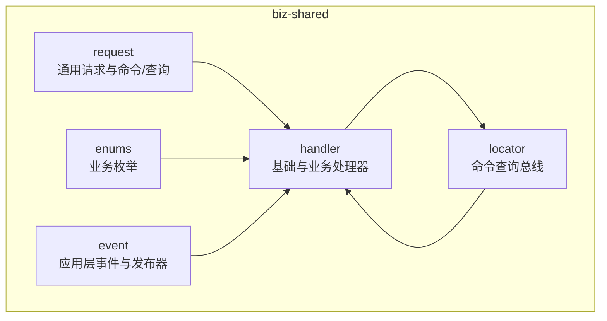
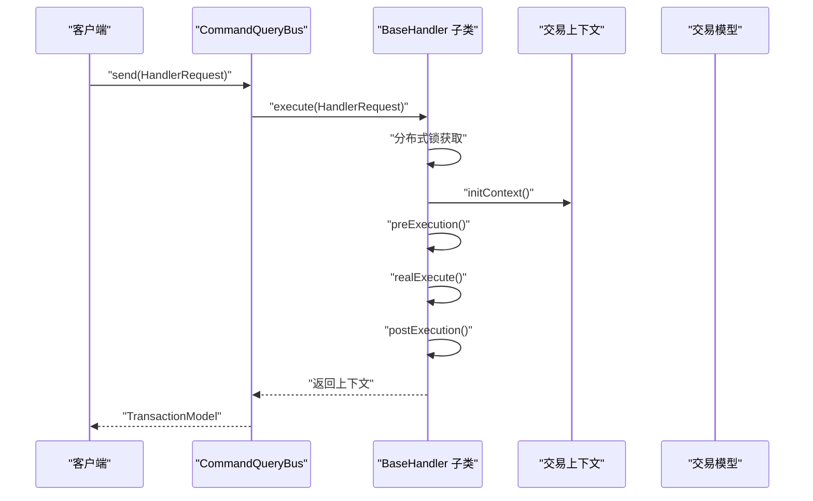
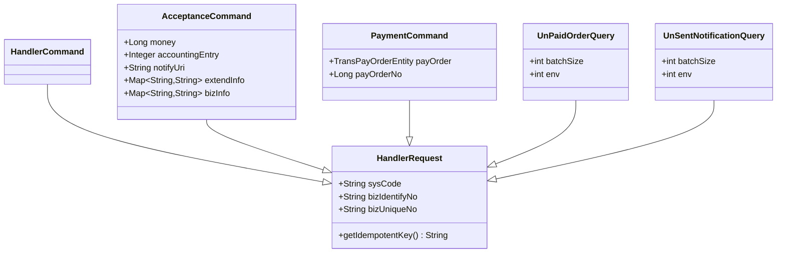
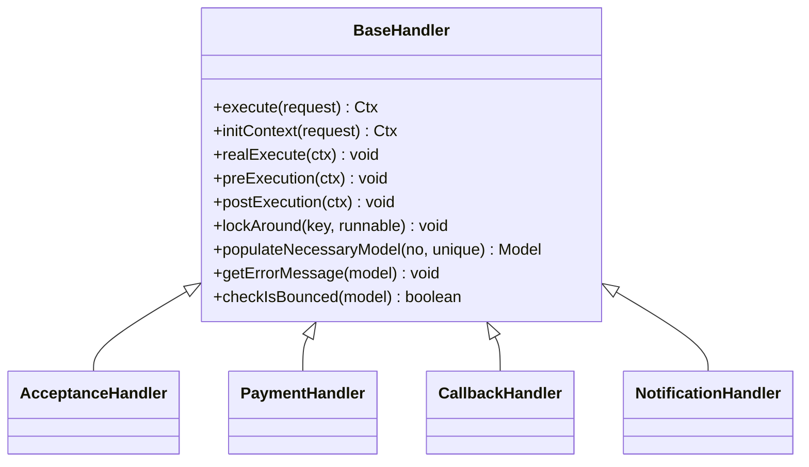
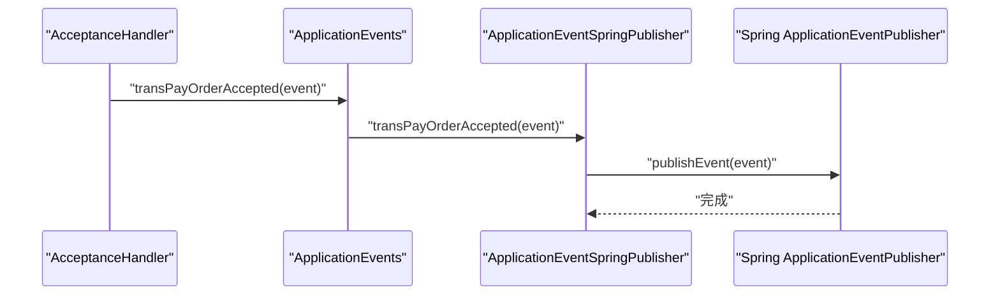
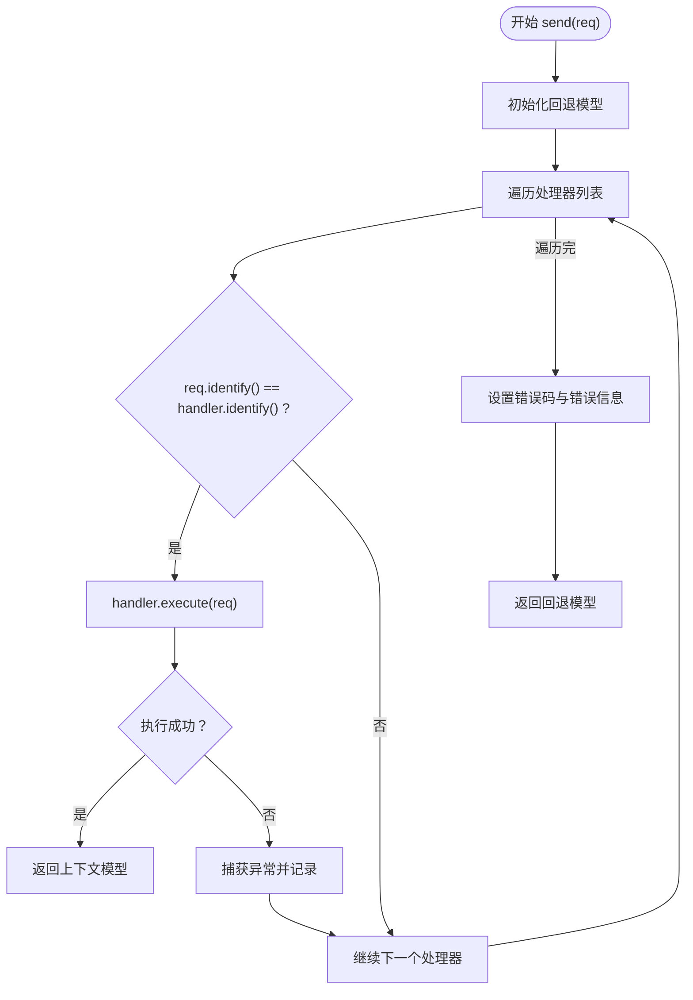
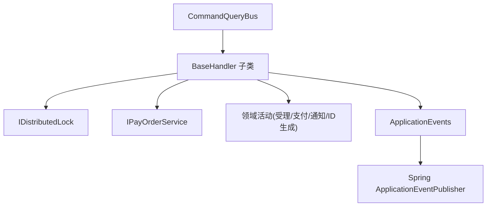

# 业务共享层

<cite>
**本文引用的文件**
- [HandlerCommand.java](file://biz-shared/src/main/java/com/magicliang/transaction/sys/biz/shared/request/HandlerCommand.java)
- [HandlerRequest.java](file://biz-shared/src/main/java/com/magicliang/transaction/sys/biz/shared/request/HandlerRequest.java)
- [BaseHandler.java](file://biz-shared/src/main/java/com/magicliang/transaction/sys/biz/shared/handler/BaseHandler.java)
- [OperationEnum.java](file://biz-shared/src/main/java/com/magicliang/transaction/sys/biz/shared/enums/OperationEnum.java)
- [ApplicationEventSpringPublisher.java](file://biz-shared/src/main/java/com/magicliang/transaction/sys/biz/shared/event/ApplicationEventSpringPublisher.java)
- [ApplicationEvents.java](file://biz-shared/src/main/java/com/magicliang/transaction/sys/biz/shared/event/ApplicationEvents.java)
- [CommandQueryBus.java](file://biz-shared/src/main/java/com/magicliang/transaction/sys/biz/shared/locator/CommandQueryBus.java)
- [AcceptanceHandler.java](file://biz-shared/src/main/java/com/magicliang/transaction/sys/biz/shared/handler/AcceptanceHandler.java)
- [PaymentHandler.java](file://biz-shared/src/main/java/com/magicliang/transaction/sys/biz/shared/handler/PaymentHandler.java)
- [CallbackHandler.java](file://biz-shared/src/main/java/com/magicliang/transaction/sys/biz/shared/handler/CallbackHandler.java)
- [NotificationHandler.java](file://biz-shared/src/main/java/com/magicliang/transaction/sys/biz/shared/handler/NotificationHandler.java)
- [AcceptanceCommand.java](file://biz-shared/src/main/java/com/magicliang/transaction/sys/biz/shared/request/acceptance/AcceptanceCommand.java)
- [PaymentCommand.java](file://biz-shared/src/main/java/com/magicliang/transaction/sys/biz/shared/request/payment/PaymentCommand.java)
- [UnPaidOrderQuery.java](file://biz-shared/src/main/java/com/magicliang/transaction/sys/biz/shared/request/payment/UnPaidOrderQuery.java)
- [UnSentNotificationQuery.java](file://biz-shared/src/main/java/com/magicliang/transaction/sys/biz/shared/request/notification/UnSentNotificationQuery.java)
</cite>

## 目录
1. [引言](#引言)
2. [项目结构](#项目结构)
3. [核心组件](#核心组件)
4. [架构总览](#架构总览)
5. [详细组件分析](#详细组件分析)
6. [依赖分析](#依赖分析)
7. [性能考量](#性能考量)
8. [故障排查指南](#故障排查指南)
9. [结论](#结论)
10. [附录](#附录)

## 引言
本文件面向领域驱动交易系统的业务共享层，系统性梳理公共组件的设计与实现，重点覆盖以下主题：
- 请求响应模型：HandlerCommand、HandlerRequest 等通用请求对象的设计与幂等键生成机制
- 处理器实现：AcceptanceHandler、PaymentHandler、CallbackHandler、NotificationHandler 的职责划分与执行流程
- 枚举统一管理：OperationEnum 的设计原则与使用场景
- 事件定义与发布：ApplicationEventSpringPublisher 的实现与应用层事件接口
- 命令查询总线：CommandQueryBus 的消息路由与异常处理策略
- 使用与扩展：给出共享组件在不同业务场景中的使用方法与扩展建议

## 项目结构
业务共享层位于 biz-shared 模块，主要包含如下包：
- request：通用请求模型与各业务命令/查询
- handler：基础处理器与具体业务处理器
- enums：业务枚举
- event：应用层事件与发布器
- locator：命令查询总线

**章节来源**
- [HandlerRequest.java:1-46](file://biz-shared/src/main/java/com/magicliang/transaction/sys/biz/shared/request/HandlerRequest.java#L1-L46)
- [BaseHandler.java:1-244](file://biz-shared/src/main/java/com/magicliang/transaction/sys/biz/shared/handler/BaseHandler.java#L1-L244)
- [OperationEnum.java:1-97](file://biz-shared/src/main/java/com/magicliang/transaction/sys/biz/shared/enums/OperationEnum.java#L1-L97)
- [ApplicationEventSpringPublisher.java:1-32](file://biz-shared/src/main/java/com/magicliang/transaction/sys/biz/shared/event/ApplicationEventSpringPublisher.java#L1-L32)
- [CommandQueryBus.java:1-79](file://biz-shared/src/main/java/com/magicliang/transaction/sys/biz/shared/locator/CommandQueryBus.java#L1-L79)

## 核心组件
本节聚焦共享层的关键构件及其职责。

- HandlerRequest：所有请求的抽象基类，统一携带上游系统标识、业务唯一标识与幂等键生成逻辑
- HandlerCommand：命令型请求的抽象基类，继承自 HandlerRequest
- BaseHandler：处理器基类，封装分布式锁、上下文初始化、前后置钩子、领域活动编排与错误码填充
- OperationEnum：统一的业务操作枚举，用于识别请求/命令类型
- ApplicationEvents / ApplicationEventSpringPublisher：应用层事件接口与 Spring 发布实现
- CommandQueryBus：命令/查询分发器，按 OperationEnum 将请求路由至对应处理器

**章节来源**
- [HandlerRequest.java:17-46](file://biz-shared/src/main/java/com/magicliang/transaction/sys/biz/shared/request/HandlerRequest.java#L17-L46)
- [HandlerCommand.java:12-15](file://biz-shared/src/main/java/com/magicliang/transaction/sys/biz/shared/request/HandlerCommand.java#L12-L15)
- [BaseHandler.java:38-121](file://biz-shared/src/main/java/com/magicliang/transaction/sys/biz/shared/handler/BaseHandler.java#L38-L121)
- [OperationEnum.java:18-97](file://biz-shared/src/main/java/com/magicliang/transaction/sys/biz/shared/enums/OperationEnum.java#L18-L97)
- [ApplicationEvents.java:15-22](file://biz-shared/src/main/java/com/magicliang/transaction/sys/biz/shared/event/ApplicationEvents.java#L15-L22)
- [ApplicationEventSpringPublisher.java:18-32](file://biz-shared/src/main/java/com/magicliang/transaction/sys/biz/shared/event/ApplicationEventSpringPublisher.java#L18-L32)
- [CommandQueryBus.java:27-79](file://biz-shared/src/main/java/com/magicliang/transaction/sys/biz/shared/locator/CommandQueryBus.java#L27-L79)

## 架构总览
业务共享层采用“请求-处理器-总线”的解耦架构：
- 请求对象统一实现 identify() 返回 OperationEnum，用于类型识别
- CommandQueryBus 通过扫描注入的 BaseHandler 列表，按类型匹配执行
- BaseHandler 在分布式锁保护下执行上下文初始化、前置/真实处理/后置流程
- 具体处理器（受理、支付、回调、通知）编排领域活动并产出交易模型

**图表来源**
- [CommandQueryBus.java:42-77](file://biz-shared/src/main/java/com/magicliang/transaction/sys/biz/shared/locator/CommandQueryBus.java#L42-L77)
- [BaseHandler.java:93-121](file://biz-shared/src/main/java/com/magicliang/transaction/sys/biz/shared/handler/BaseHandler.java#L93-L121)

**章节来源**
- [CommandQueryBus.java:27-79](file://biz-shared/src/main/java/com/magicliang/transaction/sys/biz/shared/locator/CommandQueryBus.java#L27-L79)
- [BaseHandler.java:38-121](file://biz-shared/src/main/java/com/magicliang/transaction/sys/biz/shared/handler/BaseHandler.java#L38-L121)

## 详细组件分析

### 请求响应模型与转换机制
- HandlerRequest 统一字段：sysCode、bizIdentifyNo、bizUniqueNo；提供 getIdempotentKey() 生成幂等键
- HandlerCommand 继承 HandlerRequest，用于命令型请求
- 具体命令：
  - AcceptanceCommand：受理命令，包含金额、会计分录、回调地址、扩展信息等
  - PaymentCommand：支付命令，支持外部传入完整支付订单或仅传订单号
  - UnPaidOrderQuery / UnSentNotificationQuery：查询命令，用于批量拉取未支付订单与未发送通知

**图表来源**
- [HandlerRequest.java:18-46](file://biz-shared/src/main/java/com/magicliang/transaction/sys/biz/shared/request/HandlerRequest.java#L18-L46)
- [HandlerCommand.java:12-15](file://biz-shared/src/main/java/com/magicliang/transaction/sys/biz/shared/request/HandlerCommand.java#L12-L15)
- [AcceptanceCommand.java:21-72](file://biz-shared/src/main/java/com/magicliang/transaction/sys/biz/shared/request/acceptance/AcceptanceCommand.java#L21-L72)
- [PaymentCommand.java:20-42](file://biz-shared/src/main/java/com/magicliang/transaction/sys/biz/shared/request/payment/PaymentCommand.java#L20-L42)
- [UnPaidOrderQuery.java:19-40](file://biz-shared/src/main/java/com/magicliang/transaction/sys/biz/shared/request/payment/UnPaidOrderQuery.java#L19-L40)
- [UnSentNotificationQuery.java:19-40](file://biz-shared/src/main/java/com/magicliang/transaction/sys/biz/shared/request/notification/UnSentNotificationQuery.java#L19-L40)

**章节来源**
- [HandlerRequest.java:17-46](file://biz-shared/src/main/java/com/magicliang/transaction/sys/biz/shared/request/HandlerRequest.java#L17-L46)
- [AcceptanceCommand.java:19-72](file://biz-shared/src/main/java/com/magicliang/transaction/sys/biz/shared/request/acceptance/AcceptanceCommand.java#L19-L72)
- [PaymentCommand.java:18-42](file://biz-shared/src/main/java/com/magicliang/transaction/sys/biz/shared/request/payment/PaymentCommand.java#L18-L42)
- [UnPaidOrderQuery.java:17-40](file://biz-shared/src/main/java/com/magicliang/transaction/sys/biz/shared/request/payment/UnPaidOrderQuery.java#L17-L40)
- [UnSentNotificationQuery.java:17-40](file://biz-shared/src/main/java/com/magicliang/transaction/sys/biz/shared/request/notification/UnSentNotificationQuery.java#L17-L40)

### 处理器实现与职责划分
- BaseHandler：统一的执行骨架，包含分布式锁、上下文初始化、前后置钩子、领域活动编排与错误码填充
- AcceptanceHandler：受理流程，生成支付订单与子订单，触发受理领域活动，发布受理事件
- PaymentHandler：支付流程，直接执行支付活动，支持外部传入完整支付订单
- CallbackHandler：回调更新流程，根据回调状态更新支付订单与请求状态，处理退票等终态
- NotificationHandler：通知流程，编排通知活动，支持外部传入完整支付订单

**图表来源**
- [BaseHandler.java:38-243](file://biz-shared/src/main/java/com/magicliang/transaction/sys/biz/shared/handler/BaseHandler.java#L38-L243)
- [AcceptanceHandler.java:32-231](file://biz-shared/src/main/java/com/magicliang/transaction/sys/biz/shared/handler/AcceptanceHandler.java#L32-L231)
- [PaymentHandler.java:28-139](file://biz-shared/src/main/java/com/magicliang/transaction/sys/biz/shared/handler/PaymentHandler.java#L28-L139)
- [CallbackHandler.java:32-190](file://biz-shared/src/main/java/com/magicliang/transaction/sys/biz/shared/handler/CallbackHandler.java#L32-L190)
- [NotificationHandler.java:29-139](file://biz-shared/src/main/java/com/magicliang/transaction/sys/biz/shared/handler/NotificationHandler.java#L29-L139)

**章节来源**
- [BaseHandler.java:38-243](file://biz-shared/src/main/java/com/magicliang/transaction/sys/biz/shared/handler/BaseHandler.java#L38-L243)
- [AcceptanceHandler.java:32-231](file://biz-shared/src/main/java/com/magicliang/transaction/sys/biz/shared/handler/AcceptanceHandler.java#L32-L231)
- [PaymentHandler.java:28-139](file://biz-shared/src/main/java/com/magicliang/transaction/sys/biz/shared/handler/PaymentHandler.java#L28-L139)
- [CallbackHandler.java:32-190](file://biz-shared/src/main/java/com/magicliang/transaction/sys/biz/shared/handler/CallbackHandler.java#L32-L190)
- [NotificationHandler.java:29-139](file://biz-shared/src/main/java/com/magicliang/transaction/sys/biz/shared/handler/NotificationHandler.java#L29-L139)

### 枚举统一管理：OperationEnum
- 定义业务操作类型：受理、查询未支付订单、支付、回调、查询未发送通知、通知
- 提供按 code/desc 获取枚举的方法，确保类型识别的一致性
- 所有请求命令均通过 identify() 返回对应 OperationEnum，用于总线路由与处理器匹配

**章节来源**
- [OperationEnum.java:18-97](file://biz-shared/src/main/java/com/magicliang/transaction/sys/biz/shared/enums/OperationEnum.java#L18-L97)
- [AcceptanceCommand.java:68-72](file://biz-shared/src/main/java/com/magicliang/transaction/sys/biz/shared/request/acceptance/AcceptanceCommand.java#L68-L72)
- [PaymentCommand.java:38-42](file://biz-shared/src/main/java/com/magicliang/transaction/sys/biz/shared/request/payment/PaymentCommand.java#L38-L42)

### 事件定义与发布机制
- ApplicationEvents 接口声明应用层事件契约（如受理事件）
- ApplicationEventSpringPublisher 实现接口，委托 Spring ApplicationEventPublisher 发布领域事件
- AcceptanceHandler 在后置阶段发布受理事件，实现领域事件与应用事件的解耦

**图表来源**
- [AcceptanceHandler.java:219-228](file://biz-shared/src/main/java/com/magicliang/transaction/sys/biz/shared/handler/AcceptanceHandler.java#L219-L228)
- [ApplicationEvents.java:15-22](file://biz-shared/src/main/java/com/magicliang/transaction/sys/biz/shared/event/ApplicationEvents.java#L15-L22)
- [ApplicationEventSpringPublisher.java:18-32](file://biz-shared/src/main/java/com/magicliang/transaction/sys/biz/shared/event/ApplicationEventSpringPublisher.java#L18-L32)

**章节来源**
- [ApplicationEvents.java:15-22](file://biz-shared/src/main/java/com/magicliang/transaction/sys/biz/shared/event/ApplicationEvents.java#L15-L22)
- [ApplicationEventSpringPublisher.java:18-32](file://biz-shared/src/main/java/com/magicliang/transaction/sys/biz/shared/event/ApplicationEventSpringPublisher.java#L18-L32)
- [AcceptanceHandler.java:219-228](file://biz-shared/src/main/java/com/magicliang/transaction/sys/biz/shared/handler/AcceptanceHandler.java#L219-L228)

### 命令查询总线：CommandQueryBus
- 注入 List<BaseHandler>，遍历匹配请求 identify() 与处理器 identify()，执行对应处理器
- 捕获 BaseTransException，提取错误码与错误信息，填充回退交易模型
- 记录执行耗时与上下文日志，便于监控与排障

**图表来源**
- [CommandQueryBus.java:42-77](file://biz-shared/src/main/java/com/magicliang/transaction/sys/biz/shared/locator/CommandQueryBus.java#L42-L77)

**章节来源**
- [CommandQueryBus.java:27-79](file://biz-shared/src/main/java/com/magicliang/transaction/sys/biz/shared/locator/CommandQueryBus.java#L27-L79)

### 使用与扩展示例（路径指引）
- 使用 CommandQueryBus 分发请求
  - 参考：[CommandQueryBus.java:42-77](file://biz-shared/src/main/java/com/magicliang/transaction/sys/biz/shared/locator/CommandQueryBus.java#L42-L77)
- 自定义处理器
  - 继承 BaseHandler，实现 initContext 与 realExecute，参考：
    - [BaseHandler.java:130-146](file://biz-shared/src/main/java/com/magicliang/transaction/sys/biz/shared/handler/BaseHandler.java#L130-L146)
    - [AcceptanceHandler.java:54-79](file://biz-shared/src/main/java/com/magicliang/transaction/sys/biz/shared/handler/AcceptanceHandler.java#L54-L79)
- 新增命令/查询
  - 继承 HandlerRequest，实现 identify()，参考：
    - [AcceptanceCommand.java:68-72](file://biz-shared/src/main/java/com/magicliang/transaction/sys/biz/shared/request/acceptance/AcceptanceCommand.java#L68-L72)
    - [UnPaidOrderQuery.java:36-40](file://biz-shared/src/main/java/com/magicliang/transaction/sys/biz/shared/request/payment/UnPaidOrderQuery.java#L36-L40)
- 新增业务枚举
  - 在 OperationEnum 中新增条目，参考：
    - [OperationEnum.java:18-49](file://biz-shared/src/main/java/com/magicliang/transaction/sys/biz/shared/enums/OperationEnum.java#L18-L49)
- 发布应用层事件
  - 实现 ApplicationEvents 接口并在处理器中调用，参考：
    - [ApplicationEvents.java:15-22](file://biz-shared/src/main/java/com/magicliang/transaction/sys/biz/shared/event/ApplicationEvents.java#L15-L22)
    - [AcceptanceHandler.java:219-228](file://biz-shared/src/main/java/com/magicliang/transaction/sys/biz/shared/handler/AcceptanceHandler.java#L219-L228)

## 依赖分析
- 处理器依赖
  - BaseHandler 依赖分布式锁、支付订单服务、领域活动（ID 生成、受理、支付、通知）
  - 具体处理器依赖 BaseHandler 与 ApplicationEvents
- 总线依赖
  - CommandQueryBus 依赖处理器列表与异常处理
- 事件依赖
  - ApplicationEventSpringPublisher 依赖 Spring ApplicationEventPublisher

**图表来源**
- [BaseHandler.java:42-86](file://biz-shared/src/main/java/com/magicliang/transaction/sys/biz/shared/handler/BaseHandler.java#L42-L86)
- [CommandQueryBus.java:32-33](file://biz-shared/src/main/java/com/magicliang/transaction/sys/biz/shared/locator/CommandQueryBus.java#L32-L33)
- [ApplicationEventSpringPublisher.java:20-25](file://biz-shared/src/main/java/com/magicliang/transaction/sys/biz/shared/event/ApplicationEventSpringPublisher.java#L20-L25)

**章节来源**
- [BaseHandler.java:42-86](file://biz-shared/src/main/java/com/magicliang/transaction/sys/biz/shared/handler/BaseHandler.java#L42-L86)
- [CommandQueryBus.java:32-33](file://biz-shared/src/main/java/com/magicliang/transaction/sys/biz/shared/locator/CommandQueryBus.java#L32-L33)
- [ApplicationEventSpringPublisher.java:20-25](file://biz-shared/src/main/java/com/magicliang/transaction/sys/biz/shared/event/ApplicationEventSpringPublisher.java#L20-L25)

## 性能考量
- 分布式锁粒度：以幂等键为粒度，避免跨请求串扰；锁超时可配置，防止死锁
- 上下文清理：finally 中清理上下文，降低内存占用
- 日志与打点：总线记录耗时与上下文，便于性能分析
- 模型填充策略：受理场景仅需轻量模型，支付/通知场景按需填充完整模型

[本节为通用指导，无需列出具体文件来源]

## 故障排查指南
- 幂等键缺失：分布式锁保护前进行非空校验，避免无效锁
  - 参考：[BaseHandler.java:175-178](file://biz-shared/src/main/java/com/magicliang/transaction/sys/biz/shared/handler/BaseHandler.java#L175-L178)
- 支付订单终态校验：针对失败、关闭、退票状态设置错误码与消息
  - 参考：[BaseHandler.java:198-213](file://biz-shared/src/main/java/com/magicliang/transaction/sys/biz/shared/handler/BaseHandler.java#L198-L213)
- 回调状态校验：非法状态抛出异常，保证数据一致性
  - 参考：[CallbackHandler.java:144-172](file://biz-shared/src/main/java/com/magicliang/transaction/sys/biz/shared/handler/CallbackHandler.java#L144-L172)
- 总线异常处理：捕获业务异常，填充错误码与错误信息，继续尝试其他处理器
  - 参考：[CommandQueryBus.java:55-71](file://biz-shared/src/main/java/com/magicliang/transaction/sys/biz/shared/locator/CommandQueryBus.java#L55-L71)

**章节来源**
- [BaseHandler.java:175-178](file://biz-shared/src/main/java/com/magicliang/transaction/sys/biz/shared/handler/BaseHandler.java#L175-L178)
- [BaseHandler.java:198-213](file://biz-shared/src/main/java/com/magicliang/transaction/sys/biz/shared/handler/BaseHandler.java#L198-L213)
- [CallbackHandler.java:144-172](file://biz-shared/src/main/java/com/magicliang/transaction/sys/biz/shared/handler/CallbackHandler.java#L144-L172)
- [CommandQueryBus.java:55-71](file://biz-shared/src/main/java/com/magicliang/transaction/sys/biz/shared/locator/CommandQueryBus.java#L55-L71)

## 结论
业务共享层通过统一的请求模型、处理器骨架、枚举识别与总线路由，实现了交易系统核心流程的高内聚、低耦合与可扩展。借助分布式锁与上下文清理机制，保障了幂等与资源释放；通过应用层事件与领域活动编排，提升了可观测性与可维护性。开发者可在该基础上快速扩展新的业务命令与处理器，同时保持一致的交互与错误处理体验。

[本节为总结性内容，无需列出具体文件来源]

## 附录
- 关键路径速查
  - 请求模型：HandlerRequest、HandlerCommand、AcceptanceCommand、PaymentCommand、UnPaidOrderQuery、UnSentNotificationQuery
  - 处理器：BaseHandler、AcceptanceHandler、PaymentHandler、CallbackHandler、NotificationHandler
  - 枚举：OperationEnum
  - 事件：ApplicationEvents、ApplicationEventSpringPublisher
  - 总线：CommandQueryBus

[本节为索引性内容，无需列出具体文件来源]