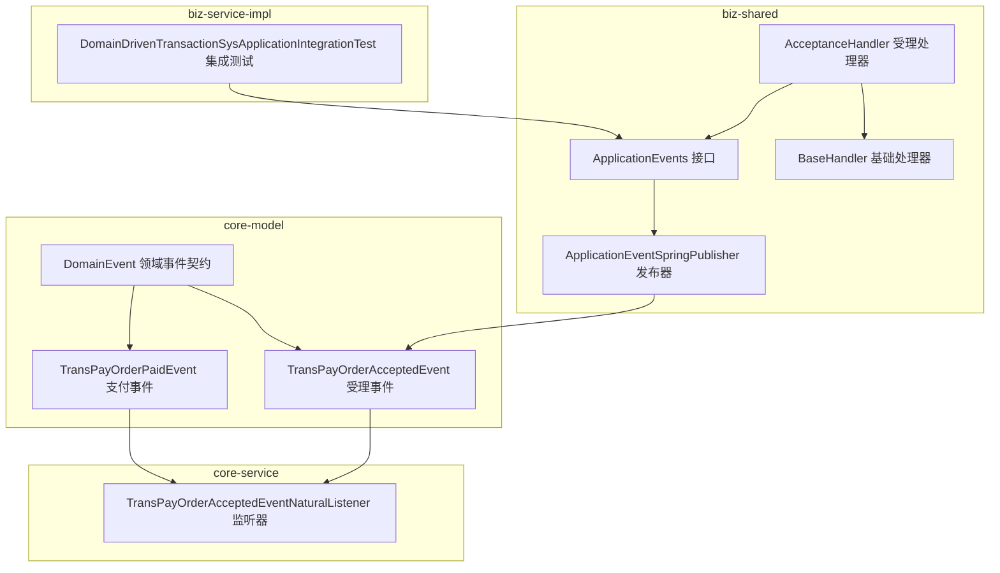
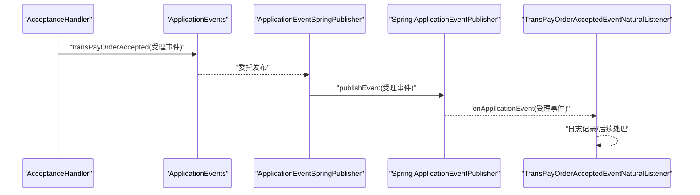
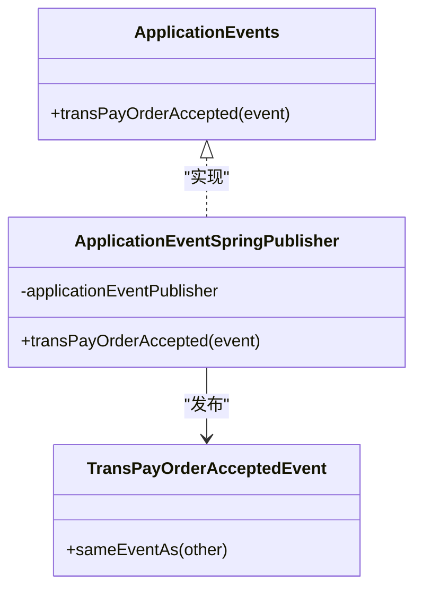
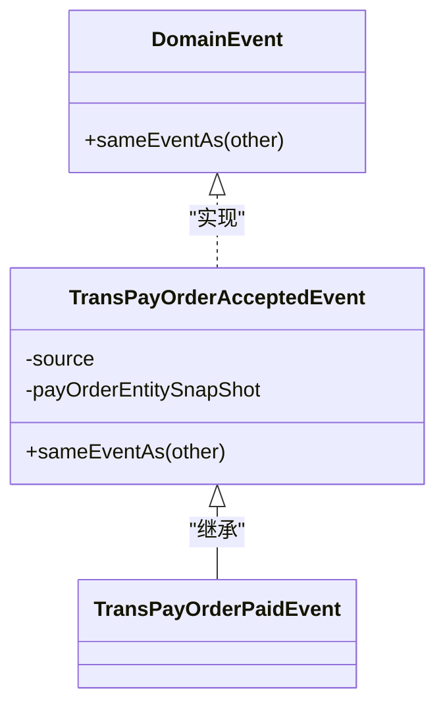
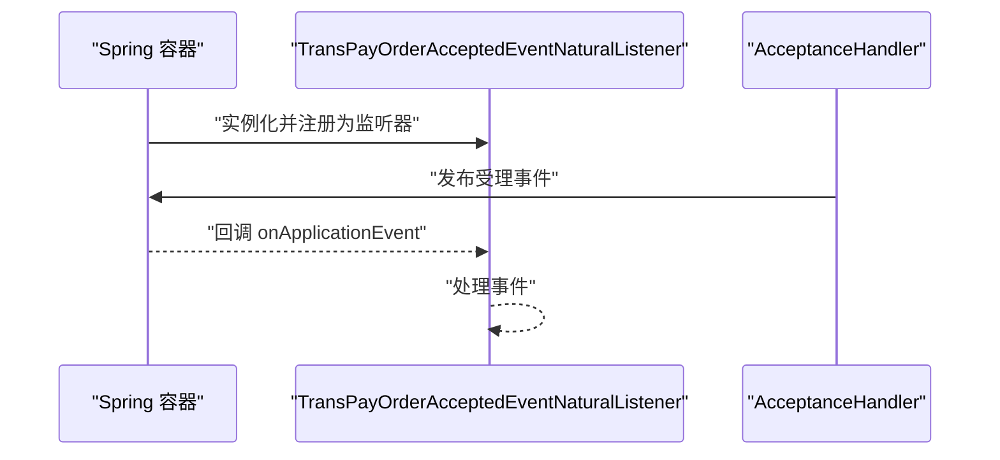
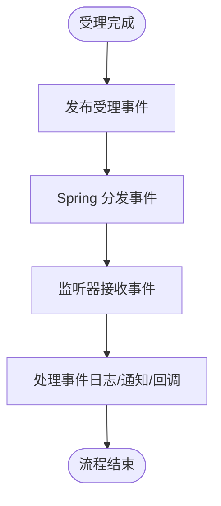
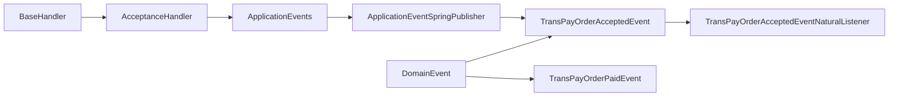

# 事件机制

<cite>
**本文引用的文件**
- [ApplicationEventSpringPublisher.java](file://biz-shared/src/main/java/com/magicliang/transaction/sys/biz/shared/event/ApplicationEventSpringPublisher.java)
- [ApplicationEvents.java](file://biz-shared/src/main/java/com/magicliang/transaction/sys/biz/shared/event/ApplicationEvents.java)
- [TransPayOrderAcceptedEvent.java](file://core-model/src/main/java/com/magicliang/transaction/sys/core/model/event/TransPayOrderAcceptedEvent.java)
- [TransPayOrderPaidEvent.java](file://core-model/src/main/java/com/magicliang/transaction/sys/core/model/event/TransPayOrderPaidEvent.java)
- [TransPayOrderAcceptedEventNaturalListener.java](file://core-service/src/main/java/com/magicliang/transaction/sys/core/event/TransPayOrderAcceptedEventNaturalListener.java)
- [AcceptanceHandler.java](file://biz-shared/src/main/java/com/magicliang/transaction/sys/biz/shared/handler/AcceptanceHandler.java)
- [BaseHandler.java](file://biz-shared/src/main/java/com/magicliang/transaction/sys/biz/shared/handler/BaseHandler.java)
- [DomainEvent.java](file://core-model/src/main/java/com/magicliang/transaction/sys/core/shared/DomainEvent.java)
- [DomainDrivenTransactionSysApplicationIntegrationTest.java](file://biz-service-impl/src/test/integration/java/com/magicliang/transaction/sys/DomainDrivenTransactionSysApplicationIntegrationTest.java)
- [build.gradle](file://build.gradle)
</cite>

## 目录
1. [简介](#简介)
2. [项目结构](#项目结构)
3. [核心组件](#核心组件)
4. [架构概览](#架构概览)
5. [详细组件分析](#详细组件分析)
6. [依赖分析](#依赖分析)
7. [性能考虑](#性能考虑)
8. [故障排查指南](#故障排查指南)
9. [结论](#结论)
10. [附录](#附录)

## 简介
本文件围绕领域驱动交易系统中的事件机制展开，重点解析应用层事件发布与监听的实现方式，涵盖以下主题：
- ApplicationEventSpringPublisher 的事件发布机制：事件创建、传播与监听模式
- ApplicationEvents 事件定义与分类体系：业务事件命名规范与事件载荷设计
- 事件在解耦业务逻辑中的作用：异步处理、跨模块通信与业务流程编排
- 提供具体代码示例路径，帮助开发者理解如何基于事件机制构建松耦合的业务系统

## 项目结构
该系统采用多模块结构，事件机制分布在以下模块：
- biz-shared：应用层事件接口与发布器、处理器基础框架
- core-model：领域事件模型与领域共享契约
- core-service：事件监听器与服务层策略
- biz-service-impl：集成测试与演示入口

图表来源
- [ApplicationEvents.java:15-21](file://biz-shared/src/main/java/com/magicliang/transaction/sys/biz/shared/event/ApplicationEvents.java#L15-L21)
- [ApplicationEventSpringPublisher.java:18-31](file://biz-shared/src/main/java/com/magicliang/transaction/sys/biz/shared/event/ApplicationEventSpringPublisher.java#L18-L31)
- [AcceptanceHandler.java:32-228](file://biz-shared/src/main/java/com/magicliang/transaction/sys/biz/shared/handler/AcceptanceHandler.java#L32-L228)
- [BaseHandler.java:38-121](file://biz-shared/src/main/java/com/magicliang/transaction/sys/biz/shared/handler/BaseHandler.java#L38-L121)
- [DomainEvent.java:9-17](file://core-model/src/main/java/com/magicliang/transaction/sys/core/shared/DomainEvent.java#L9-L17)
- [TransPayOrderAcceptedEvent.java:19-53](file://core-model/src/main/java/com/magicliang/transaction/sys/core/model/event/TransPayOrderAcceptedEvent.java#L19-L53)
- [TransPayOrderPaidEvent.java:14-19](file://core-model/src/main/java/com/magicliang/transaction/sys/core/model/event/TransPayOrderPaidEvent.java#L14-L19)
- [TransPayOrderAcceptedEventNaturalListener.java:19-32](file://core-service/src/main/java/com/magicliang/transaction/sys/core/event/TransPayOrderAcceptedEventNaturalListener.java#L19-L32)
- [DomainDrivenTransactionSysApplicationIntegrationTest.java:64-83](file://biz-service-impl/src/test/integration/java/com/magicliang/transaction/sys/DomainDrivenTransactionSysApplicationIntegrationTest.java#L64-L83)

章节来源
- [build.gradle:15-34](file://build.gradle#L15-L34)

## 核心组件
- ApplicationEvents：应用层事件接口，定义应用级事件契约，隔离业务处理器与具体发布实现
- ApplicationEventSpringPublisher：基于 Spring ApplicationEventPublisher 的事件发布器，负责将领域事件转换为 Spring 事件并发布
- TransPayOrderAcceptedEvent：领域事件模型，继承 Spring ApplicationEvent，承载支付订单受理事件的载荷
- TransPayOrderPaidEvent：受理事件的扩展事件，体现事件的层次化与演进
- TransPayOrderAcceptedEventNaturalListener：事件监听器，实现 ApplicationListener，接收并处理受理事件
- AcceptanceHandler：业务处理器，在处理流程完成后发布受理事件，体现事件驱动的编排能力
- BaseHandler：处理器基类，封装分布式锁、上下文管理与执行流程，为事件发布提供统一的后置钩子

章节来源
- [ApplicationEvents.java:15-21](file://biz-shared/src/main/java/com/magicliang/transaction/sys/biz/shared/event/ApplicationEvents.java#L15-L21)
- [ApplicationEventSpringPublisher.java:18-31](file://biz-shared/src/main/java/com/magicliang/transaction/sys/biz/shared/event/ApplicationEventSpringPublisher.java#L18-L31)
- [TransPayOrderAcceptedEvent.java:19-53](file://core-model/src/main/java/com/magicliang/transaction/sys/core/model/event/TransPayOrderAcceptedEvent.java#L19-L53)
- [TransPayOrderPaidEvent.java:14-19](file://core-model/src/main/java/com/magicliang/transaction/sys/core/model/event/TransPayOrderPaidEvent.java#L14-L19)
- [TransPayOrderAcceptedEventNaturalListener.java:19-32](file://core-service/src/main/java/com/magicliang/transaction/sys/core/event/TransPayOrderAcceptedEventNaturalListener.java#L19-L32)
- [AcceptanceHandler.java:32-228](file://biz-shared/src/main/java/com/magicliang/transaction/sys/biz/shared/handler/AcceptanceHandler.java#L32-L228)
- [BaseHandler.java:38-121](file://biz-shared/src/main/java/com/magicliang/transaction/sys/biz/shared/handler/BaseHandler.java#L38-L121)

## 架构概览
事件驱动架构在系统中的流转如下：
- 业务处理器在完成受理阶段后，通过 ApplicationEvents 接口触发受理事件
- ApplicationEventSpringPublisher 将领域事件发布为 Spring ApplicationEvent
- 事件监听器接收事件并执行相应处理逻辑
- 事件模型与监听器均位于不同模块，实现跨模块通信与解耦

图表来源
- [AcceptanceHandler.java:227-227](file://biz-shared/src/main/java/com/magicliang/transaction/sys/biz/shared/handler/AcceptanceHandler.java#L227-L227)
- [ApplicationEvents.java:20-20](file://biz-shared/src/main/java/com/magicliang/transaction/sys/biz/shared/event/ApplicationEvents.java#L20-L20)
- [ApplicationEventSpringPublisher.java:29-29](file://biz-shared/src/main/java/com/magicliang/transaction/sys/biz/shared/event/ApplicationEventSpringPublisher.java#L29-L29)
- [TransPayOrderAcceptedEventNaturalListener.java:29-29](file://core-service/src/main/java/com/magicliang/transaction/sys/core/event/TransPayOrderAcceptedEventNaturalListener.java#L29-L29)

## 详细组件分析

### ApplicationEventSpringPublisher 事件发布机制
- 角色定位：实现 ApplicationEvents 接口，封装 Spring ApplicationEventPublisher 的发布行为
- 发布流程：接收领域事件对象，调用 publishEvent 完成事件发布
- 设计要点：通过接口隔离具体发布实现，便于替换或扩展发布策略

图表来源
- [ApplicationEvents.java:15-21](file://biz-shared/src/main/java/com/magicliang/transaction/sys/biz/shared/event/ApplicationEvents.java#L15-L21)
- [ApplicationEventSpringPublisher.java:18-31](file://biz-shared/src/main/java/com/magicliang/transaction/sys/biz/shared/event/ApplicationEventSpringPublisher.java#L18-L31)
- [TransPayOrderAcceptedEvent.java:19-53](file://core-model/src/main/java/com/magicliang/transaction/sys/core/model/event/TransPayOrderAcceptedEvent.java#L19-L53)

章节来源
- [ApplicationEventSpringPublisher.java:18-31](file://biz-shared/src/main/java/com/magicliang/transaction/sys/biz/shared/event/ApplicationEventSpringPublisher.java#L18-L31)

### ApplicationEvents 事件定义与分类体系
- 接口职责：定义应用层事件契约，当前包含受理事件的发布方法
- 事件命名规范：采用“业务实体+动作”命名，如 TransPayOrderAcceptedEvent
- 事件载荷设计：事件对象包含事件源与领域实体快照，确保事件不可变性与可识别性
- 事件层次化：TransPayOrderPaidEvent 继承受理事件，体现业务事件的演进关系

图表来源
- [DomainEvent.java:9-17](file://core-model/src/main/java/com/magicliang/transaction/sys/core/shared/DomainEvent.java#L9-L17)
- [TransPayOrderAcceptedEvent.java:19-53](file://core-model/src/main/java/com/magicliang/transaction/sys/core/model/event/TransPayOrderAcceptedEvent.java#L19-L53)
- [TransPayOrderPaidEvent.java:14-19](file://core-model/src/main/java/com/magicliang/transaction/sys/core/model/event/TransPayOrderPaidEvent.java#L14-L19)

章节来源
- [ApplicationEvents.java:15-21](file://biz-shared/src/main/java/com/magicliang/transaction/sys/biz/shared/event/ApplicationEvents.java#L15-L21)
- [TransPayOrderAcceptedEvent.java:19-53](file://core-model/src/main/java/com/magicliang/transaction/sys/core/model/event/TransPayOrderAcceptedEvent.java#L19-L53)
- [TransPayOrderPaidEvent.java:14-19](file://core-model/src/main/java/com/magicliang/transaction/sys/core/model/event/TransPayOrderPaidEvent.java#L14-L19)

### 事件监听与处理
- 监听器实现：TransPayOrderAcceptedEventNaturalListener 实现 ApplicationListener，接收受理事件并执行处理
- 监听器注册：通过 Spring 组件扫描自动注册为监听器 Bean
- 处理流程：监听器在收到事件后进行日志记录与后续处理

图表来源
- [TransPayOrderAcceptedEventNaturalListener.java:19-32](file://core-service/src/main/java/com/magicliang/transaction/sys/core/event/TransPayOrderAcceptedEventNaturalListener.java#L19-L32)
- [AcceptanceHandler.java:227-227](file://biz-shared/src/main/java/com/magicliang/transaction/sys/biz/shared/handler/AcceptanceHandler.java#L227-L227)

章节来源
- [TransPayOrderAcceptedEventNaturalListener.java:19-32](file://core-service/src/main/java/com/magicliang/transaction/sys/core/event/TransPayOrderAcceptedEventNaturalListener.java#L19-L32)

### 事件在业务流程中的应用
- 解耦业务逻辑：处理器仅通过 ApplicationEvents 发布事件，不关心监听器实现
- 异步处理：事件监听器可独立处理，避免阻塞主业务流程
- 跨模块通信：事件模型与监听器位于不同模块，实现模块间松耦合通信
- 业务流程编排：受理完成后发布事件，触发后续通知、回调等流程

图表来源
- [AcceptanceHandler.java:227-227](file://biz-shared/src/main/java/com/magicliang/transaction/sys/biz/shared/handler/AcceptanceHandler.java#L227-L227)
- [TransPayOrderAcceptedEventNaturalListener.java:29-29](file://core-service/src/main/java/com/magicliang/transaction/sys/core/event/TransPayOrderAcceptedEventNaturalListener.java#L29-L29)

章节来源
- [AcceptanceHandler.java:227-227](file://biz-shared/src/main/java/com/magicliang/transaction/sys/biz/shared/handler/AcceptanceHandler.java#L227-L227)
- [BaseHandler.java:113-115](file://biz-shared/src/main/java/com/magicliang/transaction/sys/biz/shared/handler/BaseHandler.java#L113-L115)

### 事件定义、发布与订阅示例路径
- 定义事件：[TransPayOrderAcceptedEvent.java:19-53](file://core-model/src/main/java/com/magicliang/transaction/sys/core/model/event/TransPayOrderAcceptedEvent.java#L19-L53)
- 发布事件：[AcceptanceHandler.java:227-227](file://biz-shared/src/main/java/com/magicliang/transaction/sys/biz/shared/handler/AcceptanceHandler.java#L227-L227) -> [ApplicationEvents.java:20-20](file://biz-shared/src/main/java/com/magicliang/transaction/sys/biz/shared/event/ApplicationEvents.java#L20-L20) -> [ApplicationEventSpringPublisher.java:29-29](file://biz-shared/src/main/java/com/magicliang/transaction/sys/biz/shared/event/ApplicationEventSpringPublisher.java#L29-L29)
- 订阅事件：[TransPayOrderAcceptedEventNaturalListener.java:29-29](file://core-service/src/main/java/com/magicliang/transaction/sys/core/event/TransPayOrderAcceptedEventNaturalListener.java#L29-L29)

章节来源
- [TransPayOrderAcceptedEvent.java:19-53](file://core-model/src/main/java/com/magicliang/transaction/sys/core/model/event/TransPayOrderAcceptedEvent.java#L19-L53)
- [AcceptanceHandler.java:227-227](file://biz-shared/src/main/java/com/magicliang/transaction/sys/biz/shared/handler/AcceptanceHandler.java#L227-L227)
- [ApplicationEvents.java:20-20](file://biz-shared/src/main/java/com/magicliang/transaction/sys/biz/shared/event/ApplicationEvents.java#L20-L20)
- [ApplicationEventSpringPublisher.java:29-29](file://biz-shared/src/main/java/com/magicliang/transaction/sys/biz/shared/event/ApplicationEventSpringPublisher.java#L29-L29)
- [TransPayOrderAcceptedEventNaturalListener.java:29-29](file://core-service/src/main/java/com/magicliang/transaction/sys/core/event/TransPayOrderAcceptedEventNaturalListener.java#L29-L29)

## 依赖分析
- 模块间依赖：biz-shared 依赖 core-model（事件模型），core-service 依赖 core-model（事件模型与监听器）
- Spring 集成：ApplicationEventSpringPublisher 依赖 Spring ApplicationEventPublisher；监听器通过 @Component 注册
- 处理器依赖：AcceptanceHandler 通过 ApplicationEvents 接口依赖发布器，BaseHandler 提供统一的执行框架

图表来源
- [BaseHandler.java:38-121](file://biz-shared/src/main/java/com/magicliang/transaction/sys/biz/shared/handler/BaseHandler.java#L38-L121)
- [AcceptanceHandler.java:32-228](file://biz-shared/src/main/java/com/magicliang/transaction/sys/biz/shared/handler/AcceptanceHandler.java#L32-L228)
- [ApplicationEvents.java:15-21](file://biz-shared/src/main/java/com/magicliang/transaction/sys/biz/shared/event/ApplicationEvents.java#L15-L21)
- [ApplicationEventSpringPublisher.java:18-31](file://biz-shared/src/main/java/com/magicliang/transaction/sys/biz/shared/event/ApplicationEventSpringPublisher.java#L18-L31)
- [TransPayOrderAcceptedEvent.java:19-53](file://core-model/src/main/java/com/magicliang/transaction/sys/core/model/event/TransPayOrderAcceptedEvent.java#L19-L53)
- [TransPayOrderPaidEvent.java:14-19](file://core-model/src/main/java/com/magicliang/transaction/sys/core/model/event/TransPayOrderPaidEvent.java#L14-L19)
- [TransPayOrderAcceptedEventNaturalListener.java:19-32](file://core-service/src/main/java/com/magicliang/transaction/sys/core/event/TransPayOrderAcceptedEventNaturalListener.java#L19-L32)
- [DomainEvent.java:9-17](file://core-model/src/main/java/com/magicliang/transaction/sys/core/shared/DomainEvent.java#L9-L17)

章节来源
- [build.gradle:165-284](file://build.gradle#L165-L284)

## 性能考虑
- 事件发布成本：Spring ApplicationEventPublisher 的发布为同步阻塞，建议在处理器后置阶段发布，避免阻塞主业务流程
- 监听器处理：监听器应避免重 IO 操作，必要时可异步化或引入消息队列
- 事件载荷：事件载荷仅包含必要字段，避免过大对象导致序列化与传输开销
- 幂等性：结合处理器的幂等键与分布式锁，确保事件重复发布不会产生副作用

## 故障排查指南
- 事件未被监听：确认监听器类已标注 @Component 且被组件扫描到
- 事件未发布：检查处理器是否在 postExecution 阶段调用 ApplicationEvents 发布事件
- 事件类型不匹配：确保监听器泛型与事件类型一致，避免类型擦除导致的匹配失败
- 集成测试验证：可通过集成测试手动触发事件发布，验证发布与监听链路

章节来源
- [TransPayOrderAcceptedEventNaturalListener.java:19-32](file://core-service/src/main/java/com/magicliang/transaction/sys/core/event/TransPayOrderAcceptedEventNaturalListener.java#L19-L32)
- [AcceptanceHandler.java:227-227](file://biz-shared/src/main/java/com/magicliang/transaction/sys/biz/shared/handler/AcceptanceHandler.java#L227-L227)
- [DomainDrivenTransactionSysApplicationIntegrationTest.java:78-83](file://biz-service-impl/src/test/integration/java/com/magicliang/transaction/sys/DomainDrivenTransactionSysApplicationIntegrationTest.java#L78-L83)

## 结论
该事件机制通过 ApplicationEvents 接口与 ApplicationEventSpringPublisher 发布器，将领域事件与 Spring 事件桥接，实现了业务处理器与监听器的解耦。事件模型采用领域事件契约与不可变快照，确保事件的可识别性与一致性。监听器通过 Spring 自动注册，实现跨模块通信与业务流程编排。整体设计简洁、可扩展，适合在复杂业务场景中构建松耦合的事件驱动架构。

## 附录
- 事件命名规范：采用“业务实体+动作”的语义化命名，如 TransPayOrderAcceptedEvent
- 事件载荷设计：事件对象包含事件源与领域实体快照，避免直接持有可变实体引用
- 监听器注册：通过 @Component 注解自动注册为 Spring 监听器 Bean
- 集成测试：可在集成测试中手动构造事件并发布，验证事件链路