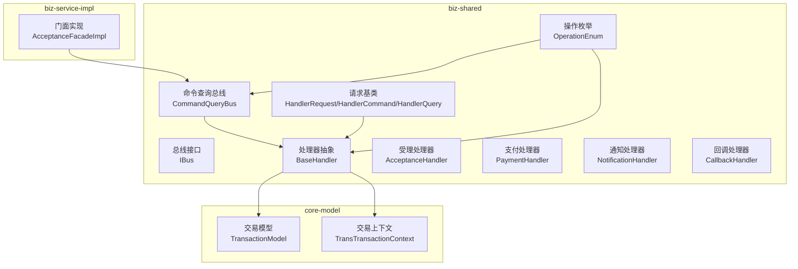
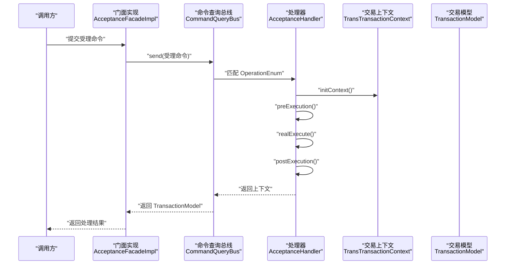
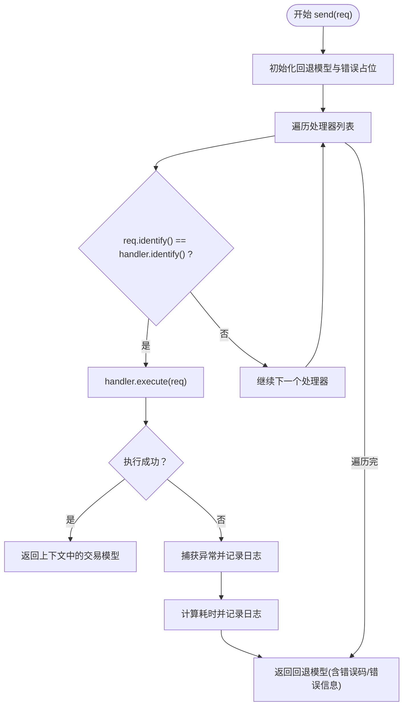
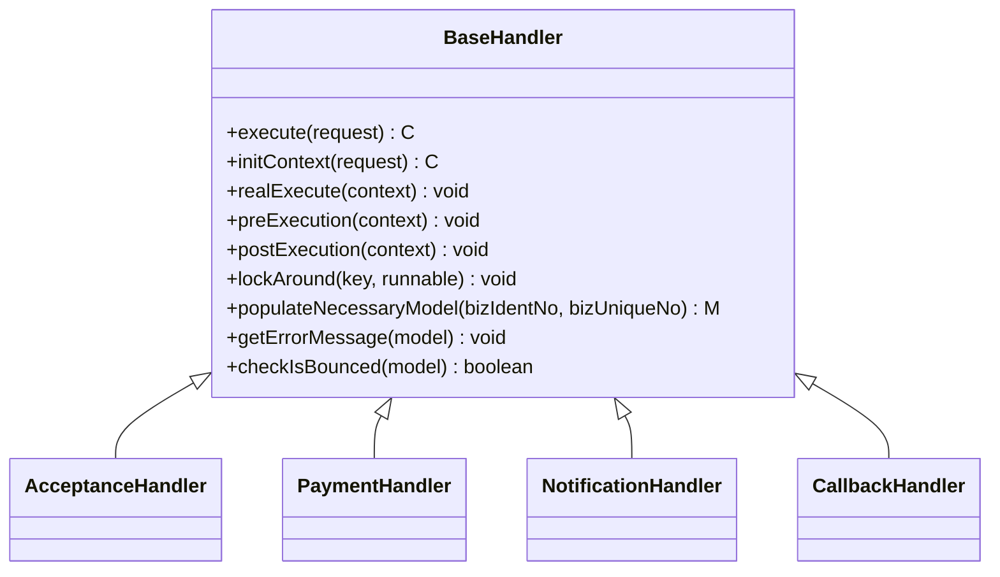
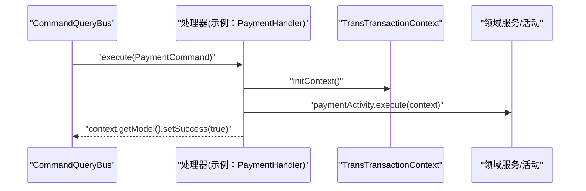
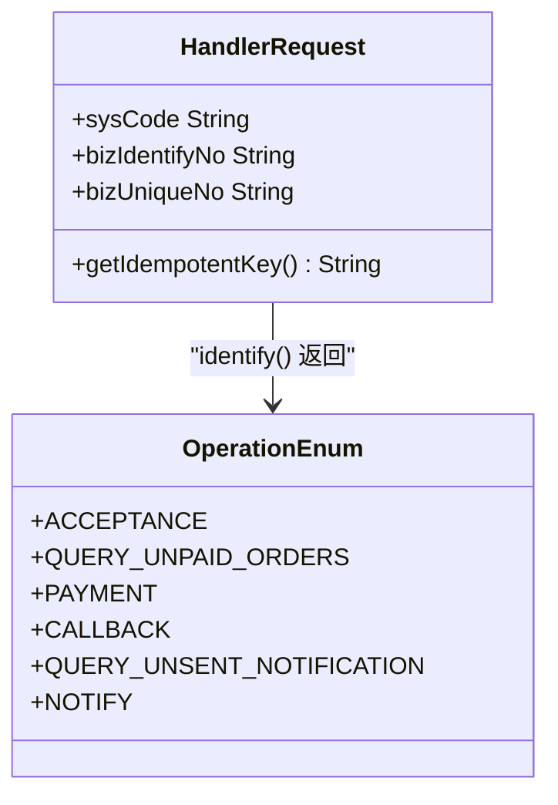
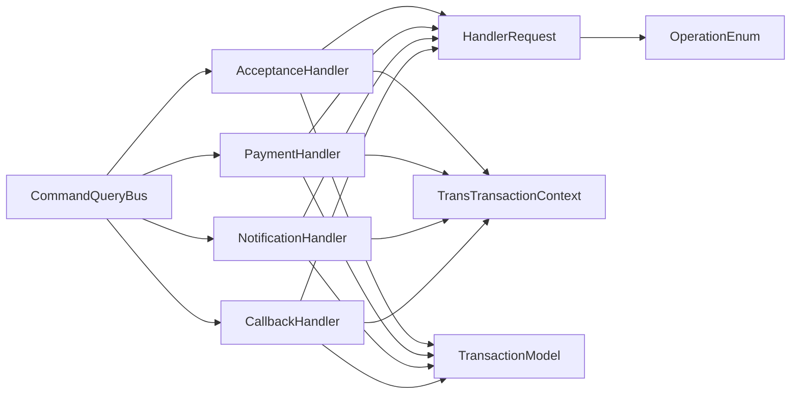

# 命令查询总线

<cite>
**本文引用的文件**   
- [CommandQueryBus.java](file://biz-shared/src/main/java/com/magicliang/transaction/sys/biz/shared/locator/CommandQueryBus.java)
- [IBus.java](file://biz-shared/src/main/java/com/magicliang/transaction/sys/biz/shared/locator/IBus.java)
- [HandlerRequest.java](file://biz-shared/src/main/java/com/magicliang/transaction/sys/biz/shared/request/HandlerRequest.java)
- [HandlerCommand.java](file://biz-shared/src/main/java/com/magicliang/transaction/sys/biz/shared/request/HandlerCommand.java)
- [HandlerQuery.java](file://biz-shared/src/main/java/com/magicliang/transaction/sys/biz/shared/request/HandlerQuery.java)
- [OperationEnum.java](file://biz-shared/src/main/java/com/magicliang/transaction/sys/biz/shared/enums/OperationEnum.java)
- [BaseHandler.java](file://biz-shared/src/main/java/com/magicliang/transaction/sys/biz/shared/handler/BaseHandler.java)
- [AcceptanceHandler.java](file://biz-shared/src/main/java/com/magicliang/transaction/sys/biz/shared/handler/AcceptanceHandler.java)
- [PaymentHandler.java](file://biz-shared/src/main/java/com/magicliang/transaction/sys/biz/shared/handler/PaymentHandler.java)
- [NotificationHandler.java](file://biz-shared/src/main/java/com/magicliang/transaction/sys/biz/shared/handler/NotificationHandler.java)
- [CallbackHandler.java](file://biz-shared/src/main/java/com/magicliang/transaction/sys/biz/shared/handler/CallbackHandler.java)
- [TransactionModel.java](file://core-model/src/main/java/com/magicliang/transaction/sys/core/model/context/TransactionModel.java)
- [TransTransactionContext.java](file://core-model/src/main/java/com/magicliang/transaction/sys/core/model/context/TransTransactionContext.java)
- [AcceptanceFacadeImpl.java](file://biz-service-impl/src/main/java/com/magicliang/transaction/sys/biz/service/impl/facade/impl/AcceptanceFacadeImpl.java)
</cite>

## 目录
1. [引言](#引言)
2. [项目结构](#项目结构)
3. [核心组件](#核心组件)
4. [架构总览](#架构总览)
5. [详细组件分析](#详细组件分析)
6. [依赖分析](#依赖分析)
7. [性能考量](#性能考量)
8. [故障排查指南](#故障排查指南)
9. [结论](#结论)
10. [附录](#附录)

## 引言
本文件围绕领域驱动交易系统中的“命令查询总线”模式展开，系统性解析 CommandQueryBus 的路由机制与消息分发策略，阐述 IBus 接口的抽象能力与统一处理接口设计，说明命令与查询在该总线中的角色定位与协作方式。文档同时解释总线在 DDD 中的作用：命令处理、查询执行与业务逻辑编排，并给出基于总线模式的实践建议与扩展路径，帮助读者构建可维护、可演进的业务架构。

## 项目结构
本项目采用模块化组织，命令查询总线相关代码主要位于 biz-shared 模块的 locator、request、handler 与 enums 包；核心领域模型位于 core-model 模块；对外门面实现位于 biz-service-impl 模块。总线模式通过统一的请求基类与处理器抽象，将命令/查询路由到对应处理器，再由处理器编排领域活动与服务，最终产出统一的交易模型。

图表来源
- [CommandQueryBus.java:1-79](file://biz-shared/src/main/java/com/magicliang/transaction/sys/biz/shared/locator/CommandQueryBus.java#L1-L79)
- [IBus.java:1-26](file://biz-shared/src/main/java/com/magicliang/transaction/sys/biz/shared/locator/IBus.java#L1-L26)
- [HandlerRequest.java:1-46](file://biz-shared/src/main/java/com/magicliang/transaction/sys/biz/shared/request/HandlerRequest.java#L1-L46)
- [HandlerCommand.java:1-15](file://biz-shared/src/main/java/com/magicliang/transaction/sys/biz/shared/request/HandlerCommand.java#L1-L15)
- [HandlerQuery.java:1-14](file://biz-shared/src/main/java/com/magicliang/transaction/sys/biz/shared/request/HandlerQuery.java#L1-L14)
- [OperationEnum.java:1-97](file://biz-shared/src/main/java/com/magicliang/transaction/sys/biz/shared/enums/OperationEnum.java#L1-L97)
- [BaseHandler.java:1-244](file://biz-shared/src/main/java/com/magicliang/transaction/sys/biz/shared/handler/BaseHandler.java#L1-L244)
- [AcceptanceHandler.java:1-231](file://biz-shared/src/main/java/com/magicliang/transaction/sys/biz/shared/handler/AcceptanceHandler.java#L1-L231)
- [PaymentHandler.java:1-139](file://biz-shared/src/main/java/com/magicliang/transaction/sys/biz/shared/handler/PaymentHandler.java#L1-L139)
- [NotificationHandler.java:1-139](file://biz-shared/src/main/java/com/magicliang/transaction/sys/biz/shared/handler/NotificationHandler.java#L1-L139)
- [CallbackHandler.java:1-190](file://biz-shared/src/main/java/com/magicliang/transaction/sys/biz/shared/handler/CallbackHandler.java#L1-L190)
- [TransactionModel.java:1-44](file://core-model/src/main/java/com/magicliang/transaction/sys/core/model/context/TransactionModel.java#L1-L44)
- [TransTransactionContext.java:1-139](file://core-model/src/main/java/com/magicliang/transaction/sys/core/model/context/TransTransactionContext.java#L1-L139)
- [AcceptanceFacadeImpl.java:1-33](file://biz-service-impl/src/main/java/com/magicliang/transaction/sys/biz/service/impl/facade/impl/AcceptanceFacadeImpl.java#L1-L33)

章节来源
- [CommandQueryBus.java:1-79](file://biz-shared/src/main/java/com/magicliang/transaction/sys/biz/shared/locator/CommandQueryBus.java#L1-L79)
- [IBus.java:1-26](file://biz-shared/src/main/java/com/magicliang/transaction/sys/biz/shared/locator/IBus.java#L1-L26)
- [HandlerRequest.java:1-46](file://biz-shared/src/main/java/com/magicliang/transaction/sys/biz/shared/request/HandlerRequest.java#L1-L46)
- [HandlerCommand.java:1-15](file://biz-shared/src/main/java/com/magicliang/transaction/sys/biz/shared/request/HandlerCommand.java#L1-L15)
- [HandlerQuery.java:1-14](file://biz-shared/src/main/java/com/magicliang/transaction/sys/biz/shared/request/HandlerQuery.java#L1-L14)
- [OperationEnum.java:1-97](file://biz-shared/src/main/java/com/magicliang/transaction/sys/biz/shared/enums/OperationEnum.java#L1-L97)
- [BaseHandler.java:1-244](file://biz-shared/src/main/java/com/magicliang/transaction/sys/biz/shared/handler/BaseHandler.java#L1-L244)
- [AcceptanceHandler.java:1-231](file://biz-shared/src/main/java/com/magicliang/transaction/sys/biz/shared/handler/AcceptanceHandler.java#L1-L231)
- [PaymentHandler.java:1-139](file://biz-shared/src/main/java/com/magicliang/transaction/sys/biz/shared/handler/PaymentHandler.java#L1-L139)
- [NotificationHandler.java:1-139](file://biz-shared/src/main/java/com/magicliang/transaction/sys/biz/shared/handler/NotificationHandler.java#L1-L139)
- [CallbackHandler.java:1-190](file://biz-shared/src/main/java/com/magicliang/transaction/sys/biz/shared/handler/CallbackHandler.java#L1-L190)
- [TransactionModel.java:1-44](file://core-model/src/main/java/com/magicliang/transaction/sys/core/model/context/TransactionModel.java#L1-L44)
- [TransTransactionContext.java:1-139](file://core-model/src/main/java/com/magicliang/transaction/sys/core/model/context/TransTransactionContext.java#L1-L139)
- [AcceptanceFacadeImpl.java:1-33](file://biz-service-impl/src/main/java/com/magicliang/transaction/sys/biz/service/impl/facade/impl/AcceptanceFacadeImpl.java#L1-L33)

## 核心组件
- 统一请求基类与命令/查询抽象
  - HandlerRequest 定义幂等键、上游系统标识等通用字段，提供幂等键拼装能力。
  - HandlerCommand/HandlerQuery 作为命令与查询的抽象基类，便于总线识别与路由。
- 操作枚举 OperationEnum
  - 定义受理、支付、回调、通知、查询等操作类型，作为处理器识别与总线路由的关键标识。
- 处理器抽象 BaseHandler
  - 提供 execute 生命周期：加锁、初始化上下文、前置/真执行/后置、解锁与上下文清理。
  - 提供幂等校验、错误码映射、锁回调等通用能力。
- 交易模型与上下文
  - TransactionModel 封装支付订单、成功标记、幂等标记与错误信息。
  - TransTransactionContext 作为跨活动的上下文容器，承载各阶段请求/响应与完成状态。
- 总线接口与实现
  - IBus 抽象总线的统一发送接口。
  - CommandQueryBus 实现 send，遍历处理器集合，按请求识别码匹配并执行，捕获异常并记录日志，最终返回统一交易模型。

章节来源
- [HandlerRequest.java:1-46](file://biz-shared/src/main/java/com/magicliang/transaction/sys/biz/shared/request/HandlerRequest.java#L1-L46)
- [HandlerCommand.java:1-15](file://biz-shared/src/main/java/com/magicliang/transaction/sys/biz/shared/request/HandlerCommand.java#L1-L15)
- [HandlerQuery.java:1-14](file://biz-shared/src/main/java/com/magicliang/transaction/sys/biz/shared/request/HandlerQuery.java#L1-L14)
- [OperationEnum.java:1-97](file://biz-shared/src/main/java/com/magicliang/transaction/sys/biz/shared/enums/OperationEnum.java#L1-L97)
- [BaseHandler.java:1-244](file://biz-shared/src/main/java/com/magicliang/transaction/sys/biz/shared/handler/BaseHandler.java#L1-L244)
- [TransactionModel.java:1-44](file://core-model/src/main/java/com/magicliang/transaction/sys/core/model/context/TransactionModel.java#L1-L44)
- [TransTransactionContext.java:1-139](file://core-model/src/main/java/com/magicliang/transaction/sys/core/model/context/TransTransactionContext.java#L1-L139)
- [IBus.java:1-26](file://biz-shared/src/main/java/com/magicliang/transaction/sys/biz/shared/locator/IBus.java#L1-L26)
- [CommandQueryBus.java:1-79](file://biz-shared/src/main/java/com/magicliang/transaction/sys/biz/shared/locator/CommandQueryBus.java#L1-L79)

## 架构总览
命令查询总线通过 IBus 统一入口，CommandQueryBus 实现 send 方法，遍历注入的处理器列表，依据 HandlerRequest.identify() 与 OperationEnum 的匹配关系选择对应处理器执行。处理器在统一生命周期内完成幂等、上下文初始化、领域活动编排与结果回填，最终返回 TransactionModel。门面层仅负责将命令对象交由总线处理，实现业务逻辑的解耦与扩展。

图表来源
- [AcceptanceFacadeImpl.java:28-31](file://biz-service-impl/src/main/java/com/magicliang/transaction/sys/biz/service/impl/facade/impl/AcceptanceFacadeImpl.java#L28-L31)
- [CommandQueryBus.java:42-77](file://biz-shared/src/main/java/com/magicliang/transaction/sys/biz/shared/locator/CommandQueryBus.java#L42-L77)
- [AcceptanceHandler.java:53-79](file://biz-shared/src/main/java/com/magicliang/transaction/sys/biz/shared/handler/AcceptanceHandler.java#L53-L79)
- [BaseHandler.java:93-121](file://biz-shared/src/main/java/com/magicliang/transaction/sys/biz/shared/handler/BaseHandler.java#L93-L121)
- [TransTransactionContext.java:1-139](file://core-model/src/main/java/com/magicliang/transaction/sys/core/model/context/TransTransactionContext.java#L1-L139)
- [TransactionModel.java:1-44](file://core-model/src/main/java/com/magicliang/transaction/sys/core/model/context/TransactionModel.java#L1-L44)

## 详细组件分析

### CommandQueryBus：路由与分发
- 路由机制
  - 通过遍历注入的处理器列表，比较请求的识别码与处理器的 identify() 返回值，完成命令/查询到处理器的匹配。
- 分发策略
  - 匹配成功后调用处理器 execute，返回上下文中的交易模型；若异常被捕获，填充错误码与错误信息并返回回退模型。
- 统一返回
  - 无论成功或异常，均返回统一的 TransactionModel，便于上层门面与调用方一致处理。

图表来源
- [CommandQueryBus.java:42-77](file://biz-shared/src/main/java/com/magicliang/transaction/sys/biz/shared/locator/CommandQueryBus.java#L42-L77)

章节来源
- [CommandQueryBus.java:1-79](file://biz-shared/src/main/java/com/magicliang/transaction/sys/biz/shared/locator/CommandQueryBus.java#L1-L79)

### IBus 接口：抽象与契约
- 设计理念
  - 以泛型约束请求与交易模型，确保 send 方法签名稳定、类型安全。
- 抽象能力
  - 为不同总线实现提供统一契约，支持替换与扩展（例如引入异步总线、带重试/熔断的总线）。

章节来源
- [IBus.java:1-26](file://biz-shared/src/main/java/com/magicliang/transaction/sys/biz/shared/locator/IBus.java#L1-L26)

### BaseHandler：生命周期与幂等
- 生命周期
  - 加锁（基于幂等键）、初始化上下文、前置执行、真实执行、后置执行、解锁与上下文清理。
- 幂等与错误处理
  - 通过幂等键保证同一请求在执行期内不重复处理；对终态错误进行映射与提示。
- 通用能力
  - 提供锁回调、上下文清理、错误码填充等工具方法，降低处理器实现复杂度。

图表来源
- [BaseHandler.java:37-121](file://biz-shared/src/main/java/com/magicliang/transaction/sys/biz/shared/handler/BaseHandler.java#L37-L121)
- [AcceptanceHandler.java:32-64](file://biz-shared/src/main/java/com/magicliang/transaction/sys/biz/shared/handler/AcceptanceHandler.java#L32-L64)
- [PaymentHandler.java:28-57](file://biz-shared/src/main/java/com/magicliang/transaction/sys/biz/shared/handler/PaymentHandler.java#L28-L57)
- [NotificationHandler.java:29-60](file://biz-shared/src/main/java/com/magicliang/transaction/sys/biz/shared/handler/NotificationHandler.java#L29-L60)
- [CallbackHandler.java:32-61](file://biz-shared/src/main/java/com/magicliang/transaction/sys/biz/shared/handler/CallbackHandler.java#L32-L61)

章节来源
- [BaseHandler.java:1-244](file://biz-shared/src/main/java/com/magicliang/transaction/sys/biz/shared/handler/BaseHandler.java#L1-L244)

### 处理器实现：受理、支付、通知、回调
- 受理处理器
  - 生成 ID 与受理实体，执行受理活动，设置成功标记；幂等命中时直接回填模型并结束。
- 支付处理器
  - 直接执行支付活动，支持外部传入完整模型或按幂等键查询完整模型；校验终态错误。
- 通知处理器
  - 执行通知活动，支持外部传入完整模型或按幂等键查询完整模型；对通知请求重试次数进行幂等标记。
- 回调处理器
  - 根据回调状态更新支付订单与请求状态，校验退票状态并提前结束；组装成功/失败时间与渠道号等。

图表来源
- [PaymentHandler.java:64-70](file://biz-shared/src/main/java/com/magicliang/transaction/sys/biz/shared/handler/PaymentHandler.java#L64-L70)
- [CommandQueryBus.java:52-54](file://biz-shared/src/main/java/com/magicliang/transaction/sys/biz/shared/locator/CommandQueryBus.java#L52-L54)

章节来源
- [AcceptanceHandler.java:1-231](file://biz-shared/src/main/java/com/magicliang/transaction/sys/biz/shared/handler/AcceptanceHandler.java#L1-L231)
- [PaymentHandler.java:1-139](file://biz-shared/src/main/java/com/magicliang/transaction/sys/biz/shared/handler/PaymentHandler.java#L1-L139)
- [NotificationHandler.java:1-139](file://biz-shared/src/main/java/com/magicliang/transaction/sys/biz/shared/handler/NotificationHandler.java#L1-L139)
- [CallbackHandler.java:1-190](file://biz-shared/src/main/java/com/magicliang/transaction/sys/biz/shared/handler/CallbackHandler.java#L1-L190)

### 请求与枚举：识别与路由
- HandlerRequest
  - 提供幂等键拼装与通用业务标识字段，支撑总线与处理器的幂等与路由判断。
- OperationEnum
  - 为每种业务操作分配唯一枚举值，作为处理器 identify() 的返回值，用于总线匹配。

图表来源
- [HandlerRequest.java:42-44](file://biz-shared/src/main/java/com/magicliang/transaction/sys/biz/shared/request/HandlerRequest.java#L42-L44)
- [OperationEnum.java:18-49](file://biz-shared/src/main/java/com/magicliang/transaction/sys/biz/shared/enums/OperationEnum.java#L18-L49)

章节来源
- [HandlerRequest.java:1-46](file://biz-shared/src/main/java/com/magicliang/transaction/sys/biz/shared/request/HandlerRequest.java#L1-L46)
- [OperationEnum.java:1-97](file://biz-shared/src/main/java/com/magicliang/transaction/sys/biz/shared/enums/OperationEnum.java#L1-L97)

### 交易模型与上下文：统一输出与跨活动编排
- TransactionModel
  - 统一承载支付订单、成功标记、幂等标记与错误信息，作为总线与门面层的稳定输出。
- TransTransactionContext
  - 跨活动的上下文容器，包含各阶段请求/响应与完成状态，支持活动间数据传递与状态控制。

章节来源
- [TransactionModel.java:1-44](file://core-model/src/main/java/com/magicliang/transaction/sys/core/model/context/TransactionModel.java#L1-L44)
- [TransTransactionContext.java:1-139](file://core-model/src/main/java/com/magicliang/transaction/sys/core/model/context/TransTransactionContext.java#L1-L139)

### 门面层：解耦与扩展
- 门面实现仅负责将命令对象交由总线处理，不关心具体路由细节，实现业务逻辑的解耦与扩展。
- 示例：受理门面实现通过总线发送受理命令，获得统一交易模型返回。

章节来源
- [AcceptanceFacadeImpl.java:28-31](file://biz-service-impl/src/main/java/com/magicliang/transaction/sys/biz/service/impl/facade/impl/AcceptanceFacadeImpl.java#L28-L31)

## 依赖分析
- 总线与处理器
  - CommandQueryBus 注入处理器列表，按识别码匹配执行；处理器依赖领域活动与服务，最终产出交易模型。
- 请求与枚举
  - HandlerRequest 与 OperationEnum 为路由提供稳定契约；处理器通过 identify() 与枚举值关联。
- 上下文与模型
  - 处理器在统一生命周期内维护上下文与模型，保证跨活动一致性。

图表来源
- [CommandQueryBus.java:32-33](file://biz-shared/src/main/java/com/magicliang/transaction/sys/biz/shared/locator/CommandQueryBus.java#L32-L33)
- [AcceptanceHandler.java:32-33](file://biz-shared/src/main/java/com/magicliang/transaction/sys/biz/shared/handler/AcceptanceHandler.java#L32-L33)
- [PaymentHandler.java:28-29](file://biz-shared/src/main/java/com/magicliang/transaction/sys/biz/shared/handler/PaymentHandler.java#L28-L29)
- [NotificationHandler.java:29-30](file://biz-shared/src/main/java/com/magicliang/transaction/sys/biz/shared/handler/NotificationHandler.java#L29-L30)
- [CallbackHandler.java:32-33](file://biz-shared/src/main/java/com/magicliang/transaction/sys/biz/shared/handler/CallbackHandler.java#L32-L33)
- [HandlerRequest.java:18-18](file://biz-shared/src/main/java/com/magicliang/transaction/sys/biz/shared/request/HandlerRequest.java#L18-L18)
- [OperationEnum.java:18-49](file://biz-shared/src/main/java/com/magicliang/transaction/sys/biz/shared/enums/OperationEnum.java#L18-L49)
- [TransTransactionContext.java:27-47](file://core-model/src/main/java/com/magicliang/transaction/sys/core/model/context/TransTransactionContext.java#L27-L47)
- [TransactionModel.java:17-43](file://core-model/src/main/java/com/magicliang/transaction/sys/core/model/context/TransactionModel.java#L17-L43)

章节来源
- [CommandQueryBus.java:1-79](file://biz-shared/src/main/java/com/magicliang/transaction/sys/biz/shared/locator/CommandQueryBus.java#L1-L79)
- [BaseHandler.java:1-244](file://biz-shared/src/main/java/com/magicliang/transaction/sys/biz/shared/handler/BaseHandler.java#L1-L244)

## 性能考量
- 路由开销
  - 总线遍历处理器列表进行匹配，处理器数量增长将带来线性查找成本；可通过索引化或注册表优化。
- 幂等与锁
  - 基于幂等键的分布式锁保护所有请求，避免重复执行；合理设置锁过期时间与粒度，平衡并发与一致性。
- 日志与监控
  - 总线记录执行耗时与错误日志，建议结合指标埋点与链路追踪，定位慢调用与异常路径。

## 故障排查指南
- 常见问题
  - 未匹配到处理器：确认请求识别码与处理器 identify() 返回值一致，检查 OperationEnum 定义。
  - 幂等命中导致提前结束：检查 populateNecessaryModel 与 getErrorMessage 的逻辑，确保幂等键正确。
  - 终态错误映射：核对 getErrorMessage 与 checkIsBounced 的状态判断与错误码设置。
- 排查步骤
  - 查看总线日志与耗时统计，定位异常处理器与错误码来源。
  - 核对请求幂等键拼装与上游业务号组合，确保全局唯一。
  - 检查处理器生命周期钩子（前置/后置）是否影响上下文状态。

章节来源
- [CommandQueryBus.java:52-71](file://biz-shared/src/main/java/com/magicliang/transaction/sys/biz/shared/locator/CommandQueryBus.java#L52-L71)
- [BaseHandler.java:198-232](file://biz-shared/src/main/java/com/magicliang/transaction/sys/biz/shared/handler/BaseHandler.java#L198-L232)

## 结论
命令查询总线通过 IBus 统一入口与 CommandQueryBus 的路由分发，将命令/查询请求映射到对应的处理器，借助 BaseHandler 的统一生命周期与幂等机制，实现领域活动的有序编排与稳定的交易模型输出。该模式有效解耦门面与业务逻辑，便于扩展新的处理器与业务场景，是构建可维护领域驱动交易系统的重要基础设施。

## 附录
- 使用建议
  - 新增业务场景时，优先新增处理器并实现 identify() 与 realExecute，复用 BaseHandler 生命周期与幂等能力。
  - 保持 OperationEnum 与处理器识别码一致，避免路由失败。
  - 对关键路径增加监控与告警，结合日志定位问题。