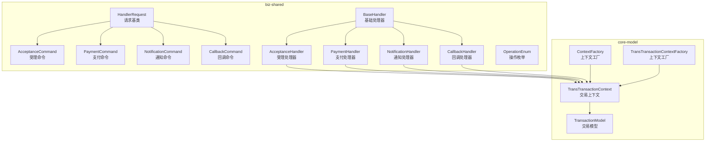
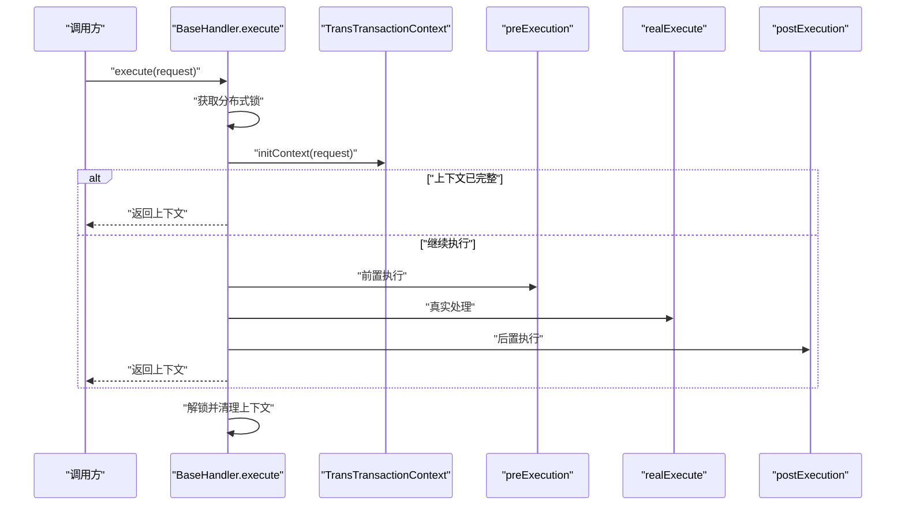
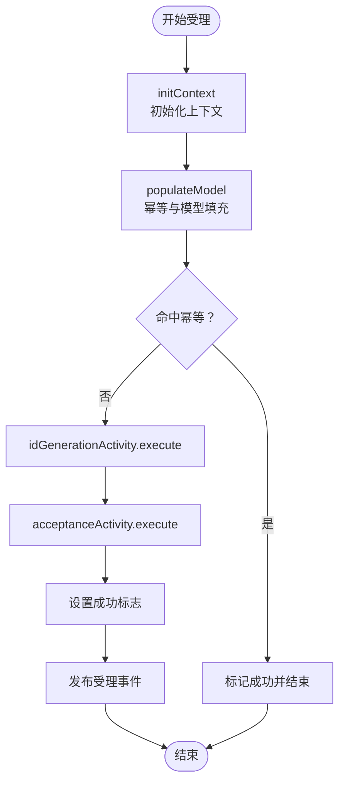
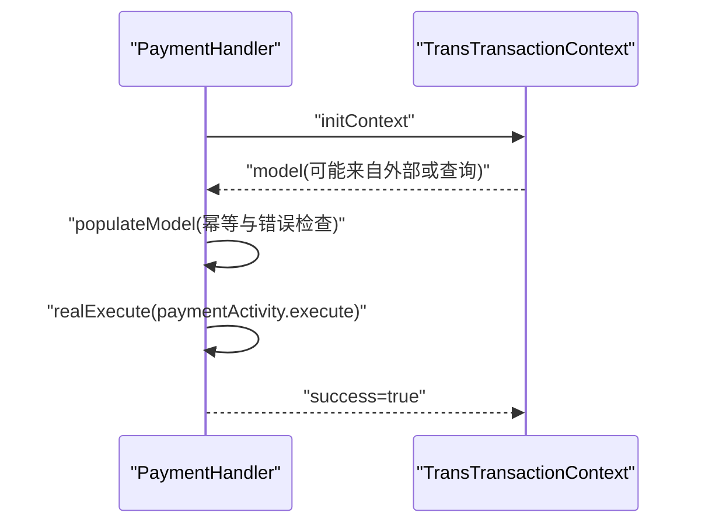
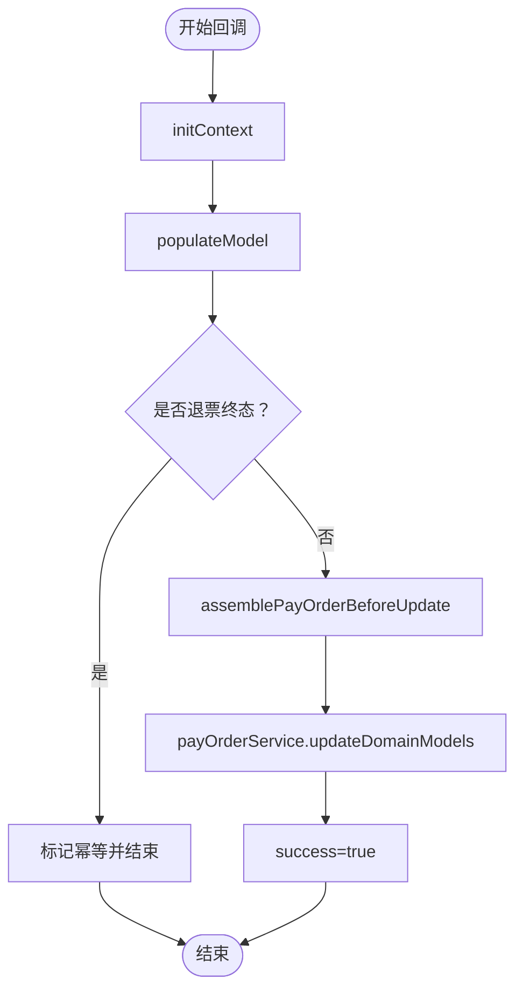
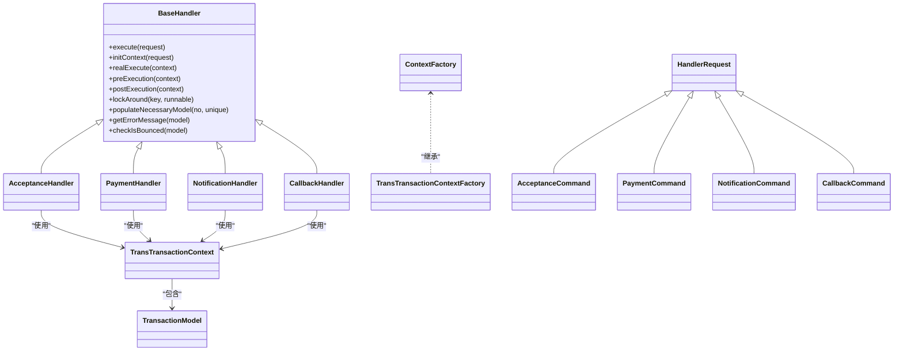

# 处理器组件

<cite>
**本文档引用的文件**
- [BaseHandler.java](file://biz-shared/src/main/java/com/magicliang/transaction/sys/biz/shared/handler/BaseHandler.java)
- [AcceptanceHandler.java](file://biz-shared/src/main/java/com/magicliang/transaction/sys/biz/shared/handler/AcceptanceHandler.java)
- [PaymentHandler.java](file://biz-shared/src/main/java/com/magicliang/transaction/sys/biz/shared/handler/PaymentHandler.java)
- [NotificationHandler.java](file://biz-shared/src/main/java/com/magicliang/transaction/sys/biz/shared/handler/NotificationHandler.java)
- [CallbackHandler.java](file://biz-shared/src/main/java/com/magicliang/transaction/sys/biz/shared/handler/CallbackHandler.java)
- [HandlerRequest.java](file://biz-shared/src/main/java/com/magicliang/transaction/sys/biz/shared/request/HandlerRequest.java)
- [AcceptanceCommand.java](file://biz-shared/src/main/java/com/magicliang/transaction/sys/biz/shared/request/acceptance/AcceptanceCommand.java)
- [PaymentCommand.java](file://biz-shared/src/main/java/com/magicliang/transaction/sys/biz/shared/request/payment/PaymentCommand.java)
- [NotificationCommand.java](file://biz-shared/src/main/java/com/magicliang/transaction/sys/biz/shared/request/notification/NotificationCommand.java)
- [CallbackCommand.java](file://biz-shared/src/main/java/com/magicliang/transaction/sys/biz/shared/request/callback/CallbackCommand.java)
- [TransTransactionContext.java](file://core-model/src/main/java/com/magicliang/transaction/sys/core/model/context/TransTransactionContext.java)
- [TransactionModel.java](file://core-model/src/main/java/com/magicliang/transaction/sys/core/model/context/TransactionModel.java)
- [OperationEnum.java](file://biz-shared/src/main/java/com/magicliang/transaction/sys/biz/shared/enums/OperationEnum.java)
- [ContextFactory.java](file://core-model/src/main/java/com/magicliang/transaction/sys/core/factory/ContextFactory.java)
- [TransTransactionContextFactory.java](file://core-model/src/main/java/com/magicliang/transaction/sys/core/factory/TransTransactionContextFactory.java)
- [DomainDrivenTransactionSysApplicationIntegrationTest.java](file://biz-service-impl/src/test/integration/java/com/magicliang/transaction/sys/DomainDrivenTransactionSysApplicationIntegrationTest.java)
</cite>

## 目录
1. [引言](#引言)
2. [项目结构](#项目结构)
3. [核心组件](#核心组件)
4. [架构总览](#架构总览)
5. [详细组件分析](#详细组件分析)
6. [依赖分析](#依赖分析)
7. [性能考量](#性能考量)
8. [故障排查指南](#故障排查指南)
9. [结论](#结论)
10. [附录](#附录)

## 引言
本文件聚焦领域驱动交易系统中的“处理器模式”，系统化梳理 BaseHandler 基类的设计与通用能力，以及四类业务处理器（受理、支付、通知、回调）的具体实现与协作方式。文档旨在帮助开发者快速理解处理器的生命周期、幂等与锁保障、上下文模型、消息事件注入、以及如何基于该模式扩展新的业务处理器。

## 项目结构
处理器组件位于 biz-shared 模块的 handler 包中，配合 core-model 提供的上下文与模型，形成“请求-处理器-领域活动-服务”的清晰分层；请求类位于 biz-shared 的 request 包中，枚举与工厂类位于 biz-shared 与 core-model 对应包中。

图表来源
- [BaseHandler.java:1-244](file://biz-shared/src/main/java/com/magicliang/transaction/sys/biz/shared/handler/BaseHandler.java#L1-L244)
- [AcceptanceHandler.java:1-231](file://biz-shared/src/main/java/com/magicliang/transaction/sys/biz/shared/handler/AcceptanceHandler.java#L1-L231)
- [PaymentHandler.java:1-139](file://biz-shared/src/main/java/com/magicliang/transaction/sys/biz/shared/handler/PaymentHandler.java#L1-L139)
- [NotificationHandler.java:1-139](file://biz-shared/src/main/java/com/magicliang/transaction/sys/biz/shared/handler/NotificationHandler.java#L1-L139)
- [CallbackHandler.java:1-190](file://biz-shared/src/main/java/com/magicliang/transaction/sys/biz/shared/handler/CallbackHandler.java#L1-L190)
- [HandlerRequest.java:1-46](file://biz-shared/src/main/java/com/magicliang/transaction/sys/biz/shared/request/HandlerRequest.java#L1-L46)
- [AcceptanceCommand.java:1-74](file://biz-shared/src/main/java/com/magicliang/transaction/sys/biz/shared/request/acceptance/AcceptanceCommand.java#L1-L74)
- [PaymentCommand.java:1-44](file://biz-shared/src/main/java/com/magicliang/transaction/sys/biz/shared/request/payment/PaymentCommand.java#L1-L44)
- [NotificationCommand.java:1-43](file://biz-shared/src/main/java/com/magicliang/transaction/sys/biz/shared/request/notification/NotificationCommand.java#L1-L43)
- [CallbackCommand.java:1-67](file://biz-shared/src/main/java/com/magicliang/transaction/sys/biz/shared/request/callback/CallbackCommand.java#L1-L67)
- [TransTransactionContext.java:1-139](file://core-model/src/main/java/com/magicliang/transaction/sys/core/model/context/TransTransactionContext.java#L1-L139)
- [TransactionModel.java:1-44](file://core-model/src/main/java/com/magicliang/transaction/sys/core/model/context/TransactionModel.java#L1-L44)
- [ContextFactory.java:1-88](file://core-model/src/main/java/com/magicliang/transaction/sys/core/factory/ContextFactory.java#L1-L88)
- [TransTransactionContextFactory.java:1-62](file://core-model/src/main/java/com/magicliang/transaction/sys/core/factory/TransTransactionContextFactory.java#L1-L62)

章节来源
- [BaseHandler.java:1-244](file://biz-shared/src/main/java/com/magicliang/transaction/sys/biz/shared/handler/BaseHandler.java#L1-L244)
- [HandlerRequest.java:1-46](file://biz-shared/src/main/java/com/magicliang/transaction/sys/biz/shared/request/HandlerRequest.java#L1-L46)
- [TransTransactionContext.java:1-139](file://core-model/src/main/java/com/magicliang/transaction/sys/core/model/context/TransTransactionContext.java#L1-L139)
- [TransactionModel.java:1-44](file://core-model/src/main/java/com/magicliang/transaction/sys/core/model/context/TransactionModel.java#L1-L44)

## 核心组件
- 基础处理器 BaseHandler：统一处理流程、分布式锁、上下文生命周期、幂等与错误码注入、前置/后置钩子。
- 交易上下文 TransTransactionContext：承载请求、领域模型与各子活动的请求/响应状态。
- 交易模型 TransactionModel：封装支付订单与成功/幂等/错误信息。
- 请求基类 HandlerRequest：统一 sysCode、bizIdentifyNo、bizUniqueNo 与幂等键生成。
- 操作枚举 OperationEnum：标识受理/支付/回调/通知等操作类型。

章节来源
- [BaseHandler.java:38-121](file://biz-shared/src/main/java/com/magicliang/transaction/sys/biz/shared/handler/BaseHandler.java#L38-L121)
- [TransTransactionContext.java:27-138](file://core-model/src/main/java/com/magicliang/transaction/sys/core/model/context/TransTransactionContext.java#L27-L138)
- [TransactionModel.java:17-43](file://core-model/src/main/java/com/magicliang/transaction/sys/core/model/context/TransactionModel.java#L17-L43)
- [HandlerRequest.java:18-45](file://biz-shared/src/main/java/com/magicliang/transaction/sys/biz/shared/request/HandlerRequest.java#L18-L45)
- [OperationEnum.java:18-49](file://biz-shared/src/main/java/com/magicliang/transaction/sys/biz/shared/enums/OperationEnum.java#L18-L49)

## 架构总览
处理器模式采用“请求-处理器-上下文-领域活动-服务”的分层协作，BaseHandler 统一执行流程，各业务处理器仅实现 initContext 与 realExecute，通过领域活动与服务完成具体业务。

图表来源
- [BaseHandler.java:93-121](file://biz-shared/src/main/java/com/magicliang/transaction/sys/biz/shared/handler/BaseHandler.java#L93-L121)
- [TransTransactionContext.java:112-137](file://core-model/src/main/java/com/magicliang/transaction/sys/core/model/context/TransTransactionContext.java#L112-L137)

## 详细组件分析

### BaseHandler 基类设计与生命周期
- 生命周期管理
  - execute(request)：统一流程入口，负责加锁、初始化上下文、前置/真实/后置执行、解锁与上下文清理。
  - initContext(request)：抽象方法，交由子类实现上下文初始化与幂等检查。
  - realExecute(context)：抽象方法，交由子类实现具体业务处理。
  - preExecution/postExecution：可覆写钩子，用于扩展日志、埋点或事件发布。
- 分布式锁与幂等
  - lockAround(idempotentKey, runnable)：在带过期时间的分布式锁内执行回调。
  - 幂等键由 HandlerRequest.getIdempotentKey() 统一生成，避免重复写入。
- 上下文与模型
  - populateNecessaryModel(bizIdentifyNo, bizUniqueNo)：子类可按需填充必要领域模型。
  - getErrorMessage(transactionModel)：针对写支付订单的场景，检测失败/关闭/退票终态并注入错误码。
  - checkIsBounced(transactionModel)：针对同步语义，检测退票终态并提前结束。
- 依赖注入
  - 公共配置、分布式锁、支付订单服务、领域活动（id 生成、受理、支付、通知）均通过 Spring 注入。

章节来源
- [BaseHandler.java:38-121](file://biz-shared/src/main/java/com/magicliang/transaction/sys/biz/shared/handler/BaseHandler.java#L38-L121)
- [BaseHandler.java:137-155](file://biz-shared/src/main/java/com/magicliang/transaction/sys/biz/shared/handler/BaseHandler.java#L137-L155)
- [BaseHandler.java:163-179](file://biz-shared/src/main/java/com/magicliang/transaction/sys/biz/shared/handler/BaseHandler.java#L163-L179)
- [BaseHandler.java:188-242](file://biz-shared/src/main/java/com/magicliang/transaction/sys/biz/shared/handler/BaseHandler.java#L188-L242)
- [HandlerRequest.java:42-44](file://biz-shared/src/main/java/com/magicliang/transaction/sys/biz/shared/request/HandlerRequest.java#L42-L44)

### AcceptanceHandler 受理处理逻辑
- 职责
  - 生成支付订单与子订单，构建交易模型。
  - 通过幂等检查命中已有领域模型时，直接标记幂等并提前结束。
- 关键流程
  - initContext：初始化上下文，populateModel 完成幂等与模型填充。
  - realExecute：依次执行 idGenerationActivity 与 acceptanceActivity。
  - postExecution：发布领域事件 TransPayOrderAcceptedEvent。
- 模型生成
  - generatePayOrder/generateSubOrder/generatePayRequest：从受理命令生成支付订单、子订单与支付请求。

图表来源
- [AcceptanceHandler.java:54-79](file://biz-shared/src/main/java/com/magicliang/transaction/sys/biz/shared/handler/AcceptanceHandler.java#L54-L79)
- [AcceptanceHandler.java:106-128](file://biz-shared/src/main/java/com/magicliang/transaction/sys/biz/shared/handler/AcceptanceHandler.java#L106-L128)
- [AcceptanceHandler.java:219-228](file://biz-shared/src/main/java/com/magicliang/transaction/sys/biz/shared/handler/AcceptanceHandler.java#L219-L228)

章节来源
- [AcceptanceHandler.java:32-79](file://biz-shared/src/main/java/com/magicliang/transaction/sys/biz/shared/handler/AcceptanceHandler.java#L32-L79)
- [AcceptanceHandler.java:88-128](file://biz-shared/src/main/java/com/magicliang/transaction/sys/biz/shared/handler/AcceptanceHandler.java#L88-L128)
- [AcceptanceHandler.java:136-216](file://biz-shared/src/main/java/com/magicliang/transaction/sys/biz/shared/handler/AcceptanceHandler.java#L136-L216)

### PaymentHandler 支付处理流程
- 职责
  - 直接执行支付活动，支持外部传入完整支付订单或通过业务标识码查询完整模型。
- 关键流程
  - initContext：populateModel 支持外部 payOrder 或查询完整模型；若被幂等（retryCount>0），标记幂等并注入错误信息。
  - realExecute：执行 paymentActivity，标记成功。

图表来源
- [PaymentHandler.java:47-70](file://biz-shared/src/main/java/com/magicliang/transaction/sys/biz/shared/handler/PaymentHandler.java#L47-L70)
- [PaymentHandler.java:96-137](file://biz-shared/src/main/java/com/magicliang/transaction/sys/biz/shared/handler/PaymentHandler.java#L96-L137)

章节来源
- [PaymentHandler.java:28-70](file://biz-shared/src/main/java/com/magicliang/transaction/sys/biz/shared/handler/PaymentHandler.java#L28-L70)
- [PaymentHandler.java:79-137](file://biz-shared/src/main/java/com/magicliang/transaction/sys/biz/shared/handler/PaymentHandler.java#L79-L137)

### NotificationHandler 通知处理机制
- 职责
  - 执行通知活动，支持外部传入完整支付订单或通过业务标识码查询完整模型。
- 关键流程
  - initContext：populateModel 支持外部 payOrder 或查询完整模型；遍历通知请求，检测幂等并标记。
  - realExecute：执行 notificationActivity，标记成功。

章节来源
- [NotificationHandler.java:49-71](file://biz-shared/src/main/java/com/magicliang/transaction/sys/biz/shared/handler/NotificationHandler.java#L49-L71)
- [NotificationHandler.java:97-136](file://biz-shared/src/main/java/com/magicliang/transaction/sys/biz/shared/handler/NotificationHandler.java#L97-L136)

### CallbackHandler 回调处理策略
- 职责
  - 基于回调命令更新支付订单状态与请求状态，支持退票终态检测与提前结束。
- 关键流程
  - initContext：populateModel 完整模型；checkIsBounced 检测退票终态并提前结束；assemblePayOrderBeforeUpdate 填充状态与时间戳。
  - realExecute：调用 payOrderService.updateDomainModels 更新领域模型，标记成功。

图表来源
- [CallbackHandler.java:51-73](file://biz-shared/src/main/java/com/magicliang/transaction/sys/biz/shared/handler/CallbackHandler.java#L51-L73)
- [CallbackHandler.java:99-127](file://biz-shared/src/main/java/com/magicliang/transaction/sys/biz/shared/handler/CallbackHandler.java#L99-L127)
- [CallbackHandler.java:135-189](file://biz-shared/src/main/java/com/magicliang/transaction/sys/biz/shared/handler/CallbackHandler.java#L135-L189)

章节来源
- [CallbackHandler.java:32-73](file://biz-shared/src/main/java/com/magicliang/transaction/sys/biz/shared/handler/CallbackHandler.java#L32-L73)
- [CallbackHandler.java:99-189](file://biz-shared/src/main/java/com/magicliang/transaction/sys/biz/shared/handler/CallbackHandler.java#L99-L189)

### 处理器职责划分与协作模式
- 职责划分
  - BaseHandler：统一生命周期、锁、上下文与错误处理。
  - 业务处理器：仅关注自身领域模型生成与活动编排。
  - 领域活动与服务：封装具体业务与数据访问。
- 协作模式
  - 通过 TransTransactionContext 统一承载请求与模型，跨处理器共享。
  - 通过 ApplicationEvents 在受理完成后发布领域事件，便于解耦。

章节来源
- [BaseHandler.java:93-121](file://biz-shared/src/main/java/com/magicliang/transaction/sys/biz/shared/handler/BaseHandler.java#L93-L121)
- [AcceptanceHandler.java:219-228](file://biz-shared/src/main/java/com/magicliang/transaction/sys/biz/shared/handler/AcceptanceHandler.java#L219-L228)

### 处理器链与消息传递
- 处理器链
  - 通过 Spring 自动装配收集所有 BaseHandler 子类，形成处理器链。
  - 测试用例展示了对处理器集合的注入与泛型类型探测。
- 消息传递
  - 通过 TransTransactionContext 在处理器之间传递上下文与模型。
  - 通过 ApplicationEvents 发布领域事件，实现处理器与事件监听之间的松耦合。

章节来源
- [DomainDrivenTransactionSysApplicationIntegrationTest.java:69-95](file://biz-service-impl/src/test/integration/java/com/magicliang/transaction/sys/DomainDrivenTransactionSysApplicationIntegrationTest.java#L69-L95)
- [AcceptanceHandler.java:219-228](file://biz-shared/src/main/java/com/magicliang/transaction/sys/biz/shared/handler/AcceptanceHandler.java#L219-L228)

## 依赖分析
- 处理器对领域活动与服务的依赖
  - BaseHandler 依赖 IDistributedLock、IPayOrderService、IdGenerationActivity、AcceptanceActivity、PaymentActivity、NotificationActivity。
- 上下文与工厂
  - TransTransactionContextFactory 基于 ContextFactory 提供线程隔离的上下文持有与清理。
- 请求与模型
  - 各处理器依赖对应的 HandlerRequest 子类与 TransactionModel。

图表来源
- [BaseHandler.java:38-121](file://biz-shared/src/main/java/com/magicliang/transaction/sys/biz/shared/handler/BaseHandler.java#L38-L121)
- [AcceptanceHandler.java:32-79](file://biz-shared/src/main/java/com/magicliang/transaction/sys/biz/shared/handler/AcceptanceHandler.java#L32-L79)
- [PaymentHandler.java:28-70](file://biz-shared/src/main/java/com/magicliang/transaction/sys/biz/shared/handler/PaymentHandler.java#L28-L70)
- [NotificationHandler.java:29-71](file://biz-shared/src/main/java/com/magicliang/transaction/sys/biz/shared/handler/NotificationHandler.java#L29-L71)
- [CallbackHandler.java:32-73](file://biz-shared/src/main/java/com/magicliang/transaction/sys/biz/shared/handler/CallbackHandler.java#L32-L73)
- [TransTransactionContext.java:27-138](file://core-model/src/main/java/com/magicliang/transaction/sys/core/model/context/TransTransactionContext.java#L27-L138)
- [TransactionModel.java:17-43](file://core-model/src/main/java/com/magicliang/transaction/sys/core/model/context/TransactionModel.java#L17-L43)
- [HandlerRequest.java:18-45](file://biz-shared/src/main/java/com/magicliang/transaction/sys/biz/shared/request/HandlerRequest.java#L18-L45)
- [ContextFactory.java:16-87](file://core-model/src/main/java/com/magicliang/transaction/sys/core/factory/ContextFactory.java#L16-L87)
- [TransTransactionContextFactory.java:17-62](file://core-model/src/main/java/com/magicliang/transaction/sys/core/factory/TransTransactionContextFactory.java#L17-L62)

章节来源
- [BaseHandler.java:46-85](file://biz-shared/src/main/java/com/magicliang/transaction/sys/biz/shared/handler/BaseHandler.java#L46-L85)
- [ContextFactory.java:52-77](file://core-model/src/main/java/com/magicliang/transaction/sys/core/factory/ContextFactory.java#L52-L77)
- [TransTransactionContextFactory.java:58-62](file://core-model/src/main/java/com/magicliang/transaction/sys/core/factory/TransTransactionContextFactory.java#L58-L62)

## 性能考量
- 分布式锁粒度
  - execute(request) 中对请求的幂等键加锁，确保同一业务标识下的并发安全；建议合理设置锁过期时间，避免长时间阻塞。
- 上下文清理
  - 在 finally 中调用 ContextFactory.clear()，防止线程池复用导致的上下文残留与内存泄漏。
- 模型填充策略
  - 受理场景仅需轻量模型即可，支付/通知/回调场景按需查询完整模型，减少不必要的数据库负载。
- 事件发布
  - 受理完成后发布领域事件，建议采用异步事件总线降低对主流程的影响。

## 故障排查指南
- 幂等与终态错误
  - getErrorMessage 会根据支付订单终态注入错误码；若出现失败/关闭/退票，需检查上游回调或支付结果。
- 退票终态检测
  - checkIsBounced 用于同步语义场景，命中后提前结束并标记成功；确认上游是否已退票。
- 锁相关问题
  - 若出现死锁或长时间等待，检查幂等键生成与锁过期时间配置。
- 上下文泄漏
  - 确保在处理器执行结束后清理上下文，避免线程池复用导致的脏数据。

章节来源
- [BaseHandler.java:198-213](file://biz-shared/src/main/java/com/magicliang/transaction/sys/biz/shared/handler/BaseHandler.java#L198-L213)
- [BaseHandler.java:222-232](file://biz-shared/src/main/java/com/magicliang/transaction/sys/biz/shared/handler/BaseHandler.java#L222-L232)
- [ContextFactory.java:59-77](file://core-model/src/main/java/com/magicliang/transaction/sys/core/factory/ContextFactory.java#L59-L77)

## 结论
处理器模式通过 BaseHandler 统一生命周期与一致性保障，结合 TransTransactionContext 与 TransactionModel 实现清晰的上下文传递与领域模型承载。四类业务处理器分别聚焦受理、支付、通知与回调，遵循相同的扩展路径：实现 initContext 与 realExecute，并通过领域活动与服务完成业务编排。该模式具备良好的可扩展性与可维护性，适合在复杂交易系统中持续演进。

## 附录

### 代码示例路径（注册、调用与扩展）
- 注册与装配
  - Spring 自动装配处理器集合，测试用例展示了对处理器列表的注入与泛型类型探测。
  - 示例路径：[DomainDrivenTransactionSysApplicationIntegrationTest.java:69-95](file://biz-service-impl/src/test/integration/java/com/magicliang/transaction/sys/DomainDrivenTransactionSysApplicationTest.java#L69-L95)
- 调用流程
  - 基础处理器执行流程：[BaseHandler.java:93-121](file://biz-shared/src/main/java/com/magicliang/transaction/sys/biz/shared/handler/BaseHandler.java#L93-L121)
  - 受理处理器执行：[AcceptanceHandler.java:72-79](file://biz-shared/src/main/java/com/magicliang/transaction/sys/biz/shared/handler/AcceptanceHandler.java#L72-L79)
  - 支付处理器执行：[PaymentHandler.java:65-70](file://biz-shared/src/main/java/com/magicliang/transaction/sys/biz/shared/handler/PaymentHandler.java#L65-L70)
  - 通知处理器执行：[NotificationHandler.java:69-71](file://biz-shared/src/main/java/com/magicliang/transaction/sys/biz/shared/handler/NotificationHandler.java#L69-L71)
  - 回调处理器执行：[CallbackHandler.java:71-73](file://biz-shared/src/main/java/com/magicliang/transaction/sys/biz/shared/handler/CallbackHandler.java#L71-L73)
- 扩展新处理器
  - 新建类继承 BaseHandler，实现 identify、initContext、realExecute，并在 Spring 中注册为 @Service。
  - 示例参考：[AcceptanceHandler.java:32-79](file://biz-shared/src/main/java/com/magicliang/transaction/sys/biz/shared/handler/AcceptanceHandler.java#L32-L79)