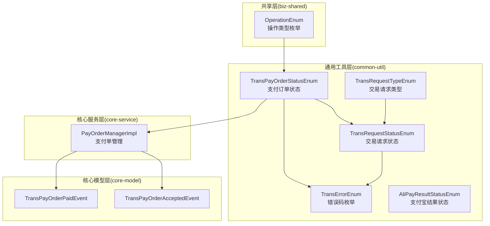
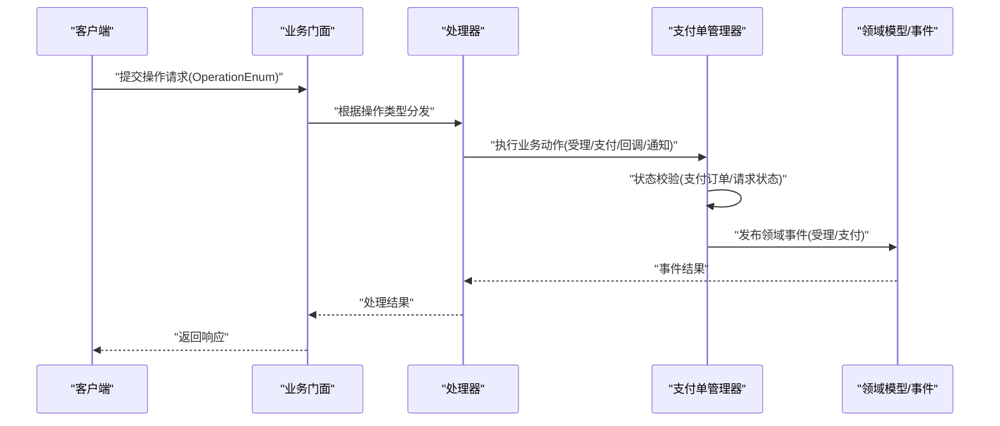
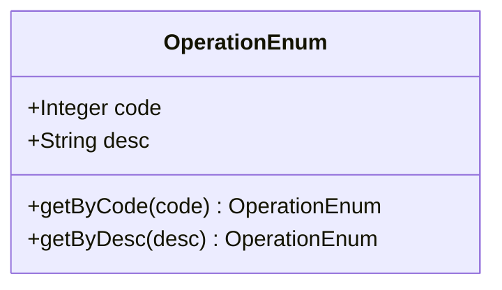
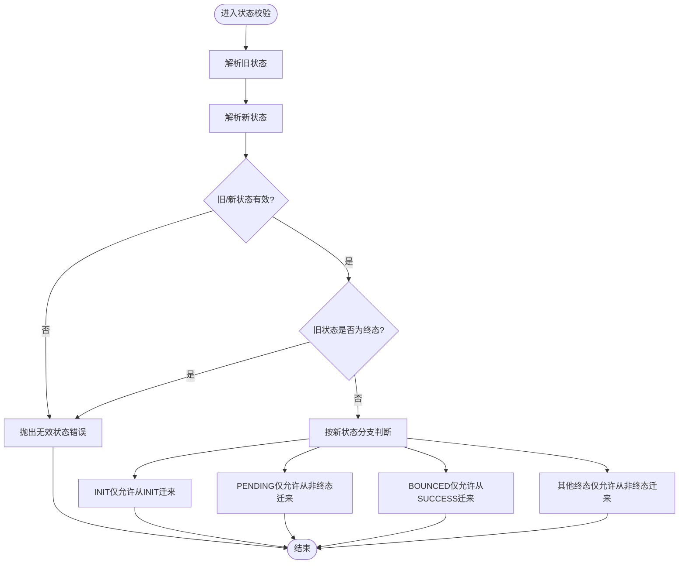
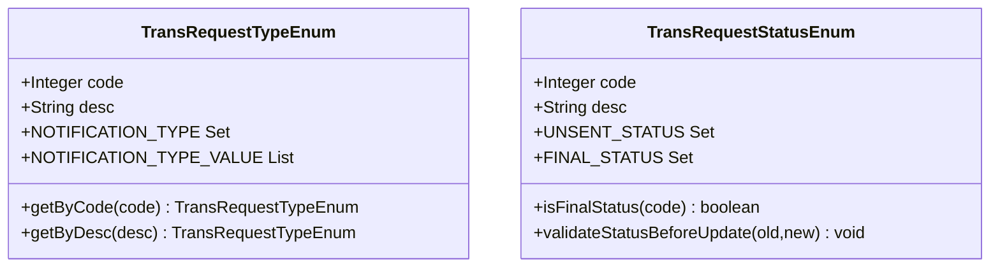
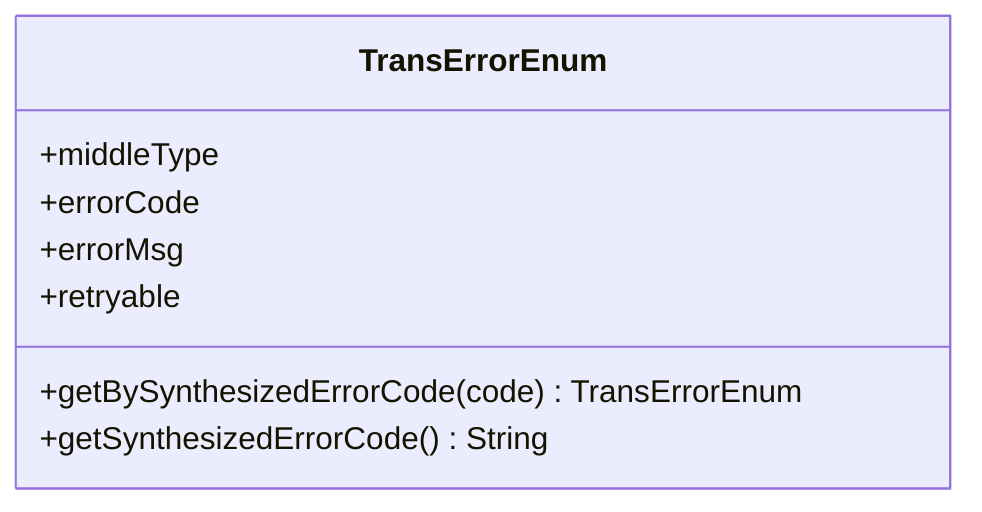
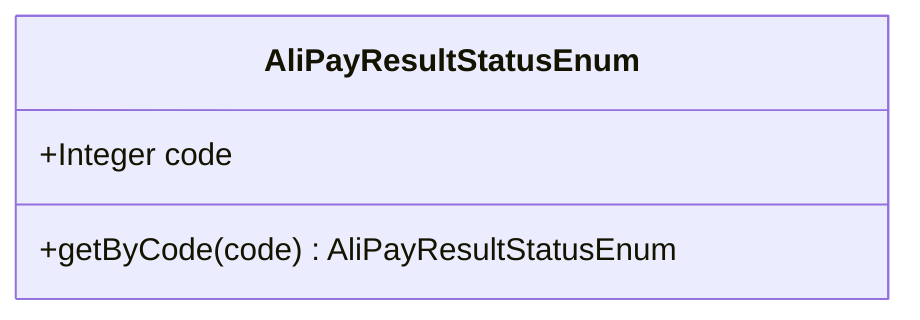
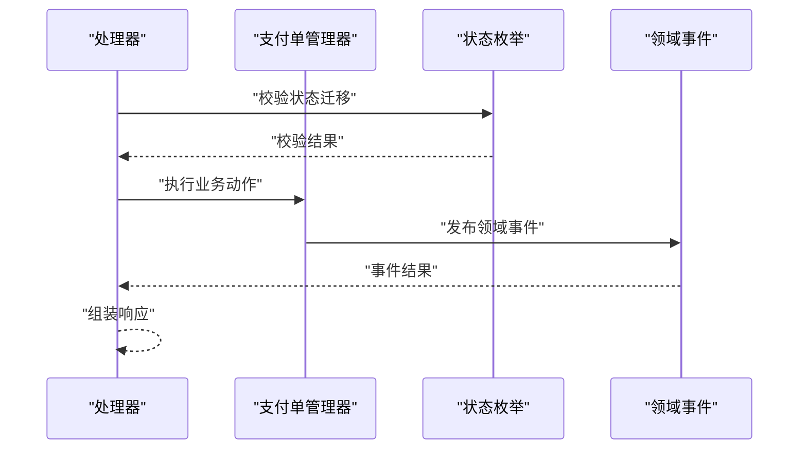
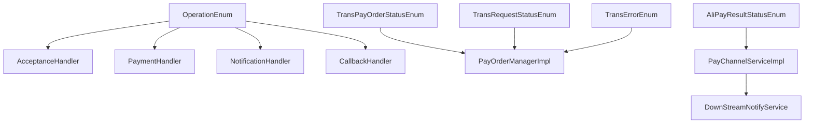

# 枚举管理

<cite>
**本文引用的文件**
- [OperationEnum.java](file://biz-shared/src/main/java/com/magicliang/transaction/sys/biz/shared/enums/OperationEnum.java)
- [TransPayOrderStatusEnum.java](file://common-util/src/main/java/com/magicliang/transaction/sys/common/enums/TransPayOrderStatusEnum.java)
- [TransRequestTypeEnum.java](file://common-util/src/main/java/com/magicliang/transaction/sys/common/enums/TransRequestTypeEnum.java)
- [TransRequestStatusEnum.java](file://common-util/src/main/java/com/magicliang/transaction/sys/common/enums/TransRequestStatusEnum.java)
- [TransErrorEnum.java](file://common-util/src/main/java/com/magicliang/transaction/sys/common/enums/TransErrorEnum.java)
- [AliPayResultStatusEnum.java](file://common-util/src/main/java/com/magicliang/transaction/sys/common/enums/AliPayResultStatusEnum.java)
- [AcceptanceHandler.java](file://biz-shared/src/main/java/com/magicliang/transaction/sys/biz/shared/handler/AcceptanceHandler.java)
- [PaymentHandler.java](file://biz-shared/src/main/java/com/magicliang/transaction/sys/biz/shared/handler/PaymentHandler.java)
- [NotificationHandler.java](file://biz-shared/src/main/java/com/magicliang/transaction/sys/biz/shared/handler/NotificationHandler.java)
- [CallbackHandler.java](file://biz-shared/src/main/java/com/magicliang/transaction/sys/biz/shared/handler/CallbackHandler.java)
- [PayOrderManagerImpl.java](file://core-service/src/main/java/com/magicliang/transaction/sys/core/service/impl/PayOrderManagerImpl.java)
- [PayChannelServiceImpl.java](file://biz-service-impl/src/main/java/com/magicliang/transaction/sys/biz/service/impl/rpc/PayChannelServiceImpl.java)
- [DownStreamNotifyService.java](file://biz-service-impl/src/main/java/com/magicliang/transaction/sys/biz/service/impl/rpc/DownStreamNotifyService.java)
- [TransPayOrderAcceptedEvent.java](file://core-model/src/main/java/com/magicliang/transaction/sys/core/model/event/TransPayOrderAcceptedEvent.java)
- [TransPayOrderPaidEvent.java](file://core-model/src/main/java/com/magicliang/transaction/sys/core/model/event/TransPayOrderPaidEvent.java)
</cite>

## 目录
1. [引言](#引言)
2. [项目结构](#项目结构)
3. [核心组件](#核心组件)
4. [架构总览](#架构总览)
5. [详细组件分析](#详细组件分析)
6. [依赖分析](#依赖分析)
7. [性能考虑](#性能考虑)
8. [故障排查指南](#故障排查指南)
9. [结论](#结论)
10. [附录](#附录)

## 引言
本文件聚焦于领域驱动交易系统中的“枚举管理”，系统化梳理业务枚举的设计原则、命名规范、语义含义与统一管理策略。重点围绕 OperationEnum 等业务枚举展开，阐释其在业务流程中的作用（操作类型标识、状态转换控制等），并说明枚举与业务逻辑的绑定关系（枚举值与具体业务行为的映射机制）。同时提供可落地的定义、使用与扩展方法，帮助开发者在保证代码一致性与可读性的前提下，高效维护与演进。

## 项目结构
本项目的枚举分布在多个模块中，遵循“共享层”“通用工具层”“核心服务层”“核心模型层”的分层组织方式：
- biz-shared：业务编排与共享能力，包含 OperationEnum 等面向业务入口的枚举。
- common-util：通用工具与枚举，覆盖支付订单状态、请求类型、请求状态、错误码、第三方状态等。
- core-service：核心服务实现，包含状态校验、事件监听、业务策略等。
- core-model：领域模型与事件，承载状态变更的领域事件。

图表来源
- [OperationEnum.java:18-95](file://biz-shared/src/main/java/com/magicliang/transaction/sys/biz/shared/enums/OperationEnum.java#L18-L95)
- [TransPayOrderStatusEnum.java:26-203](file://common-util/src/main/java/com/magicliang/transaction/sys/common/enums/TransPayOrderStatusEnum.java#L26-L203)
- [TransRequestTypeEnum.java:22-97](file://common-util/src/main/java/com/magicliang/transaction/sys/common/enums/TransRequestTypeEnum.java#L22-L97)
- [TransRequestStatusEnum.java:27-161](file://common-util/src/main/java/com/magicliang/transaction/sys/common/enums/TransRequestStatusEnum.java#L27-L161)
- [TransErrorEnum.java:22-325](file://common-util/src/main/java/com/magicliang/transaction/sys/common/enums/TransErrorEnum.java#L22-L325)
- [AliPayResultStatusEnum.java:18-60](file://common-util/src/main/java/com/magicliang/transaction/sys/common/enums/AliPayResultStatusEnum.java#L18-L60)
- [PayOrderManagerImpl.java:1-50](file://core-service/src/main/java/com/magicliang/transaction/sys/core/service/impl/PayOrderManagerImpl.java#L1-L50)

章节来源
- [OperationEnum.java:1-97](file://biz-shared/src/main/java/com/magicliang/transaction/sys/biz/shared/enums/OperationEnum.java#L1-L97)
- [TransPayOrderStatusEnum.java:1-205](file://common-util/src/main/java/com/magicliang/transaction/sys/common/enums/TransPayOrderStatusEnum.java#L1-L205)
- [TransRequestTypeEnum.java:1-99](file://common-util/src/main/java/com/magicliang/transaction/sys/common/enums/TransRequestTypeEnum.java#L1-L99)
- [TransRequestStatusEnum.java:1-163](file://common-util/src/main/java/com/magicliang/transaction/sys/common/enums/TransRequestStatusEnum.java#L1-L163)
- [TransErrorEnum.java:1-327](file://common-util/src/main/java/com/magicliang/transaction/sys/common/enums/TransErrorEnum.java#L1-L327)
- [AliPayResultStatusEnum.java:1-62](file://common-util/src/main/java/com/magicliang/transaction/sys/common/enums/AliPayResultStatusEnum.java#L1-L62)

## 核心组件
本节对关键业务枚举进行深入剖析，涵盖设计原则、命名规范、语义与使用场景。

- OperationEnum（操作类型枚举）
  - 设计原则：以“操作类型”为核心维度，统一对外暴露操作标识；提供按 code 与 desc 的检索方法，便于跨模块一致识别。
  - 命名规范：采用全大写+下划线风格，语义清晰，便于阅读与维护。
  - 使用场景：用于业务入口（受理、支付、回调、通知等）的统一标识与路由。
  - 关键点：提供静态查询方法，避免魔法数；与 handler 层配合实现操作到行为的映射。

- TransPayOrderStatusEnum（支付订单状态）
  - 设计原则：区分“中间态”与“终态”，明确成功/失败/关闭/退票等终态，支持状态机约束。
  - 命名规范：采用全大写+下划线风格，语义明确。
  - 使用场景：支付订单生命周期管理、状态迁移校验、终态判定。
  - 关键点：内置终态集合与未支付集合，提供状态迁移校验方法，保障状态变更的正确性。

- TransRequestTypeEnum（交易请求类型）
  - 设计原则：区分支付请求与通知请求两类，明确通知类型的集合与优先级。
  - 命名规范：采用全大写+下划线风格。
  - 使用场景：请求分类、通知策略选择、优先级调度。
  - 关键点：提供通知类型集合与对应 code 列表，便于批量处理与过滤。

- TransRequestStatusEnum（交易请求状态）
  - 设计原则：区分“中间态”与“终态”，明确请求成功/失败/关闭等终态。
  - 命名规范：采用全大写+下划线风格。
  - 使用场景：上游请求生命周期管理、状态迁移校验。
  - 关键点：提供非终态集合与终态集合，提供状态迁移校验方法。

- TransErrorEnum（错误码枚举）
  - 设计原则：按“本系统业务/系统、第二方、第三方”三层划分，统一错误码合成规则，支持可重试标记。
  - 命名规范：采用全大写+下划线风格，语义明确。
  - 使用场景：异常归类、错误上报、重试策略。
  - 关键点：提供合成错误码方法，便于统一错误标识与传播。

- AliPayResultStatusEnum（支付宝结果状态）
  - 设计原则：第三方状态映射，提供 code 到枚举的快速映射。
  - 命名规范：采用全大写+下划线风格。
  - 使用场景：对接下游渠道时的状态归一化。
  - 关键点：使用不可变映射缓存，提升查询性能。

章节来源
- [OperationEnum.java:18-95](file://biz-shared/src/main/java/com/magicliang/transaction/sys/biz/shared/enums/OperationEnum.java#L18-L95)
- [TransPayOrderStatusEnum.java:26-203](file://common-util/src/main/java/com/magicliang/transaction/sys/common/enums/TransPayOrderStatusEnum.java#L26-L203)
- [TransRequestTypeEnum.java:22-97](file://common-util/src/main/java/com/magicliang/transaction/sys/common/enums/TransRequestTypeEnum.java#L22-L97)
- [TransRequestStatusEnum.java:27-161](file://common-util/src/main/java/com/magicliang/transaction/sys/common/enums/TransRequestStatusEnum.java#L27-L161)
- [TransErrorEnum.java:22-325](file://common-util/src/main/java/com/magicliang/transaction/sys/common/enums/TransErrorEnum.java#L22-L325)
- [AliPayResultStatusEnum.java:18-60](file://common-util/src/main/java/com/magicliang/transaction/sys/common/enums/AliPayResultStatusEnum.java#L18-L60)

## 架构总览
从“入口操作枚举”到“状态机与错误码”的整体流转如下：

图表来源
- [OperationEnum.java:18-49](file://biz-shared/src/main/java/com/magicliang/transaction/sys/biz/shared/enums/OperationEnum.java#L18-L49)
- [AcceptanceHandler.java:1-50](file://biz-shared/src/main/java/com/magicliang/transaction/sys/biz/shared/handler/AcceptanceHandler.java#L1-L50)
- [PaymentHandler.java:1-50](file://biz-shared/src/main/java/com/magicliang/transaction/sys/biz/shared/handler/PaymentHandler.java#L1-L50)
- [NotificationHandler.java:1-50](file://biz-shared/src/main/java/com/magicliang/transaction/sys/biz/shared/handler/NotificationHandler.java#L1-L50)
- [CallbackHandler.java:1-50](file://biz-shared/src/main/java/com/magicliang/transaction/sys/biz/shared/handler/CallbackHandler.java#L1-L50)
- [PayOrderManagerImpl.java:1-50](file://core-service/src/main/java/com/magicliang/transaction/sys/core/service/impl/PayOrderManagerImpl.java#L1-L50)
- [TransPayOrderAcceptedEvent.java:1-50](file://core-model/src/main/java/com/magicliang/transaction/sys/core/model/event/TransPayOrderAcceptedEvent.java#L1-L50)
- [TransPayOrderPaidEvent.java:1-50](file://core-model/src/main/java/com/magicliang/transaction/sys/core/model/event/TransPayOrderPaidEvent.java#L1-L50)

## 详细组件分析

### OperationEnum（操作类型枚举）
- 设计要点
  - 以“操作类型”为单一职责，统一标识受理、支付、回调、通知等入口。
  - 提供 code 与 desc 两维检索，便于跨模块一致识别。
  - 与 handler 层配合，实现“操作类型 -> 具体业务行为”的映射。
- 使用建议
  - 在门面层接收请求后，依据 OperationEnum 进行分支或路由。
  - 将枚举值作为日志与监控的关键维度，便于追踪与审计。
- 扩展策略
  - 新增操作类型时，保持 code 的唯一性与 desc 的可读性。
  - 若涉及状态迁移，需同步完善状态机校验与领域事件。

图表来源
- [OperationEnum.java:18-95](file://biz-shared/src/main/java/com/magicliang/transaction/sys/biz/shared/enums/OperationEnum.java#L18-L95)

章节来源
- [OperationEnum.java:18-95](file://biz-shared/src/main/java/com/magicliang/transaction/sys/biz/shared/enums/OperationEnum.java#L18-L95)

### 支付订单状态机（TransPayOrderStatusEnum）
- 设计要点
  - 明确“中间态”与“终态”，支持成功/失败/关闭/退票等终态，便于策略选择与重试控制。
  - 内置未支付集合与坏终态集合，提供终态判断与退票判断方法。
  - 提供状态迁移校验，确保状态变更的合法性。
- 使用建议
  - 在业务动作完成后，严格调用状态迁移校验，避免非法跃迁。
  - 对终态进行分支处理，避免重复处理。
- 扩展策略
  - 新增终态时，需评估对“未支付集合/坏终态集合”的影响。
  - 若引入新的中间态，需补充相应的迁移约束。

图表来源
- [TransPayOrderStatusEnum.java:175-203](file://common-util/src/main/java/com/magicliang/transaction/sys/common/enums/TransPayOrderStatusEnum.java#L175-L203)

章节来源
- [TransPayOrderStatusEnum.java:26-203](file://common-util/src/main/java/com/magicliang/transaction/sys/common/enums/TransPayOrderStatusEnum.java#L26-L203)

### 交易请求类型与状态（TransRequestTypeEnum / TransRequestStatusEnum）
- 设计要点
  - 请求类型区分“支付请求”与“通知请求”，并提供通知类型集合与优先级。
  - 请求状态区分“中间态”与“终态”，明确成功/失败/关闭等终态。
  - 提供非终态集合与终态集合，以及状态迁移校验。
- 使用建议
  - 在通知策略选择时，优先使用通知类型集合与 code 列表进行过滤与排序。
  - 在上游请求处理时，严格校验状态迁移，避免重复处理或非法跃迁。
- 扩展策略
  - 新增请求类型时，需明确其是否属于通知类型，并评估优先级。
  - 新增请求状态时，需纳入终态/非终态集合，并补充迁移约束。

图表来源
- [TransRequestTypeEnum.java:22-97](file://common-util/src/main/java/com/magicliang/transaction/sys/common/enums/TransRequestTypeEnum.java#L22-L97)
- [TransRequestStatusEnum.java:27-161](file://common-util/src/main/java/com/magicliang/transaction/sys/common/enums/TransRequestStatusEnum.java#L27-L161)

章节来源
- [TransRequestTypeEnum.java:22-97](file://common-util/src/main/java/com/magicliang/transaction/sys/common/enums/TransRequestTypeEnum.java#L22-L97)
- [TransRequestStatusEnum.java:27-161](file://common-util/src/main/java/com/magicliang/transaction/sys/common/enums/TransRequestStatusEnum.java#L27-L161)

### 错误码体系（TransErrorEnum）
- 设计要点
  - 按“本系统业务/系统、第二方、第三方”三层划分，统一错误码合成规则。
  - 提供可重试标记，便于上层决策是否重试。
  - 提供合成错误码方法，便于统一错误标识与传播。
- 使用建议
  - 在异常捕获处，优先匹配已定义的错误枚举，减少魔法数。
  - 对可重试错误进行指数退避与限流，避免雪崩。
- 扩展策略
  - 新增错误时，明确所属层级与可重试属性。
  - 合成规则保持稳定，避免下游解析复杂度上升。

图表来源
- [TransErrorEnum.java:22-325](file://common-util/src/main/java/com/magicliang/transaction/sys/common/enums/TransErrorEnum.java#L22-L325)

章节来源
- [TransErrorEnum.java:22-325](file://common-util/src/main/java/com/magicliang/transaction/sys/common/enums/TransErrorEnum.java#L22-L325)

### 第三方状态映射（AliPayResultStatusEnum）
- 设计要点
  - 提供第三方状态到内部枚举的映射，降低外部差异带来的复杂度。
  - 使用不可变映射缓存，提升查询性能。
- 使用建议
  - 在对接下游渠道时，统一通过该枚举进行状态归一化。
  - 对未知状态进行兜底处理，避免空指针或异常传播。
- 扩展策略
  - 新增第三方状态时，评估是否需要新增内部枚举与映射。

图表来源
- [AliPayResultStatusEnum.java:18-60](file://common-util/src/main/java/com/magicliang/transaction/sys/common/enums/AliPayResultStatusEnum.java#L18-L60)

章节来源
- [AliPayResultStatusEnum.java:18-60](file://common-util/src/main/java/com/magicliang/transaction/sys/common/enums/AliPayResultStatusEnum.java#L18-L60)

### 处理器与业务逻辑绑定
- AcceptanceHandler/PaymentHandler/NotificationHandler/CallbackHandler
  - 通过 OperationEnum 与请求类型/状态枚举进行绑定，实现“操作类型 -> 具体处理器 -> 业务动作”的解耦。
  - 在处理器内部，结合状态机与错误码进行强约束，确保业务一致性。
- PayOrderManagerImpl
  - 在执行业务动作前，严格校验状态迁移，发布领域事件，保证状态变更的可观测性与可追溯性。

图表来源
- [AcceptanceHandler.java:1-50](file://biz-shared/src/main/java/com/magicliang/transaction/sys/biz/shared/handler/AcceptanceHandler.java#L1-L50)
- [PaymentHandler.java:1-50](file://biz-shared/src/main/java/com/magicliang/transaction/sys/biz/shared/handler/PaymentHandler.java#L1-L50)
- [NotificationHandler.java:1-50](file://biz-shared/src/main/java/com/magicliang/transaction/sys/biz/shared/handler/NotificationHandler.java#L1-L50)
- [CallbackHandler.java:1-50](file://biz-shared/src/main/java/com/magicliang/transaction/sys/biz/shared/handler/CallbackHandler.java#L1-L50)
- [PayOrderManagerImpl.java:1-50](file://core-service/src/main/java/com/magicliang/transaction/sys/core/service/impl/PayOrderManagerImpl.java#L1-L50)
- [TransPayOrderStatusEnum.java:175-203](file://common-util/src/main/java/com/magicliang/transaction/sys/common/enums/TransPayOrderStatusEnum.java#L175-L203)
- [TransPayOrderAcceptedEvent.java:1-50](file://core-model/src/main/java/com/magicliang/transaction/sys/core/model/event/TransPayOrderAcceptedEvent.java#L1-L50)
- [TransPayOrderPaidEvent.java:1-50](file://core-model/src/main/java/com/magicliang/transaction/sys/core/model/event/TransPayOrderPaidEvent.java#L1-L50)

章节来源
- [AcceptanceHandler.java:1-50](file://biz-shared/src/main/java/com/magicliang/transaction/sys/biz/shared/handler/AcceptanceHandler.java#L1-L50)
- [PaymentHandler.java:1-50](file://biz-shared/src/main/java/com/magicliang/transaction/sys/biz/shared/handler/PaymentHandler.java#L1-L50)
- [NotificationHandler.java:1-50](file://biz-shared/src/main/java/com/magicliang/transaction/sys/biz/shared/handler/NotificationHandler.java#L1-L50)
- [CallbackHandler.java:1-50](file://biz-shared/src/main/java/com/magicliang/transaction/sys/biz/shared/handler/CallbackHandler.java#L1-L50)
- [PayOrderManagerImpl.java:1-50](file://core-service/src/main/java/com/magicliang/transaction/sys/core/service/impl/PayOrderManagerImpl.java#L1-L50)
- [TransPayOrderStatusEnum.java:175-203](file://common-util/src/main/java/com/magicliang/transaction/sys/common/enums/TransPayOrderStatusEnum.java#L175-L203)
- [TransPayOrderAcceptedEvent.java:1-50](file://core-model/src/main/java/com/magicliang/transaction/sys/core/model/event/TransPayOrderAcceptedEvent.java#L1-L50)
- [TransPayOrderPaidEvent.java:1-50](file://core-model/src/main/java/com/magicliang/transaction/sys/core/model/event/TransPayOrderPaidEvent.java#L1-L50)

## 依赖分析
- 枚举之间的依赖关系
  - OperationEnum 作为入口操作枚举，驱动后续处理器与状态机。
  - TransPayOrderStatusEnum 与 TransRequestStatusEnum 构成核心状态机，贯穿支付与通知链路。
  - TransErrorEnum 为全局错误码中枢，被各层广泛使用。
  - AliPayResultStatusEnum 作为第三方状态映射，服务于下游集成。
- 处理器与枚举的绑定
  - 处理器通过 OperationEnum 与请求类型/状态枚举进行绑定，形成稳定的业务映射。
  - 管理器在执行业务动作前后，严格依赖状态机与错误码进行约束与反馈。

图表来源
- [OperationEnum.java:18-49](file://biz-shared/src/main/java/com/magicliang/transaction/sys/biz/shared/enums/OperationEnum.java#L18-L49)
- [AcceptanceHandler.java:1-50](file://biz-shared/src/main/java/com/magicliang/transaction/sys/biz/shared/handler/AcceptanceHandler.java#L1-L50)
- [PaymentHandler.java:1-50](file://biz-shared/src/main/java/com/magicliang/transaction/sys/biz/shared/handler/PaymentHandler.java#L1-L50)
- [NotificationHandler.java:1-50](file://biz-shared/src/main/java/com/magicliang/transaction/sys/biz/shared/handler/NotificationHandler.java#L1-L50)
- [CallbackHandler.java:1-50](file://biz-shared/src/main/java/com/magicliang/transaction/sys/biz/shared/handler/CallbackHandler.java#L1-L50)
- [TransPayOrderStatusEnum.java:26-203](file://common-util/src/main/java/com/magicliang/transaction/sys/common/enums/TransPayOrderStatusEnum.java#L26-L203)
- [TransRequestStatusEnum.java:27-161](file://common-util/src/main/java/com/magicliang/transaction/sys/common/enums/TransRequestStatusEnum.java#L27-L161)
- [TransErrorEnum.java:22-325](file://common-util/src/main/java/com/magicliang/transaction/sys/common/enums/TransErrorEnum.java#L22-L325)
- [AliPayResultStatusEnum.java:18-60](file://common-util/src/main/java/com/magicliang/transaction/sys/common/enums/AliPayResultStatusEnum.java#L18-L60)
- [PayChannelServiceImpl.java:1-50](file://biz-service-impl/src/main/java/com/magicliang/transaction/sys/biz/service/impl/rpc/PayChannelServiceImpl.java#L1-L50)
- [DownStreamNotifyService.java:1-50](file://biz-service-impl/src/main/java/com/magicliang/transaction/sys/biz/service/impl/rpc/DownStreamNotifyService.java#L1-L50)

章节来源
- [OperationEnum.java:18-49](file://biz-shared/src/main/java/com/magicliang/transaction/sys/biz/shared/enums/OperationEnum.java#L18-L49)
- [TransPayOrderStatusEnum.java:26-203](file://common-util/src/main/java/com/magicliang/transaction/sys/common/enums/TransPayOrderStatusEnum.java#L26-L203)
- [TransRequestStatusEnum.java:27-161](file://common-util/src/main/java/com/magicliang/transaction/sys/common/enums/TransRequestStatusEnum.java#L27-L161)
- [TransErrorEnum.java:22-325](file://common-util/src/main/java/com/magicliang/transaction/sys/common/enums/TransErrorEnum.java#L22-L325)
- [AliPayResultStatusEnum.java:18-60](file://common-util/src/main/java/com/magicliang/transaction/sys/common/enums/AliPayResultStatusEnum.java#L18-L60)
- [PayChannelServiceImpl.java:1-50](file://biz-service-impl/src/main/java/com/magicliang/transaction/sys/biz/service/impl/rpc/PayChannelServiceImpl.java#L1-L50)
- [DownStreamNotifyService.java:1-50](file://biz-service-impl/src/main/java/com/magicliang/transaction/sys/biz/service/impl/rpc/DownStreamNotifyService.java#L1-L50)

## 性能考虑
- 枚举查询
  - OperationEnum、TransRequestTypeEnum、TransRequestStatusEnum、AliPayResultStatusEnum 均提供 O(n) 的线性查找方法，适用于枚举规模较小且稳定不变的场景。
  - 对于高频查询场景，可考虑引入不可变映射缓存（如 AliPayResultStatusEnum 已采用不可变映射），以降低查找开销。
- 状态机校验
  - TransPayOrderStatusEnum 与 TransRequestStatusEnum 的状态迁移校验为常量时间复杂度，适合在热路径中频繁调用。
- 错误码合成
  - TransErrorEnum 的合成规则简单直接，避免额外计算成本；若未来扩展层级，需评估对性能的影响。

## 故障排查指南
- 状态迁移异常
  - 现象：状态变更被拒绝或抛出无效状态错误。
  - 排查：检查旧状态与新状态是否满足迁移约束；确认是否处于终态；核对枚举 code 是否正确。
  - 参考：状态迁移校验方法与错误码定义。
- 操作类型不匹配
  - 现象：请求无法被正确路由或处理。
  - 排查：确认 OperationEnum 的 code 与 desc 是否与上游传入一致；检查处理器分支逻辑。
- 错误码不一致
  - 现象：错误上报与预期不符。
  - 排查：核对错误码合成规则与可重试标记；确认错误枚举是否覆盖当前场景。
- 第三方状态映射异常
  - 现象：下游状态无法映射到内部枚举。
  - 排查：确认第三方状态值是否在映射范围内；对未知状态进行兜底处理。

章节来源
- [TransPayOrderStatusEnum.java:175-203](file://common-util/src/main/java/com/magicliang/transaction/sys/common/enums/TransPayOrderStatusEnum.java#L175-L203)
- [TransRequestStatusEnum.java:137-161](file://common-util/src/main/java/com/magicliang/transaction/sys/common/enums/TransRequestStatusEnum.java#L137-L161)
- [TransErrorEnum.java:304-325](file://common-util/src/main/java/com/magicliang/transaction/sys/common/enums/TransErrorEnum.java#L304-L325)
- [AliPayResultStatusEnum.java:58-60](file://common-util/src/main/java/com/magicliang/transaction/sys/common/enums/AliPayResultStatusEnum.java#L58-L60)

## 结论
通过统一的枚举管理策略，系统实现了“操作类型标识、状态转换控制、错误码治理、第三方状态映射”的一体化设计。OperationEnum 作为入口，驱动处理器与状态机协同工作；TransPayOrderStatusEnum 与 TransRequestStatusEnum 构建了严谨的状态机；TransErrorEnum 提供统一的错误治理；AliPayResultStatusEnum 实现第三方状态归一化。该策略显著提升了代码的一致性与可读性，降低了跨模块协作的成本，并为后续扩展提供了清晰的边界与路径。

## 附录
- 定义枚举的最佳实践
  - 命名规范：采用全大写+下划线风格，语义清晰。
  - 唯一性：code 必须唯一，desc 应具备可读性。
  - 查询方法：提供按 code 与 desc 的检索方法，必要时引入缓存映射。
  - 状态机：明确中间态与终态，提供迁移校验与终态判定方法。
  - 错误码：按层级划分，提供合成规则与可重试标记。
- 使用与扩展示例（路径指引）
  - 定义新的操作类型：参考 [OperationEnum.java:18-49](file://biz-shared/src/main/java/com/magicliang/transaction/sys/biz/shared/enums/OperationEnum.java#L18-L49)，在处理器中增加分支逻辑。
  - 定义新的支付订单状态：参考 [TransPayOrderStatusEnum.java:26-61](file://common-util/src/main/java/com/magicliang/transaction/sys/common/enums/TransPayOrderStatusEnum.java#L26-L61)，补充终态集合与迁移约束。
  - 定义新的请求类型/状态：参考 [TransRequestTypeEnum.java:22-50](file://common-util/src/main/java/com/magicliang/transaction/sys/common/enums/TransRequestTypeEnum.java#L22-L50) 与 [TransRequestStatusEnum.java:27-72](file://common-util/src/main/java/com/magicliang/transaction/sys/common/enums/TransRequestStatusEnum.java#L27-L72)，完善集合与校验。
  - 定义新的错误码：参考 [TransErrorEnum.java:22-276](file://common-util/src/main/java/com/magicliang/transaction/sys/common/enums/TransErrorEnum.java#L22-L276)，按层级划分并设置可重试标记。
  - 定义第三方状态映射：参考 [AliPayResultStatusEnum.java:18-45](file://common-util/src/main/java/com/magicliang/transaction/sys/common/enums/AliPayResultStatusEnum.java#L18-L45)，使用不可变映射缓存。