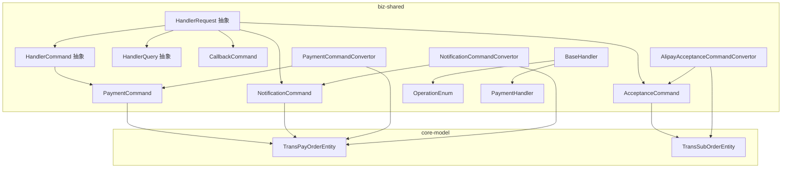
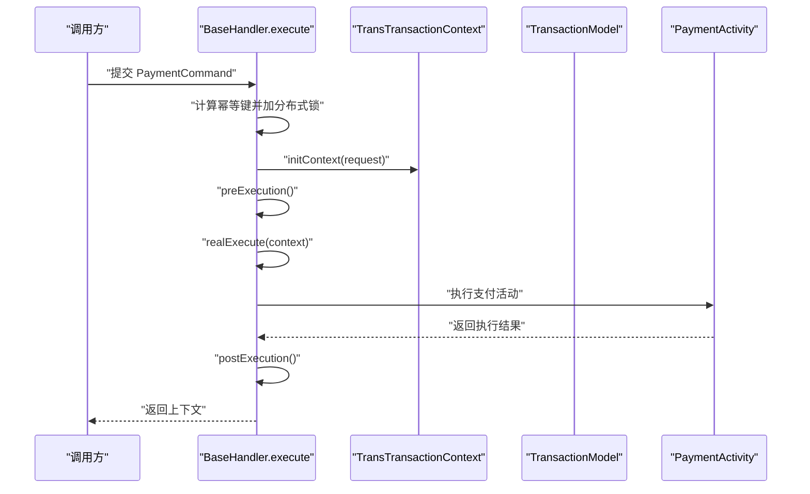
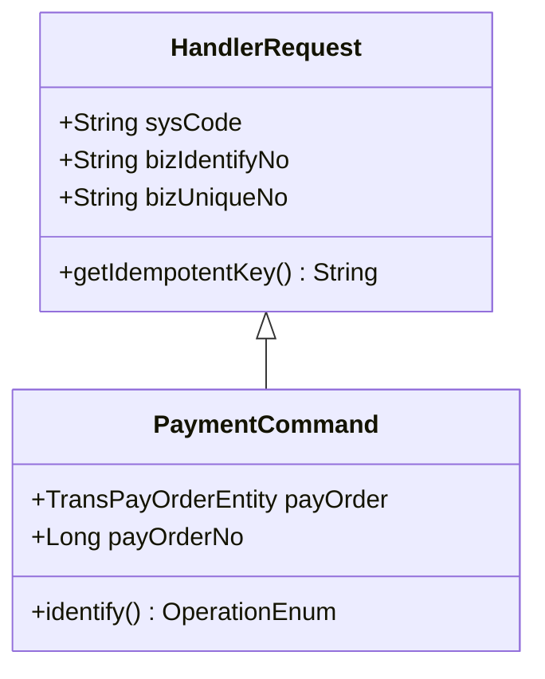
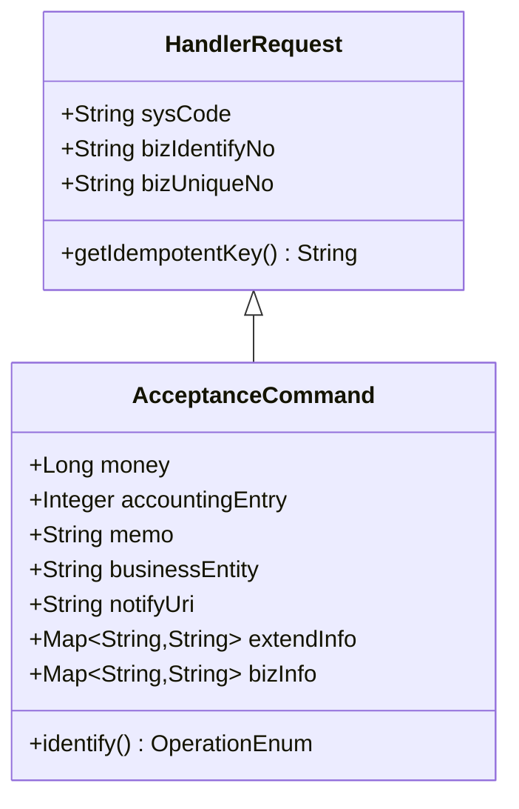
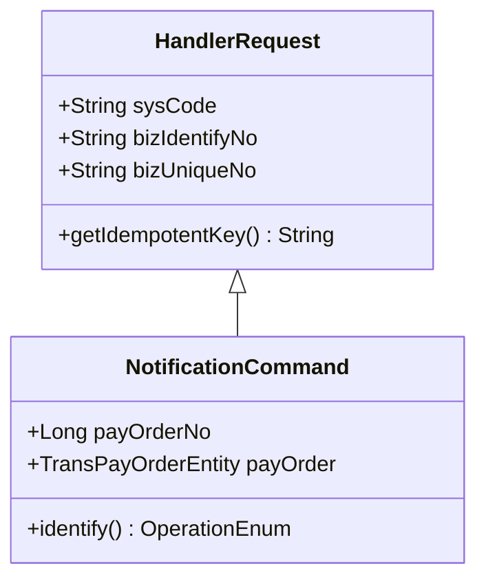
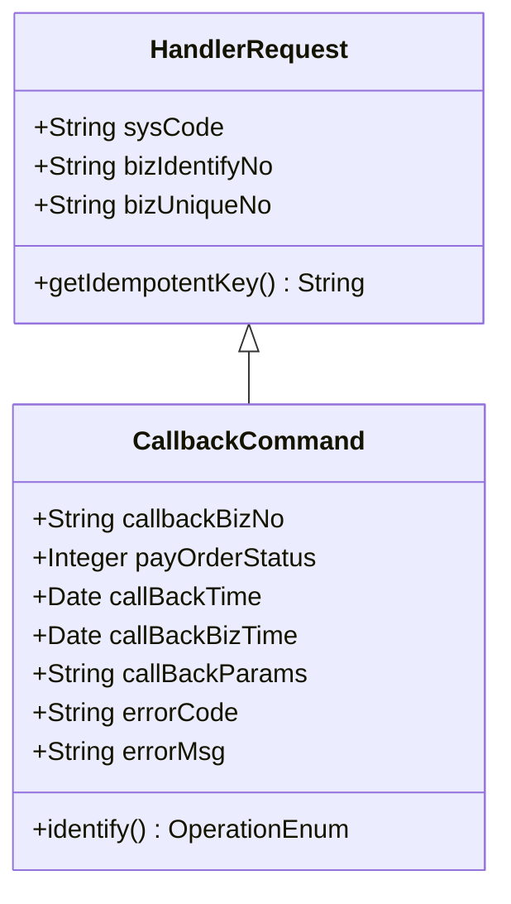
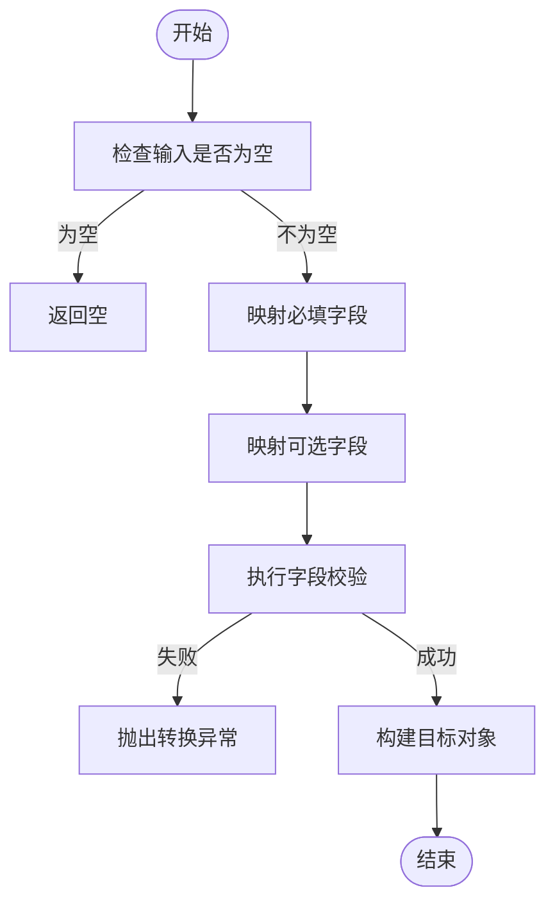
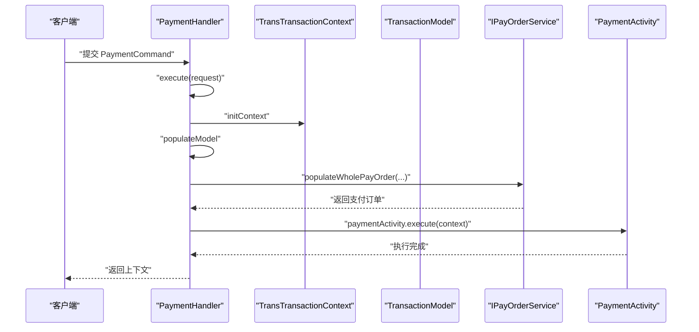
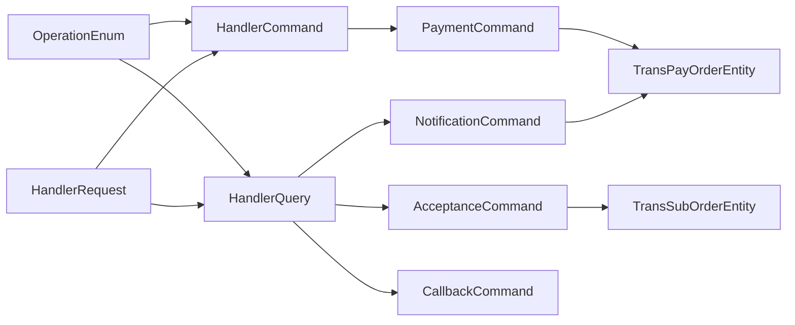

# 请求响应模型

<cite>
**本文引用的文件**
- [HandlerRequest.java](file://biz-shared/src/main/java/com/magicliang/transaction/sys/biz/shared/request/HandlerRequest.java)
- [HandlerCommand.java](file://biz-shared/src/main/java/com/magicliang/transaction/sys/biz/shared/request/HandlerCommand.java)
- [HandlerQuery.java](file://biz-shared/src/main/java/com/magicliang/transaction/sys/biz/shared/request/HandlerQuery.java)
- [PaymentCommand.java](file://biz-shared/src/main/java/com/magicliang/transaction/sys/biz/shared/request/payment/PaymentCommand.java)
- [AcceptanceCommand.java](file://biz-shared/src/main/java/com/magicliang/transaction/sys/biz/shared/request/acceptance/AcceptanceCommand.java)
- [NotificationCommand.java](file://biz-shared/src/main/java/com/magicliang/transaction/sys/biz/shared/request/notification/NotificationCommand.java)
- [CallbackCommand.java](file://biz-shared/src/main/java/com/magicliang/transaction/sys/biz/shared/request/callback/CallbackCommand.java)
- [PaymentCommandConvertor.java](file://biz-shared/src/main/java/com/magicliang/transaction/sys/biz/shared/request/payment/convertor/PaymentCommandConvertor.java)
- [AlipayAcceptanceCommandConvertor.java](file://biz-shared/src/main/java/com/magicliang/transaction/sys/biz/shared/request/acceptance/convertor/AlipayAcceptanceCommandConvertor.java)
- [NotificationCommandConvertor.java](file://biz-shared/src/main/java/com/magicliang/transaction/sys/biz/shared/request/notification/convertor/NotificationCommandConvertor.java)
- [OperationEnum.java](file://biz-shared/src/main/java/com/magicliang/transaction/sys/biz/shared/enums/OperationEnum.java)
- [BaseHandler.java](file://biz-shared/src/main/java/com/magicliang/transaction/sys/biz/shared/handler/BaseHandler.java)
- [PaymentHandler.java](file://biz-shared/src/main/java/com/magicliang/transaction/sys/biz/shared/handler/PaymentHandler.java)
- [TransPayOrderEntity.java](file://core-model/src/main/java/com/magicliang/transaction/sys/core/model/entity/TransPayOrderEntity.java)
- [TransSubOrderEntity.java](file://core-model/src/main/java/com/magicliang/transaction/sys/core/model/entity/TransSubOrderEntity.java)
</cite>

## 目录
1. [引言](#引言)
2. [项目结构](#项目结构)
3. [核心组件](#核心组件)
4. [架构总览](#架构总览)
5. [详细组件分析](#详细组件分析)
6. [依赖分析](#依赖分析)
7. [性能考虑](#性能考虑)
8. [故障排查指南](#故障排查指南)
9. [结论](#结论)
10. [附录](#附录)

## 引言
本文件面向领域驱动交易系统中的统一请求响应模型，系统化阐述“处理器请求”与“处理器命令/查询”的抽象基类设计，以及支付、受理、通知、回调等业务类型的专用请求命令结构；同时介绍命令转换器模式及其在支付、受理、通知场景中的映射策略，帮助开发者快速理解并正确使用统一的请求响应模型。

## 项目结构
围绕请求响应模型的关键模块分布如下：
- biz-shared：共享层，包含请求抽象、各业务命令、转换器与处理器基类
- core-model：核心模型层，包含支付、子订单等实体与领域模型
- biz-service-impl：业务实现层，包含门面、控制器、RPC、Web等集成组件（与请求响应模型协同）

图表来源
- [HandlerRequest.java:1-46](file://biz-shared/src/main/java/com/magicliang/transaction/sys/biz/shared/request/HandlerRequest.java#L1-L46)
- [HandlerCommand.java:1-15](file://biz-shared/src/main/java/com/magicliang/transaction/sys/biz/shared/request/HandlerCommand.java#L1-L15)
- [HandlerQuery.java:1-14](file://biz-shared/src/main/java/com/magicliang/transaction/sys/biz/shared/request/HandlerQuery.java#L1-L14)
- [PaymentCommand.java:1-44](file://biz-shared/src/main/java/com/magicliang/transaction/sys/biz/shared/request/payment/PaymentCommand.java#L1-L44)
- [AcceptanceCommand.java:1-74](file://biz-shared/src/main/java/com/magicliang/transaction/sys/biz/shared/request/acceptance/AcceptanceCommand.java#L1-L74)
- [NotificationCommand.java:1-43](file://biz-shared/src/main/java/com/magicliang/transaction/sys/biz/shared/request/notification/NotificationCommand.java#L1-L43)
- [CallbackCommand.java:1-67](file://biz-shared/src/main/java/com/magicliang/transaction/sys/biz/shared/request/callback/CallbackCommand.java#L1-L67)
- [PaymentCommandConvertor.java:1-38](file://biz-shared/src/main/java/com/magicliang/transaction/sys/biz/shared/request/payment/convertor/PaymentCommandConvertor.java#L1-L38)
- [AlipayAcceptanceCommandConvertor.java:1-34](file://biz-shared/src/main/java/com/magicliang/transaction/sys/biz/shared/request/acceptance/convertor/AlipayAcceptanceCommandConvertor.java#L1-L34)
- [NotificationCommandConvertor.java:1-37](file://biz-shared/src/main/java/com/magicliang/transaction/sys/biz/shared/request/notification/convertor/NotificationCommandConvertor.java#L1-L37)
- [OperationEnum.java:1-97](file://biz-shared/src/main/java/com/magicliang/transaction/sys/biz/shared/enums/OperationEnum.java#L1-L97)
- [BaseHandler.java:1-244](file://biz-shared/src/main/java/com/magicliang/transaction/sys/biz/shared/handler/BaseHandler.java#L1-L244)
- [PaymentHandler.java:1-139](file://biz-shared/src/main/java/com/magicliang/transaction/sys/biz/shared/handler/PaymentHandler.java#L1-L139)
- [TransPayOrderEntity.java:1-216](file://core-model/src/main/java/com/magicliang/transaction/sys/core/model/entity/TransPayOrderEntity.java#L1-L216)
- [TransSubOrderEntity.java:1-24](file://core-model/src/main/java/com/magicliang/transaction/sys/core/model/entity/TransSubOrderEntity.java#L1-L24)

章节来源
- [HandlerRequest.java:1-46](file://biz-shared/src/main/java/com/magicliang/transaction/sys/biz/shared/request/HandlerRequest.java#L1-L46)
- [HandlerCommand.java:1-15](file://biz-shared/src/main/java/com/magicliang/transaction/sys/biz/shared/request/HandlerCommand.java#L1-L15)
- [HandlerQuery.java:1-14](file://biz-shared/src/main/java/com/magicliang/transaction/sys/biz/shared/request/HandlerQuery.java#L1-L14)
- [OperationEnum.java:1-97](file://biz-shared/src/main/java/com/magicliang/transaction/sys/biz/shared/enums/OperationEnum.java#L1-L97)

## 核心组件
本节聚焦“请求响应模型”的基础抽象与业务命令，说明其设计理念与使用场景。

- HandlerRequest 抽象
  - 设计理念：统一上游系统传递的请求元信息，提供幂等键计算能力，便于跨业务命令复用。
  - 关键字段：sysCode、bizIdentifyNo、bizUniqueNo；幂等键由两字段拼接形成。
  - 场景：作为 HandlerCommand 和 HandlerQuery 的父类，确保所有业务请求具备统一的身份标识与幂等保障。

- HandlerCommand 抽象
  - 设计理念：继承 HandlerRequest，表示“写入/变更”类的业务请求，强调可变性与副作用。
  - 场景：支付、受理、回调等会改变系统状态的请求类型。

- HandlerQuery 抽象
  - 设计理念：继承 HandlerRequest，表示“只读/查询”类的业务请求，强调无副作用。
  - 场景：查询未支付订单、查询未发送通知等只读操作。

- OperationEnum 枚举
  - 设计理念：以统一枚举标识不同业务操作类型，便于处理器识别与路由。
  - 包含类型：受理、查询未支付订单、支付、回调、查询未发送通知、通知。

章节来源
- [HandlerRequest.java:18-44](file://biz-shared/src/main/java/com/magicliang/transaction/sys/biz/shared/request/HandlerRequest.java#L18-L44)
- [HandlerCommand.java:12-14](file://biz-shared/src/main/java/com/magicliang/transaction/sys/biz/shared/request/HandlerCommand.java#L12-L14)
- [HandlerQuery.java:12-13](file://biz-shared/src/main/java/com/magicliang/transaction/sys/biz/shared/request/HandlerQuery.java#L12-L13)
- [OperationEnum.java:18-49](file://biz-shared/src/main/java/com/magicliang/transaction/sys/biz/shared/enums/OperationEnum.java#L18-L49)

## 架构总览
统一请求响应模型在处理器执行流程中的位置如下：

图表来源
- [BaseHandler.java:93-121](file://biz-shared/src/main/java/com/magicliang/transaction/sys/biz/shared/handler/BaseHandler.java#L93-L121)
- [PaymentHandler.java:64-70](file://biz-shared/src/main/java/com/magicliang/transaction/sys/biz/shared/handler/PaymentHandler.java#L64-L70)

章节来源
- [BaseHandler.java:93-121](file://biz-shared/src/main/java/com/magicliang/transaction/sys/biz/shared/handler/BaseHandler.java#L93-L121)
- [PaymentHandler.java:46-70](file://biz-shared/src/main/java/com/magicliang/transaction/sys/biz/shared/handler/PaymentHandler.java#L46-L70)

## 详细组件分析

### 支付命令 PaymentCommand
- 字段与语义
  - payOrder：外部提供的完整支付订单实体，若提供则短路加载。
  - payOrderNo：支付订单号，当未提供完整实体时，通过该编号加载。
  - 继承自 HandlerRequest，通过 identify() 返回 OperationEnum.PAYMENT。
- 验证规则（建议）
  - 若提供 payOrder：需保证非空且可被完整加载；若为轻量实体，需补齐全量模型。
  - 若仅提供 payOrderNo：需确保 bizIdentifyNo 与 bizUniqueNo 联合唯一，且能定位到唯一支付订单。
- 使用场景
  - 直接支付或补发支付请求；与 PaymentHandler 协作完成支付活动。

图表来源
- [HandlerRequest.java:18-44](file://biz-shared/src/main/java/com/magicliang/transaction/sys/biz/shared/request/HandlerRequest.java#L18-L44)
- [PaymentCommand.java:20-41](file://biz-shared/src/main/java/com/magicliang/transaction/sys/biz/shared/request/payment/PaymentCommand.java#L20-L41)

章节来源
- [PaymentCommand.java:1-44](file://biz-shared/src/main/java/com/magicliang/transaction/sys/biz/shared/request/payment/PaymentCommand.java#L1-L44)
- [TransPayOrderEntity.java:32-214](file://core-model/src/main/java/com/magicliang/transaction/sys/core/model/entity/TransPayOrderEntity.java#L32-L214)

### 受理命令 AcceptanceCommand
- 字段与语义
  - money：支付金额（分），必填。
  - accountingEntry：会计分录方向（借/贷），必填。
  - memo、businessEntity：备注与支付主体，选填。
  - notifyUri：回调地址，必填。
  - extendInfo、bizInfo：扩展信息，分别用于平台能力与透传业务信息，选填。
  - 继承自 HandlerRequest，通过 identify() 返回 OperationEnum.ACCEPTANCE。
- 验证规则（建议）
  - money 必须为正整数；accountingEntry 必须为借/贷枚举值；notifyUri 必填且格式有效；扩展信息需为合法 JSON 字符串（若提供）。

图表来源
- [HandlerRequest.java:18-44](file://biz-shared/src/main/java/com/magicliang/transaction/sys/biz/shared/request/HandlerRequest.java#L18-L44)
- [AcceptanceCommand.java:21-71](file://biz-shared/src/main/java/com/magicliang/transaction/sys/biz/shared/request/acceptance/AcceptanceCommand.java#L21-L71)

章节来源
- [AcceptanceCommand.java:1-74](file://biz-shared/src/main/java/com/magicliang/transaction/sys/biz/shared/request/acceptance/AcceptanceCommand.java#L1-L74)

### 通知命令 NotificationCommand
- 字段与语义
  - payOrderNo：支付订单号。
  - payOrder：外部提供的支付订单实体，若提供则优先使用。
  - 继承自 HandlerRequest，通过 identify() 返回 OperationEnum.NOTIFY。
- 验证规则（建议）
  - 若提供 payOrder：需可加载；若仅提供 payOrderNo：需全局唯一且可定位到支付订单。

图表来源
- [HandlerRequest.java:18-44](file://biz-shared/src/main/java/com/magicliang/transaction/sys/biz/shared/request/HandlerRequest.java#L18-L44)
- [NotificationCommand.java:20-41](file://biz-shared/src/main/java/com/magicliang/transaction/sys/biz/shared/request/notification/NotificationCommand.java#L20-L41)

章节来源
- [NotificationCommand.java:1-43](file://biz-shared/src/main/java/com/magicliang/transaction/sys/biz/shared/request/notification/NotificationCommand.java#L1-L43)

### 回调命令 CallbackCommand
- 字段与语义
  - callbackBizNo：回调业务号（退票场景下等于退票流水号）。
  - payOrderStatus：支付订单状态。
  - callBackTime、callBackBizTime：回调时间与业务时间。
  - callBackParams：回调参数。
  - errorCode、errorMsg：错误码与错误信息。
  - 继承自 HandlerRequest，通过 identify() 返回 OperationEnum.CALLBACK。
- 验证规则（建议）
  - payOrderStatus 必须为有效状态码；时间字段需符合时序约束；参数与错误信息需与上游一致。

图表来源
- [HandlerRequest.java:18-44](file://biz-shared/src/main/java/com/magicliang/transaction/sys/biz/shared/request/HandlerRequest.java#L18-L44)
- [CallbackCommand.java:20-65](file://biz-shared/src/main/java/com/magicliang/transaction/sys/biz/shared/request/callback/CallbackCommand.java#L20-L65)

章节来源
- [CallbackCommand.java:1-67](file://biz-shared/src/main/java/com/magicliang/transaction/sys/biz/shared/request/callback/CallbackCommand.java#L1-L67)

### 命令转换器模式
- 设计理念
  - 将外部请求命令与内部领域模型解耦，通过转换器完成数据映射与清洗，避免在命令上直接承载领域逻辑。
- 典型转换器
  - PaymentCommandConvertor.fromDomainEntity：将领域支付订单实体转换为支付命令（当前实现为空实现，建议补充字段映射）。
  - AlipayAcceptanceCommandConvertor.toDomainEntity：将受理命令转换为领域子订单实体（当前实现为空实现，建议补充字段映射）。
  - NotificationCommandConvertor.fromDomainEntity：将领域支付订单实体转换为通知命令（当前实现为空实现，建议补充字段映射）。
- 数据映射策略（建议）
  - 采用“浅拷贝+显式映射”策略，优先映射必填字段，再处理可选字段与校验。
  - 对于复杂字段（如扩展信息、业务信息），确保 JSON 字符串合法性与长度限制。
  - 对金额字段统一为“分”，避免精度丢失。

图表来源
- [PaymentCommandConvertor.java:30-36](file://biz-shared/src/main/java/com/magicliang/transaction/sys/biz/shared/request/payment/convertor/PaymentCommandConvertor.java#L30-L36)
- [AlipayAcceptanceCommandConvertor.java:30-32](file://biz-shared/src/main/java/com/magicliang/transaction/sys/biz/shared/request/acceptance/convertor/AlipayAcceptanceCommandConvertor.java#L30-L32)
- [NotificationCommandConvertor.java:30-35](file://biz-shared/src/main/java/com/magicliang/transaction/sys/biz/shared/request/notification/convertor/NotificationCommandConvertor.java#L30-L35)

章节来源
- [PaymentCommandConvertor.java:1-38](file://biz-shared/src/main/java/com/magicliang/transaction/sys/biz/shared/request/payment/convertor/PaymentCommandConvertor.java#L1-L38)
- [AlipayAcceptanceCommandConvertor.java:1-34](file://biz-shared/src/main/java/com/magicliang/transaction/sys/biz/shared/request/acceptance/convertor/AlipayAcceptanceCommandConvertor.java#L1-L34)
- [NotificationCommandConvertor.java:1-37](file://biz-shared/src/main/java/com/magicliang/transaction/sys/biz/shared/request/notification/convertor/NotificationCommandConvertor.java#L1-L37)

### 处理器与上下文执行流程
- BaseHandler.execute
  - 计算幂等键并加分布式锁，确保并发安全。
  - 初始化上下文，执行前置/真实处理/后置处理。
  - 在涉及写支付订单的场景中，对已进入终态的支付订单进行错误码与错误信息回填。
- PaymentHandler
  - 通过 populateModel 决定使用外部提供的支付订单或按业务标识加载全量模型。
  - 调用支付活动执行支付，标记执行成功。

图表来源
- [BaseHandler.java:93-121](file://biz-shared/src/main/java/com/magicliang/transaction/sys/biz/shared/handler/BaseHandler.java#L93-L121)
- [PaymentHandler.java:46-88](file://biz-shared/src/main/java/com/magicliang/transaction/sys/biz/shared/handler/PaymentHandler.java#L46-L88)

章节来源
- [BaseHandler.java:93-121](file://biz-shared/src/main/java/com/magicliang/transaction/sys/biz/shared/handler/BaseHandler.java#L93-L121)
- [PaymentHandler.java:46-138](file://biz-shared/src/main/java/com/magicliang/transaction/sys/biz/shared/handler/PaymentHandler.java#L46-L138)

## 依赖分析
- 组件内聚与耦合
  - HandlerRequest 为所有业务命令提供统一身份与幂等键，降低上层对具体命令类型的感知。
  - HandlerCommand/HandlerQuery 与 OperationEnum 耦合，用于处理器识别与路由。
  - PaymentCommand/NotificationCommand 依赖 TransPayOrderEntity；受理命令依赖 TransSubOrderEntity。
  - 转换器与命令/实体之间为单向依赖，保持清晰的映射边界。
- 外部依赖
  - 分布式锁、支付订单服务、领域活动等在 BaseHandler 中注入，体现“控制反转”。

图表来源
- [OperationEnum.java:18-49](file://biz-shared/src/main/java/com/magicliang/transaction/sys/biz/shared/enums/OperationEnum.java#L18-L49)
- [HandlerRequest.java:18-44](file://biz-shared/src/main/java/com/magicliang/transaction/sys/biz/shared/request/HandlerRequest.java#L18-L44)
- [HandlerCommand.java:12-14](file://biz-shared/src/main/java/com/magicliang/transaction/sys/biz/shared/request/HandlerCommand.java#L12-L14)
- [HandlerQuery.java:12-13](file://biz-shared/src/main/java/com/magicliang/transaction/sys/biz/shared/request/HandlerQuery.java#L12-L13)
- [PaymentCommand.java:20-41](file://biz-shared/src/main/java/com/magicliang/transaction/sys/biz/shared/request/payment/PaymentCommand.java#L20-L41)
- [AcceptanceCommand.java:21-71](file://biz-shared/src/main/java/com/magicliang/transaction/sys/biz/shared/request/acceptance/AcceptanceCommand.java#L21-L71)
- [NotificationCommand.java:20-41](file://biz-shared/src/main/java/com/magicliang/transaction/sys/biz/shared/request/notification/NotificationCommand.java#L20-L41)
- [TransPayOrderEntity.java:32-214](file://core-model/src/main/java/com/magicliang/transaction/sys/core/model/entity/TransPayOrderEntity.java#L32-L214)
- [TransSubOrderEntity.java:17-23](file://core-model/src/main/java/com/magicliang/transaction/sys/core/model/entity/TransSubOrderEntity.java#L17-L23)

章节来源
- [OperationEnum.java:1-97](file://biz-shared/src/main/java/com/magicliang/transaction/sys/biz/shared/enums/OperationEnum.java#L1-L97)
- [TransPayOrderEntity.java:1-216](file://core-model/src/main/java/com/magicliang/transaction/sys/core/model/entity/TransPayOrderEntity.java#L1-L216)
- [TransSubOrderEntity.java:1-24](file://core-model/src/main/java/com/magicliang/transaction/sys/core/model/entity/TransSubOrderEntity.java#L1-L24)

## 性能考虑
- 幂等与锁
  - 使用幂等键与分布式锁保护关键路径，避免重复执行带来的资源浪费与数据不一致。
- 查询与加载
  - PaymentHandler 在外部提供完整支付订单时走短路路径，减少数据库查询次数。
- 转换器优化
  - 建议在转换器中缓存常用映射规则与校验器，降低重复开销。
- 日志与监控
  - 在处理器前后置阶段输出关键指标，便于定位性能瓶颈。

## 故障排查指南
- 常见错误与定位
  - 幂等键为空：触发无效幂等键错误，需检查上游 sysCode、bizIdentifyNo、bizUniqueNo 的完整性。
  - 已进入终态的支付订单：若状态为失败/关闭/退票，处理器会回填对应错误码与错误信息，需根据渠道错误码定位问题。
  - 模型加载失败：当外部未提供完整支付订单且无法按业务标识加载时，将触发无效模型错误。
- 排查步骤
  - 确认幂等键计算是否正确（bizIdentifyNo 与 bizUniqueNo 拼接）。
  - 核对支付订单状态与渠道错误码，确认是否为终态导致拒绝执行。
  - 检查转换器映射是否遗漏必填字段，尤其是金额单位与扩展信息格式。

章节来源
- [BaseHandler.java:176-178](file://biz-shared/src/main/java/com/magicliang/transaction/sys/biz/shared/handler/BaseHandler.java#L176-L178)
- [BaseHandler.java:198-213](file://biz-shared/src/main/java/com/magicliang/transaction/sys/biz/shared/handler/BaseHandler.java#L198-L213)
- [PaymentHandler.java:123-124](file://biz-shared/src/main/java/com/magicliang/transaction/sys/biz/shared/handler/PaymentHandler.java#L123-L124)

## 结论
统一请求响应模型通过 HandlerRequest 抽象与 OperationEnum 枚举，实现了对支付、受理、通知、回调等业务命令的标准化建模；配合处理器基类与转换器模式，既保证了跨业务的一致性，又为扩展与演进提供了清晰边界。建议在实际落地中完善转换器映射与校验逻辑，确保字段一致性与性能稳定性。

## 附录
- 最佳实践清单
  - 所有命令均应继承 HandlerRequest，确保幂等键与身份标识一致。
  - 必填字段在命令与转换器中均需进行显式校验。
  - 金额统一使用“分”，避免精度问题。
  - 扩展信息与业务信息需严格校验 JSON 格式与长度。
  - 在涉及写支付订单的场景中，务必检查支付订单状态，防止对终态数据的二次写入。