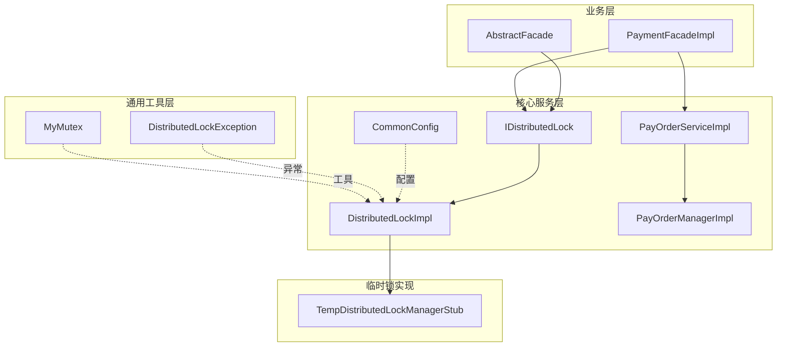
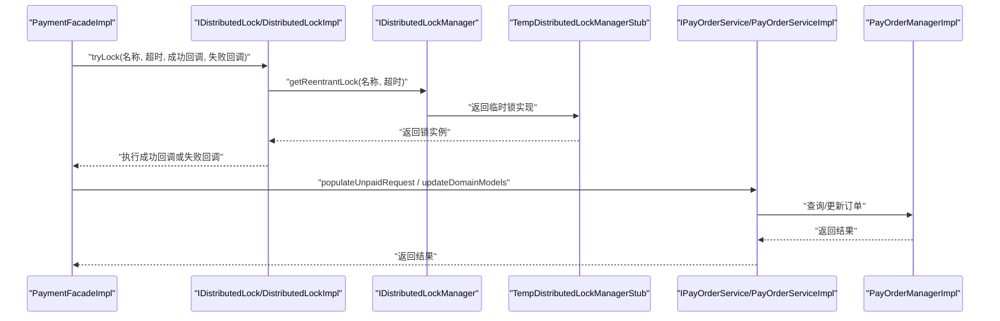
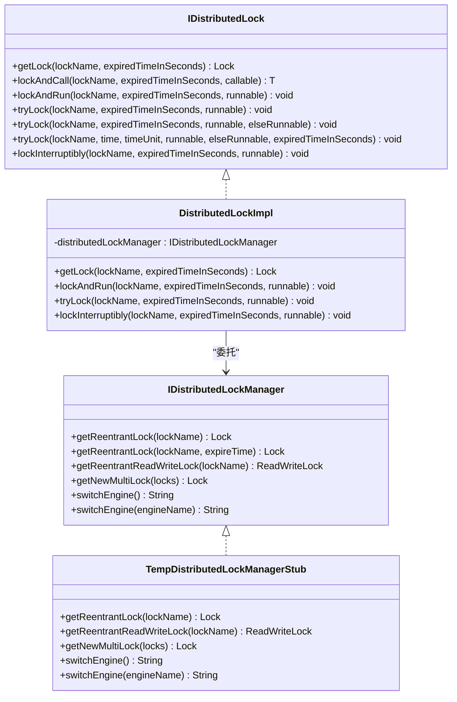
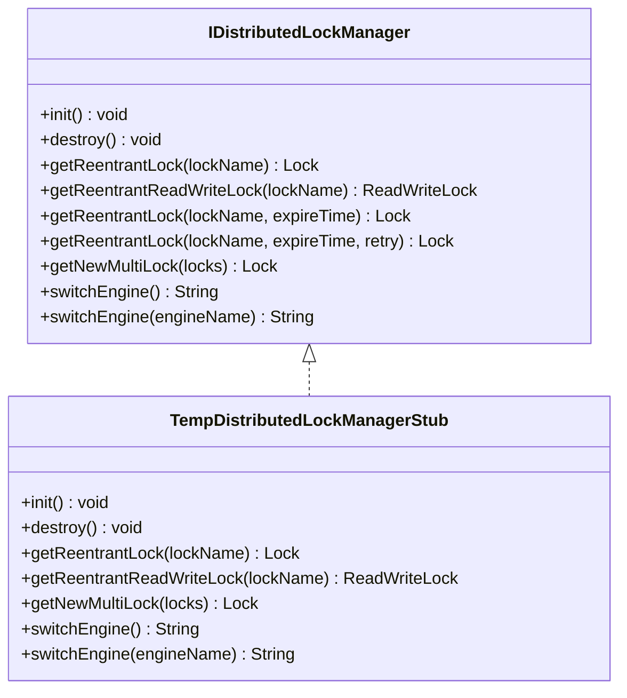
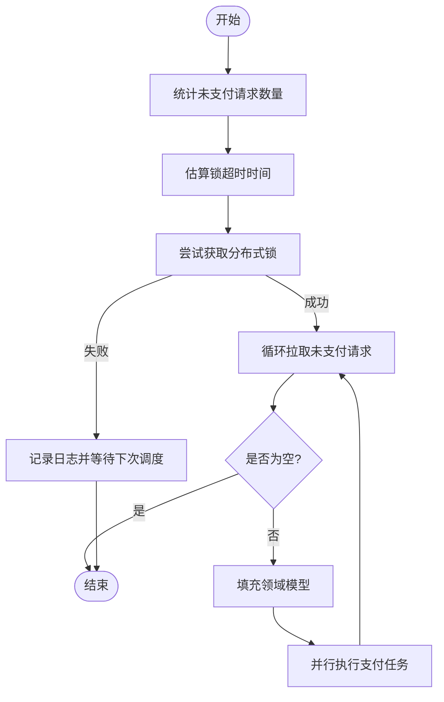
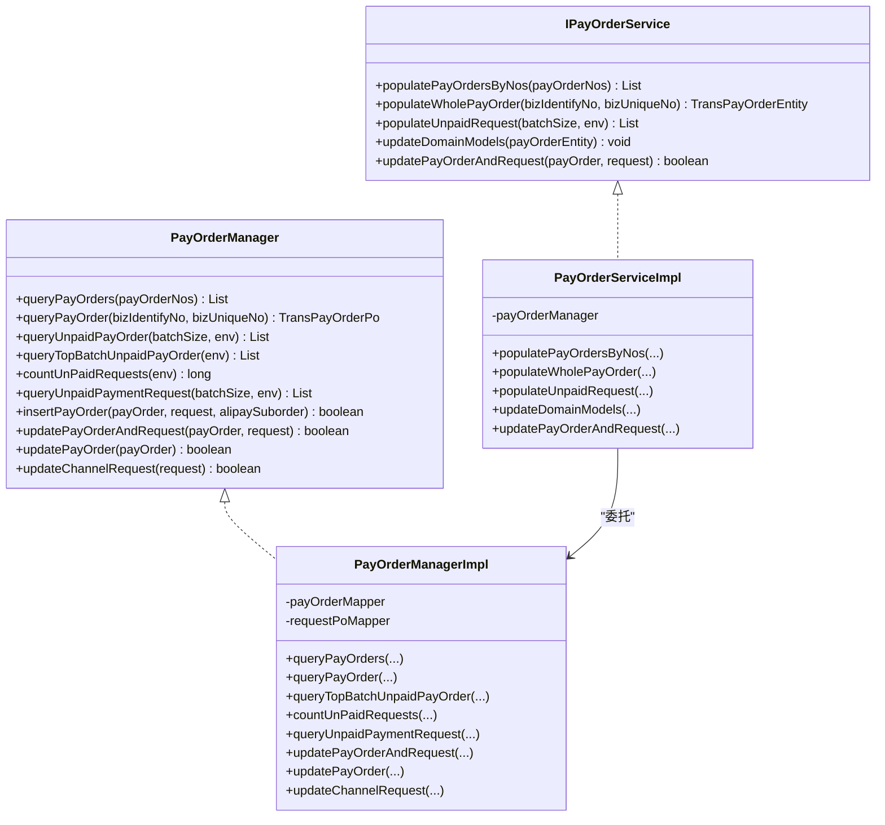
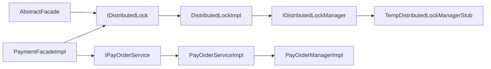

# 分布式锁管理

<cite>
**本文引用的文件**
- [IDistributedLock.java](file://core-service/src/main/java/com/magicliang/transaction/sys/core/service/IDistributedLock.java)
- [DistributedLockImpl.java](file://core-service/src/main/java/com/magicliang/transaction/sys/core/service/impl/DistributedLockImpl.java)
- [IDistributedLockManager.java](file://core-service/src/main/java/com/magicliang/transaction/sys/core/manager/IDistributedLockManager.java)
- [TempDistributedLockManagerStub.java](file://core-service/src/main/java/com/magicliang/transaction/sys/core/manager/impl/TempDistributedLockManagerStub.java)
- [PayOrderManager.java](file://core-service/src/main/java/com/magicliang/transaction/sys/core/manager/PayOrderManager.java)
- [PayOrderManagerImpl.java](file://core-service/src/main/java/com/magicliang/transaction/sys/core/manager/impl/PayOrderManagerImpl.java)
- [IPayOrderService.java](file://core-service/src/main/java/com/magicliang/transaction/sys/core/service/IPayOrderService.java)
- [PayOrderServiceImpl.java](file://core-service/src/main/java/com/magicliang/transaction/sys/core/service/impl/PayOrderServiceImpl.java)
- [AbstractFacade.java](file://biz-service-impl/src/main/java/com/magicliang/transaction/sys/biz/service/impl/facade/impl/AbstractFacade.java)
- [PaymentFacadeImpl.java](file://biz-service-impl/src/main/java/com/magicliang/transaction/sys/biz/service/impl/facade/impl/PaymentFacadeImpl.java)
- [CommonConfig.java](file://core-service/src/main/java/com/magicliang/transaction/sys/core/config/CommonConfig.java)
- [DistributedLockException.java](file://common-util/src/main/java/com/magicliang/transaction/sys/common/exception/DistributedLockException.java)
- [MyMutex.java](file://common-util/src/main/java/com/magicliang/transaction/sys/common/concurrent/lock/MyMutex.java)
</cite>

## 目录
1. [简介](#简介)
2. [项目结构](#项目结构)
3. [核心组件](#核心组件)
4. [架构总览](#架构总览)
5. [详细组件分析](#详细组件分析)
6. [依赖分析](#依赖分析)
7. [性能考量](#性能考量)
8. [故障排查指南](#故障排查指南)
9. [结论](#结论)
10. [附录](#附录)

## 简介
本文件围绕领域驱动交易系统中的分布式锁管理展开，系统性梳理分布式锁的获取、释放与续期机制，覆盖锁超时处理与死锁预防策略；深入解析分布式锁管理器接口与临时实现，阐述其在事务一致性保障中的作用；并结合支付门面与订单管理器，说明分布式锁如何实现业务流程的原子性与隔离性。最后提供测试环境下的锁模拟与调试支持说明，以及最佳实践与使用示例路径。

## 项目结构
分布式锁相关代码分布在以下模块与包中：
- core-service：分布式锁服务接口与实现、订单管理器接口与实现、支付服务接口与实现
- biz-service-impl：业务门面层，消费分布式锁服务与支付服务
- common-util：通用工具与异常定义，包含分布式锁异常类型
- core-service/src/main/java/com/magicliang/transaction/sys/core/service：分布式锁服务接口与实现
- core-service/src/main/java/com/magicliang/transaction/sys/core/manager：分布式锁管理器接口与临时实现
- core-service/src/main/java/com/magicliang/transaction/sys/core/service/impl：支付订单服务实现
- core-service/src/main/java/com/magicliang/transaction/sys/core/manager/impl：支付订单管理器实现
- biz-service-impl/src/main/java/com/magicliang/transaction/sys/biz/service/impl/facade/impl：业务门面实现
- common-util/src/main/java/com/magicliang/transaction/sys/common/exception：异常定义
- common-util/src/main/java/com/magicliang/transaction/sys/common/concurrent/lock：并发锁工具

**图表来源**
- [AbstractFacade.java:17-36](file://biz-service-impl/src/main/java/com/magicliang/transaction/sys/biz/service/impl/facade/impl/AbstractFacade.java#L17-L36)
- [PaymentFacadeImpl.java:34-93](file://biz-service-impl/src/main/java/com/magicliang/transaction/sys/biz/service/impl/facade/impl/PaymentFacadeImpl.java#L34-L93)
- [IDistributedLock.java:16-97](file://core-service/src/main/java/com/magicliang/transaction/sys/core/service/IDistributedLock.java#L16-L97)
- [DistributedLockImpl.java:26-126](file://core-service/src/main/java/com/magicliang/transaction/sys/core/service/impl/DistributedLockImpl.java#L26-L126)
- [PayOrderManagerImpl.java:41-526](file://core-service/src/main/java/com/magicliang/transaction/sys/core/manager/impl/PayOrderManagerImpl.java#L41-L526)
- [PayOrderServiceImpl.java:43-460](file://core-service/src/main/java/com/magicliang/transaction/sys/core/service/impl/PayOrderServiceImpl.java#L43-L460)
- [TempDistributedLockManagerStub.java:20-85](file://core-service/src/main/java/com/magicliang/transaction/sys/core/manager/impl/TempDistributedLockManagerStub.java#L20-L85)
- [CommonConfig.java:20-44](file://core-service/src/main/java/com/magicliang/transaction/sys/core/config/CommonConfig.java#L20-L44)
- [DistributedLockException.java:12-32](file://common-util/src/main/java/com/magicliang/transaction/sys/common/exception/DistributedLockException.java#L12-L32)
- [MyMutex.java:20-200](file://common-util/src/main/java/com/magicliang/transaction/sys/common/concurrent/lock/MyMutex.java#L20-L200)

**章节来源**
- [AbstractFacade.java:17-36](file://biz-service-impl/src/main/java/com/magicliang/transaction/sys/biz/service/impl/facade/impl/AbstractFacade.java#L17-L36)
- [PaymentFacadeImpl.java:34-93](file://biz-service-impl/src/main/java/com/magicliang/transaction/sys/biz/service/impl/facade/impl/PaymentFacadeImpl.java#L34-L93)
- [IDistributedLock.java:16-97](file://core-service/src/main/java/com/magicliang/transaction/sys/core/service/IDistributedLock.java#L16-L97)
- [DistributedLockImpl.java:26-126](file://core-service/src/main/java/com/magicliang/transaction/sys/core/service/impl/DistributedLockImpl.java#L26-126)
- [PayOrderManagerImpl.java:41-526](file://core-service/src/main/java/com/magicliang/transaction/sys/core/manager/impl/PayOrderManagerImpl.java#L41-526)
- [PayOrderServiceImpl.java:43-460](file://core-service/src/main/java/com/magicliang/transaction/sys/core/service/impl/PayOrderServiceImpl.java#L43-460)
- [TempDistributedLockManagerStub.java:20-85](file://core-service/src/main/java/com/magicliang/transaction/sys/core/manager/impl/TempDistributedLockManagerStub.java#L20-85)
- [CommonConfig.java:20-44](file://core-service/src/main/java/com/magicliang/transaction/sys/core/config/CommonConfig.java#L20-44)
- [DistributedLockException.java:12-32](file://common-util/src/main/java/com/magicliang/transaction/sys/common/exception/DistributedLockException.java#L12-32)
- [MyMutex.java:20-200](file://common-util/src/main/java/com/magicliang/transaction/sys/common/concurrent/lock/MyMutex.java#L20-200)

## 核心组件
- 分布式锁服务接口与实现
  - 接口定义了获取锁、带回调的加锁执行、试锁、可中断阻塞锁等能力，确保在分布式场景下对共享资源进行互斥访问。
  - 实现负责参数校验与异常抛出，委托底层管理器创建具体锁实例。
- 分布式锁管理器接口与临时实现
  - 管理器抽象了底层锁引擎的创建与切换，提供可重入锁、读写锁、多锁组合等能力。
  - 临时实现用于测试与开发环境，提供空实现以避免外部依赖。
- 订单管理器与支付服务
  - 订单管理器封装数据库访问与事务边界，支付服务负责领域模型的填充与更新。
- 业务门面
  - 门面层通过分布式锁服务协调批量支付等高并发场景，确保同一时间只有一个实例在执行关键批处理逻辑。

**章节来源**
- [IDistributedLock.java:16-97](file://core-service/src/main/java/com/magicliang/transaction/sys/core/service/IDistributedLock.java#L16-L97)
- [DistributedLockImpl.java:26-126](file://core-service/src/main/java/com/magicliang/transaction/sys/core/service/impl/DistributedLockImpl.java#L26-126)
- [IDistributedLockManager.java:15-42](file://core-service/src/main/java/com/magicliang/transaction/sys/core/manager/IDistributedLockManager.java#L15-42)
- [TempDistributedLockManagerStub.java:20-85](file://core-service/src/main/java/com/magicliang/transaction/sys/core/manager/impl/TempDistributedLockManagerStub.java#L20-85)
- [PayOrderManager.java:18-187](file://core-service/src/main/java/com/magicliang/transaction/sys/core/manager/PayOrderManager.java#L18-187)
- [PayOrderManagerImpl.java:41-526](file://core-service/src/main/java/com/magicliang/transaction/sys/core/manager/impl/PayOrderManagerImpl.java#L41-526)
- [IPayOrderService.java:16-158](file://core-service/src/main/java/com/magicliang/transaction/sys/core/service/IPayOrderService.java#L16-158)
- [PayOrderServiceImpl.java:43-460](file://core-service/src/main/java/com/magicliang/transaction/sys/core/service/impl/PayOrderServiceImpl.java#L43-460)
- [AbstractFacade.java:17-36](file://biz-service-impl/src/main/java/com/magicliang/transaction/sys/biz/service/impl/facade/impl/AbstractFacade.java#L17-L36)
- [PaymentFacadeImpl.java:34-93](file://biz-service-impl/src/main/java/com/magicliang/transaction/sys/biz/service/impl/facade/impl/PaymentFacadeImpl.java#L34-L93)

## 架构总览
分布式锁在系统中的位置如下：
- 业务门面层通过注入的分布式锁服务接口进行加锁控制
- 分布式锁服务实现委托底层分布式锁管理器创建具体锁实例
- 订单管理器与支付服务在事务边界内执行数据库操作
- 通用异常与并发工具为锁实现提供支撑

**图表来源**
- [PaymentFacadeImpl.java:67-93](file://biz-service-impl/src/main/java/com/magicliang/transaction/sys/biz/service/impl/facade/impl/PaymentFacadeImpl.java#L67-L93)
- [IDistributedLock.java:56-97](file://core-service/src/main/java/com/magicliang/transaction/sys/core/service/IDistributedLock.java#L56-L97)
- [DistributedLockImpl.java:42-50](file://core-service/src/main/java/com/magicliang/transaction/sys/core/service/impl/DistributedLockImpl.java#L42-50)
- [IDistributedLockManager.java:21-37](file://core-service/src/main/java/com/magicliang/transaction/sys/core/manager/IDistributedLockManager.java#L21-37)
- [TempDistributedLockManagerStub.java:33-50](file://core-service/src/main/java/com/magicliang/transaction/sys/core/manager/impl/TempDistributedLockManagerStub.java#L33-50)
- [IPayOrderService.java:159-192](file://core-service/src/main/java/com/magicliang/transaction/sys/core/service/IPayOrderService.java#L159-192)
- [PayOrderServiceImpl.java:159-192](file://core-service/src/main/java/com/magicliang/transaction/sys/core/service/impl/PayOrderServiceImpl.java#L159-192)
- [PayOrderManagerImpl.java:159-162](file://core-service/src/main/java/com/magicliang/transaction/sys/core/manager/impl/PayOrderManagerImpl.java#L159-162)

## 详细组件分析

### 分布式锁服务接口与实现
- 接口能力
  - 获取锁实例、带回调的加锁执行、试锁、计时试锁、可中断阻塞锁等，覆盖不同使用场景。
- 实现要点
  - 参数校验：锁名不能为空，过期时间必须大于0，否则抛出分布式锁异常。
  - 委托管理器：将锁名与过期时间传递给底层管理器创建具体锁实例。
  - 生命周期钩子：在加锁前后与解锁后分别执行钩子方法，便于监控与审计。
- 异常处理
  - 统一通过分布式锁异常类型向上抛出，便于业务捕获与处理。

**图表来源**
- [IDistributedLock.java:16-97](file://core-service/src/main/java/com/magicliang/transaction/sys/core/service/IDistributedLock.java#L16-L97)
- [DistributedLockImpl.java:26-126](file://core-service/src/main/java/com/magicliang/transaction/sys/core/service/impl/DistributedLockImpl.java#L26-126)
- [IDistributedLockManager.java:15-42](file://core-service/src/main/java/com/magicliang/transaction/sys/core/manager/IDistributedLockManager.java#L15-42)
- [TempDistributedLockManagerStub.java:20-85](file://core-service/src/main/java/com/magicliang/transaction/sys/core/manager/impl/TempDistributedLockManagerStub.java#L20-85)

**章节来源**
- [IDistributedLock.java:16-97](file://core-service/src/main/java/com/magicliang/transaction/sys/core/service/IDistributedLock.java#L16-L97)
- [DistributedLockImpl.java:26-126](file://core-service/src/main/java/com/magicliang/transaction/sys/core/service/impl/DistributedLockImpl.java#L26-126)
- [DistributedLockException.java:12-32](file://common-util/src/main/java/com/magicliang/transaction/sys/common/exception/DistributedLockException.java#L12-32)

### 分布式锁管理器与临时实现
- 管理器职责
  - 提供可重入锁、读写锁、多锁组合等工厂方法，支持设置过期时间与重试策略。
  - 提供引擎切换能力，便于在不同锁实现之间迁移。
- 临时实现
  - 在测试与开发环境中提供空实现，避免对外部分布式锁引擎的依赖。
  - 通过统一接口保持业务代码不变，便于替换为真实实现。

**图表来源**
- [IDistributedLockManager.java:15-42](file://core-service/src/main/java/com/magicliang/transaction/sys/core/manager/IDistributedLockManager.java#L15-42)
- [TempDistributedLockManagerStub.java:20-85](file://core-service/src/main/java/com/magicliang/transaction/sys/core/manager/impl/TempDistributedLockManagerStub.java#L20-85)

**章节来源**
- [IDistributedLockManager.java:15-42](file://core-service/src/main/java/com/magicliang/transaction/sys/core/manager/IDistributedLockManager.java#L15-42)
- [TempDistributedLockManagerStub.java:20-85](file://core-service/src/main/java/com/magicliang/transaction/sys/core/manager/impl/TempDistributedLockManagerStub.java#L20-85)

### 支付门面与批量支付流程
- 批量支付流程
  - 估算未支付订单总量，弹性计算锁超时时间，使用分布式锁保护批处理逻辑。
  - 在锁内循环拉取未支付请求，填充完整领域模型后并行执行支付任务。
- 关键点
  - 锁超时与批次数的平衡：吞吐量与锁持有时间成反比，需根据实际环境调整。
  - 嵌套锁风险提示：注释中明确提醒嵌套锁可能导致问题，应避免在锁内再次加锁。

**图表来源**
- [PaymentFacadeImpl.java:67-93](file://biz-service-impl/src/main/java/com/magicliang/transaction/sys/biz/service/impl/facade/impl/PaymentFacadeImpl.java#L67-L93)
- [IPayOrderService.java:159-192](file://core-service/src/main/java/com/magicliang/transaction/sys/core/service/IPayOrderService.java#L159-192)
- [PayOrderServiceImpl.java:159-192](file://core-service/src/main/java/com/magicliang/transaction/sys/core/service/impl/PayOrderServiceImpl.java#L159-192)

**章节来源**
- [PaymentFacadeImpl.java:67-93](file://biz-service-impl/src/main/java/com/magicliang/transaction/sys/biz/service/impl/facade/impl/PaymentFacadeImpl.java#L67-L93)
- [IPayOrderService.java:159-192](file://core-service/src/main/java/com/magicliang/transaction/sys/core/service/IPayOrderService.java#L159-192)
- [PayOrderServiceImpl.java:159-192](file://core-service/src/main/java/com/magicliang/transaction/sys/core/service/impl/PayOrderServiceImpl.java#L159-192)

### 订单管理器与支付服务
- 订单管理器
  - 提供查询、计数、分页查询、插入与更新等能力，封装事务边界与分页策略。
  - 通过分批查询与分页辅助方法，避免一次性加载大量数据。
- 支付服务
  - 负责将持久化对象转换为领域模型，填充支付请求、通知请求与子订单。
  - 提供更新域模型与插入通知请求的接口，配合分布式锁保证一致性。

**图表来源**
- [PayOrderManager.java:18-187](file://core-service/src/main/java/com/magicliang/transaction/sys/core/manager/PayOrderManager.java#L18-187)
- [PayOrderManagerImpl.java:41-526](file://core-service/src/main/java/com/magicliang/transaction/sys/core/manager/impl/PayOrderManagerImpl.java#L41-526)
- [IPayOrderService.java:16-158](file://core-service/src/main/java/com/magicliang/transaction/sys/core/service/IPayOrderService.java#L16-158)
- [PayOrderServiceImpl.java:43-460](file://core-service/src/main/java/com/magicliang/transaction/sys/core/service/impl/PayOrderServiceImpl.java#L43-460)

**章节来源**
- [PayOrderManager.java:18-187](file://core-service/src/main/java/com/magicliang/transaction/sys/core/manager/PayOrderManager.java#L18-187)
- [PayOrderManagerImpl.java:41-526](file://core-service/src/main/java/com/magicliang/transaction/sys/core/manager/impl/PayOrderManagerImpl.java#L41-526)
- [IPayOrderService.java:16-158](file://core-service/src/main/java/com/magicliang/transaction/sys/core/service/IPayOrderService.java#L16-158)
- [PayOrderServiceImpl.java:43-460](file://core-service/src/main/java/com/magicliang/transaction/sys/core/service/impl/PayOrderServiceImpl.java#L43-460)

### 业务门面与分布式锁集成
- 门面层通过注入分布式锁服务，将锁的生命周期与业务流程绑定。
- 在批量支付场景中，先估算锁超时时间，再执行 tryLock，确保批处理的原子性与隔离性。

**章节来源**
- [AbstractFacade.java:17-36](file://biz-service-impl/src/main/java/com/magicliang/transaction/sys/biz/service/impl/facade/impl/AbstractFacade.java#L17-L36)
- [PaymentFacadeImpl.java:67-93](file://biz-service-impl/src/main/java/com/magicliang/transaction/sys/biz/service/impl/facade/impl/PaymentFacadeImpl.java#L67-L93)

## 依赖分析
- 松耦合设计
  - 业务门面仅依赖分布式锁服务接口，不关心具体实现，便于替换为真实分布式锁引擎。
  - 支付服务与订单管理器通过接口解耦，便于单元测试与集成测试。
- 依赖方向
  - 业务门面 → 分布式锁服务 → 分布式锁管理器 → 临时实现
  - 支付服务 → 订单管理器
- 循环依赖
  - 未发现循环依赖，各层职责清晰。

**图表来源**
- [AbstractFacade.java:17-36](file://biz-service-impl/src/main/java/com/magicliang/transaction/sys/biz/service/impl/facade/impl/AbstractFacade.java#L17-L36)
- [PaymentFacadeImpl.java:34-93](file://biz-service-impl/src/main/java/com/magicliang/transaction/sys/biz/service/impl/facade/impl/PaymentFacadeImpl.java#L34-L93)
- [IPayOrderService.java:16-158](file://core-service/src/main/java/com/magicliang/transaction/sys/core/service/IPayOrderService.java#L16-158)
- [PayOrderServiceImpl.java:43-460](file://core-service/src/main/java/com/magicliang/transaction/sys/core/service/impl/PayOrderServiceImpl.java#L43-460)
- [PayOrderManagerImpl.java:41-526](file://core-service/src/main/java/com/magicliang/transaction/sys/core/manager/impl/PayOrderManagerImpl.java#L41-526)
- [IDistributedLock.java:16-97](file://core-service/src/main/java/com/magicliang/transaction/sys/core/service/IDistributedLock.java#L16-97)
- [DistributedLockImpl.java:26-126](file://core-service/src/main/java/com/magicliang/transaction/sys/core/service/impl/DistributedLockImpl.java#L26-126)
- [IDistributedLockManager.java:15-42](file://core-service/src/main/java/com/magicliang/transaction/sys/core/manager/IDistributedLockManager.java#L15-42)
- [TempDistributedLockManagerStub.java:20-85](file://core-service/src/main/java/com/magicliang/transaction/sys/core/manager/impl/TempDistributedLockManagerStub.java#L20-85)

**章节来源**
- [AbstractFacade.java:17-36](file://biz-service-impl/src/main/java/com/magicliang/transaction/sys/biz/service/impl/facade/impl/AbstractFacade.java#L17-L36)
- [PaymentFacadeImpl.java:34-93](file://biz-service-impl/src/main/java/com/magicliang/transaction/sys/biz/service/impl/facade/impl/PaymentFacadeImpl.java#L34-L93)
- [IDistributedLock.java:16-97](file://core-service/src/main/java/com/magicliang/transaction/sys/core/service/IDistributedLock.java#L16-97)
- [DistributedLockImpl.java:26-126](file://core-service/src/main/java/com/magicliang/transaction/sys/core/service/impl/DistributedLockImpl.java#L26-126)
- [IDistributedLockManager.java:15-42](file://core-service/src/main/java/com/magicliang/transaction/sys/core/manager/IDistributedLockManager.java#L15-42)
- [TempDistributedLockManagerStub.java:20-85](file://core-service/src/main/java/com/magicliang/transaction/sys/core/manager/impl/TempDistributedLockManagerStub.java#L20-85)
- [IPayOrderService.java:16-158](file://core-service/src/main/java/com/magicliang/transaction/sys/core/service/IPayOrderService.java#L16-158)
- [PayOrderServiceImpl.java:43-460](file://core-service/src/main/java/com/magicliang/transaction/sys/core/service/impl/PayOrderServiceImpl.java#L43-460)
- [PayOrderManagerImpl.java:41-526](file://core-service/src/main/java/com/magicliang/transaction/sys/core/manager/impl/PayOrderManagerImpl.java#L41-526)

## 性能考量
- 锁超时与批处理
  - 锁超时时间应与批处理耗时、吞吐量与并发度相匹配，避免过短导致频繁竞争或过长导致资源占用。
  - 批处理大小与线程池规模需结合硬件与数据库性能调优。
- 分页与分区查询
  - 订单管理器采用分页与分区查询，降低单次查询压力，提升整体吞吐。
- 事务边界
  - 订单管理器标注事务注解，确保更新操作的原子性与一致性。

[本节为通用指导，不直接分析具体文件]

## 故障排查指南
- 分布式锁异常
  - 当锁名为空或过期时间为非正值时，分布式锁实现会抛出分布式锁异常，需检查调用方传参。
- 临时锁实现
  - 在测试环境中，临时锁实现不会真正获取分布式锁，仅用于验证业务流程，若期望分布式锁生效，请替换为真实实现。
- 日志与钩子
  - 分布式锁实现提供加锁前、加锁中、解锁后的钩子方法，可用于定位锁持有时间与异常点。

**章节来源**
- [DistributedLockException.java:12-32](file://common-util/src/main/java/com/magicliang/transaction/sys/common/exception/DistributedLockException.java#L12-32)
- [DistributedLockImpl.java:42-50](file://core-service/src/main/java/com/magicliang/transaction/sys/core/service/impl/DistributedLockImpl.java#L42-50)
- [TempDistributedLockManagerStub.java:33-50](file://core-service/src/main/java/com/magicliang/transaction/sys/core/manager/impl/TempDistributedLockManagerStub.java#L33-50)

## 结论
该分布式锁管理体系通过接口与实现分离、临时实现与真实实现解耦，实现了在测试与生产环境下的灵活切换。结合业务门面与订单管理器，分布式锁有效保障了批处理流程的原子性与隔离性，提升了系统在高并发场景下的稳定性与一致性。

[本节为总结性内容，不直接分析具体文件]

## 附录
- 配置项
  - 交易分布式锁默认时长、环境配置、是否进入挡板测试模式等，可通过通用配置类读取。
- 并发工具
  - 自定义互斥器示例展示了锁的典型实现方式，便于理解锁的语义与行为。

**章节来源**
- [CommonConfig.java:20-44](file://core-service/src/main/java/com/magicliang/transaction/sys/core/config/CommonConfig.java#L20-44)
- [MyMutex.java:20-200](file://common-util/src/main/java/com/magicliang/transaction/sys/common/concurrent/lock/MyMutex.java#L20-200)