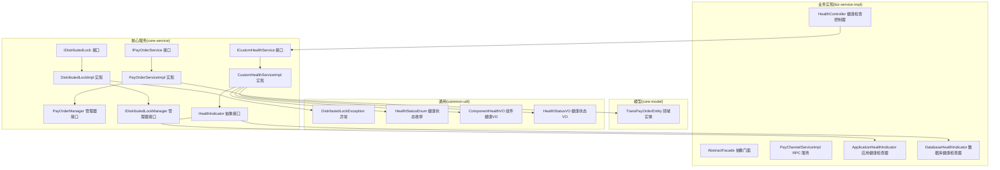
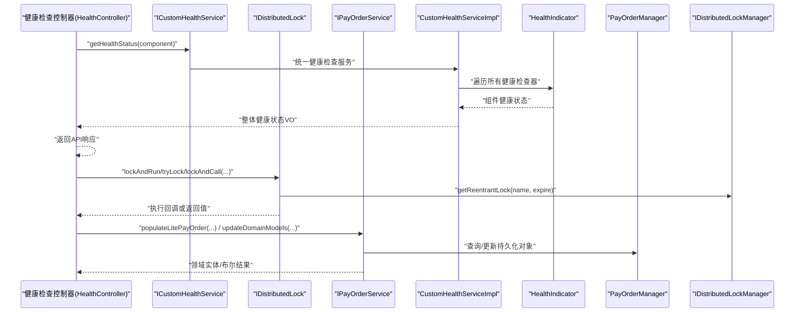
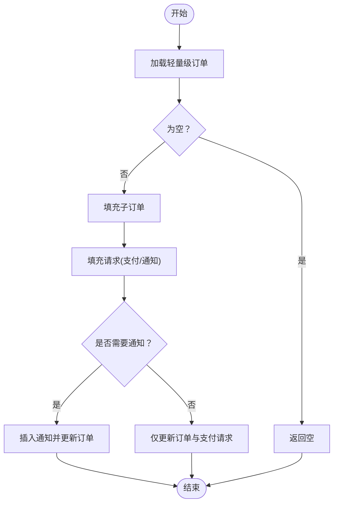
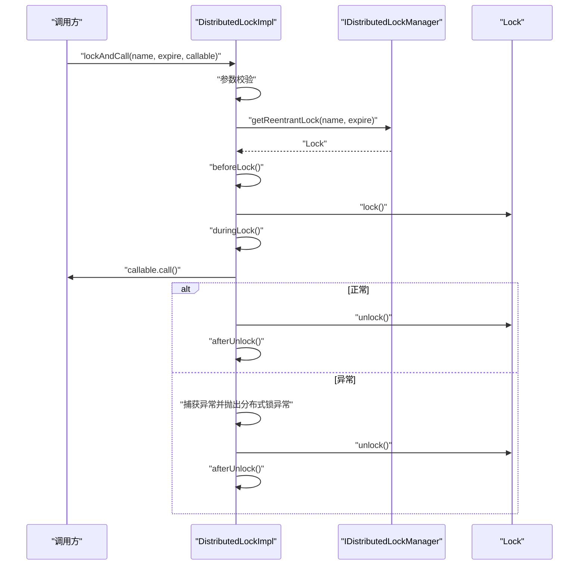
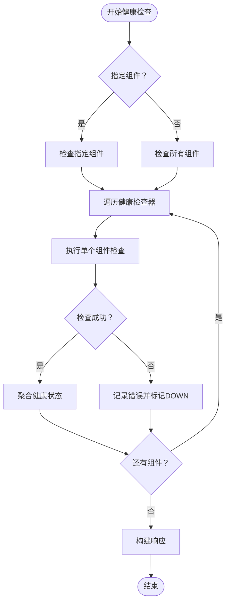
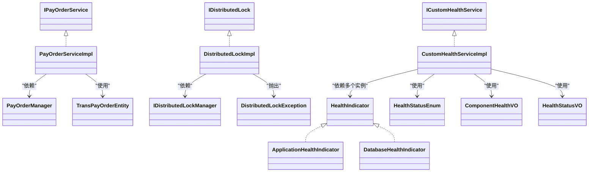

# 服务接口设计

<cite>
**本文引用的文件**
- [IPayOrderService.java](file://core-service/src/main/java/com/magicliang/transaction/sys/core/service/IPayOrderService.java)
- [IDistributedLock.java](file://core-service/src/main/java/com/magicliang/transaction/sys/core/service/IDistributedLock.java)
- [ICustomHealthService.java](file://core-service/src/main/java/com/magicliang/transaction/sys/core/service/ICustomHealthService.java)
- [HealthIndicator.java](file://core-service/src/main/java/com/magicliang/transaction/sys/core/service/HealthIndicator.java)
- [PayOrderServiceImpl.java](file://core-service/src/main/java/com/magicliang/transaction/sys/core/service/impl/PayOrderServiceImpl.java)
- [DistributedLockImpl.java](file://core-service/src/main/java/com/magicliang/transaction/sys/core/service/impl/DistributedLockImpl.java)
- [CustomHealthServiceImpl.java](file://core-service/src/main/java/com/magicliang/transaction/sys/core/service/impl/CustomHealthServiceImpl.java)
- [ApplicationHealthIndicator.java](file://core-service/src/main/java/com/magicliang/transaction/sys/core/service/impl/health/ApplicationHealthIndicator.java)
- [DatabaseHealthIndicator.java](file://core-service/src/main/java/com/magicliang/transaction/sys/core/service/impl/health/DatabaseHealthIndicator.java)
- [PayOrderManager.java](file://core-service/src/main/java/com/magicliang/transaction/sys/core/manager/PayOrderManager.java)
- [IDistributedLockManager.java](file://core-service/src/main/java/com/magicliang/transaction/sys/core/manager/IDistributedLockManager.java)
- [DistributedLockException.java](file://common-util/src/main/java/com/magicliang/transaction/sys/common/exception/DistributedLockException.java)
- [HealthStatusEnum.java](file://common-util/src/main/java/com/magicliang/transaction/sys/common/enums/HealthStatusEnum.java)
- [ComponentHealthVO.java](file://common-util/src/main/java/com/magicliang/transaction/sys/common/util/health/ComponentHealthVO.java)
- [HealthStatusVO.java](file://common-util/src/main/java/com/magicliang/transaction/sys/common/util/health/HealthStatusVO.java)
- [TransPayOrderEntity.java](file://core-model/src/main/java/com/magicliang/transaction/sys/core/model/entity/TransPayOrderEntity.java)
- [AbstractFacade.java](file://biz-service-impl/src/main/java/com/magicliang/transaction/sys/biz/service/impl/facade/impl/AbstractFacade.java)
- [PayChannelServiceImpl.java](file://biz-service-impl/src/main/java/com/magicliang/transaction/sys/biz/service/impl/rpc/PayChannelServiceImpl.java)
- [HealthController.java](file://biz-service-impl/src/main/java/com/magicliang/transaction/sys/biz/service/impl/web/controller/HealthController.java)
</cite>

## 更新摘要
**变更内容**
- 新增自定义健康检查服务接口体系，包括ICustomHealthService和HealthIndicator抽象接口
- 新增CustomHealthServiceImpl实现类，提供统一的健康检查服务
- 新增ApplicationHealthIndicator和DatabaseHealthIndicator具体实现
- 新增HealthController控制器，提供RESTful健康检查API
- 新增相关的VO类和枚举类型，支持结构化的健康状态返回

## 目录
1. [引言](#引言)
2. [项目结构](#项目结构)
3. [核心组件](#核心组件)
4. [架构总览](#架构总览)
5. [详细组件分析](#详细组件分析)
6. [健康检查服务体系](#健康检查服务体系)
7. [依赖分析](#依赖分析)
8. [性能考量](#性能考量)
9. [故障排查指南](#故障排查指南)
10. [结论](#结论)
11. [附录](#附录)

## 引言
本文件聚焦领域驱动交易系统中的服务层接口设计，围绕以下目标展开：
- 全面解析 IPayOrderService 支付订单服务接口的定义、方法签名、参数与返回值规范
- 深入阐述 IDistributedLock 分布式锁接口的设计，覆盖锁获取、释放与超时处理等核心能力
- **新增** 解析 ICustomHealthService 健康检查服务接口的设计，提供统一的健康状态查询能力
- **新增** 深入阐述 HealthIndicator 健康检查器抽象接口，支持可插拔的组件健康检查
- 结合 PayOrderServiceImpl、DistributedLockImpl 和 CustomHealthServiceImpl 的实现，说明业务封装、异常处理与性能优化
- 解释服务接口如何作为业务层与外部世界的契约，并体现开闭原则与依赖倒置原则
- 提供具体的代码示例展示服务接口的使用方法和最佳实践，帮助开发者理解如何设计高质量的服务接口

## 项目结构
该系统采用多模块划分，服务接口位于 core-service 模块，实体模型在 core-model 模块，异常与通用工具在 common-util 模块，业务门面与 RPC 在 biz-service-impl 模块。**新增**的健康检查功能通过独立的接口体系提供标准化的服务契约。

**图表来源**
- [IPayOrderService.java:16-156](file://core-service/src/main/java/com/magicliang/transaction/sys/core/service/IPayOrderService.java#L16-L156)
- [IDistributedLock.java:16-96](file://core-service/src/main/java/com/magicliang/transaction/sys/core/service/IDistributedLock.java#L16-L96)
- [ICustomHealthService.java:11-20](file://core-service/src/main/java/com/magicliang/transaction/sys/core/service/ICustomHealthService.java#L11-L20)
- [HealthIndicator.java:11-26](file://core-service/src/main/java/com/magicliang/transaction/sys/core/service/HealthIndicator.java#L11-L26)
- [PayOrderServiceImpl.java:43-460](file://core-service/src/main/java/com/magicliang/transaction/sys/core/service/impl/PayOrderServiceImpl.java#L43-L460)
- [DistributedLockImpl.java:26-275](file://core-service/src/main/java/com/magicliang/transaction/sys/core/service/impl/DistributedLockImpl.java#L26-L275)
- [CustomHealthServiceImpl.java:27-82](file://core-service/src/main/java/com/magicliang/transaction/sys/core/service/impl/CustomHealthServiceImpl.java#L27-L82)
- [ApplicationHealthIndicator.java:25-74](file://core-service/src/main/java/com/magicliang/transaction/sys/core/service/impl/health/ApplicationHealthIndicator.java#L25-74)
- [DatabaseHealthIndicator.java:23-108](file://core-service/src/main/java/com/magicliang/transaction/sys/core/service/impl/health/DatabaseHealthIndicator.java#L23-108)
- [HealthController.java:26-67](file://biz-service-impl/src/main/java/com/magicliang/transaction/sys/biz/service/impl/web/controller/HealthController.java#L26-67)

## 核心组件
本节概述三个关键服务接口及其职责边界：
- IPayOrderService：面向支付订单的领域服务，负责订单聚合的加载、填充、更新与批量查询
- IDistributedLock：面向分布式锁的统一抽象，提供多种加锁策略与超时控制
- **新增** ICustomHealthService：面向系统健康检查的统一服务接口，提供组件级别的健康状态查询能力

章节来源
- [IPayOrderService.java:16-156](file://core-service/src/main/java/com/magicliang/transaction/sys/core/service/IPayOrderService.java#L16-L156)
- [IDistributedLock.java:16-96](file://core-service/src/main/java/com/magicliang/transaction/sys/core/service/IDistributedLock.java#L16-L96)
- [ICustomHealthService.java:11-20](file://core-service/src/main/java/com/magicliang/transaction/sys/core/service/ICustomHealthService.java#L11-L20)

## 架构总览
服务接口作为业务层与外部世界（RPC、Web、定时任务等）的契约，向上屏蔽底层实现细节，向下依赖管理器接口完成具体工作。门面层通过注入服务接口完成业务编排。**新增**的健康检查体系通过控制器层暴露RESTful API，为监控系统提供标准化的健康状态查询接口。

**图表来源**
- [HealthController.java:42-65](file://biz-service-impl/src/main/java/com/magicliang/transaction/sys/biz/service/impl/web/controller/HealthController.java#L42-L65)
- [ICustomHealthService.java:19](file://core-service/src/main/java/com/magicliang/transaction/sys/core/service/ICustomHealthService.java#L19)
- [CustomHealthServiceImpl.java:36-80](file://core-service/src/main/java/com/magicliang/transaction/sys/core/service/impl/CustomHealthServiceImpl.java#L36-L80)
- [HealthIndicator.java:18-25](file://core-service/src/main/java/com/magicliang/transaction/sys/core/service/HealthIndicator.java#L18-L25)

## 详细组件分析

### IPayOrderService 接口详解
- 方法族概览
  - 轻量级与完整模型加载：populateLitePayOrder、populateWholePayOrder(两重重载)
  - 批量加载：populatePayOrdersByNos、populateWholePayOrders(List<TransRequestEntity>)
  - 统计与分页查询：countUnPaidRequests、populateUnpaidRequest、countUnSentNotifications、populateUnSentNotifications
  - 子订单与请求填充：populateAlipaySubOrder、populateRequest、populatePaymentRequest、populateNotificationRequest
  - 更新与事务：updateDomainModels、updatePayOrderAndRequest、insertNotificationAndUpdatePayOrder
  - 通道请求更新：updateChannelRequest

- 参数与返回值规范
  - 轻量级与完整模型加载：输入业务标识与唯一号，或轻量级实体；输出领域实体或空
  - 批量加载：输入订单号集合或请求集合；输出领域实体列表
  - 统计与分页：输入批次大小与环境；输出计数或请求列表
  - 子订单与请求填充：输入支付订单实体；无返回值（就地修改）
  - 更新与事务：输入领域实体；返回布尔结果（是否成功）

- 设计要点
  - 以"领域实体"为契约载体，避免直接暴露 PO
  - 通过"填充"与"更新"分离职责，保证聚合内一致性
  - 事务边界明确，跨请求与通知的插入/更新通过统一入口保证原子性

章节来源
- [IPayOrderService.java:16-156](file://core-service/src/main/java/com/magicliang/transaction/sys/core/service/IPayOrderService.java#L16-L156)
- [TransPayOrderEntity.java:32-214](file://core-model/src/main/java/com/magicliang/transaction/sys/core/model/entity/TransPayOrderEntity.java#L32-L214)

### PayOrderServiceImpl 实现分析
- 依赖注入与职责
  - 通过 PayOrderManager 完成数据库访问与事务控制
  - 通过转换器将 PO 与领域实体互转
  - 通过断言工具保障实体完整性

- 关键流程
  - 轻量级与完整模型加载：先查询 PO，再转换为领域实体；完整模型加载时按需填充子订单与请求
  - 批量加载：提取订单号去重后批量查询，再将请求与子订单回填至对应实体
  - 更新与通知：根据状态变化决定是否插入通知请求，统一走 insertNotificationAndUpdatePayOrder 保证事务一致性
  - 请求填充策略：支付请求必填；终态订单才填充通知请求

- 性能与健壮性
  - 使用流式处理与去重减少重复查询
  - 对空集合与空实体进行早返回，降低无效计算
  - 对异常进行断言校验，确保模型完整性

**图表来源**
- [PayOrderServiceImpl.java:90-300](file://core-service/src/main/java/com/magicliang/transaction/sys/core/service/impl/PayOrderServiceImpl.java#L90-L300)
- [PayOrderManager.java:96-185](file://core-service/src/main/java/com/magicliang/transaction/sys/core/manager/PayOrderManager.java#L96-L185)

章节来源
- [PayOrderServiceImpl.java:43-460](file://core-service/src/main/java/com/magicliang/transaction/sys/core/service/impl/PayOrderServiceImpl.java#L43-L460)
- [PayOrderManager.java:18-186](file://core-service/src/main/java/com/magicliang/transaction/sys/core/manager/PayOrderManager.java#L18-L186)

### IDistributedLock 接口详解
- 功能矩阵
  - getLock：获取可复用的 Lock 实例
  - lockAndCall：加锁后执行 Callable 并返回结果
  - lockAndRun：加锁后执行 Runnable
  - tryLock：无等待/带回退回调/带计时等待三种变体
  - lockInterruptibly：可中断阻塞加锁

- 超时与异常
  - 超时参数 expiredTimeInSeconds 控制锁过期时间
  - 参数校验失败抛出分布式锁异常
  - 业务回调异常包装为分布式锁异常

章节来源
- [IDistributedLock.java:16-96](file://core-service/src/main/java/com/magicliang/transaction/sys/core/service/IDistributedLock.java#L16-L96)

### DistributedLockImpl 实现分析
- 参数校验与异常
  - 锁名为空或过期时间非正数时抛出分布式锁异常
  - 回调为空时进行早返回，避免无效执行

- 生命周期钩子
  - beforeLock/duringLock/afterUnlock/elseDo 提供日志与可观测性
  - 无论成功与否均释放锁，确保资源不泄漏

- 异常传播
  - 业务回调异常捕获并包装为分布式锁异常，便于上层统一处理

**图表来源**
- [DistributedLockImpl.java:62-83](file://core-service/src/main/java/com/magicliang/transaction/sys/core/service/impl/DistributedLockImpl.java#L62-L83)
- [IDistributedLockManager.java:25-37](file://core-service/src/main/java/com/magicliang/transaction/sys/core/manager/IDistributedLockManager.java#L25-L37)
- [DistributedLockException.java:12-31](file://common-util/src/main/java/com/magicliang/transaction/sys/common/exception/DistributedLockException.java#L12-L31)

章节来源
- [DistributedLockImpl.java:26-275](file://core-service/src/main/java/com/magicliang/transaction/sys/core/service/impl/DistributedLockImpl.java#L26-L275)
- [IDistributedLockManager.java:15-42](file://core-service/src/main/java/com/magicliang/transaction/sys/core/manager/IDistributedLockManager.java#L15-L42)
- [DistributedLockException.java:12-31](file://common-util/src/main/java/com/magicliang/transaction/sys/common/exception/DistributedLockException.java#L12-L31)

### 服务接口作为业务契约与设计原则
- 开闭原则
  - 接口稳定，新增能力通过扩展实现类或策略实现，不修改既有接口
- 依赖倒置
  - 业务门面与 RPC 层依赖抽象接口（IPayOrderService、IDistributedLock、ICustomHealthService），而非具体实现
- 与门面层协作
  - AbstractFacade 注入 IPayOrderService 与 IDistributedLock，形成稳定的业务编排入口
  - PayChannelServiceImpl 通过门面协调受理与支付流程

章节来源
- [AbstractFacade.java:17-36](file://biz-service-impl/src/main/java/com/magicliang/transaction/sys/biz/service/impl/facade/impl/AbstractFacade.java#L17-L36)
- [PayChannelServiceImpl.java:25-37](file://biz-service-impl/src/main/java/com/magicliang/transaction/sys/biz/service/impl/rpc/PayChannelServiceImpl.java#L25-L37)

## 健康检查服务体系

### ICustomHealthService 接口详解
- 核心职责
  - 提供统一的健康状态查询服务，支持按组件过滤和全量查询
  - 返回结构化的健康状态信息，包含整体状态、时间戳和各组件详情

- 方法签名与参数规范
  - getHealthStatus(String component)：查询健康状态
    - 参数 component：组件名称（可选），支持 "database"、"application" 等
    - 返回值：HealthStatusVO，包含整体状态、时间戳和组件详情映射

- 设计要点
  - 支持按组件过滤查询，提高查询效率
  - 返回完整的健康状态信息，便于监控系统集成
  - 统一的响应格式，便于前端展示和自动化处理

章节来源
- [ICustomHealthService.java:11-20](file://core-service/src/main/java/com/magicliang/transaction/sys/core/service/ICustomHealthService.java#L11-L20)

### HealthIndicator 抽象接口详解
- 核心职责
  - 定义健康检查器的标准接口，支持可插拔的组件健康检查实现
  - 提供组件名称标识和健康检查执行能力

- 方法签名与规范
  - getComponentName()：获取组件名称
    - 返回值：String，组件标识名称（如 "database"、"application"）
  - check()：执行健康检查
    - 返回值：ComponentHealthVO，组件健康状态和详细信息

- 设计要点
  - 简洁明了的接口设计，便于扩展新的健康检查器
  - 统一的返回格式，确保健康检查结果的一致性
  - 支持异常处理，即使某个组件检查失败也不影响其他组件的检查

章节来源
- [HealthIndicator.java:11-26](file://core-service/src/main/java/com/magicliang/transaction/sys/core/service/HealthIndicator.java#L11-L26)

### CustomHealthServiceImpl 实现分析
- 核心功能
  - 统一管理多个 HealthIndicator 实例，协调各组件的健康检查
  - 实现健康状态聚合逻辑，支持 DOWN > WARN > UP 的优先级规则
  - 提供详细的日志记录和性能监控

- 关键流程
  - 组件发现：通过构造函数注入所有 HealthIndicator 实例
  - 条件过滤：根据 component 参数决定检查范围
  - 并行检查：遍历所有健康检查器执行检查
  - 状态聚合：根据各组件状态计算整体健康状态
  - 异常隔离：单个组件检查异常不影响其他组件检查

- 性能与可靠性
  - 组件级别异常隔离，避免单点故障影响整体健康检查
  - 统一的日志记录，便于问题排查和性能分析
  - 响应时间统计，支持健康检查性能监控

**图表来源**
- [CustomHealthServiceImpl.java:36-80](file://core-service/src/main/java/com/magicliang/transaction/sys/core/service/impl/CustomHealthServiceImpl.java#L36-L80)

章节来源
- [CustomHealthServiceImpl.java:27-82](file://core-service/src/main/java/com/magicliang/transaction/sys/core/service/impl/CustomHealthServiceImpl.java#L27-L82)

### ApplicationHealthIndicator 实现分析
- 检查内容
  - JVM 运行时长：通过 ManagementFactory 获取应用启动时间
  - 内存使用率：监控堆内存使用情况，超过90%触发警告
  - 健康状态：根据内存使用率判断 UP/WARN/DOWN

- 实现特点
  - 基于 Java Management Extensions (JMX) 实现
  - 内存使用率阈值为90%，超过阈值返回 WARN 状态
  - 详细的日志记录，便于运维监控

章节来源
- [ApplicationHealthIndicator.java:25-74](file://core-service/src/main/java/com/magicliang/transaction/sys/core/service/impl/health/ApplicationHealthIndicator.java#L25-L74)

### DatabaseHealthIndicator 实现分析
- 检查内容
  - 主库连接：通过 masterJdbcTemplate 执行简单查询验证连接
  - 从库连接：通过 slave1JdbcTemplate 执行简单查询验证连接
  - 响应时间：记录各数据源的健康检查耗时
  - 超时处理：超过3秒超时标记为 DOWN 状态

- 实现特点
  - 支持主从库双数据源健康检查
  - 统一的超时控制机制
  - 详细的错误信息记录，便于问题定位

章节来源
- [DatabaseHealthIndicator.java:23-108](file://core-service/src/main/java/com/magicliang/transaction/sys/core/service/impl/health/DatabaseHealthIndicator.java#L23-L108)

### HealthController 控制器分析
- API 设计
  - RESTful 接口：GET /res/v1/health/custom
  - 参数支持：component 查询参数，支持 database、application
  - 响应格式：统一的 APIResult 包装结构

- 核心功能
  - 参数校验：验证组件名称的有效性
  - 服务调用：委托 ICustomHealthService 执行健康检查
  - 错误处理：统一的异常捕获和错误响应
  - 性能监控：记录请求处理时间和响应状态

- 设计要点
  - 业务级健康检查 API，区别于 Spring Boot Actuator
  - 支持组件级别的健康检查查询
  - 统一的响应格式，便于前端集成

章节来源
- [HealthController.java:26-67](file://biz-service-impl/src/main/java/com/magicliang/transaction/sys/biz/service/impl/web/controller/HealthController.java#L26-67)

## 依赖分析
- 接口与实现
  - IPayOrderService → PayOrderServiceImpl
  - IDistributedLock → DistributedLockImpl
  - ICustomHealthService → CustomHealthServiceImpl
  - HealthIndicator → ApplicationHealthIndicator, DatabaseHealthIndicator
- 实现与管理器
  - PayOrderServiceImpl → PayOrderManager
  - DistributedLockImpl → IDistributedLockManager
  - CustomHealthServiceImpl → 多个 HealthIndicator 实例
- 异常与实体
  - DistributedLockImpl → DistributedLockException
  - PayOrderServiceImpl → TransPayOrderEntity
  - CustomHealthServiceImpl → HealthStatusEnum, ComponentHealthVO, HealthStatusVO

**图表来源**
- [IPayOrderService.java:16-156](file://core-service/src/main/java/com/magicliang/transaction/sys/core/service/IPayOrderService.java#L16-L156)
- [PayOrderServiceImpl.java:43-460](file://core-service/src/main/java/com/magicliang/transaction/sys/core/service/impl/PayOrderServiceImpl.java#L43-L460)
- [PayOrderManager.java:18-186](file://core-service/src/main/java/com/magicliang/transaction/sys/core/manager/PayOrderManager.java#L18-L186)
- [IDistributedLock.java:16-96](file://core-service/src/main/java/com/magicliang/transaction/sys/core/service/IDistributedLock.java#L16-L96)
- [DistributedLockImpl.java:26-275](file://core-service/src/main/java/com/magicliang/transaction/sys/core/service/impl/DistributedLockImpl.java#L26-L275)
- [IDistributedLockManager.java:15-42](file://core-service/src/main/java/com/magicliang/transaction/sys/core/manager/IDistributedLockManager.java#L15-L42)
- [DistributedLockException.java:12-31](file://common-util/src/main/java/com/magicliang/transaction/sys/common/exception/DistributedLockException.java#L12-L31)
- [TransPayOrderEntity.java:32-214](file://core-model/src/main/java/com/magicliang/transaction/sys/core/model/entity/TransPayOrderEntity.java#L32-L214)
- [ICustomHealthService.java:11-20](file://core-service/src/main/java/com/magicliang/transaction/sys/core/service/ICustomHealthService.java#L11-L20)
- [CustomHealthServiceImpl.java:27-82](file://core-service/src/main/java/com/magicliang/transaction/sys/core/service/impl/CustomHealthServiceImpl.java#L27-L82)
- [HealthIndicator.java:11-26](file://core-service/src/main/java/com/magicliang/transaction/sys/core/service/HealthIndicator.java#L11-L26)
- [ApplicationHealthIndicator.java:25-74](file://core-service/src/main/java/com/magicliang/transaction/sys/core/service/impl/health/ApplicationHealthIndicator.java#L25-L74)
- [DatabaseHealthIndicator.java:23-108](file://core-service/src/main/java/com/magicliang/transaction/sys/core/service/impl/health/DatabaseHealthIndicator.java#L23-L108)
- [HealthStatusEnum.java:9-41](file://common-util/src/main/java/com/magicliang/transaction/sys/common/enums/HealthStatusEnum.java#L9-L41)
- [ComponentHealthVO.java:19-31](file://common-util/src/main/java/com/magicliang/transaction/sys/common/util/health/ComponentHealthVO.java#L19-L31)
- [HealthStatusVO.java:19-36](file://common-util/src/main/java/com/magicliang/transaction/sys/common/util/health/HealthStatusVO.java#L19-L36)

## 性能考量
- 批量查询与去重
  - 批量加载时对订单号进行去重，减少重复查询
- 流式处理
  - 使用流式转换与收集，降低中间对象开重
- 早返回与短路
  - 对空集合与空实体进行早返回，避免无效计算
- 事务边界
  - 通过统一入口执行插入通知与更新，减少跨事务的复杂度与失败风险
- **新增** 健康检查性能优化
  - 组件级别异常隔离，避免单点故障影响整体性能
  - 统一的超时控制机制，防止健康检查阻塞
  - 响应时间统计和日志记录，便于性能监控和优化

## 故障排查指南
- 分布式锁相关
  - 锁名为空或过期时间非正：检查调用方参数传递
  - 回调异常：查看异常栈并定位业务逻辑；确认异常已被包装为分布式锁异常
  - 资源泄漏：确认 finally 分支已释放锁
- 支付订单相关
  - 实体完整性校验失败：检查订单与子订单、请求的唯一性与数量约束
  - 事务失败：核对 insertNotificationAndUpdatePayOrder 的调用路径与参数
- **新增** 健康检查相关
  - 组件检查失败：查看对应 HealthIndicator 的日志，确认异常原因
  - 健康状态异常：检查 HealthIndicator 实现的业务逻辑和配置
  - API 调用失败：确认 HealthController 的参数校验和异常处理逻辑

章节来源
- [DistributedLockImpl.java:42-83](file://core-service/src/main/java/com/magicliang/transaction/sys/core/service/impl/DistributedLockImpl.java#L42-L83)
- [DistributedLockException.java:12-31](file://common-util/src/main/java/com/magicliang/transaction/sys/common/exception/DistributedLockException.java#L12-L31)
- [PayOrderServiceImpl.java:199-300](file://core-service/src/main/java/com/magicliang/transaction/sys/core/service/impl/PayOrderServiceImpl.java#L199-L300)
- [CustomHealthServiceImpl.java:64-71](file://core-service/src/main/java/com/magicliang/transaction/sys/core/service/impl/CustomHealthServiceImpl.java#L64-L71)

## 结论
本设计通过清晰的接口契约与实现分离，实现了业务层与基础设施的解耦。IPayOrderService、IDistributedLock 和 **新增的 ICustomHealthService** 作为稳定的业务契约，支撑了门面层、RPC 层和健康检查系统的编排与执行；实现层通过管理器接口与异常体系，提供了高可靠与可观测的运行时行为。遵循开闭原则与依赖倒置原则，使系统具备良好的扩展性与维护性。**新增的健康检查体系**通过标准化的接口设计和可插拔的实现机制，为系统的监控和运维提供了强有力的支持。

## 附录
- 使用示例与最佳实践（以路径代替代码）
  - 使用分布式锁保护并发写入
    - 示例路径：[DistributedLockImpl.java:62-83](file://core-service/src/main/java/com/magicliang/transaction/sys/core/service/impl/DistributedLockImpl.java#L62-L83)
    - 最佳实践：为每个业务关键区段设置合理过期时间；在 finally 中确保释放锁
  - 加载并填充支付订单
    - 示例路径：[PayOrderServiceImpl.java:90-111](file://core-service/src/main/java/com/magicliang/transaction/sys/core/service/impl/PayOrderServiceImpl.java#L90-L111)
    - 最佳实践：优先使用轻量级加载，按需填充子订单与请求
  - 批量加载并回填
    - 示例路径：[PayOrderServiceImpl.java:119-140](file://core-service/src/main/java/com/magicliang/transaction/sys/core/service/impl/PayOrderServiceImpl.java#L119-L140)
    - 最佳实践：对订单号去重后再查询；回填时注意空集合初始化
  - 更新订单与通知请求
    - 示例路径：[PayOrderServiceImpl.java:282-300](file://core-service/src/main/java/com/magicliang/transaction/sys/core/service/impl/PayOrderServiceImpl.java#L282-L300)
    - 最佳实践：根据状态判断是否需要插入通知请求；统一入口保证事务一致性
  - **新增** 健康检查服务使用
    - 示例路径：[HealthController.java:42-65](file://biz-service-impl/src/main/java/com/magicliang/transaction/sys/biz/service/impl/web/controller/HealthController.java#L42-L65)
    - 最佳实践：通过 HealthController 提供的 RESTful API 查询系统健康状态
    - 示例路径：[CustomHealthServiceImpl.java:36-80](file://core-service/src/main/java/com/magicliang/transaction/sys/core/service/impl/CustomHealthServiceImpl.java#L36-L80)
    - 最佳实践：通过 ICustomHealthService 接口获取统一的健康状态信息