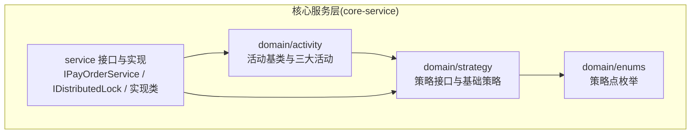
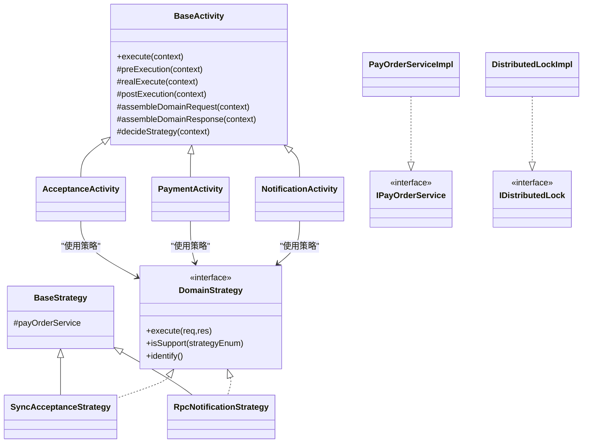
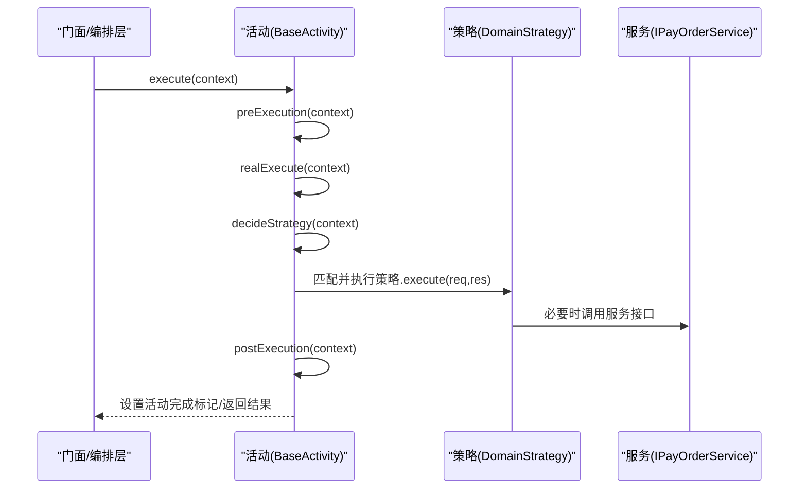
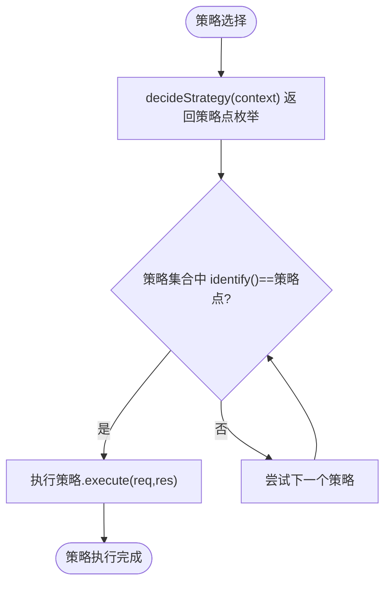
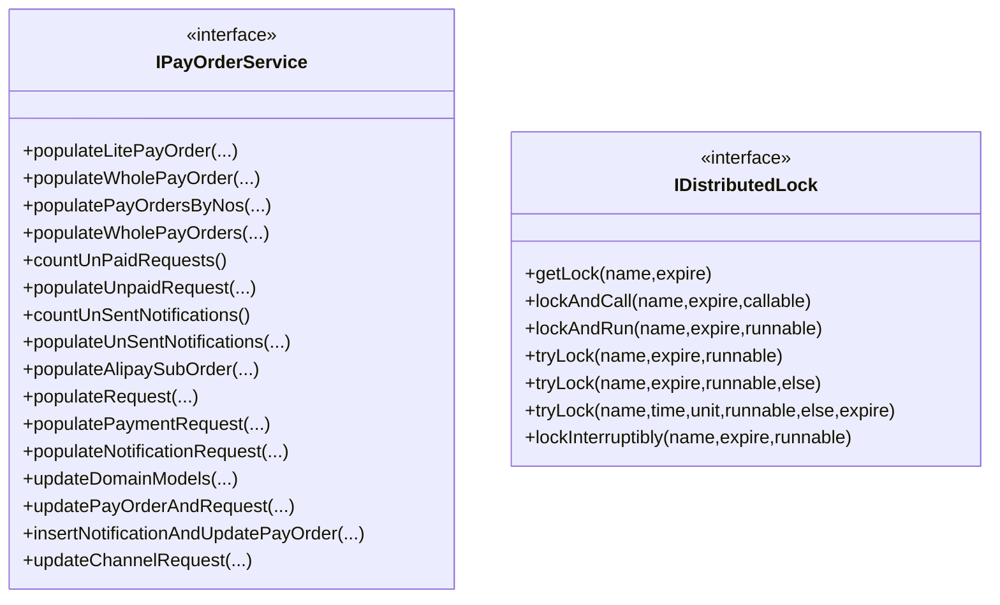
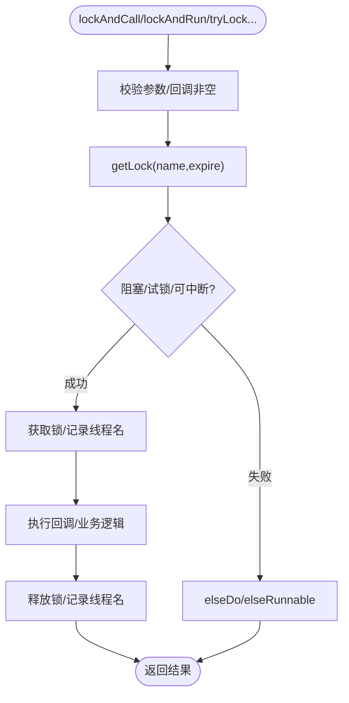
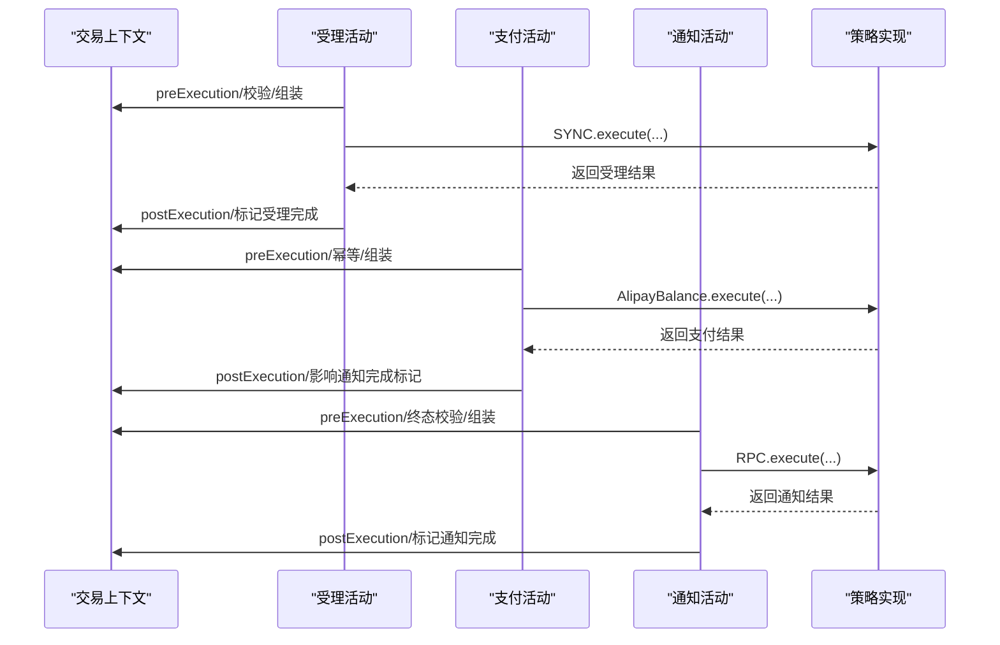
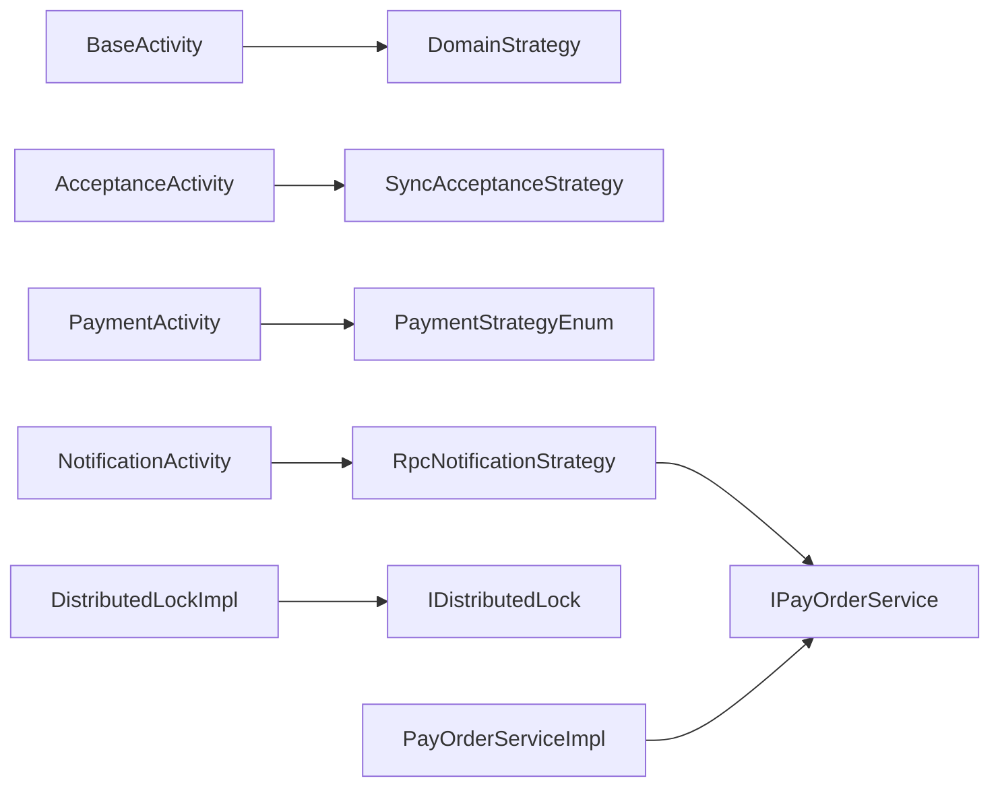

# 核心服务层

<cite>
**本文引用的文件**
- [BaseActivity.java](file://core-service/src/main/java/com/magicliang/transaction/sys/core/domain/activity/BaseActivity.java)
- [AcceptanceActivity.java](file://core-service/src/main/java/com/magicliang/transaction/sys/core/domain/activity/acceptance/AcceptanceActivity.java)
- [PaymentActivity.java](file://core-service/src/main/java/com/magicliang/transaction/sys/core/domain/activity/payment/PaymentActivity.java)
- [NotificationActivity.java](file://core-service/src/main/java/com/magicliang/transaction/sys/core/domain/activity/notification/NotificationActivity.java)
- [DomainStrategy.java](file://core-service/src/main/java/com/magicliang/transaction/sys/core/domain/strategy/DomainStrategy.java)
- [BaseStrategy.java](file://core-service/src/main/java/com/magicliang/transaction/sys/core/domain/strategy/BaseStrategy.java)
- [AcceptanceStrategyEnum.java](file://core-service/src/main/java/com/magicliang/transaction/sys/core/domain/enums/AcceptanceStrategyEnum.java)
- [PaymentStrategyEnum.java](file://core-service/src/main/java/com/magicliang/transaction/sys/core/domain/enums/PaymentStrategyEnum.java)
- [NotificationStrategyEnum.java](file://core-service/src/main/java/com/magicliang/transaction/sys/core/domain/enums/NotificationStrategyEnum.java)
- [SyncAcceptanceStrategy.java](file://core-service/src/main/java/com/magicliang/transaction/sys/core/domain/strategy/acceptance/SyncAcceptanceStrategy.java)
- [RpcNotificationStrategy.java](file://core-service/src/main/java/com/magicliang/transaction/sys/core/domain/strategy/notification/RpcNotificationStrategy.java)
- [IPayOrderService.java](file://core-service/src/main/java/com/magicliang/transaction/sys/core/service/IPayOrderService.java)
- [IDistributedLock.java](file://core-service/src/main/java/com/magicliang/transaction/sys/core/service/IDistributedLock.java)
- [DistributedLockImpl.java](file://core-service/src/main/java/com/magicliang/transaction/sys/core/service/impl/DistributedLockImpl.java)
- [PayOrderServiceImpl.java](file://core-service/src/main/java/com/magicliang/transaction/sys/core/service/impl/PayOrderServiceImpl.java)
</cite>

## 目录
1. [引言](#引言)
2. [项目结构](#项目结构)
3. [核心组件](#核心组件)
4. [架构总览](#架构总览)
5. [详细组件分析](#详细组件分析)
6. [依赖分析](#依赖分析)
7. [性能考量](#性能考量)
8. [故障排查指南](#故障排查指南)
9. [结论](#结论)
10. [附录](#附录)

## 引言
本文件聚焦“核心服务层”，系统化解析领域驱动交易系统的业务逻辑与实现细节，重点覆盖以下主题：
- 活动模式的应用：受理、支付、通知三大业务活动的设计与执行流程
- 策略模式的选择机制：支付策略、通知策略的动态切换与扩展
- 服务接口设计：IPayOrderService、IDistributedLock 等接口的职责与实现
- 分布式锁管理机制：DistributedLockImpl 的实现与分布式事务处理要点
- 业务流程编排：从受理到支付再到通知的完整链路与错误处理

## 项目结构
核心服务层位于 core-service 模块，围绕“活动 + 策略”的领域驱动设计，将业务流程拆解为可组合、可扩展的活动单元，并通过策略点在运行期选择具体执行路径。

图表来源
- [BaseActivity.java:28-139](file://core-service/src/main/java/com/magicliang/transaction/sys/core/domain/activity/BaseActivity.java#L28-L139)
- [DomainStrategy.java:16-37](file://core-service/src/main/java/com/magicliang/transaction/sys/core/domain/strategy/DomainStrategy.java#L16-L37)
- [AcceptanceActivity.java:43-198](file://core-service/src/main/java/com/magicliang/transaction/sys/core/domain/activity/acceptance/AcceptanceActivity.java#L43-L198)
- [PaymentActivity.java:38-202](file://core-service/src/main/java/com/magicliang/transaction/sys/core/domain/activity/payment/PaymentActivity.java#L38-L202)
- [NotificationActivity.java:42-183](file://core-service/src/main/java/com/magicliang/transaction/sys/core/domain/activity/notification/NotificationActivity.java#L42-L183)
- [IPayOrderService.java:16-158](file://core-service/src/main/java/com/magicliang/transaction/sys/core/service/IPayOrderService.java#L16-L158)
- [IDistributedLock.java:16-98](file://core-service/src/main/java/com/magicliang/transaction/sys/core/service/IDistributedLock.java#L16-L98)

章节来源
- [BaseActivity.java:28-139](file://core-service/src/main/java/com/magicliang/transaction/sys/core/domain/activity/BaseActivity.java#L28-L139)
- [DomainStrategy.java:16-37](file://core-service/src/main/java/com/magicliang/transaction/sys/core/domain/strategy/DomainStrategy.java#L16-L37)

## 核心组件
- 活动基类 BaseActivity：统一活动生命周期（前置检查、真实执行、后置检查），并以策略点驱动具体执行
- 三大业务活动：受理 AcceptanceActivity、支付 PaymentActivity、通知 NotificationActivity
- 策略接口 DomainStrategy 与基础策略 BaseStrategy：策略点识别与执行
- 策略点枚举：受理/支付/通知对应的策略点
- 服务接口与实现：IPayOrderService（订单与请求的填充、更新）、IDistributedLock（分布式锁能力）
- 具体策略实现：同步受理 SyncAcceptanceStrategy、RPC 通知 RpcNotificationStrategy

章节来源
- [AcceptanceActivity.java:43-198](file://core-service/src/main/java/com/magicliang/transaction/sys/core/domain/activity/acceptance/AcceptanceActivity.java#L43-L198)
- [PaymentActivity.java:38-202](file://core-service/src/main/java/com/magicliang/transaction/sys/core/domain/activity/payment/PaymentActivity.java#L38-L202)
- [NotificationActivity.java:42-183](file://core-service/src/main/java/com/magicliang/transaction/sys/core/domain/activity/notification/NotificationActivity.java#L42-L183)
- [SyncAcceptanceStrategy.java:34-80](file://core-service/src/main/java/com/magicliang/transaction/sys/core/domain/strategy/acceptance/SyncAcceptanceStrategy.java#L34-L80)
- [RpcNotificationStrategy.java:48-241](file://core-service/src/main/java/com/magicliang/transaction/sys/core/domain/strategy/notification/RpcNotificationStrategy.java#L48-L241)
- [IPayOrderService.java:16-158](file://core-service/src/main/java/com/magicliang/transaction/sys/core/service/IPayOrderService.java#L16-L158)
- [IDistributedLock.java:16-98](file://core-service/src/main/java/com/magicliang/transaction/sys/core/service/IDistributedLock.java#L16-L98)

## 架构总览
核心服务层采用“活动 + 策略”的分层设计：
- 活动层负责业务流程编排与幂等控制
- 策略层负责具体执行分支（受理同步、支付策略、通知策略）
- 服务层提供跨活动的数据与事务能力（订单填充、更新、分布式锁）

图表来源
- [BaseActivity.java:28-139](file://core-service/src/main/java/com/magicliang/transaction/sys/core/domain/activity/BaseActivity.java#L28-L139)
- [AcceptanceActivity.java:43-198](file://core-service/src/main/java/com/magicliang/transaction/sys/core/domain/activity/acceptance/AcceptanceActivity.java#L43-L198)
- [PaymentActivity.java:38-202](file://core-service/src/main/java/com/magicliang/transaction/sys/core/domain/activity/payment/PaymentActivity.java#L38-L202)
- [NotificationActivity.java:42-183](file://core-service/src/main/java/com/magicliang/transaction/sys/core/domain/activity/notification/NotificationActivity.java#L42-L183)
- [DomainStrategy.java:16-37](file://core-service/src/main/java/com/magicliang/transaction/sys/core/domain/strategy/DomainStrategy.java#L16-L37)
- [BaseStrategy.java:15-23](file://core-service/src/main/java/com/magicliang/transaction/sys/core/domain/strategy/BaseStrategy.java#L15-L23)
- [SyncAcceptanceStrategy.java:34-80](file://core-service/src/main/java/com/magicliang/transaction/sys/core/domain/strategy/acceptance/SyncAcceptanceStrategy.java#L34-L80)
- [RpcNotificationStrategy.java:48-241](file://core-service/src/main/java/com/magicliang/transaction/sys/core/domain/strategy/notification/RpcNotificationStrategy.java#L48-L241)
- [IPayOrderService.java:16-158](file://core-service/src/main/java/com/magicliang/transaction/sys/core/service/IPayOrderService.java#L16-L158)
- [IDistributedLock.java:16-98](file://core-service/src/main/java/com/magicliang/transaction/sys/core/service/IDistributedLock.java#L16-L98)
- [DistributedLockImpl.java:26-275](file://core-service/src/main/java/com/magicliang/transaction/sys/core/service/impl/DistributedLockImpl.java#L26-275)
- [PayOrderServiceImpl.java:43-460](file://core-service/src/main/java/com/magicliang/transaction/sys/core/service/impl/PayOrderServiceImpl.java#L43-460)

## 详细组件分析

### 活动模式：受理、支付、通知
- 统一入口：活动通过 execute(context) 调用生命周期钩子
- 幂等与前置检查：各活动在 preExecution 中合并上下文完成标记与局部幂等判断
- 策略驱动：realExecute 中根据 decideStrategy(context) 选择策略点，遍历策略集合匹配执行
- 后置校验：postExecution 中断言响应结果并设置活动完成标记

图表来源
- [BaseActivity.java:42-84](file://core-service/src/main/java/com/magicliang/transaction/sys/core/domain/activity/BaseActivity.java#L42-L84)
- [AcceptanceActivity.java:56-92](file://core-service/src/main/java/com/magicliang/transaction/sys/core/domain/activity/acceptance/AcceptanceActivity.java#L56-L92)
- [PaymentActivity.java:52-87](file://core-service/src/main/java/com/magicliang/transaction/sys/core/domain/activity/payment/PaymentActivity.java#L52-L87)
- [NotificationActivity.java:55-88](file://core-service/src/main/java/com/magicliang/transaction/sys/core/domain/activity/notification/NotificationActivity.java#L55-L88)

章节来源
- [AcceptanceActivity.java:56-162](file://core-service/src/main/java/com/magicliang/transaction/sys/core/domain/activity/acceptance/AcceptanceActivity.java#L56-L162)
- [PaymentActivity.java:52-169](file://core-service/src/main/java/com/magicliang/transaction/sys/core/domain/activity/payment/PaymentActivity.java#L52-L169)
- [NotificationActivity.java:55-181](file://core-service/src/main/java/com/magicliang/transaction/sys/core/domain/activity/notification/NotificationActivity.java#L55-L181)

### 策略模式：支付策略与通知策略
- 策略接口 DomainStrategy：定义 execute(req,res) 与 isSupport(strategyEnum)，默认按 identify() 与策略点枚举匹配
- 基础策略 BaseStrategy：注入 IPayOrderService，供具体策略复用
- 支付策略：PaymentStrategyEnum 仅包含 AlipayBalance；受理策略：AcceptanceStrategyEnum 仅包含 SYNC；通知策略：NotificationStrategyEnum 包含 RPC/KAFKA
- 具体策略实现：
  - 同步受理 SyncAcceptanceStrategy：在事务内插入支付主单、支付请求、子订单，回填主单号
  - RPC 通知 RpcNotificationStrategy：构造通知请求，发送后更新通知请求状态与响应

图表来源
- [DomainStrategy.java:16-37](file://core-service/src/main/java/com/magicliang/transaction/sys/core/domain/strategy/DomainStrategy.java#L16-L37)
- [BaseStrategy.java:15-23](file://core-service/src/main/java/com/magicliang/transaction/sys/core/domain/strategy/BaseStrategy.java#L15-L23)
- [SyncAcceptanceStrategy.java:59-78](file://core-service/src/main/java/com/magicliang/transaction/sys/core/domain/strategy/acceptance/SyncAcceptanceStrategy.java#L59-L78)
- [RpcNotificationStrategy.java:80-121](file://core-service/src/main/java/com/magicliang/transaction/sys/core/domain/strategy/notification/RpcNotificationStrategy.java#L80-L121)

章节来源
- [AcceptanceStrategyEnum.java:18-72](file://core-service/src/main/java/com/magicliang/transaction/sys/core/domain/enums/AcceptanceStrategyEnum.java#L18-L72)
- [PaymentStrategyEnum.java:18-73](file://core-service/src/main/java/com/magicliang/transaction/sys/core/domain/enums/PaymentStrategyEnum.java#L18-L73)
- [NotificationStrategyEnum.java:18-77](file://core-service/src/main/java/com/magicliang/transaction/sys/core/domain/enums/NotificationStrategyEnum.java#L18-L77)
- [SyncAcceptanceStrategy.java:34-80](file://core-service/src/main/java/com/magicliang/transaction/sys/core/domain/strategy/acceptance/SyncAcceptanceStrategy.java#L34-L80)
- [RpcNotificationStrategy.java:48-241](file://core-service/src/main/java/com/magicliang/transaction/sys/core/domain/strategy/notification/RpcNotificationStrategy.java#L48-L241)

### 服务接口设计：IPayOrderService 与 IDistributedLock
- IPayOrderService：提供订单填充（轻量/完整）、请求填充（支付/通知）、计数与批量查询、更新与事务性写入等能力
- IDistributedLock：提供多种加锁与执行语义（阻塞/可中断/定时试锁/带超时试锁），封装底层分布式锁管理器

图表来源
- [IPayOrderService.java:16-158](file://core-service/src/main/java/com/magicliang/transaction/sys/core/service/IPayOrderService.java#L16-L158)
- [IDistributedLock.java:16-98](file://core-service/src/main/java/com/magicliang/transaction/sys/core/service/IDistributedLock.java#L16-L98)

章节来源
- [IPayOrderService.java:16-158](file://core-service/src/main/java/com/magicliang/transaction/sys/core/service/IPayOrderService.java#L16-L158)
- [IDistributedLock.java:16-98](file://core-service/src/main/java/com/magicliang/transaction/sys/core/service/IDistributedLock.java#L16-L98)

### 分布式锁管理机制：DistributedLockImpl
- 设计要点：
  - 参数校验：锁名与过期时间合法性检查
  - 生命周期钩子：获取锁前/锁内/解锁后/失败兜底回调日志
  - 多种加锁语义：阻塞、可中断、定时试锁、带超时试锁
  - 异常包装：将业务异常包装为分布式锁专用异常
- 与服务层协作：在活动或策略执行前获取锁，确保并发一致性

图表来源
- [DistributedLockImpl.java:42-237](file://core-service/src/main/java/com/magicliang/transaction/sys/core/service/impl/DistributedLockImpl.java#L42-L237)

章节来源
- [DistributedLockImpl.java:26-275](file://core-service/src/main/java/com/magicliang/transaction/sys/core/service/impl/DistributedLockImpl.java#L26-L275)

### 业务流程编排：受理 → 支付 → 通知
- 受理阶段：校验支付订单/子订单/支付请求完整性，组装状态与时间戳，选择受理策略（当前为同步），落库并回填主单号
- 支付阶段：检查是否已终态，组装支付状态与时间戳，选择支付策略（当前为支付宝余额），断言渠道流水号，影响通知阶段是否立即执行
- 通知阶段：校验支付订单处于终态且存在未发送通知请求，组装通知请求状态与时间戳，选择通知策略（当前为 RPC），断言通知结果并标记完成

图表来源
- [AcceptanceActivity.java:56-162](file://core-service/src/main/java/com/magicliang/transaction/sys/core/domain/activity/acceptance/AcceptanceActivity.java#L56-L162)
- [PaymentActivity.java:52-169](file://core-service/src/main/java/com/magicliang/transaction/sys/core/domain/activity/payment/PaymentActivity.java#L52-L169)
- [NotificationActivity.java:55-181](file://core-service/src/main/java/com/magicliang/transaction/sys/core/domain/activity/notification/NotificationActivity.java#L55-L181)
- [SyncAcceptanceStrategy.java:59-78](file://core-service/src/main/java/com/magicliang/transaction/sys/core/domain/strategy/acceptance/SyncAcceptanceStrategy.java#L59-L78)
- [RpcNotificationStrategy.java:80-121](file://core-service/src/main/java/com/magicliang/transaction/sys/core/domain/strategy/notification/RpcNotificationStrategy.java#L80-L121)

章节来源
- [AcceptanceActivity.java:99-162](file://core-service/src/main/java/com/magicliang/transaction/sys/core/domain/activity/acceptance/AcceptanceActivity.java#L99-L162)
- [PaymentActivity.java:95-169](file://core-service/src/main/java/com/magicliang/transaction/sys/core/domain/activity/payment/PaymentActivity.java#L95-L169)
- [NotificationActivity.java:96-181](file://core-service/src/main/java/com/magicliang/transaction/sys/core/domain/activity/notification/NotificationActivity.java#L96-L181)

## 依赖分析
- 活动与策略：活动持有策略集合，策略依赖服务接口进行数据写入
- 服务层：IPayOrderService 的实现依赖管理器与转换器，提供事务性更新
- 分布式锁：IDistributedLock 的实现依赖分布式锁管理器，提供多种加锁语义

图表来源
- [BaseActivity.java:79-83](file://core-service/src/main/java/com/magicliang/transaction/sys/core/domain/activity/BaseActivity.java#L79-L83)
- [SyncAcceptanceStrategy.java:40-78](file://core-service/src/main/java/com/magicliang/transaction/sys/core/domain/strategy/acceptance/SyncAcceptanceStrategy.java#L40-L78)
- [RpcNotificationStrategy.java:48-121](file://core-service/src/main/java/com/magicliang/transaction/sys/core/domain/strategy/notification/RpcNotificationStrategy.java#L48-L121)
- [IPayOrderService.java:16-158](file://core-service/src/main/java/com/magicliang/transaction/sys/core/service/IPayOrderService.java#L16-L158)
- [IDistributedLock.java:16-98](file://core-service/src/main/java/com/magicliang/transaction/sys/core/service/IDistributedLock.java#L16-L98)
- [DistributedLockImpl.java:26-275](file://core-service/src/main/java/com/magicliang/transaction/sys/core/service/impl/DistributedLockImpl.java#L26-275)
- [PayOrderServiceImpl.java:43-460](file://core-service/src/main/java/com/magicliang/transaction/sys/core/service/impl/PayOrderServiceImpl.java#L43-460)

章节来源
- [BaseActivity.java:79-83](file://core-service/src/main/java/com/magicliang/transaction/sys/core/domain/activity/BaseActivity.java#L79-L83)
- [SyncAcceptanceStrategy.java:40-78](file://core-service/src/main/java/com/magicliang/transaction/sys/core/domain/strategy/acceptance/SyncAcceptanceStrategy.java#L40-L78)
- [RpcNotificationStrategy.java:48-121](file://core-service/src/main/java/com/magicliang/transaction/sys/core/domain/strategy/notification/RpcNotificationStrategy.java#L48-L121)
- [PayOrderServiceImpl.java:310-335](file://core-service/src/main/java/com/magicliang/transaction/sys/core/service/impl/PayOrderServiceImpl.java#L310-L335)

## 性能考量
- 活动幂等：通过上下文完成标记与终态检查避免重复执行
- 批量查询与计数：IPayOrderService 提供批量未支付/未通知请求查询，减少数据库往返
- 事务边界：策略与服务层在事务内写入，降低并发冲突概率
- 锁粒度：分布式锁用于关键资源互斥，建议按业务域细分锁名，避免热点竞争

## 故障排查指南
- 活动断言失败：受理/支付/通知的 postExecution 中断言响应字段，若失败需检查上游策略执行与上下文装配
- 策略不生效：确认 decideStrategy 返回的策略点与策略 identify() 匹配
- 分布式锁异常：DistributedLockImpl 将业务异常包装为分布式锁异常，关注锁名与过期时间参数
- 通知失败：RpcNotificationStrategy 记录异常与响应，检查下游回调地址与请求参数

章节来源
- [AcceptanceActivity.java:156-162](file://core-service/src/main/java/com/magicliang/transaction/sys/core/domain/activity/acceptance/AcceptanceActivity.java#L156-L162)
- [PaymentActivity.java:158-169](file://core-service/src/main/java/com/magicliang/transaction/sys/core/domain/activity/payment/PaymentActivity.java#L158-L169)
- [NotificationActivity.java:176-181](file://core-service/src/main/java/com/magicliang/transaction/sys/core/domain/activity/notification/NotificationActivity.java#L176-L181)
- [DistributedLockImpl.java:75-78](file://core-service/src/main/java/com/magicliang/transaction/sys/core/service/impl/DistributedLockImpl.java#L75-L78)
- [RpcNotificationStrategy.java:230-240](file://core-service/src/main/java/com/magicliang/transaction/sys/core/domain/strategy/notification/RpcNotificationStrategy.java#L230-L240)

## 结论
核心服务层通过“活动 + 策略”的架构，实现了高内聚、低耦合的业务编排与扩展能力。活动层统一生命周期与幂等控制，策略层承载具体执行分支，服务层提供数据与事务保障，分布式锁确保并发安全。该设计既便于新增策略与活动，又能在复杂业务场景下保持清晰的执行路径与错误处理机制。

## 附录
- 代码示例路径（不含具体代码内容）：
  - 受理活动执行流程：[AcceptanceActivity.java:56-162](file://core-service/src/main/java/com/magicliang/transaction/sys/core/domain/activity/acceptance/AcceptanceActivity.java#L56-L162)
  - 支付活动执行流程：[PaymentActivity.java:52-169](file://core-service/src/main/java/com/magicliang/transaction/sys/core/domain/activity/payment/PaymentActivity.java#L52-L169)
  - 通知活动执行流程：[NotificationActivity.java:55-181](file://core-service/src/main/java/com/magicliang/transaction/sys/core/domain/activity/notification/NotificationActivity.java#L55-L181)
  - 同步受理策略执行：[SyncAcceptanceStrategy.java:59-78](file://core-service/src/main/java/com/magicliang/transaction/sys/core/domain/strategy/acceptance/SyncAcceptanceStrategy.java#L59-L78)
  - RPC 通知策略执行：[RpcNotificationStrategy.java:80-121](file://core-service/src/main/java/com/magicliang/transaction/sys/core/domain/strategy/notification/RpcNotificationStrategy.java#L80-L121)
  - 分布式锁调用示例：[DistributedLockImpl.java:62-83](file://core-service/src/main/java/com/magicliang/transaction/sys/core/service/impl/DistributedLockImpl.java#L62-L83)
  - 订单更新事务示例：[PayOrderServiceImpl.java:310-335](file://core-service/src/main/java/com/magicliang/transaction/sys/core/service/impl/PayOrderServiceImpl.java#L310-L335)