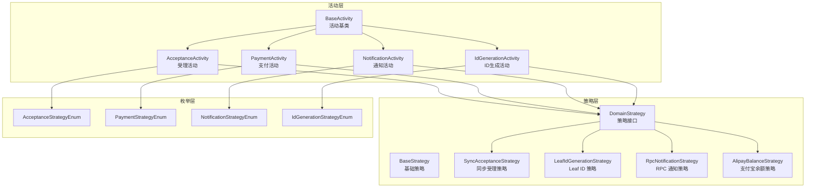
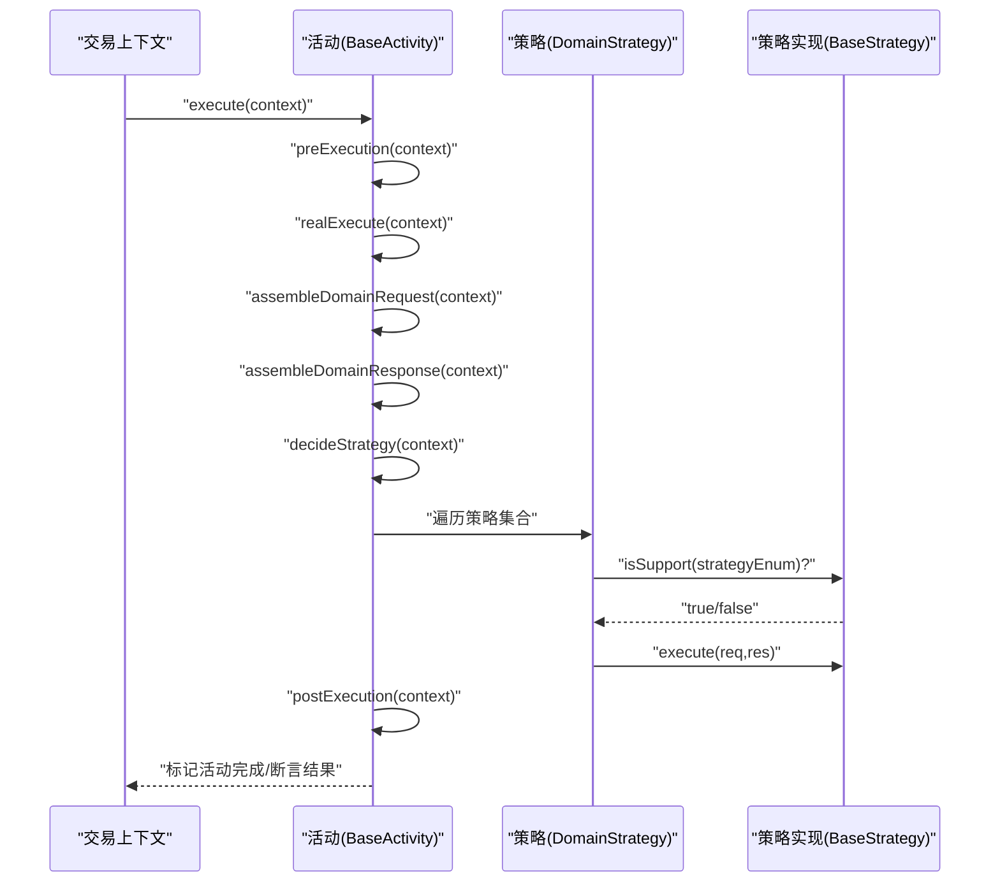
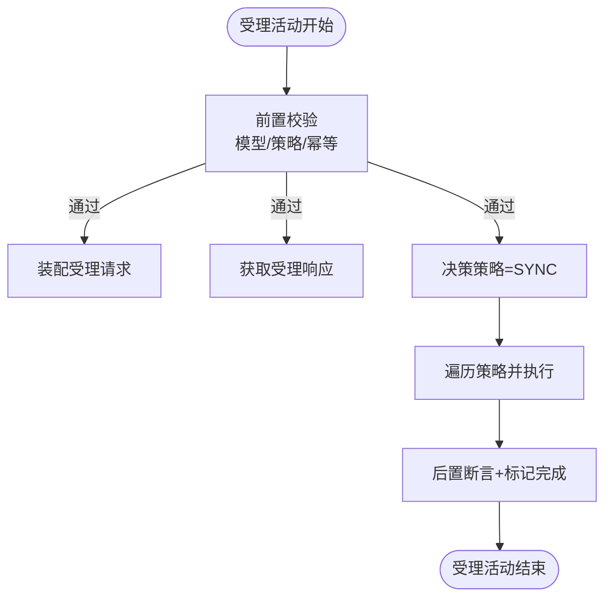
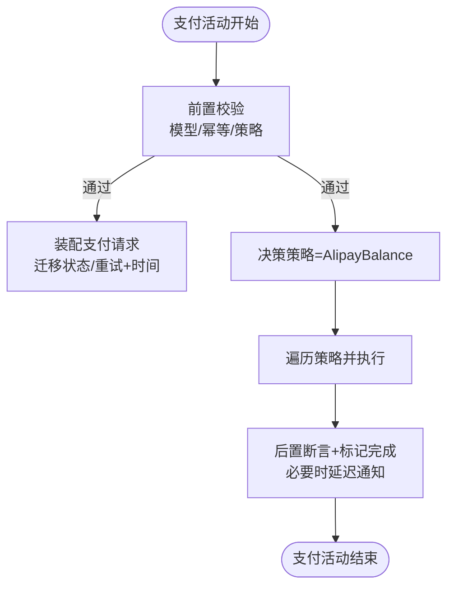
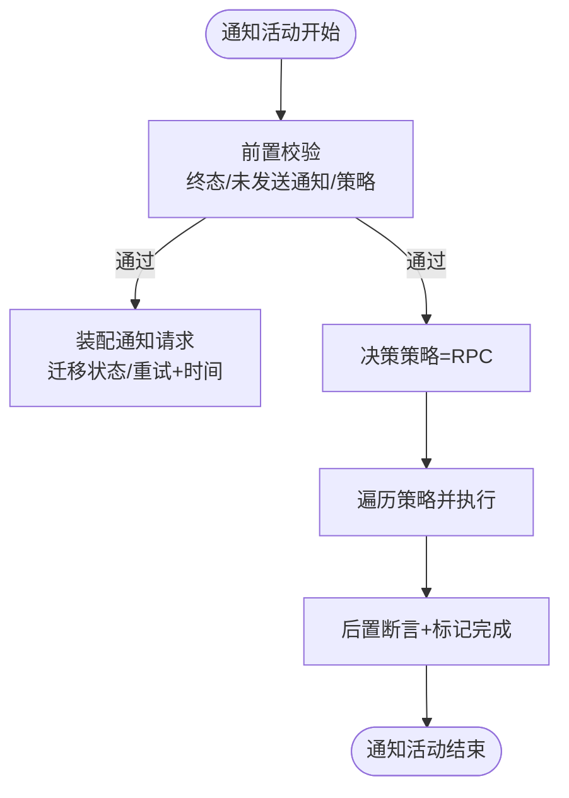
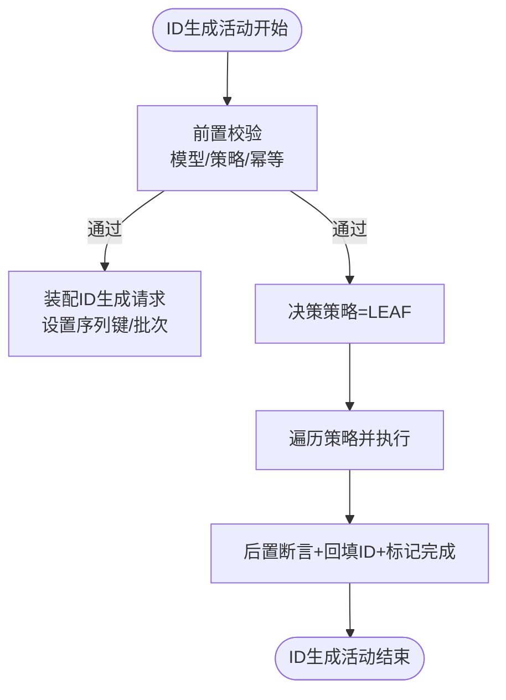
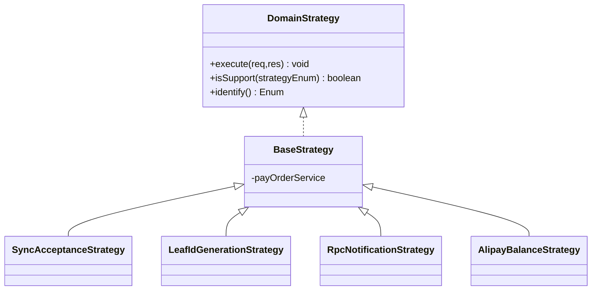
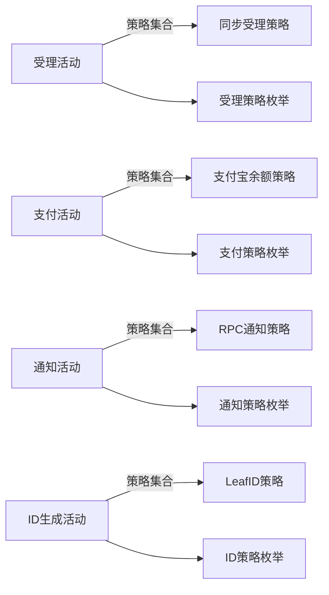

# 活动模式实现

<cite>
**本文引用的文件**
- [BaseActivity.java](file://core-service/src/main/java/com/magicliang/transaction/sys/core/domain/activity/BaseActivity.java)
- [AcceptanceActivity.java](file://core-service/src/main/java/com/magicliang/transaction/sys/core/domain/activity/acceptance/AcceptanceActivity.java)
- [PaymentActivity.java](file://core-service/src/main/java/com/magicliang/transaction/sys/core/domain/activity/payment/PaymentActivity.java)
- [NotificationActivity.java](file://core-service/src/main/java/com/magicliang/transaction/sys/core/domain/activity/notification/NotificationActivity.java)
- [IdGenerationActivity.java](file://core-service/src/main/java/com/magicliang/transaction/sys/core/domain/activity/idgeneration/IdGenerationActivity.java)
- [AcceptanceStrategyEnum.java](file://core-service/src/main/java/com/magicliang/transaction/sys/core/domain/enums/AcceptanceStrategyEnum.java)
- [PaymentStrategyEnum.java](file://core-service/src/main/java/com/magicliang/transaction/sys/core/domain/enums/PaymentStrategyEnum.java)
- [NotificationStrategyEnum.java](file://core-service/src/main/java/com/magicliang/transaction/sys/core/domain/enums/NotificationStrategyEnum.java)
- [IdGenerationStrategyEnum.java](file://core-service/src/main/java/com/magicliang/transaction/sys/core/domain/enums/IdGenerationStrategyEnum.java)
- [DomainStrategy.java](file://core-service/src/main/java/com/magicliang/transaction/sys/core/domain/strategy/DomainStrategy.java)
- [BaseStrategy.java](file://core-service/src/main/java/com/magicliang/transaction/sys/core/domain/strategy/BaseStrategy.java)
- [SyncAcceptanceStrategy.java](file://core-service/src/main/java/com/magicliang/transaction/sys/core/domain/strategy/acceptance/SyncAcceptanceStrategy.java)
- [LeafIdGenerationStrategy.java](file://core-service/src/main/java/com/magicliang/transaction/sys/core/domain/strategy/idgeneration/LeafIdGenerationStrategy.java)
- [RpcNotificationStrategy.java](file://core-service/src/main/java/com/magicliang/transaction/sys/core/domain/strategy/notification/RpcNotificationStrategy.java)
- [AlipayBalanceStrategy.java](file://core-service/src/main/java/com/magicliang/transaction/sys/core/domain/strategy/payment/AlipayBalanceStrategy.java)
</cite>

## 目录
1. [引言](#引言)
2. [项目结构](#项目结构)
3. [核心组件](#核心组件)
4. [架构总览](#架构总览)
5. [详细组件分析](#详细组件分析)
6. [依赖关系分析](#依赖关系分析)
7. [性能考量](#性能考量)
8. [故障排查指南](#故障排查指南)
9. [结论](#结论)
10. [附录](#附录)

## 引言
本文件面向领域驱动交易系统中的“活动模式”实现，系统化阐述 BaseActivity 抽象与四个具体活动（受理、支付、通知、ID 生成）的设计理念、职责边界与协作机制。活动模式将复杂业务流程拆分为可复用、可插拔的活动单元，结合策略模式实现“同一流程不同策略”的灵活分派，既保证了领域内聚，又提升了可测试性与可维护性。

## 项目结构
围绕活动模式的关键目录与文件如下：
- core-service/src/main/java/com/magicliang/transaction/sys/core/domain/activity：活动基类与四大活动
- core-service/src/main/java/com/magicliang/transaction/sys/core/domain/enums：各活动对应的策略点枚举
- core-service/src/main/java/com/magicliang/transaction/sys/core/domain/strategy：策略接口与具体策略实现

图表来源
- [BaseActivity.java:28-139](file://core-service/src/main/java/com/magicliang/transaction/sys/core/domain/activity/BaseActivity.java#L28-L139)
- [AcceptanceActivity.java:43-198](file://core-service/src/main/java/com/magicliang/transaction/sys/core/domain/activity/acceptance/AcceptanceActivity.java#L43-L198)
- [PaymentActivity.java:38-202](file://core-service/src/main/java/com/magicliang/transaction/sys/core/domain/activity/payment/PaymentActivity.java#L38-L202)
- [NotificationActivity.java:42-183](file://core-service/src/main/java/com/magicliang/transaction/sys/core/domain/activity/notification/NotificationActivity.java#L42-L183)
- [IdGenerationActivity.java:37-163](file://core-service/src/main/java/com/magicliang/transaction/sys/core/domain/activity/idgeneration/IdGenerationActivity.java#L37-L163)
- [DomainStrategy.java:16-37](file://core-service/src/main/java/com/magicliang/transaction/sys/core/domain/strategy/DomainStrategy.java#L16-L37)
- [BaseStrategy.java:15-23](file://core-service/src/main/java/com/magicliang/transaction/sys/core/domain/strategy/BaseStrategy.java#L15-L23)
- [SyncAcceptanceStrategy.java:34-80](file://core-service/src/main/java/com/magicliang/transaction/sys/core/domain/strategy/acceptance/SyncAcceptanceStrategy.java#L34-L80)
- [LeafIdGenerationStrategy.java:25-59](file://core-service/src/main/java/com/magicliang/transaction/sys/core/domain/strategy/idgeneration/LeafIdGenerationStrategy.java#L25-L59)
- [RpcNotificationStrategy.java:48-241](file://core-service/src/main/java/com/magicliang/transaction/sys/core/domain/strategy/notification/RpcNotificationStrategy.java#L48-L241)
- [AlipayBalanceStrategy.java:32-138](file://core-service/src/main/java/com/magicliang/transaction/sys/core/domain/strategy/payment/AlipayBalanceStrategy.java#L32-L138)
- [AcceptanceStrategyEnum.java:18-72](file://core-service/src/main/java/com/magicliang/transaction/sys/core/domain/enums/AcceptanceStrategyEnum.java#L18-L72)
- [PaymentStrategyEnum.java:18-73](file://core-service/src/main/java/com/magicliang/transaction/sys/core/domain/enums/PaymentStrategyEnum.java#L18-L73)
- [NotificationStrategyEnum.java:18-77](file://core-service/src/main/java/com/magicliang/transaction/sys/core/domain/enums/NotificationStrategyEnum.java#L18-L77)
- [IdGenerationStrategyEnum.java:18-72](file://core-service/src/main/java/com/magicliang/transaction/sys/core/domain/enums/IdGenerationStrategyEnum.java#L18-L72)

章节来源
- [BaseActivity.java:28-139](file://core-service/src/main/java/com/magicliang/transaction/sys/core/domain/activity/BaseActivity.java#L28-L139)
- [DomainStrategy.java:16-37](file://core-service/src/main/java/com/magicliang/transaction/sys/core/domain/strategy/DomainStrategy.java#L16-L37)

## 核心组件
- BaseActivity：定义统一的活动生命周期与策略分派入口，提供前置/真实执行/后置三段式控制流，支持活动级幂等与上下文状态管理。
- 四大活动：分别封装受理、支付、通知、ID 生成的业务流程；各自实现请求/响应装配与策略决策，并在后置阶段完成结果断言与上下文标记。
- 策略接口与实现：DomainStrategy 抽象策略行为，BaseStrategy 提供通用依赖注入能力；各活动绑定对应策略枚举，按决策结果激活具体策略。

章节来源
- [BaseActivity.java:28-139](file://core-service/src/main/java/com/magicliang/transaction/sys/core/domain/activity/BaseActivity.java#L28-L139)
- [DomainStrategy.java:16-37](file://core-service/src/main/java/com/magicliang/transaction/sys/core/domain/strategy/DomainStrategy.java#L16-L37)
- [BaseStrategy.java:15-23](file://core-service/src/main/java/com/magicliang/transaction/sys/core/domain/strategy/BaseStrategy.java#L15-L23)

## 架构总览
活动模式通过“活动 + 策略”的组合实现业务解耦与扩展。活动负责流程编排与上下文管理，策略负责具体执行细节。策略点由活动根据上下文决策，动态选择并执行。

图表来源
- [BaseActivity.java:42-84](file://core-service/src/main/java/com/magicliang/transaction/sys/core/domain/activity/BaseActivity.java#L42-L84)
- [DomainStrategy.java:24-35](file://core-service/src/main/java/com/magicliang/transaction/sys/core/domain/strategy/DomainStrategy.java#L24-L35)
- [BaseStrategy.java:15-23](file://core-service/src/main/java/com/magicliang/transaction/sys/core/domain/strategy/BaseStrategy.java#L15-L23)

## 详细组件分析

### BaseActivity 基类设计
- 生命周期
  - execute：统一入口，串联 preExecution → realExecute → postExecution。
  - preExecution：前置校验、活动级幂等、模型旧值校验、上下文合并完成标志。
  - realExecute：组装请求/响应，按策略点循环匹配并执行策略。
  - postExecution：后置断言、结果写回领域模型、标记活动完成。
- 泛型约束
  - IRequest/IResponse：确保活动与策略的输入输出契约一致。
  - E：策略点枚举类型，用于策略激活条件判断。
- 关键抽象
  - assembleDomainRequest/assembleDomainResponse/decideStrategy：由子类实现，体现活动职责边界。
  - getStrategies：默认空集合，子类可注入多策略实现。

章节来源
- [BaseActivity.java:28-139](file://core-service/src/main/java/com/magicliang/transaction/sys/core/domain/activity/BaseActivity.java#L28-L139)

### AcceptanceActivity（受理活动）
- 职责
  - 将支付订单、子订单、支付请求的初始状态与时间戳装配至领域模型。
  - 校验模型完整性与策略有效性，断言受理结果非空。
- 关键流程
  - preExecution：合并活动完成状态，校验支付订单/子订单/支付请求，断言策略非空。
  - assembleDomainRequest：将已装配的领域模型写入受理请求。
  - decideStrategy：固定返回同步受理策略。
  - postExecution：断言受理单号非空，标记受理完成。
- 与策略协作
  - 绑定 AcceptanceStrategyEnum，实际由 SyncAcceptanceStrategy 执行插入与ID回填。

图表来源
- [AcceptanceActivity.java:56-92](file://core-service/src/main/java/com/magicliang/transaction/sys/core/domain/activity/acceptance/AcceptanceActivity.java#L56-L92)
- [AcceptanceActivity.java:100-122](file://core-service/src/main/java/com/magicliang/transaction/sys/core/domain/activity/acceptance/AcceptanceActivity.java#L100-L122)
- [AcceptanceActivity.java:130-134](file://core-service/src/main/java/com/magicliang/transaction/sys/core/domain/activity/acceptance/AcceptanceActivity.java#L130-L134)
- [AcceptanceActivity.java:151-162](file://core-service/src/main/java/com/magicliang/transaction/sys/core/domain/activity/acceptance/AcceptanceActivity.java#L151-L162)
- [SyncAcceptanceStrategy.java:59-78](file://core-service/src/main/java/com/magicliang/transaction/sys/core/domain/strategy/acceptance/SyncAcceptanceStrategy.java#L59-L78)

章节来源
- [AcceptanceActivity.java:43-198](file://core-service/src/main/java/com/magicliang/transaction/sys/core/domain/activity/acceptance/AcceptanceActivity.java#L43-L198)
- [AcceptanceStrategyEnum.java:18-72](file://core-service/src/main/java/com/magicliang/transaction/sys/core/domain/enums/AcceptanceStrategyEnum.java#L18-L72)
- [SyncAcceptanceStrategy.java:34-80](file://core-service/src/main/java/com/magicliang/transaction/sys/core/domain/strategy/acceptance/SyncAcceptanceStrategy.java#L34-L80)

### PaymentActivity（支付活动）
- 职责
  - 将支付订单与支付请求迁移到“待支付”状态，更新重试计数与时间戳。
  - 校验支付订单/请求处于中间态，断言通道流水号非空。
- 关键流程
  - preExecution：合并完成状态，校验订单与请求，终态直接跳过。
  - assembleDomainRequest：更新支付订单/请求状态与时间戳。
  - decideStrategy：固定返回支付宝余额策略。
  - postExecution：断言通道流水号非空，若非终态则延迟通知，标记支付完成。
- 与策略协作
  - 绑定 PaymentStrategyEnum，实际由 AlipayBalanceStrategy 执行支付并更新状态。

图表来源
- [PaymentActivity.java:52-87](file://core-service/src/main/java/com/magicliang/transaction/sys/core/domain/activity/payment/PaymentActivity.java#L52-L87)
- [PaymentActivity.java:95-108](file://core-service/src/main/java/com/magicliang/transaction/sys/core/domain/activity/payment/PaymentActivity.java#L95-L108)
- [PaymentActivity.java:129-133](file://core-service/src/main/java/com/magicliang/transaction/sys/core/domain/activity/payment/PaymentActivity.java#L129-L133)
- [PaymentActivity.java:150-169](file://core-service/src/main/java/com/magicliang/transaction/sys/core/domain/activity/payment/PaymentActivity.java#L150-L169)
- [AlipayBalanceStrategy.java:56-81](file://core-service/src/main/java/com/magicliang/transaction/sys/core/domain/strategy/payment/AlipayBalanceStrategy.java#L56-L81)

章节来源
- [PaymentActivity.java:38-202](file://core-service/src/main/java/com/magicliang/transaction/sys/core/domain/activity/payment/PaymentActivity.java#L38-L202)
- [PaymentStrategyEnum.java:18-73](file://core-service/src/main/java/com/magicliang/transaction/sys/core/domain/enums/PaymentStrategyEnum.java#L18-L73)
- [AlipayBalanceStrategy.java:32-138](file://core-service/src/main/java/com/magicliang/transaction/sys/core/domain/strategy/payment/AlipayBalanceStrategy.java#L32-L138)

### NotificationActivity（通知活动）
- 职责
  - 仅在支付订单进入终态后，对未发送通知请求进行通知。
  - 校验通知请求集合非空，断言通知结果成功。
- 关键流程
  - preExecution：合并完成状态，校验订单终态与未发送通知列表，空则跳过。
  - assembleDomainRequest：仅更新通知请求状态与时间戳。
  - decideStrategy：固定返回 RPC 通知策略。
  - postExecution：断言通知成功，标记通知完成。
- 与策略协作
  - 绑定 NotificationStrategyEnum，实际由 RpcNotificationStrategy 执行通知并记录结果。

图表来源
- [NotificationActivity.java:55-88](file://core-service/src/main/java/com/magicliang/transaction/sys/core/domain/activity/notification/NotificationActivity.java#L55-L88)
- [NotificationActivity.java:96-108](file://core-service/src/main/java/com/magicliang/transaction/sys/core/domain/activity/notification/NotificationActivity.java#L96-L108)
- [NotificationActivity.java:150-154](file://core-service/src/main/java/com/magicliang/transaction/sys/core/domain/activity/notification/NotificationActivity.java#L150-L154)
- [NotificationActivity.java:171-181](file://core-service/src/main/java/com/magicliang/transaction/sys/core/domain/activity/notification/NotificationActivity.java#L171-L181)
- [RpcNotificationStrategy.java:78-121](file://core-service/src/main/java/com/magicliang/transaction/sys/core/domain/strategy/notification/RpcNotificationStrategy.java#L78-L121)

章节来源
- [NotificationActivity.java:42-183](file://core-service/src/main/java/com/magicliang/transaction/sys/core/domain/activity/notification/NotificationActivity.java#L42-L183)
- [NotificationStrategyEnum.java:18-77](file://core-service/src/main/java/com/magicliang/transaction/sys/core/domain/enums/NotificationStrategyEnum.java#L18-L77)
- [RpcNotificationStrategy.java:48-241](file://core-service/src/main/java/com/magicliang/transaction/sys/core/domain/strategy/notification/RpcNotificationStrategy.java#L48-L241)

### IdGenerationActivity（ID 生成活动）
- 职责
  - 通过外部序列服务批量生成支付单号，并回填至支付订单、子订单与支付请求。
  - 校验策略有效，断言生成ID为正数。
- 关键流程
  - preExecution：合并完成状态，校验支付订单，断言策略非空。
  - assembleDomainRequest：设置序列键与批次大小。
  - decideStrategy：固定返回 LEAF 策略。
  - postExecution：断言单元素且大于0，回填ID并标记完成。
- 与策略协作
  - 绑定 IdGenerationStrategyEnum，实际由 LeafIdGenerationStrategy 调用序列服务并写回响应。

图表来源
- [IdGenerationActivity.java:50-72](file://core-service/src/main/java/com/magicliang/transaction/sys/core/domain/activity/idgeneration/IdGenerationActivity.java#L50-L72)
- [IdGenerationActivity.java:80-87](file://core-service/src/main/java/com/magicliang/transaction/sys/core/domain/activity/idgeneration/IdGenerationActivity.java#L80-L87)
- [IdGenerationActivity.java:108-112](file://core-service/src/main/java/com/magicliang/transaction/sys/core/domain/activity/idgeneration/IdGenerationActivity.java#L108-L112)
- [IdGenerationActivity.java:129-160](file://core-service/src/main/java/com/magicliang/transaction/sys/core/domain/activity/idgeneration/IdGenerationActivity.java#L129-L160)
- [LeafIdGenerationStrategy.java:40-47](file://core-service/src/main/java/com/magicliang/transaction/sys/core/domain/strategy/idgeneration/LeafIdGenerationStrategy.java#L40-L47)

章节来源
- [IdGenerationActivity.java:37-163](file://core-service/src/main/java/com/magicliang/transaction/sys/core/domain/activity/idgeneration/IdGenerationActivity.java#L37-L163)
- [IdGenerationStrategyEnum.java:18-72](file://core-service/src/main/java/com/magicliang/transaction/sys/core/domain/enums/IdGenerationStrategyEnum.java#L18-L72)
- [LeafIdGenerationStrategy.java:25-59](file://core-service/src/main/java/com/magicliang/transaction/sys/core/domain/strategy/idgeneration/LeafIdGenerationStrategy.java#L25-L59)

### 策略接口与实现
- DomainStrategy：定义 execute(req,res) 与 isSupport(strategyEnum) 默认实现，策略通过 identify() 与枚举比对决定是否激活。
- BaseStrategy：提供通用依赖注入（如支付订单服务），具体策略聚焦业务执行。
- 策略实现
  - SyncAcceptanceStrategy：在事务内插入支付主表、请求表与子订单，回填ID并返回受理单号。
  - LeafIdGenerationStrategy：调用序列服务批量获取ID并写回响应。
  - RpcNotificationStrategy：解析通知URI，构造通知请求，按优先级发送并记录结果/异常。
  - AlipayBalanceStrategy：构建支付参数，前置更新状态与时间，调用下游并根据结果更新支付与请求状态。

图表来源
- [DomainStrategy.java:16-37](file://core-service/src/main/java/com/magicliang/transaction/sys/core/domain/strategy/DomainStrategy.java#L16-L37)
- [BaseStrategy.java:15-23](file://core-service/src/main/java/com/magicliang/transaction/sys/core/domain/strategy/BaseStrategy.java#L15-L23)
- [SyncAcceptanceStrategy.java:34-80](file://core-service/src/main/java/com/magicliang/transaction/sys/core/domain/strategy/acceptance/SyncAcceptanceStrategy.java#L34-L80)
- [LeafIdGenerationStrategy.java:25-59](file://core-service/src/main/java/com/magicliang/transaction/sys/core/domain/strategy/idgeneration/LeafIdGenerationStrategy.java#L25-L59)
- [RpcNotificationStrategy.java:48-241](file://core-service/src/main/java/com/magicliang/transaction/sys/core/domain/strategy/notification/RpcNotificationStrategy.java#L48-L241)
- [AlipayBalanceStrategy.java:32-138](file://core-service/src/main/java/com/magicliang/transaction/sys/core/domain/strategy/payment/AlipayBalanceStrategy.java#L32-L138)

章节来源
- [DomainStrategy.java:16-37](file://core-service/src/main/java/com/magicliang/transaction/sys/core/domain/strategy/DomainStrategy.java#L16-L37)
- [BaseStrategy.java:15-23](file://core-service/src/main/java/com/magicliang/transaction/sys/core/domain/strategy/BaseStrategy.java#L15-L23)

## 依赖关系分析
- 活动与策略
  - 每个活动通过 getStrategies 注入策略集合，按 decideStrategy 返回的枚举值匹配执行。
  - 策略实现依赖领域模型与外部服务（序列、下游支付/通知）。
- 上下文与幂等
  - 活动在 preExecution 合并全局完成状态与活动自身完成状态，避免重复执行。
  - 活动在 postExecution 完成断言与状态标记，保障流程推进的确定性。
- 错误与断言
  - 活动在关键节点使用断言工具校验输入与输出，确保领域不变量。

图表来源
- [AcceptanceActivity.java:141-144](file://core-service/src/main/java/com/magicliang/transaction/sys/core/domain/activity/acceptance/AcceptanceActivity.java#L141-L144)
- [PaymentActivity.java:140-143](file://core-service/src/main/java/com/magicliang/transaction/sys/core/domain/activity/payment/PaymentActivity.java#L140-L143)
- [NotificationActivity.java:161-164](file://core-service/src/main/java/com/magicliang/transaction/sys/core/domain/activity/notification/NotificationActivity.java#L161-L164)
- [IdGenerationActivity.java:119-122](file://core-service/src/main/java/com/magicliang/transaction/sys/core/domain/activity/idgeneration/IdGenerationActivity.java#L119-L122)
- [AcceptanceStrategyEnum.java:18-72](file://core-service/src/main/java/com/magicliang/transaction/sys/core/domain/enums/AcceptanceStrategyEnum.java#L18-L72)
- [PaymentStrategyEnum.java:18-73](file://core-service/src/main/java/com/magicliang/transaction/sys/core/domain/enums/PaymentStrategyEnum.java#L18-L73)
- [NotificationStrategyEnum.java:18-77](file://core-service/src/main/java/com/magicliang/transaction/sys/core/domain/enums/NotificationStrategyEnum.java#L18-L77)
- [IdGenerationStrategyEnum.java:18-72](file://core-service/src/main/java/com/magicliang/transaction/sys/core/domain/enums/IdGenerationStrategyEnum.java#L18-L72)

章节来源
- [AcceptanceActivity.java:141-144](file://core-service/src/main/java/com/magicliang/transaction/sys/core/domain/activity/acceptance/AcceptanceActivity.java#L141-L144)
- [PaymentActivity.java:140-143](file://core-service/src/main/java/com/magicliang/transaction/sys/core/domain/activity/payment/PaymentActivity.java#L140-L143)
- [NotificationActivity.java:161-164](file://core-service/src/main/java/com/magicliang/transaction/sys/core/domain/activity/notification/NotificationActivity.java#L161-L164)
- [IdGenerationActivity.java:119-122](file://core-service/src/main/java/com/magicliang/transaction/sys/core/domain/activity/idgeneration/IdGenerationActivity.java#L119-L122)

## 性能考量
- 策略执行的线性遍历：getStrategies 返回策略集合，按 decideStrategy 决策匹配执行。建议在策略数量较少或通过枚举精确匹配时保持高效。
- 幂等与短路：活动在 preExecution 合并完成状态，避免重复执行，减少无效IO。
- 外部依赖抖动：通知与支付策略可能调用下游服务，应结合熔断与重试策略，避免阻塞主线程。
- 数据一致性：受理与ID生成策略在事务内写入数据库，确保原子性；支付与通知策略需注意“发送前/发送后”两阶段更新，防止状态漂移。

## 故障排查指南
- 常见断言失败
  - 受理活动：断言受理单号非空。
  - 支付活动：断言通道流水号非空。
  - 通知活动：断言通知成功。
  - ID 生成活动：断言生成ID为单元素且大于0。
- 策略未生效
  - 检查 decideStrategy 返回值与策略 identify() 是否一致。
  - 确认 getStrategies 注入的策略集合包含目标实现。
- 幂等提前结束
  - 若上下文已完成，活动将直接返回。检查 isComplete/isXxxComplete 标志位。
- 下游异常
  - 通知与支付策略在 finally 中更新领域模型，确保异常场景也能落库。

章节来源
- [AcceptanceActivity.java:156-161](file://core-service/src/main/java/com/magicliang/transaction/sys/core/domain/activity/acceptance/AcceptanceActivity.java#L156-L161)
- [PaymentActivity.java:157-161](file://core-service/src/main/java/com/magicliang/transaction/sys/core/domain/activity/payment/PaymentActivity.java#L157-L161)
- [NotificationActivity.java:175-178](file://core-service/src/main/java/com/magicliang/transaction/sys/core/domain/activity/notification/NotificationActivity.java#L175-L178)
- [IdGenerationActivity.java:137-143](file://core-service/src/main/java/com/magicliang/transaction/sys/core/domain/activity/idgeneration/IdGenerationActivity.java#L137-L143)

## 结论
活动模式通过 BaseActivity 的统一生命周期与策略分派，将受理、支付、通知、ID 生成等复杂业务流程模块化、可插拔化。配合策略接口与具体实现，系统在保持领域内聚的同时，具备良好的扩展性与可测试性。建议在新增活动或策略时遵循现有抽象，确保上下文状态、断言与幂等机制的一致性。

## 附录
- 使用建议
  - 新增活动：继承 BaseActivity，实现 assembleDomainRequest/assembleDomainResponse/decideStrategy，并在 postExecution 完成断言与状态标记。
  - 新增策略：实现 DomainStrategy，通过 identify() 与活动策略枚举对齐，注入 BaseStrategy 以复用通用依赖。
  - 参数与结果：通过活动的请求/响应对象承载，策略仅关注执行细节，避免跨活动耦合。