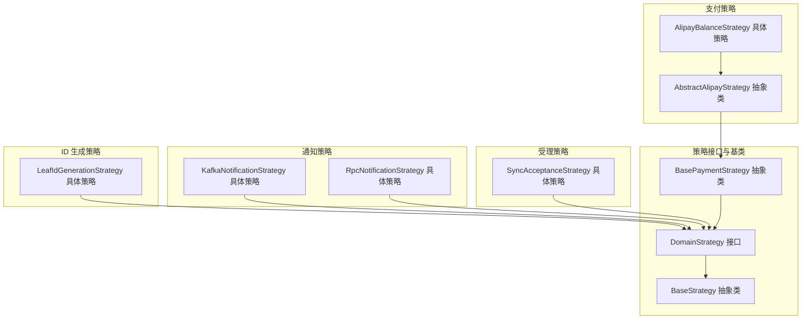
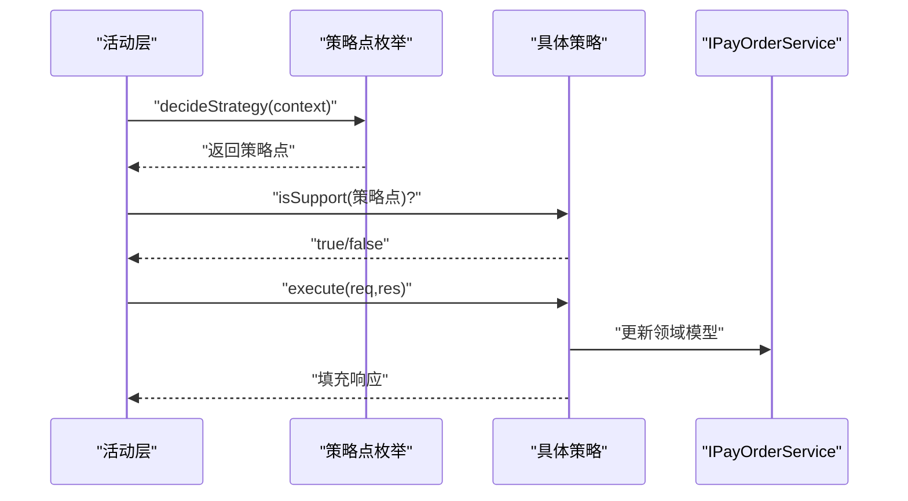
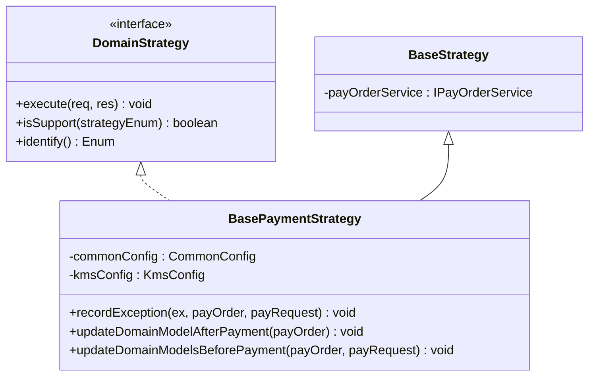
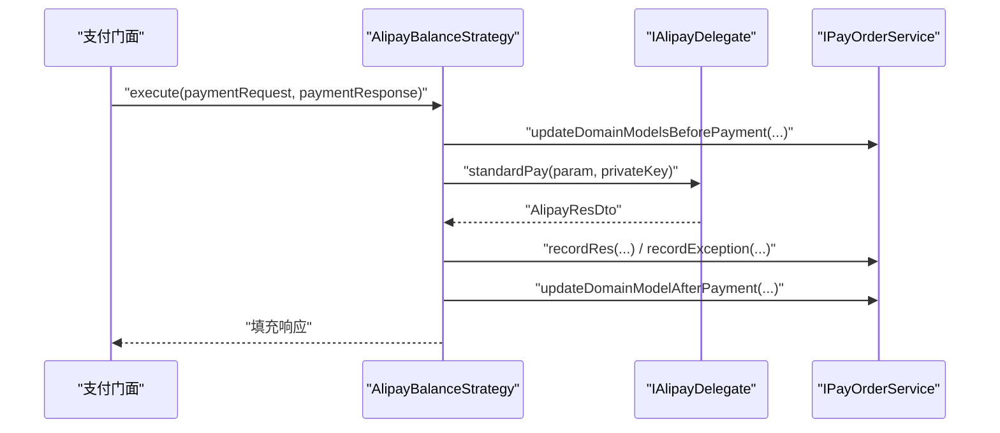
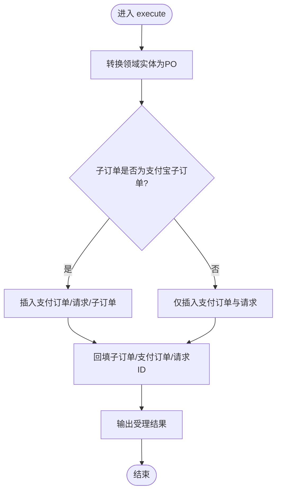
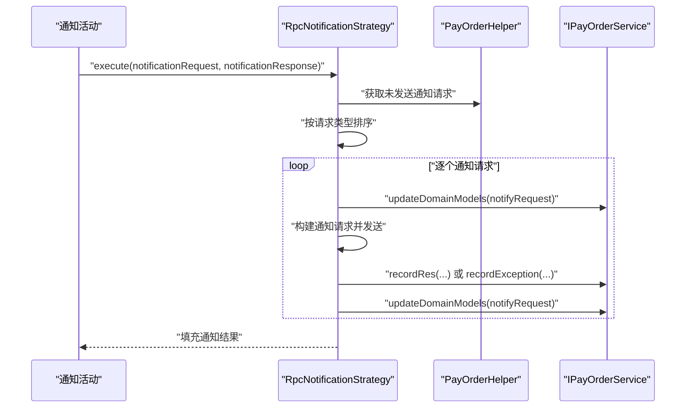
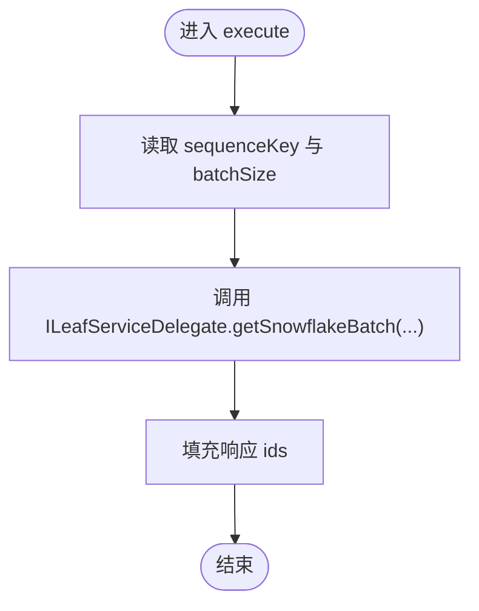
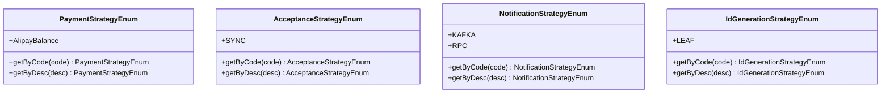
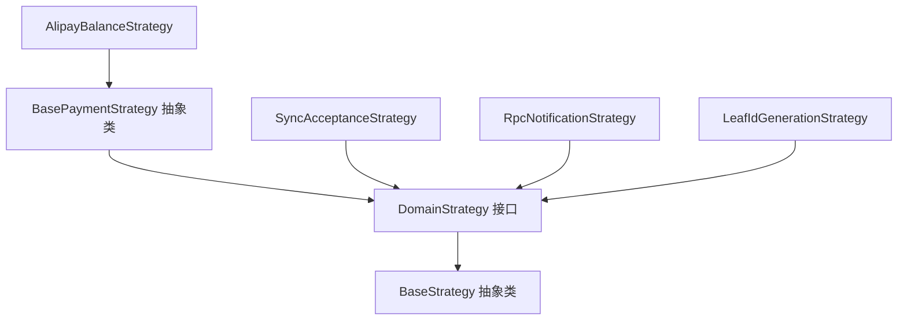

# 策略模式实现

<cite>
**本文引用的文件**
- [BaseStrategy.java](file://core-service/src/main/java/com/magicliang/transaction/sys/core/domain/strategy/BaseStrategy.java)
- [DomainStrategy.java](file://core-service/src/main/java/com/magicliang/transaction/sys/core/domain/strategy/DomainStrategy.java)
- [BasePaymentStrategy.java](file://core-service/src/main/java/com/magicliang/transaction/sys/core/domain/strategy/payment/BasePaymentStrategy.java)
- [AbstractAlipayStrategy.java](file://core-service/src/main/java/com/magicliang/transaction/sys/core/domain/strategy/payment/AbstractAlipayStrategy.java)
- [AlipayBalanceStrategy.java](file://core-service/src/main/java/com/magicliang/transaction/sys/core/domain/strategy/payment/AlipayBalanceStrategy.java)
- [SyncAcceptanceStrategy.java](file://core-service/src/main/java/com/magicliang/transaction/sys/core/domain/strategy/acceptance/SyncAcceptanceStrategy.java)
- [KafkaNotificationStrategy.java](file://core-service/src/main/java/com/magicliang/transaction/sys/core/domain/strategy/notification/KafkaNotificationStrategy.java)
- [RpcNotificationStrategy.java](file://core-service/src/main/java/com/magicliang/transaction/sys/core/domain/strategy/notification/RpcNotificationStrategy.java)
- [LeafIdGenerationStrategy.java](file://core-service/src/main/java/com/magicliang/transaction/sys/core/domain/strategy/idgeneration/LeafIdGenerationStrategy.java)
- [PaymentStrategyEnum.java](file://core-service/src/main/java/com/magicliang/transaction/sys/core/domain/enums/PaymentStrategyEnum.java)
- [AcceptanceStrategyEnum.java](file://core-service/src/main/java/com/magicliang/transaction/sys/core/domain/enums/AcceptanceStrategyEnum.java)
- [NotificationStrategyEnum.java](file://core-service/src/main/java/com/magicliang/transaction/sys/core/domain/enums/NotificationStrategyEnum.java)
- [IdGenerationStrategyEnum.java](file://core-service/src/main/java/com/magicliang/transaction/sys/core/domain/enums/IdGenerationStrategyEnum.java)
- [IdGenerationActivity.java](file://core-service/src/main/java/com/magicliang/transaction/sys/core/domain/activity/idgeneration/IdGenerationActivity.java)
- [分派模式.md](file://core-service/src/main/java/com/magicliang/transaction/sys/core/domain/strategy/分派模式.md)
</cite>

## 目录
1. [简介](#简介)
2. [项目结构](#项目结构)
3. [核心组件](#核心组件)
4. [架构总览](#架构总览)
5. [详细组件分析](#详细组件分析)
6. [依赖分析](#依赖分析)
7. [性能考虑](#性能考虑)
8. [故障排查指南](#故障排查指南)
9. [结论](#结论)
10. [附录](#附录)

## 简介
本文件面向领域驱动交易系统中的策略模式实现，系统性解析策略模式在支付、受理、通知与ID生成等领域的应用与扩展机制。重点涵盖：
- 基类设计：BaseStrategy 与 DomainStrategy 的职责与协作
- 策略接口：统一的 execute 与 isSupport 机制
- 具体策略：支付策略（AbstractAlipayStrategy、AlipayBalanceStrategy）、受理策略（SyncAcceptanceStrategy）、通知策略（KafkaNotificationStrategy、RpcNotificationStrategy）、ID 生成策略（LeafIdGenerationStrategy）
- 动态切换与扩展：通过策略点枚举与 isSupport 实现运行时策略选择
- 注册、选择与执行流程：结合活动层的策略装配与决策

## 项目结构
策略模式相关代码主要位于 core-service 模块的 domain 层，按功能域划分策略实现：
- 支付策略域：payment 包
- 受理策略域：acceptance 包
- 通知策略域：notification 包
- ID 生成策略域：idgeneration 包
- 策略基类与接口：domain/strategy 包
- 策略点枚举：domain/enums 包

图表来源
- [DomainStrategy.java:16-36](file://core-service/src/main/java/com/magicliang/transaction/sys/core/domain/strategy/DomainStrategy.java#L16-L36)
- [BaseStrategy.java:15-22](file://core-service/src/main/java/com/magicliang/transaction/sys/core/domain/strategy/BaseStrategy.java#L15-L22)
- [BasePaymentStrategy.java:28-29](file://core-service/src/main/java/com/magicliang/transaction/sys/core/domain/strategy/payment/BasePaymentStrategy.java#L28-L29)
- [AbstractAlipayStrategy.java:12-14](file://core-service/src/main/java/com/magicliang/transaction/sys/core/domain/strategy/payment/AbstractAlipayStrategy.java#L12-L14)
- [AlipayBalanceStrategy.java:32-48](file://core-service/src/main/java/com/magicliang/transaction/sys/core/domain/strategy/payment/AlipayBalanceStrategy#L32-L48)
- [SyncAcceptanceStrategy.java:34-51](file://core-service/src/main/java/com/magicliang/transaction/sys/core/domain/strategy/acceptance/SyncAcceptanceStrategy.java#L34-L51)
- [KafkaNotificationStrategy.java:22-33](file://core-service/src/main/java/com/magicliang/transaction/sys/core/domain/strategy/notification/KafkaNotificationStrategy.java#L22-L33)
- [RpcNotificationStrategy.java:48-71](file://core-service/src/main/java/com/magicliang/transaction/sys/core/domain/strategy/notification/RpcNotificationStrategy.java#L48-L71)
- [LeafIdGenerationStrategy.java:25-57](file://core-service/src/main/java/com/magicliang/transaction/sys/core/domain/strategy/idgeneration/LeafIdGenerationStrategy.java#L25-L57)

章节来源
- [BaseStrategy.java:15-22](file://core-service/src/main/java/com/magicliang/transaction/sys/core/domain/strategy/BaseStrategy.java#L15-L22)
- [DomainStrategy.java:16-36](file://core-service/src/main/java/com/magicliang/transaction/sys/core/domain/strategy/DomainStrategy.java#L16-L36)

## 核心组件
- DomainStrategy 接口：定义统一的 execute 与 isSupport，实现“按策略点枚举激活”的策略选择机制
- BaseStrategy 抽象类：注入 IPayOrderService，为所有策略提供通用的领域模型更新与持久化能力
- BasePaymentStrategy 抽象类：在支付场景下提供“发送前事务”和“发送后事务”的统一处理骨架，以及异常记录与状态更新的通用逻辑
- 具体策略：分别实现各自领域的 execute 逻辑，并通过 identify 返回对应的策略点枚举值

章节来源
- [DomainStrategy.java:16-36](file://core-service/src/main/java/com/magicliang/transaction/sys/core/domain/strategy/DomainStrategy.java#L16-L36)
- [BaseStrategy.java:15-22](file://core-service/src/main/java/com/magicliang/transaction/sys/core/domain/strategy/BaseStrategy.java#L15-L22)
- [BasePaymentStrategy.java:28-93](file://core-service/src/main/java/com/magicliang/transaction/sys/core/domain/strategy/payment/BasePaymentStrategy.java#L28-L93)

## 架构总览
策略模式在交易系统中的工作方式：
- 策略点枚举：用于标识当前活动应采用的策略分支（如支付、受理、通知、ID 生成）
- 策略装配：活动层根据上下文决定策略点，并从已注册的策略集合中筛选匹配策略
- 策略选择：isSupport 通过 compare identify() 与策略点枚举判断是否激活
- 策略执行：execute 完成该领域的具体业务逻辑

图表来源
- [IdGenerationActivity.java:109-112](file://core-service/src/main/java/com/magicliang/transaction/sys/core/domain/activity/idgeneration/IdGenerationActivity.java#L109-L112)
- [DomainStrategy.java:33-35](file://core-service/src/main/java/com/magicliang/transaction/sys/core/domain/strategy/DomainStrategy.java#L33-L35)
- [BaseStrategy.java:20-21](file://core-service/src/main/java/com/magicliang/transaction/sys/core/domain/strategy/BaseStrategy.java#L20-L21)

## 详细组件分析

### 基类与接口设计
- DomainStrategy：以泛型约束请求/响应类型与策略点枚举类型，提供 execute 与 isSupport，默认实现基于 identify() 与枚举比较
- BaseStrategy：注入 IPayOrderService，为策略提供统一的领域模型更新入口
- BasePaymentStrategy：在支付场景下提供“发送前事务”和“发送后事务”的模板方法，封装异常处理与状态更新

图表来源
- [DomainStrategy.java:16-36](file://core-service/src/main/java/com/magicliang/transaction/sys/core/domain/strategy/DomainStrategy.java#L16-L36)
- [BaseStrategy.java:15-22](file://core-service/src/main/java/com/magicliang/transaction/sys/core/domain/strategy/BaseStrategy.java#L15-L22)
- [BasePaymentStrategy.java:28-93](file://core-service/src/main/java/com/magicliang/transaction/sys/core/domain/strategy/payment/BasePaymentStrategy.java#L28-L93)

章节来源
- [DomainStrategy.java:16-36](file://core-service/src/main/java/com/magicliang/transaction/sys/core/domain/strategy/DomainStrategy.java#L16-L36)
- [BaseStrategy.java:15-22](file://core-service/src/main/java/com/magicliang/transaction/sys/core/domain/strategy/BaseStrategy.java#L15-L22)
- [BasePaymentStrategy.java:28-93](file://core-service/src/main/java/com/magicliang/transaction/sys/core/domain/strategy/payment/BasePaymentStrategy.java#L28-L93)

### 支付策略：AbstractAlipayStrategy 与 AlipayBalanceStrategy
- AbstractAlipayStrategy：继承 BasePaymentStrategy，作为支付域的抽象基类
- AlipayBalanceStrategy：具体策略，实现 identify 返回 PaymentStrategyEnum.AlipayBalance，并在 execute 中完成“发送前事务”“调用下游”“记录响应/异常”“发送后事务”的完整流程

图表来源
- [AlipayBalanceStrategy.java:56-81](file://core-service/src/main/java/com/magicliang/transaction/sys/core/domain/strategy/payment/AlipayBalanceStrategy.java#L56-L81)
- [BasePaymentStrategy.java:82-90](file://core-service/src/main/java/com/magicliang/transaction/sys/core/domain/strategy/payment/BasePaymentStrategy.java#L82-L90)

章节来源
- [AbstractAlipayStrategy.java:12-14](file://core-service/src/main/java/com/magicliang/transaction/sys/core/domain/strategy/payment/AbstractAlipayStrategy.java#L12-L14)
- [AlipayBalanceStrategy.java:32-138](file://core-service/src/main/java/com/magicliang/transaction/sys/core/domain/strategy/payment/AlipayBalanceStrategy.java#L32-L138)
- [PaymentStrategyEnum.java:18-25](file://core-service/src/main/java/com/magicliang/transaction/sys/core/domain/enums/PaymentStrategyEnum.java#L18-L25)

### 受理策略：SyncAcceptanceStrategy
- 通过 identify 返回 AcceptanceStrategyEnum.SYNC
- execute 在单事务内完成支付订单、支付请求与子订单 PO 转换与插入，回填实体 ID 并输出受理结果

图表来源
- [SyncAcceptanceStrategy.java:60-78](file://core-service/src/main/java/com/magicliang/transaction/sys/core/domain/strategy/acceptance/SyncAcceptanceStrategy.java#L60-L78)

章节来源
- [SyncAcceptanceStrategy.java:34-80](file://core-service/src/main/java/com/magicliang/transaction/sys/core/domain/strategy/acceptance/SyncAcceptanceStrategy.java#L34-L80)
- [AcceptanceStrategyEnum.java:18-24](file://core-service/src/main/java/com/magicliang/transaction/sys/core/domain/enums/AcceptanceStrategyEnum.java#L18-L24)

### 通知策略：KafkaNotificationStrategy 与 RpcNotificationStrategy
- KafkaNotificationStrategy：identify 返回 NotificationStrategyEnum.KAFKA，execute 抛出不支持异常，表示暂未实现
- RpcNotificationStrategy：identify 返回 NotificationStrategyEnum.RPC，execute 读取未发送通知请求，按优先级排序后逐个发送，记录响应/异常并更新领域模型

图表来源
- [RpcNotificationStrategy.java:79-121](file://core-service/src/main/java/com/magicliang/transaction/sys/core/domain/strategy/notification/RpcNotificationStrategy.java#L79-L121)
- [KafkaNotificationStrategy.java:22-45](file://core-service/src/main/java/com/magicliang/transaction/sys/core/domain/strategy/notification/KafkaNotificationStrategy.java#L22-L45)

章节来源
- [KafkaNotificationStrategy.java:22-47](file://core-service/src/main/java/com/magicliang/transaction/sys/core/domain/strategy/notification/KafkaNotificationStrategy.java#L22-L47)
- [RpcNotificationStrategy.java:48-241](file://core-service/src/main/java/com/magicliang/transaction/sys/core/domain/strategy/notification/RpcNotificationStrategy.java#L48-L241)
- [NotificationStrategyEnum.java:18-29](file://core-service/src/main/java/com/magicliang/transaction/sys/core/domain/enums/NotificationStrategyEnum.java#L18-L29)

### ID 生成策略：LeafIdGenerationStrategy
- 通过 identify 返回 IdGenerationStrategyEnum.LEAF
- execute 从 ILeafServiceDelegate 获取批量雪花 ID，并填充响应

图表来源
- [LeafIdGenerationStrategy.java:40-47](file://core-service/src/main/java/com/magicliang/transaction/sys/core/domain/strategy/idgeneration/LeafIdGenerationStrategy.java#L40-L47)

章节来源
- [LeafIdGenerationStrategy.java:25-59](file://core-service/src/main/java/com/magicliang/transaction/sys/core/domain/strategy/idgeneration/LeafIdGenerationStrategy.java#L25-L59)
- [IdGenerationStrategyEnum.java:18-24](file://core-service/src/main/java/com/magicliang/transaction/sys/core/domain/enums/IdGenerationStrategyEnum.java#L18-L24)

### 策略选择机制与扩展
- 策略点枚举：PaymentStrategyEnum、AcceptanceStrategyEnum、NotificationStrategyEnum、IdGenerationStrategyEnum
- 策略选择：DomainStrategy.isSupport 默认通过 identify() 与枚举比较判断是否激活
- 扩展机制：新增策略只需实现 DomainStrategy 接口并返回新的 identify 枚举值，活动层通过 decideStrategy 返回对应策略点即可启用新策略

图表来源
- [PaymentStrategyEnum.java:18-25](file://core-service/src/main/java/com/magicliang/transaction/sys/core/domain/enums/PaymentStrategyEnum.java#L18-L25)
- [AcceptanceStrategyEnum.java:18-24](file://core-service/src/main/java/com/magicliang/transaction/sys/core/domain/enums/AcceptanceStrategyEnum.java#L18-L24)
- [NotificationStrategyEnum.java:18-29](file://core-service/src/main/java/com/magicliang/transaction/sys/core/domain/enums/NotificationStrategyEnum.java#L18-L29)
- [IdGenerationStrategyEnum.java:18-24](file://core-service/src/main/java/com/magicliang/transaction/sys/core/domain/enums/IdGenerationStrategyEnum.java#L18-L24)

章节来源
- [DomainStrategy.java:33-35](file://core-service/src/main/java/com/magicliang/transaction/sys/core/domain/strategy/DomainStrategy.java#L33-L35)
- [分派模式.md:1-17](file://core-service/src/main/java/com/magicliang/transaction/sys/core/domain/strategy/分派模式.md#L1-L17)

## 依赖分析
- 组件内聚与耦合
  - 策略实现依赖 DomainStrategy 接口与 BaseStrategy 抽象类，保持高内聚、低耦合
  - 支付策略依赖 BasePaymentStrategy 提供的事务骨架与异常处理
  - 各策略通过 identify 返回枚举，避免硬编码分支，便于扩展
- 外部依赖
  - IPayOrderService：统一的领域模型更新与持久化入口
  - ILeafServiceDelegate / IAlipayDelegate：下游集成接口
  - CommonConfig / KmsConfig：通用配置与密钥管理

图表来源
- [DomainStrategy.java:16-36](file://core-service/src/main/java/com/magicliang/transaction/sys/core/domain/strategy/DomainStrategy.java#L16-L36)
- [BaseStrategy.java:15-22](file://core-service/src/main/java/com/magicliang/transaction/sys/core/domain/strategy/BaseStrategy.java#L15-L22)
- [BasePaymentStrategy.java:28-29](file://core-service/src/main/java/com/magicliang/transaction/sys/core/domain/strategy/payment/BasePaymentStrategy.java#L28-L29)
- [AlipayBalanceStrategy.java:32-48](file://core-service/src/main/java/com/magicliang/transaction/sys/core/domain/strategy/payment/AlipayBalanceStrategy#L32-L48)
- [SyncAcceptanceStrategy.java:34-51](file://core-service/src/main/java/com/magicliang/transaction/sys/core/domain/strategy/acceptance/SyncAcceptanceStrategy.java#L34-L51)
- [RpcNotificationStrategy.java:48-71](file://core-service/src/main/java/com/magicliang/transaction/sys/core/domain/strategy/notification/RpcNotificationStrategy.java#L48-L71)
- [LeafIdGenerationStrategy.java:25-57](file://core-service/src/main/java/com/magicliang/transaction/sys/core/domain/strategy/idgeneration/LeafIdGenerationStrategy.java#L25-L57)

章节来源
- [BaseStrategy.java:20-21](file://core-service/src/main/java/com/magicliang/transaction/sys/core/domain/strategy/BaseStrategy.java#L20-L21)

## 性能考虑
- 事务边界：支付策略在“发送前事务”和“发送后事务”之间调用下游，减少跨事务的复杂度
- 批量 ID 生成：LeafIdGenerationStrategy 通过批量获取 ID，降低下游调用次数
- 通知排序：RpcNotificationStrategy 按请求类型排序，确保关键通知优先执行
- 异常与重试：BasePaymentStrategy 的异常记录与状态更新保证失败可恢复与可观测

## 故障排查指南
- 支付策略异常
  - 现象：支付失败但订单仍处于中间态或状态不一致
  - 排查：检查 recordException 与 updateDomainModelsBeforePayment/updateDomainModelAfterPayment 的调用链
  - 参考路径：[AlipayBalanceStrategy.java:74-80](file://core-service/src/main/java/com/magicliang/transaction/sys/core/domain/strategy/payment/AlipayBalanceStrategy.java#L74-L80)，[BasePaymentStrategy.java:50-90](file://core-service/src/main/java/com/magicliang/transaction/sys/core/domain/strategy/payment/BasePaymentStrategy.java#L50-L90)
- 通知策略未执行
  - 现象：通知未发送或抛出不支持异常
  - 排查：确认 identify 返回值与策略点枚举一致；检查 RpcNotificationStrategy 的请求过滤与排序逻辑
  - 参考路径：[KafkaNotificationStrategy.java:44-45](file://core-service/src/main/java/com/magicliang/transaction/sys/core/domain/strategy/notification/KafkaNotificationStrategy.java#L44-L45)，[RpcNotificationStrategy.java:82-121](file://core-service/src/main/java/com/magicliang/transaction/sys/core/domain/strategy/notification/RpcNotificationStrategy.java#L82-L121)
- ID 生成异常
  - 现象：ID 生成为空或下游调用失败
  - 排查：确认 sequenceKey 与 batchSize 参数；检查 ILeafServiceDelegate 的可用性
  - 参考路径：[LeafIdGenerationStrategy.java:43-47](file://core-service/src/main/java/com/magicliang/transaction/sys/core/domain/strategy/idgeneration/LeafIdGenerationStrategy.java#L43-L47)

章节来源
- [AlipayBalanceStrategy.java:74-80](file://core-service/src/main/java/com/magicliang/transaction/sys/core/domain/strategy/payment/AlipayBalanceStrategy.java#L74-L80)
- [BasePaymentStrategy.java:50-90](file://core-service/src/main/java/com/magicliang/transaction/sys/core/domain/strategy/payment/BasePaymentStrategy.java#L50-L90)
- [KafkaNotificationStrategy.java:44-45](file://core-service/src/main/java/com/magicliang/transaction/sys/core/domain/strategy/notification/KafkaNotificationStrategy.java#L44-L45)
- [RpcNotificationStrategy.java:82-121](file://core-service/src/main/java/com/magicliang/transaction/sys/core/domain/strategy/notification/RpcNotificationStrategy.java#L82-L121)
- [LeafIdGenerationStrategy.java:43-47](file://core-service/src/main/java/com/magicliang/transaction/sys/core/domain/strategy/idgeneration/LeafIdGenerationStrategy.java#L43-L47)

## 结论
本系统通过 DomainStrategy 接口与 BaseStrategy 抽象类，构建了清晰的策略模式骨架，配合策略点枚举与 isSupport 机制，实现了算法的动态切换与扩展。支付、受理、通知与 ID 生成四大领域均以策略形式实现，既保证了业务逻辑的可维护性，也为后续扩展提供了稳定接口。

## 附录
- 策略注册与选择
  - 活动层通过 decideStrategy 返回策略点枚举，策略集合中各策略通过 identify 与枚举比较实现自动激活
  - 参考路径：[IdGenerationActivity.java:109-112](file://core-service/src/main/java/com/magicliang/transaction/sys/core/domain/activity/idgeneration/IdGenerationActivity.java#L109-L112)，[DomainStrategy.java:33-35](file://core-service/src/main/java/com/magicliang/transaction/sys/core/domain/strategy/DomainStrategy.java#L33-L35)
- 扩展新策略步骤
  - 新建策略类实现 DomainStrategy，返回新的 identify 枚举值
  - 在活动层的 decideStrategy 中返回对应策略点
  - 参考路径：[分派模式.md:1-17](file://core-service/src/main/java/com/magicliang/transaction/sys/core/domain/strategy/分派模式.md#L1-L17)