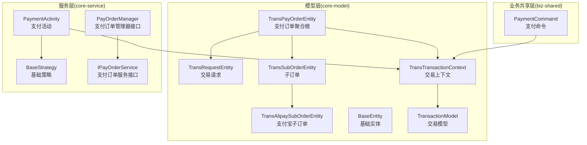
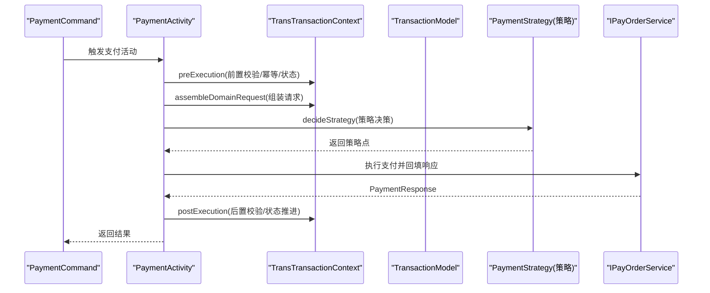
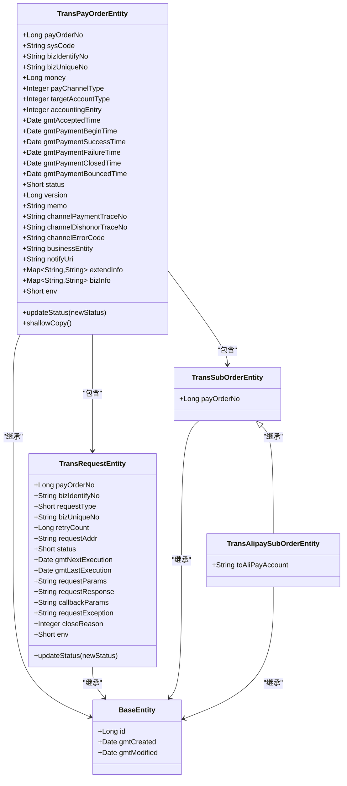
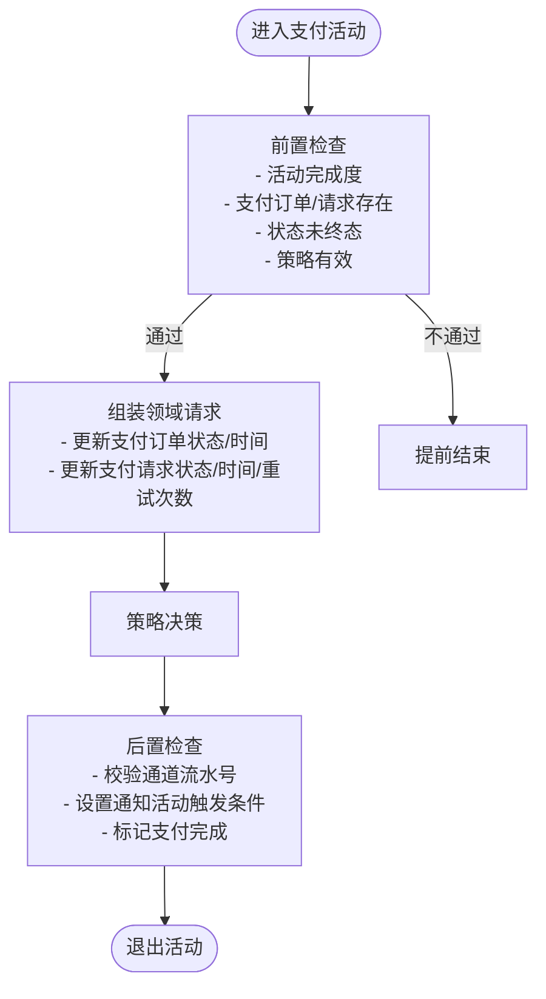
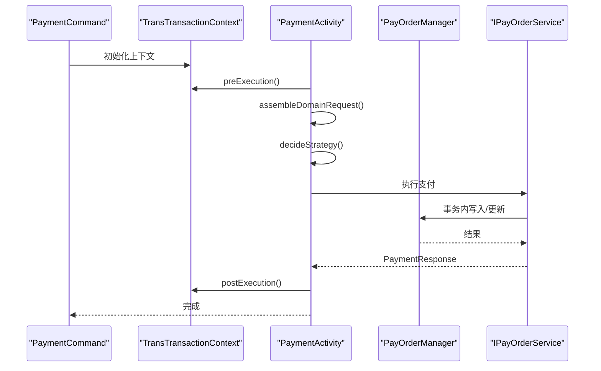
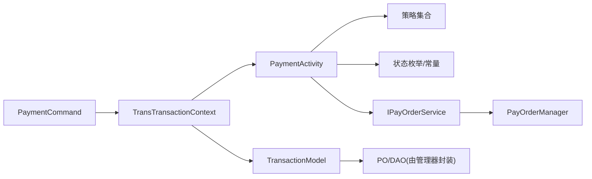

# 核心模块详解

<cite>
**本文引用的文件**
- [TransPayOrderEntity.java](file://core-model/src/main/java/com/magicliang/transaction/sys/core/model/entity/TransPayOrderEntity.java)
- [TransRequestEntity.java](file://core-model/src/main/java/com/magicliang/transaction/sys/core/model/entity/TransRequestEntity.java)
- [TransSubOrderEntity.java](file://core-model/src/main/java/com/magicliang/transaction/sys/core/model/entity/TransSubOrderEntity.java)
- [TransAlipaySubOrderEntity.java](file://core-model/src/main/java/com/magicliang/transaction/sys/core/model/entity/TransAlipaySubOrderEntity.java)
- [BaseEntity.java](file://core-model/src/main/java/com/magicliang/transaction/sys/core/model/entity/BaseEntity.java)
- [TransTransactionContext.java](file://core-model/src/main/java/com/magicliang/transaction/sys/core/model/context/TransTransactionContext.java)
- [TransactionModel.java](file://core-model/src/main/java/com/magicliang/transaction/sys/core/model/context/TransactionModel.java)
- [PaymentActivity.java](file://core-service/src/main/java/com/magicliang/transaction/sys/core/domain/activity/payment/PaymentActivity.java)
- [BaseStrategy.java](file://core-service/src/main/java/com/magicliang/transaction/sys/core/domain/strategy/BaseStrategy.java)
- [PayOrderManager.java](file://core-service/src/main/java/com/magicliang/transaction/sys/core/manager/PayOrderManager.java)
- [IPayOrderService.java](file://core-service/src/main/java/com/magicliang/transaction/sys/core/service/IPayOrderService.java)
- [PaymentCommand.java](file://biz-shared/src/main/java/com/magicliang/transaction/sys/biz/shared/request/payment/PaymentCommand.java)
</cite>

## 目录
1. [引言](#引言)
2. [项目结构](#项目结构)
3. [核心组件](#核心组件)
4. [架构总览](#架构总览)
5. [详细组件分析](#详细组件分析)
6. [依赖分析](#依赖分析)
7. [性能考虑](#性能考虑)
8. [故障排查指南](#故障排查指南)
9. [结论](#结论)
10. [附录](#附录)

## 引言
本文件聚焦于领域驱动交易系统的核心模块，系统性解析模型层的领域实体设计（如支付订单、交易请求、子订单等）、服务层的活动与策略模式应用、以及业务共享层的请求/响应与事件模型。文档旨在帮助开发者快速理解模块职责、协作关系与数据流转，并提供扩展与优化建议。

## 项目结构
核心模块由三层构成：
- 模型层（core-model）：定义领域实体、上下文与请求/响应模型，承载业务不变量与状态迁移。
- 服务层（core-service）：封装活动（Activity）与策略（Strategy），协调跨活动的分布式事务与幂等控制。
- 业务共享层（biz-shared）：对外暴露统一的命令/查询模型与事件定义，屏蔽内部实现细节。

图表来源
- [TransPayOrderEntity.java:32-215](file://core-model/src/main/java/com/magicliang/transaction/sys/core/model/entity/TransPayOrderEntity.java#L32-L215)
- [TransRequestEntity.java:22-121](file://core-model/src/main/java/com/magicliang/transaction/sys/core/model/entity/TransRequestEntity.java#L22-L121)
- [TransSubOrderEntity.java:17-23](file://core-model/src/main/java/com/magicliang/transaction/sys/core/model/entity/TransSubOrderEntity.java#L17-L23)
- [TransAlipaySubOrderEntity.java:17-23](file://core-model/src/main/java/com/magicliang/transaction/sys/core/model/entity/TransAlipaySubOrderEntity.java#L17-L23)
- [BaseEntity.java:20-36](file://core-model/src/main/java/com/magicliang/transaction/sys/core/model/entity/BaseEntity.java#L20-L36)
- [TransTransactionContext.java:27-138](file://core-model/src/main/java/com/magicliang/transaction/sys/core/model/context/TransTransactionContext.java#L27-L138)
- [TransactionModel.java:17-43](file://core-model/src/main/java/com/magicliang/transaction/sys/core/model/context/TransactionModel.java#L17-L43)
- [PaymentActivity.java:38-201](file://core-service/src/main/java/com/magicliang/transaction/sys/core/domain/activity/payment/PaymentActivity.java#L38-L201)
- [BaseStrategy.java:15-22](file://core-service/src/main/java/com/magicliang/transaction/sys/core/domain/strategy/BaseStrategy.java#L15-L22)
- [PayOrderManager.java:18-186](file://core-service/src/main/java/com/magicliang/transaction/sys/core/manager/PayOrderManager.java#L18-L186)
- [IPayOrderService.java:16-157](file://core-service/src/main/java/com/magicliang/transaction/sys/core/service/IPayOrderService.java#L16-L157)
- [PaymentCommand.java:20-42](file://biz-shared/src/main/java/com/magicliang/transaction/sys/biz/shared/request/payment/PaymentCommand.java#L20-L42)

章节来源
- [TransPayOrderEntity.java:18-215](file://core-model/src/main/java/com/magicliang/transaction/sys/core/model/entity/TransPayOrderEntity.java#L18-L215)
- [TransRequestEntity.java:11-121](file://core-model/src/main/java/com/magicliang/transaction/sys/core/model/entity/TransRequestEntity.java#L11-L121)
- [TransTransactionContext.java:13-138](file://core-model/src/main/java/com/magicliang/transaction/sys/core/model/context/TransTransactionContext.java#L13-L138)
- [PaymentActivity.java:27-201](file://core-service/src/main/java/com/magicliang/transaction/sys/core/domain/activity/payment/PaymentActivity.java#L27-L201)
- [IPayOrderService.java:7-157](file://core-service/src/main/java/com/magicliang/transaction/sys/core/service/IPayOrderService.java#L7-L157)
- [PaymentCommand.java:9-42](file://biz-shared/src/main/java/com/magicliang/transaction/sys/biz/shared/request/payment/PaymentCommand.java#L9-L42)

## 核心组件
本节从“模型-活动-策略-共享”四个维度，系统梳理核心组件的职责与边界。

- 模型层
  - 支付订单聚合根：承载支付订单主键、业务标识、金额、通道类型、账户类型、会计分录、状态与时间戳、版本号、扩展信息、以及与子订单、支付请求、通知请求的关系。
  - 交易请求：承载请求类型、业务唯一号、重试次数、请求/响应/回调参数、异常、关闭原因与环境等。
  - 子订单：抽象子订单，支付宝子订单在此基础上扩展目标账户字段。
  - 基础实体：统一的自增主键与创建/修改时间字段。
  - 交易上下文与交易模型：贯穿活动的上下文容器，按活动维度持有请求/响应与完成标志；交易模型封装支付订单与幂等/错误信息。

- 服务层
  - 支付活动：负责支付环节的前置校验、模型组装、策略决策、后置校验与状态推进；通过上下文标记活动完成度，驱动后续通知活动。
  - 基础策略：注入支付订单服务，作为策略实现的基类。
  - 支付订单管理器与服务：面向DAO层的管理器接口与面向领域模型的服务接口，分别承担批量查询、计数与事务性写入等职责。

- 业务共享层
  - 支付命令：统一的支付入口命令，支持外部直接提供支付订单或通过业务标识码/订单号填充模型。

章节来源
- [TransPayOrderEntity.java:32-215](file://core-model/src/main/java/com/magicliang/transaction/sys/core/model/entity/TransPayOrderEntity.java#L32-L215)
- [TransRequestEntity.java:22-121](file://core-model/src/main/java/com/magicliang/transaction/sys/core/model/entity/TransRequestEntity.java#L22-L121)
- [TransSubOrderEntity.java:17-23](file://core-model/src/main/java/com/magicliang/transaction/sys/core/model/entity/TransSubOrderEntity.java#L17-L23)
- [TransAlipaySubOrderEntity.java:17-23](file://core-model/src/main/java/com/magicliang/transaction/sys/core/model/entity/TransAlipaySubOrderEntity.java#L17-L23)
- [BaseEntity.java:20-36](file://core-model/src/main/java/com/magicliang/transaction/sys/core/model/entity/BaseEntity.java#L20-L36)
- [TransTransactionContext.java:27-138](file://core-model/src/main/java/com/magicliang/transaction/sys/core/model/context/TransTransactionContext.java#L27-L138)
- [TransactionModel.java:17-43](file://core-model/src/main/java/com/magicliang/transaction/sys/core/model/context/TransactionModel.java#L17-L43)
- [PaymentActivity.java:38-201](file://core-service/src/main/java/com/magicliang/transaction/sys/core/domain/activity/payment/PaymentActivity.java#L38-L201)
- [BaseStrategy.java:15-22](file://core-service/src/main/java/com/magicliang/transaction/sys/core/domain/strategy/BaseStrategy.java#L15-L22)
- [PayOrderManager.java:18-186](file://core-service/src/main/java/com/magicliang/transaction/sys/core/manager/PayOrderManager.java#L18-L186)
- [IPayOrderService.java:16-157](file://core-service/src/main/java/com/magicliang/transaction/sys/core/service/IPayOrderService.java#L16-L157)
- [PaymentCommand.java:20-42](file://biz-shared/src/main/java/com/magicliang/transaction/sys/biz/shared/request/payment/PaymentCommand.java#L20-L42)

## 架构总览
系统采用“活动-策略-上下文”的领域编排架构：
- 活动（Activity）：以支付活动为例，负责活动级的前置/后置检查、模型组装与状态推进。
- 策略（Strategy）：通过策略枚举与策略集合解耦不同支付渠道或路径。
- 上下文（Context）：贯穿一次交易生命周期，按活动维度保存请求/响应与完成标志，避免跨线程/跨模块状态散落。
- 管理器与服务：将DAO层PO与领域模型实体解耦，服务层仅暴露领域语义的操作。

图表来源
- [PaymentActivity.java:52-169](file://core-service/src/main/java/com/magicliang/transaction/sys/core/domain/activity/payment/PaymentActivity.java#L52-L169)
- [TransTransactionContext.java:27-138](file://core-model/src/main/java/com/magicliang/transaction/sys/core/model/context/TransTransactionContext.java#L27-L138)
- [IPayOrderService.java:16-157](file://core-service/src/main/java/com/magicliang/transaction/sys/core/service/IPayOrderService.java#L16-L157)
- [PaymentCommand.java:20-42](file://biz-shared/src/main/java/com/magicliang/transaction/sys/biz/shared/request/payment/PaymentCommand.java#L20-L42)

## 详细组件分析

### 模型层：领域实体与关系映射
- 支付订单聚合根（TransPayOrderEntity）
  - 主键与业务标识：payOrderNo、sysCode、bizIdentifyNo、bizUniqueNo。
  - 金额与会计分录：money、accountingEntry。
  - 渠道与账户：payChannelType、targetAccountType。
  - 时间轴：gmtAcceptedTime、gmtPaymentBeginTime、gmtPaymentSuccessTime、gmtPaymentFailureTime、gmtPaymentClosedTime、gmtPaymentBouncedTime。
  - 状态与版本：status、version。
  - 扩展信息：extendInfo（平台能力抽象）、bizInfo（透传给链路其他系统）。
  - 关系：包含一个子订单（TransSubOrderEntity）、一个支付请求（TransRequestEntity）与多个通知请求（List<TransRequestEntity>)。
  - 状态迁移：提供updateStatus方法，结合状态枚举进行合法性校验。
  - 浅拷贝：提供toBuilder构建器浅拷贝能力。

- 交易请求（TransRequestEntity）
  - 关联支付订单号、业务标识、请求类型、业务唯一号。
  - 重试与时间：retryCount、gmtNextExecution、gmtLastExecution。
  - 参数与响应：requestParams、requestResponse、callbackParams、requestException。
  - 关闭原因与环境：closeReason、env。
  - 状态迁移：提供updateStatus方法，结合请求状态枚举进行合法性校验。

- 子订单（TransSubOrderEntity 与 TransAlipaySubOrderEntity）
  - 抽象子订单包含payOrderNo；支付宝子订单扩展目标账户字段。

- 基础实体（BaseEntity）
  - 统一id、gmtCreated、gmtModified字段，便于DAO层映射与审计。

图表来源
- [TransPayOrderEntity.java:32-215](file://core-model/src/main/java/com/magicliang/transaction/sys/core/model/entity/TransPayOrderEntity.java#L32-L215)
- [TransRequestEntity.java:22-121](file://core-model/src/main/java/com/magicliang/transaction/sys/core/model/entity/TransRequestEntity.java#L22-L121)
- [TransSubOrderEntity.java:17-23](file://core-model/src/main/java/com/magicliang/transaction/sys/core/model/entity/TransSubOrderEntity.java#L17-L23)
- [TransAlipaySubOrderEntity.java:17-23](file://core-model/src/main/java/com/magicliang/transaction/sys/core/model/entity/TransAlipaySubOrderEntity.java#L17-L23)
- [BaseEntity.java:20-36](file://core-model/src/main/java/com/magicliang/transaction/sys/core/model/entity/BaseEntity.java#L20-L36)

章节来源
- [TransPayOrderEntity.java:32-215](file://core-model/src/main/java/com/magicliang/transaction/sys/core/model/entity/TransPayOrderEntity.java#L32-L215)
- [TransRequestEntity.java:22-121](file://core-model/src/main/java/com/magicliang/transaction/sys/core/model/entity/TransRequestEntity.java#L22-L121)
- [TransSubOrderEntity.java:17-23](file://core-model/src/main/java/com/magicliang/transaction/sys/core/model/entity/TransSubOrderEntity.java#L17-L23)
- [TransAlipaySubOrderEntity.java:17-23](file://core-model/src/main/java/com/magicliang/transaction/sys/core/model/entity/TransAlipaySubOrderEntity.java#L17-L23)
- [BaseEntity.java:20-36](file://core-model/src/main/java/com/magicliang/transaction/sys/core/model/entity/BaseEntity.java#L20-L36)

### 服务层：活动与策略模式
- 支付活动（PaymentActivity）
  - 前置检查：判断活动是否已完成、模型是否存在、目标状态是否已终态、策略是否有效。
  - 模型组装：在支付前更新支付订单与支付请求的状态与时间，递增重试次数。
  - 策略决策：当前固定返回支付宝余额策略，未来可接入流程引擎或配置中心。
  - 后置检查：校验通道流水号非空，根据支付订单状态决定通知活动是否需要立即触发，并标记支付活动完成。

- 基础策略（BaseStrategy）
  - 注入IPayOrderService，作为策略实现的通用依赖。

图表来源
- [PaymentActivity.java:52-201](file://core-service/src/main/java/com/magicliang/transaction/sys/core/domain/activity/payment/PaymentActivity.java#L52-L201)
- [BaseStrategy.java:15-22](file://core-service/src/main/java/com/magicliang/transaction/sys/core/domain/strategy/BaseStrategy.java#L15-L22)

章节来源
- [PaymentActivity.java:52-201](file://core-service/src/main/java/com/magicliang/transaction/sys/core/domain/activity/payment/PaymentActivity.java#L52-L201)
- [BaseStrategy.java:15-22](file://core-service/src/main/java/com/magicliang/transaction/sys/core/domain/strategy/BaseStrategy.java#L15-L22)

### 业务共享层：请求/响应与命令
- 支付命令（PaymentCommand）
  - 支持两种使用方式：外部直接提供支付订单实体，或通过payOrderNo与业务标识填充模型。
  - identify方法标识操作类型为支付。

章节来源
- [PaymentCommand.java:20-42](file://biz-shared/src/main/java/com/magicliang/transaction/sys/biz/shared/request/payment/PaymentCommand.java#L20-L42)

### 数据流与事务边界
- 输入：PaymentCommand携带业务意图与可选的支付订单。
- 活动编排：PaymentActivity在上下文中组装请求、选择策略、调用服务层执行支付，并在后置阶段推进状态。
- 事务边界：服务层通过管理器接口与服务接口保证跨模型的事务一致性（如插入/更新支付订单与请求、通知请求）。

图表来源
- [TransTransactionContext.java:27-138](file://core-model/src/main/java/com/magicliang/transaction/sys/core/model/context/TransTransactionContext.java#L27-L138)
- [PaymentActivity.java:52-201](file://core-service/src/main/java/com/magicliang/transaction/sys/core/domain/activity/payment/PaymentActivity.java#L52-L201)
- [PayOrderManager.java:18-186](file://core-service/src/main/java/com/magicliang/transaction/sys/core/manager/PayOrderManager.java#L18-L186)
- [IPayOrderService.java:16-157](file://core-service/src/main/java/com/magicliang/transaction/sys/core/service/IPayOrderService.java#L16-L157)

## 依赖分析
- 模型层
  - 实体间继承关系清晰：子订单与支付宝子订单继承基础实体；支付订单聚合根组合请求与子订单。
  - 上下文与模型：上下文按活动维度持有请求/响应与完成标志，交易模型持有支付订单与幂等/错误信息。

- 服务层
  - PaymentActivity依赖策略集合与领域枚举进行状态校验与策略决策。
  - BaseStrategy依赖IPayOrderService，策略实现通过该服务访问/更新领域模型。

- 业务共享层
  - PaymentCommand作为统一入口，与上下文配合驱动活动执行。

图表来源
- [PaymentCommand.java:20-42](file://biz-shared/src/main/java/com/magicliang/transaction/sys/biz/shared/request/payment/PaymentCommand.java#L20-L42)
- [TransTransactionContext.java:27-138](file://core-model/src/main/java/com/magicliang/transaction/sys/core/model/context/TransTransactionContext.java#L27-L138)
- [PaymentActivity.java:38-201](file://core-service/src/main/java/com/magicliang/transaction/sys/core/domain/activity/payment/PaymentActivity.java#L38-L201)
- [BaseStrategy.java:15-22](file://core-service/src/main/java/com/magicliang/transaction/sys/core/domain/strategy/BaseStrategy.java#L15-L22)
- [IPayOrderService.java:16-157](file://core-service/src/main/java/com/magicliang/transaction/sys/core/service/IPayOrderService.java#L16-L157)
- [PayOrderManager.java:18-186](file://core-service/src/main/java/com/magicliang/transaction/sys/core/manager/PayOrderManager.java#L18-L186)

章节来源
- [TransTransactionContext.java:27-138](file://core-model/src/main/java/com/magicliang/transaction/sys/core/model/context/TransTransactionContext.java#L27-L138)
- [PaymentActivity.java:38-201](file://core-service/src/main/java/com/magicliang/transaction/sys/core/domain/activity/payment/PaymentActivity.java#L38-L201)
- [IPayOrderService.java:16-157](file://core-service/src/main/java/com/magicliang/transaction/sys/core/service/IPayOrderService.java#L16-L157)
- [PayOrderManager.java:18-186](file://core-service/src/main/java/com/magicliang/transaction/sys/core/manager/PayOrderManager.java#L18-L186)

## 性能考虑
- 批量查询与分页
  - 管理器接口提供批量查询与分页能力，避免一次性加载大量未完成订单导致内存压力。
- 状态推进与时间戳
  - 活动在前置/后置阶段统一更新时间戳与状态，减少重复扫描与无效重试。
- 策略解耦
  - 将策略集中管理，避免在活动内硬编码分支，提升可测试性与可维护性。
- 幂等与终态短路
  - 活动在前置阶段检查目标模型是否已进入终态，避免重复执行。
- 事务边界
  - 通过管理器接口封装事务内的插入/更新，降低跨模型写入的复杂度与锁竞争。

## 故障排查指南
- 支付订单状态非法
  - 现象：状态迁移失败或前置校验抛错。
  - 排查：确认状态枚举与updateStatus调用顺序，检查历史状态与当前状态是否允许迁移。
- 通道流水号缺失
  - 现象：后置校验失败。
  - 排查：确保支付通道返回的流水号非空，并正确回填至响应对象。
- 请求/响应为空
  - 现象：活动无法组装领域请求或响应为空。
  - 排查：确认上下文中的请求/响应已正确填充，且策略已正确决策。
- 事务写入失败
  - 现象：跨模型写入失败或版本冲突。
  - 排查：检查版本号对比与乐观锁策略，确认事务边界内的一致性。

章节来源
- [TransPayOrderEntity.java:197-204](file://core-model/src/main/java/com/magicliang/transaction/sys/core/model/entity/TransPayOrderEntity.java#L197-L204)
- [TransRequestEntity.java:113-120](file://core-model/src/main/java/com/magicliang/transaction/sys/core/model/entity/TransRequestEntity.java#L113-L120)
- [PaymentActivity.java:150-169](file://core-service/src/main/java/com/magicliang/transaction/sys/core/domain/activity/payment/PaymentActivity.java#L150-L169)
- [IPayOrderService.java:122-156](file://core-service/src/main/java/com/magicliang/transaction/sys/core/service/IPayOrderService.java#L122-L156)

## 结论
本核心模块通过清晰的领域模型、活动-策略编排与上下文驱动，实现了支付订单的完整生命周期管理。模型层以聚合根为核心，服务层以活动为骨架，业务共享层以命令为入口，三者协同保障了高内聚、低耦合与良好的扩展性。建议在实际落地中结合配置中心与流程引擎进一步增强策略灵活性，并持续优化批量查询与事务边界以提升吞吐与稳定性。

## 附录
- 使用场景示例（路径指引）
  - 支付命令入口：[PaymentCommand.java:20-42](file://biz-shared/src/main/java/com/magicliang/transaction/sys/biz/shared/request/payment/PaymentCommand.java#L20-L42)
  - 支付活动执行：[PaymentActivity.java:52-201](file://core-service/src/main/java/com/magicliang/transaction/sys/core/domain/activity/payment/PaymentActivity.java#L52-L201)
  - 支付订单服务接口：[IPayOrderService.java:16-157](file://core-service/src/main/java/com/magicliang/transaction/sys/core/service/IPayOrderService.java#L16-L157)
  - 支付订单管理器接口：[PayOrderManager.java:18-186](file://core-service/src/main/java/com/magicliang/transaction/sys/core/manager/PayOrderManager.java#L18-L186)
  - 交易上下文与模型：[TransTransactionContext.java:27-138](file://core-model/src/main/java/com/magicliang/transaction/sys/core/model/context/TransTransactionContext.java#L27-L138)、[TransactionModel.java:17-43](file://core-model/src/main/java/com/magicliang/transaction/sys/core/model/context/TransactionModel.java#L17-L43)
  - 领域实体定义：[TransPayOrderEntity.java:32-215](file://core-model/src/main/java/com/magicliang/transaction/sys/core/model/entity/TransPayOrderEntity.java#L32-L215)、[TransRequestEntity.java:22-121](file://core-model/src/main/java/com/magicliang/transaction/sys/core/model/entity/TransRequestEntity.java#L22-L121)、[TransSubOrderEntity.java:17-23](file://core-model/src/main/java/com/magicliang/transaction/sys/core/model/entity/TransSubOrderEntity.java#L17-L23)、[TransAlipaySubOrderEntity.java:17-23](file://core-model/src/main/java/com/magicliang/transaction/sys/core/model/entity/TransAlipaySubOrderEntity.java#L17-L23)、[BaseEntity.java:20-36](file://core-model/src/main/java/com/magicliang/transaction/sys/core/model/entity/BaseEntity.java#L20-L36)