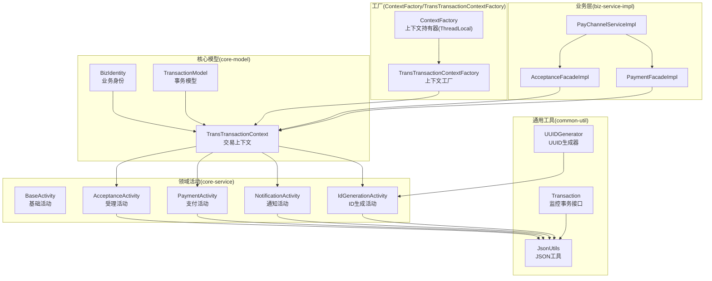
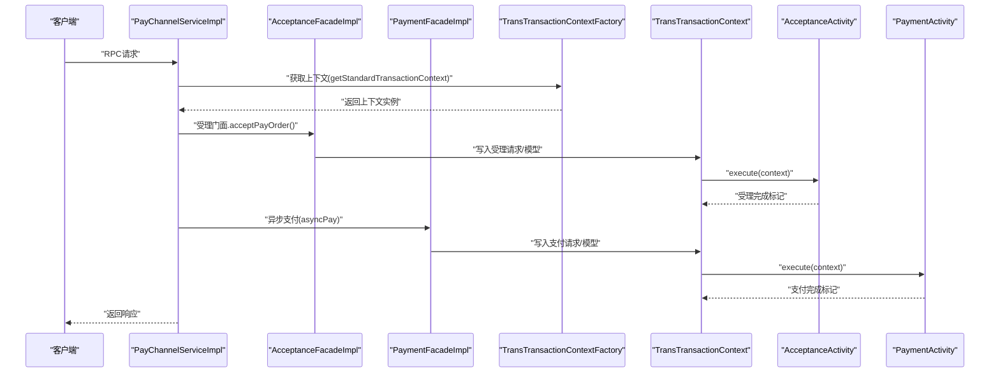
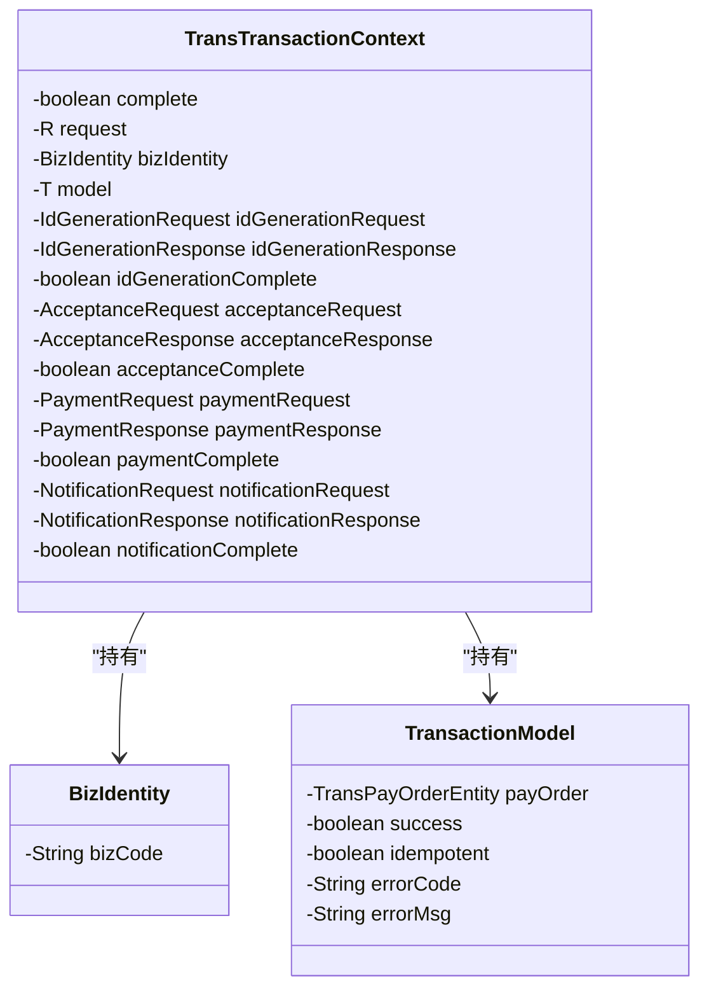
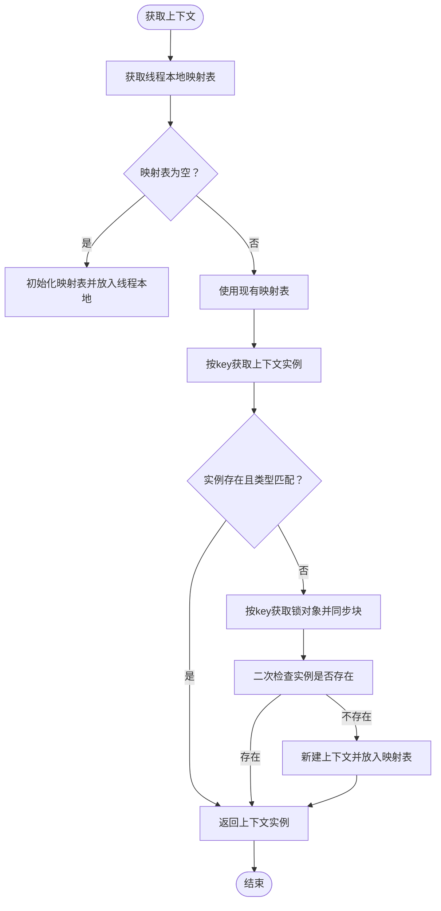
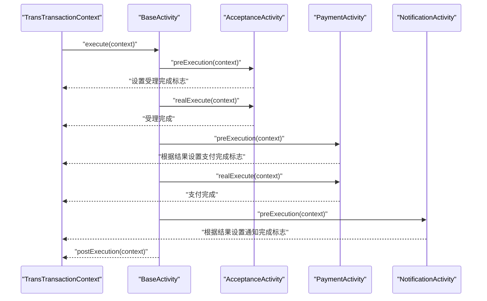
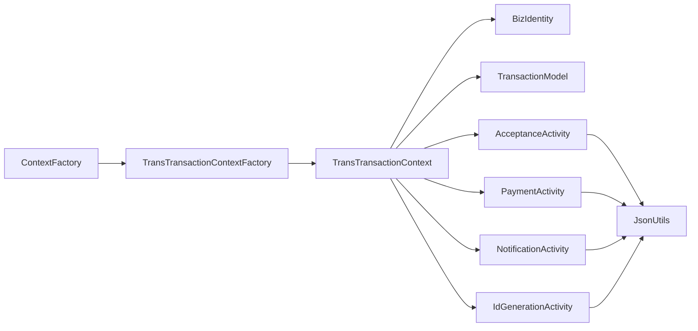

# 上下文模型

<cite>
**本文档引用的文件**
- [BizIdentity.java](file://core-model/src/main/java/com/magicliang/transaction/sys/core/model/context/BizIdentity.java)
- [TransTransactionContext.java](file://core-model/src/main/java/com/magicliang/transaction/sys/core/model/context/TransTransactionContext.java)
- [TransactionModel.java](file://core-model/src/main/java/com/magicliang/transaction/sys/core/model/context/TransactionModel.java)
- [ContextFactory.java](file://core-model/src/main/java/com/magicliang/transaction/sys/core/factory/ContextFactory.java)
- [TransTransactionContextFactory.java](file://core-model/src/main/java/com/magicliang/transaction/sys/core/factory/TransTransactionContextFactory.java)
- [BaseActivity.java](file://core-service/src/main/java/com/magicliang/transaction/sys/core/domain/activity/BaseActivity.java)
- [AcceptanceActivity.java](file://core-service/src/main/java/com/magicliang/transaction/sys/core/domain/activity/acceptance/AcceptanceActivity.java)
- [PaymentActivity.java](file://core-service/src/main/java/com/magicliang/transaction/sys/core/domain/activity/payment/PaymentActivity.java)
- [NotificationActivity.java](file://core-service/src/main/java/com/magicliang/transaction/sys/core/domain/activity/notification/NotificationActivity.java)
- [IdGenerationActivity.java](file://core-service/src/main/java/com/magicliang/transaction/sys/core/domain/activity/idgeneration/IdGenerationActivity.java)
- [IdGenerationRequest.java](file://core-model/src/main/java/com/magicliang/transaction/sys/core/model/request/idgeneration/IdGenerationRequest.java)
- [IdGenerationResponse.java](file://core-model/src/main/java/com/magicliang/transaction/sys/core/model/response/idgeneration/IdGenerationResponse.java)
- [IdGenerationStrategyEnum.java](file://core-service/src/main/java/com/magicliang/transaction/sys/core/domain/enums/IdGenerationStrategyEnum.java)
- [PayChannelServiceImpl.java](file://biz-service-impl/src/main/java/com/magicliang/transaction/sys/biz/service/impl/rpc/PayChannelServiceImpl.java)
- [AcceptanceFacadeImpl.java](file://biz-service-impl/src/main/java/com/magicliang/transaction/sys/biz/service/impl/facade/impl/AcceptanceFacadeImpl.java)
- [PaymentFacadeImpl.java](file://biz-service-impl/src/main/java/com/magicliang/transaction/sys/biz/service/impl/facade/impl/PaymentFacadeImpl.java)
- [JsonUtils.java](file://common-util/src/main/java/com/magicliang/transaction/sys/common/util/JsonUtils.java)
- [UUIDGenerator.java](file://common-util/src/main/java/com/magicliang/transaction/sys/common/util/UUIDGenerator.java)
- [Transaction.java](file://common-util/src/main/java/com/magicliang/transaction/sys/common/util/apm/Transaction.java)
</cite>

## 目录
1. [简介](#简介)
2. [项目结构](#项目结构)
3. [核心组件](#核心组件)
4. [架构总览](#架构总览)
5. [详细组件分析](#详细组件分析)
6. [依赖分析](#依赖分析)
7. [性能考量](#性能考量)
8. [故障排查指南](#故障排查指南)
9. [结论](#结论)
10. [附录](#附录)

## 简介
本文件系统性阐述领域驱动交易系统中的上下文模型设计与实现，重点覆盖以下方面：
- BizIdentity业务标识的设计与跨系统一致性保障思路
- TransTransactionContext交易上下文的职责、状态管理与生命周期
- TransactionModel事务模型的边界控制与状态管理
- 上下文在分布式事务中的传播、隔离与回滚控制
- 上下文数据的序列化与反序列化机制
- 实际代码示例路径，帮助开发者在复杂业务场景中理解上下文如何维持业务状态一致

## 项目结构
上下文模型位于core-model模块，配套工厂与活动层在core-service，业务门面与RPC在biz-service-impl，通用工具在common-util。

图表来源
- [BizIdentity.java:1-28](file://core-model/src/main/java/com/magicliang/transaction/sys/core/model/context/BizIdentity.java#L1-L28)
- [TransTransactionContext.java:1-139](file://core-model/src/main/java/com/magicliang/transaction/sys/core/model/context/TransTransactionContext.java#L1-L139)
- [TransactionModel.java:1-44](file://core-model/src/main/java/com/magicliang/transaction/sys/core/model/context/TransactionModel.java#L1-L44)
- [ContextFactory.java:1-88](file://core-model/src/main/java/com/magicliang/transaction/sys/core/factory/ContextFactory.java#L1-L88)
- [TransTransactionContextFactory.java:1-95](file://core-model/src/main/java/com/magicliang/transaction/sys/core/factory/TransTransactionContextFactory.java#L1-L95)
- [BaseActivity.java:1-139](file://core-service/src/main/java/com/magicliang/transaction/sys/core/domain/activity/BaseActivity.java#L1-L139)
- [AcceptanceActivity.java:1-198](file://core-service/src/main/java/com/magicliang/transaction/sys/core/domain/activity/acceptance/AcceptanceActivity.java#L1-L198)
- [PaymentActivity.java:1-202](file://core-service/src/main/java/com/magicliang/transaction/sys/core/domain/activity/payment/PaymentActivity.java#L1-L202)
- [NotificationActivity.java:1-183](file://core-service/src/main/java/com/magicliang/transaction/sys/core/domain/activity/notification/NotificationActivity.java#L1-L183)
- [IdGenerationActivity.java:1-140](file://core-service/src/main/java/com/magicliang/transaction/sys/core/domain/activity/idgeneration/IdGenerationActivity.java#L1-L140)
- [JsonUtils.java:1-293](file://common-util/src/main/java/com/magicliang/transaction/sys/common/util/JsonUtils.java#L1-L293)
- [UUIDGenerator.java:1-43](file://common-util/src/main/java/com/magicliang/transaction/sys/common/util/UUIDGenerator.java#L1-L43)
- [Transaction.java:1-62](file://common-util/src/main/java/com/magicliang/transaction/sys/common/util/apm/Transaction.java#L1-L62)

章节来源
- [TransTransactionContextFactory.java:1-95](file://core-model/src/main/java/com/magicliang/transaction/sys/core/factory/TransTransactionContextFactory.java#L1-L95)
- [ContextFactory.java:1-88](file://core-model/src/main/java/com/magicliang/transaction/sys/core/factory/ContextFactory.java#L1-L88)

## 核心组件
- BizIdentity：承载业务维度的身份标识，用于跨系统识别与一致性校验（例如业务单号、业务唯一号等）。当前实现包含业务代码字段，便于扩展业务特殊入参。
- TransTransactionContext：交易上下文，封装一次完整交易生命周期内的请求、响应、模型与各阶段完成状态；提供线程隔离的上下文持有与懒加载实例化。
- TransactionModel：基础事务模型，聚合支付订单实体及交易成功、幂等、错误码/消息等状态信息，作为跨活动共享的全局状态载体。
- ContextFactory/TransTransactionContextFactory：线程本地上下文持有与实例化工厂，确保单线程内唯一上下文、线程池继承与清理机制完善。

章节来源
- [BizIdentity.java:1-28](file://core-model/src/main/java/com/magicliang/transaction/sys/core/model/context/BizIdentity.java#L1-L28)
- [TransTransactionContext.java:1-139](file://core-model/src/main/java/com/magicliang/transaction/sys/core/model/context/TransTransactionContext.java#L1-L139)
- [TransactionModel.java:1-44](file://core-model/src/main/java/com/magicliang/transaction/sys/core/model/context/TransactionModel.java#L1-L44)
- [ContextFactory.java:1-88](file://core-model/src/main/java/com/magicliang/transaction/sys/core/factory/ContextFactory.java#L1-L88)
- [TransTransactionContextFactory.java:1-95](file://core-model/src/main/java/com/magicliang/transaction/sys/core/factory/TransTransactionContextFactory.java#L1-L95)

## 架构总览
上下文贯穿从门面到活动的全链路，形成“请求-上下文-模型-活动-响应”的闭环。活动通过上下文读取/写入状态，实现阶段化推进与幂等控制；工厂负责上下文的线程隔离与懒加载实例化。

图表来源
- [PayChannelServiceImpl.java:1-81](file://biz-service-impl/src/main/java/com/magicliang/transaction/sys/biz/service/impl/rpc/PayChannelServiceImpl.java#L1-L81)
- [AcceptanceFacadeImpl.java:1-33](file://biz-service-impl/src/main/java/com/magicliang/transaction/sys/biz/service/impl/facade/impl/AcceptanceFacadeImpl.java#L1-L33)
- [PaymentFacadeImpl.java:1-166](file://biz-service-impl/src/main/java/com/magicliang/transaction/sys/biz/service/impl/facade/impl/PaymentFacadeImpl.java#L1-L166)
- [TransTransactionContextFactory.java:1-95](file://core-model/src/main/java/com/magicliang/transaction/sys/core/factory/TransTransactionContextFactory.java#L1-L95)
- [TransTransactionContext.java:1-139](file://core-model/src/main/java/com/magicliang/transaction/sys/core/model/context/TransTransactionContext.java#L1-L139)
- [AcceptanceActivity.java:1-198](file://core-service/src/main/java/com/magicliang/transaction/sys/core/domain/activity/acceptance/AcceptanceActivity.java#L1-L198)
- [PaymentActivity.java:1-202](file://core-service/src/main/java/com/magicliang/transaction/sys/core/domain/activity/payment/PaymentActivity.java#L1-L202)

## 详细组件分析

### BizIdentity业务标识
- 设计要点
  - 以轻量对象承载业务维度标识，便于跨系统透传与校验
  - 通过扩展派生类支持业务特殊入参，满足不同渠道/平台差异化需求
- 一致性保障思路
  - 与上游系统约定业务单号/业务唯一号等字段，结合下游幂等校验避免重复处理
  - 在上下文中持久化BizIdentity，确保跨活动、跨线程、跨服务的一致性引用

章节来源
- [BizIdentity.java:1-28](file://core-model/src/main/java/com/magicliang/transaction/sys/core/model/context/BizIdentity.java#L1-L28)

### TransTransactionContext交易上下文
- 角色与职责
  - 统一承载一次交易的请求、响应、模型与各阶段完成标志
  - 提供默认构造与模型构造，初始化各活动的请求/响应对象
  - 通过工厂方法在单线程内唯一实例化，避免跨线程污染
- 生命周期与状态
  - complete：整体交易完成标志
  - 各活动独立完成标志：idGenerationComplete、acceptanceComplete、paymentComplete、notificationComplete
  - bizIdentity：业务身份
  - model：全局事务模型
  - 各活动请求/响应：按活动维度隔离存储

图表来源
- [TransTransactionContext.java:1-139](file://core-model/src/main/java/com/magicliang/transaction/sys/core/model/context/TransTransactionContext.java#L1-L139)
- [BizIdentity.java:1-28](file://core-model/src/main/java/com/magicliang/transaction/sys/core/model/context/BizIdentity.java#L1-L28)
- [TransactionModel.java:1-44](file://core-model/src/main/java/com/magicliang/transaction/sys/core/model/context/TransactionModel.java#L1-L44)

章节来源
- [TransTransactionContext.java:1-139](file://core-model/src/main/java/com/magicliang/transaction/sys/core/model/context/TransTransactionContext.java#L1-L139)

### TransactionModel事务模型
- 设计要点
  - 聚合支付订单实体，承载交易成功/幂等/错误信息
  - 作为跨活动共享的全局状态载体，避免重复查询与状态漂移
- 边界控制
  - 通过活动前/后置钩子更新模型状态，确保状态变更原子性与可追踪性

章节来源
- [TransactionModel.java:1-44](file://core-model/src/main/java/com/magicliang/transaction/sys/core/model/context/TransactionModel.java#L1-L44)

### 上下文工厂与线程隔离
- ContextFactory
  - 使用可继承的线程本地容器保存上下文映射表，应对线程池交接
  - 提供清理方法，彻底清空并移除线程本地引用，防止内存泄漏
- TransTransactionContextFactory
  - 懒加载实例化，线程封闭与线程隔离，避免加锁与双重检查
  - 通过键值映射区分不同服务边界的上下文，支持多态的请求/模型类型

图表来源
- [ContextFactory.java:1-88](file://core-model/src/main/java/com/magicliang/transaction/sys/core/factory/ContextFactory.java#L1-L88)
- [TransTransactionContextFactory.java:1-95](file://core-model/src/main/java/com/magicliang/transaction/sys/core/factory/TransTransactionContextFactory.java#L1-L95)

章节来源
- [ContextFactory.java:1-88](file://core-model/src/main/java/com/magicliang/transaction/sys/core/factory/ContextFactory.java#L1-L88)
- [TransTransactionContextFactory.java:1-95](file://core-model/src/main/java/com/magicliang/transaction/sys/core/factory/TransTransactionContextFactory.java#L1-L95)

### 事务边界控制与状态管理
- BaseActivity
  - 统一入口execute，串联preExecution、realExecute、postExecution三段式
  - 通过上下文的complete与各活动完成标志实现阶段化推进与幂等
- AcceptanceActivity
  - 前置校验支付订单/子订单/支付请求完整性
  - 更新支付订单与支付请求状态、时间、重试次数等
  - 设置受理完成标志
- PaymentActivity
  - 校验支付订单与支付请求处于中间态
  - 决策支付策略，更新支付订单与支付请求状态
  - 根据支付结果决定是否继续通知活动
- NotificationActivity
  - 仅允许终态支付订单进行通知
  - 更新通知请求状态与时间，执行通知策略
- IdGenerationActivity
  - 生成支付订单号等ID，校验策略并断言结果

图表来源
- [BaseActivity.java:1-139](file://core-service/src/main/java/com/magicliang/transaction/sys/core/domain/activity/BaseActivity.java#L1-L139)
- [AcceptanceActivity.java:1-198](file://core-service/src/main/java/com/magicliang/transaction/sys/core/domain/activity/acceptance/AcceptanceActivity.java#L1-L198)
- [PaymentActivity.java:1-202](file://core-service/src/main/java/com/magicliang/transaction/sys/core/domain/activity/payment/PaymentActivity.java#L1-L202)
- [NotificationActivity.java:1-183](file://core-service/src/main/java/com/magicliang/transaction/sys/core/domain/activity/notification/NotificationActivity.java#L1-L183)

章节来源
- [BaseActivity.java:1-139](file://core-service/src/main/java/com/magicliang/transaction/sys/core/domain/activity/BaseActivity.java#L1-L139)
- [AcceptanceActivity.java:1-198](file://core-service/src/main/java/com/magicliang/transaction/sys/core/domain/activity/acceptance/AcceptanceActivity.java#L1-L198)
- [PaymentActivity.java:1-202](file://core-service/src/main/java/com/magicliang/transaction/sys/core/domain/activity/payment/PaymentActivity.java#L1-L202)
- [NotificationActivity.java:1-183](file://core-service/src/main/java/com/magicliang/transaction/sys/core/domain/activity/notification/NotificationActivity.java#L1-L183)
- [IdGenerationActivity.java:1-140](file://core-service/src/main/java/com/magicliang/transaction/sys/core/domain/activity/idgeneration/IdGenerationActivity.java#L1-L140)

### 分布式事务中的上下文传播、隔离与回滚控制
- 传播
  - 通过线程本地容器实现天然的线程内传播，避免跨线程污染
  - 在线程池场景，使用可继承线程本地容器确保子线程可继承父线程上下文
- 隔离
  - 每个线程拥有独立映射表，不同服务边界通过key隔离上下文
  - 上下文实例在单线程内唯一，避免并发竞争
- 回滚控制
  - 通过活动前/后置钩子与状态标志实现阶段化幂等，避免重复执行
  - 活动内部断言与异常抛出，确保失败路径可追踪与可恢复

章节来源
- [ContextFactory.java:1-88](file://core-model/src/main/java/com/magicliang/transaction/sys/core/factory/ContextFactory.java#L1-L88)
- [TransTransactionContextFactory.java:1-95](file://core-model/src/main/java/com/magicliang/transaction/sys/core/factory/TransTransactionContextFactory.java#L1-L95)
- [BaseActivity.java:1-139](file://core-service/src/main/java/com/magicliang/transaction/sys/core/domain/activity/BaseActivity.java#L1-L139)

### 上下文数据的序列化与反序列化机制
- JSON工具
  - 基于Jackson的多mapper策略，支持包含/排除空值、蛇形命名等
  - 提供带缓存与禁用缓存两种模式，兼顾性能与GC友好
- 使用场景
  - 活动前置校验失败时，将上下文序列化为日志或监控信息，便于定位问题
  - 监控事务接口支持将事务树序列化为可读日志，辅助排障

章节来源
- [JsonUtils.java:1-293](file://common-util/src/main/java/com/magicliang/transaction/sys/common/util/JsonUtils.java#L1-L293)
- [AcceptanceActivity.java:1-198](file://core-service/src/main/java/com/magicliang/transaction/sys/core/domain/activity/acceptance/AcceptanceActivity.java#L1-L198)
- [PaymentActivity.java:1-202](file://core-service/src/main/java/com/magicliang/transaction/sys/core/domain/activity/payment/PaymentActivity.java#L1-L202)
- [NotificationActivity.java:1-183](file://core-service/src/main/java/com/magicliang/transaction/sys/core/domain/activity/notification/NotificationActivity.java#L1-L183)
- [Transaction.java:1-62](file://common-util/src/main/java/com/magicliang/transaction/sys/common/util/apm/Transaction.java#L1-L62)

### 业务唯一标识生成策略与跨系统一致性
- ID生成活动
  - 通过活动装配请求参数（如序列号key、批次大小），调用策略执行
  - 断言生成结果，确保ID可用性
- 策略枚举
  - 定义ID生成策略类型，支持扩展新策略
- UUID生成器
  - 提供UUID与随机位生成器，可用于非分布式ID场景或占位

章节来源
- [IdGenerationActivity.java:1-140](file://core-service/src/main/java/com/magicliang/transaction/sys/core/domain/activity/idgeneration/IdGenerationActivity.java#L1-L140)
- [IdGenerationRequest.java:1-28](file://core-model/src/main/java/com/magicliang/transaction/sys/core/model/request/idgeneration/IdGenerationRequest.java#L1-L28)
- [IdGenerationResponse.java:1-23](file://core-model/src/main/java/com/magicliang/transaction/sys/core/model/response/idgeneration/IdGenerationResponse.java#L1-L23)
- [IdGenerationStrategyEnum.java:1-71](file://core-service/src/main/java/com/magicliang/transaction/sys/core/domain/enums/IdGenerationStrategyEnum.java#L1-L71)
- [UUIDGenerator.java:1-43](file://common-util/src/main/java/com/magicliang/transaction/sys/common/util/UUIDGenerator.java#L1-L43)

### 代码示例路径（上下文的创建、传递与使用）
- 创建与获取上下文
  - [TransTransactionContextFactory.getStandardTransactionContext:58-93](file://core-model/src/main/java/com/magicliang/transaction/sys/core/factory/TransTransactionContextFactory.java#L58-L93)
- 写入受理请求与模型
  - [AcceptanceFacadeImpl.acceptPayOrder:28-31](file://biz-service-impl/src/main/java/com/magicliang/transaction/sys/biz/service/impl/facade/impl/AcceptanceFacadeImpl.java#L28-L31)
- 写入支付请求与模型并触发支付
  - [PaymentFacadeImpl.payAndNotify:136-147](file://biz-service-impl/src/main/java/com/magicliang/transaction/sys/biz/service/impl/facade/impl/PaymentFacadeImpl.java#L136-L147)
- RPC入口整合受理与支付
  - [PayChannelServiceImpl.payToAlipay:45-68](file://biz-service-impl/src/main/java/com/magicliang/transaction/sys/biz/service/impl/rpc/PayChannelServiceImpl.java#L45-L68)
- 活动执行与状态推进
  - [AcceptanceActivity.execute:56-92](file://core-service/src/main/java/com/magicliang/transaction/sys/core/domain/activity/acceptance/AcceptanceActivity.java#L56-L92)
  - [PaymentActivity.execute:52-87](file://core-service/src/main/java/com/magicliang/transaction/sys/core/domain/activity/payment/PaymentActivity.java#L52-L87)
  - [NotificationActivity.execute:55-88](file://core-service/src/main/java/com/magicliang/transaction/sys/core/domain/activity/notification/NotificationActivity.java#L55-L88)

章节来源
- [TransTransactionContextFactory.java:58-93](file://core-model/src/main/java/com/magicliang/transaction/sys/core/factory/TransTransactionContextFactory.java#L58-L93)
- [AcceptanceFacadeImpl.java:28-31](file://biz-service-impl/src/main/java/com/magicliang/transaction/sys/biz/service/impl/facade/impl/AcceptanceFacadeImpl.java#L28-L31)
- [PaymentFacadeImpl.java:136-147](file://biz-service-impl/src/main/java/com/magicliang/transaction/sys/biz/service/impl/facade/impl/PaymentFacadeImpl.java#L136-L147)
- [PayChannelServiceImpl.java:45-68](file://biz-service-impl/src/main/java/com/magicliang/transaction/sys/biz/service/impl/rpc/PayChannelServiceImpl.java#L45-L68)
- [AcceptanceActivity.java:56-92](file://core-service/src/main/java/com/magicliang/transaction/sys/core/domain/activity/acceptance/AcceptanceActivity.java#L56-L92)
- [PaymentActivity.java:52-87](file://core-service/src/main/java/com/magicliang/transaction/sys/core/domain/activity/payment/PaymentActivity.java#L52-L87)
- [NotificationActivity.java:55-88](file://core-service/src/main/java/com/magicliang/transaction/sys/core/domain/activity/notification/NotificationActivity.java#L55-L88)

## 依赖分析
- 上下文依赖
  - TransTransactionContext依赖BizIdentity与TransactionModel，以及各活动的请求/响应对象
  - 工厂依赖线程本地容器，确保上下文隔离与继承
- 活动依赖
  - BaseActivity为所有活动提供统一执行框架
  - 各活动依赖对应请求/响应对象与策略集合
- 业务层依赖
  - 门面与RPC通过上下文传递业务参数与模型，实现跨层协作

图表来源
- [TransTransactionContext.java:1-139](file://core-model/src/main/java/com/magicliang/transaction/sys/core/model/context/TransTransactionContext.java#L1-L139)
- [ContextFactory.java:1-88](file://core-model/src/main/java/com/magicliang/transaction/sys/core/factory/ContextFactory.java#L1-L88)
- [TransTransactionContextFactory.java:1-95](file://core-model/src/main/java/com/magicliang/transaction/sys/core/factory/TransTransactionContextFactory.java#L1-L95)
- [AcceptanceActivity.java:1-198](file://core-service/src/main/java/com/magicliang/transaction/sys/core/domain/activity/acceptance/AcceptanceActivity.java#L1-L198)
- [PaymentActivity.java:1-202](file://core-service/src/main/java/com/magicliang/transaction/sys/core/domain/activity/payment/PaymentActivity.java#L1-L202)
- [NotificationActivity.java:1-183](file://core-service/src/main/java/com/magicliang/transaction/sys/core/domain/activity/notification/NotificationActivity.java#L1-L183)
- [IdGenerationActivity.java:1-140](file://core-service/src/main/java/com/magicliang/transaction/sys/core/domain/activity/idgeneration/IdGenerationActivity.java#L1-L140)
- [JsonUtils.java:1-293](file://common-util/src/main/java/com/magicliang/transaction/sys/common/util/JsonUtils.java#L1-L293)

章节来源
- [TransTransactionContext.java:1-139](file://core-model/src/main/java/com/magicliang/transaction/sys/core/model/context/TransTransactionContext.java#L1-L139)
- [ContextFactory.java:1-88](file://core-model/src/main/java/com/magicliang/transaction/sys/core/factory/ContextFactory.java#L1-L88)
- [TransTransactionContextFactory.java:1-95](file://core-model/src/main/java/com/magicliang/transaction/sys/core/factory/TransTransactionContextFactory.java#L1-L95)

## 性能考量
- 线程本地容器
  - 使用可继承线程本地容器，减少跨线程拷贝与锁竞争
  - 提供禁用缓存的ObjectMapper，降低GC压力，适合高吞吐场景
- 懒加载实例化
  - 工厂方法在首次访问时初始化上下文，避免无谓开销
- 并发安全
  - 映射表为并发安全容器，配合最小粒度锁，降低竞争范围

章节来源
- [ContextFactory.java:1-88](file://core-model/src/main/java/com/magicliang/transaction/sys/core/factory/ContextFactory.java#L1-L88)
- [TransTransactionContextFactory.java:1-95](file://core-model/src/main/java/com/magicliang/transaction/sys/core/factory/TransTransactionContextFactory.java#L1-L95)
- [JsonUtils.java:1-293](file://common-util/src/main/java/com/magicliang/transaction/sys/common/util/JsonUtils.java#L1-L293)

## 故障排查指南
- 上下文泄漏
  - 确保在请求结束时调用清理方法，避免线程本地残留引用
- 幂等与重复执行
  - 活动前置检查中利用上下文完成标志与模型终态判断，避免重复处理
- 失败定位
  - 活动失败时将上下文序列化为日志，结合监控事务接口输出，快速定位问题
- 线程池继承
  - 确保子线程可继承父线程上下文，必要时显式传递上下文键值

章节来源
- [ContextFactory.java:59-77](file://core-model/src/main/java/com/magicliang/transaction/sys/core/factory/ContextFactory.java#L59-L77)
- [AcceptanceActivity.java:57-92](file://core-service/src/main/java/com/magicliang/transaction/sys/core/domain/activity/acceptance/AcceptanceActivity.java#L57-L92)
- [PaymentActivity.java:53-87](file://core-service/src/main/java/com/magicliang/transaction/sys/core/domain/activity/payment/PaymentActivity.java#L53-L87)
- [NotificationActivity.java:56-88](file://core-service/src/main/java/com/magicliang/transaction/sys/core/domain/activity/notification/NotificationActivity.java#L56-L88)
- [JsonUtils.java:1-293](file://common-util/src/main/java/com/magicliang/transaction/sys/common/util/JsonUtils.java#L1-L293)

## 结论
上下文模型通过线程隔离、懒加载实例化与阶段化推进，有效支撑了领域驱动交易系统的事务边界控制与状态一致性。BizIdentity提供跨系统识别能力，TransTransactionContext承载全链路状态，TransactionModel作为全局模型聚合支付订单与交易状态，活动层通过统一框架实现幂等与可追踪。配合完善的序列化与清理机制，系统在高并发与分布式场景下仍能保持稳定与可观测。

## 附录
- 术语
  - 业务标识：跨系统识别业务实体的唯一标识
  - 交易上下文：承载一次交易全生命周期状态的对象
  - 事务模型：聚合领域实体与交易状态的全局模型
- 最佳实践
  - 在请求入口即获取并初始化上下文，避免后续使用风险
  - 活动完成后及时清理上下文，防止内存泄漏
  - 使用序列化工具记录上下文快照，提升排障效率