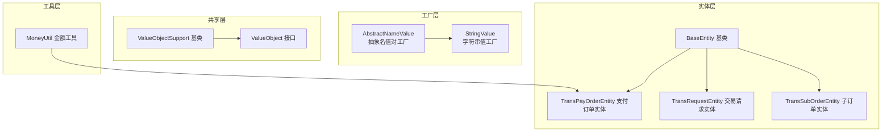
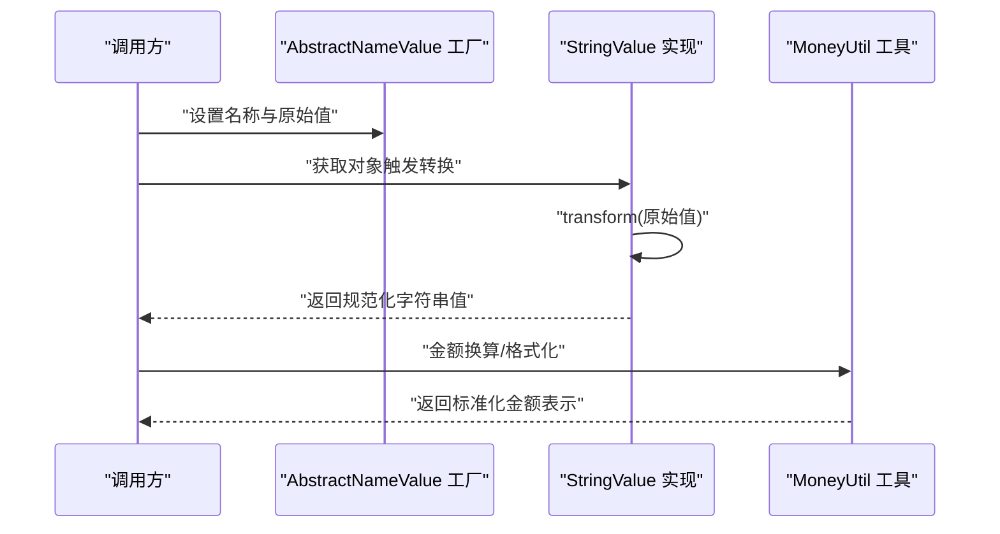
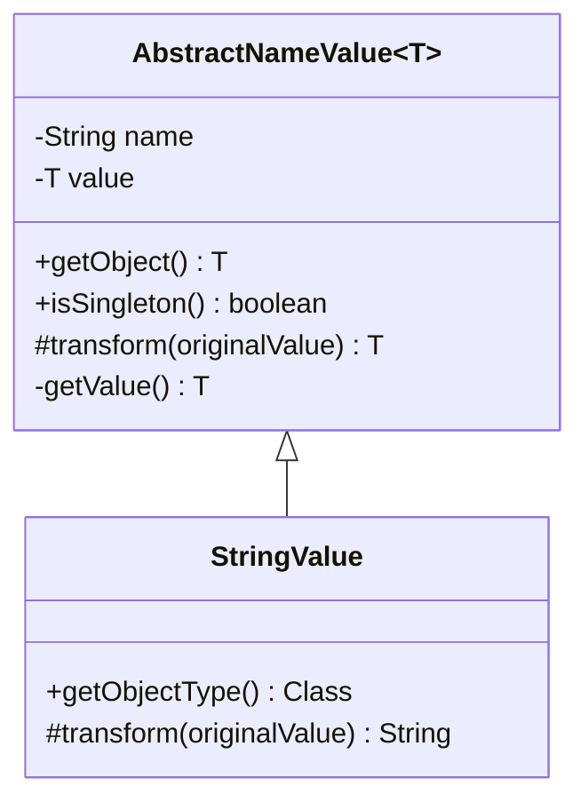
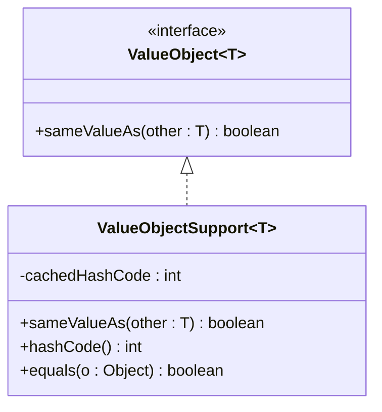
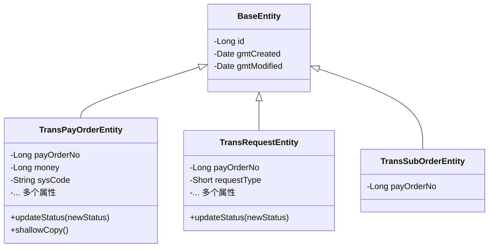
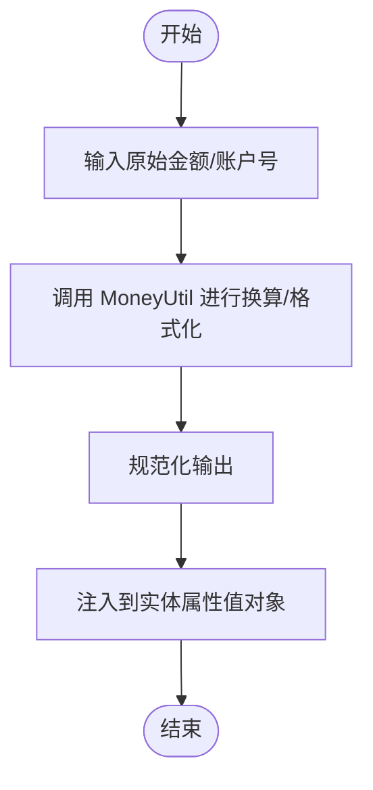
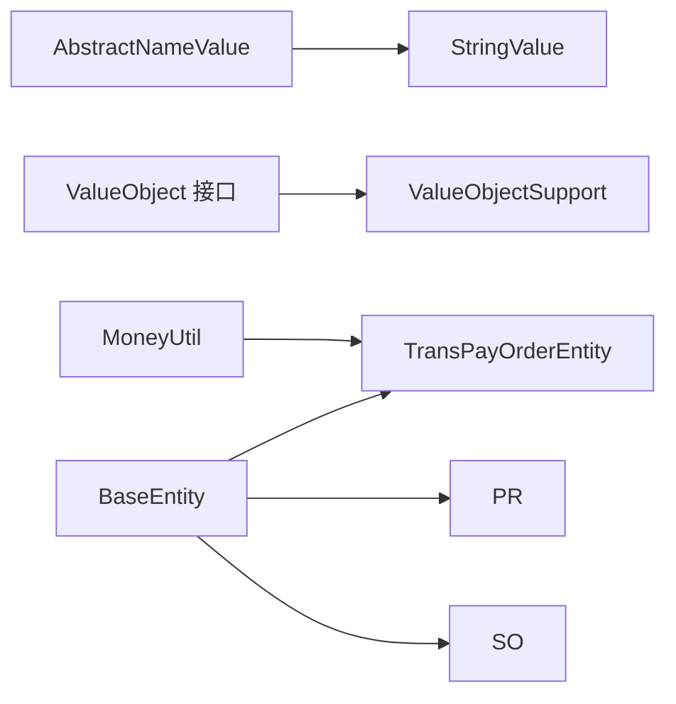

# 值对象设计

<cite>
**本文引用的文件**
- [AbstractNameValue.java](file://core-model/src/main/java/com/magicliang/transaction/sys/core/factory/AbstractNameValue.java)
- [StringValue.java](file://core-model/src/main/java/com/magicliang/transaction/sys/core/factory/StringValue.java)
- [ValueObject.java（共享接口）](file://core-model/src/main/java/com/magicliang/transaction/sys/core/shared/ValueObject.java)
- [ValueObjectSupport.java（实验基类）](file://core-model/src/main/java/com/magicliang/transaction/sys/core/shared/experimental/ValueObjectSupport.java)
- [BaseEntity.java](file://core-model/src/main/java/com/magicliang/transaction/sys/core/model/entity/BaseEntity.java)
- [TransPayOrderEntity.java](file://core-model/src/main/java/com/magicliang/transaction/sys/core/model/entity/TransPayOrderEntity.java)
- [TransRequestEntity.java](file://core-model/src/main/java/com/magicliang/transaction/sys/core/model/entity/TransRequestEntity.java)
- [TransSubOrderEntity.java](file://core-model/src/main/java/com/magicliang/transaction/sys/core/model/entity/TransSubOrderEntity.java)
- [MoneyUtil.java](file://common-util/src/main/java/com/magicliang/transaction/sys/common/util/MoneyUtil.java)
</cite>

## 目录
1. [引言](#引言)
2. [项目结构](#项目结构)
3. [核心组件](#核心组件)
4. [架构总览](#架构总览)
5. [详细组件分析](#详细组件分析)
6. [依赖分析](#依赖分析)
7. [性能考虑](#性能考虑)
8. [故障排查指南](#故障排查指南)
9. [结论](#结论)
10. [附录](#附录)

## 引言
本文件聚焦领域驱动设计交易系统中的“值对象”建模与实现，系统性梳理抽象值对象工厂、字符串值对象、值对象接口与支持基类的设计理念，并结合实体与值对象的差异，给出在业务建模中封装价格、金额、账户号等概念的实践建议。同时，通过序列图与类图展示值对象在系统中的交互与生命周期，帮助开发者正确理解并应用值对象。

## 项目结构
围绕值对象设计的相关模块分布如下：
- 工厂层：提供名称-值对的工厂 Bean，负责将原始值转换为规范化值。
- 共享层：定义值对象接口与实验性的值对象支持基类。
- 实体层：交易领域的实体类，体现实体的可变性与标识性，便于与值对象形成对比。
- 工具层：提供金额换算等通用工具，支撑业务值对象的构建与校验。

图表来源
- [AbstractNameValue.java:1-88](file://core-model/src/main/java/com/magicliang/transaction/sys/core/factory/AbstractNameValue.java#L1-L88)
- [StringValue.java:1-32](file://core-model/src/main/java/com/magicliang/transaction/sys/core/factory/StringValue.java#L1-L32)
- [ValueObject.java（共享接口）:1-19](file://core-model/src/main/java/com/magicliang/transaction/sys/core/shared/ValueObject.java#L1-L19)
- [ValueObjectSupport.java（实验基类）:1-65](file://core-model/src/main/java/com/magicliang/transaction/sys/core/shared/experimental/ValueObjectSupport.java#L1-L65)
- [BaseEntity.java:1-37](file://core-model/src/main/java/com/magicliang/transaction/sys/core/model/entity/BaseEntity.java#L1-L37)
- [TransPayOrderEntity.java:1-216](file://core-model/src/main/java/com/magicliang/transaction/sys/core/model/entity/TransPayOrderEntity.java#L1-L216)
- [TransRequestEntity.java:1-122](file://core-model/src/main/java/com/magicliang/transaction/sys/core/model/entity/TransRequestEntity.java#L1-L122)
- [TransSubOrderEntity.java:1-24](file://core-model/src/main/java/com/magicliang/transaction/sys/core/model/entity/TransSubOrderEntity.java#L1-L24)
- [MoneyUtil.java:1-153](file://common-util/src/main/java/com/magicliang/transaction/sys/common/util/MoneyUtil.java#L1-L153)

章节来源
- [AbstractNameValue.java:1-88](file://core-model/src/main/java/com/magicliang/transaction/sys/core/factory/AbstractNameValue.java#L1-L88)
- [StringValue.java:1-32](file://core-model/src/main/java/com/magicliang/transaction/sys/core/factory/StringValue.java#L1-L32)
- [ValueObject.java（共享接口）:1-19](file://core-model/src/main/java/com/magicliang/transaction/sys/core/shared/ValueObject.java#L1-L19)
- [ValueObjectSupport.java（实验基类）:1-65](file://core-model/src/main/java/com/magicliang/transaction/sys/core/shared/experimental/ValueObjectSupport.java#L1-L65)
- [BaseEntity.java:1-37](file://core-model/src/main/java/com/magicliang/transaction/sys/core/model/entity/BaseEntity.java#L1-L37)
- [TransPayOrderEntity.java:1-216](file://core-model/src/main/java/com/magicliang/transaction/sys/core/model/entity/TransPayOrderEntity.java#L1-L216)
- [TransRequestEntity.java:1-122](file://core-model/src/main/java/com/magicliang/transaction/sys/core/model/entity/TransRequestEntity.java#L1-L122)
- [TransSubOrderEntity.java:1-24](file://core-model/src/main/java/com/magicliang/transaction/sys/core/model/entity/TransSubOrderEntity.java#L1-L24)
- [MoneyUtil.java:1-153](file://common-util/src/main/java/com/magicliang/transaction/sys/common/util/MoneyUtil.java#L1-L153)

## 核心组件
- 抽象名值对工厂：提供名称-值对的封装与转换逻辑，统一产出规范化的值对象。
- 字符串值对象：针对字符串类型的值对象工厂，保证空值安全与默认值策略。
- 值对象接口：定义值对象的契约，强调按属性值比较、无标识性。
- 值对象支持基类：提供 equals/hashCode/compare 的通用实现，支持缓存哈希与反射比较。
- 实体基类与实体：体现实体的可变性与标识性，用于与值对象形成对比。
- 金额工具：提供金额换算与格式化，支撑业务值对象的构建。

章节来源
- [AbstractNameValue.java:1-88](file://core-model/src/main/java/com/magicliang/transaction/sys/core/factory/AbstractNameValue.java#L1-L88)
- [StringValue.java:1-32](file://core-model/src/main/java/com/magicliang/transaction/sys/core/factory/StringValue.java#L1-L32)
- [ValueObject.java（共享接口）:1-19](file://core-model/src/main/java/com/magicliang/transaction/sys/core/shared/ValueObject.java#L1-L19)
- [ValueObjectSupport.java（实验基类）:1-65](file://core-model/src/main/java/com/magicliang/transaction/sys/core/shared/experimental/ValueObjectSupport.java#L1-L65)
- [BaseEntity.java:1-37](file://core-model/src/main/java/com/magicliang/transaction/sys/core/model/entity/BaseEntity.java#L1-L37)
- [MoneyUtil.java:1-153](file://common-util/src/main/java/com/magicliang/transaction/sys/common/util/MoneyUtil.java#L1-L153)

## 架构总览
值对象在系统中的定位与职责：
- 工厂层负责从原始输入生成规范化值对象，确保不可变与一致性。
- 共享层提供统一的值对象契约与支持基类，降低重复实现成本。
- 实体层承载可变状态与标识，值对象作为实体的不可变属性存在。
- 工具层提供金额换算等通用能力，支撑值对象的构建与校验。

图表来源
- [AbstractNameValue.java:51-86](file://core-model/src/main/java/com/magicliang/transaction/sys/core/factory/AbstractNameValue.java#L51-L86)
- [StringValue.java:22-25](file://core-model/src/main/java/com/magicliang/transaction/sys/core/factory/StringValue.java#L22-L25)
- [MoneyUtil.java:49-54](file://common-util/src/main/java/com/magicliang/transaction/sys/common/util/MoneyUtil.java#L49-L54)

## 详细组件分析

### 抽象名值对工厂（AbstractNameValue）
- 设计要点
  - 统一管理名称与值，提供 getObject/isSingleton 等工厂 Bean 生命周期钩子。
  - 通过 transform 抽象方法实现具体类型的转换策略，getValue 决定是否使用预填充值。
- 不可变性与一致性
  - 工厂产出的值由 transform 决定，避免外部直接修改内部状态。
- 使用场景
  - 适配 Spring 容器，将规范化后的值注入到业务层或实体属性中。

图表来源
- [AbstractNameValue.java:18-87](file://core-model/src/main/java/com/magicliang/transaction/sys/core/factory/AbstractNameValue.java#L18-L87)
- [StringValue.java:14-31](file://core-model/src/main/java/com/magicliang/transaction/sys/core/factory/StringValue.java#L14-L31)

章节来源
- [AbstractNameValue.java:1-88](file://core-model/src/main/java/com/magicliang/transaction/sys/core/factory/AbstractNameValue.java#L1-L88)
- [StringValue.java:1-32](file://core-model/src/main/java/com/magicliang/transaction/sys/core/factory/StringValue.java#L1-L32)

### 字符串值对象（StringValue）
- 设计要点
  - 继承抽象工厂，实现 transform 将空白字符串归约为默认空串，确保空值安全。
  - 提供 getObjectType 指明暴露类型。
- 不可变性
  - 通过不可变的字符串与只读访问器，保障值对象的不可变性。

章节来源
- [StringValue.java:1-32](file://core-model/src/main/java/com/magicliang/transaction/sys/core/factory/StringValue.java#L1-L32)

### 值对象接口与支持基类（ValueObject 与 ValueObjectSupport）
- 设计理念
  - 值对象接口强调“按值比较、无标识性”，通过 sameValueAs 判断相等。
  - 支持基类提供 equals/hashCode 的稳定实现，利用反射比较非瞬态字段，并缓存哈希值提升性能。
- 不可变性与线程安全
  - 值对象不可变，hashCode 缓存仅计算一次，避免并发竞争导致的不一致。
- 与实体的对比
  - 实体通过标识比较，值对象通过属性值比较；实体可变，值对象不可变。

图表来源
- [ValueObject.java（共享接口）:8-18](file://core-model/src/main/java/com/magicliang/transaction/sys/core/shared/ValueObject.java#L8-L18)
- [ValueObjectSupport.java（实验基类）:11-64](file://core-model/src/main/java/com/magicliang/transaction/sys/core/shared/experimental/ValueObjectSupport.java#L11-L64)

章节来源
- [ValueObject.java（共享接口）:1-19](file://core-model/src/main/java/com/magicliang/transaction/sys/core/shared/ValueObject.java#L1-L19)
- [ValueObjectSupport.java（实验基类）:1-65](file://core-model/src/main/java/com/magicliang/transaction/sys/core/shared/experimental/ValueObjectSupport.java#L1-L65)

### 实体与值对象的差异（BaseEntity 与实体类）
- 实体特性
  - BaseEntity 提供 id、创建与更新时间等标识与生命周期字段，实体可变且通过标识比较。
- 值对象特性
  - 值对象无标识，通过属性值比较；在实体中作为不可变属性存在，如金额、账户号等。

图表来源
- [BaseEntity.java:20-36](file://core-model/src/main/java/com/magicliang/transaction/sys/core/model/entity/BaseEntity.java#L20-L36)
- [TransPayOrderEntity.java:32-215](file://core-model/src/main/java/com/magicliang/transaction/sys/core/model/entity/TransPayOrderEntity.java#L32-L215)
- [TransRequestEntity.java:22-121](file://core-model/src/main/java/com/magicliang/transaction/sys/core/model/entity/TransRequestEntity.java#L22-L121)
- [TransSubOrderEntity.java:17-23](file://core-model/src/main/java/com/magicliang/transaction/sys/core/model/entity/TransSubOrderEntity.java#L17-L23)

章节来源
- [BaseEntity.java:1-37](file://core-model/src/main/java/com/magicliang/transaction/sys/core/model/entity/BaseEntity.java#L1-L37)
- [TransPayOrderEntity.java:1-216](file://core-model/src/main/java/com/magicliang/transaction/sys/core/model/entity/TransPayOrderEntity.java#L1-L216)
- [TransRequestEntity.java:1-122](file://core-model/src/main/java/com/magicliang/transaction/sys/core/model/entity/TransRequestEntity.java#L1-L122)
- [TransSubOrderEntity.java:1-24](file://core-model/src/main/java/com/magicliang/transaction/sys/core/model/entity/TransSubOrderEntity.java#L1-L24)

### 业务建模中的值对象：价格、金额、账户号
- 金额与价格
  - 使用 MoneyUtil 进行元/分换算与格式化，确保金额在系统内以统一精度与格式存储与比较。
- 账户号
  - 通过字符串值对象工厂保证账户号的规范化与空值处理，避免脏数据进入业务流程。
- 业务概念封装
  - 将金额、账户号等业务概念封装为值对象，配合实体的标识与状态，形成清晰的领域模型。

图表来源
- [MoneyUtil.java:49-54](file://common-util/src/main/java/com/magicliang/transaction/sys/common/util/MoneyUtil.java#L49-L54)
- [MoneyUtil.java:142-151](file://common-util/src/main/java/com/magicliang/transaction/sys/common/util/MoneyUtil.java#L142-L151)

章节来源
- [MoneyUtil.java:1-153](file://common-util/src/main/java/com/magicliang/transaction/sys/common/util/MoneyUtil.java#L1-L153)

## 依赖分析
- 工厂层依赖共享层的值对象契约，确保产出符合值对象规范。
- 实体层依赖工具层的金额换算能力，保证金额字段的一致性。
- 值对象支持基类为值对象提供通用实现，减少重复代码。

图表来源
- [AbstractNameValue.java:18-31](file://core-model/src/main/java/com/magicliang/transaction/sys/core/factory/AbstractNameValue.java#L18-L31)
- [StringValue.java:14-31](file://core-model/src/main/java/com/magicliang/transaction/sys/core/factory/StringValue.java#L14-L31)
- [ValueObject.java（共享接口）:8-18](file://core-model/src/main/java/com/magicliang/transaction/sys/core/shared/ValueObject.java#L8-L18)
- [ValueObjectSupport.java（实验基类）:11-22](file://core-model/src/main/java/com/magicliang/transaction/sys/core/shared/experimental/ValueObjectSupport.java#L11-L22)
- [MoneyUtil.java:49-54](file://common-util/src/main/java/com/magicliang/transaction/sys/common/util/MoneyUtil.java#L49-L54)
- [BaseEntity.java:20-36](file://core-model/src/main/java/com/magicliang/transaction/sys/core/model/entity/BaseEntity.java#L20-L36)
- [TransPayOrderEntity.java:32-215](file://core-model/src/main/java/com/magicliang/transaction/sys/core/model/entity/TransPayOrderEntity.java#L32-L215)

章节来源
- [AbstractNameValue.java:1-88](file://core-model/src/main/java/com/magicliang/transaction/sys/core/factory/AbstractNameValue.java#L1-L88)
- [StringValue.java:1-32](file://core-model/src/main/java/com/magicliang/transaction/sys/core/factory/StringValue.java#L1-L32)
- [ValueObject.java（共享接口）:1-19](file://core-model/src/main/java/com/magicliang/transaction/sys/core/shared/ValueObject.java#L1-L19)
- [ValueObjectSupport.java（实验基类）:1-65](file://core-model/src/main/java/com/magicliang/transaction/sys/core/shared/experimental/ValueObjectSupport.java#L1-L65)
- [MoneyUtil.java:1-153](file://common-util/src/main/java/com/magicliang/transaction/sys/common/util/MoneyUtil.java#L1-L153)
- [BaseEntity.java:1-37](file://core-model/src/main/java/com/magicliang/transaction/sys/core/model/entity/BaseEntity.java#L1-L37)
- [TransPayOrderEntity.java:1-216](file://core-model/src/main/java/com/magicliang/transaction/sys/core/model/entity/TransPayOrderEntity.java#L1-L216)

## 性能考虑
- 哈希缓存：值对象支持基类对 hashCode 进行缓存，避免重复计算，提升集合操作性能。
- 反射比较：equals 使用反射比较非瞬态字段，简洁但需注意字段数量与复杂度。
- 工厂转换：字符串值对象的转换逻辑简单高效，避免不必要的空值判断开销。

## 故障排查指南
- 值对象比较异常
  - 确认是否覆盖了 equals/hashCode 或使用了支持基类；检查字段是否包含瞬态字段。
- 工厂 Bean 初始化问题
  - 确保工厂的 name/value 设置完整，getValue 逻辑是否按预期返回 transform 结果。
- 金额精度问题
  - 使用 MoneyUtil 的换算方法，确保元/分转换与格式化一致，避免精度丢失。

章节来源
- [ValueObjectSupport.java（实验基类）:28-45](file://core-model/src/main/java/com/magicliang/transaction/sys/core/shared/experimental/ValueObjectSupport.java#L28-L45)
- [AbstractNameValue.java:51-86](file://core-model/src/main/java/com/magicliang/transaction/sys/core/factory/AbstractNameValue.java#L51-L86)
- [MoneyUtil.java:49-54](file://common-util/src/main/java/com/magicliang/transaction/sys/common/util/MoneyUtil.java#L49-L54)

## 结论
值对象在领域驱动设计中承担着封装业务概念、保证数据一致性与可比较性的关键角色。通过抽象工厂、统一接口与支持基类，系统实现了对字符串、金额等业务值对象的规范化建模；而实体则承载可变状态与标识，二者协同构成清晰的领域模型。遵循不可变性与无标识性原则，有助于提升系统的可维护性与可测试性。

## 附录
- 代码片段路径参考
  - 抽象名值对工厂：[AbstractNameValue.java:51-86](file://core-model/src/main/java/com/magicliang/transaction/sys/core/factory/AbstractNameValue.java#L51-L86)
  - 字符串值对象转换：[StringValue.java:22-25](file://core-model/src/main/java/com/magicliang/transaction/sys/core/factory/StringValue.java#L22-L25)
  - 值对象接口契约：[ValueObject.java（共享接口）:8-18](file://core-model/src/main/java/com/magicliang/transaction/sys/core/shared/ValueObject.java#L8-L18)
  - 值对象支持基类实现：[ValueObjectSupport.java（实验基类）:19-62](file://core-model/src/main/java/com/magicliang/transaction/sys/core/shared/experimental/ValueObjectSupport.java#L19-L62)
  - 实体基类与实体：[BaseEntity.java:20-36](file://core-model/src/main/java/com/magicliang/transaction/sys/core/model/entity/BaseEntity.java#L20-L36)、[TransPayOrderEntity.java:32-215](file://core-model/src/main/java/com/magicliang/transaction/sys/core/model/entity/TransPayOrderEntity.java#L32-L215)、[TransRequestEntity.java:22-121](file://core-model/src/main/java/com/magicliang/transaction/sys/core/model/entity/TransRequestEntity.java#L22-L121)、[TransSubOrderEntity.java:17-23](file://core-model/src/main/java/com/magicliang/transaction/sys/core/model/entity/TransSubOrderEntity.java#L17-L23)
  - 金额换算与格式化：[MoneyUtil.java:49-54](file://common-util/src/main/java/com/magicliang/transaction/sys/common/util/MoneyUtil.java#L49-L54)、[MoneyUtil.java:142-151](file://common-util/src/main/java/com/magicliang/transaction/sys/common/util/MoneyUtil.java#L142-L151)