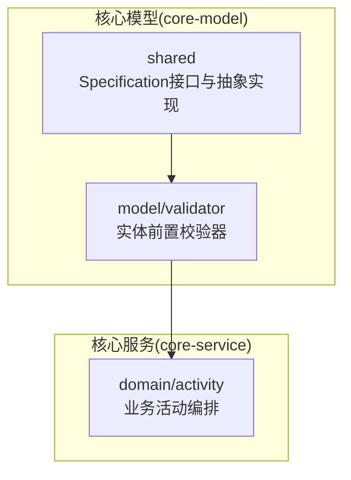
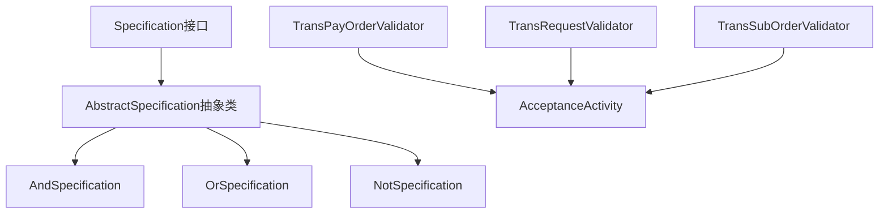
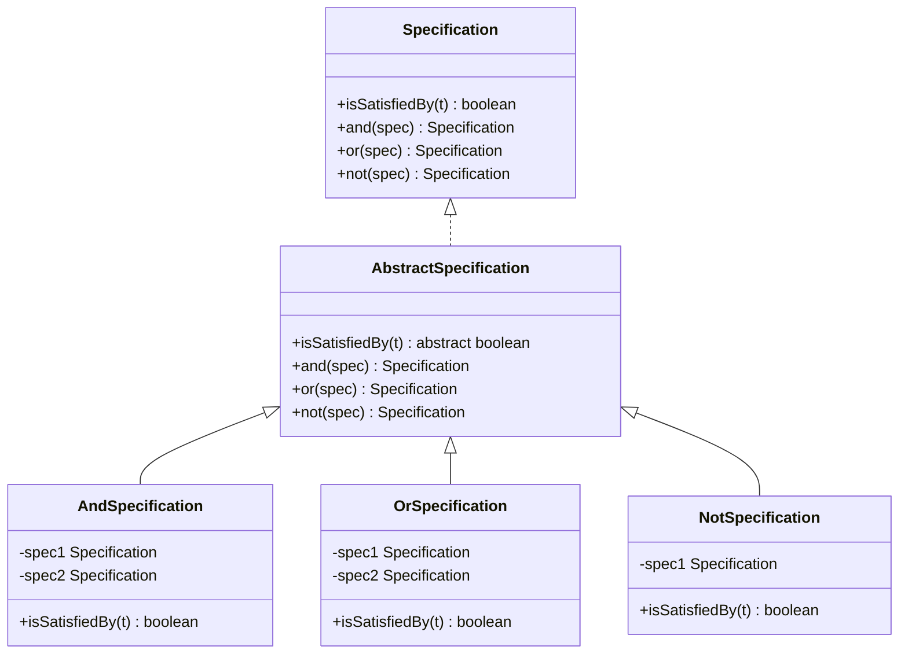
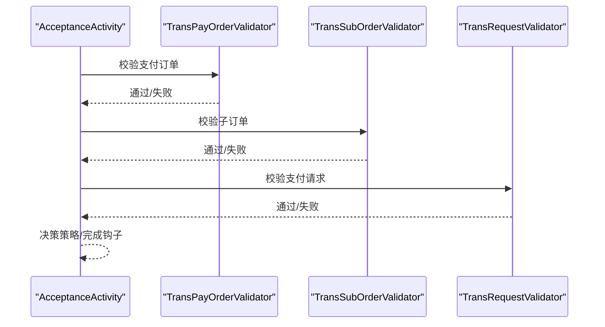
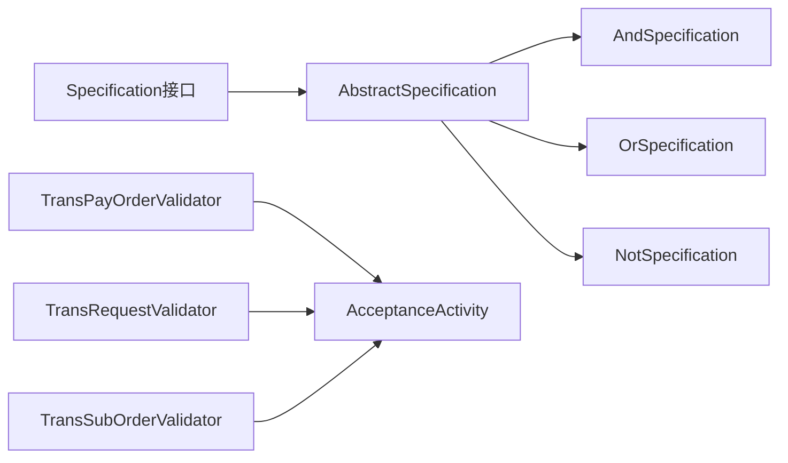

# 共享组件

<cite>
**本文引用的文件**
- [Specification.java](file://core-model/src/main/java/com/magicliang/transaction/sys/core/shared/Specification.java)
- [AbstractSpecification.java](file://core-model/src/main/java/com/magicliang/transaction/sys/core/shared/AbstractSpecification.java)
- [AndSpecification.java](file://core-model/src/main/java/com/magicliang/transaction/sys/core/shared/AndSpecification.java)
- [OrSpecification.java](file://core-model/src/main/java/com/magicliang/transaction/sys/core/shared/OrSpecification.java)
- [NotSpecification.java](file://core-model/src/main/java/com/magicliang/transaction/sys/core/shared/NotSpecification.java)
- [TransPayOrderValidator.java](file://core-model/src/main/java/com/magicliang/transaction/sys/core/model/entity/validator/TransPayOrderValidator.java)
- [TransRequestValidator.java](file://core-model/src/main/java/com/magicliang/transaction/sys/core/model/entity/validator/TransRequestValidator.java)
- [TransSubOrderValidator.java](file://core-model/src/main/java/com/magicliang/transaction/sys/core/model/entity/validator/TransSubOrderValidator.java)
- [TransPayOrderEntity.java](file://core-model/src/main/java/com/magicliang/transaction/sys/core/model/entity/TransPayOrderEntity.java)
- [AcceptanceActivity.java](file://core-service/src/main/java/com/magicliang/transaction/sys/core/domain/activity/acceptance/AcceptanceActivity.java)
</cite>

## 目录
1. [引言](#引言)
2. [项目结构](#项目结构)
3. [核心组件](#核心组件)
4. [架构总览](#架构总览)
5. [详细组件分析](#详细组件分析)
6. [依赖分析](#依赖分析)
7. [性能考虑](#性能考虑)
8. [故障排查指南](#故障排查指南)
9. [结论](#结论)
10. [附录](#附录)

## 引言
本文件聚焦于领域驱动交易系统中的共享组件，系统性解析Specification规范模式的设计与实现，涵盖接口契约、抽象基类、复合规范（与/或/非）以及在业务规则验证中的应用。我们将从代码级视角梳理isSatisfiedBy方法的语义、规范对象的可重用性与可组合性，并结合订单状态检查、支付条件验证等真实业务场景，帮助读者理解该模式在保持业务规则清晰性与可维护性方面的价值。

## 项目结构
共享的Specification模式位于核心模型模块，作为跨层复用的规则表达载体；同时，系统内广泛存在实体前置校验器，它们体现了Specification思想在业务规则落地中的实践形态。

图示来源
- [Specification.java:1-43](file://core-model/src/main/java/com/magicliang/transaction/sys/core/shared/Specification.java#L1-L43)
- [AbstractSpecification.java:1-41](file://core-model/src/main/java/com/magicliang/transaction/sys/core/shared/AbstractSpecification.java#L1-L41)
- [AndSpecification.java:1-30](file://core-model/src/main/java/com/magicliang/transaction/sys/core/shared/AndSpecification.java#L1-L30)
- [OrSpecification.java:1-30](file://core-model/src/main/java/com/magicliang/transaction/sys/core/shared/OrSpecification.java#L1-L30)
- [NotSpecification.java:1-27](file://core-model/src/main/java/com/magicliang/transaction/sys/core/shared/NotSpecification.java#L1-L27)
- [TransPayOrderValidator.java:1-53](file://core-model/src/main/java/com/magicliang/transaction/sys/core/model/entity/validator/TransPayOrderValidator.java#L1-L53)
- [TransRequestValidator.java:1-43](file://core-model/src/main/java/com/magicliang/transaction/sys/core/model/entity/validator/TransRequestValidator.java#L1-L43)
- [TransSubOrderValidator.java:1-44](file://core-model/src/main/java/com/magicliang/transaction/sys/core/model/entity/validator/TransSubOrderValidator.java#L1-L44)
- [AcceptanceActivity.java:72-92](file://core-service/src/main/java/com/magicliang/transaction/sys/core/domain/activity/acceptance/AcceptanceActivity.java#L72-L92)

章节来源
- [Specification.java:1-43](file://core-model/src/main/java/com/magicliang/transaction/sys/core/shared/Specification.java#L1-L43)
- [AbstractSpecification.java:1-41](file://core-model/src/main/java/com/magicliang/transaction/sys/core/shared/AbstractSpecification.java#L1-L41)
- [AndSpecification.java:1-30](file://core-model/src/main/java/com/magicliang/transaction/sys/core/shared/AndSpecification.java#L1-L30)
- [OrSpecification.java:1-30](file://core-model/src/main/java/com/magicliang/transaction/sys/core/shared/OrSpecification.java#L1-L30)
- [NotSpecification.java:1-27](file://core-model/src/main/java/com/magicliang/transaction/sys/core/shared/NotSpecification.java#L1-L27)
- [TransPayOrderValidator.java:1-53](file://core-model/src/main/java/com/magicliang/transaction/sys/core/model/entity/validator/TransPayOrderValidator.java#L1-L53)
- [TransRequestValidator.java:1-43](file://core-model/src/main/java/com/magicliang/transaction/sys/core/model/entity/validator/TransRequestValidator.java#L1-L43)
- [TransSubOrderValidator.java:1-44](file://core-model/src/main/java/com/magicliang/transaction/sys/core/model/entity/validator/TransSubOrderValidator.java#L1-L44)
- [AcceptanceActivity.java:72-92](file://core-service/src/main/java/com/magicliang/transaction/sys/core/domain/activity/acceptance/AcceptanceActivity.java#L72-L92)

## 核心组件
- Specification接口：定义isSatisfiedBy、and、or、not四类操作，统一规范判定与组合能力。
- AbstractSpecification抽象类：提供and/or/not的默认实现，子类仅需实现isSatisfiedBy即可参与组合。
- AndSpecification/OrSpecification/NotSpecification：三元复合规范，分别实现逻辑与/或/非。
- 实体前置校验器：在业务活动编排阶段对订单、子订单、请求等进行规则校验，体现Specification思想在工程实践中的落地。

章节来源
- [Specification.java:1-43](file://core-model/src/main/java/com/magicliang/transaction/sys/core/shared/Specification.java#L1-L43)
- [AbstractSpecification.java:1-41](file://core-model/src/main/java/com/magicliang/transaction/sys/core/shared/AbstractSpecification.java#L1-L41)
- [AndSpecification.java:1-30](file://core-model/src/main/java/com/magicliang/transaction/sys/core/shared/AndSpecification.java#L1-L30)
- [OrSpecification.java:1-30](file://core-model/src/main/java/com/magicliang/transaction/sys/core/shared/OrSpecification.java#L1-L30)
- [NotSpecification.java:1-27](file://core-model/src/main/java/com/magicliang/transaction/sys/core/shared/NotSpecification.java#L1-L27)

## 架构总览
下图展示了Specification模式在系统中的位置与交互：共享层提供规范抽象与复合实现，业务活动在执行前通过校验器组合具体规则，确保输入数据满足业务约束。

图示来源
- [Specification.java:1-43](file://core-model/src/main/java/com/magicliang/transaction/sys/core/shared/Specification.java#L1-L43)
- [AbstractSpecification.java:1-41](file://core-model/src/main/java/com/magicliang/transaction/sys/core/shared/AbstractSpecification.java#L1-L41)
- [AndSpecification.java:1-30](file://core-model/src/main/java/com/magicliang/transaction/sys/core/shared/AndSpecification.java#L1-L30)
- [OrSpecification.java:1-30](file://core-model/src/main/java/com/magicliang/transaction/sys/core/shared/OrSpecification.java#L1-L30)
- [NotSpecification.java:1-27](file://core-model/src/main/java/com/magicliang/transaction/sys/core/shared/NotSpecification.java#L1-L27)
- [TransPayOrderValidator.java:1-53](file://core-model/src/main/java/com/magicliang/transaction/sys/core/model/entity/validator/TransPayOrderValidator.java#L1-L53)
- [TransRequestValidator.java:1-43](file://core-model/src/main/java/com/magicliang/transaction/sys/core/model/entity/validator/TransRequestValidator.java#L1-L43)
- [TransSubOrderValidator.java:1-44](file://core-model/src/main/java/com/magicliang/transaction/sys/core/model/entity/validator/TransSubOrderValidator.java#L1-L44)
- [AcceptanceActivity.java:72-92](file://core-service/src/main/java/com/magicliang/transaction/sys/core/domain/activity/acceptance/AcceptanceActivity.java#L72-L92)

## 详细组件分析

### Specification接口与语义
- isSatisfiedBy：判断给定对象是否满足该规范，是规范语义的核心入口。
- and/or/not：提供规范的组合能力，形成更复杂的业务规则表达式。
- 设计要点：接口最小化，仅暴露必要方法；组合由抽象基类提供默认实现，降低重复代码。

章节来源
- [Specification.java:1-43](file://core-model/src/main/java/com/magicliang/transaction/sys/core/shared/Specification.java#L1-L43)

### AbstractSpecification抽象类
- 统一实现and/or/not，内部委托给AndSpecification/OrSpecification/NotSpecification，保证组合的一致性与可扩展性。
- 子类职责：仅实现isSatisfiedBy，遵循“开闭原则”，新增规则无需修改既有组合逻辑。

章节来源
- [AbstractSpecification.java:1-41](file://core-model/src/main/java/com/magicliang/transaction/sys/core/shared/AbstractSpecification.java#L1-L41)

### AndSpecification与OrSpecification
- AndSpecification：两个子规范均满足时整体才满足，适合“多条件同时成立”的业务规则。
- OrSpecification：任一子规范满足即整体满足，适合“多条件择一”的业务规则。
- 复杂度：均为O(1)判定，组合深度影响运行时开销，但每次判定成本稳定。

图示来源
- [Specification.java:1-43](file://core-model/src/main/java/com/magicliang/transaction/sys/core/shared/Specification.java#L1-L43)
- [AbstractSpecification.java:1-41](file://core-model/src/main/java/com/magicliang/transaction/sys/core/shared/AbstractSpecification.java#L1-L41)
- [AndSpecification.java:1-30](file://core-model/src/main/java/com/magicliang/transaction/sys/core/shared/AndSpecification.java#L1-L30)
- [OrSpecification.java:1-30](file://core-model/src/main/java/com/magicliang/transaction/sys/core/shared/OrSpecification.java#L1-L30)
- [NotSpecification.java:1-27](file://core-model/src/main/java/com/magicliang/transaction/sys/core/shared/NotSpecification.java#L1-L27)

### NotSpecification与复合规范
- NotSpecification：对子规范结果取反，适用于“排除性规则”或“禁止条件”。
- 组合优势：与And/Or配合，可表达任意布尔逻辑的业务规则集合。

章节来源
- [NotSpecification.java:1-27](file://core-model/src/main/java/com/magicliang/transaction/sys/core/shared/NotSpecification.java#L1-L27)

### 规范在业务规则验证中的应用
- 订单实体校验：在业务活动执行前，对支付订单、子订单、请求等进行字段完整性与业务有效性校验，体现“规则前置”的思想。
- 与规范的关系：校验器内部可视为一系列原子规则的集合，与Specification的组合思想一致；若引入Specification，可将校验逻辑进一步抽象为可组合的规则对象，便于复用与演进。

图示来源
- [AcceptanceActivity.java:72-92](file://core-service/src/main/java/com/magicliang/transaction/sys/core/domain/activity/acceptance/AcceptanceActivity.java#L72-L92)
- [TransPayOrderValidator.java:1-53](file://core-model/src/main/java/com/magicliang/transaction/sys/core/model/entity/validator/TransPayOrderValidator.java#L1-L53)
- [TransSubOrderValidator.java:1-44](file://core-model/src/main/java/com/magicliang/transaction/sys/core/model/entity/validator/TransSubOrderValidator.java#L1-L44)
- [TransRequestValidator.java:1-43](file://core-model/src/main/java/com/magicliang/transaction/sys/core/model/entity/validator/TransRequestValidator.java#L1-L43)

### 业务场景示例与规则封装
- 订单状态检查：可通过规范对象表达“仅允许在特定状态下执行某操作”的规则，例如“状态为初始化且金额大于0”。
- 支付条件验证：可将“回调地址非空”、“会计科目有效”、“业务标识唯一”等条件封装为独立规范，再通过and组合形成完整校验。
- 可重用性与可组合性：同一规范可在不同业务环节复用；通过组合不同规范，快速构建新的业务规则集而不改动既有实现。

章节来源
- [TransPayOrderValidator.java:1-53](file://core-model/src/main/java/com/magicliang/transaction/sys/core/model/entity/validator/TransPayOrderValidator.java#L1-L53)
- [TransRequestValidator.java:1-43](file://core-model/src/main/java/com/magicliang/transaction/sys/core/model/entity/validator/TransRequestValidator.java#L1-L43)
- [TransSubOrderValidator.java:1-44](file://core-model/src/main/java/com/magicliang/transaction/sys/core/model/entity/validator/TransSubOrderValidator.java#L1-L44)
- [TransPayOrderEntity.java:1-216](file://core-model/src/main/java/com/magicliang/transaction/sys/core/model/entity/TransPayOrderEntity.java#L1-L216)

## 依赖分析
- 组件内聚：Specification接口与抽象类高度内聚，职责单一；复合规范类仅负责组合逻辑，不包含业务规则。
- 组件耦合：业务活动依赖校验器，校验器依赖枚举与断言工具，整体呈现自上而下的依赖关系。
- 外部依赖：未见直接外部框架依赖，具备良好的可移植性与测试友好性。

图示来源
- [Specification.java:1-43](file://core-model/src/main/java/com/magicliang/transaction/sys/core/shared/Specification.java#L1-L43)
- [AbstractSpecification.java:1-41](file://core-model/src/main/java/com/magicliang/transaction/sys/core/shared/AbstractSpecification.java#L1-L41)
- [AndSpecification.java:1-30](file://core-model/src/main/java/com/magicliang/transaction/sys/core/shared/AndSpecification.java#L1-L30)
- [OrSpecification.java:1-30](file://core-model/src/main/java/com/magicliang/transaction/sys/core/shared/OrSpecification.java#L1-L30)
- [NotSpecification.java:1-27](file://core-model/src/main/java/com/magicliang/transaction/sys/core/shared/NotSpecification.java#L1-L27)
- [TransPayOrderValidator.java:1-53](file://core-model/src/main/java/com/magicliang/transaction/sys/core/model/entity/validator/TransPayOrderValidator.java#L1-L53)
- [TransRequestValidator.java:1-43](file://core-model/src/main/java/com/magicliang/transaction/sys/core/model/entity/validator/TransRequestValidator.java#L1-L43)
- [TransSubOrderValidator.java:1-44](file://core-model/src/main/java/com/magicliang/transaction/sys/core/model/entity/validator/TransSubOrderValidator.java#L1-L44)
- [AcceptanceActivity.java:72-92](file://core-service/src/main/java/com/magicliang/transaction/sys/core/domain/activity/acceptance/AcceptanceActivity.java#L72-L92)

## 性能考虑
- 判定复杂度：单次isSatisfiedBy为O(1)，组合规范的判定成本随组合深度线性增长。
- 短路求值：AndSpecification采用“与”、OrSpecification采用“或”，在满足条件时可短路，减少不必要的判定。
- 规则缓存：对于昂贵的外部查询或计算，可在规范内部缓存结果，避免重复计算。
- 组合优化：优先将稳定的、高命中率的规则放在前面，利用短路特性提升整体性能。

## 故障排查指南
- 规则误判：检查isSatisfiedBy实现是否正确，确认边界条件处理（如空值、非法枚举）。
- 组合异常：核对and/or/not组合顺序与嵌套层级，避免逻辑歧义。
- 业务活动失败：定位AcceptanceActivity中的校验步骤，逐项排查TransPayOrderValidator、TransSubOrderValidator、TransRequestValidator的报错点。
- 日志与断言：结合断言工具与日志输出，定位问题输入与触发条件。

章节来源
- [AcceptanceActivity.java:72-92](file://core-service/src/main/java/com/magicliang/transaction/sys/core/domain/activity/acceptance/AcceptanceActivity.java#L72-L92)
- [TransPayOrderValidator.java:1-53](file://core-model/src/main/java/com/magicliang/transaction/sys/core/model/entity/validator/TransPayOrderValidator.java#L1-L53)
- [TransRequestValidator.java:1-43](file://core-model/src/main/java/com/magicliang/transaction/sys/core/model/entity/validator/TransRequestValidator.java#L1-L43)
- [TransSubOrderValidator.java:1-44](file://core-model/src/main/java/com/magicliang/transaction/sys/core/model/entity/validator/TransSubOrderValidator.java#L1-L44)

## 结论
Specification模式在本项目中提供了清晰、可复用、可组合的规则表达能力。通过接口+抽象基类+复合规范的分层设计，既保证了业务规则的可读性与可维护性，又为复杂规则的演化提供了稳定基础。结合实体前置校验器的实践，可进一步将规则抽象为可组合的规范对象，从而在更大范围内实现规则的共享与复用。

## 附录
- 最佳实践建议
  - 将原子规则封装为独立规范，避免在业务活动中直接散落大量条件判断。
  - 使用and/or/not组合规则时，明确组合语义与优先级，必要时添加注释说明业务背景。
  - 对于高成本规则，考虑短路与缓存策略，平衡性能与正确性。
  - 在测试中覆盖关键组合路径，确保复杂规则在边界条件下仍能正确工作。