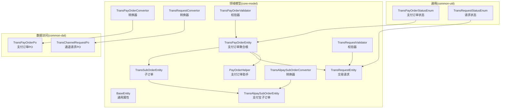
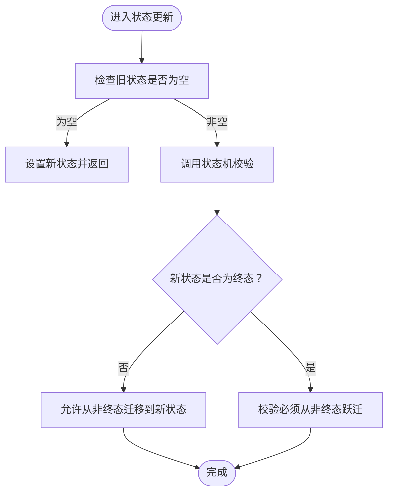
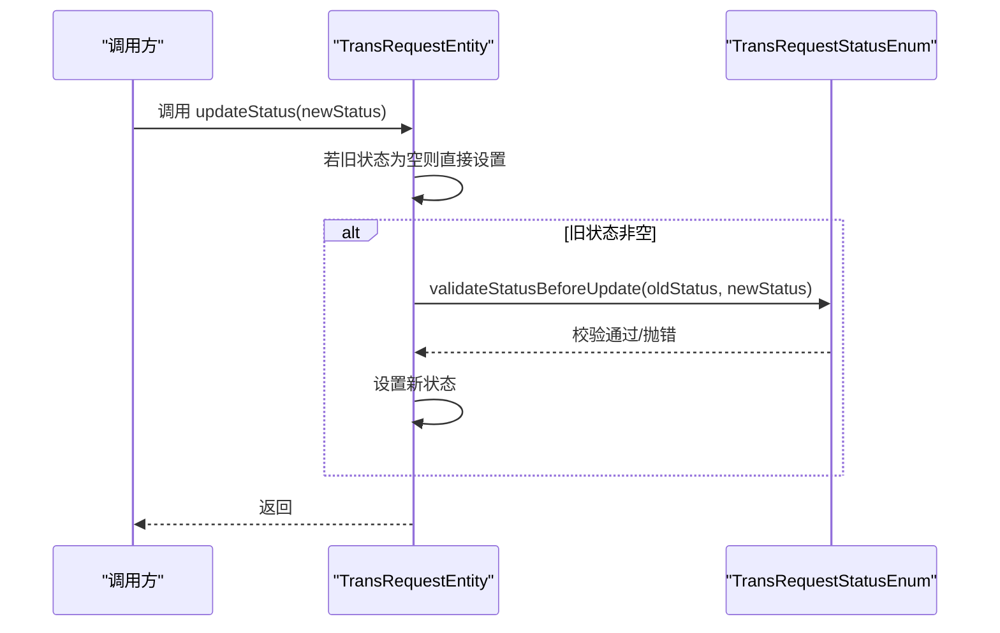
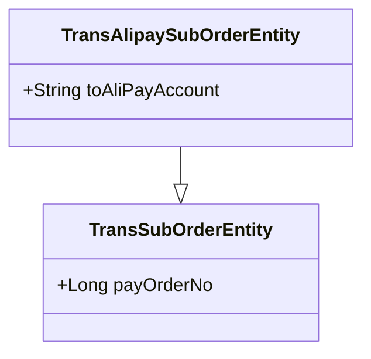
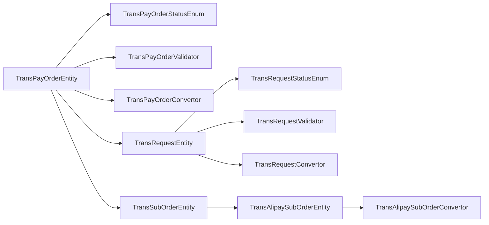

# 实体设计

<cite>
**本文引用的文件**
- [BaseEntity.java](file://core-model/src/main/java/com/magicliang/transaction/sys/core/model/entity/BaseEntity.java)
- [TransPayOrderEntity.java](file://core-model/src/main/java/com/magicliang/transaction/sys/core/model/entity/TransPayOrderEntity.java)
- [TransRequestEntity.java](file://core-model/src/main/java/com/magicliang/transaction/sys/core/model/entity/TransRequestEntity.java)
- [TransSubOrderEntity.java](file://core-model/src/main/java/com/magicliang/transaction/sys/core/model/entity/TransSubOrderEntity.java)
- [TransAlipaySubOrderEntity.java](file://core-model/src/main/java/com/magicliang/transaction/sys/core/model/entity/TransAlipaySubOrderEntity.java)
- [TransPayOrderStatusEnum.java](file://common-util/src/main/java/com/magicliang/transaction/sys/common/enums/TransPayOrderStatusEnum.java)
- [TransRequestStatusEnum.java](file://common-util/src/main/java/com/magicliang/transaction/sys/common/enums/TransRequestStatusEnum.java)
- [TransPayOrderConvertor.java](file://core-model/src/main/java/com/magicliang/transaction/sys/core/model/entity/convertor/TransPayOrderConvertor.java)
- [TransRequestConvertor.java](file://core-model/src/main/java/com/magicliang/transaction/sys/core/model/entity/convertor/TransRequestConvertor.java)
- [TransAlipaySubOrderConvertor.java](file://core-model/src/main/java/com/magicliang/transaction/sys/core/model/entity/convertor/TransAlipaySubOrderConvertor.java)
- [TransPayOrderValidator.java](file://core-model/src/main/java/com/magicliang/transaction/sys/core/model/entity/validator/TransPayOrderValidator.java)
- [TransRequestValidator.java](file://core-model/src/main/java/com/magicliang/transaction/sys/core/model/entity/validator/TransRequestValidator.java)
- [PayOrderHelper.java](file://core-model/src/main/java/com/magicliang/transaction/sys/core/model/entity/helper/PayOrderHelper.java)
- [TransPayOrderPo.java](file://common-dal/src/main/java/com/magicliang/transaction/sys/common/dal/mybatis/po/TransPayOrderPo.java)
- [TransChannelRequestPo.java](file://common-dal/src/main/java/com/magicliang/transaction/sys/common/dal/mybatis/po/TransChannelRequestPo.java)
</cite>

## 目录
1. [引言](#引言)
2. [项目结构](#项目结构)
3. [核心组件](#核心组件)
4. [架构总览](#架构总览)
5. [详细组件分析](#详细组件分析)
6. [依赖分析](#依赖分析)
7. [性能考量](#性能考量)
8. [故障排查指南](#故障排查指南)
9. [结论](#结论)
10. [附录](#附录)

## 引言
本文件面向领域驱动设计（DDD）下的交易系统，聚焦核心实体的建模设计与落地实践。重点覆盖：
- BaseEntity 基类的通用属性与设计取舍
- TransPayOrderEntity 支付订单实体的属性、业务含义与约束
- TransRequestEntity 请求实体的字段作用与状态迁移
- TransSubOrderEntity 与 TransAlipaySubOrderEntity 的区别与使用场景
- 实体间一对多、一对一关系映射与外键约束
- 状态机与校验器在实体生命周期中的协作
- 查询、创建、更新的典型流程与最佳实践

## 项目结构
围绕实体设计，相关代码分布在以下模块与包中：
- core-model：领域模型与转换器、校验器、辅助工具
- common-util：枚举、断言与通用工具
- common-dal：MyBatis PO 层，映射数据库表结构



图表来源
- [BaseEntity.java:1-37](file://core-model/src/main/java/com/magicliang/transaction/sys/core/model/entity/BaseEntity.java#L1-L37)
- [TransPayOrderEntity.java:1-216](file://core-model/src/main/java/com/magicliang/transaction/sys/core/model/entity/TransPayOrderEntity.java#L1-L216)
- [TransRequestEntity.java:1-122](file://core-model/src/main/java/com/magicliang/transaction/sys/core/model/entity/TransRequestEntity.java#L1-L122)
- [TransSubOrderEntity.java:1-24](file://core-model/src/main/java/com/magicliang/transaction/sys/core/model/entity/TransSubOrderEntity.java#L1-L24)
- [TransAlipaySubOrderEntity.java:1-24](file://core-model/src/main/java/com/magicliang/transaction/sys/core/model/entity/TransAlipaySubOrderEntity.java#L1-L24)
- [TransPayOrderConvertor.java:1-62](file://core-model/src/main/java/com/magicliang/transaction/sys/core/model/entity/convertor/TransPayOrderConvertor.java#L1-L62)
- [TransRequestConvertor.java:1-44](file://core-model/src/main/java/com/magicliang/transaction/sys/core/model/entity/convertor/TransRequestConvertor.java#L1-L44)
- [TransAlipaySubOrderConvertor.java:1-44](file://core-model/src/main/java/com/magicliang/transaction/sys/core/model/entity/convertor/TransAlipaySubOrderConvertor.java#L1-L44)
- [TransPayOrderValidator.java:1-53](file://core-model/src/main/java/com/magicliang/transaction/sys/core/model/entity/validator/TransPayOrderValidator.java#L1-L53)
- [TransRequestValidator.java:1-43](file://core-model/src/main/java/com/magicliang/transaction/sys/core/model/entity/validator/TransRequestValidator.java#L1-L43)
- [PayOrderHelper.java:1-204](file://core-model/src/main/java/com/magicliang/transaction/sys/core/model/entity/helper/PayOrderHelper.java#L1-L204)
- [TransPayOrderPo.java:1-800](file://common-dal/src/main/java/com/magicliang/transaction/sys/common/dal/mybatis/po/TransPayOrderPo.java#L1-L800)
- [TransChannelRequestPo.java:1-544](file://common-dal/src/main/java/com/magicliang/transaction/sys/common/dal/mybatis/po/TransChannelRequestPo.java#L1-L544)

章节来源
- [BaseEntity.java:1-37](file://core-model/src/main/java/com/magicliang/transaction/sys/core/model/entity/BaseEntity.java#L1-L37)
- [TransPayOrderEntity.java:1-216](file://core-model/src/main/java/com/magicliang/transaction/sys/core/model/entity/TransPayOrderEntity.java#L1-L216)
- [TransRequestEntity.java:1-122](file://core-model/src/main/java/com/magicliang/transaction/sys/core/model/entity/TransRequestEntity.java#L1-L122)
- [TransSubOrderEntity.java:1-24](file://core-model/src/main/java/com/magicliang/transaction/sys/core/model/entity/TransSubOrderEntity.java#L1-L24)
- [TransAlipaySubOrderEntity.java:1-24](file://core-model/src/main/java/com/magicliang/transaction/sys/core/model/entity/TransAlipaySubOrderEntity.java#L1-L24)
- [TransPayOrderPo.java:1-800](file://common-dal/src/main/java/com/magicliang/transaction/sys/common/dal/mybatis/po/TransPayOrderPo.java#L1-L800)
- [TransChannelRequestPo.java:1-544](file://common-dal/src/main/java/com/magicliang/transaction/sys/common/dal/mybatis/po/TransChannelRequestPo.java#L1-L544)

## 核心组件
- BaseEntity：统一承载 id、创建时间、修改时间等通用属性，确保所有实体具备一致的审计与版本控制能力。
- TransPayOrderEntity：支付订单聚合根，包含业务主键、金额、支付通道、目标账户、会计分录、状态与时间戳、扩展信息、以及与子订单、请求的组合关系。
- TransRequestEntity：交易请求实体，承载请求类型、业务标识、重试计数、地址、状态、下次执行时间、环境等字段，并提供状态更新校验。
- TransSubOrderEntity：子订单实体，承载与支付订单的关联关系。
- TransAlipaySubOrderEntity：支付宝子订单实体，继承自子订单，扩展目标支付宝账户字段。

章节来源
- [BaseEntity.java:17-36](file://core-model/src/main/java/com/magicliang/transaction/sys/core/model/entity/BaseEntity.java#L17-L36)
- [TransPayOrderEntity:27-215](file://core-model/src/main/java/com/magicliang/transaction/sys/core/model/entity/TransPayOrderEntity.java#L27-L215)
- [TransRequestEntity:20-121](file://core-model/src/main/java/com/magicliang/transaction/sys/core/model/entity/TransRequestEntity.java#L20-L121)
- [TransSubOrderEntity:15-23](file://core-model/src/main/java/com/magicliang/transaction/sys/core/model/entity/TransSubOrderEntity.java#L15-L23)
- [TransAlipaySubOrderEntity:15-23](file://core-model/src/main/java/com/magicliang/transaction/sys/core/model/entity/TransAlipaySubOrderEntity.java#L15-L23)

## 架构总览
实体层与数据访问层通过转换器解耦，PO 与 DO/Entity 之间双向映射；状态机与校验器贯穿实体生命周期，确保业务正确性与一致性。

```mermaid
classDiagram
class BaseEntity {
+Long id
+Date gmtCreated
+Date gmtModified
}
class TransPayOrderEntity {
+Long payOrderNo
+String sysCode
+String bizIdentifyNo
+String bizUniqueNo
+Long money
+Integer payChannelType
+Integer targetAccountType
+Integer accountingEntry
+Date gmtAcceptedTime
+Date gmtPaymentBeginTime
+Date gmtPaymentSuccessTime
+Date gmtPaymentFailureTime
+Date gmtPaymentClosedTime
+Date gmtPaymentBouncedTime
+Short status
+Long version
+String memo
+String channelPaymentTraceNo
+String channelDishonorTraceNo
+String channelErrorCode
+String businessEntity
+String notifyUri
+Map~String,String~ extendInfo
+Map~String,String~ bizInfo
+Short env
+TransSubOrderEntity subOrder
+TransRequestEntity paymentRequest
+TransRequestEntity[] notificationRequests
+updateStatus(newStatus)
+shallowCopy()
}
class TransRequestEntity {
+Long payOrderNo
+String bizIdentifyNo
+Short requestType
+String bizUniqueNo
+Long retryCount
+String requestAddr
+Short status
+Date gmtNextExecution
+Date gmtLastExecution
+String requestParams
+String requestResponse
+String callbackParams
+String requestException
+Integer closeReason
+Short env
+updateStatus(newStatus)
}
class TransSubOrderEntity {
+Long payOrderNo
}
class TransAlipaySubOrderEntity {
+String toAliPayAccount
}
BaseEntity <|-- TransPayOrderEntity
BaseEntity <|-- TransRequestEntity
BaseEntity <|-- TransSubOrderEntity
TransSubOrderEntity <|-- TransAlipaySubOrderEntity
TransPayOrderEntity --> TransSubOrderEntity : "1 : 1"
TransPayOrderEntity --> TransRequestEntity : "1 : 1"
TransPayOrderEntity --> TransRequestEntity : "1 : n(通知)"
```

图表来源
- [BaseEntity.java:17-36](file://core-model/src/main/java/com/magicliang/transaction/sys/core/model/entity/BaseEntity.java#L17-L36)
- [TransPayOrderEntity:27-215](file://core-model/src/main/java/com/magicliang/transaction/sys/core/model/entity/TransPayOrderEntity.java#L27-L215)
- [TransRequestEntity:20-121](file://core-model/src/main/java/com/magicliang/transaction/sys/core/model/entity/TransRequestEntity.java#L20-L121)
- [TransSubOrderEntity:15-23](file://core-model/src/main/java/com/magicliang/transaction/sys/core/model/entity/TransSubOrderEntity.java#L15-L23)
- [TransAlipaySubOrderEntity:15-23](file://core-model/src/main/java/com/magicliang/transaction/sys/core/model/entity/TransAlipaySubOrderEntity.java#L15-L23)

## 详细组件分析

### BaseEntity 基类
- 设计理念
  - 统一审计字段：id、gmtCreated、gmtModified，便于跨实体的审计与版本控制
  - 采用 Lombok 注解简化样板代码，提升可读性与维护性
- 通用属性
  - id：单表自增主键，保证单表唯一
  - gmtCreated/gmtModified：创建与最后修改时间，支撑审计与排序
- 设计考虑
  - 将审计字段下沉至基类，避免重复定义
  - 与转换器配合，PO 映射时自动填充审计字段

章节来源
- [BaseEntity.java:17-36](file://core-model/src/main/java/com/magicliang/transaction/sys/core/model/entity/BaseEntity.java#L17-L36)

### TransPayOrderEntity 支付订单实体
- 聚合根定位
  - 聚合边界内包含子订单、支付请求与通知请求集合
- 关键属性与业务含义
  - 业务主键与来源：payOrderNo、sysCode、bizIdentifyNo、bizUniqueNo
  - 金额与会计分录：money、accountingEntry
  - 支付通道与目标账户：payChannelType、targetAccountType
  - 时间戳：受理、支付开始、成功、失败、关闭、退票时间
  - 状态与版本：status、version
  - 通知与扩展：notifyUri、extendInfo、bizInfo
  - 外部流水号与错误码：channelPaymentTraceNo、channelDishonorTraceNo、channelErrorCode
  - 环境：env
- 约束与校验
  - 插入前校验：业务主键、来源系统、金额正数、会计分录、通知地址等
  - 状态迁移：遵循支付订单状态机，禁止非法跃迁
- 关系映射
  - 与 TransSubOrderEntity：1:1 关系，当前聚合仅支持单个子订单
  - 与 TransRequestEntity：1:1 支付请求；1:n 通知请求（通常1个，退票时2个）



图表来源
- [TransPayOrderEntity:197-204](file://core-model/src/main/java/com/magicliang/transaction/sys/core/model/entity/TransPayOrderEntity.java#L197-L204)
- [TransPayOrderStatusEnum.java:175-203](file://common-util/src/main/java/com/magicliang/transaction/sys/common/enums/TransPayOrderStatusEnum.java#L175-L203)

章节来源
- [TransPayOrderEntity:27-215](file://core-model/src/main/java/com/magicliang/transaction/sys/core/model/entity/TransPayOrderEntity.java#L27-L215)
- [TransPayOrderValidator.java:33-51](file://core-model/src/main/java/com/magicliang/transaction/sys/core/model/entity/validator/TransPayOrderValidator.java#L33-L51)
- [TransPayOrderStatusEnum.java:26-62](file://common-util/src/main/java/com/magicliang/transaction/sys/common/enums/TransPayOrderStatusEnum.java#L26-L62)

### TransRequestEntity 请求实体
- 字段作用
  - 关联字段：payOrderNo、bizIdentifyNo、bizUniqueNo
  - 类型与重试：requestType、retryCount
  - 地址与时间：requestAddr、gmtNextExecution、gmtLastExecution
  - 状态与关闭原因：status、closeReason
  - 参数与异常：requestParams、requestResponse、callbackParams、requestException
  - 环境：env
- 状态迁移
  - 严格遵循请求状态机，禁止非法跃迁
  - 提供 updateStatus 方法，封装状态校验



图表来源
- [TransRequestEntity:113-120](file://core-model/src/main/java/com/magicliang/transaction/sys/core/model/entity/TransRequestEntity.java#L113-L120)
- [TransRequestStatusEnum.java:137-161](file://common-util/src/main/java/com/magicliang/transaction/sys/common/enums/TransRequestStatusEnum.java#L137-L161)

章节来源
- [TransRequestEntity:20-121](file://core-model/src/main/java/com/magicliang/transaction/sys/core/model/entity/TransRequestEntity.java#L20-L121)
- [TransRequestValidator.java:32-41](file://core-model/src/main/java/com/magicliang/transaction/sys/core/model/entity/validator/TransRequestValidator.java#L32-L41)
- [TransRequestStatusEnum.java:27-55](file://common-util/src/main/java/com/magicliang/transaction/sys/common/enums/TransRequestStatusEnum.java#L27-L55)

### TransSubOrderEntity 与 TransAlipaySubOrderEntity
- 区别与继承关系
  - TransSubOrderEntity：抽象子订单，承载与支付订单的关联
  - TransAlipaySubOrderEntity：继承子订单，扩展 toAliPayAccount 字段，用于支付宝场景
- 使用场景
  - 当支付通道为支付宝时，使用 TransAlipaySubOrderEntity 并填充目标账户
  - 其他通道可沿用 TransSubOrderEntity 或按需扩展



图表来源
- [TransSubOrderEntity.java:15-23](file://core-model/src/main/java/com/magicliang/transaction/sys/core/model/entity/TransSubOrderEntity.java#L15-L23)
- [TransAlipaySubOrderEntity.java:15-23](file://core-model/src/main/java/com/magicliang/transaction/sys/core/model/entity/TransAlipaySubOrderEntity.java#L15-L23)

章节来源
- [TransSubOrderEntity.java:15-23](file://core-model/src/main/java/com/magicliang/transaction/sys/core/model/entity/TransSubOrderEntity.java#L15-L23)
- [TransAlipaySubOrderEntity.java:15-23](file://core-model/src/main/java/com/magicliang/transaction/sys/core/model/entity/TransAlipaySubOrderEntity.java#L15-L23)

### 实体关系映射与外键约束
- 关系映射
  - TransPayOrderEntity 与 TransSubOrderEntity：1:1，外键指向支付订单业务主键
  - TransPayOrderEntity 与 TransRequestEntity（支付请求）：1:1
  - TransPayOrderEntity 与 TransRequestEntity（通知请求）：1:n
- 数据库映射
  - 支付订单 PO：包含所有业务字段与审计字段
  - 通道请求 PO：包含请求相关字段与审计字段
- 级联与约束
  - 通过 payOrderNo 建立外键关联
  - 通知请求集合在内存聚合中管理，持久化时按请求类型拆分存储

章节来源
- [TransPayOrderPo.java:11-800](file://common-dal/src/main/java/com/magicliang/transaction/sys/common/dal/mybatis/po/TransPayOrderPo.java#L11-L800)
- [TransChannelRequestPo.java:11-544](file://common-dal/src/main/java/com/magicliang/transaction/sys/common/dal/mybatis/po/TransChannelRequestPo.java#L11-L544)

### 转换器与持久化映射
- 转换器职责
  - TransPayOrderConvertor：支付订单与 PO 的双向转换，支持包含子订单的复合转换
  - TransRequestConvertor：请求实体与 PO 的双向转换
  - TransAlipaySubOrderConvertor：支付宝子订单的 PO/DO 转换
- 映射策略
  - 字段名与类型尽量一一对应，必要时通过转换器处理枚举与复杂类型
  - 使用 BLOB 字段存储请求参数与响应（如 PO 中的 BLOBs 变体）

章节来源
- [TransPayOrderConvertor.java:33-59](file://core-model/src/main/java/com/magicliang/transaction/sys/core/model/entity/convertor/TransPayOrderConvertor.java#L33-L59)
- [TransRequestConvertor.java:30-42](file://core-model/src/main/java/com/magicliang/transaction/sys/core/model/entity/convertor/TransRequestConvertor.java#L30-L42)
- [TransAlipaySubOrderConvertor.java:30-42](file://core-model/src/main/java/com/magicliang/transaction/sys/core/model/entity/convertor/TransAlipaySubOrderConvertor.java#L30-L42)

### 状态机与校验器协作
- 状态机
  - 支付订单状态机：INIT → PENDING → SUCCESS/FAILED/CLOSED/BOUNCED（终态）
  - 请求状态机：INIT → PENDING/FAILED → SUCCESS/CLOSED（终态）
- 校验器
  - 插入前校验：确保关键字段非空、金额合法、通知地址有效等
  - 状态迁移校验：禁止非法跃迁，保障业务一致性

章节来源
- [TransPayOrderStatusEnum.java:175-203](file://common-util/src/main/java/com/magicliang/transaction/sys/common/enums/TransPayOrderStatusEnum.java#L175-L203)
- [TransRequestStatusEnum.java:137-161](file://common-util/src/main/java/com/magicliang/transaction/sys/common/enums/TransRequestStatusEnum.java#L137-L161)
- [TransPayOrderValidator.java:33-51](file://core-model/src/main/java/com/magicliang/transaction/sys/core/model/entity/validator/TransPayOrderValidator.java#L33-L51)
- [TransRequestValidator.java:32-41](file://core-model/src/main/java/com/magicliang/transaction/sys/core/model/entity/validator/TransRequestValidator.java#L32-L41)

## 依赖分析
- 内聚性
  - 实体与其状态机、校验器、转换器紧密内聚，职责清晰
- 耦合度
  - 通过转换器与 PO 解耦，降低领域模型对数据访问细节的感知
- 外部依赖
  - 枚举与断言工具来自 common-util
  - PO 来自 common-dal



图表来源
- [TransPayOrderEntity.java:27-215](file://core-model/src/main/java/com/magicliang/transaction/sys/core/model/entity/TransPayOrderEntity.java#L27-L215)
- [TransRequestEntity.java:20-121](file://core-model/src/main/java/com/magicliang/transaction/sys/core/model/entity/TransRequestEntity.java#L20-L121)
- [TransPayOrderStatusEnum.java:26-62](file://common-util/src/main/java/com/magicliang/transaction/sys/common/enums/TransPayOrderStatusEnum.java#L26-L62)
- [TransRequestStatusEnum.java:27-55](file://common-util/src/main/java/com/magicliang/transaction/sys/common/enums/TransRequestStatusEnum.java#L27-L55)
- [TransPayOrderValidator.java:33-51](file://core-model/src/main/java/com/magicliang/transaction/sys/core/model/entity/validator/TransPayOrderValidator.java#L33-L51)
- [TransRequestValidator.java:32-41](file://core-model/src/main/java/com/magicliang/transaction/sys/core/model/entity/validator/TransRequestValidator.java#L32-L41)
- [TransPayOrderConvertor.java:33-59](file://core-model/src/main/java/com/magicliang/transaction/sys/core/model/entity/convertor/TransPayOrderConvertor.java#L33-L59)
- [TransRequestConvertor.java:30-42](file://core-model/src/main/java/com/magicliang/transaction/sys/core/model/entity/convertor/TransRequestConvertor.java#L30-L42)
- [TransAlipaySubOrderConvertor.java:30-42](file://core-model/src/main/java/com/magicliang/transaction/sys/core/model/entity/convertor/TransAlipaySubOrderConvertor.java#L30-L42)

## 性能考量
- 状态机校验与断言开销可控，建议在关键路径前置校验，减少无效状态迁移
- 转换器应避免不必要的深拷贝，优先使用浅拷贝与增量更新
- 版本号递增与审计时间更新属于轻量操作，建议批量提交以降低数据库往返
- 通知请求集合在内存中过滤与构建，注意集合规模，必要时分页或延迟加载

## 故障排查指南
- 状态迁移异常
  - 检查旧状态与新状态是否满足状态机约束
  - 参考状态枚举的校验逻辑，定位非法跃迁点
- 插入失败
  - 核对必填字段与格式（金额、通知地址、业务标识等）
  - 关注校验器抛出的具体错误码与提示
- 版本冲突
  - PayOrderHelper.updatePayOrder 会递增版本号，若并发更新导致冲突，需重试或采用乐观锁策略

章节来源
- [TransPayOrderStatusEnum.java:175-203](file://common-util/src/main/java/com/magicliang/transaction/sys/common/enums/TransPayOrderStatusEnum.java#L175-L203)
- [TransRequestStatusEnum.java:137-161](file://common-util/src/main/java/com/magicliang/transaction/sys/common/enums/TransRequestStatusEnum.java#L137-L161)
- [TransPayOrderValidator.java:33-51](file://core-model/src/main/java/com/magicliang/transaction/sys/core/model/entity/validator/TransPayOrderValidator.java#L33-L51)
- [TransRequestValidator.java:32-41](file://core-model/src/main/java/com/magicliang/transaction/sys/core/model/entity/validator/TransRequestValidator.java#L32-L41)
- [PayOrderHelper.java:84-90](file://core-model/src/main/java/com/magicliang/transaction/sys/core/model/entity/helper/PayOrderHelper.java#L84-L90)

## 结论
该实体设计以 BaseEntity 为基础，结合状态机与校验器，实现了支付订单聚合根的强一致性与可演进性。通过转换器与 PO 的解耦映射，既满足了 DDD 的领域纯净性，又兼顾了持久化效率。建议在实际开发中：
- 严格遵循状态机与校验器约束
- 合理使用 PayOrderHelper 进行状态更新与通知请求构建
- 在高并发场景下关注版本号与重试策略

## 附录
- 代码示例路径（不展示具体代码内容）
  - 创建支付订单：参考 [TransPayOrderValidator.validateBeforeInsert:33-51](file://core-model/src/main/java/com/magicliang/transaction/sys/core/model/entity/validator/TransPayOrderValidator.java#L33-L51)
  - 更新支付订单状态：参考 [TransPayOrderEntity.updateStatus:197-204](file://core-model/src/main/java/com/magicliang/transaction/sys/core/model/entity/TransPayOrderEntity.java#L197-L204)
  - 构建通知请求：参考 [PayOrderHelper.buildInitialNotificationRequest:164-181](file://core-model/src/main/java/com/magicliang/transaction/sys/core/model/entity/helper/PayOrderHelper.java#L164-L181)
  - 转换为持久化对象：参考 [TransPayOrderConvertor.toPo:33-35](file://core-model/src/main/java/com/magicliang/transaction/sys/core/model/entity/convertor/TransPayOrderConvertor.java#L33-L35)
  - 查询与映射：参考 [TransPayOrderPo 字段定义:11-800](file://common-dal/src/main/java/com/magicliang/transaction/sys/common/dal/mybatis/po/TransPayOrderPo.java#L11-L800)