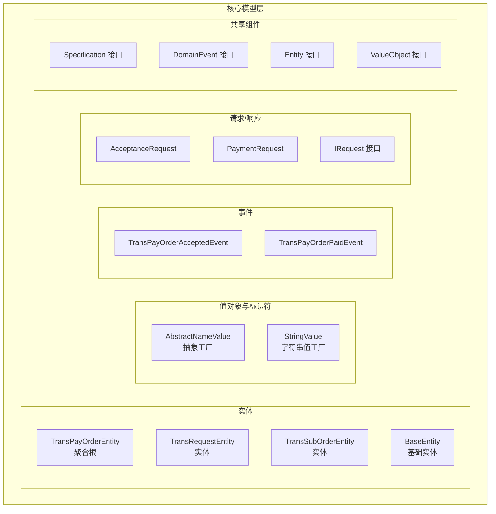
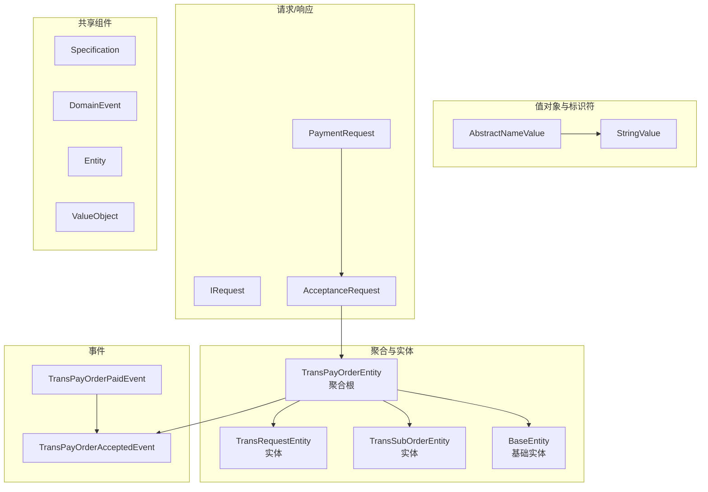
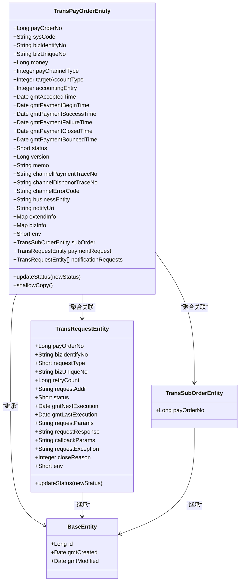
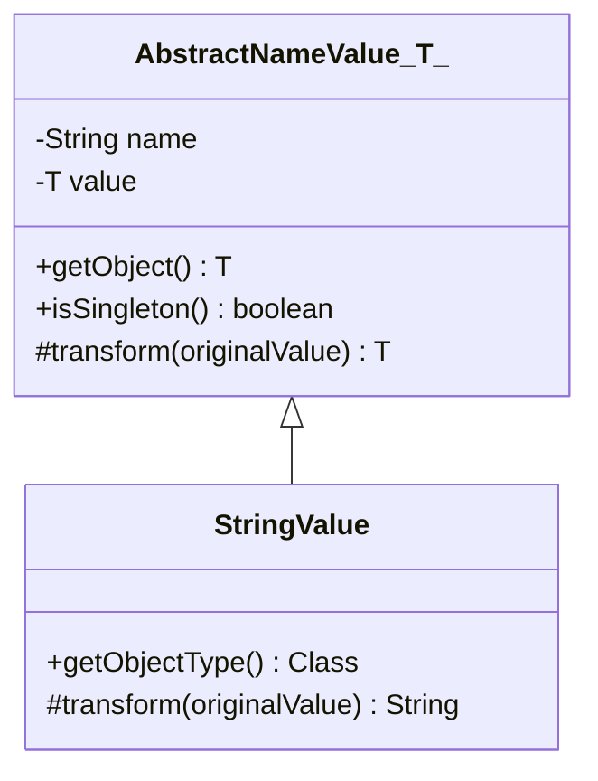
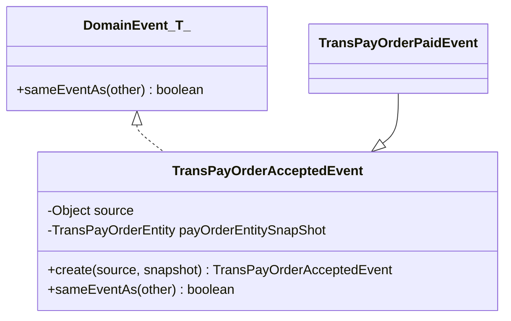
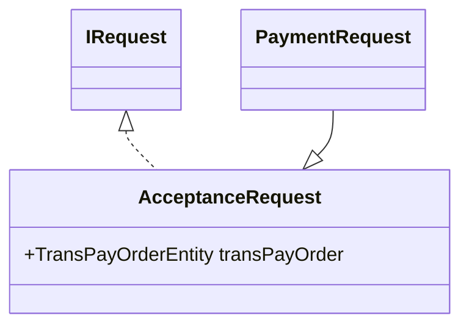
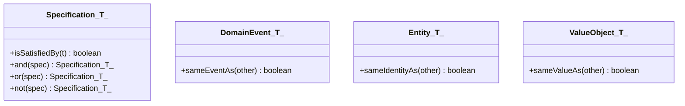
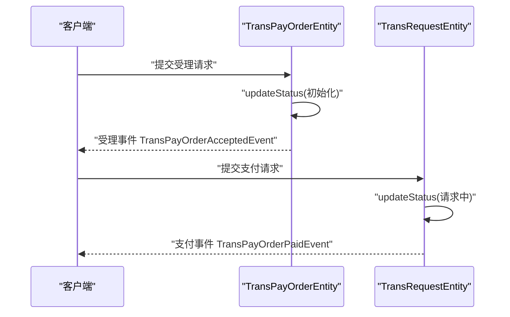
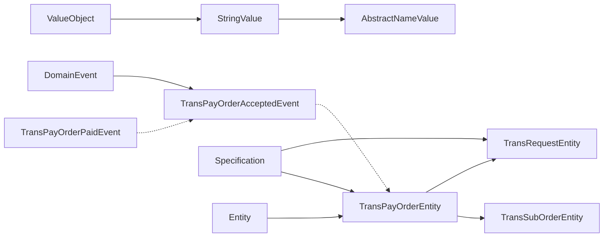

# 核心模型层

<cite>
**本文引用的文件**
- [TransPayOrderEntity.java](file://core-model/src/main/java/com/magicliang/transaction/sys/core/model/entity/TransPayOrderEntity.java)
- [TransRequestEntity.java](file://core-model/src/main/java/com/magicliang/transaction/sys/core/model/entity/TransRequestEntity.java)
- [TransSubOrderEntity.java](file://core-model/src/main/java/com/magicliang/transaction/sys/core/model/entity/TransSubOrderEntity.java)
- [BaseEntity.java](file://core-model/src/main/java/com/magicliang/transaction/sys/core/model/entity/BaseEntity.java)
- [AbstractNameValue.java](file://core-model/src/main/java/com/magicliang/transaction/sys/core/factory/AbstractNameValue.java)
- [StringValue.java](file://core-model/src/main/java/com/magicliang/transaction/sys/core/factory/StringValue.java)
- [TransPayOrderAcceptedEvent.java](file://core-model/src/main/java/com/magicliang/transaction/sys/core/model/event/TransPayOrderAcceptedEvent.java)
- [TransPayOrderPaidEvent.java](file://core-model/src/main/java/com/magicliang/transaction/sys/core/model/event/TransPayOrderPaidEvent.java)
- [AcceptanceRequest.java](file://core-model/src/main/java/com/magicliang/transaction/sys/core/model/request/acceptance/AcceptanceRequest.java)
- [PaymentRequest.java](file://core-model/src/main/java/com/magicliang/transaction/sys/core/model/request/payment/PaymentRequest.java)
- [IRequest.java](file://core-model/src/main/java/com/magicliang/transaction/sys/core/model/request/IRequest.java)
- [Specification.java](file://core-model/src/main/java/com/magicliang/transaction/sys/core/shared/Specification.java)
- [DomainEvent.java](file://core-model/src/main/java/com/magicliang/transaction/sys/core/shared/DomainEvent.java)
- [Entity.java](file://core-model/src/main/java/com/magicliang/transaction/sys/core/shared/Entity.java)
- [ValueObject.java](file://core-model/src/main/java/com/magicliang/transaction/sys/core/shared/ValueObject.java)
</cite>

## 目录
1. [引言](#引言)
2. [项目结构](#项目结构)
3. [核心组件](#核心组件)
4. [架构总览](#架构总览)
5. [详细组件分析](#详细组件分析)
6. [依赖分析](#依赖分析)
7. [性能考虑](#性能考虑)
8. [故障排查指南](#故障排查指南)
9. [结论](#结论)
10. [附录](#附录)

## 引言
本文件聚焦于领域驱动交易系统的核心模型层，系统化梳理实体模型（聚合与聚合根）、值对象与标识符工厂、领域事件、请求响应模型以及共享组件（Specification 规范模式、DomainEvent 等）的设计与实现。通过图示与路径引用的方式，帮助开发者快速理解并应用 DDD 领域建模最佳实践。

## 项目结构
核心模型层位于 core-model 模块，采用按“领域模型”组织的目录结构：实体、事件、请求/响应、共享基础设施（Specification、DomainEvent 等）。该结构清晰地体现了“以模型为中心”的设计思想，便于在复杂业务场景下保持高内聚、低耦合。

**图表来源**
- [TransPayOrderEntity.java:1-216](file://core-model/src/main/java/com/magicliang/transaction/sys/core/model/entity/TransPayOrderEntity.java#L1-L216)
- [TransRequestEntity.java:1-122](file://core-model/src/main/java/com/magicliang/transaction/sys/core/model/entity/TransRequestEntity.java#L1-L122)
- [TransSubOrderEntity.java:1-24](file://core-model/src/main/java/com/magicliang/transaction/sys/core/model/entity/TransSubOrderEntity.java#L1-L24)
- [BaseEntity.java:1-37](file://core-model/src/main/java/com/magicliang/transaction/sys/core/model/entity/BaseEntity.java#L1-L37)
- [AbstractNameValue.java:1-88](file://core-model/src/main/java/com/magicliang/transaction/sys/core/factory/AbstractNameValue.java#L1-L88)
- [StringValue.java:1-32](file://core-model/src/main/java/com/magicliang/transaction/sys/core/factory/StringValue.java#L1-L32)
- [TransPayOrderAcceptedEvent.java:1-54](file://core-model/src/main/java/com/magicliang/transaction/sys/core/model/event/TransPayOrderAcceptedEvent.java#L1-L54)
- [TransPayOrderPaidEvent.java:1-20](file://core-model/src/main/java/com/magicliang/transaction/sys/core/model/event/TransPayOrderPaidEvent.java#L1-L20)
- [AcceptanceRequest.java:1-24](file://core-model/src/main/java/com/magicliang/transaction/sys/core/model/request/acceptance/AcceptanceRequest.java#L1-L24)
- [PaymentRequest.java:1-20](file://core-model/src/main/java/com/magicliang/transaction/sys/core/model/request/payment/PaymentRequest.java#L1-L20)
- [IRequest.java:1-15](file://core-model/src/main/java/com/magicliang/transaction/sys/core/model/request/IRequest.java#L1-L15)
- [Specification.java:1-43](file://core-model/src/main/java/com/magicliang/transaction/sys/core/shared/Specification.java#L1-L43)
- [DomainEvent.java:1-18](file://core-model/src/main/java/com/magicliang/transaction/sys/core/shared/DomainEvent.java#L1-L18)
- [Entity.java:1-17](file://core-model/src/main/java/com/magicliang/transaction/sys/core/shared/Entity.java#L1-L17)
- [ValueObject.java:1-19](file://core-model/src/main/java/com/magicliang/transaction/sys/core/shared/ValueObject.java#L1-L19)

**章节来源**
- [TransPayOrderEntity.java:1-216](file://core-model/src/main/java/com/magicliang/transaction/sys/core/model/entity/TransPayOrderEntity.java#L1-L216)
- [TransRequestEntity.java:1-122](file://core-model/src/main/java/com/magicliang/transaction/sys/core/model/entity/TransRequestEntity.java#L1-L122)
- [TransSubOrderEntity.java:1-24](file://core-model/src/main/java/com/magicliang/transaction/sys/core/model/entity/TransSubOrderEntity.java#L1-L24)
- [BaseEntity.java:1-37](file://core-model/src/main/java/com/magicliang/transaction/sys/core/model/entity/BaseEntity.java#L1-L37)
- [AbstractNameValue.java:1-88](file://core-model/src/main/java/com/magicliang/transaction/sys/core/factory/AbstractNameValue.java#L1-L88)
- [StringValue.java:1-32](file://core-model/src/main/java/com/magicliang/transaction/sys/core/factory/StringValue.java#L1-L32)
- [TransPayOrderAcceptedEvent.java:1-54](file://core-model/src/main/java/com/magicliang/transaction/sys/core/model/event/TransPayOrderAcceptedEvent.java#L1-L54)
- [TransPayOrderPaidEvent.java:1-20](file://core-model/src/main/java/com/magicliang/transaction/sys/core/model/event/TransPayOrderPaidEvent.java#L1-L20)
- [AcceptanceRequest.java:1-24](file://core-model/src/main/java/com/magicliang/transaction/sys/core/model/request/acceptance/AcceptanceRequest.java#L1-L24)
- [PaymentRequest.java:1-20](file://core-model/src/main/java/com/magicliang/transaction/sys/core/model/request/payment/PaymentRequest.java#L1-L20)
- [IRequest.java:1-15](file://core-model/src/main/java/com/magicliang/transaction/sys/core/model/request/IRequest.java#L1-L15)
- [Specification.java:1-43](file://core-model/src/main/java/com/magicliang/transaction/sys/core/shared/Specification.java#L1-L43)
- [DomainEvent.java:1-18](file://core-model/src/main/java/com/magicliang/transaction/sys/core/shared/DomainEvent.java#L1-L18)
- [Entity.java:1-17](file://core-model/src/main/java/com/magicliang/transaction/sys/core/shared/Entity.java#L1-L17)
- [ValueObject.java:1-19](file://core-model/src/main/java/com/magicliang/transaction/sys/core/shared/ValueObject.java#L1-L19)

## 核心组件
- 聚合根与实体
  - TransPayOrderEntity：支付订单聚合根，承载支付生命周期状态、时间戳、渠道与账户信息、扩展字段以及聚合内关联对象（子订单、支付请求、通知请求列表）。
  - TransRequestEntity：交易请求实体，描述一次上游请求的重试次数、状态、下次执行时间、参数与响应等。
  - TransSubOrderEntity：交易子订单实体，当前版本仅包含与主订单的关联字段。
  - BaseEntity：所有实体的基础类，统一提供 id、创建与更新时间等元数据。
- 值对象与标识符工厂
  - AbstractNameValue<T>：抽象工厂 Bean，负责将注入的原始值转换为最终暴露的对象实例，并保证单例语义。
  - StringValue：针对字符串的值工厂，提供空值安全的默认处理。
- 领域事件
  - TransPayOrderAcceptedEvent：支付订单被受理事件，携带订单快照，支持事件去重比较。
  - TransPayOrderPaidEvent：继承受理事件，表达“已支付”这一具体事件。
- 请求/响应模型
  - AcceptanceRequest：受理请求，封装 TransPayOrderEntity。
  - PaymentRequest：支付请求，继承受理请求，扩展支付相关上下文。
  - IRequest：请求接口，约束所有领域活动请求的最小契约。
- 共享组件
  - Specification：Specification 规范模式接口，提供 and/or/not 组合能力。
  - DomainEvent：领域事件接口，提供 sameEventAs 比较能力。
  - Entity：实体接口，sameIdentityAs 用于身份比较。
  - ValueObject：值对象接口，sameValueAs 用于值相等比较。

**章节来源**
- [TransPayOrderEntity.java:1-216](file://core-model/src/main/java/com/magicliang/transaction/sys/core/model/entity/TransPayOrderEntity.java#L1-L216)
- [TransRequestEntity.java:1-122](file://core-model/src/main/java/com/magicliang/transaction/sys/core/model/entity/TransRequestEntity.java#L1-L122)
- [TransSubOrderEntity.java:1-24](file://core-model/src/main/java/com/magicliang/transaction/sys/core/model/entity/TransSubOrderEntity.java#L1-L24)
- [BaseEntity.java:1-37](file://core-model/src/main/java/com/magicliang/transaction/sys/core/model/entity/BaseEntity.java#L1-L37)
- [AbstractNameValue.java:1-88](file://core-model/src/main/java/com/magicliang/transaction/sys/core/factory/AbstractNameValue.java#L1-L88)
- [StringValue.java:1-32](file://core-model/src/main/java/com/magicliang/transaction/sys/core/factory/StringValue.java#L1-L32)
- [TransPayOrderAcceptedEvent.java:1-54](file://core-model/src/main/java/com/magicliang/transaction/sys/core/model/event/TransPayOrderAcceptedEvent.java#L1-L54)
- [TransPayOrderPaidEvent.java:1-20](file://core-model/src/main/java/com/magicliang/transaction/sys/core/model/event/TransPayOrderPaidEvent.java#L1-L20)
- [AcceptanceRequest.java:1-24](file://core-model/src/main/java/com/magicliang/transaction/sys/core/model/request/acceptance/AcceptanceRequest.java#L1-L24)
- [PaymentRequest.java:1-20](file://core-model/src/main/java/com/magicliang/transaction/sys/core/model/request/payment/PaymentRequest.java#L1-L20)
- [IRequest.java:1-15](file://core-model/src/main/java/com/magicliang/transaction/sys/core/model/request/IRequest.java#L1-L15)
- [Specification.java:1-43](file://core-model/src/main/java/com/magicliang/transaction/sys/core/shared/Specification.java#L1-L43)
- [DomainEvent.java:1-18](file://core-model/src/main/java/com/magicliang/transaction/sys/core/shared/DomainEvent.java#L1-L18)
- [Entity.java:1-17](file://core-model/src/main/java/com/magicliang/transaction/sys/core/shared/Entity.java#L1-L17)
- [ValueObject.java:1-19](file://core-model/src/main/java/com/magicliang/transaction/sys/core/shared/ValueObject.java#L1-L19)

## 架构总览
核心模型层围绕“聚合根-实体-值对象-事件-请求/响应-共享组件”构建，形成清晰的领域边界与职责划分。聚合根 TransPayOrderEntity 通过组合子订单与请求对象表达业务聚合；事件用于跨限界上下文的解耦通知；请求/响应模型将策略与上下文解耦；共享组件提供规范与断言能力。

**图表来源**
- [TransPayOrderEntity.java:1-216](file://core-model/src/main/java/com/magicliang/transaction/sys/core/model/entity/TransPayOrderEntity.java#L1-L216)
- [TransRequestEntity.java:1-122](file://core-model/src/main/java/com/magicliang/transaction/sys/core/model/entity/TransRequestEntity.java#L1-L122)
- [TransSubOrderEntity.java:1-24](file://core-model/src/main/java/com/magicliang/transaction/sys/core/model/entity/TransSubOrderEntity.java#L1-L24)
- [BaseEntity.java:1-37](file://core-model/src/main/java/com/magicliang/transaction/sys/core/model/entity/BaseEntity.java#L1-L37)
- [AbstractNameValue.java:1-88](file://core-model/src/main/java/com/magicliang/transaction/sys/core/factory/AbstractNameValue.java#L1-L88)
- [StringValue.java:1-32](file://core-model/src/main/java/com/magicliang/transaction/sys/core/factory/StringValue.java#L1-L32)
- [TransPayOrderAcceptedEvent.java:1-54](file://core-model/src/main/java/com/magicliang/transaction/sys/core/model/event/TransPayOrderAcceptedEvent.java#L1-L54)
- [TransPayOrderPaidEvent.java:1-20](file://core-model/src/main/java/com/magicliang/transaction/sys/core/model/event/TransPayOrderPaidEvent.java#L1-L20)
- [AcceptanceRequest.java:1-24](file://core-model/src/main/java/com/magicliang/transaction/sys/core/model/request/acceptance/AcceptanceRequest.java#L1-L24)
- [PaymentRequest.java:1-20](file://core-model/src/main/java/com/magicliang/transaction/sys/core/model/request/payment/PaymentRequest.java#L1-L20)
- [IRequest.java:1-15](file://core-model/src/main/java/com/magicliang/transaction/sys/core/model/request/IRequest.java#L1-L15)
- [Specification.java:1-43](file://core-model/src/main/java/com/magicliang/transaction/sys/core/shared/Specification.java#L1-L43)
- [DomainEvent.java:1-18](file://core-model/src/main/java/com/magicliang/transaction/sys/core/shared/DomainEvent.java#L1-L18)
- [Entity.java:1-17](file://core-model/src/main/java/com/magicliang/transaction/sys/core/shared/Entity.java#L1-L17)
- [ValueObject.java:1-19](file://core-model/src/main/java/com/magicliang/transaction/sys/core/shared/ValueObject.java#L1-L19)

## 详细组件分析

### 实体模型设计与业务规则
- TransPayOrderEntity（聚合根）
  - 关键属性：支付订单号、来源系统、业务标识、金额、支付通道类型、目标账户类型、会计分录方向、各阶段时间戳、状态、版本、扩展信息、环境等。
  - 关联对象：子订单、支付请求、通知请求列表。
  - 业务规则：
    - 状态变更需遵循状态机校验，防止非法跳转。
    - 提供浅拷贝方法，用于事件快照或不可变传递。
  - 示例路径：[状态更新方法:197-204](file://core-model/src/main/java/com/magicliang/transaction/sys/core/model/entity/TransPayOrderEntity.java#L197-L204)，[浅拷贝方法:211-214](file://core-model/src/main/java/com/magicliang/transaction/sys/core/model/entity/TransPayOrderEntity.java#L211-L214)。
- TransRequestEntity（实体）
  - 关键属性：支付订单号、业务标识、请求类型、上游业务号、重试次数、请求/响应/回调参数、异常、关闭原因、环境、下次执行时间、最后执行时间。
  - 业务规则：状态变更需遵循状态机校验。
  - 示例路径：[状态更新方法:113-120](file://core-model/src/main/java/com/magicliang/transaction/sys/core/model/entity/TransRequestEntity.java#L113-L120)。
- TransSubOrderEntity（实体）
  - 关键属性：与主订单关联的支付订单号。
  - 示例路径：[子订单实体定义:1-24](file://core-model/src/main/java/com/magicliang/transaction/sys/core/model/entity/TransSubOrderEntity.java#L1-L24)。
- BaseEntity（基础实体）
  - 统一元数据：id、创建时间、修改时间。
  - 示例路径：[基础实体定义:1-37](file://core-model/src/main/java/com/magicliang/transaction/sys/core/model/entity/BaseEntity.java#L1-L37)。

**图表来源**
- [TransPayOrderEntity.java:1-216](file://core-model/src/main/java/com/magicliang/transaction/sys/core/model/entity/TransPayOrderEntity.java#L1-L216)
- [TransRequestEntity.java:1-122](file://core-model/src/main/java/com/magicliang/transaction/sys/core/model/entity/TransRequestEntity.java#L1-L122)
- [TransSubOrderEntity.java:1-24](file://core-model/src/main/java/com/magicliang/transaction/sys/core/model/entity/TransSubOrderEntity.java#L1-L24)
- [BaseEntity.java:1-37](file://core-model/src/main/java/com/magicliang/transaction/sys/core/model/entity/BaseEntity.java#L1-L37)

**章节来源**
- [TransPayOrderEntity.java:1-216](file://core-model/src/main/java/com/magicliang/transaction/sys/core/model/entity/TransPayOrderEntity.java#L1-L216)
- [TransRequestEntity.java:1-122](file://core-model/src/main/java/com/magicliang/transaction/sys/core/model/entity/TransRequestEntity.java#L1-L122)
- [TransSubOrderEntity.java:1-24](file://core-model/src/main/java/com/magicliang/transaction/sys/core/model/entity/TransSubOrderEntity.java#L1-L24)
- [BaseEntity.java:1-37](file://core-model/src/main/java/com/magicliang/transaction/sys/core/model/entity/BaseEntity.java#L1-L37)

### 值对象与标识符工厂
- AbstractNameValue<T>
  - 设计要点：通过 FactoryBean 暴露对象实例，提供单例语义；内部维护 name 与 value；延迟转换由 transform 抽象方法完成。
  - 示例路径：[getObject 单例暴露:51-54](file://core-model/src/main/java/com/magicliang/transaction/sys/core/factory/AbstractNameValue.java#L51-L54)，[transform 抽象转换:74-74](file://core-model/src/main/java/com/magicliang/transaction/sys/core/factory/AbstractNameValue.java#L74-L74)。
- StringValue
  - 设计要点：对空字符串进行安全处理，默认返回空串，避免 null 值传播。
  - 示例路径：[transform 实现:22-25](file://core-model/src/main/java/com/magicliang/transaction/sys/core/factory/StringValue.java#L22-L25)。

**图表来源**
- [AbstractNameValue.java:1-88](file://core-model/src/main/java/com/magicliang/transaction/sys/core/factory/AbstractNameValue.java#L1-L88)
- [StringValue.java:1-32](file://core-model/src/main/java/com/magicliang/transaction/sys/core/factory/StringValue.java#L1-L32)

**章节来源**
- [AbstractNameValue.java:1-88](file://core-model/src/main/java/com/magicliang/transaction/sys/core/factory/AbstractNameValue.java#L1-L88)
- [StringValue.java:1-32](file://core-model/src/main/java/com/magicliang/transaction/sys/core/factory/StringValue.java#L1-L32)

### 领域事件设计
- TransPayOrderAcceptedEvent
  - 设计要点：实现 DomainEvent 接口，携带订单快照（shallowCopy），提供 sameEventAs 比较逻辑，确保事件去重。
  - 示例路径：[构造与快照:32-39](file://core-model/src/main/java/com/magicliang/transaction/sys/core/model/event/TransPayOrderAcceptedEvent.java#L32-L39)，[事件比较:46-52](file://core-model/src/main/java/com/magicliang/transaction/sys/core/model/event/TransPayOrderAcceptedEvent.java#L46-L52)。
- TransPayOrderPaidEvent
  - 设计要点：继承受理事件，表达“已支付”这一具体事件。
  - 示例路径：[继承关系:1-20](file://core-model/src/main/java/com/magicliang/transaction/sys/core/model/event/TransPayOrderPaidEvent.java#L1-L20)。

**图表来源**
- [TransPayOrderAcceptedEvent.java:1-54](file://core-model/src/main/java/com/magicliang/transaction/sys/core/model/event/TransPayOrderAcceptedEvent.java#L1-L54)
- [TransPayOrderPaidEvent.java:1-20](file://core-model/src/main/java/com/magicliang/transaction/sys/core/model/event/TransPayOrderPaidEvent.java#L1-L20)
- [DomainEvent.java:1-18](file://core-model/src/main/java/com/magicliang/transaction/sys/core/shared/DomainEvent.java#L1-L18)

**章节来源**
- [TransPayOrderAcceptedEvent.java:1-54](file://core-model/src/main/java/com/magicliang/transaction/sys/core/model/event/TransPayOrderAcceptedEvent.java#L1-L54)
- [TransPayOrderPaidEvent.java:1-20](file://core-model/src/main/java/com/magicliang/transaction/sys/core/model/event/TransPayOrderPaidEvent.java#L1-L20)
- [DomainEvent.java:1-18](file://core-model/src/main/java/com/magicliang/transaction/sys/core/shared/DomainEvent.java#L1-L18)

### 请求响应模型
- AcceptanceRequest
  - 设计要点：实现 IRequest 接口，封装 TransPayOrderEntity，作为受理阶段的最小请求上下文。
  - 示例路径：[请求定义:1-24](file://core-model/src/main/java/com/magicliang/transaction/sys/core/model/request/acceptance/AcceptanceRequest.java#L1-L24)。
- PaymentRequest
  - 设计要点：继承 AcceptanceRequest，扩展支付阶段所需上下文。
  - 示例路径：[请求继承:1-20](file://core-model/src/main/java/com/magicliang/transaction/sys/core/model/request/payment/PaymentRequest.java#L1-L20)。
- IRequest
  - 设计要点：领域活动请求的最小契约，约束所有请求对象的统一性。
  - 示例路径：[接口定义:1-15](file://core-model/src/main/java/com/magicliang/transaction/sys/core/model/request/IRequest.java#L1-L15)。

**图表来源**
- [AcceptanceRequest.java:1-24](file://core-model/src/main/java/com/magicliang/transaction/sys/core/model/request/acceptance/AcceptanceRequest.java#L1-L24)
- [PaymentRequest.java:1-20](file://core-model/src/main/java/com/magicliang/transaction/sys/core/model/request/payment/PaymentRequest.java#L1-L20)
- [IRequest.java:1-15](file://core-model/src/main/java/com/magicliang/transaction/sys/core/model/request/IRequest.java#L1-L15)

**章节来源**
- [AcceptanceRequest.java:1-24](file://core-model/src/main/java/com/magicliang/transaction/sys/core/model/request/acceptance/AcceptanceRequest.java#L1-L24)
- [PaymentRequest.java:1-20](file://core-model/src/main/java/com/magicliang/transaction/sys/core/model/request/payment/PaymentRequest.java#L1-L20)
- [IRequest.java:1-15](file://core-model/src/main/java/com/magicliang/transaction/sys/core/model/request/IRequest.java#L1-L15)

### 共享组件：Specification 规范模式与 DomainEvent
- Specification 接口
  - 设计要点：提供 isSatisfiedBy、and、or、not 组合能力，支撑复杂条件表达与复用。
  - 示例路径：[接口定义:1-43](file://core-model/src/main/java/com/magicliang/transaction/sys/core/shared/Specification.java#L1-L43)。
- DomainEvent 接口
  - 设计要点：提供 sameEventAs 比较能力，用于事件去重与幂等处理。
  - 示例路径：[接口定义:1-18](file://core-model/src/main/java/com/magicliang/transaction/sys/core/shared/DomainEvent.java#L1-L18)。
- Entity 与 ValueObject 接口
  - 设计要点：Entity.sameIdentityAs 用于实体身份比较；ValueObject.sameValueAs 用于值对象相等比较。
  - 示例路径：[Entity 接口:1-17](file://core-model/src/main/java/com/magicliang/transaction/sys/core/shared/Entity.java#L1-L17)，[ValueObject 接口:1-19](file://core-model/src/main/java/com/magicliang/transaction/sys/core/shared/ValueObject.java#L1-L19)。

**图表来源**
- [Specification.java:1-43](file://core-model/src/main/java/com/magicliang/transaction/sys/core/shared/Specification.java#L1-L43)
- [DomainEvent.java:1-18](file://core-model/src/main/java/com/magicliang/transaction/sys/core/shared/DomainEvent.java#L1-L18)
- [Entity.java:1-17](file://core-model/src/main/java/com/magicliang/transaction/sys/core/shared/Entity.java#L1-L17)
- [ValueObject.java:1-19](file://core-model/src/main/java/com/magicliang/transaction/sys/core/shared/ValueObject.java#L1-L19)

**章节来源**
- [Specification.java:1-43](file://core-model/src/main/java/com/magicliang/transaction/sys/core/shared/Specification.java#L1-L43)
- [DomainEvent.java:1-18](file://core-model/src/main/java/com/magicliang/transaction/sys/core/shared/DomainEvent.java#L1-L18)
- [Entity.java:1-17](file://core-model/src/main/java/com/magicliang/transaction/sys/core/shared/Entity.java#L1-L17)
- [ValueObject.java:1-19](file://core-model/src/main/java/com/magicliang/transaction/sys/core/shared/ValueObject.java#L1-L19)

### 业务规则与状态流转（序列图）
以下序列图展示了受理与支付事件的典型触发与状态更新流程，体现聚合根与实体之间的协作。

**图表来源**
- [TransPayOrderEntity.java:197-204](file://core-model/src/main/java/com/magicliang/transaction/sys/core/model/entity/TransPayOrderEntity.java#L197-L204)
- [TransRequestEntity.java:113-120](file://core-model/src/main/java/com/magicliang/transaction/sys/core/model/entity/TransRequestEntity.java#L113-L120)
- [TransPayOrderAcceptedEvent.java:1-54](file://core-model/src/main/java/com/magicliang/transaction/sys/core/model/event/TransPayOrderAcceptedEvent.java#L1-L54)
- [TransPayOrderPaidEvent.java:1-20](file://core-model/src/main/java/com/magicliang/transaction/sys/core/model/event/TransPayOrderPaidEvent.java#L1-L20)

## 依赖分析
- 聚合根与实体
  - TransPayOrderEntity 组合 TransSubOrderEntity 与 TransRequestEntity，体现聚合边界内的强一致性与协作。
  - TransRequestEntity 与 TransPayOrderEntity 通过 payOrderNo 建立弱引用关系，便于查询与回溯。
- 事件与实体
  - 事件中对实体进行快照拷贝，避免外部修改影响事件一致性。
- 值对象与工厂
  - AbstractNameValue<T> 将配置/常量等“值”抽象为可注入的 Bean，提升可测试性与可替换性。
- 规范与断言
  - Specification 提供组合式条件表达；DomainEvent/Entity/ValueObject 提供统一的比较契约。

**图表来源**
- [TransPayOrderEntity.java:1-216](file://core-model/src/main/java/com/magicliang/transaction/sys/core/model/entity/TransPayOrderEntity.java#L1-L216)
- [TransRequestEntity.java:1-122](file://core-model/src/main/java/com/magicliang/transaction/sys/core/model/entity/TransRequestEntity.java#L1-L122)
- [TransSubOrderEntity.java:1-24](file://core-model/src/main/java/com/magicliang/transaction/sys/core/model/entity/TransSubOrderEntity.java#L1-L24)
- [TransPayOrderAcceptedEvent.java:1-54](file://core-model/src/main/java/com/magicliang/transaction/sys/core/model/event/TransPayOrderAcceptedEvent.java#L1-L54)
- [TransPayOrderPaidEvent.java:1-20](file://core-model/src/main/java/com/magicliang/transaction/sys/core/model/event/TransPayOrderPaidEvent.java#L1-L20)
- [AbstractNameValue.java:1-88](file://core-model/src/main/java/com/magicliang/transaction/sys/core/factory/AbstractNameValue.java#L1-L88)
- [StringValue.java:1-32](file://core-model/src/main/java/com/magicliang/transaction/sys/core/factory/StringValue.java#L1-L32)
- [Specification.java:1-43](file://core-model/src/main/java/com/magicliang/transaction/sys/core/shared/Specification.java#L1-L43)
- [DomainEvent.java:1-18](file://core-model/src/main/java/com/magicliang/transaction/sys/core/shared/DomainEvent.java#L1-L18)
- [Entity.java:1-17](file://core-model/src/main/java/com/magicliang/transaction/sys/core/shared/Entity.java#L1-L17)
- [ValueObject.java:1-19](file://core-model/src/main/java/com/magicliang/transaction/sys/core/shared/ValueObject.java#L1-L19)

**章节来源**
- [TransPayOrderEntity.java:1-216](file://core-model/src/main/java/com/magicliang/transaction/sys/core/model/entity/TransPayOrderEntity.java#L1-L216)
- [TransRequestEntity.java:1-122](file://core-model/src/main/java/com/magicliang/transaction/sys/core/model/entity/TransRequestEntity.java#L1-L122)
- [TransSubOrderEntity.java:1-24](file://core-model/src/main/java/com/magicliang/transaction/sys/core/model/entity/TransSubOrderEntity.java#L1-L24)
- [TransPayOrderAcceptedEvent.java:1-54](file://core-model/src/main/java/com/magicliang/transaction/sys/core/model/event/TransPayOrderAcceptedEvent.java#L1-L54)
- [TransPayOrderPaidEvent.java:1-20](file://core-model/src/main/java/com/magicliang/transaction/sys/core/model/event/TransPayOrderPaidEvent.java#L1-L20)
- [AbstractNameValue.java:1-88](file://core-model/src/main/java/com/magicliang/transaction/sys/core/factory/AbstractNameValue.java#L1-L88)
- [StringValue.java:1-32](file://core-model/src/main/java/com/magicliang/transaction/sys/core/factory/StringValue.java#L1-L32)
- [Specification.java:1-43](file://core-model/src/main/java/com/magicliang/transaction/sys/core/shared/Specification.java#L1-L43)
- [DomainEvent.java:1-18](file://core-model/src/main/java/com/magicliang/transaction/sys/core/shared/DomainEvent.java#L1-L18)
- [Entity.java:1-17](file://core-model/src/main/java/com/magicliang/transaction/sys/core/shared/Entity.java#L1-L17)
- [ValueObject.java:1-19](file://core-model/src/main/java/com/magicliang/transaction/sys/core/shared/ValueObject.java#L1-L19)

## 性能考虑
- 事件快照
  - 在事件构造时对实体进行浅拷贝，避免后续状态变化导致事件语义失真，同时减少并发读写风险。
  - 示例路径：[快照拷贝:36-38](file://core-model/src/main/java/com/magicliang/transaction/sys/core/model/event/TransPayOrderAcceptedEvent.java#L36-L38)。
- 状态变更校验
  - 在聚合根与实体的状态更新入口处集中校验，降低无效状态变更带来的副作用。
  - 示例路径：[聚合根状态校验:202-203](file://core-model/src/main/java/com/magicliang/transaction/sys/core/model/entity/TransPayOrderEntity.java#L202-L203)，[实体状态校验:118-119](file://core-model/src/main/java/com/magicliang/transaction/sys/core/model/entity/TransRequestEntity.java#L118-L119)。
- 工厂 Bean 单例
  - AbstractNameValue<T> 默认单例，减少重复实例化开销，适合常量/配置型值对象。
  - 示例路径：[单例判定:64-66](file://core-model/src/main/java/com/magicliang/transaction/sys/core/factory/AbstractNameValue.java#L64-L66)。

**章节来源**
- [TransPayOrderAcceptedEvent.java:1-54](file://core-model/src/main/java/com/magicliang/transaction/sys/core/model/event/TransPayOrderAcceptedEvent.java#L1-L54)
- [TransPayOrderEntity.java:1-216](file://core-model/src/main/java/com/magicliang/transaction/sys/core/model/entity/TransPayOrderEntity.java#L1-L216)
- [TransRequestEntity.java:1-122](file://core-model/src/main/java/com/magicliang/transaction/sys/core/model/entity/TransRequestEntity.java#L1-L122)
- [AbstractNameValue.java:1-88](file://core-model/src/main/java/com/magicliang/transaction/sys/core/factory/AbstractNameValue.java#L1-L88)

## 故障排查指南
- 状态变更异常
  - 现象：状态更新抛出校验异常或未生效。
  - 排查：确认状态变更入口是否调用 updateStatus，检查状态机枚举与前置状态是否匹配。
  - 示例路径：[聚合根状态更新:197-204](file://core-model/src/main/java/com/magicliang/transaction/sys/core/model/entity/TransPayOrderEntity.java#L197-L204)，[实体状态更新:113-120](file://core-model/src/main/java/com/magicliang/transaction/sys/core/model/entity/TransRequestEntity.java#L113-L120)。
- 事件重复消费
  - 现象：同一事件被重复处理。
  - 排查：利用 sameEventAs 比较事件标识，结合幂等键去重。
  - 示例路径：[事件比较:46-52](file://core-model/src/main/java/com/magicliang/transaction/sys/core/model/event/TransPayOrderAcceptedEvent.java#L46-L52)。
- 值对象为空问题
  - 现象：字符串值为 null 导致下游异常。
  - 排查：确认使用 StringValue 工厂 Bean，确保空值被转换为空串。
  - 示例路径：[字符串转换:22-25](file://core-model/src/main/java/com/magicliang/transaction/sys/core/factory/StringValue.java#L22-L25)。

**章节来源**
- [TransPayOrderEntity.java:1-216](file://core-model/src/main/java/com/magicliang/transaction/sys/core/model/entity/TransPayOrderEntity.java#L1-L216)
- [TransRequestEntity.java:1-122](file://core-model/src/main/java/com/magicliang/transaction/sys/core/model/entity/TransRequestEntity.java#L1-L122)
- [TransPayOrderAcceptedEvent.java:1-54](file://core-model/src/main/java/com/magicliang/transaction/sys/core/model/event/TransPayOrderAcceptedEvent.java#L1-L54)
- [StringValue.java:1-32](file://core-model/src/main/java/com/magicliang/transaction/sys/core/factory/StringValue.java#L1-L32)

## 结论
核心模型层通过清晰的聚合边界、严谨的状态机校验、事件快照与去重机制、可替换的值对象工厂以及规范化的共享组件，有效支撑了交易系统的领域建模与演进。建议在扩展新功能时遵循：
- 聚合根职责单一，状态变更集中在聚合根内；
- 事件携带快照，避免外部污染；
- 值对象通过工厂 Bean 管理，确保一致性；
- 使用 Specification 与 DomainEvent/Entity/ValueObject 的契约，提升可测试性与可维护性。

## 附录
- 相关枚举与常量（来自公共模块）：
  - 支付订单状态、请求状态、请求类型、环境等枚举，用于实体属性取值约束与校验。
  - 示例路径：[支付订单状态枚举](file://core-model/src/main/java/com/magicliang/transaction/sys/common/enums/TransPayOrderStatusEnum.java)，[请求状态枚举](file://core-model/src/main/java/com/magicliang/transaction/sys/common/enums/TransRequestStatusEnum.java)，[请求类型枚举](file://core-model/src/main/java/com/magicliang/transaction/sys/common/enums/TransRequestTypeEnum.java)，[环境枚举](file://core-model/src/main/java/com/magicliang/transaction/sys/common/enums/TransEnvEnum.java)。

**章节来源**
- [TransPayOrderEntity.java:1-216](file://core-model/src/main/java/com/magicliang/transaction/sys/core/model/entity/TransPayOrderEntity.java#L1-L216)
- [TransRequestEntity.java:1-122](file://core-model/src/main/java/com/magicliang/transaction/sys/core/model/entity/TransRequestEntity.java#L1-L122)
- [TransSubOrderEntity.java:1-24](file://core-model/src/main/java/com/magicliang/transaction/sys/core/model/entity/TransSubOrderEntity.java#L1-L24)
- [BaseEntity.java:1-37](file://core-model/src/main/java/com/magicliang/transaction/sys/core/model/entity/BaseEntity.java#L1-L37)
- [AbstractNameValue.java:1-88](file://core-model/src/main/java/com/magicliang/transaction/sys/core/factory/AbstractNameValue.java#L1-L88)
- [StringValue.java:1-32](file://core-model/src/main/java/com/magicliang/transaction/sys/core/factory/StringValue.java#L1-L32)
- [TransPayOrderAcceptedEvent.java:1-54](file://core-model/src/main/java/com/magicliang/transaction/sys/core/model/event/TransPayOrderAcceptedEvent.java#L1-L54)
- [TransPayOrderPaidEvent.java:1-20](file://core-model/src/main/java/com/magicliang/transaction/sys/core/model/event/TransPayOrderPaidEvent.java#L1-L20)
- [AcceptanceRequest.java:1-24](file://core-model/src/main/java/com/magicliang/transaction/sys/core/model/request/acceptance/AcceptanceRequest.java#L1-L24)
- [PaymentRequest.java:1-20](file://core-model/src/main/java/com/magicliang/transaction/sys/core/model/request/payment/PaymentRequest.java#L1-L20)
- [IRequest.java:1-15](file://core-model/src/main/java/com/magicliang/transaction/sys/core/model/request/IRequest.java#L1-L15)
- [Specification.java:1-43](file://core-model/src/main/java/com/magicliang/transaction/sys/core/shared/Specification.java#L1-L43)
- [DomainEvent.java:1-18](file://core-model/src/main/java/com/magicliang/transaction/sys/core/shared/DomainEvent.java#L1-L18)
- [Entity.java:1-17](file://core-model/src/main/java/com/magicliang/transaction/sys/core/shared/Entity.java#L1-L17)
- [ValueObject.java:1-19](file://core-model/src/main/java/com/magicliang/transaction/sys/core/shared/ValueObject.java#L1-L19)