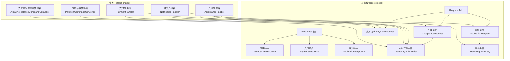
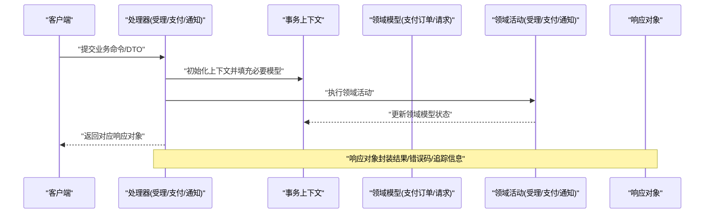
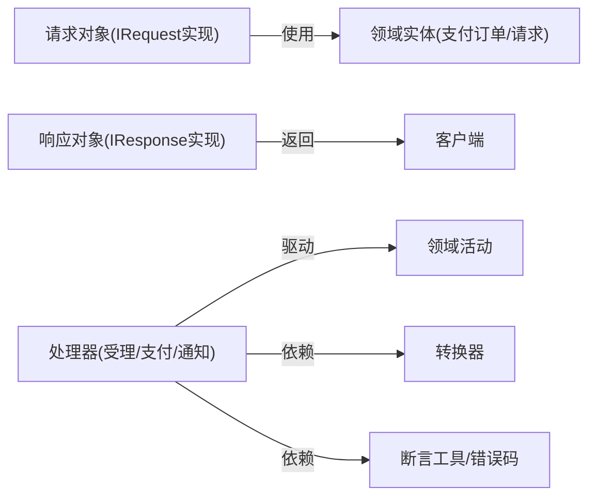

# 请求响应模型

<cite>
**本文引用的文件**
- [IRequest.java](file://core-model/src/main/java/com/magicliang/transaction/sys/core/model/request/IRequest.java)
- [IResponse.java](file://core-model/src/main/java/com/magicliang/transaction/sys/core/model/response/IResponse.java)
- [AcceptanceRequest.java](file://core-model/src/main/java/com/magicliang/transaction/sys/core/model/request/acceptance/AcceptanceRequest.java)
- [PaymentRequest.java](file://core-model/src/main/java/com/magicliang/transaction/sys/core/model/request/payment/PaymentRequest.java)
- [NotificationRequest.java](file://core-model/src/main/java/com/magicliang/transaction/sys/core/model/request/notification/NotificationRequest.java)
- [AcceptanceResponse.java](file://core-model/src/main/java/com/magicliang/transaction/sys/core/model/response/acceptance/AcceptanceResponse.java)
- [PaymentResponse.java](file://core-model/src/main/java/com/magicliang/transaction/sys/core/model/response/payment/PaymentResponse.java)
- [NotificationResponse.java](file://core-model/src/main/java/com/magicliang/transaction/sys/core/model/response/notification/NotificationResponse.java)
- [TransPayOrderEntity.java](file://core-model/src/main/java/com/magicliang/transaction/sys/core/model/entity/TransPayOrderEntity.java)
- [TransRequestEntity.java](file://core-model/src/main/java/com/magicliang/transaction/sys/core/model/entity/TransRequestEntity.java)
- [AcceptanceHandler.java](file://biz-shared/src/main/java/com/magicliang/transaction/sys/biz/shared/handler/AcceptanceHandler.java)
- [PaymentHandler.java](file://biz-shared/src/main/java/com/magicliang/transaction/sys/biz/shared/handler/PaymentHandler.java)
- [NotificationHandler.java](file://biz-shared/src/main/java/com/magicliang/transaction/sys/biz/shared/handler/NotificationHandler.java)
- [AlipayAcceptanceCommandConvertor.java](file://biz-shared/src/main/java/com/magicliang/transaction/sys/biz/shared/request/acceptance/convertor/AlipayAcceptanceCommandConvertor.java)
- [PaymentCommandConvertor.java](file://biz-shared/src/main/java/com/magicliang/transaction/sys/biz/shared/request/payment/convertor/PaymentCommandConvertor.java)
</cite>

## 目录
1. [引言](#引言)
2. [项目结构](#项目结构)
3. [核心组件](#核心组件)
4. [架构总览](#架构总览)
5. [详细组件分析](#详细组件分析)
6. [依赖分析](#依赖分析)
7. [性能考虑](#性能考虑)
8. [故障排查指南](#故障排查指南)
9. [结论](#结论)
10. [附录](#附录)

## 引言
本文件聚焦于领域驱动交易系统中的“请求-响应”模型，系统性阐述请求与响应对象的设计理念、业务类型划分、参数与验证规则、响应封装策略、错误处理统一格式，以及在防腐层（适配层）中的作用与转换机制。目标是帮助开发者建立清晰的接口设计思维与良好的API用户体验。

## 项目结构
围绕请求响应模型的关键模块分布如下：
- 核心模型层（core-model）：定义 IRequest/IResponse 接口及三类业务请求/响应对象（受理、支付、通知），并包含领域实体（支付订单、请求记录）。
- 业务共享层（biz-shared）：定义处理器（Handler）与转换器（Convertor），负责将外部命令/DTO转换为领域请求，并驱动领域活动。
- 防腐层职责：通过转换器与处理器隔离外部接口变化，向领域模型传递最小必要上下文，确保策略与上下文解耦。



图表来源
- [IRequest.java:12-14](file://core-model/src/main/java/com/magicliang/transaction/sys/core/model/request/IRequest.java#L12-L14)
- [IResponse.java:12-14](file://core-model/src/main/java/com/magicliang/transaction/sys/core/model/response/IResponse.java#L12-L14)
- [AcceptanceRequest.java:17-22](file://core-model/src/main/java/com/magicliang/transaction/sys/core/model/request/acceptance/AcceptanceRequest.java#L17-L22)
- [PaymentRequest.java:18-19](file://core-model/src/main/java/com/magicliang/transaction/sys/core/model/request/payment/PaymentRequest.java#L18-L19)
- [NotificationRequest.java:19-24](file://core-model/src/main/java/com/magicliang/transaction/sys/core/model/request/notification/NotificationRequest.java#L19-L24)
- [AcceptanceResponse.java:16-21](file://core-model/src/main/java/com/magicliang/transaction/sys/core/model/response/acceptance/AcceptanceResponse.java#L16-L21)
- [PaymentResponse.java:16-26](file://core-model/src/main/java/com/magicliang/transaction/sys/core/model/response/payment/PaymentResponse.java#L16-L26)
- [NotificationResponse.java:16-21](file://core-model/src/main/java/com/magicliang/transaction/sys/core/model/response/notification/NotificationResponse.java#L16-L21)
- [TransPayOrderEntity.java:32-185](file://core-model/src/main/java/com/magicliang/transaction/sys/core/model/entity/TransPayOrderEntity.java#L32-L185)
- [TransRequestEntity.java:22-87](file://core-model/src/main/java/com/magicliang/transaction/sys/core/model/entity/TransRequestEntity.java#L22-L87)
- [AcceptanceHandler.java:32-78](file://biz-shared/src/main/java/com/magicliang/transaction/sys/biz/shared/handler/AcceptanceHandler.java#L32-L78)
- [PaymentHandler.java:28-69](file://biz-shared/src/main/java/com/magicliang/transaction/sys/biz/shared/handler/PaymentHandler.java#L28-L69)
- [NotificationHandler.java:29-70](file://biz-shared/src/main/java/com/magicliang/transaction/sys/biz/shared/handler/NotificationHandler.java#L29-L70)
- [AlipayAcceptanceCommandConvertor.java:30-32](file://biz-shared/src/main/java/com/magicliang/transaction/sys/biz/shared/request/acceptance/convertor/AlipayAcceptanceCommandConvertor.java#L30-L32)
- [PaymentCommandConvertor.java:30-35](file://biz-shared/src/main/java/com/magicliang/transaction/sys/biz/shared/request/payment/convertor/PaymentCommandConvertor.java#L30-L35)

章节来源
- [IRequest.java:12-14](file://core-model/src/main/java/com/magicliang/transaction/sys/core/model/request/IRequest.java#L12-L14)
- [IResponse.java:12-14](file://core-model/src/main/java/com/magicliang/transaction/sys/core/model/response/IResponse.java#L12-L14)
- [AcceptanceRequest.java:17-22](file://core-model/src/main/java/com/magicliang/transaction/sys/core/model/request/acceptance/AcceptanceRequest.java#L17-L22)
- [PaymentRequest.java:18-19](file://core-model/src/main/java/com/magicliang/transaction/sys/core/model/request/payment/PaymentRequest.java#L18-L19)
- [NotificationRequest.java:19-24](file://core-model/src/main/java/com/magicliang/transaction/sys/core/model/request/notification/NotificationRequest.java#L19-L24)
- [AcceptanceResponse.java:16-21](file://core-model/src/main/java/com/magicliang/transaction/sys/core/model/response/acceptance/AcceptanceResponse.java#L16-L21)
- [PaymentResponse.java:16-26](file://core-model/src/main/java/com/magicliang/transaction/sys/core/model/response/payment/PaymentResponse.java#L16-L26)
- [NotificationResponse.java:16-21](file://core-model/src/main/java/com/magicliang/transaction/sys/core/model/response/notification/NotificationResponse.java#L16-L21)
- [TransPayOrderEntity.java:32-185](file://core-model/src/main/java/com/magicliang/transaction/sys/core/model/entity/TransPayOrderEntity.java#L32-L185)
- [TransRequestEntity.java:22-87](file://core-model/src/main/java/com/magicliang/transaction/sys/core/model/entity/TransRequestEntity.java#L22-L87)
- [AcceptanceHandler.java:32-78](file://biz-shared/src/main/java/com/magicliang/transaction/sys/biz/shared/handler/AcceptanceHandler.java#L32-L78)
- [PaymentHandler.java:28-69](file://biz-shared/src/main/java/com/magicliang/transaction/sys/biz/shared/handler/PaymentHandler.java#L28-L69)
- [NotificationHandler.java:29-70](file://biz-shared/src/main/java/com/magicliang/transaction/sys/biz/shared/handler/NotificationHandler.java#L29-L70)
- [AlipayAcceptanceCommandConvertor.java:30-32](file://biz-shared/src/main/java/com/magicliang/transaction/sys/biz/shared/request/acceptance/convertor/AlipayAcceptanceCommandConvertor.java#L30-L32)
- [PaymentCommandConvertor.java:30-35](file://biz-shared/src/main/java/com/magicliang/transaction/sys/biz/shared/request/payment/convertor/PaymentCommandConvertor.java#L30-L35)

## 核心组件
- IRequest/IResponse：定义领域活动的输入输出契约，仅承载策略所需的最小上下文，避免与具体实现耦合。
- 业务请求对象：
  - 受理请求：包含支付订单实体，用于生成受理上下文与领域模型。
  - 支付请求：继承受理请求，承载支付阶段所需上下文。
  - 通知请求：在受理请求基础上附加通知请求实体，用于驱动通知活动。
- 业务响应对象：
  - 受理响应：返回受理后的支付订单号。
  - 支付响应：返回渠道侧流水号与错误码，便于追踪与对账。
  - 通知响应：返回通知是否成功的布尔标记。
- 领域实体：
  - 支付订单实体：聚合根，包含支付状态、时间戳、扩展信息、子订单与请求记录等。
  - 请求实体：记录通知/支付请求的类型、重试次数、地址、参数、响应、异常等。

章节来源
- [IRequest.java:12-14](file://core-model/src/main/java/com/magicliang/transaction/sys/core/model/request/IRequest.java#L12-L14)
- [IResponse.java:12-14](file://core-model/src/main/java/com/magicliang/transaction/sys/core/model/response/IResponse.java#L12-L14)
- [AcceptanceRequest.java:17-22](file://core-model/src/main/java/com/magicliang/transaction/sys/core/model/request/acceptance/AcceptanceRequest.java#L17-L22)
- [PaymentRequest.java:18-19](file://core-model/src/main/java/com/magicliang/transaction/sys/core/model/request/payment/PaymentRequest.java#L18-L19)
- [NotificationRequest.java:19-24](file://core-model/src/main/java/com/magicliang/transaction/sys/core/model/request/notification/NotificationRequest.java#L19-L24)
- [AcceptanceResponse.java:16-21](file://core-model/src/main/java/com/magicliang/transaction/sys/core/model/response/acceptance/AcceptanceResponse.java#L16-L21)
- [PaymentResponse.java:16-26](file://core-model/src/main/java/com/magicliang/transaction/sys/core/model/response/payment/PaymentResponse.java#L16-L26)
- [NotificationResponse.java:16-21](file://core-model/src/main/java/com/magicliang/transaction/sys/core/model/response/notification/NotificationResponse.java#L16-L21)
- [TransPayOrderEntity.java:32-185](file://core-model/src/main/java/com/magicliang/transaction/sys/core/model/entity/TransPayOrderEntity.java#L32-L185)
- [TransRequestEntity.java:22-87](file://core-model/src/main/java/com/magicliang/transaction/sys/core/model/entity/TransRequestEntity.java#L22-L87)

## 架构总览
请求-响应模型在系统中的位置与交互如下：



图表来源
- [AcceptanceHandler.java:54-78](file://biz-shared/src/main/java/com/magicliang/transaction/sys/biz/shared/handler/AcceptanceHandler.java#L54-L78)
- [PaymentHandler.java:47-69](file://biz-shared/src/main/java/com/magicliang/transaction/sys/biz/shared/handler/PaymentHandler.java#L47-L69)
- [NotificationHandler.java:49-70](file://biz-shared/src/main/java/com/magicliang/transaction/sys/biz/shared/handler/NotificationHandler.java#L49-L70)
- [AcceptanceResponse.java:16-21](file://core-model/src/main/java/com/magicliang/transaction/sys/core/model/response/acceptance/AcceptanceResponse.java#L16-L21)
- [PaymentResponse.java:16-26](file://core-model/src/main/java/com/magicliang/transaction/sys/core/model/response/payment/PaymentResponse.java#L16-L26)
- [NotificationResponse.java:16-21](file://core-model/src/main/java/com/magicliang/transaction/sys/core/model/response/notification/NotificationResponse.java#L16-L21)

## 详细组件分析

### IRequest/IResponse 设计理念
- 解耦策略与上下文：接口不包含任何业务字段，仅作为契约边界，确保策略只消费必要的上下文。
- 最小必要原则：请求/响应对象仅承载活动所需字段，避免污染领域模型或暴露无关细节。
- 防腐层入口：外部命令/DTO通过转换器映射到请求对象，再由处理器驱动领域活动。

章节来源
- [IRequest.java:12-14](file://core-model/src/main/java/com/magicliang/transaction/sys/core/model/request/IRequest.java#L12-L14)
- [IResponse.java:12-14](file://core-model/src/main/java/com/magicliang/transaction/sys/core/model/response/IResponse.java#L12-L14)

### 受理请求 AcceptanceRequest
- 设计要点
  - 继承 IRequest，承载支付订单实体，用于生成受理上下文。
  - 与支付订单实体关联，确保后续活动能访问状态、扩展信息、子订单等。
- 参数与验证
  - 业务标识码、业务唯一号、金额、会计分录、回调地址、扩展/业务信息等字段来源于支付订单实体。
  - 幂等与状态校验在处理器中完成，避免在请求对象内重复校验。
- 响应
  - 返回受理后的支付订单号，便于后续流程定位。

章节来源
- [AcceptanceRequest.java:17-22](file://core-model/src/main/java/com/magicliang/transaction/sys/core/model/request/acceptance/AcceptanceRequest.java#L17-L22)
- [TransPayOrderEntity.java:32-185](file://core-model/src/main/java/com/magicliang/transaction/sys/core/model/entity/TransPayOrderEntity.java#L32-L185)
- [AcceptanceResponse.java:16-21](file://core-model/src/main/java/com/magicliang/transaction/sys/core/model/response/acceptance/AcceptanceResponse.java#L16-L21)
- [AcceptanceHandler.java:106-128](file://biz-shared/src/main/java/com/magicliang/transaction/sys/biz/shared/handler/AcceptanceHandler.java#L106-L128)

### 支付请求 PaymentRequest
- 设计要点
  - 继承受理请求，复用受理阶段生成的上下文，减少重复参数。
  - 通过处理器直接驱动支付活动，必要时可从领域模型回填支付请求。
- 参数与验证
  - 由处理器根据支付订单实体生成支付请求，避免在请求对象内做复杂校验。
- 响应
  - 返回渠道侧流水号与错误码，便于对账与追踪。

章节来源
- [PaymentRequest.java:18-19](file://core-model/src/main/java/com/magicliang/transaction/sys/core/model/request/payment/PaymentRequest.java#L18-L19)
- [PaymentHandler.java:96-137](file://biz-shared/src/main/java/com/magicliang/transaction/sys/biz/shared/handler/PaymentHandler.java#L96-L137)
- [PaymentResponse.java:16-26](file://core-model/src/main/java/com/magicliang/transaction/sys/core/model/response/payment/PaymentResponse.java#L16-L26)

### 通知请求 NotificationRequest
- 设计要点
  - 继承受理请求，附加通知请求实体，支持多条通知请求与重试控制。
  - 通过处理器遍历通知请求集合，识别幂等与重试场景。
- 参数与验证
  - 通知请求实体包含请求类型、地址、参数、响应、异常、重试次数等。
- 响应
  - 返回通知是否成功的布尔标记，便于上层决策。

章节来源
- [NotificationRequest.java:19-24](file://core-model/src/main/java/com/magicliang/transaction/sys/core/model/request/notification/NotificationRequest.java#L19-L24)
- [TransRequestEntity.java:22-87](file://core-model/src/main/java/com/magicliang/transaction/sys/core/model/entity/TransRequestEntity.java#L22-L87)
- [NotificationHandler.java:97-136](file://biz-shared/src/main/java/com/magicliang/transaction/sys/biz/shared/handler/NotificationHandler.java#L97-L136)
- [NotificationResponse.java:16-21](file://core-model/src/main/java/com/magicliang/transaction/sys/core/model/response/notification/NotificationResponse.java#L16-L21)

### 响应对象设计与封装策略
- 受理响应
  - 字段：受理后的支付订单号。
  - 场景：成功返回订单号；失败通过统一错误处理返回错误信息。
- 支付响应
  - 字段：渠道侧流水号、错误码。
  - 场景：成功返回流水号；失败返回错误码与可诊断信息。
- 通知响应
  - 字段：通知是否成功。
  - 场景：成功返回 true；失败返回 false，结合请求实体中的异常字段辅助诊断。

章节来源
- [AcceptanceResponse.java:16-21](file://core-model/src/main/java/com/magicliang/transaction/sys/core/model/response/acceptance/AcceptanceResponse.java#L16-L21)
- [PaymentResponse.java:16-26](file://core-model/src/main/java/com/magicliang/transaction/sys/core/model/response/payment/PaymentResponse.java#L16-L26)
- [NotificationResponse.java:16-21](file://core-model/src/main/java/com/magicliang/transaction/sys/core/model/response/notification/NotificationResponse.java#L16-L21)

### 防腐层中的作用与转换
- 外部接口适配
  - 处理器接收外部命令/DTO，初始化事务上下文并填充必要领域模型。
  - 通过转换器将外部命令映射到领域请求对象，隔离外部字段与内部模型差异。
- 内部领域模型转换
  - 支付命令转换器可将领域模型回转为支付命令，支撑跨模块协作。
- 与处理器协作
  - 处理器在上下文中执行领域活动，完成后返回统一响应对象。

章节来源
- [AcceptanceHandler.java:54-78](file://biz-shared/src/main/java/com/magicliang/transaction/sys/biz/shared/handler/AcceptanceHandler.java#L54-L78)
- [PaymentHandler.java:47-69](file://biz-shared/src/main/java/com/magicliang/transaction/sys/biz/shared/handler/PaymentHandler.java#L47-L69)
- [NotificationHandler.java:49-70](file://biz-shared/src/main/java/com/magicliang/transaction/sys/biz/shared/handler/NotificationHandler.java#L49-L70)
- [AlipayAcceptanceCommandConvertor.java:30-32](file://biz-shared/src/main/java/com/magicliang/transaction/sys/biz/shared/request/acceptance/convertor/AlipayAcceptanceCommandConvertor.java#L30-L32)
- [PaymentCommandConvertor.java:30-35](file://biz-shared/src/main/java/com/magicliang/transaction/sys/biz/shared/request/payment/convertor/PaymentCommandConvertor.java#L30-L35)

### 错误处理与统一格式
- 统一断言与错误码
  - 处理器在关键路径使用断言工具校验模型有效性，避免空模型进入后续流程。
- 错误传播
  - 处理器在幂等与状态校验失败时，设置上下文完成标志与成功标志，保证流程稳定。
- 响应层补充
  - 支付响应提供错误码字段，便于上层统一处理与日志追踪。

章节来源
- [PaymentHandler.java:123-124](file://biz-shared/src/main/java/com/magicliang/transaction/sys/biz/shared/handler/PaymentHandler.java#L123-L124)
- [NotificationHandler.java:120-121](file://biz-shared/src/main/java/com/magicliang/transaction/sys/biz/shared/handler/NotificationHandler.java#L120-L121)
- [PaymentResponse.java:24-26](file://core-model/src/main/java/com/magicliang/transaction/sys/core/model/response/payment/PaymentResponse.java#L24-L26)

### 请求参数校验机制
- 处理器前置校验
  - 在填充必要模型与幂等判断前，对输入参数进行基础校验，确保后续流程可执行。
- 领域状态校验
  - 通过支付订单状态枚举与辅助工具进行状态合法性校验，防止非法状态推进。
- 转换器约束
  - 转换器仅承担映射职责，不引入额外业务校验，保持契约清晰。

章节来源
- [AcceptanceHandler.java:106-128](file://biz-shared/src/main/java/com/magicliang/transaction/sys/biz/shared/handler/AcceptanceHandler.java#L106-L128)
- [PaymentHandler.java:96-137](file://biz-shared/src/main/java/com/magicliang/transaction/sys/biz/shared/handler/PaymentHandler.java#L96-L137)
- [NotificationHandler.java:97-136](file://biz-shared/src/main/java/com/magicliang/transaction/sys/biz/shared/handler/NotificationHandler.java#L97-L136)

### 代码示例路径
以下为关键流程的示例路径，便于定位实现细节：
- 受理流程上下文初始化与执行
  - [上下文初始化与执行:54-78](file://biz-shared/src/main/java/com/magicliang/transaction/sys/biz/shared/handler/AcceptanceHandler.java#L54-L78)
- 支付流程模型填充与幂等判断
  - [模型填充与幂等判断:96-137](file://biz-shared/src/main/java/com/magicliang/transaction/sys/biz/shared/handler/PaymentHandler.java#L96-L137)
- 通知流程多请求遍历与幂等识别
  - [通知模型填充与幂等识别:97-136](file://biz-shared/src/main/java/com/magicliang/transaction/sys/biz/shared/handler/NotificationHandler.java#L97-L136)
- 支付命令从领域模型回转
  - [支付命令转换器:30-35](file://biz-shared/src/main/java/com/magicliang/transaction/sys/biz/shared/request/payment/convertor/PaymentCommandConvertor.java#L30-L35)
- 支付宝受理命令转换
  - [受理命令转换器:30-32](file://biz-shared/src/main/java/com/magicliang/transaction/sys/biz/shared/request/acceptance/convertor/AlipayAcceptanceCommandConvertor.java#L30-L32)

## 依赖分析
- 组件耦合
  - 请求对象仅依赖 I/O 契约接口与领域实体，保持低耦合。
  - 处理器依赖转换器与领域服务，但通过上下文与模型解耦策略细节。
- 外部依赖
  - 处理器依赖断言工具与事件发布器，统一错误与事件处理。
- 循环依赖
  - 未发现循环依赖迹象，请求/响应与处理器之间为单向依赖。



图表来源
- [AcceptanceRequest.java:17-22](file://core-model/src/main/java/com/magicliang/transaction/sys/core/model/request/acceptance/AcceptanceRequest.java#L17-L22)
- [PaymentRequest.java:18-19](file://core-model/src/main/java/com/magicliang/transaction/sys/core/model/request/payment/PaymentRequest.java#L18-L19)
- [NotificationRequest.java:19-24](file://core-model/src/main/java/com/magicliang/transaction/sys/core/model/request/notification/NotificationRequest.java#L19-L24)
- [AcceptanceHandler.java:32-78](file://biz-shared/src/main/java/com/magicliang/transaction/sys/biz/shared/handler/AcceptanceHandler.java#L32-L78)
- [PaymentHandler.java:28-69](file://biz-shared/src/main/java/com/magicliang/transaction/sys/biz/shared/handler/PaymentHandler.java#L28-L69)
- [NotificationHandler.java:29-70](file://biz-shared/src/main/java/com/magicliang/transaction/sys/biz/shared/handler/NotificationHandler.java#L29-L70)
- [AlipayAcceptanceCommandConvertor.java:30-32](file://biz-shared/src/main/java/com/magicliang/transaction/sys/biz/shared/request/acceptance/convertor/AlipayAcceptanceCommandConvertor.java#L30-L32)
- [PaymentCommandConvertor.java:30-35](file://biz-shared/src/main/java/com/magicliang/transaction/sys/biz/shared/request/payment/convertor/PaymentCommandConvertor.java#L30-L35)

章节来源
- [AcceptanceHandler.java:32-78](file://biz-shared/src/main/java/com/magicliang/transaction/sys/biz/shared/handler/AcceptanceHandler.java#L32-L78)
- [PaymentHandler.java:28-69](file://biz-shared/src/main/java/com/magicliang/transaction/sys/biz/shared/handler/PaymentHandler.java#L28-L69)
- [NotificationHandler.java:29-70](file://biz-shared/src/main/java/com/magicliang/transaction/sys/biz/shared/handler/NotificationHandler.java#L29-L70)

## 性能考虑
- 上下文最小化：请求对象仅承载必要上下文，降低序列化与传输成本。
- 幂等与重试：通过重试计数与状态校验避免重复计算，提升吞吐。
- 批量通知：通知处理器遍历通知请求集合，建议在外部层合并同类请求以减少处理器开销。
- 日志与追踪：响应对象包含关键追踪字段（如流水号），便于异步排查与性能观测。

## 故障排查指南
- 常见问题
  - 模型为空：处理器在模型填充失败时抛出断言错误，需检查上游入参与幂等逻辑。
  - 状态非法：支付订单状态校验失败，需确认前置流程是否正确推进状态。
  - 通知失败：检查通知请求实体中的异常字段与重试次数，结合响应布尔标记定位问题。
- 定位路径
  - 支付模型断言与幂等判断
    - [模型断言与幂等判断:123-137](file://biz-shared/src/main/java/com/magicliang/transaction/sys/biz/shared/handler/PaymentHandler.java#L123-L137)
  - 通知模型断言与幂等识别
    - [通知模型断言与幂等识别:120-136](file://biz-shared/src/main/java/com/magicliang/transaction/sys/biz/shared/handler/NotificationHandler.java#L120-L136)
  - 支付响应错误码
    - [支付响应错误码:24-26](file://core-model/src/main/java/com/magicliang/transaction/sys/core/model/response/payment/PaymentResponse.java#L24-L26)

章节来源
- [PaymentHandler.java:123-137](file://biz-shared/src/main/java/com/magicliang/transaction/sys/biz/shared/handler/PaymentHandler.java#L123-L137)
- [NotificationHandler.java:120-136](file://biz-shared/src/main/java/com/magicliang/transaction/sys/biz/shared/handler/NotificationHandler.java#L120-L136)
- [PaymentResponse.java:24-26](file://core-model/src/main/java/com/magicliang/transaction/sys/core/model/response/payment/PaymentResponse.java#L24-L26)

## 结论
该请求-响应模型通过最小必要上下文与明确的契约边界，实现了策略与上下文的解耦；处理器与转换器共同承担防腐职责，隔离外部变化并驱动领域活动；统一的响应封装与错误处理策略提升了系统的可观测性与可维护性。遵循本文的设计原则与最佳实践，有助于构建清晰、稳健且易于演进的交易系统接口。

## 附录
- 关键流程图（受理/支付/通知）概览
  - 受理流程
    ```mermaid
flowchart TD
Start(["开始"]) --> Init["初始化上下文"]
Init --> Fill["填充必要模型"]
Fill --> Idem{"幂等命中?"}
Idem --> |是| Complete["标记完成并返回"]
Idem --> |否| Exec["执行受理活动"]
Exec --> Done(["结束"])
Complete --> Done
```
  - 支付流程
    ```mermaid
flowchart TD
Start(["开始"]) --> Init["初始化上下文"]
Init --> Fill["填充必要模型"]
Fill --> Idem{"幂等命中?"}
Idem --> |是| Complete["标记完成并返回"]
Idem --> |否| Exec["执行支付活动"]
Exec --> Done(["结束"])
Complete --> Done
```
  - 通知流程
    ```mermaid
flowchart TD
Start(["开始"]) --> Init["初始化上下文"]
Init --> Fill["填充必要模型"]
Fill --> Loop["遍历通知请求"]
Loop --> Idem{"幂等命中?"}
Idem --> |是| Complete["标记完成并返回"]
Idem --> |否| Exec["执行通知活动"]
Exec --> Done(["结束"])
Complete --> Done
```