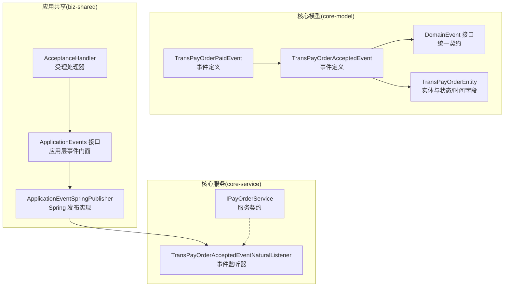
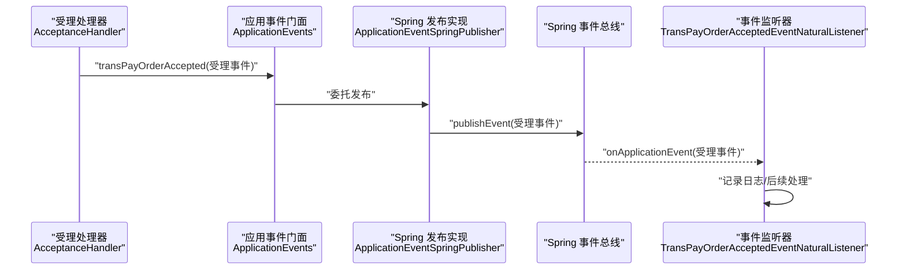
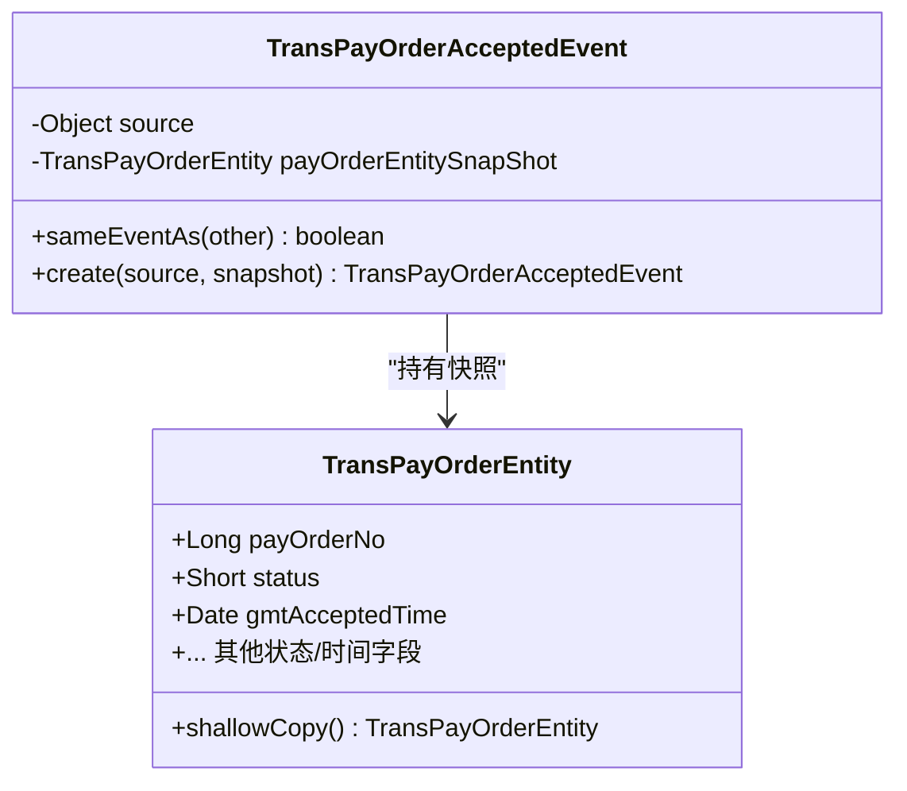
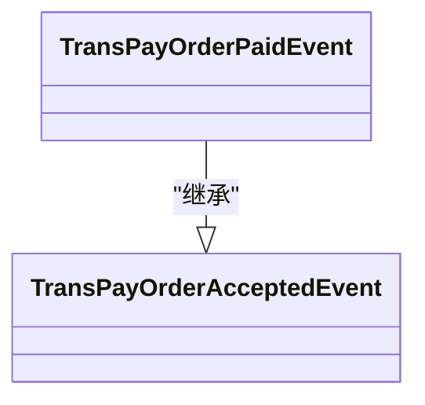
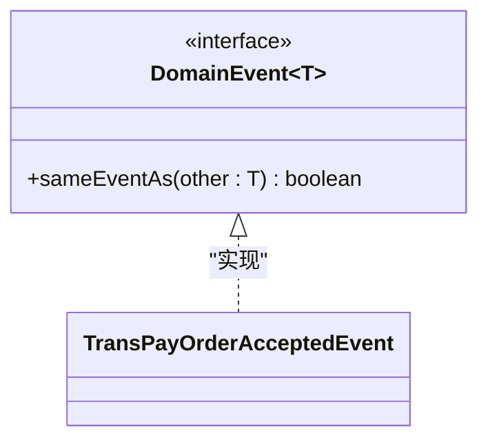
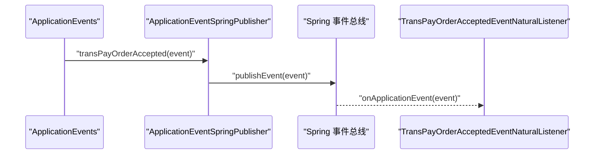
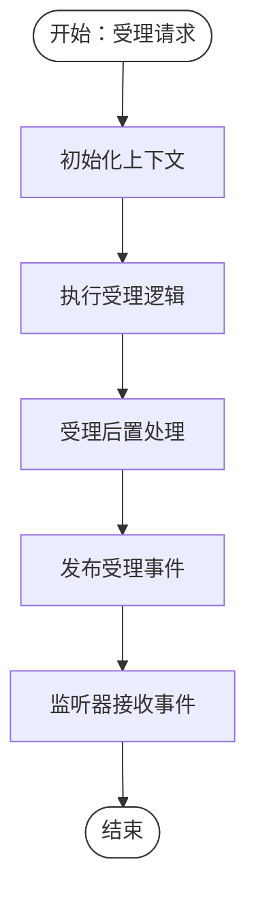
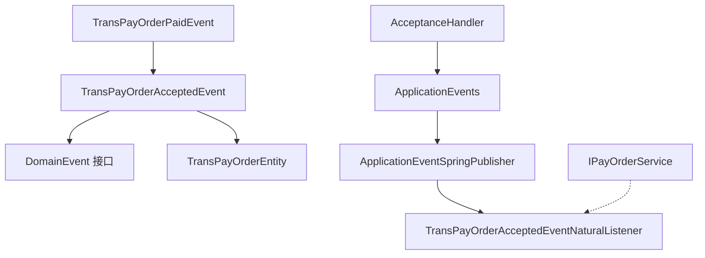

# 领域事件

<cite>
**本文引用的文件**
- [TransPayOrderAcceptedEvent.java](file://core-model/src/main/java/com/magicliang/transaction/sys/core/model/event/TransPayOrderAcceptedEvent.java)
- [TransPayOrderPaidEvent.java](file://core-model/src/main/java/com/magicliang/transaction/sys/core/model/event/TransPayOrderPaidEvent.java)
- [DomainEvent.java](file://core-model/src/main/java/com/magicliang/transaction/sys/core/shared/DomainEvent.java)
- [DomainEvent.java](file://core-model/src/main/java/com/magicliang/transaction/sys/core/shared/experimental/DomainEvent.java)
- [ApplicationEvents.java](file://biz-shared/src/main/java/com/magicliang/transaction/sys/biz/shared/event/ApplicationEvents.java)
- [ApplicationEventSpringPublisher.java](file://biz-shared/src/main/java/com/magicliang/transaction/sys/biz/shared/event/ApplicationEventSpringPublisher.java)
- [AcceptanceHandler.java](file://biz-shared/src/main/java/com/magicliang/transaction/sys/biz/shared/handler/AcceptanceHandler.java)
- [TransPayOrderAcceptedEventNaturalListener.java](file://core-service/src/main/java/com/magicliang/transaction/sys/core/event/TransPayOrderAcceptedEventNaturalListener.java)
- [TransPayOrderEntity.java](file://core-model/src/main/java/com/magicliang/transaction/sys/core/model/entity/TransPayOrderEntity.java)
- [IPayOrderService.java](file://core-service/src/main/java/com/magicliang/transaction/sys/core/service/IPayOrderService.java)
- [TransPayOrderAcceptedEventTest.java](file://core-model/src/test/java/com/magicliang/transaction/sys/core/model/event/TransPayOrderAcceptedEventTest.java)
- [CommandQueryBus.java](file://biz-shared/src/main/java/com/magicliang/transaction/sys/biz/shared/locator/CommandQueryBus.java)
- [BaseHandler.java](file://biz-shared/src/main/java/com/magicliang/transaction/sys/biz/shared/handler/BaseHandler.java)
</cite>

## 目录
1. [简介](#简介)
2. [项目结构](#项目结构)
3. [核心组件](#核心组件)
4. [架构概览](#架构概览)
5. [详细组件分析](#详细组件分析)
6. [依赖分析](#依赖分析)
7. [性能考虑](#性能考虑)
8. [故障排查指南](#故障排查指南)
9. [结论](#结论)
10. [附录](#附录)

## 简介
本文件围绕领域驱动交易系统中的“领域事件”展开，重点解析以下内容：
- TransPayOrderAcceptedEvent 支付订单受理事件的触发时机与事件载荷设计（含时间戳、状态变更等）。
- TransPayOrderPaidEvent 支付订单支付事件的实现与发布机制。
- DomainEvent 接口的设计理念与通用属性约定。
- 事件驱动架构下的事件发布、订阅与处理机制。
- 事件溯源模式在记录业务历史与审计追踪中的应用思路。
- 提供事件定义、发布与监听的代码路径示例，帮助开发者理解领域事件在解耦业务逻辑与实现业务可观测性方面的价值。

## 项目结构
该系统采用分层与模块化组织，领域事件主要分布在 core-model（事件定义）、biz-shared（事件发布门面与Spring集成）、core-service（事件监听与业务活动）等模块中；同时，核心实体 TransPayOrderEntity 承载状态与时间字段，为事件载荷提供数据基础。

图示来源
- [TransPayOrderAcceptedEvent.java:1-54](file://core-model/src/main/java/com/magicliang/transaction/sys/core/model/event/TransPayOrderAcceptedEvent.java#L1-L54)
- [TransPayOrderPaidEvent.java:1-20](file://core-model/src/main/java/com/magicliang/transaction/sys/core/model/event/TransPayOrderPaidEvent.java#L1-L20)
- [DomainEvent.java:1-18](file://core-model/src/main/java/com/magicliang/transaction/sys/core/shared/DomainEvent.java#L1-L18)
- [ApplicationEvents.java:1-22](file://biz-shared/src/main/java/com/magicliang/transaction/sys/biz/shared/event/ApplicationEvents.java#L1-L22)
- [ApplicationEventSpringPublisher.java:1-32](file://biz-shared/src/main/java/com/magicliang/transaction/sys/biz/shared/event/ApplicationEventSpringPublisher.java#L1-L32)
- [AcceptanceHandler.java:1-231](file://biz-shared/src/main/java/com/magicliang/transaction/sys/biz/shared/handler/AcceptanceHandler.java#L1-L231)
- [TransPayOrderAcceptedEventNaturalListener.java:1-33](file://core-service/src/main/java/com/magicliang/transaction/sys/core/event/TransPayOrderAcceptedEventNaturalListener.java#L1-L33)
- [IPayOrderService.java:1-158](file://core-service/src/main/java/com/magicliang/transaction/sys/core/service/IPayOrderService.java#L1-L158)
- [TransPayOrderEntity.java:1-216](file://core-model/src/main/java/com/magicliang/transaction/sys/core/model/entity/TransPayOrderEntity.java#L1-L216)

章节来源
- [TransPayOrderAcceptedEvent.java:1-54](file://core-model/src/main/java/com/magicliang/transaction/sys/core/model/event/TransPayOrderAcceptedEvent.java#L1-L54)
- [TransPayOrderPaidEvent.java:1-20](file://core-model/src/main/java/com/magicliang/transaction/sys/core/model/event/TransPayOrderPaidEvent.java#L1-L20)
- [DomainEvent.java:1-18](file://core-model/src/main/java/com/magicliang/transaction/sys/core/shared/DomainEvent.java#L1-L18)
- [ApplicationEvents.java:1-22](file://biz-shared/src/main/java/com/magicliang/transaction/sys/biz/shared/event/ApplicationEvents.java#L1-L22)
- [ApplicationEventSpringPublisher.java:1-32](file://biz-shared/src/main/java/com/magicliang/transaction/sys/biz/shared/event/ApplicationEventSpringPublisher.java#L1-L32)
- [AcceptanceHandler.java:1-231](file://biz-shared/src/main/java/com/magicliang/transaction/sys/biz/shared/handler/AcceptanceHandler.java#L1-L231)
- [TransPayOrderAcceptedEventNaturalListener.java:1-33](file://core-service/src/main/java/com/magicliang/transaction/sys/core/event/TransPayOrderAcceptedEventNaturalListener.java#L1-L33)
- [IPayOrderService.java:1-158](file://core-service/src/main/java/com/magicliang/transaction/sys/core/service/IPayOrderService.java#L1-L158)
- [TransPayOrderEntity.java:1-216](file://core-model/src/main/java/com/magicliang/transaction/sys/core/model/entity/TransPayOrderEntity.java#L1-L216)

## 核心组件
- 领域事件接口 DomainEvent：定义事件的统一契约，包含事件相等性判定方法 sameEventAs，用于识别重复或相同事件。
- 受理事件 TransPayOrderAcceptedEvent：继承 Spring ApplicationEvent，携带支付订单实体快照，提供 sameEventAs 以订单号为判等依据。
- 支付事件 TransPayOrderPaidEvent：继承受理事件，作为受理事件的进一步细化，体现事件演进。
- 应用层事件门面 ApplicationEvents：定义应用层事件发布入口，便于替换底层发布实现。
- Spring 发布实现 ApplicationEventSpringPublisher：基于 Spring ApplicationEventPublisher 实现事件发布。
- 受理处理器 AcceptanceHandler：在受理流程完成后发布受理事件。
- 事件监听器 TransPayOrderAcceptedEventNaturalListener：接收受理事件并记录日志。
- 支付订单实体 TransPayOrderEntity：承载状态与时间字段，作为事件载荷的一部分。

章节来源
- [DomainEvent.java:1-18](file://core-model/src/main/java/com/magicliang/transaction/sys/core/shared/DomainEvent.java#L1-L18)
- [TransPayOrderAcceptedEvent.java:1-54](file://core-model/src/main/java/com/magicliang/transaction/sys/core/model/event/TransPayOrderAcceptedEvent.java#L1-L54)
- [TransPayOrderPaidEvent.java:1-20](file://core-model/src/main/java/com/magicliang/transaction/sys/core/model/event/TransPayOrderPaidEvent.java#L1-L20)
- [ApplicationEvents.java:1-22](file://biz-shared/src/main/java/com/magicliang/transaction/sys/biz/shared/event/ApplicationEvents.java#L1-L22)
- [ApplicationEventSpringPublisher.java:1-32](file://biz-shared/src/main/java/com/magicliang/transaction/sys/biz/shared/event/ApplicationEventSpringPublisher.java#L1-L32)
- [AcceptanceHandler.java:218-229](file://biz-shared/src/main/java/com/magicliang/transaction/sys/biz/shared/handler/AcceptanceHandler.java#L218-L229)
- [TransPayOrderAcceptedEventNaturalListener.java:1-33](file://core-service/src/main/java/com/magicliang/transaction/sys/core/event/TransPayOrderAcceptedEventNaturalListener.java#L1-L33)
- [TransPayOrderEntity.java:197-214](file://core-model/src/main/java/com/magicliang/transaction/sys/core/model/entity/TransPayOrderEntity.java#L197-L214)

## 架构概览
领域事件在系统中的流转路径如下：
- 受理处理器在受理流程完成后，通过应用层事件门面发布受理事件。
- Spring 容器负责事件传播，监听器接收事件并执行相应处理。
- 事件载荷包含支付订单实体的快照，确保事件发布后对业务状态的不可变记录。

图示来源
- [AcceptanceHandler.java:218-229](file://biz-shared/src/main/java/com/magicliang/transaction/sys/biz/shared/handler/AcceptanceHandler.java#L218-L229)
- [ApplicationEvents.java:15-21](file://biz-shared/src/main/java/com/magicliang/transaction/sys/biz/shared/event/ApplicationEvents.java#L15-L21)
- [ApplicationEventSpringPublisher.java:27-30](file://biz-shared/src/main/java/com/magicliang/transaction/sys/biz/shared/event/ApplicationEventSpringPublisher.java#L27-L30)
- [TransPayOrderAcceptedEventNaturalListener.java:27-31](file://core-service/src/main/java/com/magicliang/transaction/sys/core/event/TransPayOrderAcceptedEventNaturalListener.java#L27-L31)

## 详细组件分析

### TransPayOrderAcceptedEvent 受理事件
- 触发时机：受理处理器在受理流程完成后，于 postExecution 阶段发布受理事件。
- 事件载荷：包含支付订单实体快照（浅拷贝），避免外部修改影响事件一致性。
- 判等逻辑：基于订单号判断两个受理事件是否为同一事件，用于去重或幂等处理。

图示来源
- [TransPayOrderAcceptedEvent.java:18-53](file://core-model/src/main/java/com/magicliang/transaction/sys/core/model/event/TransPayOrderAcceptedEvent.java#L18-L53)
- [TransPayOrderEntity.java:32-214](file://core-model/src/main/java/com/magicliang/transaction/sys/core/model/entity/TransPayOrderEntity.java#L32-L214)

章节来源
- [AcceptanceHandler.java:218-229](file://biz-shared/src/main/java/com/magicliang/transaction/sys/biz/shared/handler/AcceptanceHandler.java#L218-L229)
- [TransPayOrderAcceptedEvent.java:26-52](file://core-model/src/main/java/com/magicliang/transaction/sys/core/model/event/TransPayOrderAcceptedEvent.java#L26-L52)
- [TransPayOrderEntity.java:197-214](file://core-model/src/main/java/com/magicliang/transaction/sys/core/model/entity/TransPayOrderEntity.java#L197-L214)

### TransPayOrderPaidEvent 支付事件
- 继承关系：支付事件继承受理事件，表示支付阶段的事件演进。
- 发布机制：可在支付流程完成后由相应处理器发布支付事件，作为受理事件之后的补充或替代。

图示来源
- [TransPayOrderPaidEvent.java:14-19](file://core-model/src/main/java/com/magicliang/transaction/sys/core/model/event/TransPayOrderPaidEvent.java#L14-L19)
- [TransPayOrderAcceptedEvent.java:18-53](file://core-model/src/main/java/com/magicliang/transaction/sys/core/model/event/TransPayOrderAcceptedEvent.java#L18-L53)

章节来源
- [TransPayOrderPaidEvent.java:1-20](file://core-model/src/main/java/com/magicliang/transaction/sys/core/model/event/TransPayOrderPaidEvent.java#L1-L20)

### DomainEvent 接口与事件标识
- 设计理念：事件是“唯一但无生命周期”的概念，其身份可显式（如序列号）或由事件发生的地点、时间、内容等派生。
- 统一契约：sameEventAs 方法用于事件相等性判定，便于去重与幂等处理。
- 实验性接口：仓库中存在实验性 DomainEvent 接口，体现对事件契约的探索与演进。

图示来源
- [DomainEvent.java:1-18](file://core-model/src/main/java/com/magicliang/transaction/sys/core/shared/DomainEvent.java#L1-L18)
- [DomainEvent.java:1-17](file://core-model/src/main/java/com/magicliang/transaction/sys/core/shared/experimental/DomainEvent.java#L1-L17)
- [TransPayOrderAcceptedEvent.java:18-53](file://core-model/src/main/java/com/magicliang/transaction/sys/core/model/event/TransPayOrderAcceptedEvent.java#L18-L53)

章节来源
- [DomainEvent.java:1-18](file://core-model/src/main/java/com/magicliang/transaction/sys/core/shared/DomainEvent.java#L1-L18)
- [DomainEvent.java:1-17](file://core-model/src/main/java/com/magicliang/transaction/sys/core/shared/experimental/DomainEvent.java#L1-L17)

### 事件发布与订阅机制
- 发布门面：ApplicationEvents 定义应用层事件发布入口，便于替换底层实现。
- Spring 发布：ApplicationEventSpringPublisher 基于 Spring ApplicationEventPublisher 发布事件。
- 订阅处理：TransPayOrderAcceptedEventNaturalListener 作为 ApplicationListener 接收事件并处理。

图示来源
- [ApplicationEvents.java:15-21](file://biz-shared/src/main/java/com/magicliang/transaction/sys/biz/shared/event/ApplicationEvents.java#L15-L21)
- [ApplicationEventSpringPublisher.java:27-30](file://biz-shared/src/main/java/com/magicliang/transaction/sys/biz/shared/event/ApplicationEventSpringPublisher.java#L27-L30)
- [TransPayOrderAcceptedEventNaturalListener.java:27-31](file://core-service/src/main/java/com/magicliang/transaction/sys/core/event/TransPayOrderAcceptedEventNaturalListener.java#L27-L31)

章节来源
- [ApplicationEvents.java:1-22](file://biz-shared/src/main/java/com/magicliang/transaction/sys/biz/shared/event/ApplicationEvents.java#L1-L22)
- [ApplicationEventSpringPublisher.java:1-32](file://biz-shared/src/main/java/com/magicliang/transaction/sys/biz/shared/event/ApplicationEventSpringPublisher.java#L1-L32)
- [TransPayOrderAcceptedEventNaturalListener.java:1-33](file://core-service/src/main/java/com/magicliang/transaction/sys/core/event/TransPayOrderAcceptedEventNaturalListener.java#L1-L33)

### 支付流程与事件发布时间点
- 受理阶段：受理处理器在受理完成后发布受理事件，事件载荷包含受理时的状态与时间。
- 支付阶段：支付活动在支付前更新状态与时间字段，支付完成后可发布支付事件（具体实现位置可参考支付活动与服务层）。

图示来源
- [AcceptanceHandler.java:53-79](file://biz-shared/src/main/java/com/magicliang/transaction/sys/biz/shared/handler/AcceptanceHandler.java#L53-L79)
- [AcceptanceHandler.java:218-229](file://biz-shared/src/main/java/com/magicliang/transaction/sys/biz/shared/handler/AcceptanceHandler.java#L218-L229)

章节来源
- [AcceptanceHandler.java:1-231](file://biz-shared/src/main/java/com/magicliang/transaction/sys/biz/shared/handler/AcceptanceHandler.java#L1-L231)

### 事件溯源与审计追踪
- 事件记录：事件作为“事实”的载体，可用于记录业务历史与审计追踪。
- 载荷设计：事件载荷包含支付订单实体快照，确保事件发布后对业务状态的不可变记录，便于回溯与审计。
- 适用场景：建议在关键业务节点（如受理、支付、通知等）发布事件，形成完整的业务历史流。

章节来源
- [TransPayOrderAcceptedEvent.java:26-39](file://core-model/src/main/java/com/magicliang/transaction/sys/core/model/event/TransPayOrderAcceptedEvent.java#L26-L39)
- [TransPayOrderEntity.java:197-214](file://core-model/src/main/java/com/magicliang/transaction/sys/core/model/entity/TransPayOrderEntity.java#L197-L214)

## 依赖分析
- 事件定义与接口：TransPayOrderAcceptedEvent 与 TransPayOrderPaidEvent 依赖 DomainEvent 接口与 TransPayOrderEntity。
- 发布门面与实现：AcceptanceHandler 依赖 ApplicationEvents；ApplicationEvents 由 ApplicationEventSpringPublisher 实现。
- 监听器：TransPayOrderAcceptedEventNaturalListener 依赖 Spring ApplicationListener。
- 服务契约：IPayOrderService 提供支付订单相关服务能力，支撑事件处理与后续通知。

图示来源
- [DomainEvent.java:1-18](file://core-model/src/main/java/com/magicliang/transaction/sys/core/shared/DomainEvent.java#L1-L18)
- [TransPayOrderAcceptedEvent.java:18-53](file://core-model/src/main/java/com/magicliang/transaction/sys/core/model/event/TransPayOrderAcceptedEvent.java#L18-L53)
- [TransPayOrderPaidEvent.java:14-19](file://core-model/src/main/java/com/magicliang/transaction/sys/core/model/event/TransPayOrderPaidEvent.java#L14-L19)
- [TransPayOrderEntity.java:32-214](file://core-model/src/main/java/com/magicliang/transaction/sys/core/model/entity/TransPayOrderEntity.java#L32-L214)
- [ApplicationEvents.java:15-21](file://biz-shared/src/main/java/com/magicliang/transaction/sys/biz/shared/event/ApplicationEvents.java#L15-L21)
- [ApplicationEventSpringPublisher.java:27-30](file://biz-shared/src/main/java/com/magicliang/transaction/sys/biz/shared/event/ApplicationEventSpringPublisher.java#L27-L30)
- [AcceptanceHandler.java:218-229](file://biz-shared/src/main/java/com/magicliang/transaction/sys/biz/shared/handler/AcceptanceHandler.java#L218-L229)
- [TransPayOrderAcceptedEventNaturalListener.java:27-31](file://core-service/src/main/java/com/magicliang/transaction/sys/core/event/TransPayOrderAcceptedEventNaturalListener.java#L27-L31)
- [IPayOrderService.java:1-158](file://core-service/src/main/java/com/magicliang/transaction/sys/core/service/IPayOrderService.java#L1-L158)

章节来源
- [CommandQueryBus.java:35-63](file://biz-shared/src/main/java/com/magicliang/transaction/sys/biz/shared/locator/CommandQueryBus.java#L35-L63)
- [BaseHandler.java:81-130](file://biz-shared/src/main/java/com/magicliang/transaction/sys/biz/shared/handler/BaseHandler.java#L81-L130)

## 性能考虑
- 事件载荷大小：事件仅携带实体快照，避免大对象传递带来的内存与序列化开销。
- 并发与幂等：事件相等性判定基于订单号，有助于在高并发场景下进行去重与幂等处理。
- 发布与监听：基于 Spring 事件总线，注意监听器处理逻辑应保持无阻塞与低延迟，避免影响事件发布性能。

## 故障排查指南
- 事件未到达监听器：检查事件发布门面与实现是否正确装配，确认 Spring 容器中是否存在监听器组件。
- 事件载荷为空：确认事件创建时是否正确传入实体快照，并检查浅拷贝逻辑是否生效。
- 事件判等异常：核对 sameEventAs 的判等条件是否符合预期（如订单号非空且一致）。

章节来源
- [TransPayOrderAcceptedEvent.java:46-52](file://core-model/src/main/java/com/magicliang/transaction/sys/core/model/event/TransPayOrderAcceptedEvent.java#L46-L52)
- [TransPayOrderAcceptedEventTest.java:102-128](file://core-model/src/test/java/com/magicliang/transaction/sys/core/model/event/TransPayOrderAcceptedEventTest.java#L102-L128)

## 结论
本系统通过领域事件实现了业务流程的关键节点解耦与可观测性增强。受理事件与支付事件分别对应受理与支付阶段，配合事件门面与 Spring 发布机制，形成清晰的事件驱动架构。事件载荷包含实体快照，有利于事件溯源与审计追踪。建议在支付完成等关键节点继续完善事件发布，以构建完整的业务历史流。

## 附录
- 事件定义与发布路径示例
  - 受理事件定义与判等：[TransPayOrderAcceptedEvent.java:18-53](file://core-model/src/main/java/com/magicliang/transaction/sys/core/model/event/TransPayOrderAcceptedEvent.java#L18-L53)
  - 支付事件定义：[TransPayOrderPaidEvent.java:14-19](file://core-model/src/main/java/com/magicliang/transaction/sys/core/model/event/TransPayOrderPaidEvent.java#L14-L19)
  - 事件门面与发布实现：[ApplicationEvents.java:15-21](file://biz-shared/src/main/java/com/magicliang/transaction/sys/biz/shared/event/ApplicationEvents.java#L15-L21)，[ApplicationEventSpringPublisher.java:27-30](file://biz-shared/src/main/java/com/magicliang/transaction/sys/biz/shared/event/ApplicationEventSpringPublisher.java#L27-L30)
  - 受理处理器发布事件：[AcceptanceHandler.java:218-229](file://biz-shared/src/main/java/com/magicliang/transaction/sys/biz/shared/handler/AcceptanceHandler.java#L218-L229)
  - 事件监听器：[TransPayOrderAcceptedEventNaturalListener.java:27-31](file://core-service/src/main/java/com/magicliang/transaction/sys/core/event/TransPayOrderAcceptedEventNaturalListener.java#L27-L31)
  - 支付订单实体与状态/时间字段：[TransPayOrderEntity.java:197-214](file://core-model/src/main/java/com/magicliang/transaction/sys/core/model/entity/TransPayOrderEntity.java#L197-L214)
  - 事件契约与测试：[DomainEvent.java:1-18](file://core-model/src/main/java/com/magicliang/transaction/sys/core/shared/DomainEvent.java#L1-L18)，[TransPayOrderAcceptedEventTest.java:102-128](file://core-model/src/test/java/com/magicliang/transaction/sys/core/model/event/TransPayOrderAcceptedEventTest.java#L102-L128)