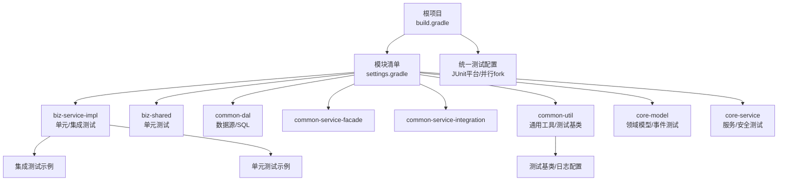
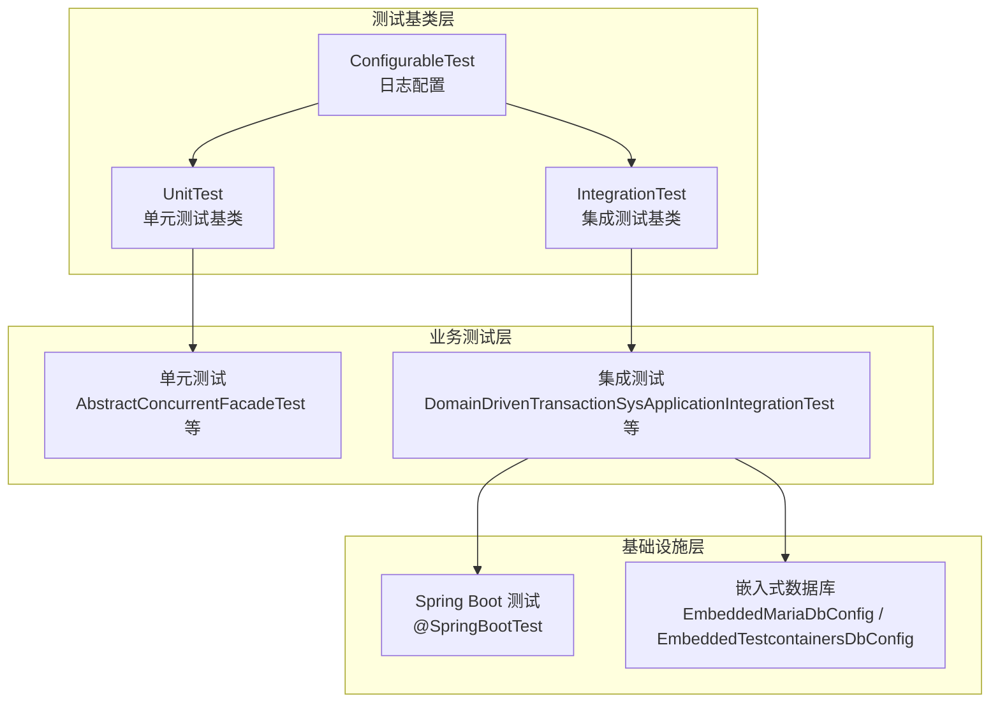
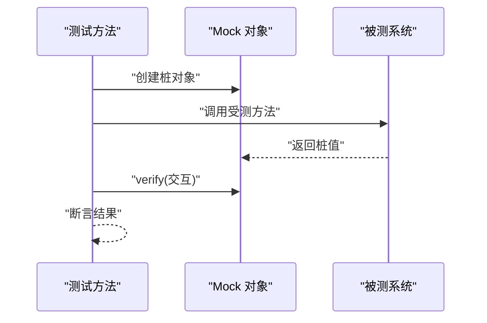
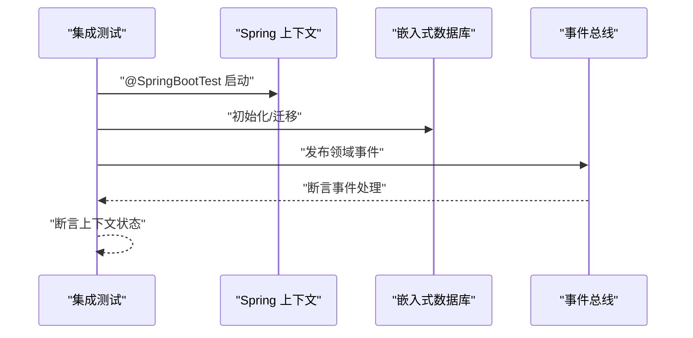
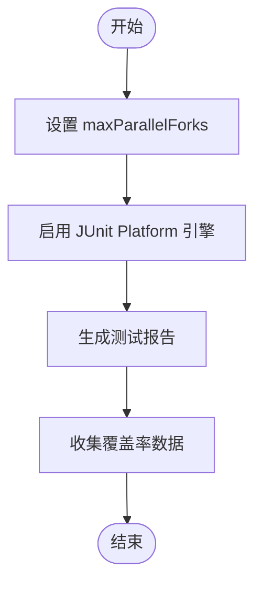
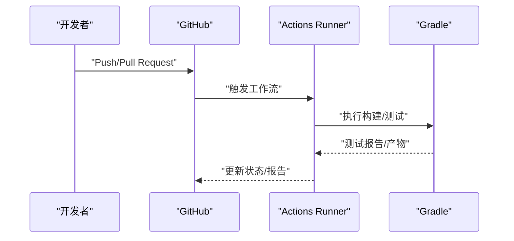
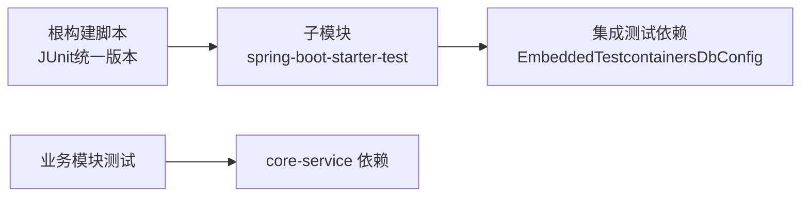

# 测试策略

<cite>
**本文引用的文件**
- [build.gradle](file://build.gradle)
- [settings.gradle](file://settings.gradle)
- [.github/workflows/gradle.yml](file://.github/workflows/gradle.yml)
- [common-util/src/test/java/com/magicliang/transaction/sys/common/ConfigurableTest.java](file://common-util/src/test/java/com/magicliang/transaction/sys/common/ConfigurableTest.java)
- [common-util/src/test/java/com/magicliang/transaction/sys/common/UnitTest.java](file://common-util/src/test/java/com/magicliang/transaction/sys/common/UnitTest.java)
- [common-util/src/test/java/com/magicliang/transaction/sys/common/IntegrationTest.java](file://common-util/src/test/java/com/magicliang/transaction/sys/common/IntegrationTest.java)
- [common-util/src/test/java/com/magicliang/transaction/sys/common/MockitoTest.java](file://common-util/src/test/java/com/magicliang/transaction/sys/common/MockitoTest.java)
- [common-util/src/test/java/com/magicliang/transaction/sys/common/ConcurrentTest.java](file://common-util/src/test/java/com/magicliang/transaction/sys/common/ConcurrentTest.java)
- [common-util/src/test/resources/application.yml](file://common-util/src/test/resources/application.yml)
- [biz-service-impl/src/test/unit/java/com.magicliang.transaction.sys/biz/service/impl/facade/impl/AbstractConcurrentFacadeTest.java](file://biz-service-impl/src/test/unit/java/com.magicliang.transaction.sys/biz/service/impl/facade/impl/AbstractConcurrentFacadeTest.java)
- [biz-service-impl/src/test/integration/java/com/magicliang/transaction/sys/DomainDrivenTransactionSysApplicationIntegrationTest.java](file://biz-service-impl/src/test/integration/java/com/magicliang/transaction/sys/DomainDrivenTransactionSysApplicationIntegrationTest.java)
- [biz-service-impl/src/test/integration/java/com/magicliang/transaction/sys/aop/factory/ProxyFactoryTest.java](file://biz-service-impl/src/test/integration/java/com/magicliang/transaction/sys/aop/factory/ProxyFactoryTest.java)
- [biz-shared/src/test/java/com/magicliang/transaction/sys/biz/shared/handler/AcceptanceHandlerTest.java](file://biz-shared/src/test/java/com/magicliang/transaction/sys/biz/shared/handler/AcceptanceHandlerTest.java)
- [common-dal/src/main/java/com/magicliang/transaction/sys/common/dal/datasource/EmbeddedMariaDbConfig.java](file://common-dal/src/main/java/com/magicliang/transaction/sys/common/dal/datasource/EmbeddedMariaDbConfig.java)
- [common-dal/src/main/java/com/magicliang/transaction/sys/common/dal/datasource/EmbeddedTestcontainersDbConfig.java](file://common-dal/src/main/java/com/magicliang/transaction/sys/common/dal/datasource/EmbeddedTestcontainersDbConfig.java)
- [common-dal/src/main/resources/sql/tc-init-privileges.sql](file://common-dal/src/main/resources/sql/tc-init-privileges.sql)
- [core-service/src/test/java/security/jwt/JwtUtilTest.java](file://core-service/src/test/java/security/jwt/JwtUtilTest.java)
</cite>

## 目录
1. [引言](#引言)
2. [项目结构](#项目结构)
3. [核心组件](#核心组件)
4. [架构总览](#架构总览)
5. [详细组件分析](#详细组件分析)
6. [依赖分析](#依赖分析)
7. [性能考虑](#性能考虑)
8. [故障排查指南](#故障排查指南)
9. [结论](#结论)
10. [附录](#附录)

## 引言
本测试策略文档面向领域驱动交易系统，旨在建立从单元测试到集成测试的完整测试体系，明确测试架构、实施方法与最佳实践。文档覆盖以下重点：
- 单元测试设计与实现：测试用例编写、Mock使用、断言策略与并发测试要点
- 集成测试实施方案：测试环境搭建、数据准备与测试流程
- 测试任务配置与优化：并行执行、测试报告与覆盖率统计建议
- 测试驱动开发（TDD）在项目中的应用与落地建议
- 具体测试示例与模板，辅助开发者编写高质量测试
- 持续集成与自动化测试配置指南，保障质量与发布效率

## 项目结构
项目采用多模块（Gradle）结构，测试分布在各模块的 test 目录下，分为 unit 与 integration 两大类。根构建脚本统一管理 JUnit 版本、测试引擎与并行执行策略；各模块通过 spring-boot-starter-test 提供 Spring Boot 集成测试能力。

图表来源
- [build.gradle:253-272](file://build.gradle#L253-L272)
- [settings.gradle:1-16](file://settings.gradle#L1-L16)

章节来源
- [build.gradle:144-155](file://build.gradle#L144-L155)
- [build.gradle:253-272](file://build.gradle#L253-L272)
- [settings.gradle:1-16](file://settings.gradle#L1-L16)

## 核心组件
- 测试基类与日志配置
  - ConfigurableTest：统一设置日志配置文件，保证测试期间日志一致性
  - UnitTest：作为单元测试基类，继承自 ConfigurableTest
  - IntegrationTest：基于 Spring Boot 的集成测试基类，启用完整上下文
- 并发测试与线程池
  - ConcurrentTest：演示线程池、信号量与突发提交的测试方法
- Mock 与断言
  - MockitoTest：展示基础 Mock 与 verify 断言用法
- 具体业务测试
  - AbstractConcurrentFacadeTest：并发流与 ForkJoin 线程池行为验证
  - AcceptanceHandlerTest：泛型类型判断与 ForkJoin 线程工厂定制
  - DomainDrivenTransactionSysApplicationIntegrationTest：事件发布与反射类型边界测试
  - ProxyFactoryTest：AOP 代理工厂集成测试示例

章节来源
- [common-util/src/test/java/com/magicliang/transaction/sys/common/ConfigurableTest.java:15-21](file://common-util/src/test/java/com/magicliang/transaction/sys/common/ConfigurableTest.java#L15-L21)
- [common-util/src/test/java/com/magicliang/transaction/sys/common/UnitTest.java:12-14](file://common-util/src/test/java/com/magicliang/transaction/sys/common/UnitTest.java#L12-L14)
- [common-util/src/test/java/com/magicliang/transaction/sys/common/IntegrationTest.java:14-23](file://common-util/src/test/java/com/magicliang/transaction/sys/common/IntegrationTest.java#L14-L23)
- [common-util/src/test/java/com/magicliang/transaction/sys/common/ConcurrentTest.java:27-84](file://common-util/src/test/java/com/magicliang/transaction/sys/common/ConcurrentTest.java#L27-L84)
- [common-util/src/test/java/com/magicliang/transaction/sys/common/MockitoTest.java:19-50](file://common-util/src/test/java/com/magicliang/transaction/sys/common/MockitoTest.java#L19-L50)
- [biz-service-impl/src/test/unit/java/com.magicliang.transaction.sys/biz/service/impl/facade/impl/AbstractConcurrentFacadeTest.java:16-44](file://biz-service-impl/src/test/unit/java/com.magicliang.transaction.sys/biz/service/impl/facade/impl/AbstractConcurrentFacadeTest.java#L16-L44)
- [biz-service-impl/src/test/integration/java/com/magicliang/transaction/sys/DomainDrivenTransactionSysApplicationIntegrationTest.java:51-118](file://biz-service-impl/src/test/integration/java/com/magicliang/transaction/sys/DomainDrivenTransactionSysApplicationIntegrationTest.java#L51-L118)
- [biz-service-impl/src/test/integration/java/com/magicliang/transaction/sys/aop/factory/ProxyFactoryTest.java](file://biz-service-impl/src/test/integration/java/com/magicliang/transaction/sys/aop/factory/ProxyFactoryTest.java)
- [biz-shared/src/test/java/com/magicliang/transaction/sys/biz/shared/handler/AcceptanceHandlerTest.java:28-107](file://biz-shared/src/test/java/com/magicliang/transaction/sys/biz/shared/handler/AcceptanceHandlerTest.java#L28-L107)

## 架构总览
测试架构围绕“基类统一、按模块分层、按类型分离”的原则组织，单元测试与集成测试分别运行在独立的 sourceSet 中，通过 Gradle 的 JVM Test Suite 与 JUnit Platform 自动发现与执行。

图表来源
- [common-util/src/test/java/com/magicliang/transaction/sys/common/ConfigurableTest.java:15-21](file://common-util/src/test/java/com/magicliang/transaction/sys/common/ConfigurableTest.java#L15-L21)
- [common-util/src/test/java/com/magicliang/transaction/sys/common/UnitTest.java:12-14](file://common-util/src/test/java/com/magicliang/transaction/sys/common/UnitTest.java#L12-L14)
- [common-util/src/test/java/com/magicliang/transaction/sys/common/IntegrationTest.java:14-23](file://common-util/src/test/java/com/magicliang/transaction/sys/common/IntegrationTest.java#L14-L23)
- [biz-service-impl/src/test/unit/java/com.magicliang.transaction.sys/biz/service/impl/facade/impl/AbstractConcurrentFacadeTest.java:16-44](file://biz-service-impl/src/test/unit/java/com.magicliang.transaction.sys/biz/service/impl/facade/impl/AbstractConcurrentFacadeTest.java#L16-L44)
- [biz-service-impl/src/test/integration/java/com/magicliang/transaction/sys/DomainDrivenTransactionSysApplicationIntegrationTest.java:51-118](file://biz-service-impl/src/test/integration/java/com/magicliang/transaction/sys/DomainDrivenTransactionSysApplicationIntegrationTest.java#L51-L118)
- [common-dal/src/main/java/com/magicliang/transaction/sys/common/dal/datasource/EmbeddedMariaDbConfig.java](file://common-dal/src/main/java/com/magicliang/transaction/sys/common/dal/datasource/EmbeddedMariaDbConfig.java)
- [common-dal/src/main/java/com/magicliang/transaction/sys/common/dal/datasource/EmbeddedTestcontainersDbConfig.java](file://common-dal/src/main/java/com/magicliang/transaction/sys/common/dal/datasource/EmbeddedTestcontainersDbConfig.java)

## 详细组件分析

### 单元测试设计与实现
- 测试用例编写
  - 使用 JUnit 5 的 @Test 注解，结合断言库进行结果验证
  - 建议每个测试方法聚焦单一行为，命名清晰表达前置条件与期望结果
- Mock 使用
  - 使用 Mockito 创建桩对象，隔离外部依赖
  - 使用 verify 校验交互，避免过度断言内部实现细节
- 断言策略
  - 使用 Assertions 进行布尔断言
  - 对并发场景使用 CountDownLatch、CompletableFuture 等同步手段
- 并发测试要点
  - 使用 ForkJoinPool、ThreadPoolExecutor 验证线程池行为
  - 控制线程优先级与守护线程属性，确保测试稳定性

图表来源
- [common-util/src/test/java/com/magicliang/transaction/sys/common/MockitoTest.java:21-49](file://common-util/src/test/java/com/magicliang/transaction/sys/common/MockitoTest.java#L21-L49)

章节来源
- [common-util/src/test/java/com/magicliang/transaction/sys/common/UnitTest.java:12-14](file://common-util/src/test/java/com/magicliang/transaction/sys/common/UnitTest.java#L12-L14)
- [common-util/src/test/java/com/magicliang/transaction/sys/common/MockitoTest.java:19-50](file://common-util/src/test/java/com/magicliang/transaction/sys/common/MockitoTest.java#L19-L50)
- [common-util/src/test/java/com/magicliang/transaction/sys/common/ConcurrentTest.java:27-84](file://common-util/src/test/java/com/magicliang/transaction/sys/common/ConcurrentTest.java#L27-L84)
- [biz-shared/src/test/java/com/magicliang/transaction/sys/biz/shared/handler/AcceptanceHandlerTest.java:28-107](file://biz-shared/src/test/java/com/magicliang/transaction/sys/biz/shared/handler/AcceptanceHandlerTest.java#L28-L107)
- [biz-service-impl/src/test/unit/java/com.magicliang.transaction.sys/biz/service/impl/facade/impl/AbstractConcurrentFacadeTest.java:16-44](file://biz-service-impl/src/test/unit/java/com.magicliang.transaction.sys/biz/service/impl/facade/impl/AbstractConcurrentFacadeTest.java#L16-L44)

### 集成测试实施方案
- 测试环境搭建
  - 使用 @SpringBootTest 启动完整上下文，必要时排除数据源自动配置
  - 通过 @SpringBootApplication(excludeName=...) 控制自动装配
- 数据准备
  - 使用嵌入式数据库（EmbeddedMariaDbConfig 或 EmbeddedTestcontainersDbConfig）
  - 初始化 SQL 脚本位于 common-dal 资源目录
- 测试流程
  - 事件发布与监听：验证领域事件在真实容器中的传播
  - 反射类型边界：验证泛型与通配符类型的约束
  - AOP 代理：验证代理工厂在集成环境中的行为

图表来源
- [biz-service-impl/src/test/integration/java/com/magicliang/transaction/sys/DomainDrivenTransactionSysApplicationIntegrationTest.java:51-118](file://biz-service-impl/src/test/integration/java/com/magicliang/transaction/sys/DomainDrivenTransactionSysApplicationIntegrationTest.java#L51-L118)
- [common-dal/src/main/java/com/magicliang/transaction/sys/common/dal/datasource/EmbeddedMariaDbConfig.java](file://common-dal/src/main/java/com/magicliang/transaction/sys/common/dal/datasource/EmbeddedMariaDbConfig.java)
- [common-dal/src/main/java/com/magicliang/transaction/sys/common/dal/datasource/EmbeddedTestcontainersDbConfig.java](file://common-dal/src/main/java/com/magicliang/transaction/sys/common/dal/datasource/EmbeddedTestcontainersDbConfig.java)
- [common-dal/src/main/resources/sql/tc-init-privileges.sql](file://common-dal/src/main/resources/sql/tc-init-privileges.sql)

章节来源
- [biz-service-impl/src/test/integration/java/com/magicliang/transaction/sys/DomainDrivenTransactionSysApplicationIntegrationTest.java:51-118](file://biz-service-impl/src/test/integration/java/com/magicliang/transaction/sys/DomainDrivenTransactionSysApplicationIntegrationTest.java#L51-L118)
- [biz-service-impl/src/test/integration/java/com/magicliang/transaction/sys/aop/factory/ProxyFactoryTest.java](file://biz-service-impl/src/test/integration/java/com/magicliang/transaction/sys/aop/factory/ProxyFactoryTest.java)
- [common-dal/src/main/java/com/magicliang/transaction/sys/common/dal/datasource/EmbeddedMariaDbConfig.java](file://common-dal/src/main/java/com/magicliang/transaction/sys/common/dal/datasource/EmbeddedMariaDbConfig.java)
- [common-dal/src/main/java/com/magicliang/transaction/sys/common/dal/datasource/EmbeddedTestcontainersDbConfig.java](file://common-dal/src/main/java/com/magicliang/transaction/sys/common/dal/datasource/EmbeddedTestcontainersDbConfig.java)
- [common-dal/src/main/resources/sql/tc-init-privileges.sql](file://common-dal/src/main/resources/sql/tc-init-privileges.sql)

### 测试任务配置与优化
- 并行执行
  - Gradle test 任务启用 maxParallelForks，按 CPU 核数并行执行
  - JUnit Platform 自动发现测试引擎，无需 @RunWith
- 测试报告
  - 建议在 CI 中启用 HTML/XML 报告输出，便于问题定位
- 覆盖率统计
  - 建议引入 JaCoCo 插件，按模块生成覆盖率报告并聚合
- 日志与资源
  - 通过 ConfigurableTest 统一日志配置，避免测试期间日志污染
  - 测试资源 application.yml 指向 offline 日志配置

图表来源
- [build.gradle:253-272](file://build.gradle#L253-L272)
- [common-util/src/test/java/com/magicliang/transaction/sys/common/ConfigurableTest.java:15-21](file://common-util/src/test/java/com/magicliang/transaction/sys/common/ConfigurableTest.java#L15-L21)
- [common-util/src/test/resources/application.yml:1-4](file://common-util/src/test/resources/application.yml#L1-L4)

章节来源
- [build.gradle:253-272](file://build.gradle#L253-L272)
- [common-util/src/test/java/com/magicliang/transaction/sys/common/ConfigurableTest.java:15-21](file://common-util/src/test/java/com/magicliang/transaction/sys/common/ConfigurableTest.java#L15-L21)
- [common-util/src/test/resources/application.yml:1-4](file://common-util/src/test/resources/application.yml#L1-L4)

### 测试驱动开发（TDD）在项目中的应用
- 原则与流程
  - 红—绿—重构循环：先编写失败的测试，再实现最小功能使其通过，最后重构
  - 以行为驱动：测试应描述用户可见的行为而非实现细节
- 在本项目中的落地建议
  - 以领域事件与处理器为核心，先定义事件契约与处理器接口，再实现具体逻辑
  - 对并发与线程池行为，先编写并发测试用例，再实现线程池配置与限流策略
  - 对 AOP 代理与通知，先编写代理工厂测试，再实现拦截与增强逻辑

章节来源
- [biz-shared/src/test/java/com/magicliang/transaction/sys/biz/shared/handler/AcceptanceHandlerTest.java:28-107](file://biz-shared/src/test/java/com/magicliang/transaction/sys/biz/shared/handler/AcceptanceHandlerTest.java#L28-L107)
- [biz-service-impl/src/test/unit/java/com.magicliang.transaction.sys/biz/service/impl/facade/impl/AbstractConcurrentFacadeTest.java:16-44](file://biz-service-impl/src/test/unit/java/com.magicliang.transaction.sys/biz/service/impl/facade/impl/AbstractConcurrentFacadeTest.java#L16-L44)

### 具体测试示例与模板
- 单元测试模板
  - 基类：继承 UnitTest，使用 @Test 编写用例
  - Mock：使用 Mockito 创建桩对象，verify 校验交互
  - 断言：使用 Assertions 进行结果断言
- 并发测试模板
  - 使用线程池与信号量控制并发度，使用 CountDownLatch/CompletableFuture 同步
  - 验证线程优先级、守护线程与未捕获异常处理器
- 集成测试模板
  - 基类：继承 IntegrationTest 或直接使用 @SpringBootTest
  - 数据：使用嵌入式数据库初始化脚本
  - 行为：发布领域事件并断言处理结果

章节来源
- [common-util/src/test/java/com/magicliang/transaction/sys/common/UnitTest.java:12-14](file://common-util/src/test/java/com/magicliang/transaction/sys/common/UnitTest.java#L12-L14)
- [common-util/src/test/java/com/magicliang/transaction/sys/common/MockitoTest.java:19-50](file://common-util/src/test/java/com/magicliang/transaction/sys/common/MockitoTest.java#L19-L50)
- [common-util/src/test/java/com/magicliang/transaction/sys/common/ConcurrentTest.java:27-84](file://common-util/src/test/java/com/magicliang/transaction/sys/common/ConcurrentTest.java#L27-L84)
- [common-util/src/test/java/com/magicliang/transaction/sys/common/IntegrationTest.java:14-23](file://common-util/src/test/java/com/magicliang/transaction/sys/common/IntegrationTest.java#L14-L23)
- [biz-service-impl/src/test/integration/java/com/magicliang/transaction/sys/DomainDrivenTransactionSysApplicationIntegrationTest.java:51-118](file://biz-service-impl/src/test/integration/java/com/magicliang/transaction/sys/DomainDrivenTransactionSysApplicationIntegrationTest.java#L51-L118)

### 持续集成与自动化测试配置
- GitHub Actions
  - 触发：在 main 分支 push/pull_request 时触发
  - 步骤：检出代码、安装 JDK 11、执行 Gradle 构建
- 建议扩展
  - 添加测试阶段：执行 test 任务并生成报告
  - 添加覆盖率：集成 JaCoCo 并上传覆盖率
  - 添加数据库：使用 Testcontainers 启动数据库容器

图表来源
- [.github/workflows/gradle.yml:16-31](file://.github/workflows/gradle.yml#L16-L31)

章节来源
- [.github/workflows/gradle.yml:1-32](file://.github/workflows/gradle.yml#L1-L32)

## 依赖分析
- 统一测试依赖
  - 根构建脚本统一 JUnit 5 版本，避免子模块冲突
  - 子模块引入 spring-boot-starter-test，并排除其自带的 JUnit 依赖以确保统一版本
- 模块间测试耦合
  - 集成测试依赖 common-dal 提供的数据源配置与初始化脚本
  - 业务模块测试依赖 core-service 的领域服务与安全工具（如 JWT）

图表来源
- [build.gradle:144-155](file://build.gradle#L144-L155)
- [build.gradle:221-239](file://build.gradle#L221-L239)
- [common-dal/src/main/java/com/magicliang/transaction/sys/common/dal/datasource/EmbeddedTestcontainersDbConfig.java](file://common-dal/src/main/java/com/magicliang/transaction/sys/common/dal/datasource/EmbeddedTestcontainersDbConfig.java)

章节来源
- [build.gradle:144-155](file://build.gradle#L144-L155)
- [build.gradle:221-239](file://build.gradle#L221-L239)
- [common-dal/src/main/java/com/magicliang/transaction/sys/common/dal/datasource/EmbeddedTestcontainersDbConfig.java](file://common-dal/src/main/java/com/magicliang/transaction/sys/common/dal/datasource/EmbeddedTestcontainersDbConfig.java)

## 性能考虑
- 并行执行
  - 合理设置 maxParallelForks，避免过多并行导致上下文切换开销
- 日志与资源
  - 使用 offline 日志配置减少 IO 开销
- 数据库
  - 集成测试使用嵌入式数据库，避免网络延迟
- 断言与同步
  - 使用合适的同步机制（CountDownLatch、CompletableFuture）避免忙等

## 故障排查指南
- 测试日志异常
  - 确认 ConfigurableTest 已设置日志配置文件路径
  - 检查 application.yml 是否指向正确的 offline 配置
- 并发测试不稳定
  - 检查线程池拒绝策略与队列容量
  - 确保线程优先级与守护线程设置符合预期
- 集成测试失败
  - 检查 @SpringBootTest 启动类与排除项
  - 确认嵌入式数据库初始化脚本已执行
- 覆盖率缺失
  - 确认 JaCoCo 插件已配置并启用

章节来源
- [common-util/src/test/java/com/magicliang/transaction/sys/common/ConfigurableTest.java:15-21](file://common-util/src/test/java/com/magicliang/transaction/sys/common/ConfigurableTest.java#L15-L21)
- [common-util/src/test/resources/application.yml:1-4](file://common-util/src/test/resources/application.yml#L1-L4)
- [common-util/src/test/java/com/magicliang/transaction/sys/common/ConcurrentTest.java:27-84](file://common-util/src/test/java/com/magicliang/transaction/sys/common/ConcurrentTest.java#L27-L84)
- [biz-service-impl/src/test/integration/java/com/magicliang/transaction/sys/DomainDrivenTransactionSysApplicationIntegrationTest.java:51-118](file://biz-service-impl/src/test/integration/java/com/magicliang/transaction/sys/DomainDrivenTransactionSysApplicationIntegrationTest.java#L51-L118)

## 结论
本测试策略文档基于现有代码库梳理了测试架构与实施方法，明确了单元测试与集成测试的职责边界、Mock 使用与断言策略、并发测试要点以及 CI 集成路径。建议在后续迭代中补充覆盖率统计与报告聚合，并逐步完善 TDD 流程在各模块的落地实践，以持续提升代码质量与交付效率。

## 附录
- 模块清单与测试分布
  - biz-service-impl：单元/集成测试示例丰富，适合并发与集成场景演练
  - biz-shared：处理器与反射类型测试，适合泛型与类型约束验证
  - common-dal：嵌入式数据库配置与初始化脚本，支撑集成测试
  - core-service：安全与领域服务测试，建议补充 JWT 与事件监听测试
  - common-util：测试基类与通用工具测试，建议补充更多并发与工具类测试

章节来源
- [settings.gradle:1-16](file://settings.gradle#L1-L16)
- [core-service/src/test/java/security/jwt/JwtUtilTest.java](file://core-service/src/test/java/security/jwt/JwtUtilTest.java)