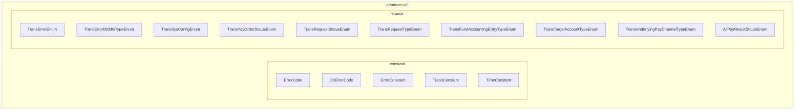
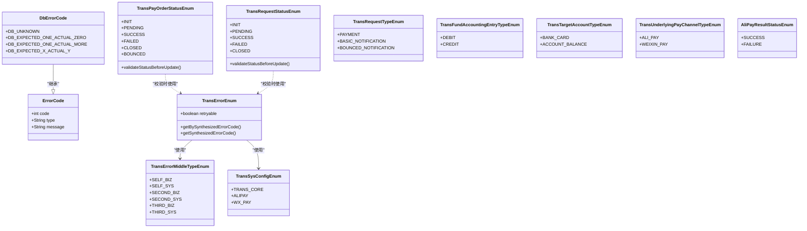
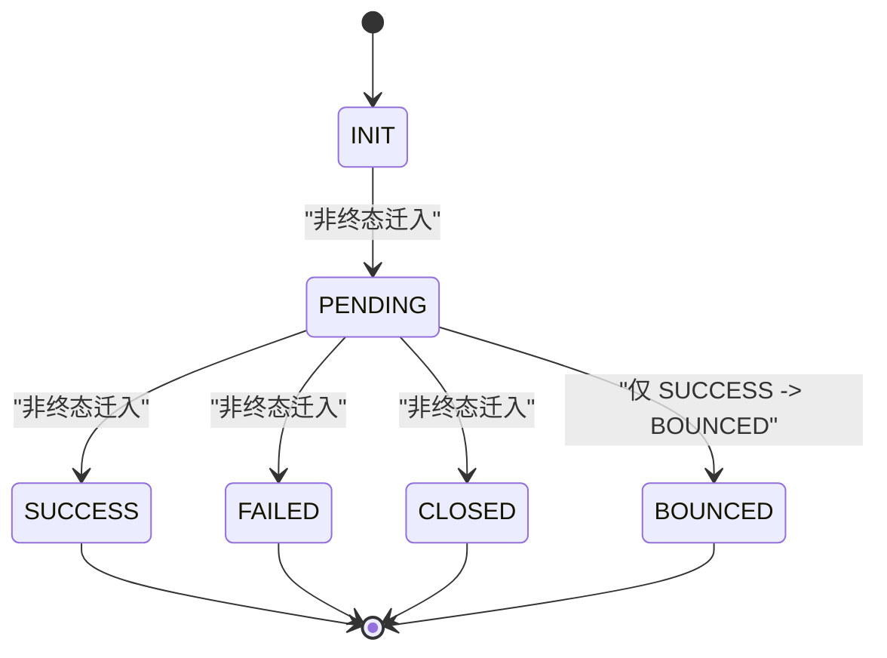
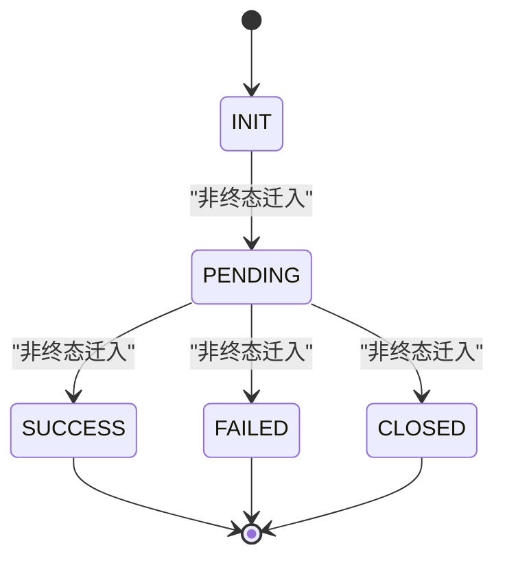
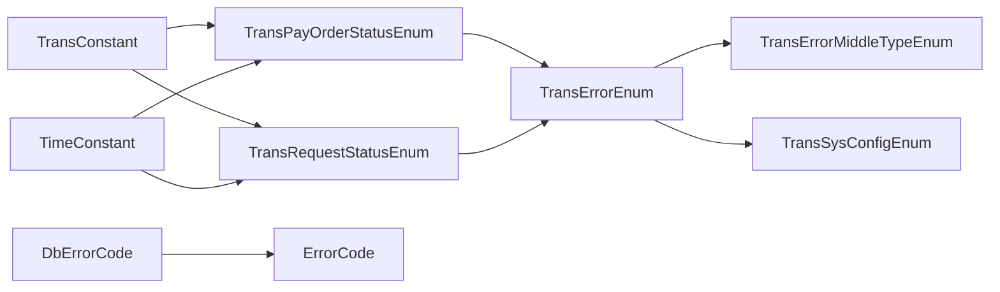

# 业务常量与枚举

<cite>
**本文引用的文件**
- [common-util/src/main/java/com/magicliang/transaction/sys/common/constant/ErrorCode.java](file://common-util/src/main/java/com/magicliang/transaction/sys/common/constant/ErrorCode.java)
- [common-util/src/main/java/com/magicliang/transaction/sys/common/constant/DbErrorCode.java](file://common-util/src/main/java/com/magicliang/transaction/sys/common/constant/DbErrorCode.java)
- [common-util/src/main/java/com/magicliang/transaction/sys/common/constant/ErrorConstant.java](file://common-util/src/main/java/com/magicliang/transaction/sys/common/constant/ErrorConstant.java)
- [common-util/src/main/java/com/magicliang/transaction/sys/common/constant/TransConstant.java](file://common-util/src/main/java/com/magicliang/transaction/sys/common/constant/TransConstant.java)
- [common-util/src/main/java/com/magicliang/transaction/sys/common/constant/TimeConstant.java](file://common-util/src/main/java/com/magicliang/transaction/sys/common/constant/TimeConstant.java)
- [common-util/src/main/java/com/magicliang/transaction/sys/common/enums/TransErrorEnum.java](file://common-util/src/main/java/com/magicliang/transaction/sys/common/enums/TransErrorEnum.java)
- [common-util/src/main/java/com/magicliang/transaction/sys/common/enums/TransErrorMiddleTypeEnum.java](file://common-util/src/main/java/com/magicliang/transaction/sys/common/enums/TransErrorMiddleTypeEnum.java)
- [common-util/src/main/java/com/magicliang/transaction/sys/common/enums/TransSysConfigEnum.java](file://common-util/src/main/java/com/magicliang/transaction/sys/common/enums/TransSysConfigEnum.java)
- [common-util/src/main/java/com/magicliang/transaction/sys/common/enums/TransPayOrderStatusEnum.java](file://common-util/src/main/java/com/magicliang/transaction/sys/common/enums/TransPayOrderStatusEnum.java)
- [common-util/src/main/java/com/magicliang/transaction/sys/common/enums/TransRequestStatusEnum.java](file://common-util/src/main/java/com/magicliang/transaction/sys/common/enums/TransRequestStatusEnum.java)
- [common-util/src/main/java/com/magicliang/transaction/sys/common/enums/TransRequestTypeEnum.java](file://common-util/src/main/java/com/magicliang/transaction/sys/common/enums/TransRequestTypeEnum.java)
- [common-util/src/main/java/com/magicliang/transaction/sys/common/enums/TransFundAccountingEntryTypeEnum.java](file://common-util/src/main/java/com/magicliang/transaction/sys/common/enums/TransFundAccountingEntryTypeEnum.java)
- [common-util/src/main/java/com/magicliang/transaction/sys/common/enums/TransTargetAccountTypeEnum.java](file://common-util/src/main/java/com/magicliang/transaction/sys/common/enums/TransTargetAccountTypeEnum.java)
- [common-util/src/main/java/com/magicliang/transaction/sys/common/enums/TransUnderlyingPayChannelTypeEnum.java](file://common-util/src/main/java/com/magicliang/transaction/sys/common/enums/TransUnderlyingPayChannelTypeEnum.java)
- [common-util/src/main/java/com/magicliang/transaction/sys/common/enums/AliPayResultStatusEnum.java](file://common-util/src/main/java/com/magicliang/transaction/sys/common/enums/AliPayResultStatusEnum.java)
</cite>

## 目录
1. [引言](#引言)
2. [项目结构](#项目结构)
3. [核心组件](#核心组件)
4. [架构总览](#架构总览)
5. [详细组件分析](#详细组件分析)
6. [依赖分析](#依赖分析)
7. [性能考虑](#性能考虑)
8. [故障排查指南](#故障排查指南)
9. [结论](#结论)
10. [附录](#附录)

## 引言
本指南聚焦于领域驱动交易系统中的业务常量与枚举，系统性梳理错误码常量体系（ErrorCode、DbErrorCode）、交易系统常量（TransConstant、TimeConstant）以及关键枚举类型（如 TransPayOrderStatusEnum、TransErrorEnum 等）。文档从概念到实现逐层展开，结合状态机与流程图，帮助开发者正确理解与使用这些常量与枚举，确保在支付、通知、资金记账等核心业务中保持一致、可维护且可扩展的语义表达。

## 项目结构
围绕“常量与枚举”的核心位置位于 common-util 模块，按职责划分为两类：
- 常量类：集中于 common/constant 包，包含通用错误码载体、数据库错误码、系统版本与时间常量等
- 枚举类：集中于 common/enums 包，覆盖交易错误、支付订单状态、请求状态与类型、资金会计分录方向、账户类型、底层支付通道、支付宝结果状态等

图表来源
- [common-util/src/main/java/com/magicliang/transaction/sys/common/constant/ErrorCode.java:1-46](file://common-util/src/main/java/com/magicliang/transaction/sys/common/constant/ErrorCode.java#L1-L46)
- [common-util/src/main/java/com/magicliang/transaction/sys/common/constant/DbErrorCode.java:1-47](file://common-util/src/main/java/com/magicliang/transaction/sys/common/constant/DbErrorCode.java#L1-L47)
- [common-util/src/main/java/com/magicliang/transaction/sys/common/constant/ErrorConstant.java:1-30](file://common-util/src/main/java/com/magicliang/transaction/sys/common/constant/ErrorConstant.java#L1-L30)
- [common-util/src/main/java/com/magicliang/transaction/sys/common/constant/TransConstant.java:1-27](file://common-util/src/main/java/com/magicliang/transaction/sys/common/constant/TransConstant.java#L1-L27)
- [common-util/src/main/java/com/magicliang/transaction/sys/common/constant/TimeConstant.java:1-32](file://common-util/src/main/java/com/magicliang/transaction/sys/common/constant/TimeConstant.java#L1-L32)
- [common-util/src/main/java/com/magicliang/transaction/sys/common/enums/TransErrorEnum.java:1-327](file://common-util/src/main/java/com/magicliang/transaction/sys/common/enums/TransErrorEnum.java#L1-L327)
- [common-util/src/main/java/com/magicliang/transaction/sys/common/enums/TransErrorMiddleTypeEnum.java:1-78](file://common-util/src/main/java/com/magicliang/transaction/sys/common/enums/TransErrorMiddleTypeEnum.java#L1-L78)
- [common-util/src/main/java/com/magicliang/transaction/sys/common/enums/TransSysConfigEnum.java:1-83](file://common-util/src/main/java/com/magicliang/transaction/sys/common/enums/TransSysConfigEnum.java#L1-L83)
- [common-util/src/main/java/com/magicliang/transaction/sys/common/enums/TransPayOrderStatusEnum.java:1-205](file://common-util/src/main/java/com/magicliang/transaction/sys/common/enums/TransPayOrderStatusEnum.java#L1-L205)
- [common-util/src/main/java/com/magicliang/transaction/sys/common/enums/TransRequestStatusEnum.java:1-163](file://common-util/src/main/java/com/magicliang/transaction/sys/common/enums/TransRequestStatusEnum.java#L1-L163)
- [common-util/src/main/java/com/magicliang/transaction/sys/common/enums/TransRequestTypeEnum.java:1-99](file://common-util/src/main/java/com/magicliang/transaction/sys/common/enums/TransRequestTypeEnum.java#L1-L99)
- [common-util/src/main/java/com/magicliang/transaction/sys/common/enums/TransFundAccountingEntryTypeEnum.java:1-78](file://common-util/src/main/java/com/magicliang/transaction/sys/common/enums/TransFundAccountingEntryTypeEnum.java#L1-L78)
- [common-util/src/main/java/com/magicliang/transaction/sys/common/enums/TransTargetAccountTypeEnum.java:1-78](file://common-util/src/main/java/com/magicliang/transaction/sys/common/enums/TransTargetAccountTypeEnum.java#L1-L78)
- [common-util/src/main/java/com/magicliang/transaction/sys/common/enums/TransUnderlyingPayChannelTypeEnum.java:1-82](file://common-util/src/main/java/com/magicliang/transaction/sys/common/enums/TransUnderlyingPayChannelTypeEnum.java#L1-L82)
- [common-util/src/main/java/com/magicliang/transaction/sys/common/enums/AliPayResultStatusEnum.java:1-62](file://common-util/src/main/java/com/magicliang/transaction/sys/common/enums/AliPayResultStatusEnum.java#L1-L62)

章节来源
- [common-util/src/main/java/com/magicliang/transaction/sys/common/constant/ErrorCode.java:1-46](file://common-util/src/main/java/com/magicliang/transaction/sys/common/constant/ErrorCode.java#L1-L46)
- [common-util/src/main/java/com/magicliang/transaction/sys/common/constant/DbErrorCode.java:1-47](file://common-util/src/main/java/com/magicliang/transaction/sys/common/constant/DbErrorCode.java#L1-L47)
- [common-util/src/main/java/com/magicliang/transaction/sys/common/constant/ErrorConstant.java:1-30](file://common-util/src/main/java/com/magicliang/transaction/sys/common/constant/ErrorConstant.java#L1-L30)
- [common-util/src/main/java/com/magicliang/transaction/sys/common/constant/TransConstant.java:1-27](file://common-util/src/main/java/com/magicliang/transaction/sys/common/constant/TransConstant.java#L1-L27)
- [common-util/src/main/java/com/magicliang/transaction/sys/common/constant/TimeConstant.java:1-32](file://common-util/src/main/java/com/magicliang/transaction/sys/common/constant/TimeConstant.java#L1-L32)
- [common-util/src/main/java/com/magicliang/transaction/sys/common/enums/TransErrorEnum.java:1-327](file://common-util/src/main/java/com/magicliang/transaction/sys/common/enums/TransErrorEnum.java#L1-L327)
- [common-util/src/main/java/com/magicliang/transaction/sys/common/enums/TransErrorMiddleTypeEnum.java:1-78](file://common-util/src/main/java/com/magicliang/transaction/sys/common/enums/TransErrorMiddleTypeEnum.java#L1-L78)
- [common-util/src/main/java/com/magicliang/transaction/sys/common/enums/TransSysConfigEnum.java:1-83](file://common-util/src/main/java/com/magicliang/transaction/sys/common/enums/TransSysConfigEnum.java#L1-L83)
- [common-util/src/main/java/com/magicliang/transaction/sys/common/enums/TransPayOrderStatusEnum.java:1-205](file://common-util/src/main/java/com/magicliang/transaction/sys/common/enums/TransPayOrderStatusEnum.java#L1-L205)
- [common-util/src/main/java/com/magicliang/transaction/sys/common/enums/TransRequestStatusEnum.java:1-163](file://common-util/src/main/java/com/magicliang/transaction/sys/common/enums/TransRequestStatusEnum.java#L1-L163)
- [common-util/src/main/java/com/magicliang/transaction/sys/common/enums/TransRequestTypeEnum.java:1-99](file://common-util/src/main/java/com/magicliang/transaction/sys/common/enums/TransRequestTypeEnum.java#L1-L99)
- [common-util/src/main/java/com/magicliang/transaction/sys/common/enums/TransFundAccountingEntryTypeEnum.java:1-78](file://common-util/src/main/java/com/magicliang/transaction/sys/common/enums/TransFundAccountingEntryTypeEnum.java#L1-L78)
- [common-util/src/main/java/com/magicliang/transaction/sys/common/enums/TransTargetAccountTypeEnum.java:1-78](file://common-util/src/main/java/com/magicliang/transaction/sys/common/enums/TransTargetAccountTypeEnum.java#L1-L78)
- [common-util/src/main/java/com/magicliang/transaction/sys/common/enums/TransUnderlyingPayChannelTypeEnum.java:1-82](file://common-util/src/main/java/com/magicliang/transaction/sys/common/enums/TransUnderlyingPayChannelTypeEnum.java#L1-L82)
- [common-util/src/main/java/com/magicliang/transaction/sys/common/enums/AliPayResultStatusEnum.java:1-62](file://common-util/src/main/java/com/magicliang/transaction/sys/common/enums/AliPayResultStatusEnum.java#L1-L62)

## 核心组件
- 错误码载体与数据库错误码
  - ErrorCode：统一承载错误码、错误类型与错误信息的轻量对象
  - DbErrorCode：继承自 ErrorCode，提供数据库操作相关的具体错误码常量
- 错误常量与交易常量
  - ErrorConstant：提供错误信息拼接的常量前缀
  - TransConstant：提供系统初始化版本号等交易域常量
  - TimeConstant：提供时间相关常量（如分钟到秒换算、默认执行间隔）
- 交易错误枚举与中间类型
  - TransErrorEnum：聚合所有交易错误，含中间类型与是否可重试标记，并提供合成错误码能力
  - TransErrorMiddleTypeEnum：划分错误的中间类型（本系统业务/系统、第二方/第三方等）
  - TransSysConfigEnum：系统配置标识（如交易核心、支付宝、微信支付）
- 交易状态与类型枚举
  - TransPayOrderStatusEnum：支付订单状态（INIT/PENDING/SUCCESS/FAILED/CLOSED/BOUNCED），含终态判断与状态迁移校验
  - TransRequestStatusEnum：交易请求状态（INIT/PENDING/SUCCESS/FAILED/CLOSED），含终态判断与迁移校验
  - TransRequestTypeEnum：交易请求类型（PAYMENT/BASIC_NOTIFICATION/BOUNCED_NOTIFICATION），含通知类型集合与优先级语义
- 资金与账户、底层通道、支付宝结果状态
  - TransFundAccountingEntryTypeEnum：借/贷方向
  - TransTargetAccountTypeEnum：目标账户类型（银行卡/账户余额）
  - TransUnderlyingPayChannelTypeEnum：底层支付通道（支付宝/微信支付）及其调用地址
  - AliPayResultStatusEnum：支付宝支付结果状态（成功/不成功）

章节来源
- [common-util/src/main/java/com/magicliang/transaction/sys/common/constant/ErrorCode.java:1-46](file://common-util/src/main/java/com/magicliang/transaction/sys/common/constant/ErrorCode.java#L1-L46)
- [common-util/src/main/java/com/magicliang/transaction/sys/common/constant/DbErrorCode.java:1-47](file://common-util/src/main/java/com/magicliang/transaction/sys/common/constant/DbErrorCode.java#L1-L47)
- [common-util/src/main/java/com/magicliang/transaction/sys/common/constant/ErrorConstant.java:1-30](file://common-util/src/main/java/com/magicliang/transaction/sys/common/constant/ErrorConstant.java#L1-L30)
- [common-util/src/main/java/com/magicliang/transaction/sys/common/constant/TransConstant.java:1-27](file://common-util/src/main/java/com/magicliang/transaction/sys/common/constant/TransConstant.java#L1-L27)
- [common-util/src/main/java/com/magicliang/transaction/sys/common/constant/TimeConstant.java:1-32](file://common-util/src/main/java/com/magicliang/transaction/sys/common/constant/TimeConstant.java#L1-L32)
- [common-util/src/main/java/com/magicliang/transaction/sys/common/enums/TransErrorEnum.java:1-327](file://common-util/src/main/java/com/magicliang/transaction/sys/common/enums/TransErrorEnum.java#L1-L327)
- [common-util/src/main/java/com/magicliang/transaction/sys/common/enums/TransErrorMiddleTypeEnum.java:1-78](file://common-util/src/main/java/com/magicliang/transaction/sys/common/enums/TransErrorMiddleTypeEnum.java#L1-L78)
- [common-util/src/main/java/com/magicliang/transaction/sys/common/enums/TransSysConfigEnum.java:1-83](file://common-util/src/main/java/com/magicliang/transaction/sys/common/enums/TransSysConfigEnum.java#L1-L83)
- [common-util/src/main/java/com/magicliang/transaction/sys/common/enums/TransPayOrderStatusEnum.java:1-205](file://common-util/src/main/java/com/magicliang/transaction/sys/common/enums/TransPayOrderStatusEnum.java#L1-L205)
- [common-util/src/main/java/com/magicliang/transaction/sys/common/enums/TransRequestStatusEnum.java:1-163](file://common-util/src/main/java/com/magicliang/transaction/sys/common/enums/TransRequestStatusEnum.java#L1-L163)
- [common-util/src/main/java/com/magicliang/transaction/sys/common/enums/TransRequestTypeEnum.java:1-99](file://common-util/src/main/java/com/magicliang/transaction/sys/common/enums/TransRequestTypeEnum.java#L1-L99)
- [common-util/src/main/java/com/magicliang/transaction/sys/common/enums/TransFundAccountingEntryTypeEnum.java:1-78](file://common-util/src/main/java/com/magicliang/transaction/sys/common/enums/TransFundAccountingEntryTypeEnum.java#L1-L78)
- [common-util/src/main/java/com/magicliang/transaction/sys/common/enums/TransTargetAccountTypeEnum.java:1-78](file://common-util/src/main/java/com/magicliang/transaction/sys/common/enums/TransTargetAccountTypeEnum.java#L1-L78)
- [common-util/src/main/java/com/magicliang/transaction/sys/common/enums/TransUnderlyingPayChannelTypeEnum.java:1-82](file://common-util/src/main/java/com/magicliang/transaction/sys/common/enums/TransUnderlyingPayChannelTypeEnum.java#L1-L82)
- [common-util/src/main/java/com/magicliang/transaction/sys/common/enums/AliPayResultStatusEnum.java:1-62](file://common-util/src/main/java/com/magicliang/transaction/sys/common/enums/AliPayResultStatusEnum.java#L1-L62)

## 架构总览
下图展示错误码与枚举之间的关系及在系统中的定位：

图表来源
- [common-util/src/main/java/com/magicliang/transaction/sys/common/constant/ErrorCode.java:1-46](file://common-util/src/main/java/com/magicliang/transaction/sys/common/constant/ErrorCode.java#L1-L46)
- [common-util/src/main/java/com/magicliang/transaction/sys/common/constant/DbErrorCode.java:1-47](file://common-util/src/main/java/com/magicliang/transaction/sys/common/constant/DbErrorCode.java#L1-L47)
- [common-util/src/main/java/com/magicliang/transaction/sys/common/enums/TransErrorEnum.java:1-327](file://common-util/src/main/java/com/magicliang/transaction/sys/common/enums/TransErrorEnum.java#L1-L327)
- [common-util/src/main/java/com/magicliang/transaction/sys/common/enums/TransErrorMiddleTypeEnum.java:1-78](file://common-util/src/main/java/com/magicliang/transaction/sys/common/enums/TransErrorMiddleTypeEnum.java#L1-L78)
- [common-util/src/main/java/com/magicliang/transaction/sys/common/enums/TransSysConfigEnum.java:1-83](file://common-util/src/main/java/com/magicliang/transaction/sys/common/enums/TransSysConfigEnum.java#L1-L83)
- [common-util/src/main/java/com/magicliang/transaction/sys/common/enums/TransPayOrderStatusEnum.java:1-205](file://common-util/src/main/java/com/magicliang/transaction/sys/common/enums/TransPayOrderStatusEnum.java#L1-L205)
- [common-util/src/main/java/com/magicliang/transaction/sys/common/enums/TransRequestStatusEnum.java:1-163](file://common-util/src/main/java/com/magicliang/transaction/sys/common/enums/TransRequestStatusEnum.java#L1-L163)
- [common-util/src/main/java/com/magicliang/transaction/sys/common/enums/TransRequestTypeEnum.java:1-99](file://common-util/src/main/java/com/magicliang/transaction/sys/common/enums/TransRequestTypeEnum.java#L1-L99)
- [common-util/src/main/java/com/magicliang/transaction/sys/common/enums/TransFundAccountingEntryTypeEnum.java:1-78](file://common-util/src/main/java/com/magicliang/transaction/sys/common/enums/TransFundAccountingEntryTypeEnum.java#L1-L78)
- [common-util/src/main/java/com/magicliang/transaction/sys/common/enums/TransTargetAccountTypeEnum.java:1-78](file://common-util/src/main/java/com/magicliang/transaction/sys/common/enums/TransTargetAccountTypeEnum.java#L1-L78)
- [common-util/src/main/java/com/magicliang/transaction/sys/common/enums/TransUnderlyingPayChannelTypeEnum.java:1-82](file://common-util/src/main/java/com/magicliang/transaction/sys/common/enums/TransUnderlyingPayChannelTypeEnum.java#L1-L82)
- [common-util/src/main/java/com/magicliang/transaction/sys/common/enums/AliPayResultStatusEnum.java:1-62](file://common-util/src/main/java/com/magicliang/transaction/sys/common/enums/AliPayResultStatusEnum.java#L1-L62)

## 详细组件分析

### 错误码常量体系（ErrorCode、DbErrorCode、TransErrorEnum）
- 设计要点
  - ErrorCode 提供统一的错误载体，包含 code、type、message 字段，便于跨模块传递与序列化
  - DbErrorCode 在其父类基础上，提供数据库操作相关的具体错误码常量，便于对数据库层面的异常进行标准化
  - TransErrorEnum 将错误细分为“本系统业务/系统”、“第二方/第三方”等中间类型，配合 TransSysConfigEnum 与中间类型共同合成全局唯一错误码字符串；同时提供 retryable 标记，用于控制重试策略
- 使用建议
  - 业务层在抛出或封装异常时，优先使用 TransErrorEnum 提供的标准错误项，避免散落的字符串错误码
  - 对数据库异常，优先使用 DbErrorCode 中的具体常量，便于统一监控与告警
  - 合成错误码时，遵循 TransSysConfigEnum + TransErrorMiddleTypeEnum + 具体内码 的组合规则，保证全局唯一性

章节来源
- [common-util/src/main/java/com/magicliang/transaction/sys/common/constant/ErrorCode.java:1-46](file://common-util/src/main/java/com/magicliang/transaction/sys/common/constant/ErrorCode.java#L1-L46)
- [common-util/src/main/java/com/magicliang/transaction/sys/common/constant/DbErrorCode.java:1-47](file://common-util/src/main/java/com/magicliang/transaction/sys/common/constant/DbErrorCode.java#L1-L47)
- [common-util/src/main/java/com/magicliang/transaction/sys/common/enums/TransErrorEnum.java:1-327](file://common-util/src/main/java/com/magicliang/transaction/sys/common/enums/TransErrorEnum.java#L1-L327)
- [common-util/src/main/java/com/magicliang/transaction/sys/common/enums/TransErrorMiddleTypeEnum.java:1-78](file://common-util/src/main/java/com/magicliang/transaction/sys/common/enums/TransErrorMiddleTypeEnum.java#L1-L78)
- [common-util/src/main/java/com/magicliang/transaction/sys/common/enums/TransSysConfigEnum.java:1-83](file://common-util/src/main/java/com/magicliang/transaction/sys/common/enums/TransSysConfigEnum.java#L1-L83)

### 交易系统常量（TransConstant、TimeConstant）
- TransConstant
  - 提供系统初始化版本号常量，用于实体版本管理与并发控制
- TimeConstant
  - 提供时间换算与默认执行间隔等常量，便于定时任务与批处理策略的一致化配置
- 使用建议
  - 版本号常量应贯穿持久化实体的版本字段，配合乐观锁或幂等校验
  - 执行间隔等时间常量应在配置中心或枚举中统一管理，避免魔法数

章节来源
- [common-util/src/main/java/com/magicliang/transaction/sys/common/constant/TransConstant.java:1-27](file://common-util/src/main/java/com/magicliang/transaction/sys/common/constant/TransConstant.java#L1-L27)
- [common-util/src/main/java/com/magicliang/transaction/sys/common/constant/TimeConstant.java:1-32](file://common-util/src/main/java/com/magicliang/transaction/sys/common/constant/TimeConstant.java#L1-L32)

### 支付订单状态（TransPayOrderStatusEnum）
- 状态定义
  - INIT/PENDING：未支付态
  - SUCCESS：支付成功（终态）
  - FAILED/CLOSED/BOUNCED：失败/关闭/退票（坏终态）
- 状态机与迁移规则
  - 仅允许从非终态迁移到新状态
  - INIT 只能回到 INIT
  - PENDING 只能由非终态迁入
  - BOUNCED 只能由 SUCCESS 跃迁
  - 其他终态只能由非终态迁入
- 辅助工具
  - isFinalStatus/isSuccessFinalStatus/isBadFinalStatus/isBounced 用于快速判定
  - validateStatusBeforeUpdate 提供集中式校验入口，结合 ErrorConstant 与 TransErrorEnum 抛出明确错误

图表来源
- [common-util/src/main/java/com/magicliang/transaction/sys/common/enums/TransPayOrderStatusEnum.java:1-205](file://common-util/src/main/java/com/magicliang/transaction/sys/common/enums/TransPayOrderStatusEnum.java#L1-L205)

章节来源
- [common-util/src/main/java/com/magicliang/transaction/sys/common/enums/TransPayOrderStatusEnum.java:1-205](file://common-util/src/main/java/com/magicliang/transaction/sys/common/enums/TransPayOrderStatusEnum.java#L1-L205)
- [common-util/src/main/java/com/magicliang/transaction/sys/common/constant/ErrorConstant.java:1-30](file://common-util/src/main/java/com/magicliang/transaction/sys/common/constant/ErrorConstant.java#L1-L30)
- [common-util/src/main/java/com/magicliang/transaction/sys/common/enums/TransErrorEnum.java:1-327](file://common-util/src/main/java/com/magicliang/transaction/sys/common/enums/TransErrorEnum.java#L1-L327)

### 交易请求状态（TransRequestStatusEnum）
- 状态定义
  - INIT/PENDING：未发送/发送中
  - SUCCESS：受理成功（终态）
  - FAILED：可重试失败
  - CLOSED：被关闭（终态）
- 迁移规则
  - 仅允许从非终态迁移到新状态
  - INIT 只能回到 INIT
  - PENDING/FAILED 只能由非终态迁入
  - SUCCESS/CLOSED 只能由非终态迁入

图表来源
- [common-util/src/main/java/com/magicliang/transaction/sys/common/enums/TransRequestStatusEnum.java:1-163](file://common-util/src/main/java/com/magicliang/transaction/sys/common/enums/TransRequestStatusEnum.java#L1-L163)

章节来源
- [common-util/src/main/java/com/magicliang/transaction/sys/common/enums/TransRequestStatusEnum.java:1-163](file://common-util/src/main/java/com/magicliang/transaction/sys/common/enums/TransRequestStatusEnum.java#L1-L163)
- [common-util/src/main/java/com/magicliang/transaction/sys/common/constant/ErrorConstant.java:1-30](file://common-util/src/main/java/com/magicliang/transaction/sys/common/constant/ErrorConstant.java#L1-L30)
- [common-util/src/main/java/com/magicliang/transaction/sys/common/enums/TransErrorEnum.java:1-327](file://common-util/src/main/java/com/magicliang/transaction/sys/common/enums/TransErrorEnum.java#L1-L327)

### 交易请求类型（TransRequestTypeEnum）
- 类型定义
  - PAYMENT：支付请求
  - BASIC_NOTIFICATION：支付订单终态基础通知
  - BOUNCED_NOTIFICATION：支付订单退票通知
- 使用建议
  - 通知类型集合可用于过滤与优先级排序
  - code 的大小顺序体现了请求发送优先级，需在调度策略中体现

章节来源
- [common-util/src/main/java/com/magicliang/transaction/sys/common/enums/TransRequestTypeEnum.java:1-99](file://common-util/src/main/java/com/magicliang/transaction/sys/common/enums/TransRequestTypeEnum.java#L1-L99)

### 资金会计条目（TransFundAccountingEntryTypeEnum）
- 方向定义
  - DEBIT：借
  - CREDIT：贷
- 使用建议
  - 记账时严格区分借贷方向，确保会计平衡

章节来源
- [common-util/src/main/java/com/magicliang/transaction/sys/common/enums/TransFundAccountingEntryTypeEnum.java:1-78](file://common-util/src/main/java/com/magicliang/transaction/sys/common/enums/TransFundAccountingEntryTypeEnum.java#L1-L78)

### 目标账户类型（TransTargetAccountTypeEnum）
- 类型定义
  - BANK_CARD：银行卡
  - ACCOUNT_BALANCE：账户余额
- 使用建议
  - 在资金结算与对账时，依据目标账户类型选择不同的结算路径与风控策略

章节来源
- [common-util/src/main/java/com/magicliang/transaction/sys/common/enums/TransTargetAccountTypeEnum.java:1-78](file://common-util/src/main/java/com/magicliang/transaction/sys/common/enums/TransTargetAccountTypeEnum.java#L1-L78)

### 底层支付通道（TransUnderlyingPayChannelTypeEnum）
- 通道定义
  - ALI_PAY：支付宝
  - WEIXIN_PAY：微信支付
- 使用建议
  - 通道枚举中包含调用地址，便于路由与容错
  - 与上游渠道对接时，应以枚举为准，避免硬编码

章节来源
- [common-util/src/main/java/com/magicliang/transaction/sys/common/enums/TransUnderlyingPayChannelTypeEnum.java:1-82](file://common-util/src/main/java/com/magicliang/transaction/sys/common/enums/TransUnderlyingPayChannelTypeEnum.java#L1-L82)

### 支付宝结果状态（AliPayResultStatusEnum）
- 状态定义
  - SUCCESS：成功
  - FAILURE：不成功
- 使用建议
  - 通过静态映射表快速查询状态枚举，减少分支判断

章节来源
- [common-util/src/main/java/com/magicliang/transaction/sys/common/enums/AliPayResultStatusEnum.java:1-62](file://common-util/src/main/java/com/magicliang/transaction/sys/common/enums/AliPayResultStatusEnum.java#L1-L62)

## 依赖分析
- 枚举之间的耦合
  - TransPayOrderStatusEnum 与 TransRequestStatusEnum 在状态迁移校验时依赖 TransErrorEnum 与 ErrorConstant
  - TransErrorEnum 依赖 TransErrorMiddleTypeEnum 与 TransSysConfigEnum 来合成全局错误码
- 常量与枚举的协作
  - DbErrorCode 作为 ErrorCode 的子类，直接服务于数据库异常场景
  - TransConstant 与 TimeConstant 为各业务流程提供统一的版本与时间语义
- 外部依赖
  - 枚举内部使用了静态导入与工具类（如断言工具），确保错误信息与状态迁移的严谨性

图表来源
- [common-util/src/main/java/com/magicliang/transaction/sys/common/enums/TransPayOrderStatusEnum.java:1-205](file://common-util/src/main/java/com/magicliang/transaction/sys/common/enums/TransPayOrderStatusEnum.java#L1-L205)
- [common-util/src/main/java/com/magicliang/transaction/sys/common/enums/TransRequestStatusEnum.java:1-163](file://common-util/src/main/java/com/magicliang/transaction/sys/common/enums/TransRequestStatusEnum.java#L1-L163)
- [common-util/src/main/java/com/magicliang/transaction/sys/common/enums/TransErrorEnum.java:1-327](file://common-util/src/main/java/com/magicliang/transaction/sys/common/enums/TransErrorEnum.java#L1-L327)
- [common-util/src/main/java/com/magicliang/transaction/sys/common/enums/TransErrorMiddleTypeEnum.java:1-78](file://common-util/src/main/java/com/magicliang/transaction/sys/common/enums/TransErrorMiddleTypeEnum.java#L1-L78)
- [common-util/src/main/java/com/magicliang/transaction/sys/common/enums/TransSysConfigEnum.java:1-83](file://common-util/src/main/java/com/magicliang/transaction/sys/common/enums/TransSysConfigEnum.java#L1-L83)
- [common-util/src/main/java/com/magicliang/transaction/sys/common/constant/DbErrorCode.java:1-47](file://common-util/src/main/java/com/magicliang/transaction/sys/common/constant/DbErrorCode.java#L1-L47)
- [common-util/src/main/java/com/magicliang/transaction/sys/common/constant/ErrorCode.java:1-46](file://common-util/src/main/java/com/magicliang/transaction/sys/common/constant/ErrorCode.java#L1-L46)
- [common-util/src/main/java/com/magicliang/transaction/sys/common/constant/TransConstant.java:1-27](file://common-util/src/main/java/com/magicliang/transaction/sys/common/constant/TransConstant.java#L1-L27)
- [common-util/src/main/java/com/magicliang/transaction/sys/common/constant/TimeConstant.java:1-32](file://common-util/src/main/java/com/magicliang/transaction/sys/common/constant/TimeConstant.java#L1-L32)

## 性能考虑
- 枚举查找与映射
  - AliPayResultStatusEnum 内置不可变映射表，避免重复遍历，提升查询性能
- 状态迁移校验
  - TransPayOrderStatusEnum 与 TransRequestStatusEnum 的 validateStatusBeforeUpdate 采用短路断言，减少无效分支
- 常量复用
  - TransConstant 与 TimeConstant 作为静态常量，避免重复计算与对象创建

## 故障排查指南
- 错误码合成与定位
  - 若出现未知错误码，可通过 TransErrorEnum.getBySynthesizedErrorCode 定位对应枚举项，核对中间类型与具体错误码
- 数据库异常处理
  - 遇到数据库操作异常，优先检查 DbErrorCode 常量，确认是否为期望条数与实际条数不匹配等问题
- 状态迁移异常
  - 当支付订单或请求状态迁移失败时，查看 validateStatusBeforeUpdate 的断言提示，结合 ErrorConstant 的前缀信息定位问题
- 重试策略
  - 通过 TransErrorEnum.retryable 字段判断是否可重试，避免对不可重试错误进行盲目重试

章节来源
- [common-util/src/main/java/com/magicliang/transaction/sys/common/enums/TransErrorEnum.java:1-327](file://common-util/src/main/java/com/magicliang/transaction/sys/common/enums/TransErrorEnum.java#L1-L327)
- [common-util/src/main/java/com/magicliang/transaction/sys/common/constant/DbErrorCode.java:1-47](file://common-util/src/main/java/com/magicliang/transaction/sys/common/constant/DbErrorCode.java#L1-L47)
- [common-util/src/main/java/com/magicliang/transaction/sys/common/enums/TransPayOrderStatusEnum.java:1-205](file://common-util/src/main/java/com/magicliang/transaction/sys/common/enums/TransPayOrderStatusEnum.java#L1-L205)
- [common-util/src/main/java/com/magicliang/transaction/sys/common/enums/TransRequestStatusEnum.java:1-163](file://common-util/src/main/java/com/magicliang/transaction/sys/common/enums/TransRequestStatusEnum.java#L1-L163)
- [common-util/src/main/java/com/magicliang/transaction/sys/common/constant/ErrorConstant.java:1-30](file://common-util/src/main/java/com/magicliang/transaction/sys/common/constant/ErrorConstant.java#L1-L30)

## 结论
本指南系统梳理了交易系统中的常量与枚举，明确了错误码体系、状态机规则与关键业务语义。通过统一的错误码合成机制、严谨的状态迁移校验与清晰的业务枚举边界，开发者可以在复杂交易场景中保持一致性与可维护性。建议在新增业务时，优先复用现有枚举与常量，避免重复造轮子；在扩展错误类型时，遵循中间类型与可重试标记的约定，确保可观测与可治理。

## 附录
- 最佳实践清单
  - 使用 TransErrorEnum 作为错误定义的唯一来源，避免散落的字符串错误码
  - 使用 DbErrorCode 处理数据库异常，确保异常语义标准化
  - 在状态迁移时调用 validateStatusBeforeUpdate，统一错误提示与日志
  - 对可重试错误设置 retryable 标记，配合重试策略与熔断机制
  - 使用 TransConstant 与 TimeConstant 管理版本与时间，避免魔法数
  - 在支付通道与账户类型选择上，以枚举为准，确保一致性与可测试性