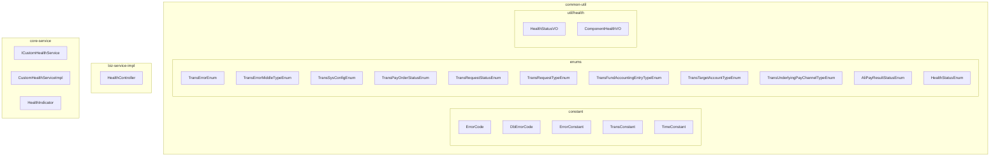
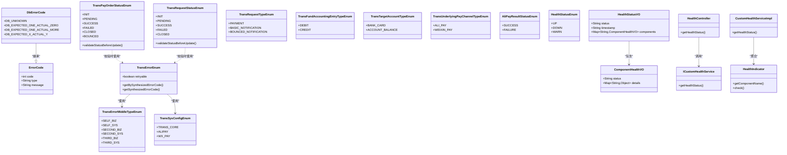
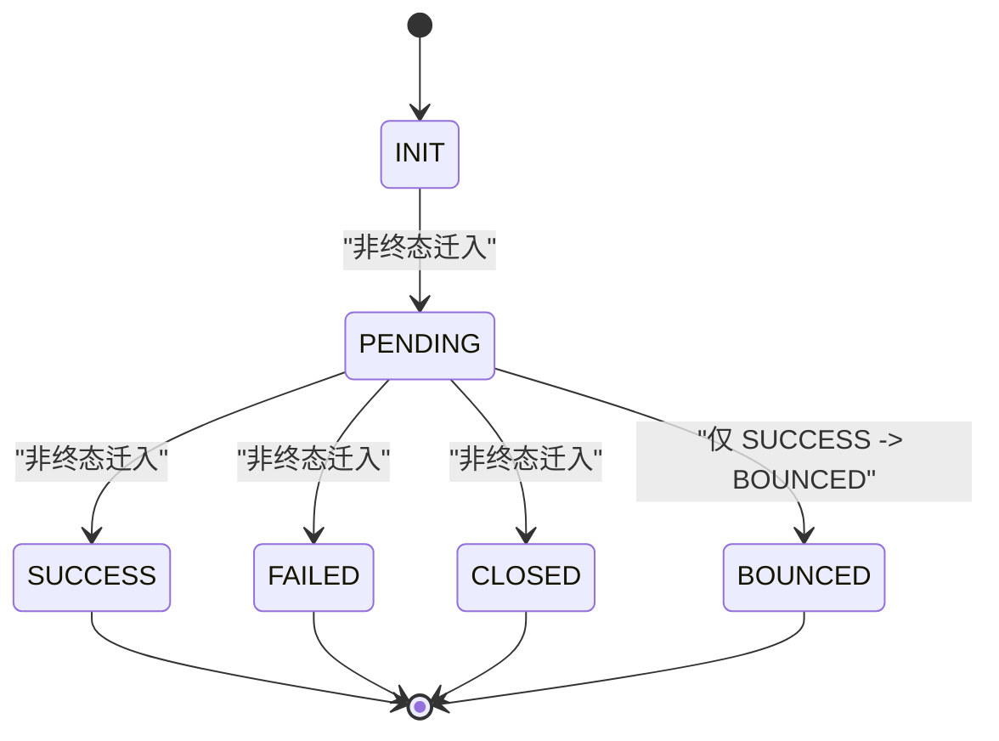
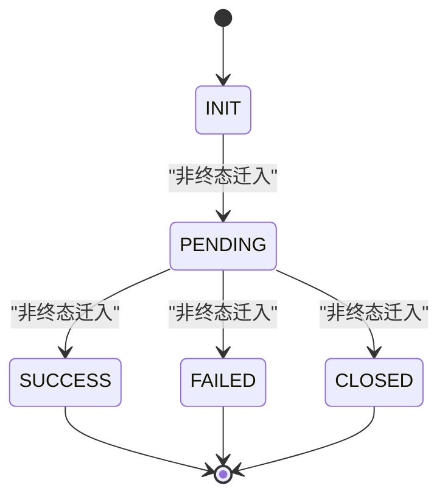
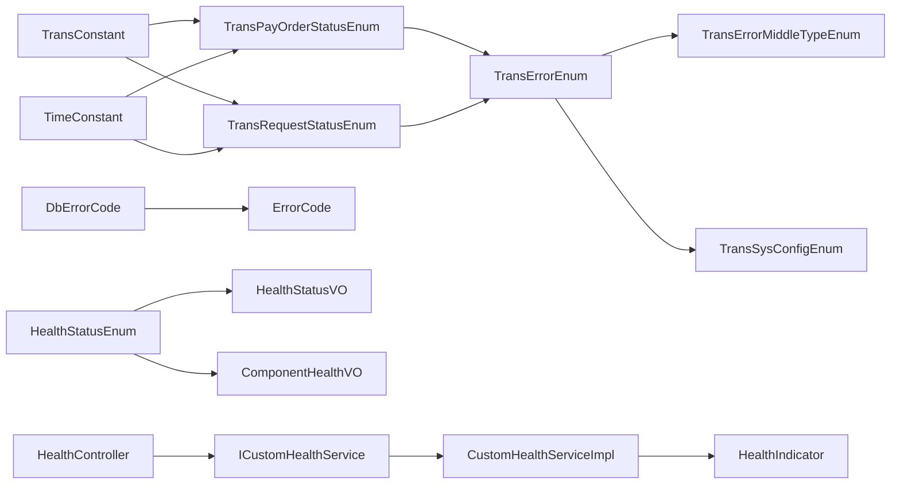

# 业务常量与枚举

<cite>
**本文引用的文件**
- [common-util/src/main/java/com/magicliang/transaction/sys/common/constant/ErrorCode.java](file://common-util/src/main/java/com/magicliang/transaction/sys/common/constant/ErrorCode.java)
- [common-util/src/main/java/com/magicliang/transaction/sys/common/constant/DbErrorCode.java](file://common-util/src/main/java/com/magicliang/transaction/sys/common/constant/DbErrorCode.java)
- [common-util/src/main/java/com/magicliang/transaction/sys/common/constant/ErrorConstant.java](file://common-util/src/main/java/com/magicliang/transaction/sys/common/constant/ErrorConstant.java)
- [common-util/src/main/java/com/magicliang/transaction/sys/common/constant/TransConstant.java](file://common-util/src/main/java/com/magicliang/transaction/sys/common/constant/TransConstant.java)
- [common-util/src/main/java/com/magicliang/transaction/sys/common/constant/TimeConstant.java](file://common-util/src/main/java/com/magicliang/transaction/sys/common/constant/TimeConstant.java)
- [common-util/src/main/java/com/magicliang/transaction/sys/common/enums/TransErrorEnum.java](file://common-util/src/main/java/com/magicliang/transaction/sys/common/enums/TransErrorEnum.java)
- [common-util/src/main/java/com/magicliang/transaction/sys/common/enums/TransErrorMiddleTypeEnum.java](file://common-util/src/main/java/com/magicliang/transaction/sys/common/enums/TransErrorMiddleTypeEnum.java)
- [common-util/src/main/java/com/magicliang/transaction/sys/common/enums/TransSysConfigEnum.java](file://common-util/src/main/java/com/magicliang/transaction/sys/common/enums/TransSysConfigEnum.java)
- [common-util/src/main/java/com/magicliang/transaction/sys/common/enums/TransPayOrderStatusEnum.java](file://common-util/src/main/java/com/magicliang/transaction/sys/common/enums/TransPayOrderStatusEnum.java)
- [common-util/src/main/java/com/magicliang/transaction/sys/common/enums/TransRequestStatusEnum.java](file://common-util/src/main/java/com/magicliang/transaction/sys/common/enums/TransRequestStatusEnum.java)
- [common-util/src/main/java/com/magicliang/transaction/sys/common/enums/TransRequestTypeEnum.java](file://common-util/src/main/java/com/magicliang/transaction/sys/common/enums/TransRequestTypeEnum.java)
- [common-util/src/main/java/com/magicliang/transaction/sys/common/enums/TransFundAccountingEntryTypeEnum.java](file://common-util/src/main/java/com/magicliang/transaction/sys/common/enums/TransFundAccountingEntryTypeEnum.java)
- [common-util/src/main/java/com/magicliang/transaction/sys/common/enums/TransTargetAccountTypeEnum.java](file://common-util/src/main/java/com/magicliang/transaction/sys/common/enums/TransTargetAccountTypeEnum.java)
- [common-util/src/main/java/com/magicliang/transaction/sys/common/enums/TransUnderlyingPayChannelTypeEnum.java](file://common-util/src/main/java/com/magicliang/transaction/sys/common/enums/TransUnderlyingPayChannelTypeEnum.java)
- [common-util/src/main/java/com/magicliang/transaction/sys/common/enums/AliPayResultStatusEnum.java](file://common-util/src/main/java/com/magicliang/transaction/sys/common/enums/AliPayResultStatusEnum.java)
- [common-util/src/main/java/com/magicliang/transaction/sys/common/enums/HealthStatusEnum.java](file://common-util/src/main/java/com/magicliang/transaction/sys/common/enums/HealthStatusEnum.java)
- [common-util/src/main/java/com/magicliang/transaction/sys/common/util/health/HealthStatusVO.java](file://common-util/src/main/java/com/magicliang/transaction/sys/common/util/health/HealthStatusVO.java)
- [common-util/src/main/java/com/magicliang/transaction/sys/common/util/health/ComponentHealthVO.java](file://common-util/src/main/java/com/magicliang/transaction/sys/common/util/health/ComponentHealthVO.java)
- [biz-service-impl/src/main/java/com/magicliang/transaction/sys/biz/service/impl/web/controller/HealthController.java](file://biz-service-impl/src/main/java/com/magicliang/transaction/sys/biz/service/impl/web/controller/HealthController.java)
- [core-service/src/main/java/com/magicliang/transaction/sys/core/service/ICustomHealthService.java](file://core-service/src/main/java/com/magicliang/transaction/sys/core/service/ICustomHealthService.java)
- [core-service/src/main/java/com/magicliang/transaction/sys/core/service/impl/CustomHealthServiceImpl.java](file://core-service/src/main/java/com/magicliang/transaction/sys/core/service/impl/CustomHealthServiceImpl.java)
- [core-service/src/main/java/com/magicliang/transaction/sys/core/service/HealthIndicator.java](file://core-service/src/main/java/com/magicliang/transaction/sys/core/service/HealthIndicator.java)
</cite>

## 更新摘要
**所做更改**
- 新增健康检查值对象章节，详细介绍 HealthStatusVO 和 ComponentHealthVO 的设计与使用
- 新增健康状态枚举 HealthStatusEnum 的说明
- 新增健康检查服务架构分析，包括 HealthController、ICustomHealthService、CustomHealthServiceImpl 和 HealthIndicator 接口
- 更新架构总览图，增加健康检查相关组件
- 新增健康检查最佳实践和故障排查指南

## 目录
1. [引言](#引言)
2. [项目结构](#项目结构)
3. [核心组件](#核心组件)
4. [架构总览](#架构总览)
5. [详细组件分析](#详细组件分析)
6. [健康检查值对象](#健康检查值对象)
7. [健康检查服务架构](#健康检查服务架构)
8. [依赖分析](#依赖分析)
9. [性能考虑](#性能考虑)
10. [故障排查指南](#故障排查指南)
11. [结论](#结论)
12. [附录](#附录)

## 引言
本指南聚焦于领域驱动交易系统中的业务常量与枚举，系统性梳理错误码常量体系（ErrorCode、DbErrorCode）、交易系统常量（TransConstant、TimeConstant）以及关键枚举类型（如 TransPayOrderStatusEnum、TransErrorEnum 等）。**新增**了健康检查值对象和健康检查服务架构的详细说明，包括 HealthStatusVO、ComponentHealthVO、HealthStatusEnum 等组件的设计理念和使用方法。文档从概念到实现逐层展开，结合状态机与流程图，帮助开发者正确理解与使用这些常量、枚举和值对象，确保在支付、通知、资金记账等核心业务以及系统健康监控中保持一致、可维护且可扩展的语义表达。

## 项目结构
围绕"常量与枚举"的核心位置位于 common-util 模块，按职责划分为两类：
- 常量类：集中于 common/constant 包，包含通用错误码载体、数据库错误码、系统版本与时间常量等
- 枚举类：集中于 common/enums 包，覆盖交易错误、支付订单状态、请求状态与类型、资金会计分录方向、账户类型、底层支付通道、支付宝结果状态等

**新增**健康检查相关组件分布在多个模块中：
- common-util/util/health：健康检查值对象包
- common-util/enums：健康状态枚举
- biz-service-impl/web/controller：健康检查控制器
- core-service/service：健康检查服务接口和实现
- core-service/service/impl/health：健康检查指示器实现

**图表来源**
- [common-util/src/main/java/com/magicliang/transaction/sys/common/constant/ErrorCode.java:1-46](file://common-util/src/main/java/com/magicliang/transaction/sys/common/constant/ErrorCode.java#L1-L46)
- [common-util/src/main/java/com/magicliang/transaction/sys/common/constant/DbErrorCode.java:1-47](file://common-util/src/main/java/com/magicliang/transaction/sys/common/constant/DbErrorCode.java#L1-L47)
- [common-util/src/main/java/com/magicliang/transaction/sys/common/constant/ErrorConstant.java:1-30](file://common-util/src/main/java/com/magicliang/transaction/sys/common/constant/ErrorConstant.java#L1-L30)
- [common-util/src/main/java/com/magicliang/transaction/sys/common/constant/TransConstant.java:1-27](file://common-util/src/main/java/com/magicliang/transaction/sys/common/constant/TransConstant.java#L1-L27)
- [common-util/src/main/java/com/magicliang/transaction/sys/common/constant/TimeConstant.java:1-32](file://common-util/src/main/java/com/magicliang/transaction/sys/common/constant/TimeConstant.java#L1-L32)
- [common-util/src/main/java/com/magicliang/transaction/sys/common/enums/TransErrorEnum.java:1-327](file://common-util/src/main/java/com/magicliang/transaction/sys/common/enums/TransErrorEnum.java#L1-L327)
- [common-util/src/main/java/com/magicliang/transaction/sys/common/enums/TransErrorMiddleTypeEnum.java:1-78](file://common-util/src/main/java/com/magicliang/transaction/sys/common/enums/TransErrorMiddleTypeEnum.java#L1-L78)
- [common-util/src/main/java/com/magicliang/transaction/sys/common/enums/TransSysConfigEnum.java:1-83](file://common-util/src/main/java/com/magicliang/transaction/sys/common/enums/TransSysConfigEnum.java#L1-L83)
- [common-util/src/main/java/com/magicliang/transaction/sys/common/enums/TransPayOrderStatusEnum.java:1-205](file://common-util/src/main/java/com/magicliang/transaction/sys/common/enums/TransPayOrderStatusEnum.java#L1-L205)
- [common-util/src/main/java/com/magicliang/transaction/sys/common/enums/TransRequestStatusEnum.java:1-163](file://common-util/src/main/java/com/magicliang/transaction/sys/common/enums/TransRequestStatusEnum.java#L1-L163)
- [common-util/src/main/java/com/magicliang/transaction/sys/common/enums/TransRequestTypeEnum.java:1-99](file://common-util/src/main/java/com/magicliang/transaction/sys/common/enums/TransRequestTypeEnum.java#L1-L99)
- [common-util/src/main/java/com/magicliang/transaction/sys/common/enums/TransFundAccountingEntryTypeEnum.java:1-78](file://common-util/src/main/java/com/magicliang/transaction/sys/common/enums/TransFundAccountingEntryTypeEnum.java#L1-L78)
- [common-util/src/main/java/com/magicliang/transaction/sys/common/enums/TransTargetAccountTypeEnum.java:1-78](file://common-util/src/main/java/com/magicliang/transaction/sys/common/enums/TransTargetAccountTypeEnum.java#L1-L78)
- [common-util/src/main/java/com/magicliang/transaction/sys/common/enums/TransUnderlyingPayChannelTypeEnum.java:1-82](file://common-util/src/main/java/com/magicliang/transaction/sys/common/enums/TransUnderlyingPayChannelTypeEnum.java#L1-L82)
- [common-util/src/main/java/com/magicliang/transaction/sys/common/enums/AliPayResultStatusEnum.java:1-62](file://common-util/src/main/java/com/magicliang/transaction/sys/common/enums/AliPayResultStatusEnum.java#L1-L62)
- [common-util/src/main/java/com/magicliang/transaction/sys/common/enums/HealthStatusEnum.java:1-41](file://common-util/src/main/java/com/magicliang/transaction/sys/common/enums/HealthStatusEnum.java#L1-L41)
- [common-util/src/main/java/com/magicliang/transaction/sys/common/util/health/HealthStatusVO.java:1-36](file://common-util/src/main/java/com/magicliang/transaction/sys/common/util/health/HealthStatusVO.java#L1-L36)
- [common-util/src/main/java/com/magicliang/transaction/sys/common/util/health/ComponentHealthVO.java:1-31](file://common-util/src/main/java/com/magicliang/transaction/sys/common/util/health/ComponentHealthVO.java#L1-L31)

**章节来源**
- [common-util/src/main/java/com/magicliang/transaction/sys/common/constant/ErrorCode.java:1-46](file://common-util/src/main/java/com/magicliang/transaction/sys/common/constant/ErrorCode.java#L1-L46)
- [common-util/src/main/java/com/magicliang/transaction/sys/common/constant/DbErrorCode.java:1-47](file://common-util/src/main/java/com/magicliang/transaction/sys/common/constant/DbErrorCode.java#L1-L47)
- [common-util/src/main/java/com/magicliang/transaction/sys/common/constant/ErrorConstant.java:1-30](file://common-util/src/main/java/com/magicliang/transaction/sys/common/constant/ErrorConstant.java#L1-L30)
- [common-util/src/main/java/com/magicliang/transaction/sys/common/constant/TransConstant.java:1-27](file://common-util/src/main/java/com/magicliang/transaction/sys/common/constant/TransConstant.java#L1-L27)
- [common-util/src/main/java/com/magicliang/transaction/sys/common/constant/TimeConstant.java:1-32](file://common-util/src/main/java/com/magicliang/transaction/sys/common/constant/TimeConstant.java#L1-L32)
- [common-util/src/main/java/com/magicliang/transaction/sys/common/enums/TransErrorEnum.java:1-327](file://common-util/src/main/java/com/magicliang/transaction/sys/common/enums/TransErrorEnum.java#L1-L327)
- [common-util/src/main/java/com/magicliang/transaction/sys/common/enums/TransErrorMiddleTypeEnum.java:1-78](file://common-util/src/main/java/com/magicliang/transaction/sys/common/enums/TransErrorMiddleTypeEnum.java#L1-L78)
- [common-util/src/main/java/com/magicliang/transaction/sys/common/enums/TransSysConfigEnum.java:1-83](file://common-util/src/main/java/com/magicliang/transaction/sys/common/enums/TransSysConfigEnum.java#L1-L83)
- [common-util/src/main/java/com/magicliang/transaction/sys/common/enums/TransPayOrderStatusEnum.java:1-205](file://common-util/src/main/java/com/magicliang/transaction/sys/common/enums/TransPayOrderStatusEnum.java#L1-L205)
- [common-util/src/main/java/com/magicliang/transaction/sys/common/enums/TransRequestStatusEnum.java:1-163](file://common-util/src/main/java/com/magicliang/transaction/sys/common/enums/TransRequestStatusEnum.java#L1-L163)
- [common-util/src/main/java/com/magicliang/transaction/sys/common/enums/TransRequestTypeEnum.java:1-99](file://common-util/src/main/java/com/magicliang/transaction/sys/common/enums/TransRequestTypeEnum.java#L1-L99)
- [common-util/src/main/java/com/magicliang/transaction/sys/common/enums/TransFundAccountingEntryTypeEnum.java:1-78](file://common-util/src/main/java/com/magicliang/transaction/sys/common/enums/TransFundAccountingEntryTypeEnum.java#L1-L78)
- [common-util/src/main/java/com/magicliang/transaction/sys/common/enums/TransTargetAccountTypeEnum.java:1-78](file://common-util/src/main/java/com/magicliang/transaction/sys/common/enums/TransTargetAccountTypeEnum.java#L1-L78)
- [common-util/src/main/java/com/magicliang/transaction/sys/common/enums/TransUnderlyingPayChannelTypeEnum.java:1-82](file://common-util/src/main/java/com/magicliang/transaction/sys/common/enums/TransUnderlyingPayChannelTypeEnum.java#L1-L82)
- [common-util/src/main/java/com/magicliang/transaction/sys/common/enums/AliPayResultStatusEnum.java:1-62](file://common-util/src/main/java/com/magicliang/transaction/sys/common/enums/AliPayResultStatusEnum.java#L1-L62)
- [common-util/src/main/java/com/magicliang/transaction/sys/common/enums/HealthStatusEnum.java:1-41](file://common-util/src/main/java/com/magicliang/transaction/sys/common/enums/HealthStatusEnum.java#L1-L41)
- [common-util/src/main/java/com/magicliang/transaction/sys/common/util/health/HealthStatusVO.java:1-36](file://common-util/src/main/java/com/magicliang/transaction/sys/common/util/health/HealthStatusVO.java#L1-L36)
- [common-util/src/main/java/com/magicliang/transaction/sys/common/util/health/ComponentHealthVO.java:1-31](file://common-util/src/main/java/com/magicliang/transaction/sys/common/util/health/ComponentHealthVO.java#L1-L31)

## 核心组件
- 错误码载体与数据库错误码
  - ErrorCode：统一承载错误码、错误类型与错误信息的轻量对象
  - DbErrorCode：继承自 ErrorCode，提供数据库操作相关的具体错误码常量
- 错误常量与交易常量
  - ErrorConstant：提供错误信息拼接的常量前缀
  - TransConstant：提供系统初始化版本号等交易域常量
  - TimeConstant：提供时间相关常量（如分钟到秒换算、默认执行间隔）
- 交易错误枚举与中间类型
  - TransErrorEnum：聚合所有交易错误，含中间类型与是否可重试标记，并提供合成错误码能力
  - TransErrorMiddleTypeEnum：划分错误的中间类型（本系统业务/系统、第二方/第三方等）
  - TransSysConfigEnum：系统配置标识（如交易核心、支付宝、微信支付）
- 交易状态与类型枚举
  - TransPayOrderStatusEnum：支付订单状态（INIT/PENDING/SUCCESS/FAILED/CLOSED/BOUNCED），含终态判断与状态迁移校验
  - TransRequestStatusEnum：交易请求状态（INIT/PENDING/SUCCESS/FAILED/CLOSED），含终态判断与迁移校验
  - TransRequestTypeEnum：交易请求类型（PAYMENT/BASIC_NOTIFICATION/BOUNCED_NOTIFICATION），含通知类型集合与优先级语义
- 资金与账户、底层通道、支付宝结果状态
  - TransFundAccountingEntryTypeEnum：借/贷方向
  - TransTargetAccountTypeEnum：目标账户类型（银行卡/账户余额）
  - TransUnderlyingPayChannelTypeEnum：底层支付通道（支付宝/微信支付）及其调用地址
  - AliPayResultStatusEnum：支付宝支付结果状态（成功/不成功）
- **新增**健康检查相关组件
  - HealthStatusEnum：健康状态枚举（UP/DOWN/WARN）
  - HealthStatusVO：健康状态响应值对象，封装整体健康状态、时间戳和组件详情
  - ComponentHealthVO：组件健康状态值对象，封装组件状态和详细信息

**章节来源**
- [common-util/src/main/java/com/magicliang/transaction/sys/common/constant/ErrorCode.java:1-46](file://common-util/src/main/java/com/magicliang/transaction/sys/common/constant/ErrorCode.java#L1-L46)
- [common-util/src/main/java/com/magicliang/transaction/sys/common/constant/DbErrorCode.java:1-47](file://common-util/src/main/java/com/magicliang/transaction/sys/common/constant/DbErrorCode.java#L1-L47)
- [common-util/src/main/java/com/magicliang/transaction/sys/common/constant/ErrorConstant.java:1-30](file://common-util/src/main/java/com/magicliang/transaction/sys/common/constant/ErrorConstant.java#L1-L30)
- [common-util/src/main/java/com/magicliang/transaction/sys/common/constant/TransConstant.java:1-27](file://common-util/src/main/java/com/magicliang/transaction/sys/common/constant/TransConstant.java#L1-L27)
- [common-util/src/main/java/com/magicliang/transaction/sys/common/constant/TimeConstant.java:1-32](file://common-util/src/main/java/com/magicliang/transaction/sys/common/constant/TimeConstant.java#L1-L32)
- [common-util/src/main/java/com/magicliang/transaction/sys/common/enums/TransErrorEnum.java:1-327](file://common-util/src/main/java/com/magicliang/transaction/sys/common/enums/TransErrorEnum.java#L1-L327)
- [common-util/src/main/java/com/magicliang/transaction/sys/common/enums/TransErrorMiddleTypeEnum.java:1-78](file://common-util/src/main/java/com/magicliang/transaction/sys/common/enums/TransErrorMiddleTypeEnum.java#L1-L78)
- [common-util/src/main/java/com/magicliang/transaction/sys/common/enums/TransSysConfigEnum.java:1-83](file://common-util/src/main/java/com/magicliang/transaction/sys/common/enums/TransSysConfigEnum.java#L1-L83)
- [common-util/src/main/java/com/magicliang/transaction/sys/common/enums/TransPayOrderStatusEnum.java:1-205](file://common-util/src/main/java/com/magicliang/transaction/sys/common/enums/TransPayOrderStatusEnum.java#L1-L205)
- [common-util/src/main/java/com/magicliang/transaction/sys/common/enums/TransRequestStatusEnum.java:1-163](file://common-util/src/main/java/com/magicliang/transaction/sys/common/enums/TransRequestStatusEnum.java#L1-L163)
- [common-util/src/main/java/com/magicliang/transaction/sys/common/enums/TransRequestTypeEnum.java:1-99](file://common-util/src/main/java/com/magicliang/transaction/sys/common/enums/TransRequestTypeEnum.java#L1-L99)
- [common-util/src/main/java/com/magicliang/transaction/sys/common/enums/TransFundAccountingEntryTypeEnum.java:1-78](file://common-util/src/main/java/com/magicliang/transaction/sys/common/enums/TransFundAccountingEntryTypeEnum.java#L1-L78)
- [common-util/src/main/java/com/magicliang/transaction/sys/common/enums/TransTargetAccountTypeEnum.java:1-78](file://common-util/src/main/java/com/magicliang/transaction/sys/common/enums/TransTargetAccountTypeEnum.java#L1-L78)
- [common-util/src/main/java/com/magicliang/transaction/sys/common/enums/TransUnderlyingPayChannelTypeEnum.java:1-82](file://common-util/src/main/java/com/magicliang/transaction/sys/common/enums/TransUnderlyingPayChannelTypeEnum.java#L1-L82)
- [common-util/src/main/java/com/magicliang/transaction/sys/common/enums/AliPayResultStatusEnum.java:1-62](file://common-util/src/main/java/com/magicliang/transaction/sys/common/enums/AliPayResultStatusEnum.java#L1-L62)
- [common-util/src/main/java/com/magicliang/transaction/sys/common/enums/HealthStatusEnum.java:1-41](file://common-util/src/main/java/com/magicliang/transaction/sys/common/enums/HealthStatusEnum.java#L1-L41)
- [common-util/src/main/java/com/magicliang/transaction/sys/common/util/health/HealthStatusVO.java:1-36](file://common-util/src/main/java/com/magicliang/transaction/sys/common/util/health/HealthStatusVO.java#L1-L36)
- [common-util/src/main/java/com/magicliang/transaction/sys/common/util/health/ComponentHealthVO.java:1-31](file://common-util/src/main/java/com/magicliang/transaction/sys/common/util/health/ComponentHealthVO.java#L1-L31)

## 架构总览
下图展示错误码与枚举、健康检查相关的组件关系及在系统中的定位：

**图表来源**
- [common-util/src/main/java/com/magicliang/transaction/sys/common/constant/ErrorCode.java:1-46](file://common-util/src/main/java/com/magicliang/transaction/sys/common/constant/ErrorCode.java#L1-L46)
- [common-util/src/main/java/com/magicliang/transaction/sys/common/constant/DbErrorCode.java:1-47](file://common-util/src/main/java/com/magicliang/transaction/sys/common/constant/DbErrorCode.java#L1-L47)
- [common-util/src/main/java/com/magicliang/transaction/sys/common/enums/TransErrorEnum.java:1-327](file://common-util/src/main/java/com/magicliang/transaction/sys/common/enums/TransErrorEnum.java#L1-L327)
- [common-util/src/main/java/com/magicliang/transaction/sys/common/enums/TransErrorMiddleTypeEnum.java:1-78](file://common-util/src/main/java/com/magicliang/transaction/sys/common/enums/TransErrorMiddleTypeEnum.java#L1-L78)
- [common-util/src/main/java/com/magicliang/transaction/sys/common/enums/TransSysConfigEnum.java:1-83](file://common-util/src/main/java/com/magicliang/transaction/sys/common/enums/TransSysConfigEnum.java#L1-L83)
- [common-util/src/main/java/com/magicliang/transaction/sys/common/enums/TransPayOrderStatusEnum.java:1-205](file://common-util/src/main/java/com/magicliang/transaction/sys/common/enums/TransPayOrderStatusEnum.java#L1-L205)
- [common-util/src/main/java/com/magicliang/transaction/sys/common/enums/TransRequestStatusEnum.java:1-163](file://common-util/src/main/java/com/magicliang/transaction/sys/common/enums/TransRequestStatusEnum.java#L1-L163)
- [common-util/src/main/java/com/magicliang/transaction/sys/common/enums/TransRequestTypeEnum.java:1-99](file://common-util/src/main/java/com/magicliang/transaction/sys/common/enums/TransRequestTypeEnum.java#L1-L99)
- [common-util/src/main/java/com/magicliang/transaction/sys/common/enums/TransFundAccountingEntryTypeEnum.java:1-78](file://common-util/src/main/java/com/magicliang/transaction/sys/common/enums/TransFundAccountingEntryTypeEnum.java#L1-L78)
- [common-util/src/main/java/com/magicliang/transaction/sys/common/enums/TransTargetAccountTypeEnum.java:1-78](file://common-util/src/main/java/com/magicliang/transaction/sys/common/enums/TransTargetAccountTypeEnum.java#L1-L78)
- [common-util/src/main/java/com/magicliang/transaction/sys/common/enums/TransUnderlyingPayChannelTypeEnum.java:1-82](file://common-util/src/main/java/com/magicliang/transaction/sys/common/enums/TransUnderlyingPayChannelTypeEnum.java#L1-L82)
- [common-util/src/main/java/com/magicliang/transaction/sys/common/enums/AliPayResultStatusEnum.java:1-62](file://common-util/src/main/java/com/magicliang/transaction/sys/common/enums/AliPayResultStatusEnum.java#L1-L62)
- [common-util/src/main/java/com/magicliang/transaction/sys/common/enums/HealthStatusEnum.java:1-41](file://common-util/src/main/java/com/magicliang/transaction/sys/common/enums/HealthStatusEnum.java#L1-L41)
- [common-util/src/main/java/com/magicliang/transaction/sys/common/util/health/HealthStatusVO.java:1-36](file://common-util/src/main/java/com/magicliang/transaction/sys/common/util/health/HealthStatusVO.java#L1-L36)
- [common-util/src/main/java/com/magicliang/transaction/sys/common/util/health/ComponentHealthVO.java:1-31](file://common-util/src/main/java/com/magicliang/transaction/sys/common/util/health/ComponentHealthVO.java#L1-L31)
- [biz-service-impl/src/main/java/com/magicliang/transaction/sys/biz/service/impl/web/controller/HealthController.java:1-67](file://biz-service-impl/src/main/java/com/magicliang/transaction/sys/biz/service/impl/web/controller/HealthController.java#L1-L67)
- [core-service/src/main/java/com/magicliang/transaction/sys/core/service/ICustomHealthService.java:1-21](file://core-service/src/main/java/com/magicliang/transaction/sys/core/service/ICustomHealthService.java#L1-L21)
- [core-service/src/main/java/com/magicliang/transaction/sys/core/service/impl/CustomHealthServiceImpl.java:1-82](file://core-service/src/main/java/com/magicliang/transaction/sys/core/service/impl/CustomHealthServiceImpl.java#L1-L82)
- [core-service/src/main/java/com/magicliang/transaction/sys/core/service/HealthIndicator.java:1-27](file://core-service/src/main/java/com/magicliang/transaction/sys/core/service/HealthIndicator.java#L1-L27)

## 详细组件分析

### 错误码常量体系（ErrorCode、DbErrorCode、TransErrorEnum）
- 设计要点
  - ErrorCode 提供统一的错误载体，包含 code、type、message 字段，便于跨模块传递与序列化
  - DbErrorCode 在其父类基础上，提供数据库操作相关的具体错误码常量，便于对数据库层面的异常进行标准化
  - TransErrorEnum 将错误细分为"本系统业务/系统"、"第二方/第三方"等中间类型，配合 TransSysConfigEnum 与中间类型共同合成全局唯一错误码字符串；同时提供 retryable 标记，用于控制重试策略
- 使用建议
  - 业务层在抛出或封装异常时，优先使用 TransErrorEnum 提供的标准错误项，避免散落的字符串错误码
  - 对数据库异常，优先使用 DbErrorCode 中的具体常量，便于统一监控与告警
  - 合成错误码时，遵循 TransSysConfigEnum + TransErrorMiddleTypeEnum + 具体内码 的组合规则，保证全局唯一性

**章节来源**
- [common-util/src/main/java/com/magicliang/transaction/sys/common/constant/ErrorCode.java:1-46](file://common-util/src/main/java/com/magicliang/transaction/sys/common/constant/ErrorCode.java#L1-L46)
- [common-util/src/main/java/com/magicliang/transaction/sys/common/constant/DbErrorCode.java:1-47](file://common-util/src/main/java/com/magicliang/transaction/sys/common/constant/DbErrorCode.java#L1-L47)
- [common-util/src/main/java/com/magicliang/transaction/sys/common/enums/TransErrorEnum.java:1-327](file://common-util/src/main/java/com/magicliang/transaction/sys/common/enums/TransErrorEnum.java#L1-L327)
- [common-util/src/main/java/com/magicliang/transaction/sys/common/enums/TransErrorMiddleTypeEnum.java:1-78](file://common-util/src/main/java/com/magicliang/transaction/sys/common/enums/TransErrorMiddleTypeEnum.java#L1-L78)
- [common-util/src/main/java/com/magicliang/transaction/sys/common/enums/TransSysConfigEnum.java:1-83](file://common-util/src/main/java/com/magicliang/transaction/sys/common/enums/TransSysConfigEnum.java#L1-L83)

### 交易系统常量（TransConstant、TimeConstant）
- TransConstant
  - 提供系统初始化版本号常量，用于实体版本管理与并发控制
- TimeConstant
  - 提供时间换算与默认执行间隔等常量，便于定时任务与批处理策略的一致化配置
- 使用建议
  - 版本号常量应贯穿持久化实体的版本字段，配合乐观锁或幂等校验
  - 执行间隔等时间常量应在配置中心或枚举中统一管理，避免魔法数

**章节来源**
- [common-util/src/main/java/com/magicliang/transaction/sys/common/constant/TransConstant.java:1-27](file://common-util/src/main/java/com/magicliang/transaction/sys/common/constant/TransConstant.java#L1-L27)
- [common-util/src/main/java/com/magicliang/transaction/sys/common/constant/TimeConstant.java:1-32](file://common-util/src/main/java/com/magicliang/transaction/sys/common/constant/TimeConstant.java#L1-L32)

### 支付订单状态（TransPayOrderStatusEnum）
- 状态定义
  - INIT/PENDING：未支付态
  - SUCCESS：支付成功（终态）
  - FAILED/CLOSED/BOUNCED：失败/关闭/退票（坏终态）
- 状态机与迁移规则
  - 仅允许从非终态迁移到新状态
  - INIT 只能回到 INIT
  - PENDING 只能由非终态迁入
  - BOUNCED 只能由 SUCCESS 跃迁
  - 其他终态只能由非终态迁入
- 辅助工具
  - isFinalStatus/isSuccessFinalStatus/isBadFinalStatus/isBounced 用于快速判定
  - validateStatusBeforeUpdate 提供集中式校验入口，结合 ErrorConstant 与 TransErrorEnum 抛出明确错误

**图表来源**
- [common-util/src/main/java/com/magicliang/transaction/sys/common/enums/TransPayOrderStatusEnum.java:1-205](file://common-util/src/main/java/com/magicliang/transaction/sys/common/enums/TransPayOrderStatusEnum.java#L1-L205)

**章节来源**
- [common-util/src/main/java/com/magicliang/transaction/sys/common/enums/TransPayOrderStatusEnum.java:1-205](file://common-util/src/main/java/com/magicliang/transaction/sys/common/enums/TransPayOrderStatusEnum.java#L1-L205)
- [common-util/src/main/java/com/magicliang/transaction/sys/common/constant/ErrorConstant.java:1-30](file://common-util/src/main/java/com/magicliang/transaction/sys/common/constant/ErrorConstant.java#L1-L30)
- [common-util/src/main/java/com/magicliang/transaction/sys/common/enums/TransErrorEnum.java:1-327](file://common-util/src/main/java/com/magicliang/transaction/sys/common/enums/TransErrorEnum.java#L1-L327)

### 交易请求状态（TransRequestStatusEnum）
- 状态定义
  - INIT/PENDING：未发送/发送中
  - SUCCESS：受理成功（终态）
  - FAILED：可重试失败
  - CLOSED：被关闭（终态）
- 迁移规则
  - 仅允许从非终态迁移到新状态
  - INIT 只能回到 INIT
  - PENDING/FAILED 只能由非终态迁入
  - SUCCESS/CLOSED 只能由非终态迁入

**图表来源**
- [common-util/src/main/java/com/magicliang/transaction/sys/common/enums/TransRequestStatusEnum.java:1-163](file://common-util/src/main/java/com/magicliang/transaction/sys/common/enums/TransRequestStatusEnum.java#L1-L163)

**章节来源**
- [common-util/src/main/java/com/magicliang/transaction/sys/common/enums/TransRequestStatusEnum.java:1-163](file://common-util/src/main/java/com/magicliang/transaction/sys/common/enums/TransRequestStatusEnum.java#L1-L163)
- [common-util/src/main/java/com/magicliang/transaction/sys/common/constant/ErrorConstant.java:1-30](file://common-util/src/main/java/com/magicliang/transaction/sys/common/constant/ErrorConstant.java#L1-L30)
- [common-util/src/main/java/com/magicliang/transaction/sys/common/enums/TransErrorEnum.java:1-327](file://common-util/src/main/java/com/magicliang/transaction/sys/common/enums/TransErrorEnum.java#L1-L327)

### 交易请求类型（TransRequestTypeEnum）
- 类型定义
  - PAYMENT：支付请求
  - BASIC_NOTIFICATION：支付订单终态基础通知
  - BOUNCED_NOTIFICATION：支付订单退票通知
- 使用建议
  - 通知类型集合可用于过滤与优先级排序
  - code 的大小顺序体现了请求发送优先级，需在调度策略中体现

**章节来源**
- [common-util/src/main/java/com/magicliang/transaction/sys/common/enums/TransRequestTypeEnum.java:1-99](file://common-util/src/main/java/com/magicliang/transaction/sys/common/enums/TransRequestTypeEnum.java#L1-L99)

### 资金会计条目（TransFundAccountingEntryTypeEnum）
- 方向定义
  - DEBIT：借
  - CREDIT：贷
- 使用建议
  - 记账时严格区分借贷方向，确保会计平衡

**章节来源**
- [common-util/src/main/java/com/magicliang/transaction/sys/common/enums/TransFundAccountingEntryTypeEnum.java:1-78](file://common-util/src/main/java/com/magicliang/transaction/sys/common/enums/TransFundAccountingEntryTypeEnum.java#L1-L78)

### 目标账户类型（TransTargetAccountTypeEnum）
- 类型定义
  - BANK_CARD：银行卡
  - ACCOUNT_BALANCE：账户余额
- 使用建议
  - 在资金结算与对账时，依据目标账户类型选择不同的结算路径与风控策略

**章节来源**
- [common-util/src/main/java/com/magicliang/transaction/sys/common/enums/TransTargetAccountTypeEnum.java:1-78](file://common-util/src/main/java/com/magicliang/transaction/sys/common/enums/TransTargetAccountTypeEnum.java#L1-L78)

### 底层支付通道（TransUnderlyingPayChannelTypeEnum）
- 通道定义
  - ALI_PAY：支付宝
  - WEIXIN_PAY：微信支付
- 使用建议
  - 通道枚举中包含调用地址，便于路由与容错
  - 与上游渠道对接时，应以枚举为准，避免硬编码

**章节来源**
- [common-util/src/main/java/com/magicliang/transaction/sys/common/enums/TransUnderlyingPayChannelTypeEnum.java:1-82](file://common-util/src/main/java/com/magicliang/transaction/sys/common/enums/TransUnderlyingPayChannelTypeEnum.java#L1-L82)

### 支付宝结果状态（AliPayResultStatusEnum）
- 状态定义
  - SUCCESS：成功
  - FAILURE：不成功
- 使用建议
  - 通过静态映射表快速查询状态枚举，减少分支判断

**章节来源**
- [common-util/src/main/java/com/magicliang/transaction/sys/common/enums/AliPayResultStatusEnum.java:1-62](file://common-util/src/main/java/com/magicliang/transaction/sys/common/enums/AliPayResultStatusEnum.java#L1-L62)

## 健康检查值对象

### HealthStatusVO 健康状态值对象
HealthStatusVO 是健康检查响应的核心值对象，用于封装整个系统的健康状态信息。该对象采用 Lombok 注解简化代码，实现了 Serializable 接口以便于网络传输。

- 核心属性
  - status：整体健康状态，使用 HealthStatusEnum 枚举值（UP/DOWN/WARN）
  - timestamp：检查时间戳，采用 ISO 8601 格式字符串
  - components：组件健康状态详情映射，键为组件名称，值为 ComponentHealthVO 对象

- 设计特点
  - 结构化数据传输：将复杂的健康检查结果封装为统一的 JSON 格式
  - 组件化管理：支持多组件健康状态的并行检查与聚合
  - 标准化时间格式：确保跨系统的时间戳一致性

### ComponentHealthVO 组件健康值对象
ComponentHealthVO 专门用于描述单个组件的健康状态，是 HealthStatusVO 的组成部分。

- 核心属性
  - status：组件健康状态，同样使用 HealthStatusEnum 枚举值
  - details：组件详细信息映射，包含响应时间、错误信息等动态数据

- 设计特点
  - 灵活的详细信息存储：details 字段使用 Map<String, Object> 支持任意类型的组件信息
  - 状态聚合：通过 HealthStatusEnum 实现 DOWN > WARN > UP 的状态优先级规则
  - 可扩展性：支持添加新的组件特定信息而不破坏现有接口

**章节来源**
- [common-util/src/main/java/com/magicliang/transaction/sys/common/util/health/HealthStatusVO.java:1-36](file://common-util/src/main/java/com/magicliang/transaction/sys/common/util/health/HealthStatusVO.java#L1-L36)
- [common-util/src/main/java/com/magicliang/transaction/sys/common/util/health/ComponentHealthVO.java:1-31](file://common-util/src/main/java/com/magicliang/transaction/sys/common/util/health/ComponentHealthVO.java#L1-L31)
- [common-util/src/main/java/com/magicliang/transaction/sys/common/enums/HealthStatusEnum.java:1-41](file://common-util/src/main/java/com/magicliang/transaction/sys/common/enums/HealthStatusEnum.java#L1-L41)

## 健康检查服务架构

### HealthController 健康检查控制器
HealthController 提供 RESTful API 接口，负责接收健康检查请求并返回结构化的健康状态信息。

- 主要功能
  - 支持按组件名称查询健康状态（database、application）
  - 参数验证与错误处理
  - 性能监控（响应时间统计）
  - 统一的日志记录

- API 规范
  - 路径：/res/v1/health/custom
  - 方法：GET
  - 参数：component（可选，支持 database、application）
  - 返回：ApiResult<HealthStatusVO>

### ICustomHealthService 健康检查服务接口
定义了获取健康状态的标准接口规范，采用依赖注入模式实现服务层抽象。

- 核心方法
  - getHealthStatus(String component)：获取指定组件或全部组件的健康状态
  - 支持组件过滤：component 参数为 null 时返回所有组件

### CustomHealthServiceImpl 服务实现
实现类负责协调各个健康检查指示器，聚合检查结果并生成最终的健康状态报告。

- 核心流程
  1. 遍历所有 HealthIndicator 实现
  2. 条件执行：根据 component 参数过滤组件
  3. 异步检查：调用每个指示器的 check() 方法
  4. 状态聚合：按照 DOWN > WARN > UP 优先级规则确定整体状态
  5. 时间戳生成：使用 ISO 8601 格式记录检查时间
  6. 结果封装：构建 HealthStatusVO 对象

- 错误处理
  - 单个组件检查失败不影响整体健康状态判断
  - 异常信息会被记录在组件详情中
  - 系统级异常会将整体状态降级为 DOWN

### HealthIndicator 健康检查指示器接口
定义了健康检查的基本规范，支持多种组件类型的健康检查实现。

- 核心方法
  - getComponentName()：返回组件名称（如 "database"、"application"）
  - check()：执行具体的健康检查并返回 ComponentHealthVO

- 设计优势
  - 插件化架构：新增组件只需实现该接口
  - 统一输出格式：所有指示器返回相同格式的结果
  - 易于测试：接口简单，便于单元测试

**章节来源**
- [biz-service-impl/src/main/java/com/magicliang/transaction/sys/biz/service/impl/web/controller/HealthController.java:1-67](file://biz-service-impl/src/main/java/com/magicliang/transaction/sys/biz/service/impl/web/controller/HealthController.java#L1-L67)
- [core-service/src/main/java/com/magicliang/transaction/sys/core/service/ICustomHealthService.java:1-21](file://core-service/src/main/java/com/magicliang/transaction/sys/core/service/ICustomHealthService.java#L1-L21)
- [core-service/src/main/java/com/magicliang/transaction/sys/core/service/impl/CustomHealthServiceImpl.java:1-82](file://core-service/src/main/java/com/magicliang/transaction/sys/core/service/impl/CustomHealthServiceImpl.java#L1-L82)
- [core-service/src/main/java/com/magicliang/transaction/sys/core/service/HealthIndicator.java:1-27](file://core-service/src/main/java/com/magicliang/transaction/sys/core/service/HealthIndicator.java#L1-L27)

## 依赖分析
- 枚举之间的耦合
  - TransPayOrderStatusEnum 与 TransRequestStatusEnum 在状态迁移校验时依赖 TransErrorEnum 与 ErrorConstant
  - TransErrorEnum 依赖 TransErrorMiddleTypeEnum 与 TransSysConfigEnum 来合成全局错误码
  - **新增** HealthStatusEnum 与 HealthStatusVO/ComponentHealthVO 形成稳定的枚举-值对象关系
- 常量与枚举的协作
  - DbErrorCode 作为 ErrorCode 的子类，直接服务于数据库异常场景
  - TransConstant 与 TimeConstant 为各业务流程提供统一的版本与时间语义
  - **新增** HealthStatusEnum 为健康检查状态提供统一的枚举标准
- 外部依赖
  - 枚举内部使用了静态导入与工具类（如断言工具），确保错误信息与状态迁移的严谨性
  - **新增** 健康检查服务依赖 Spring Framework 的依赖注入和日志框架

**图表来源**
- [common-util/src/main/java/com/magicliang/transaction/sys/common/enums/TransPayOrderStatusEnum.java:1-205](file://common-util/src/main/java/com/magicliang/transaction/sys/common/enums/TransPayOrderStatusEnum.java#L1-L205)
- [common-util/src/main/java/com/magicliang/transaction/sys/common/enums/TransRequestStatusEnum.java:1-163](file://common-util/src/main/java/com/magicliang/transaction/sys/common/enums/TransRequestStatusEnum.java#L1-L163)
- [common-util/src/main/java/com/magicliang/transaction/sys/common/enums/TransErrorEnum.java:1-327](file://common-util/src/main/java/com/magicliang/transaction/sys/common/enums/TransErrorEnum.java#L1-L327)
- [common-util/src/main/java/com/magicliang/transaction/sys/common/enums/TransErrorMiddleTypeEnum.java:1-78](file://common-util/src/main/java/com/magicliang/transaction/sys/common/enums/TransErrorMiddleTypeEnum.java#L1-L78)
- [common-util/src/main/java/com/magicliang/transaction/sys/common/enums/TransSysConfigEnum.java:1-83](file://common-util/src/main/java/com/magicliang/transaction/sys/common/enums/TransSysConfigEnum.java#L1-L83)
- [common-util/src/main/java/com/magicliang/transaction/sys/common/constant/DbErrorCode.java:1-47](file://common-util/src/main/java/com/magicliang/transaction/sys/common/constant/DbErrorCode.java#L1-L47)
- [common-util/src/main/java/com/magicliang/transaction/sys/common/constant/ErrorCode.java:1-46](file://common-util/src/main/java/com/magicliang/transaction/sys/common/constant/ErrorCode.java#L1-L46)
- [common-util/src/main/java/com/magicliang/transaction/sys/common/constant/TransConstant.java:1-27](file://common-util/src/main/java/com/magicliang/transaction/sys/common/constant/TransConstant.java#L1-L27)
- [common-util/src/main/java/com/magicliang/transaction/sys/common/constant/TimeConstant.java:1-32](file://common-util/src/main/java/com/magicliang/transaction/sys/common/constant/TimeConstant.java#L1-L32)
- [common-util/src/main/java/com/magicliang/transaction/sys/common/enums/HealthStatusEnum.java:1-41](file://common-util/src/main/java/com/magicliang/transaction/sys/common/enums/HealthStatusEnum.java#L1-L41)
- [common-util/src/main/java/com/magicliang/transaction/sys/common/util/health/HealthStatusVO.java:1-36](file://common-util/src/main/java/com/magicliang/transaction/sys/common/util/health/HealthStatusVO.java#L1-L36)
- [common-util/src/main/java/com/magicliang/transaction/sys/common/util/health/ComponentHealthVO.java:1-31](file://common-util/src/main/java/com/magicliang/transaction/sys/common/util/health/ComponentHealthVO.java#L1-L31)
- [biz-service-impl/src/main/java/com/magicliang/transaction/sys/biz/service/impl/web/controller/HealthController.java:1-67](file://biz-service-impl/src/main/java/com/magicliang/transaction/sys/biz/service/impl/web/controller/HealthController.java#L1-L67)
- [core-service/src/main/java/com/magicliang/transaction/sys/core/service/ICustomHealthService.java:1-21](file://core-service/src/main/java/com/magicliang/transaction/sys/core/service/ICustomHealthService.java#L1-L21)
- [core-service/src/main/java/com/magicliang/transaction/sys/core/service/impl/CustomHealthServiceImpl.java:1-82](file://core-service/src/main/java/com/magicliang/transaction/sys/core/service/impl/CustomHealthServiceImpl.java#L1-L82)
- [core-service/src/main/java/com/magicliang/transaction/sys/core/service/HealthIndicator.java:1-27](file://core-service/src/main/java/com/magicliang/transaction/sys/core/service/HealthIndicator.java#L1-L27)

## 性能考虑
- 枚举查找与映射
  - AliPayResultStatusEnum 内置不可变映射表，避免重复遍历，提升查询性能
  - **新增** HealthStatusEnum 使用简单枚举，内存占用小，性能优异
- 状态迁移校验
  - TransPayOrderStatusEnum 与 TransRequestStatusEnum 的 validateStatusBeforeUpdate 采用短路断言，减少无效分支
- 常量复用
  - TransConstant 与 TimeConstant 作为静态常量，避免重复计算与对象创建
- **新增** 健康检查性能优化
  - CustomHealthServiceImpl 使用 HashMap 存储组件健康状态，O(1) 查找性能
  - 支持组件级别的并行检查（通过异步执行）
  - 状态聚合算法简单高效，避免复杂的嵌套判断

## 故障排查指南
- 错误码合成与定位
  - 若出现未知错误码，可通过 TransErrorEnum.getBySynthesizedErrorCode 定位对应枚举项，核对中间类型与具体错误码
- 数据库异常处理
  - 遇到数据库操作异常，优先检查 DbErrorCode 常量，确认是否为期望条数与实际条数不匹配等问题
- 状态迁移异常
  - 当支付订单或请求状态迁移失败时，查看 validateStatusBeforeUpdate 的断言提示，结合 ErrorConstant 的前缀信息定位问题
- 重试策略
  - 通过 TransErrorEnum.retryable 字段判断是否可重试，避免对不可重试错误进行盲目重试
- **新增** 健康检查故障排查
  - 健康检查接口返回 500 错误：检查 HealthController 的异常处理日志
  - 指定组件不存在：确认组件名称是否在 SUPPORTED_COMPONENTS 列表中
  - 健康状态始终为 DOWN：检查各 HealthIndicator 实现的异常处理逻辑
  - 性能问题：监控 CustomHealthServiceImpl 的执行时间，检查是否有组件检查超时

**章节来源**
- [common-util/src/main/java/com/magicliang/transaction/sys/common/enums/TransErrorEnum.java:1-327](file://common-util/src/main/java/com/magicliang/transaction/sys/common/enums/TransErrorEnum.java#L1-L327)
- [common-util/src/main/java/com/magicliang/transaction/sys/common/constant/DbErrorCode.java:1-47](file://common-util/src/main/java/com/magicliang/transaction/sys/common/constant/DbErrorCode.java#L1-L47)
- [common-util/src/main/java/com/magicliang/transaction/sys/common/enums/TransPayOrderStatusEnum.java:1-205](file://common-util/src/main/java/com/magicliang/transaction/sys/common/enums/TransPayOrderStatusEnum.java#L1-L205)
- [common-util/src/main/java/com/magicliang/transaction/sys/common/enums/TransRequestStatusEnum.java:1-163](file://common-util/src/main/java/com/magicliang/transaction/sys/common/enums/TransRequestStatusEnum.java#L1-L163)
- [common-util/src/main/java/com/magicliang/transaction/sys/common/constant/ErrorConstant.java:1-30](file://common-util/src/main/java/com/magicliang/transaction/sys/common/constant/ErrorConstant.java#L1-L30)
- [biz-service-impl/src/main/java/com/magicliang/transaction/sys/biz/service/impl/web/controller/HealthController.java:1-67](file://biz-service-impl/src/main/java/com/magicliang/transaction/sys/biz/service/impl/web/controller/HealthController.java#L1-L67)
- [core-service/src/main/java/com/magicliang/transaction/sys/core/service/impl/CustomHealthServiceImpl.java:1-82](file://core-service/src/main/java/com/magicliang/transaction/sys/core/service/impl/CustomHealthServiceImpl.java#L1-L82)

## 结论
本指南系统梳理了交易系统中的常量与枚举，明确了错误码体系、状态机规则与关键业务语义。**新增**的健康检查值对象和架构为系统提供了完整的健康监控能力，包括结构化的健康状态表示、灵活的组件化检查机制和统一的 API 接口。通过统一的错误码合成机制、严谨的状态迁移校验、清晰的业务枚举边界以及完善的健康检查架构，开发者可以在复杂交易场景中保持一致性与可维护性。建议在新增业务时，优先复用现有枚举与常量，避免重复造轮子；在扩展错误类型时，遵循中间类型与可重试标记的约定，确保可观测与可治理；**新增**的健康检查组件应遵循统一的值对象设计原则，确保数据传输的一致性和可扩展性。

## 附录
- 最佳实践清单
  - 使用 TransErrorEnum 作为错误定义的唯一来源，避免散落的字符串错误码
  - 使用 DbErrorCode 处理数据库异常，确保异常语义标准化
  - 在状态迁移时调用 validateStatusBeforeUpdate，统一错误提示与日志
  - 对可重试错误设置 retryable 标记，配合重试策略与熔断机制
  - 使用 TransConstant 与 TimeConstant 管理版本与时间，避免魔法数
  - 在支付通道与账户类型选择上，以枚举为准，确保一致性与可测试性
  - **新增** 健康检查值对象使用 Lombok 简化代码，但要注意序列化兼容性
  - **新增** 健康检查服务应支持组件级别的独立部署和扩展
  - **新增** 健康检查接口应提供详细的错误信息和性能指标
  - **新增** 健康检查状态聚合应遵循 DOWN > WARN > UP 的优先级规则