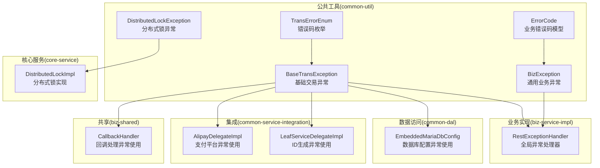
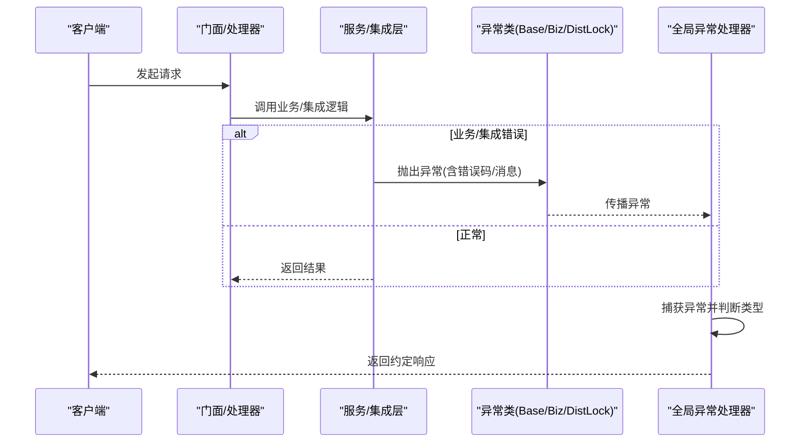
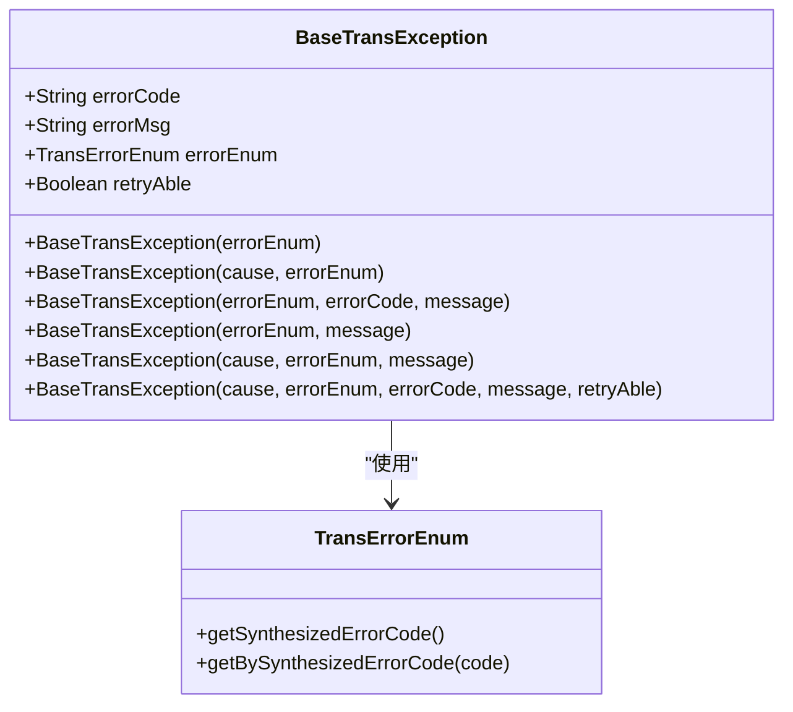
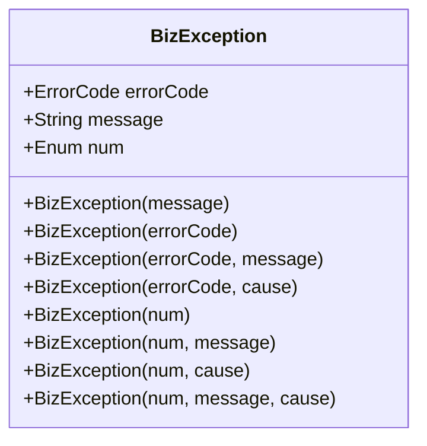
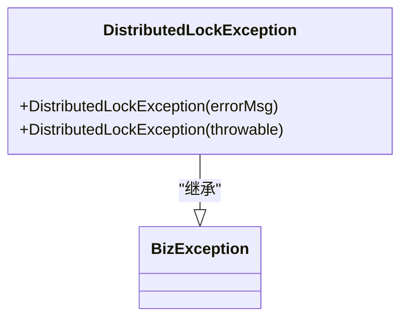
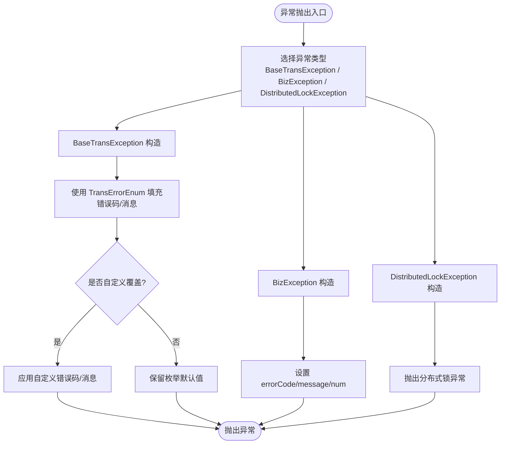
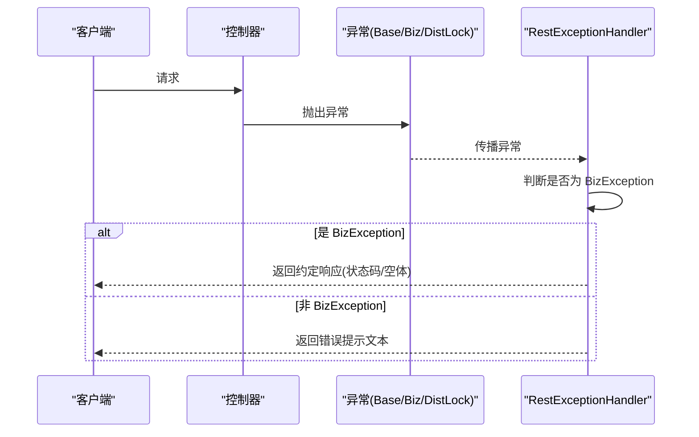
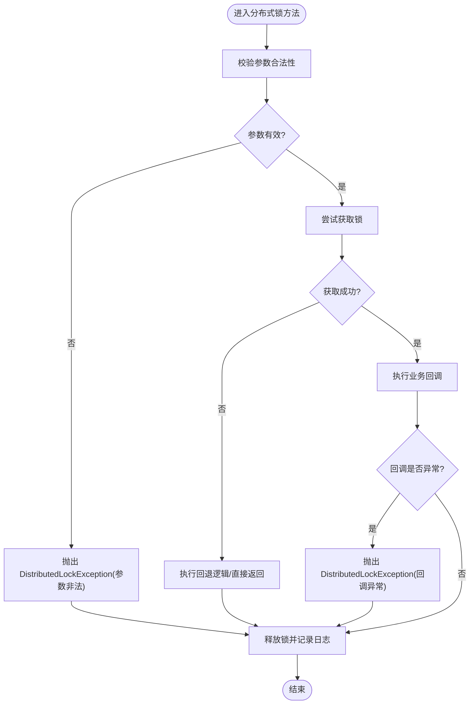
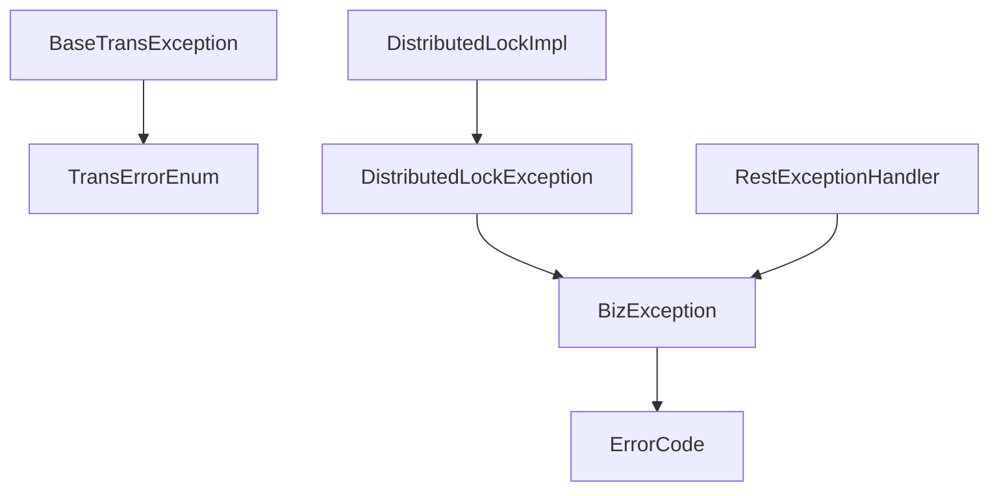

# 异常处理机制

<cite>
**本文引用的文件**
- [BaseTransException.java](file://common-util/src/main/java/com/magicliang/transaction/sys/common/exception/BaseTransException.java)
- [BizException.java](file://common-util/src/main/java/com/magicliang/transaction/sys/common/exception/BizException.java)
- [DistributedLockException.java](file://common-util/src/main/java/com/magicliang/transaction/sys/common/exception/DistributedLockException.java)
- [TransErrorEnum.java](file://common-util/src/main/java/com/magicliang/transaction/sys/common/enums/TransErrorEnum.java)
- [ErrorCode.java](file://common-util/src/main/java/com/magicliang/transaction/sys/common/constant/ErrorCode.java)
- [RestExceptionHandler.java](file://biz-service-impl/src/main/java/com/magicliang/transaction/sys/biz/service/impl/web/advice/RestExceptionHandler.java)
- [DistributedLockImpl.java](file://core-service/src/main/java/com/magicliang/transaction/sys/core/service/impl/DistributedLockImpl.java)
- [EmbeddedMariaDbConfig.java](file://common-dal/src/main/java/com/magicliang/transaction/sys/common/dal/datasource/EmbeddedMariaDbConfig.java)
- [AlipayDelegateImpl.java](file://common-service-integration/src/main/java/com/magicliang/transaction/sys/common/service/integration/delegate/alipay/impl/AlipayDelegateImpl.java)
- [LeafServiceDelegateImpl.java](file://common-service-integration/src/main/java/com/magicliang/transaction/sys/common/service/integration/delegate/sequence/impl/LeafServiceDelegateImpl.java)
- [AbstractConcurrentFacade.java](file://biz-service-impl/src/main/java/com/magicliang/transaction/sys/biz/service/impl/facade/impl/AbstractConcurrentFacade.java)
- [CallbackHandler.java](file://biz-shared/src/main/java/com/magicliang/transaction/sys/biz/shared/handler/CallbackHandler.java)
- [CustomExceptionUtil.java](file://common-util/src/main/java/com/magicliang/transaction/sys/common/util/CustomExceptionUtil.java)
</cite>

## 目录
1. [简介](#简介)
2. [项目结构](#项目结构)
3. [核心组件](#核心组件)
4. [架构总览](#架构总览)
5. [详细组件分析](#详细组件分析)
6. [依赖分析](#依赖分析)
7. [性能考量](#性能考量)
8. [故障排查指南](#故障排查指南)
9. [结论](#结论)
10. [附录](#附录)

## 简介
本文件系统性梳理领域驱动交易系统中的异常处理机制，围绕基础异常类、业务异常与分布式锁异常展开，覆盖异常层次结构、错误码传递、异常信息封装、Web层统一处理、分布式锁场景下的异常策略以及最佳实践与调试技巧。目标是帮助开发者建立清晰、可维护、可观测的异常处理体系。

## 项目结构
异常处理相关代码主要分布在以下模块：
- common-util：基础异常类与错误码定义
- biz-service-impl：Web层统一异常处理
- core-service：分布式锁实现与异常抛出
- common-dal、common-service-integration、biz-shared：各层业务逻辑中对异常的使用与传播

图表来源
- [BaseTransException.java:1-125](file://common-util/src/main/java/com/magicliang/transaction/sys/common/exception/BaseTransException.java#L1-L125)
- [BizException.java:1-93](file://common-util/src/main/java/com/magicliang/transaction/sys/common/exception/BizException.java#L1-L93)
- [DistributedLockException.java:1-32](file://common-util/src/main/java/com/magicliang/transaction/sys/common/exception/DistributedLockException.java#L1-L32)
- [TransErrorEnum.java:1-327](file://common-util/src/main/java/com/magicliang/transaction/sys/common/enums/TransErrorEnum.java#L1-L327)
- [ErrorCode.java:1-46](file://common-util/src/main/java/com/magicliang/transaction/sys/common/constant/ErrorCode.java#L1-L46)
- [RestExceptionHandler.java:1-40](file://biz-service-impl/src/main/java/com/magicliang/transaction/sys/biz/service/impl/web/advice/RestExceptionHandler.java#L1-L40)
- [DistributedLockImpl.java:1-275](file://core-service/src/main/java/com/magicliang/transaction/sys/core/service/impl/DistributedLockImpl.java#L1-L275)
- [EmbeddedMariaDbConfig.java:1-200](file://common-dal/src/main/java/com/magicliang/transaction/sys/common/dal/datasource/EmbeddedMariaDbConfig.java#L1-L200)
- [AlipayDelegateImpl.java:1-100](file://common-service-integration/src/main/java/com/magicliang/transaction/sys/common/service/integration/delegate/alipay/impl/AlipayDelegateImpl.java#L1-L100)
- [LeafServiceDelegateImpl.java:1-120](file://common-service-integration/src/main/java/com/magicliang/transaction/sys/common/service/integration/delegate/sequence/impl/LeafServiceDelegateImpl.java#L1-L120)
- [CallbackHandler.java:1-200](file://biz-shared/src/main/java/com/magicliang/transaction/sys/biz/shared/handler/CallbackHandler.java#L1-L200)

章节来源
- [BaseTransException.java:1-125](file://common-util/src/main/java/com/magicliang/transaction/sys/common/exception/BaseTransException.java#L1-L125)
- [BizException.java:1-93](file://common-util/src/main/java/com/magicliang/transaction/sys/common/exception/BizException.java#L1-L93)
- [DistributedLockException.java:1-32](file://common-util/src/main/java/com/magicliang/transaction/sys/common/exception/DistributedLockException.java#L1-L32)
- [TransErrorEnum.java:1-327](file://common-util/src/main/java/com/magicliang/transaction/sys/common/enums/TransErrorEnum.java#L1-L327)
- [ErrorCode.java:1-46](file://common-util/src/main/java/com/magicliang/transaction/sys/common/constant/ErrorCode.java#L1-L46)
- [RestExceptionHandler.java:1-40](file://biz-service-impl/src/main/java/com/magicliang/transaction/sys/biz/service/impl/web/advice/RestExceptionHandler.java#L1-L40)
- [DistributedLockImpl.java:1-275](file://core-service/src/main/java/com/magicliang/transaction/sys/core/service/impl/DistributedLockImpl.java#L1-L275)
- [EmbeddedMariaDbConfig.java:1-200](file://common-dal/src/main/java/com/magicliang/transaction/sys/common/dal/datasource/EmbeddedMariaDbConfig.java#L1-L200)
- [AlipayDelegateImpl.java:1-100](file://common-service-integration/src/main/java/com/magicliang/transaction/sys/common/service/integration/delegate/alipay/impl/AlipayDelegateImpl.java#L1-L100)
- [LeafServiceDelegateImpl.java:1-120](file://common-service-integration/src/main/java/com/magicliang/transaction/sys/common/service/integration/delegate/sequence/impl/LeafServiceDelegateImpl.java#L1-L120)
- [CallbackHandler.java:1-200](file://biz-shared/src/main/java/com/magicliang/transaction/sys/biz/shared/handler/CallbackHandler.java#L1-L200)

## 核心组件
- 基础交易异常 BaseTransException：面向交易域的统一异常载体，内置错误码、错误信息、是否可重试等字段，支持从错误枚举合成错误码与消息，并允许自定义覆盖。
- 通用业务异常 BizException：面向业务领域的异常基类，支持多种构造方式，便于快速封装业务错误码与消息。
- 分布式锁异常 DistributedLockException：继承业务异常，专门用于分布式锁场景的异常表达，统一对外抛出与捕获。
- 错误码枚举 TransErrorEnum：集中定义交易域错误码，包含中间类型、具体错误码与默认消息，并提供“可重试”标记与合成错误码能力。
- 业务错误码模型 ErrorCode：另一种错误码表示形式，包含 code、type、message 字段，便于跨模块传递。
- Web全局异常处理器 RestExceptionHandler：对运行时异常进行统一拦截，区分业务异常与其他异常，按约定返回响应。

章节来源
- [BaseTransException.java:1-125](file://common-util/src/main/java/com/magicliang/transaction/sys/common/exception/BaseTransException.java#L1-L125)
- [BizException.java:1-93](file://common-util/src/main/java/com/magicliang/transaction/sys/common/exception/BizException.java#L1-L93)
- [DistributedLockException.java:1-32](file://common-util/src/main/java/com/magicliang/transaction/sys/common/exception/DistributedLockException.java#L1-L32)
- [TransErrorEnum.java:1-327](file://common-util/src/main/java/com/magicliang/transaction/sys/common/enums/TransErrorEnum.java#L1-L327)
- [ErrorCode.java:1-46](file://common-util/src/main/java/com/magicliang/transaction/sys/common/constant/ErrorCode.java#L1-L46)
- [RestExceptionHandler.java:1-40](file://biz-service-impl/src/main/java/com/magicliang/transaction/sys/biz/service/impl/web/advice/RestExceptionHandler.java#L1-L40)

## 架构总览
异常处理在系统中的流转路径如下：
- 业务层与集成层在检测到错误时，依据场景选择抛出 BaseTransException 或 BizException；分布式锁实现中在异常情况下抛出 DistributedLockException。
- Web 层通过 RestExceptionHandler 统一拦截异常，识别 BizException 并按约定返回。
- 错误码由 TransErrorEnum 提供，BaseTransException 通过构造参数或枚举自动填充错误码与消息，支持自定义覆盖。

图表来源
- [BaseTransException.java:1-125](file://common-util/src/main/java/com/magicliang/transaction/sys/common/exception/BaseTransException.java#L1-L125)
- [BizException.java:1-93](file://common-util/src/main/java/com/magicliang/transaction/sys/common/exception/BizException.java#L1-L93)
- [DistributedLockException.java:1-32](file://common-util/src/main/java/com/magicliang/transaction/sys/common/exception/DistributedLockException.java#L1-L32)
- [RestExceptionHandler.java:1-40](file://biz-service-impl/src/main/java/com/magicliang/transaction/sys/biz/service/impl/web/advice/RestExceptionHandler.java#L1-L40)

## 详细组件分析

### 基础异常类 BaseTransException 设计
- 设计理念
  - 以“错误码+消息+可重试标记”为核心，统一交易域异常表达。
  - 支持从 TransErrorEnum 合成错误码与默认消息，同时允许自定义覆盖，兼顾通用与灵活。
- 关键字段
  - errorCode：错误码字符串
  - errorMsg：错误消息
  - errorEnum：错误枚举
  - retryAble：是否可重试
- 构造策略
  - 支持仅传入错误枚举、带原因异常、带自定义错误码/消息等多种构造方式，内部根据传参决定优先级。
- 使用建议
  - 优先使用枚举构造，确保错误码与消息的一致性；在特殊场景下再使用自定义覆盖。

图表来源
- [BaseTransException.java:1-125](file://common-util/src/main/java/com/magicliang/transaction/sys/common/exception/BaseTransException.java#L1-L125)
- [TransErrorEnum.java:1-327](file://common-util/src/main/java/com/magicliang/transaction/sys/common/enums/TransErrorEnum.java#L1-L327)

章节来源
- [BaseTransException.java:1-125](file://common-util/src/main/java/com/magicliang/transaction/sys/common/exception/BaseTransException.java#L1-L125)
- [TransErrorEnum.java:1-327](file://common-util/src/main/java/com/magicliang/transaction/sys/common/enums/TransErrorEnum.java#L1-L327)

### 业务异常 BizException 使用
- 设计理念
  - 以 ErrorCode 或枚举为载体，快速封装业务错误；支持多种构造方式，便于在不同上下文复用。
- 关键字段
  - errorCode：业务错误码
  - message：错误消息
  - num：枚举值
- 使用场景
  - 参数校验失败、业务规则违反、领域模型不合法等。
- 与 Web 层配合
  - RestExceptionHandler 将 BizException 视为“业务异常”，按约定返回，避免误判为系统异常。

图表来源
- [BizException.java:1-93](file://common-util/src/main/java/com/magicliang/transaction/sys/common/exception/BizException.java#L1-L93)
- [ErrorCode.java:1-46](file://common-util/src/main/java/com/magicliang/transaction/sys/common/constant/ErrorCode.java#L1-L46)

章节来源
- [BizException.java:1-93](file://common-util/src/main/java/com/magicliang/transaction/sys/common/exception/BizException.java#L1-L93)
- [ErrorCode.java:1-46](file://common-util/src/main/java/com/magicliang/transaction/sys/common/constant/ErrorCode.java#L1-L46)
- [RestExceptionHandler.java:1-40](file://biz-service-impl/src/main/java/com/magicliang/transaction/sys/biz/service/impl/web/advice/RestExceptionHandler.java#L1-L40)

### 分布式锁异常 DistributedLockException
- 设计理念
  - 继承 BizException，专门用于分布式锁场景，统一对外暴露“锁相关”的异常语义。
- 典型触发点
  - 锁参数非法（如锁名为空、过期时间非正）、加锁过程异常、执行回调异常等。
- 处理策略
  - 在分布式锁实现中捕获异常并包装为 DistributedLockException，保证上层统一感知。

图表来源
- [DistributedLockException.java:1-32](file://common-util/src/main/java/com/magicliang/transaction/sys/common/exception/DistributedLockException.java#L1-L32)
- [BizException.java:1-93](file://common-util/src/main/java/com/magicliang/transaction/sys/common/exception/BizException.java#L1-L93)

章节来源
- [DistributedLockException.java:1-32](file://common-util/src/main/java/com/magicliang/transaction/sys/common/exception/DistributedLockException.java#L1-L32)
- [DistributedLockImpl.java:1-275](file://core-service/src/main/java/com/magicliang/transaction/sys/core/service/impl/DistributedLockImpl.java#L1-L275)

### 错误码传递与封装
- 错误码来源
  - TransErrorEnum：交易域统一错误码，提供“中间类型+具体错误码+默认消息+可重试”等属性，并能合成完整错误码。
  - ErrorCode：业务侧错误码模型，便于跨模块传递。
- 封装策略
  - BaseTransException 优先使用枚举合成错误码与消息，随后允许自定义覆盖；BizException 则直接持有 errorCode/message/num 等字段。

图表来源
- [BaseTransException.java:1-125](file://common-util/src/main/java/com/magicliang/transaction/sys/common/exception/BaseTransException.java#L1-L125)
- [BizException.java:1-93](file://common-util/src/main/java/com/magicliang/transaction/sys/common/exception/BizException.java#L1-L93)
- [DistributedLockException.java:1-32](file://common-util/src/main/java/com/magicliang/transaction/sys/common/exception/DistributedLockException.java#L1-L32)
- [TransErrorEnum.java:1-327](file://common-util/src/main/java/com/magicliang/transaction/sys/common/enums/TransErrorEnum.java#L1-L327)
- [ErrorCode.java:1-46](file://common-util/src/main/java/com/magicliang/transaction/sys/common/constant/ErrorCode.java#L1-L46)

章节来源
- [TransErrorEnum.java:1-327](file://common-util/src/main/java/com/magicliang/transaction/sys/common/enums/TransErrorEnum.java#L1-L327)
- [ErrorCode.java:1-46](file://common-util/src/main/java/com/magicliang/transaction/sys/common/constant/ErrorCode.java#L1-L46)

### Web 层统一异常处理
- RestExceptionHandler
  - 拦截运行时异常，区分 BizException 与其他异常，按约定返回响应体与状态码。
  - 该策略确保业务异常不会被误判为系统异常，便于前端与网关层正确处理。

图表来源
- [RestExceptionHandler.java:1-40](file://biz-service-impl/src/main/java/com/magicliang/transaction/sys/biz/service/impl/web/advice/RestExceptionHandler.java#L1-L40)
- [BizException.java:1-93](file://common-util/src/main/java/com/magicliang/transaction/sys/common/exception/BizException.java#L1-L93)

章节来源
- [RestExceptionHandler.java:1-40](file://biz-service-impl/src/main/java/com/magicliang/transaction/sys/biz/service/impl/web/advice/RestExceptionHandler.java#L1-L40)

### 分布式锁异常的特殊处理机制
- 触发场景
  - 锁参数非法（如锁名为空、过期时间非正）
  - 加锁过程异常（如底层锁服务不可用）
  - 执行回调异常（如业务逻辑抛出异常）
- 处理流程
  - 在分布式锁实现中对非法参数立即抛出 DistributedLockException；
  - 在执行回调阶段捕获异常并包装为 DistributedLockException；
  - finally 中确保释放锁，记录日志以便定位问题。

图表来源
- [DistributedLockImpl.java:1-275](file://core-service/src/main/java/com/magicliang/transaction/sys/core/service/impl/DistributedLockImpl.java#L1-L275)
- [DistributedLockException.java:1-32](file://common-util/src/main/java/com/magicliang/transaction/sys/common/exception/DistributedLockException.java#L1-L32)

章节来源
- [DistributedLockImpl.java:1-275](file://core-service/src/main/java/com/magicliang/transaction/sys/core/service/impl/DistributedLockImpl.java#L1-L275)

### 异常处理最佳实践
- 捕获策略
  - 明确异常边界：在合适的地方捕获并转换为业务异常，避免将底层异常直接透传至 Web 层。
  - 对分布式锁场景，统一捕获并包装为 DistributedLockException，便于上层统一处理。
- 异常信息记录
  - 在分布式锁实现中记录线程名、加锁/解锁阶段日志，便于定位锁竞争与超时问题。
  - 在全局异常处理器中记录异常 URI 与堆栈摘要，辅助问题追踪。
- 异常恢复机制
  - 对可重试异常（由 TransErrorEnum.retryable 标记）结合指数退避策略进行重试。
  - 对不可重试异常，记录并上报，避免无效重试造成资源浪费。
- 参数校验与业务规则
  - 在业务层尽早校验参数与前置条件，抛出 BizException，减少无效调用链开销。

章节来源
- [DistributedLockImpl.java:1-275](file://core-service/src/main/java/com/magicliang/transaction/sys/core/service/impl/DistributedLockImpl.java#L1-L275)
- [RestExceptionHandler.java:1-40](file://biz-service-impl/src/main/java/com/magicliang/transaction/sys/biz/service/impl/web/advice/RestExceptionHandler.java#L1-L40)
- [TransErrorEnum.java:1-327](file://common-util/src/main/java/com/magicliang/transaction/sys/common/enums/TransErrorEnum.java#L1-L327)

### 异常处理示例与调试技巧
- 示例路径
  - 业务异常使用：在回调处理器中对无效状态抛出 BaseTransException，参考 [CallbackHandler.java:160-175](file://biz-shared/src/main/java/com/magicliang/transaction/sys/biz/shared/handler/CallbackHandler.java#L160-L175)。
  - 数据库配置异常：在嵌入式数据库启动失败时抛出 BaseTransException，参考 [EmbeddedMariaDbConfig.java:70-80](file://common-dal/src/main/java/com/magicliang/transaction/sys/common/dal/datasource/EmbeddedMariaDbConfig.java#L70-L80)。
  - 支付平台异常：在支付平台返回异常时抛出 BaseTransException，参考 [AlipayDelegateImpl.java:45-55](file://common-service-integration/src/main/java/com/magicliang/transaction/sys/common/service/integration/delegate/alipay/impl/AlipayDelegateImpl.java#L45-L55)。
  - ID 生成异常：在 ID 生成失败时抛出 BaseTransException，参考 [LeafServiceDelegateImpl.java:70-110](file://common-service-integration/src/main/java/com/magicliang/transaction/sys/common/service/integration/delegate/sequence/impl/LeafServiceDelegateImpl.java#L70-L110)。
  - 批量支付异常：在并发门面中捕获异常并抛出 BaseTransException，参考 [AbstractConcurrentFacade.java:60-70](file://biz-service-impl/src/main/java/com/magicliang/transaction/sys/biz/service/impl/facade/impl/AbstractConcurrentFacade.java#L60-L70)。
- 调试技巧
  - 使用自定义异常工具类定位嵌套异常中的目标异常类型，参考 [CustomExceptionUtil.java:47-57](file://common-util/src/main/java/com/magicliang/transaction/sys/common/util/CustomExceptionUtil.java#L47-L57)。
  - 在分布式锁实现中观察“加锁前/加锁中/解锁后”日志，快速定位锁竞争与释放问题。

章节来源
- [CallbackHandler.java:160-175](file://biz-shared/src/main/java/com/magicliang/transaction/sys/biz/shared/handler/CallbackHandler.java#L160-L175)
- [EmbeddedMariaDbConfig.java:70-80](file://common-dal/src/main/java/com/magicliang/transaction/sys/common/dal/datasource/EmbeddedMariaDbConfig.java#L70-L80)
- [AlipayDelegateImpl.java:45-55](file://common-service-integration/src/main/java/com/magicliang/transaction/sys/common/service/integration/delegate/alipay/impl/AlipayDelegateImpl.java#L45-L55)
- [LeafServiceDelegateImpl.java:70-110](file://common-service-integration/src/main/java/com/magicliang/transaction/sys/common/service/integration/delegate/sequence/impl/LeafServiceDelegateImpl.java#L70-L110)
- [AbstractConcurrentFacade.java:60-70](file://biz-service-impl/src/main/java/com/magicliang/transaction/sys/biz/service/impl/facade/impl/AbstractConcurrentFacade.java#L60-L70)
- [CustomExceptionUtil.java:47-57](file://common-util/src/main/java/com/magicliang/transaction/sys/common/util/CustomExceptionUtil.java#L47-L57)

## 依赖分析
- 组件耦合
  - BaseTransException 依赖 TransErrorEnum，用于错误码合成与默认消息填充。
  - BizException 依赖 ErrorCode，用于承载业务错误码。
  - DistributedLockException 继承 BizException，统一分布式锁异常语义。
  - Web 层 RestExceptionHandler 依赖 BizException，用于区分业务异常与其他异常。
- 外部依赖
  - 分布式锁实现依赖 Spring 容器注入的分布式锁管理器，确保锁服务可用性。
  - 业务与集成层在检测到错误时，统一向上抛出 BaseTransException/BizException/DistributedLockException，降低上层处理复杂度。

图表来源
- [BaseTransException.java:1-125](file://common-util/src/main/java/com/magicliang/transaction/sys/common/exception/BaseTransException.java#L1-L125)
- [BizException.java:1-93](file://common-util/src/main/java/com/magicliang/transaction/sys/common/exception/BizException.java#L1-L93)
- [DistributedLockException.java:1-32](file://common-util/src/main/java/com/magicliang/transaction/sys/common/exception/DistributedLockException.java#L1-L32)
- [TransErrorEnum.java:1-327](file://common-util/src/main/java/com/magicliang/transaction/sys/common/enums/TransErrorEnum.java#L1-L327)
- [ErrorCode.java:1-46](file://common-util/src/main/java/com/magicliang/transaction/sys/common/constant/ErrorCode.java#L1-L46)
- [RestExceptionHandler.java:1-40](file://biz-service-impl/src/main/java/com/magicliang/transaction/sys/biz/service/impl/web/advice/RestExceptionHandler.java#L1-L40)
- [DistributedLockImpl.java:1-275](file://core-service/src/main/java/com/magicliang/transaction/sys/core/service/impl/DistributedLockImpl.java#L1-L275)

章节来源
- [BaseTransException.java:1-125](file://common-util/src/main/java/com/magicliang/transaction/sys/common/exception/BaseTransException.java#L1-L125)
- [BizException.java:1-93](file://common-util/src/main/java/com/magicliang/transaction/sys/common/exception/BizException.java#L1-L93)
- [DistributedLockException.java:1-32](file://common-util/src/main/java/com/magicliang/transaction/sys/common/exception/DistributedLockException.java#L1-L32)
- [TransErrorEnum.java:1-327](file://common-util/src/main/java/com/magicliang/transaction/sys/common/enums/TransErrorEnum.java#L1-L327)
- [ErrorCode.java:1-46](file://common-util/src/main/java/com/magicliang/transaction/sys/common/constant/ErrorCode.java#L1-L46)
- [RestExceptionHandler.java:1-40](file://biz-service-impl/src/main/java/com/magicliang/transaction/sys/biz/service/impl/web/advice/RestExceptionHandler.java#L1-L40)
- [DistributedLockImpl.java:1-275](file://core-service/src/main/java/com/magicliang/transaction/sys/core/service/impl/DistributedLockImpl.java#L1-L275)

## 性能考量
- 锁竞争与超时
  - 在分布式锁实现中，合理设置过期时间与重试策略，避免长时间阻塞与资源浪费。
  - 对不可重试异常，避免无效重试，减少系统负载。
- 日志与可观测性
  - 在分布式锁关键节点记录日志，便于定位热点与瓶颈。
  - 在全局异常处理器中记录异常 URI 与摘要，辅助问题定位与告警。

## 故障排查指南
- 快速定位
  - 使用自定义异常工具类递归查找嵌套异常中的目标类型，参考 [CustomExceptionUtil.java:47-57](file://common-util/src/main/java/com/magicliang/transaction/sys/common/util/CustomExceptionUtil.java#L47-L57)。
- 分布式锁问题
  - 关注“加锁前/加锁中/解锁后”日志，确认锁是否正确释放，是否存在长时间持有锁的情况。
  - 检查锁参数（锁名、过期时间）是否符合预期。
- Web 层异常
  - 确认异常是否被 RestExceptionHandler 正确识别为 BizException，避免误判为系统异常。

章节来源
- [CustomExceptionUtil.java:47-57](file://common-util/src/main/java/com/magicliang/transaction/sys/common/util/CustomExceptionUtil.java#L47-L57)
- [DistributedLockImpl.java:1-275](file://core-service/src/main/java/com/magicliang/transaction/sys/core/service/impl/DistributedLockImpl.java#L1-L275)
- [RestExceptionHandler.java:1-40](file://biz-service-impl/src/main/java/com/magicliang/transaction/sys/biz/service/impl/web/advice/RestExceptionHandler.java#L1-L40)

## 结论
通过统一的异常层次结构（BaseTransException/BizException/DistributedLockException）与错误码体系（TransErrorEnum/ErrorCode），结合 Web 层统一异常处理与分布式锁的特殊异常策略，系统实现了清晰、可维护且可观测的异常处理机制。遵循本文的最佳实践与调试技巧，可进一步提升系统的稳定性与可运维性。

## 附录
- 常见异常场景与对应异常类
  - 业务规则违反：BizException
  - 参数校验失败：BizException
  - 分布式锁获取失败/超时/竞争：DistributedLockException
  - 交易域通用错误：BaseTransException（配合 TransErrorEnum）
- 推荐的异常处理流程
  - 在业务层尽早校验参数与前置条件，抛出 BizException；
  - 在分布式锁场景中捕获异常并包装为 DistributedLockException；
  - 在集成层根据外部系统返回情况抛出 BaseTransException；
  - 在 Web 层统一拦截并区分业务异常与其他异常，按约定返回。