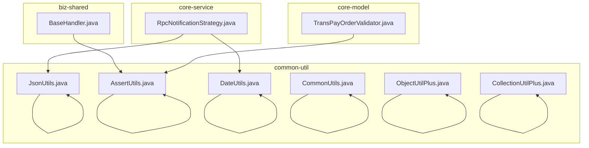
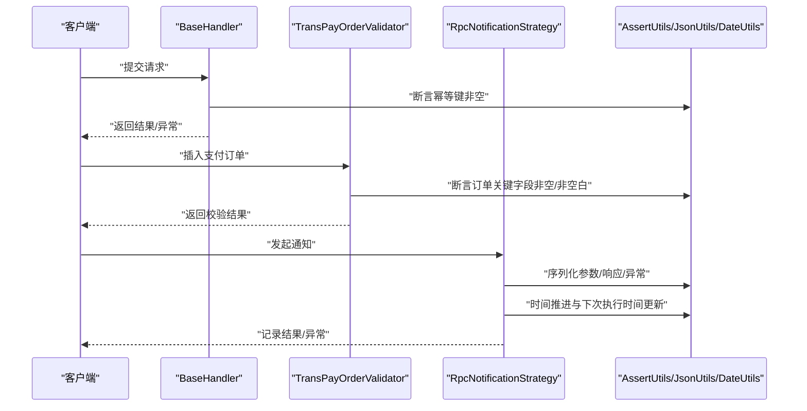
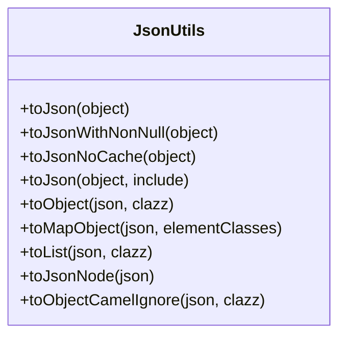
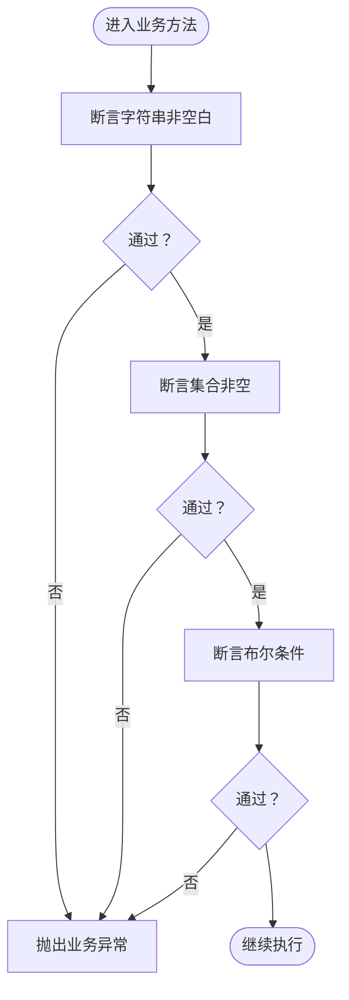
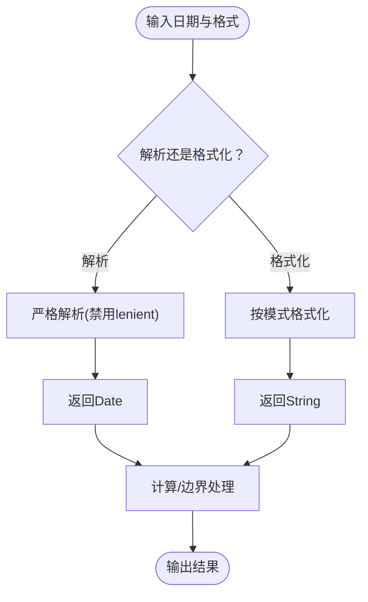
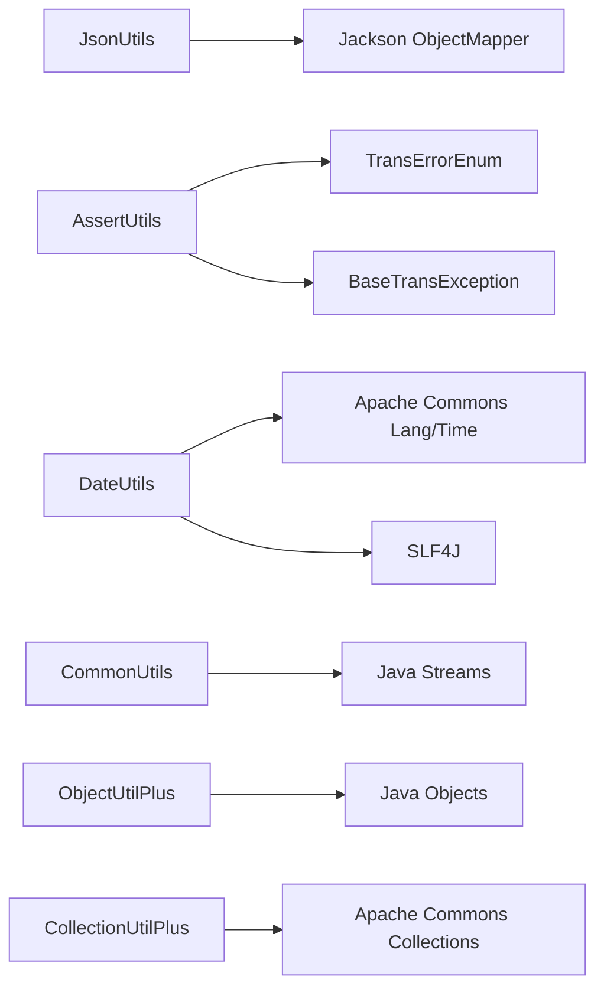

# 核心工具类

<cite>
**本文引用的文件**
- [JsonUtils.java](file://common-util/src/main/java/com/magicliang/transaction/sys/common/util/JsonUtils.java)
- [AssertUtils.java](file://common-util/src/main/java/com/magicliang/transaction/sys/common/util/AssertUtils.java)
- [DateUtils.java](file://common-util/src/main/java/com/magicliang/transaction/sys/common/util/DateUtils.java)
- [CommonUtils.java](file://common-util/src/main/java/com/magicliang/transaction/sys/common/util/CommonUtils.java)
- [ObjectUtilPlus.java](file://common-util/src/main/java/com/magicliang/transaction/sys/common/util/ObjectUtilPlus.java)
- [CollectionUtilPlus.java](file://common-util/src/main/java/com/magicliang/transaction/sys/common/util/CollectionUtilPlus.java)
- [BaseHandler.java](file://biz-shared/src/main/java/com/magicliang/transaction/sys/biz/shared/handler/BaseHandler.java)
- [TransPayOrderValidator.java](file://core-model/src/main/java/com/magicliang/transaction/sys/core/model/entity/validator/TransPayOrderValidator.java)
- [RpcNotificationStrategy.java](file://core-service/src/main/java/com/magicliang/transaction/sys/core/domain/strategy/notification/RpcNotificationStrategy.java)
- [CollectionUtilPlusTest.java](file://common-util/src/test/java/com/magicliang/transaction/sys/common/util/CollectionUtilPlusTest.java)
- [ObjectUtilPlusTest.java](file://common-util/src/test/java/com/magicliang/transaction/sys/common/util/ObjectUtilPlusTest.java)
</cite>

## 目录
1. [简介](#简介)
2. [项目结构](#项目结构)
3. [核心组件](#核心组件)
4. [架构总览](#架构总览)
5. [详细组件分析](#详细组件分析)
6. [依赖分析](#依赖分析)
7. [性能考虑](#性能考虑)
8. [故障排查指南](#故障排查指南)
9. [结论](#结论)
10. [附录](#附录)

## 简介
本指南聚焦领域驱动交易系统中最常用的“核心工具类”，围绕以下能力展开：
- JSON 序列化与反序列化：JsonUtils 提供多种包含策略、缓存控制、命名策略与泛型集合处理。
- 参数与业务规则断言：AssertUtils 提供空值、非空、非空白、集合大小、布尔条件等断言，统一抛出业务异常。
- 时间处理与格式转换：DateUtils 提供日期计算、格式化、时分秒截断、区间判断、基准时间戳等。
- 通用集合与对象辅助：CommonUtils 提供重复元素查找；ObjectUtilPlus 提供对象数组空值判定；CollectionUtilPlus 增强集合比较。
- 实战使用场景：结合业务模块中的真实调用点，给出最佳实践与注意事项。

## 项目结构
核心工具类位于 common-util 模块，配套测试位于同模块 test 目录；业务侧在 biz-shared、core-model、core-service 等模块广泛使用这些工具类。

图表来源
- [JsonUtils.java:1-293](file://common-util/src/main/java/com/magicliang/transaction/sys/common/util/JsonUtils.java#L1-L293)
- [AssertUtils.java:1-109](file://common-util/src/main/java/com/magicliang/transaction/sys/common/util/AssertUtils.java#L1-L109)
- [DateUtils.java:1-941](file://common-util/src/main/java/com/magicliang/transaction/sys/common/util/DateUtils.java#L1-L941)
- [CommonUtils.java:1-48](file://common-util/src/main/java/com/magicliang/transaction/sys/common/util/CommonUtils.java#L1-L48)
- [ObjectUtilPlus.java:1-44](file://common-util/src/main/java/com/magicliang/transaction/sys/common/util/ObjectUtilPlus.java#L1-L44)
- [CollectionUtilPlus.java:1-36](file://common-util/src/main/java/com/magicliang/transaction/sys/common/util/CollectionUtilPlus.java#L1-L36)
- [BaseHandler.java:170-179](file://biz-shared/src/main/java/com/magicliang/transaction/sys/biz/shared/handler/BaseHandler.java#L170-L179)
- [TransPayOrderValidator.java:30-53](file://core-model/src/main/java/com/magicliang/transaction/sys/core/model/entity/validator/TransPayOrderValidator.java#L30-L53)
- [RpcNotificationStrategy.java:140-241](file://core-service/src/main/java/com/magicliang/transaction/sys/core/domain/strategy/notification/RpcNotificationStrategy.java#L140-L241)

章节来源
- [JsonUtils.java:1-293](file://common-util/src/main/java/com/magicliang/transaction/sys/common/util/JsonUtils.java#L1-L293)
- [AssertUtils.java:1-109](file://common-util/src/main/java/com/magicliang/transaction/sys/common/util/AssertUtils.java#L1-L109)
- [DateUtils.java:1-941](file://common-util/src/main/java/com/magicliang/transaction/sys/common/util/DateUtils.java#L1-L941)
- [CommonUtils.java:1-48](file://common-util/src/main/java/com/magicliang/transaction/sys/common/util/CommonUtils.java#L1-L48)
- [ObjectUtilPlus.java:1-44](file://common-util/src/main/java/com/magicliang/transaction/sys/common/util/ObjectUtilPlus.java#L1-L44)
- [CollectionUtilPlus.java:1-36](file://common-util/src/main/java/com/magicliang/transaction/sys/common/util/CollectionUtilPlus.java#L1-L36)

## 核心组件
- JsonUtils：基于 Jackson 的高性能 JSON 工具，支持多种包含策略、命名策略、缓存开关、泛型集合与 JsonNode 转换。
- AssertUtils：统一断言入口，覆盖空值、非空、非空白、集合非空、单例集合、相等性、布尔条件等。
- DateUtils：日期格式化/解析、区间计算、基准时间戳、周/月/年边界、毫秒与 LocalDateTime 转换等。
- CommonUtils：集合去重辅助，基于流式分组计数。
- ObjectUtilPlus：对象数组空值判定（全空/非全空/全非空）。
- CollectionUtilPlus：增强集合比较，安全处理空集合。

章节来源
- [JsonUtils.java:30-293](file://common-util/src/main/java/com/magicliang/transaction/sys/common/util/JsonUtils.java#L30-L293)
- [AssertUtils.java:19-109](file://common-util/src/main/java/com/magicliang/transaction/sys/common/util/AssertUtils.java#L19-L109)
- [DateUtils.java:33-941](file://common-util/src/main/java/com/magicliang/transaction/sys/common/util/DateUtils.java#L33-L941)
- [CommonUtils.java:18-48](file://common-util/src/main/java/com/magicliang/transaction/sys/common/util/CommonUtils.java#L18-L48)
- [ObjectUtilPlus.java:12-44](file://common-util/src/main/java/com/magicliang/transaction/sys/common/util/ObjectUtilPlus.java#L12-L44)
- [CollectionUtilPlus.java:15-36](file://common-util/src/main/java/com/magicliang/transaction/sys/common/util/CollectionUtilPlus.java#L15-L36)

## 架构总览
工具类在系统中的调用路径呈现“横切”特征：业务处理器负责参数校验与流程编排，模型层负责实体校验，服务层负责策略与持久化，均通过工具类完成序列化、断言与时间处理。

图表来源
- [BaseHandler.java:170-179](file://biz-shared/src/main/java/com/magicliang/transaction/sys/biz/shared/handler/BaseHandler.java#L170-L179)
- [TransPayOrderValidator.java:30-53](file://core-model/src/main/java/com/magicliang/transaction/sys/core/model/entity/validator/TransPayOrderValidator.java#L30-L53)
- [RpcNotificationStrategy.java:140-241](file://core-service/src/main/java/com/magicliang/transaction/sys/core/domain/strategy/notification/RpcNotificationStrategy.java#L140-L241)
- [AssertUtils.java:19-109](file://common-util/src/main/java/com/magicliang/transaction/sys/common/util/AssertUtils.java#L19-L109)
- [JsonUtils.java:143-217](file://common-util/src/main/java/com/magicliang/transaction/sys/common/util/JsonUtils.java#L143-L217)
- [DateUtils.java:398-454](file://common-util/src/main/java/com/magicliang/transaction/sys/common/util/DateUtils.java#L398-L454)

## 详细组件分析

### JsonUtils：JSON 序列化与反序列化
- 设计要点
  - 多 ObjectMapper 实例：按包含策略（全部/非空）、是否启用缓存、命名策略（驼峰→下划线）区分。
  - 缓存策略：默认启用 ObjectMapper 缓存；提供“禁用缓存”版本以平衡 GC 与性能。
  - 泛型支持：提供 List、Map、JsonNode 的反序列化便捷方法。
  - 异常处理：序列化/反序列化失败统一记录日志并返回空结果或空集合，避免传播底层异常。
- 常用方法与场景
  - 序列化：toJson、toJsonWithNonNull、toJsonNoCache、toJson（自定义包含策略）。
  - 反序列化：toObject、toMapObject、toList、toJsonNode。
  - 命名策略：toObjectCamelIgnore（驼峰字段名→下划线）。
- 最佳实践
  - 优先使用 NON_EMPTY 包含策略，减少无效字段传输。
  - 对外接口参数/响应建议统一命名策略，确保前后端一致。
  - 大对象序列化可考虑禁用缓存版本，降低内存压力。
  - 泛型集合反序列化时，确保元素类型与实际 JSON 结构匹配。

图表来源
- [JsonUtils.java:99-293](file://common-util/src/main/java/com/magicliang/transaction/sys/common/util/JsonUtils.java#L99-L293)

章节来源
- [JsonUtils.java:30-293](file://common-util/src/main/java/com/magicliang/transaction/sys/common/util/JsonUtils.java#L30-L293)

### AssertUtils：断言与参数校验
- 设计要点
  - 统一异常：断言失败抛出 BaseTransException，便于上层统一处理。
  - 覆盖面广：空值/非空、非空白、集合非空、单例集合、相等性、布尔条件。
  - 与业务枚举配合：传入 TransErrorEnum 与自定义错误消息，形成可追踪的错误链路。
- 常用方法与场景
  - assertNotBlank、assertNotNull、assertNotEmpty、assertSingletonCollection、assertEquals、isTrue。
- 最佳实践
  - 在业务入口与关键节点前置断言，尽早失败。
  - 与 JsonUtils 搭配输出上下文对象，便于定位问题。
  - 避免在断言中做复杂逻辑，保持断言职责单一。

图表来源
- [AssertUtils.java:35-107](file://common-util/src/main/java/com/magicliang/transaction/sys/common/util/AssertUtils.java#L35-L107)

章节来源
- [AssertUtils.java:19-109](file://common-util/src/main/java/com/magicliang/transaction/sys/common/util/AssertUtils.java#L19-L109)
- [BaseHandler.java:170-179](file://biz-shared/src/main/java/com/magicliang/transaction/sys/biz/shared/handler/BaseHandler.java#L170-L179)
- [TransPayOrderValidator.java:30-53](file://core-model/src/main/java/com/magicliang/transaction/sys/core/model/entity/validator/TransPayOrderValidator.java#L30-L53)

### DateUtils：时间处理与格式转换
- 设计要点
  - 常用格式常量：YYYY-MM-DD、yyyyMMdd、HH:mm:ss 等。
  - 计算与边界：天数/年数差、周数计算、月末/月初、今日/昨日/明日时间戳。
  - 精度控制：毫秒截断、精确到时分秒设置、时间区间判断。
  - 解析与格式化：严格解析（setLenient(false)）、DateTimeFormatter 与 SimpleDateFormat 双通道。
- 常用方法与场景
  - 格式化/解析：formatDate、formatDateTime、convertDateToString、convertStringToDate。
  - 计算：daysBetween、yearsBetween、getNextNumDay、getNextNumYear、addSecond2Date。
  - 边界：getTodayMill、getYestdayMill、getTomorrowMill、getAfterDate、getLastDayOfMonth。
  - 区间：between、isSameDay、isToday。
- 最佳实践
  - 明确时区与精度，避免跨时区与夏令时带来的歧义。
  - 严格解析日期字符串，避免宽松解析导致的隐性错误。
  - 使用基准时间戳（如 getTodayMill）统一业务日期边界。

图表来源
- [DateUtils.java:163-176](file://common-util/src/main/java/com/magicliang/transaction/sys/common/util/DateUtils.java#L163-L176)
- [DateUtils.java:398-454](file://common-util/src/main/java/com/magicliang/transaction/sys/common/util/DateUtils.java#L398-L454)

章节来源
- [DateUtils.java:33-941](file://common-util/src/main/java/com/magicliang/transaction/sys/common/util/DateUtils.java#L33-L941)
- [RpcNotificationStrategy.java:190-196](file://core-service/src/main/java/com/magicliang/transaction/sys/core/domain/strategy/notification/RpcNotificationStrategy.java#L190-L196)

### CommonUtils：通用集合工具
- 设计要点
  - 基于流式分组计数，快速识别重复元素。
- 常用方法
  - findDuplicateByGrouping：返回重复元素集合。
- 最佳实践
  - 适用于需要快速发现重复键或值的场景，如幂等校验、去重统计。

章节来源
- [CommonUtils.java:18-48](file://common-util/src/main/java/com/magicliang/transaction/sys/common/util/CommonUtils.java#L18-L48)

### ObjectUtilPlus：对象数组空值判定
- 设计要点
  - allNull、notAllNull、allNotNull：对可变参数对象数组进行空值判定。
- 最佳实践
  - 与断言组合使用，快速判断上下文对象是否满足前置条件。

章节来源
- [ObjectUtilPlus.java:12-44](file://common-util/src/main/java/com/magicliang/transaction/sys/common/util/ObjectUtilPlus.java#L12-L44)
- [ObjectUtilPlusTest.java:18-23](file://common-util/src/test/java/com/magicliang/transaction/sys/common/util/ObjectUtilPlusTest.java#L18-L23)

### CollectionUtilPlus：增强集合比较
- 设计要点
  - isEqualCollection：安全比较两集合，自动处理空值场景。
  - isNotEqualCollection：取反。
- 最佳实践
  - 与 Commons Collections 的 isEqualCollection 协作，避免空指针与空集合比较问题。

章节来源
- [CollectionUtilPlus.java:15-36](file://common-util/src/main/java/com/magicliang/transaction/sys/common/util/CollectionUtilPlus.java#L15-L36)
- [CollectionUtilPlusTest.java:24-33](file://common-util/src/test/java/com/magicliang/transaction/sys/common/util/CollectionUtilPlusTest.java#L24-L33)

## 依赖分析
- 内聚性：各工具类职责清晰，内部封装 Jackson、Apache Commons Lang/Collections、SLF4J 等第三方库。
- 耦合度：工具类之间无直接耦合，通过业务模块间接调用，耦合度低。
- 外部依赖：Jackson（JSON）、Apache Commons（Lang/Collections）、SLF4J（日志）。
- 循环依赖：未见循环依赖迹象。

图表来源
- [JsonUtils.java:3-17](file://common-util/src/main/java/com/magicliang/transaction/sys/common/util/JsonUtils.java#L3-L17)
- [AssertUtils.java:3-8](file://common-util/src/main/java/com/magicliang/transaction/sys/common/util/AssertUtils.java#L3-L8)
- [DateUtils.java:3-22](file://common-util/src/main/java/com/magicliang/transaction/sys/common/util/DateUtils.java#L3-L22)
- [CommonUtils.java:3-8](file://common-util/src/main/java/com/magicliang/transaction/sys/common/util/CommonUtils.java#L3-L8)
- [ObjectUtilPlus.java:1-10](file://common-util/src/main/java/com/magicliang/transaction/sys/common/util/ObjectUtilPlus.java#L1-L10)
- [CollectionUtilPlus.java:3-5](file://common-util/src/main/java/com/magicliang/transaction/sys/common/util/CollectionUtilPlus.java#L3-L5)

## 性能考虑
- JSON 序列化
  - 默认启用 ObjectMapper 缓存，提升吞吐；对大对象或高并发场景可切换“禁用缓存”版本，降低内存占用与 GC 压力。
  - 非空包含策略减少传输体积，建议优先使用 NON_EMPTY。
- 断言
  - 断言失败即抛异常，避免冗余计算；尽量在方法入口与关键节点前置断言。
- 时间处理
  - 严格解析避免宽松模式导致的解析误差；批量计算时复用格式器与 Calendar，减少对象创建。
- 集合与对象
  - 流式分组计数适合中小规模集合；大规模数据建议采用更高效的去重算法或外部存储。

## 故障排查指南
- JSON 反序列化失败
  - 现象：返回空对象/空集合，日志记录“反序列化失败”。
  - 排查：确认 JSON 结构与目标类型一致；检查字段命名策略；必要时使用 Camel→Snake 策略。
  - 参考：[JsonUtils.java:187-217](file://common-util/src/main/java/com/magicliang/transaction/sys/common/util/JsonUtils.java#L187-L217)
- 断言失败抛出业务异常
  - 现象：参数为空/非空白/非空集合等断言失败，抛出 BaseTransException。
  - 排查：核对传入参数与错误消息；结合 JsonUtils 输出上下文对象定位问题。
  - 参考：[AssertUtils.java:35-107](file://common-util/src/main/java/com/magicliang/transaction/sys/common/util/AssertUtils.java#L35-L107)
- 日期解析异常
  - 现象：parseStringToDate 抛出不支持的操作异常。
  - 排查：确认输入字符串与格式一致；使用严格解析；避免宽松模式。
  - 参考：[DateUtils.java:163-176](file://common-util/src/main/java/com/magicliang/transaction/sys/common/util/DateUtils.java#L163-L176)
- 通知策略异常记录
  - 现象：异常序列化到请求记录中，便于后续排查。
  - 排查：检查异常栈与上下文对象序列化结果。
  - 参考：[RpcNotificationStrategy.java:230-239](file://core-service/src/main/java/com/magicliang/transaction/sys/core/domain/strategy/notification/RpcNotificationStrategy.java#L230-L239)

章节来源
- [JsonUtils.java:187-217](file://common-util/src/main/java/com/magicliang/transaction/sys/common/util/JsonUtils.java#L187-L217)
- [AssertUtils.java:35-107](file://common-util/src/main/java/com/magicliang/transaction/sys/common/util/AssertUtils.java#L35-L107)
- [DateUtils.java:163-176](file://common-util/src/main/java/com/magicliang/transaction/sys/common/util/DateUtils.java#L163-L176)
- [RpcNotificationStrategy.java:230-239](file://core-service/src/main/java/com/magicliang/transaction/sys/core/domain/strategy/notification/RpcNotificationStrategy.java#L230-L239)

## 结论
- JsonUtils、AssertUtils、DateUtils、CommonUtils、ObjectUtilPlus、CollectionUtilPlus 构成了交易系统的核心工具层，覆盖序列化、断言、时间、集合与对象辅助等高频场景。
- 建议在业务入口与关键节点统一使用断言与序列化工具，结合严格的日期解析与时间边界处理，提升系统稳定性与可观测性。
- 针对性能敏感场景，合理选择缓存策略与包含策略，并注意 GC 与内存占用。

## 附录
- 使用示例参考路径（不含具体代码片段）
  - 断言与序列化在处理器与校验器中的组合使用：[BaseHandler.java:170-179](file://biz-shared/src/main/java/com/magicliang/transaction/sys/biz/shared/handler/BaseHandler.java#L170-L179)，[TransPayOrderValidator.java:30-53](file://core-model/src/main/java/com/magicliang/transaction/sys/core/model/entity/validator/TransPayOrderValidator.java#L30-L53)
  - 通知策略中 JSON 与时间处理：[RpcNotificationStrategy.java:140-241](file://core-service/src/main/java/com/magicliang/transaction/sys/core/domain/strategy/notification/RpcNotificationStrategy.java#L140-L241)
  - 集合与对象工具的单元测试：[CollectionUtilPlusTest.java:24-33](file://common-util/src/test/java/com/magicliang/transaction/sys/common/util/CollectionUtilPlusTest.java#L24-L33)，[ObjectUtilPlusTest.java:18-23](file://common-util/src/test/java/com/magicliang/transaction/sys/common/util/ObjectUtilPlusTest.java#L18-L23)