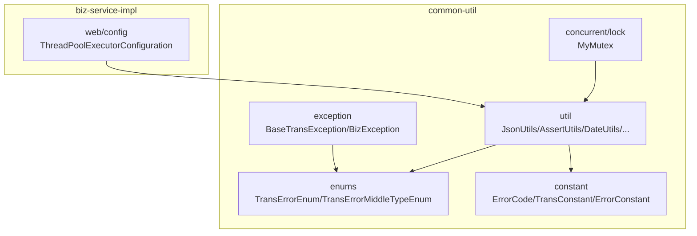
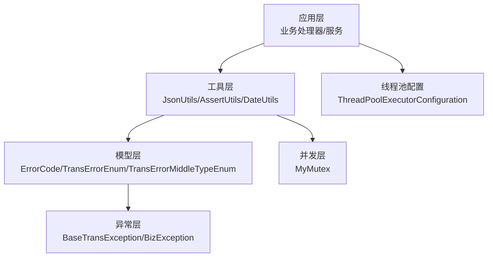
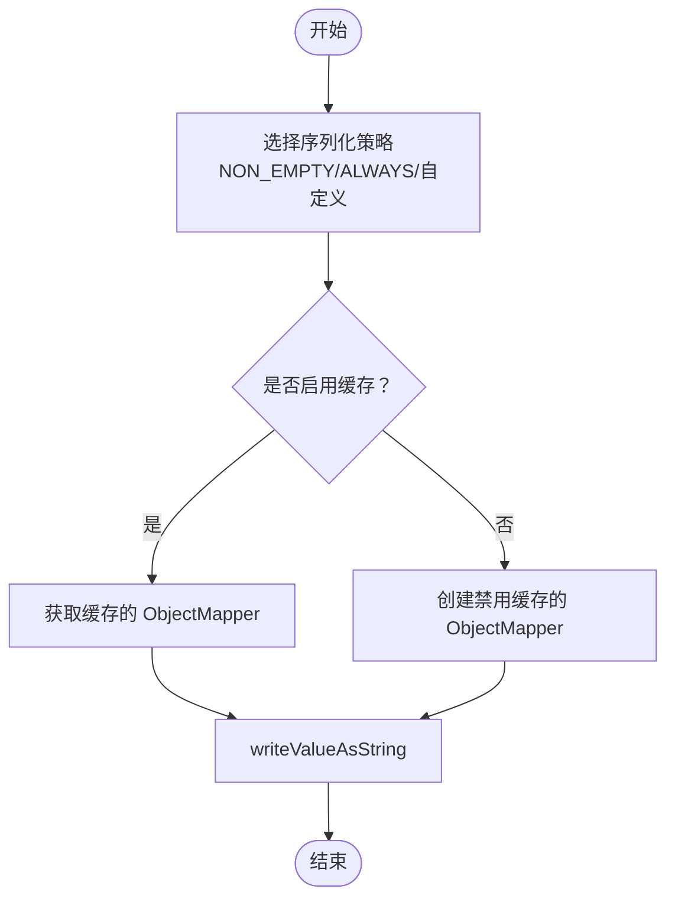
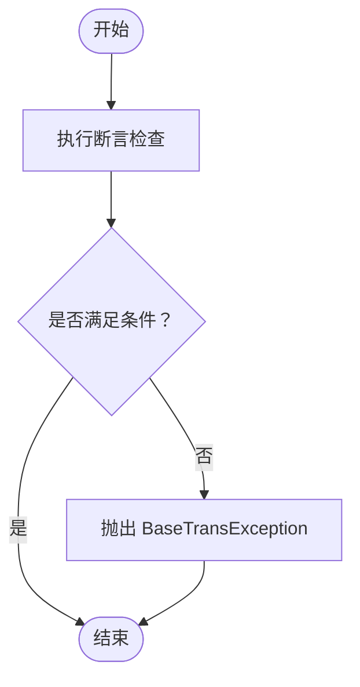
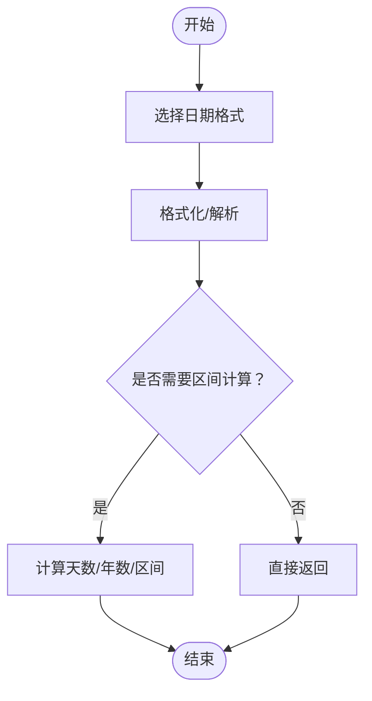
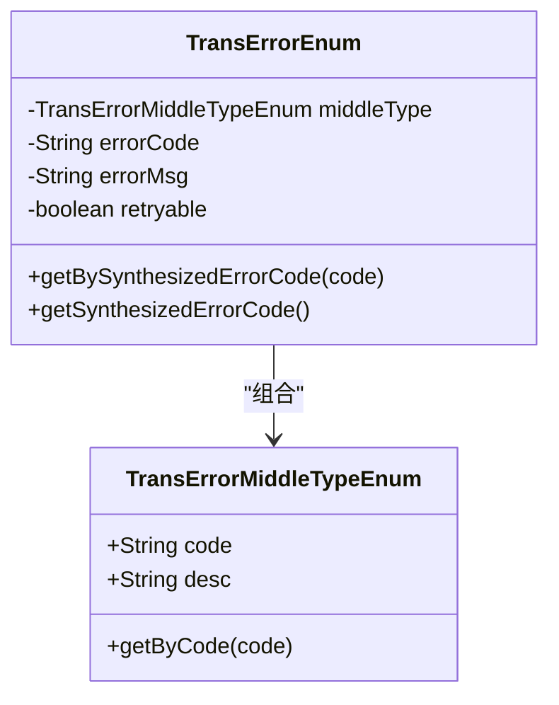
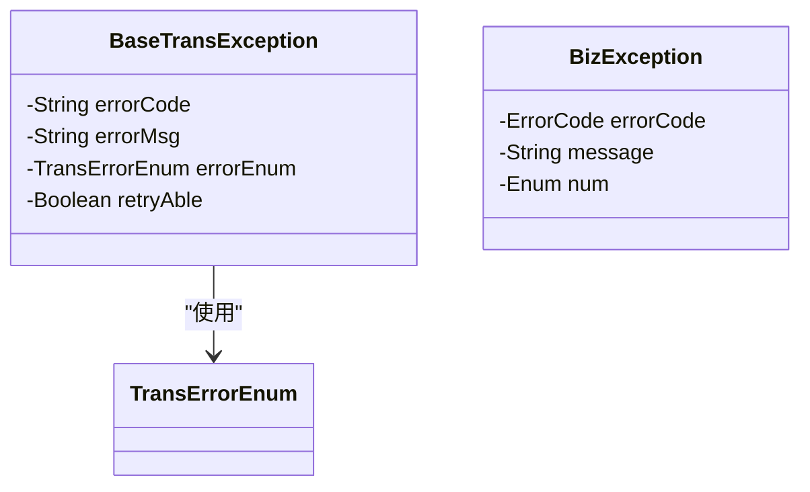
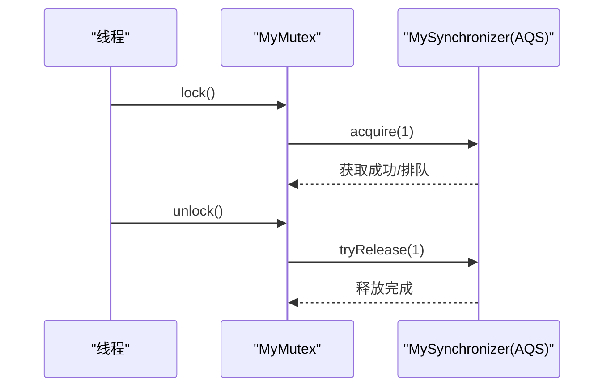
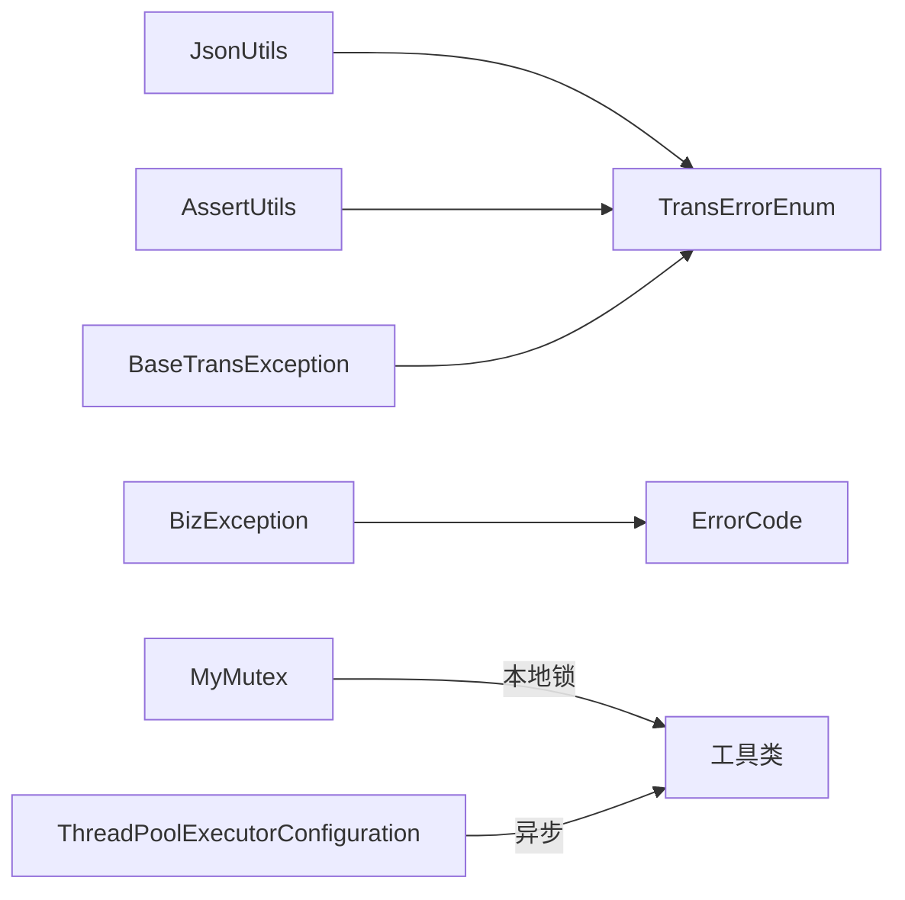

# 通用工具类

<cite>
**本文引用的文件**   
- [JsonUtils.java](file://common-util/src/main/java/com/magicliang/transaction/sys/common/util/JsonUtils.java)
- [AssertUtils.java](file://common-util/src/main/java/com/magicliang/transaction/sys/common/util/AssertUtils.java)
- [DateUtils.java](file://common-util/src/main/java/com/magicliang/transaction/sys/common/util/DateUtils.java)
- [ErrorCode.java](file://common-util/src/main/java/com/magicliang/transaction/sys/common/constant/ErrorCode.java)
- [TransConstant.java](file://common-util/src/main/java/com/magicliang/transaction/sys/common/constant/TransConstant.java)
- [ErrorConstant.java](file://common-util/src/main/java/com/magicliang/transaction/sys/common/constant/ErrorConstant.java)
- [TransErrorEnum.java](file://common-util/src/main/java/com/magicliang/transaction/sys/common/enums/TransErrorEnum.java)
- [TransErrorMiddleTypeEnum.java](file://common-util/src/main/java/com/magicliang/transaction/sys/common/enums/TransErrorMiddleTypeEnum.java)
- [BaseTransException.java](file://common-util/src/main/java/com/magicliang/transaction/sys/common/exception/BaseTransException.java)
- [BizException.java](file://common-util/src/main/java/com/magicliang/transaction/sys/common/exception/BizException.java)
- [MyMutex.java](file://common-util/src/main/java/com/magicliang/transaction/sys/common/concurrent/lock/MyMutex.java)
- [CollectionUtilPlus.java](file://common-util/src/main/java/com/magicliang/transaction/sys/common/util/CollectionUtilPlus.java)
- [ObjectUtilPlus.java](file://common-util/src/main/java/com/magicliang/transaction/sys/common/util/ObjectUtilPlus.java)
- [CommonUtils.java](file://common-util/src/main/java/com/magicliang/transaction/sys/common/util/CommonUtils.java)
- [ThreadPoolExecutorConfiguration.java](file://biz-service-impl/src/main/java/com/magicliang/transaction/sys/biz/service/impl/web/config/ThreadPoolExecutorConfiguration.java)
</cite>

## 目录
1. [简介](#简介)
2. [项目结构](#项目结构)
3. [核心组件](#核心组件)
4. [架构总览](#架构总览)
5. [详细组件分析](#详细组件分析)
6. [依赖分析](#依赖分析)
7. [性能考量](#性能考量)
8. [故障排查指南](#故障排查指南)
9. [结论](#结论)
10. [附录](#附录)

## 简介
本指南聚焦领域驱动交易系统中的通用工具类与辅助组件，覆盖以下主题：
- 常用工具类：JsonUtils、AssertUtils、DateUtils、CollectionUtilPlus、ObjectUtilPlus、CommonUtils
- 常量与枚举：ErrorCode、TransConstant、ErrorConstant、TransErrorEnum、TransErrorMiddleTypeEnum
- 异常体系：BaseTransException、BizException
- 并发工具：MyMutex（基于 AQS 的自定义互斥锁）
- 线程池配置：Spring 线程池配置示例
- 使用示例、最佳实践、性能优化与常见问题

## 项目结构
通用工具类集中于 common-util 模块，异常、常量、枚举位于同一模块；并发锁 MyMutex 亦在此模块；线程池配置位于 biz-service-impl 模块。

**图表来源**
- [JsonUtils.java:1-293](file://common-util/src/main/java/com/magicliang/transaction/sys/common/util/JsonUtils.java#L1-L293)
- [AssertUtils.java:1-109](file://common-util/src/main/java/com/magicliang/transaction/sys/common/util/AssertUtils.java#L1-L109)
- [DateUtils.java:1-941](file://common-util/src/main/java/com/magicliang/transaction/sys/common/util/DateUtils.java#L1-L941)
- [TransErrorEnum.java:1-327](file://common-util/src/main/java/com/magicliang/transaction/sys/common/enums/TransErrorEnum.java#L1-L327)
- [TransErrorMiddleTypeEnum.java:1-78](file://common-util/src/main/java/com/magicliang/transaction/sys/common/enums/TransErrorMiddleTypeEnum.java#L1-L78)
- [ErrorCode.java:1-46](file://common-util/src/main/java/com/magicliang/transaction/sys/common/constant/ErrorCode.java#L1-L46)
- [TransConstant.java:1-27](file://common-util/src/main/java/com/magicliang/transaction/sys/common/constant/TransConstant.java#L1-L27)
- [ErrorConstant.java:1-30](file://common-util/src/main/java/com/magicliang/transaction/sys/common/constant/ErrorConstant.java#L1-L30)
- [BaseTransException.java:1-125](file://common-util/src/main/java/com/magicliang/transaction/sys/common/exception/BaseTransException.java#L1-L125)
- [BizException.java:1-93](file://common-util/src/main/java/com/magicliang/transaction/sys/common/exception/BizException.java#L1-L93)
- [MyMutex.java:1-385](file://common-util/src/main/java/com/magicliang/transaction/sys/common/concurrent/lock/MyMutex.java#L1-L385)
- [ThreadPoolExecutorConfiguration.java:1-52](file://biz-service-impl/src/main/java/com/magicliang/transaction/sys/biz/service/impl/web/config/ThreadPoolExecutorConfiguration.java#L1-L52)

**章节来源**
- [JsonUtils.java:1-293](file://common-util/src/main/java/com/magicliang/transaction/sys/common/util/JsonUtils.java#L1-L293)
- [AssertUtils.java:1-109](file://common-util/src/main/java/com/magicliang/transaction/sys/common/util/AssertUtils.java#L1-L109)
- [DateUtils.java:1-941](file://common-util/src/main/java/com/magicliang/transaction/sys/common/util/DateUtils.java#L1-L941)
- [TransErrorEnum.java:1-327](file://common-util/src/main/java/com/magicliang/transaction/sys/common/enums/TransErrorEnum.java#L1-L327)
- [TransErrorMiddleTypeEnum.java:1-78](file://common-util/src/main/java/com/magicliang/transaction/sys/common/enums/TransErrorMiddleTypeEnum.java#L1-L78)
- [ErrorCode.java:1-46](file://common-util/src/main/java/com/magicliang/transaction/sys/common/constant/ErrorCode.java#L1-L46)
- [TransConstant.java:1-27](file://common-util/src/main/java/com/magicliang/transaction/sys/common/constant/TransConstant.java#L1-L27)
- [ErrorConstant.java:1-30](file://common-util/src/main/java/com/magicliang/transaction/sys/common/constant/ErrorConstant.java#L1-L30)
- [BaseTransException.java:1-125](file://common-util/src/main/java/com/magicliang/transaction/sys/common/exception/BaseTransException.java#L1-L125)
- [BizException.java:1-93](file://common-util/src/main/java/com/magicliang/transaction/sys/common/exception/BizException.java#L1-L93)
- [MyMutex.java:1-385](file://common-util/src/main/java/com/magicliang/transaction/sys/common/concurrent/lock/MyMutex.java#L1-L385)
- [ThreadPoolExecutorConfiguration.java:1-52](file://biz-service-impl/src/main/java/com/magicliang/transaction/sys/biz/service/impl/web/config/ThreadPoolExecutorConfiguration.java#L1-L52)

## 核心组件
- JSON 工具：JsonUtils 提供多种序列化/反序列化策略，支持缓存与非缓存、驼峰与下划线命名策略、泛型集合与节点转换。
- 断言工具：AssertUtils 提供对象、字符串、集合、相等性与布尔断言，统一抛出 BaseTransException。
- 日期工具：DateUtils 提供格式化、解析、区间计算、零点/月末/月末最后秒等常用日期处理。
- 常量与枚举：ErrorCode、TransConstant、ErrorConstant 定义错误载体、交易常量与错误提示常量；TransErrorEnum/TransErrorMiddleTypeEnum 组合形成统一错误码体系。
- 异常体系：BaseTransException 以错误枚举合成错误码并支持可重试标记；BizException 用于通用业务异常承载。
- 并发工具：MyMutex 基于 AQS 的轻量互斥锁实现，提供 lock/unlock、tryLock、条件等待等能力。
- 集合与对象工具：CollectionUtilPlus/ObjectUtilPlus 提供集合相等性与空值判断增强；CommonUtils 提供去重查找。

**章节来源**
- [JsonUtils.java:90-293](file://common-util/src/main/java/com/magicliang/transaction/sys/common/util/JsonUtils.java#L90-L293)
- [AssertUtils.java:28-109](file://common-util/src/main/java/com/magicliang/transaction/sys/common/util/AssertUtils.java#L28-L109)
- [DateUtils.java:35-941](file://common-util/src/main/java/com/magicliang/transaction/sys/common/util/DateUtils.java#L35-L941)
- [ErrorCode.java:22-46](file://common-util/src/main/java/com/magicliang/transaction/sys/common/constant/ErrorCode.java#L22-L46)
- [TransConstant.java:12-27](file://common-util/src/main/java/com/magicliang/transaction/sys/common/constant/TransConstant.java#L12-L27)
- [ErrorConstant.java:12-30](file://common-util/src/main/java/com/magicliang/transaction/sys/common/constant/ErrorConstant.java#L12-L30)
- [TransErrorEnum.java:20-327](file://common-util/src/main/java/com/magicliang/transaction/sys/common/enums/TransErrorEnum.java#L20-L327)
- [TransErrorMiddleTypeEnum.java:15-78](file://common-util/src/main/java/com/magicliang/transaction/sys/common/enums/TransErrorMiddleTypeEnum.java#L15-L78)
- [BaseTransException.java:18-125](file://common-util/src/main/java/com/magicliang/transaction/sys/common/exception/BaseTransException.java#L18-L125)
- [BizException.java:18-93](file://common-util/src/main/java/com/magicliang/transaction/sys/common/exception/BizException.java#L18-L93)
- [MyMutex.java:20-385](file://common-util/src/main/java/com/magicliang/transaction/sys/common/concurrent/lock/MyMutex.java#L20-L385)
- [CollectionUtilPlus.java:15-36](file://common-util/src/main/java/com/magicliang/transaction/sys/common/util/CollectionUtilPlus.java#L15-L36)
- [ObjectUtilPlus.java:12-44](file://common-util/src/main/java/com/magicliang/transaction/sys/common/util/ObjectUtilPlus.java#L12-L44)
- [CommonUtils.java:18-48](file://common-util/src/main/java/com/magicliang/transaction/sys/common/util/CommonUtils.java#L18-L48)

## 架构总览
通用工具类围绕“数据编解码（JSON）—断言—日期—错误模型—异常—并发—集合/对象—线程池”构建，形成清晰的分层与职责边界。

**图表来源**
- [JsonUtils.java:1-293](file://common-util/src/main/java/com/magicliang/transaction/sys/common/util/JsonUtils.java#L1-L293)
- [AssertUtils.java:1-109](file://common-util/src/main/java/com/magicliang/transaction/sys/common/util/AssertUtils.java#L1-L109)
- [DateUtils.java:1-941](file://common-util/src/main/java/com/magicliang/transaction/sys/common/util/DateUtils.java#L1-L941)
- [ErrorCode.java:1-46](file://common-util/src/main/java/com/magicliang/transaction/sys/common/constant/ErrorCode.java#L1-L46)
- [TransErrorEnum.java:1-327](file://common-util/src/main/java/com/magicliang/transaction/sys/common/enums/TransErrorEnum.java#L1-L327)
- [TransErrorMiddleTypeEnum.java:1-78](file://common-util/src/main/java/com/magicliang/transaction/sys/common/enums/TransErrorMiddleTypeEnum.java#L1-L78)
- [BaseTransException.java:1-125](file://common-util/src/main/java/com/magicliang/transaction/sys/common/exception/BaseTransException.java#L1-L125)
- [BizException.java:1-93](file://common-util/src/main/java/com/magicliang/transaction/sys/common/exception/BizException.java#L1-L93)
- [MyMutex.java:1-385](file://common-util/src/main/java/com/magicliang/transaction/sys/common/concurrent/lock/MyMutex.java#L1-L385)
- [ThreadPoolExecutorConfiguration.java:1-52](file://biz-service-impl/src/main/java/com/magicliang/transaction/sys/biz/service/impl/web/config/ThreadPoolExecutorConfiguration.java#L1-L52)

## 详细组件分析

### JSON 工具：JsonUtils
- 设计要点
  - 内置多策略 ObjectMapper：包含默认包含策略、仅非空策略、驼峰转下划线策略；支持缓存与禁用缓存版本。
  - 静态工厂与缓存：通过 ConcurrentHashMap 缓存自定义 include 策略的 ObjectMapper，避免频繁创建。
  - 安全反序列化：默认关闭未知属性报错，提升兼容性；异常统一记录日志并返回空结果。
- 常用方法
  - 序列化：toJson、toJsonWithNonNull、toJsonNoCache、toJson（带 include 策略）
  - 反序列化：toObject、toObjectCamelIgnore、toList、toMapObject、toJsonNode
- 使用建议
  - 优先使用 NON_EMPTY 策略减少冗余字段传输；仅在特殊场景启用 ALWAYS。
  - 大量临时转换时使用禁用缓存版本，避免线程局部缓冲导致 GC 压力。
  - 驼峰与下划线命名转换适用于与下游系统字段命名差异较大的场景。

**图表来源**
- [JsonUtils.java:99-134](file://common-util/src/main/java/com/magicliang/transaction/sys/common/util/JsonUtils.java#L99-L134)

**章节来源**
- [JsonUtils.java:30-293](file://common-util/src/main/java/com/magicliang/transaction/sys/common/util/JsonUtils.java#L30-L293)

### 断言工具：AssertUtils
- 设计要点
  - 提供空值、非空、非空白、非空集合、单元素集合、相等性、布尔断言。
  - 统一抛出 BaseTransException，便于上层统一处理。
- 使用建议
  - 在业务入口与前置校验阶段使用，确保输入合法性。
  - 与 TransErrorEnum 搭配，保证错误信息与错误码一致。

**图表来源**
- [AssertUtils.java:35-107](file://common-util/src/main/java/com/magicliang/transaction/sys/common/util/AssertUtils.java#L35-L107)
- [BaseTransException.java:44-123](file://common-util/src/main/java/com/magicliang/transaction/sys/common/exception/BaseTransException.java#L44-L123)

**章节来源**
- [AssertUtils.java:19-109](file://common-util/src/main/java/com/magicliang/transaction/sys/common/util/AssertUtils.java#L19-L109)

### 日期工具：DateUtils
- 设计要点
  - 提供多种格式常量与格式化/解析方法。
  - 支持天数/年数计算、指定日期增减、同日判断、区间判断、零点/月末/月末最后秒等。
  - 使用 Apache Commons Lang 与 JDK 时间 API，兼顾易用性与性能。
- 使用建议
  - 优先使用常量格式，避免魔法字符串。
  - 长时间窗口计算使用毫秒级差值，注意时区与夏令时影响。

**图表来源**
- [DateUtils.java:75-113](file://common-util/src/main/java/com/magicliang/transaction/sys/common/util/DateUtils.java#L75-L113)
- [DateUtils.java:147-176](file://common-util/src/main/java/com/magicliang/transaction/sys/common/util/DateUtils.java#L147-L176)

**章节来源**
- [DateUtils.java:33-941](file://common-util/src/main/java/com/magicliang/transaction/sys/common/util/DateUtils.java#L33-L941)

### 常量与枚举：ErrorCode、TransConstant、ErrorConstant、TransErrorEnum、TransErrorMiddleTypeEnum
- 设计要点
  - ErrorCode：封装 code/type/message 的错误载体，便于跨层传递。
  - TransConstant：交易系统常量（如初始版本号）。
  - ErrorConstant：错误提示常量（如无效旧/新状态）。
  - TransErrorMiddleTypeEnum：错误中间类型（本系统/第二方/第三方业务/系统）。
  - TransErrorEnum：组合中间类型与具体错误码，提供合成错误码与可重试标记。
- 使用建议
  - 错误码合成遵循“核心系统码 + 中间类型 + 具体码”，便于定位来源与类型。
  - 可重试标记用于决定是否进行自动重试或降级策略。

**图表来源**
- [TransErrorMiddleTypeEnum.java:15-78](file://common-util/src/main/java/com/magicliang/transaction/sys/common/enums/TransErrorMiddleTypeEnum.java#L15-L78)
- [TransErrorEnum.java:20-327](file://common-util/src/main/java/com/magicliang/transaction/sys/common/enums/TransErrorEnum.java#L20-L327)

**章节来源**
- [ErrorCode.java:19-46](file://common-util/src/main/java/com/magicliang/transaction/sys/common/constant/ErrorCode.java#L19-L46)
- [TransConstant.java:12-27](file://common-util/src/main/java/com/magicliang/transaction/sys/common/constant/TransConstant.java#L12-L27)
- [ErrorConstant.java:12-30](file://common-util/src/main/java/com/magicliang/transaction/sys/common/constant/ErrorConstant.java#L12-L30)
- [TransErrorEnum.java:20-327](file://common-util/src/main/java/com/magicliang/transaction/sys/common/enums/TransErrorEnum.java#L20-L327)
- [TransErrorMiddleTypeEnum.java:15-78](file://common-util/src/main/java/com/magicliang/transaction/sys/common/enums/TransErrorMiddleTypeEnum.java#L15-L78)

### 异常体系：BaseTransException、BizException
- 设计要点
  - BaseTransException：以 TransErrorEnum 合成错误码，支持自定义错误码/消息与可重试标记。
  - BizException：通用业务异常，支持多种构造方式，承载 ErrorCode 或枚举。
- 使用建议
  - 业务层优先使用 AssertUtils + BaseTransException，保证错误一致性。
  - 跨模块/第三方调用异常建议包装为 BizException，保留上下文信息。

**图表来源**
- [BaseTransException.java:18-125](file://common-util/src/main/java/com/magicliang/transaction/sys/common/exception/BaseTransException.java#L18-L125)
- [BizException.java:18-93](file://common-util/src/main/java/com/magicliang/transaction/sys/common/exception/BizException.java#L18-L93)
- [TransErrorEnum.java:20-327](file://common-util/src/main/java/com/magicliang/transaction/sys/common/enums/TransErrorEnum.java#L20-L327)

**章节来源**
- [BaseTransException.java:18-125](file://common-util/src/main/java/com/magicliang/transaction/sys/common/exception/BaseTransException.java#L18-L125)
- [BizException.java:18-93](file://common-util/src/main/java/com/magicliang/transaction/sys/common/exception/BizException.java#L18-L93)

### 并发工具：MyMutex（基于 AQS 的互斥锁）
- 设计要点
  - 基于 AbstractQueuedSynchronizer，实现独占式互斥锁。
  - 提供 lock、unlock、tryLock、lockInterruptibly、newCondition 等标准能力。
  - 不支持重入，状态 0 表示释放，1 表示占用。
- 使用建议
  - 适合短临界区、无重入需求的场景。
  - 配合条件变量实现等待/唤醒逻辑。

**图表来源**
- [MyMutex.java:44-223](file://common-util/src/main/java/com/magicliang/transaction/sys/common/concurrent/lock/MyMutex.java#L44-L223)
- [MyMutex.java:310-367](file://common-util/src/main/java/com/magicliang/transaction/sys/common/concurrent/lock/MyMutex.java#L310-L367)

**章节来源**
- [MyMutex.java:20-385](file://common-util/src/main/java/com/magicliang/transaction/sys/common/concurrent/lock/MyMutex.java#L20-L385)

### 集合与对象工具：CollectionUtilPlus、ObjectUtilPlus、CommonUtils
- 设计要点
  - CollectionUtilPlus：增强集合相等性判断，处理空值边界。
  - ObjectUtilPlus：提供多个对象空值判断工具。
  - CommonUtils：基于流的重复元素查找。
- 使用建议
  - 在对比/去重场景优先使用这些工具，避免手写样板代码。

**章节来源**
- [CollectionUtilPlus.java:15-36](file://common-util/src/main/java/com/magicliang/transaction/sys/common/util/CollectionUtilPlus.java#L15-L36)
- [ObjectUtilPlus.java:12-44](file://common-util/src/main/java/com/magicliang/transaction/sys/common/util/ObjectUtilPlus.java#L12-L44)
- [CommonUtils.java:18-48](file://common-util/src/main/java/com/magicliang/transaction/sys/common/util/CommonUtils.java#L18-L48)

### 线程池配置：ThreadPoolExecutorConfiguration
- 设计要点
  - Spring 线程池：核心线程 4、最大线程 8、队列容量 1200、存活时间 10s、拒绝策略 CallerRunsPolicy。
  - 名称前缀“async-thread-pool-”，便于日志与监控区分。
- 使用建议
  - 适用于异步任务较多但不希望无限堆积的场景；可根据业务峰值调整核心/最大线程与队列容量。

**章节来源**
- [ThreadPoolExecutorConfiguration.java:22-52](file://biz-service-impl/src/main/java/com/magicliang/transaction/sys/biz/service/impl/web/config/ThreadPoolExecutorConfiguration.java#L22-L52)

## 依赖分析
- 工具类之间低耦合：JsonUtils/AssertUtils/DateUtils 仅依赖基础工具与枚举；异常与常量独立于业务。
- 错误模型贯穿：TransErrorEnum 作为错误码合成中心，被 BaseTransException 使用。
- 并发与线程池：MyMutex 为本地锁，线程池配置为异步执行提供支撑。

**图表来源**
- [JsonUtils.java:1-293](file://common-util/src/main/java/com/magicliang/transaction/sys/common/util/JsonUtils.java#L1-L293)
- [AssertUtils.java:1-109](file://common-util/src/main/java/com/magicliang/transaction/sys/common/util/AssertUtils.java#L1-L109)
- [BaseTransException.java:1-125](file://common-util/src/main/java/com/magicliang/transaction/sys/common/exception/BaseTransException.java#L1-L125)
- [BizException.java:1-93](file://common-util/src/main/java/com/magicliang/transaction/sys/common/exception/BizException.java#L1-L93)
- [MyMutex.java:1-385](file://common-util/src/main/java/com/magicliang/transaction/sys/common/concurrent/lock/MyMutex.java#L1-L385)
- [ThreadPoolExecutorConfiguration.java:1-52](file://biz-service-impl/src/main/java/com/magicliang/transaction/sys/biz/service/impl/web/config/ThreadPoolExecutorConfiguration.java#L1-L52)

**章节来源**
- [TransErrorEnum.java:20-327](file://common-util/src/main/java/com/magicliang/transaction/sys/common/enums/TransErrorEnum.java#L20-L327)

## 性能考量
- JSON 序列化
  - 默认使用 NON_EMPTY 策略减少网络负载；大量临时对象建议禁用缓存以降低 GC 压力。
  - 驼峰与下划线命名转换仅在必要时使用，避免额外开销。
- 日期处理
  - 使用常量格式与 DateFormatUtils 提升性能；避免频繁创建 SimpleDateFormat。
- 并发锁
  - MyMutex 不支持重入，避免不必要的复杂度；短临界区首选。
- 线程池
  - 根据任务特征调整核心/最大线程与队列容量；CallerRunsPolicy 适合作为保护策略。

[本节为通用指导，无需特定文件引用]

## 故障排查指南
- JSON 反序列化失败
  - 现象：日志记录反序列化失败，返回空结果。
  - 排查：确认输入 JSON 格式、字段命名策略、是否启用缓存。
  - 参考路径：[JsonUtils.java:128-134](file://common-util/src/main/java/com/magicliang/transaction/sys/common/util/JsonUtils.java#L128-L134)
- 断言失败抛出异常
  - 现象：触发 BaseTransException。
  - 排查：核对 TransErrorEnum 与错误信息；确认是否应改为可重试。
  - 参考路径：[AssertUtils.java:103-107](file://common-util/src/main/java/com/magicliang/transaction/sys/common/util/AssertUtils.java#L103-L107)、[BaseTransException.java:104-123](file://common-util/src/main/java/com/magicliang/transaction/sys/common/exception/BaseTransException.java#L104-L123)
- 日期解析异常
  - 现象：UnsupportedOperationException 或日志错误。
  - 排查：检查格式字符串与 lenient 设置；避免宽松解析导致的隐式错误。
  - 参考路径：[DateUtils.java:167-174](file://common-util/src/main/java/com/magicliang/transaction/sys/common/util/DateUtils.java#L167-L174)
- 并发锁异常
  - 现象：IllegalMonitorStateException（非持有线程释放）。
  - 排查：确保 lock/unlock 成对出现；避免跨线程释放。
  - 参考路径：[MyMutex.java:355-362](file://common-util/src/main/java/com/magicliang/transaction/sys/common/concurrent/lock/MyMutex.java#L355-L362)
- 线程池饱和
  - 现象：CallerRunsPolicy 触发主线程执行任务。
  - 排查：评估队列容量与拒绝策略；必要时扩容或限流。
  - 参考路径：[ThreadPoolExecutorConfiguration.java:44-49](file://biz-service-impl/src/main/java/com/magicliang/transaction/sys/biz/service/impl/web/config/ThreadPoolExecutorConfiguration.java#L44-L49)

**章节来源**
- [JsonUtils.java:128-134](file://common-util/src/main/java/com/magicliang/transaction/sys/common/util/JsonUtils.java#L128-L134)
- [AssertUtils.java:103-107](file://common-util/src/main/java/com/magicliang/transaction/sys/common/util/AssertUtils.java#L103-L107)
- [BaseTransException.java:104-123](file://common-util/src/main/java/com/magicliang/transaction/sys/common/exception/BaseTransException.java#L104-L123)
- [DateUtils.java:167-174](file://common-util/src/main/java/com/magicliang/transaction/sys/common/util/DateUtils.java#L167-L174)
- [MyMutex.java:355-362](file://common-util/src/main/java/com/magicliang/transaction/sys/common/concurrent/lock/MyMutex.java#L355-L362)
- [ThreadPoolExecutorConfiguration.java:44-49](file://biz-service-impl/src/main/java/com/magicliang/transaction/sys/biz/service/impl/web/config/ThreadPoolExecutorConfiguration.java#L44-L49)

## 结论
本指南梳理了领域驱动交易系统中的通用工具类与辅助组件，强调了：
- 统一的错误模型与异常体系，确保错误可追踪、可重试；
- 高效的 JSON/日期工具与增强的集合/对象工具；
- 明确的并发与线程池配置原则；
- 可落地的最佳实践与故障排查路径。

[本节为总结，无需特定文件引用]

## 附录
- 使用示例与最佳实践
  - JSON：优先使用 NON_EMPTY 策略；大对象临时转换使用禁用缓存版本。
  - 断言：在入口与前置校验阶段使用 AssertUtils + TransErrorEnum。
  - 日期：使用常量格式；避免频繁创建格式化器。
  - 并发：短临界区使用 MyMutex；配合条件变量实现等待/唤醒。
  - 线程池：根据任务特征调整核心/最大线程与队列容量；合理选择拒绝策略。
- 性能优化建议
  - 减少对象创建：复用 ObjectMapper 与日期格式器。
  - 降低 GC 压力：禁用缓存用于临时转换。
  - 控制锁粒度：避免长临界区；尽量使用无重入锁。
  - 异步化：将耗时任务放入线程池，避免阻塞主线程。

[本节为通用指导，无需特定文件引用]