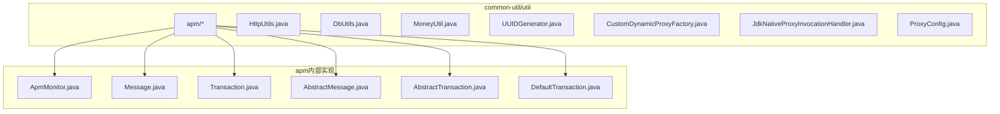
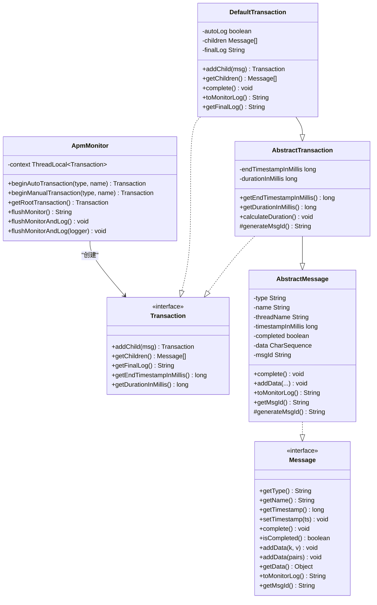
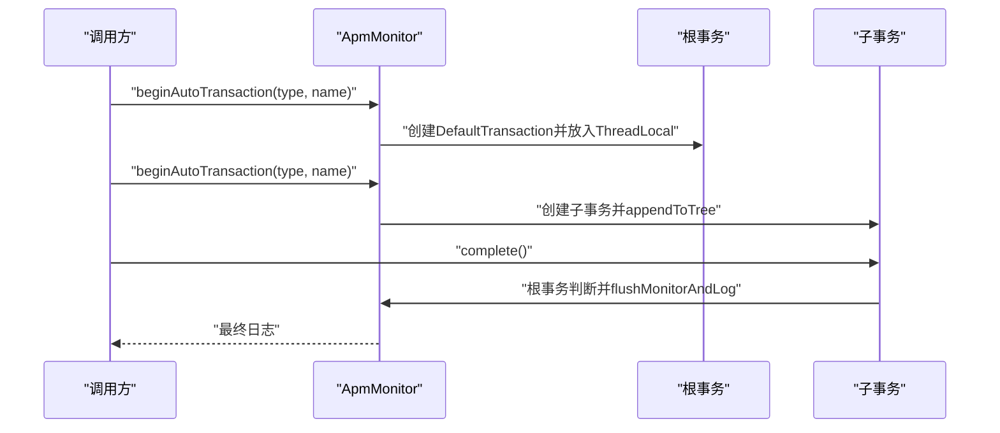
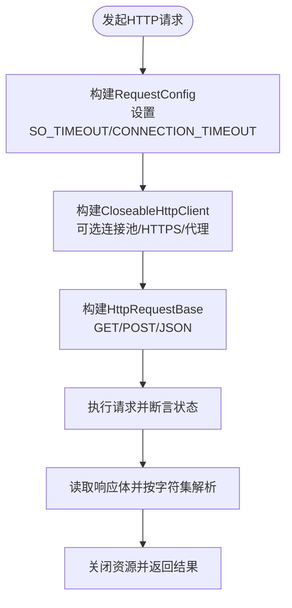
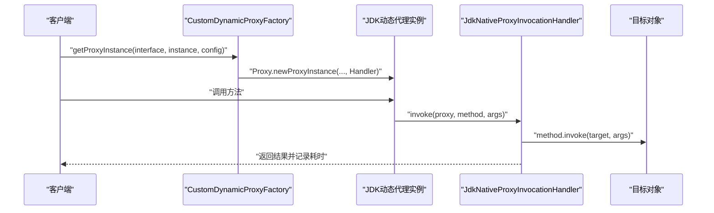
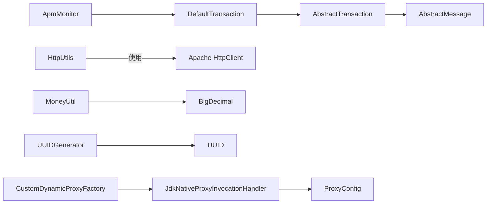

# 高级工具类

<cite>
**本文引用的文件**
- [common-util/src/main/java/com/magicliang/transaction/sys/common/util/apm/ApmMonitor.java](file://common-util/src/main/java/com/magicliang/transaction/sys/common/util/apm/ApmMonitor.java)
- [common-util/src/main/java/com/magicliang/transaction/sys/common/util/apm/Transaction.java](file://common-util/src/main/java/com/magicliang/transaction/sys/common/util/apm/Transaction.java)
- [common-util/src/main/java/com/magicliang/transaction/sys/common/util/apm/Message.java](file://common-util/src/main/java/com/magicliang/transaction/sys/common/util/apm/Message.java)
- [common-util/src/main/java/com/magicliang/transaction/sys/common/util/apm/internal/DefaultTransaction.java](file://common-util/src/main/java/com/magicliang/transaction/sys/common/util/apm/internal/DefaultTransaction.java)
- [common-util/src/main/java/com/magicliang/transaction/sys/common/util/apm/internal/AbstractTransaction.java](file://common-util/src/main/java/com/magicliang/transaction/sys/common/util/apm/internal/AbstractTransaction.java)
- [common-util/src/main/java/com/magicliang/transaction/sys/common/util/apm/internal/AbstractMessage.java](file://common-util/src/main/java/com/magicliang/transaction/sys/common/util/apm/internal/AbstractMessage.java)
- [common-util/src/main/java/com/magicliang/transaction/sys/common/util/HttpUtils.java](file://common-util/src/main/java/com/magicliang/transaction/sys/common/util/HttpUtils.java)
- [common-util/src/main/java/com/magicliang/transaction/sys/common/util/DbUtils.java](file://common-util/src/main/java/com/magicliang/transaction/sys/common/util/DbUtils.java)
- [common-util/src/main/java/com/magicliang/transaction/sys/common/util/MoneyUtil.java](file://common-util/src/main/java/com/magicliang/transaction/sys/common/util/MoneyUtil.java)
- [common-util/src/main/java/com/magicliang/transaction/sys/common/util/UUIDGenerator.java](file://common-util/src/main/java/com/magicliang/transaction/sys/common/util/UUIDGenerator.java)
- [common-util/src/main/java/com/magicliang/transaction/sys/common/util/CustomDynamicProxyFactory.java](file://common-util/src/main/java/com/magicliang/transaction/sys/common/util/CustomDynamicProxyFactory.java)
- [common-util/src/main/java/com/magicliang/transaction/sys/common/util/JdkNativeProxyInvocationHandler.java](file://common-util/src/main/java/com/magicliang/transaction/sys/common/util/JdkNativeProxyInvocationHandler.java)
- [common-util/src/main/java/com/magicliang/transaction/sys/common/util/ProxyConfig.java](file://common-util/src/main/java/com/magicliang/transaction/sys/common/util/ProxyConfig.java)
- [common-util/src/test/java/com/magicliang/transaction/sys/common/util/apm/TransactionTest.java](file://common-util/src/test/java/com/magicliang/transaction/sys/common/util/apm/TransactionTest.java)
</cite>

## 目录
1. [简介](#简介)
2. [项目结构](#项目结构)
3. [核心组件](#核心组件)
4. [架构总览](#架构总览)
5. [详细组件分析](#详细组件分析)
6. [依赖关系分析](#依赖关系分析)
7. [性能考量](#性能考量)
8. [故障排查指南](#故障排查指南)
9. [结论](#结论)
10. [附录](#附录)

## 简介
本指南聚焦领域驱动交易系统中的高级工具类，系统性讲解以下专业级工具与实现：
- APM监控工具链：ApmMonitor监控器、Transaction事务追踪、Message消息处理及内部实现（DefaultTransaction、AbstractTransaction、AbstractMessage）
- HttpUtils网络请求工具：HTTP客户端配置、请求重试、超时处理、HTTPS与连接池等企业级特性
- DbUtils数据库操作工具：批量校验、连接池管理思想、事务控制相关辅助
- MoneyUtil金额处理工具：精确计算、货币精度控制、四舍五入策略、金额比较
- UUIDGenerator唯一标识生成器：实现原理与使用场景
- 动态代理工厂与JDK原生代理处理器：AOP实现机制（非Spring版本）

同时提供真实测试用例路径与性能优化建议，帮助读者在生产环境中安全高效地使用这些工具。

## 项目结构
高级工具类主要位于common-util模块的util包内，并配套apm子包用于监控追踪；测试用例位于common-util的test目录中。

**图表来源**
- [common-util/src/main/java/com/magicliang/transaction/sys/common/util/apm/ApmMonitor.java:1-233](file://common-util/src/main/java/com/magicliang/transaction/sys/common/util/apm/ApmMonitor.java#L1-L233)
- [common-util/src/main/java/com/magicliang/transaction/sys/common/util/apm/Message.java:1-109](file://common-util/src/main/java/com/magicliang/transaction/sys/common/util/apm/Message.java#L1-L109)
- [common-util/src/main/java/com/magicliang/transaction/sys/common/util/apm/Transaction.java:1-62](file://common-util/src/main/java/com/magicliang/transaction/sys/common/util/apm/Transaction.java#L1-L62)
- [common-util/src/main/java/com/magicliang/transaction/sys/common/util/apm/internal/AbstractMessage.java:1-229](file://common-util/src/main/java/com/magicliang/transaction/sys/common/util/apm/internal/AbstractMessage.java#L1-L229)
- [common-util/src/main/java/com/magicliang/transaction/sys/common/util/apm/internal/AbstractTransaction.java:1-100](file://common-util/src/main/java/com/magicliang/transaction/sys/common/util/apm/internal/AbstractTransaction.java#L1-L100)
- [common-util/src/main/java/com/magicliang/transaction/sys/common/util/apm/internal/DefaultTransaction.java:1-192](file://common-util/src/main/java/com/magicliang/transaction/sys/common/util/apm/internal/DefaultTransaction.java#L1-L192)

**章节来源**
- [common-util/src/main/java/com/magicliang/transaction/sys/common/util/HttpUtils.java:1-525](file://common-util/src/main/java/com/magicliang/transaction/sys/common/util/HttpUtils.java#L1-L525)
- [common-util/src/main/java/com/magicliang/transaction/sys/common/util/DbUtils.java:1-110](file://common-util/src/main/java/com/magicliang/transaction/sys/common/util/DbUtils.java#L1-L110)
- [common-util/src/main/java/com/magicliang/transaction/sys/common/util/MoneyUtil.java:1-154](file://common-util/src/main/java/com/magicliang/transaction/sys/common/util/MoneyUtil.java#L1-L154)
- [common-util/src/main/java/com/magicliang/transaction/sys/common/util/UUIDGenerator.java:1-44](file://common-util/src/main/java/com/magicliang/transaction/sys/common/util/UUIDGenerator.java#L1-L44)
- [common-util/src/main/java/com/magicliang/transaction/sys/common/util/CustomDynamicProxyFactory.java:1-86](file://common-util/src/main/java/com/magicliang/transaction/sys/common/util/CustomDynamicProxyFactory.java#L1-L86)
- [common-util/src/main/java/com/magicliang/transaction/sys/common/util/JdkNativeProxyInvocationHandler.java:1-66](file://common-util/src/main/java/com/magicliang/transaction/sys/common/util/JdkNativeProxyInvocationHandler.java#L1-L66)
- [common-util/src/main/java/com/magicliang/transaction/sys/common/util/ProxyConfig.java:1-22](file://common-util/src/main/java/com/magicliang/transaction/sys/common/util/ProxyConfig.java#L1-L22)

## 核心组件
- APM监控工具链：基于线程本地上下文的事务树追踪，支持自动/手动两种事务模式，具备父子嵌套、兄弟合并、最终日志输出与自动清理能力
- HttpUtils网络请求工具：封装Apache HttpClient，提供连接池、HTTPS信任策略、请求配置、状态断言、字符集与内容类型管理
- DbUtils数据库工具：提供查询/插入/更新条目数量的断言与错误码映射，便于单元测试与集成测试中的断言一致性
- MoneyUtil金额处理工具：提供分/元转换、百分比计算、四舍五入策略、金额字符串格式化与价格规整等金融级计算
- UUIDGenerator唯一标识生成器：提供随机UUID与指定位数随机数生成，满足分布式场景下的ID需求
- 动态代理工厂与JDK原生代理处理器：通过JDK动态代理实现AOP拦截（非Spring版本），支持超时阈值告警与方法执行耗时统计

**章节来源**
- [common-util/src/main/java/com/magicliang/transaction/sys/common/util/apm/ApmMonitor.java:42-233](file://common-util/src/main/java/com/magicliang/transaction/sys/common/util/apm/ApmMonitor.java#L42-L233)
- [common-util/src/main/java/com/magicliang/transaction/sys/common/util/HttpUtils.java:56-525](file://common-util/src/main/java/com/magicliang/transaction/sys/common/util/HttpUtils.java#L56-L525)
- [common-util/src/main/java/com/magicliang/transaction/sys/common/util/DbUtils.java:20-110](file://common-util/src/main/java/com/magicliang/transaction/sys/common/util/DbUtils.java#L20-L110)
- [common-util/src/main/java/com/magicliang/transaction/sys/common/util/MoneyUtil.java:17-154](file://common-util/src/main/java/com/magicliang/transaction/sys/common/util/MoneyUtil.java#L17-L154)
- [common-util/src/main/java/com/magicliang/transaction/sys/common/util/UUIDGenerator.java:15-44](file://common-util/src/main/java/com/magicliang/transaction/sys/common/util/UUIDGenerator.java#L15-L44)
- [common-util/src/main/java/com/magicliang/transaction/sys/common/util/CustomDynamicProxyFactory.java:16-86](file://common-util/src/main/java/com/magicliang/transaction/sys/common/util/CustomDynamicProxyFactory.java#L16-L86)
- [common-util/src/main/java/com/magicliang/transaction/sys/common/util/JdkNativeProxyInvocationHandler.java:17-66](file://common-util/src/main/java/com/magicliang/transaction/sys/common/util/JdkNativeProxyInvocationHandler.java#L17-L66)
- [common-util/src/main/java/com/magicliang/transaction/sys/common/util/ProxyConfig.java:14-22](file://common-util/src/main/java/com/magicliang/transaction/sys/common/util/ProxyConfig.java#L14-L22)

## 架构总览
APM监控工具链采用“监控器-消息-事务”三层架构，结合内部抽象类实现复合模式与线程本地上下文，形成可嵌套、可排序、可自动清理的调用树。

**图表来源**
- [common-util/src/main/java/com/magicliang/transaction/sys/common/util/apm/ApmMonitor.java:42-233](file://common-util/src/main/java/com/magicliang/transaction/sys/common/util/apm/ApmMonitor.java#L42-L233)
- [common-util/src/main/java/com/magicliang/transaction/sys/common/util/apm/Message.java:16-109](file://common-util/src/main/java/com/magicliang/transaction/sys/common/util/apm/Message.java#L16-L109)
- [common-util/src/main/java/com/magicliang/transaction/sys/common/util/apm/Transaction.java:18-62](file://common-util/src/main/java/com/magicliang/transaction/sys/common/util/apm/Transaction.java#L18-L62)
- [common-util/src/main/java/com/magicliang/transaction/sys/common/util/apm/internal/AbstractMessage.java:19-229](file://common-util/src/main/java/com/magicliang/transaction/sys/common/util/apm/internal/AbstractMessage.java#L19-L229)
- [common-util/src/main/java/com/magicliang/transaction/sys/common/util/apm/internal/AbstractTransaction.java:17-100](file://common-util/src/main/java/com/magicliang/transaction/sys/common/util/apm/internal/AbstractTransaction.java#L17-L100)
- [common-util/src/main/java/com/magicliang/transaction/sys/common/util/apm/internal/DefaultTransaction.java:26-192](file://common-util/src/main/java/com/magicliang/transaction/sys/common/util/apm/internal/DefaultTransaction.java#L26-L192)

## 详细组件分析

### APM监控工具链
- 设计理念：通过复合模式将操作自包含为事务，统一输出监控日志；支持自动/手动两种事务模式，自动模式在根事务完成时自动清理并输出日志
- 关键流程：
  - beginAutoTransaction/beginManualTransaction：创建事务并挂载到线程本地上下文
  - appendToTree：根据父子/兄弟规则将新事务追加到合适位置
  - complete：递归完成子事务、计算耗时、根事务自动清理上下文
  - flushMonitor/flushMonitorAndLog：输出最终日志并移除上下文

**图表来源**
- [common-util/src/main/java/com/magicliang/transaction/sys/common/util/apm/ApmMonitor.java:70-181](file://common-util/src/main/java/com/magicliang/transaction/sys/common/util/apm/ApmMonitor.java#L70-L181)
- [common-util/src/main/java/com/magicliang/transaction/sys/common/util/apm/internal/DefaultTransaction.java:100-131](file://common-util/src/main/java/com/magicliang/transaction/sys/common/util/apm/internal/DefaultTransaction.java#L100-L131)

**章节来源**
- [common-util/src/main/java/com/magicliang/transaction/sys/common/util/apm/ApmMonitor.java:42-233](file://common-util/src/main/java/com/magicliang/transaction/sys/common/util/apm/ApmMonitor.java#L42-L233)
- [common-util/src/main/java/com/magicliang/transaction/sys/common/util/apm/Transaction.java:18-62](file://common-util/src/main/java/com/magicliang/transaction/sys/common/util/apm/Transaction.java#L18-L62)
- [common-util/src/main/java/com/magicliang/transaction/sys/common/util/apm/Message.java:16-109](file://common-util/src/main/java/com/magicliang/transaction/sys/common/util/apm/Message.java#L16-L109)
- [common-util/src/main/java/com/magicliang/transaction/sys/common/util/apm/internal/DefaultTransaction.java:26-192](file://common-util/src/main/java/com/magicliang/transaction/sys/common/util/apm/internal/DefaultTransaction.java#L26-L192)
- [common-util/src/main/java/com/magicliang/transaction/sys/common/util/apm/internal/AbstractTransaction.java:17-100](file://common-util/src/main/java/com/magicliang/transaction/sys/common/util/apm/internal/AbstractTransaction.java#L17-L100)
- [common-util/src/main/java/com/magicliang/transaction/sys/common/util/apm/internal/AbstractMessage.java:19-229](file://common-util/src/main/java/com/magicliang/transaction/sys/common/util/apm/internal/AbstractMessage.java#L19-L229)

### HttpUtils网络请求工具
- 企业级特性：
  - 连接池：支持多线程连接管理器
  - HTTPS：信任所有证书的SSL策略与代理认证
  - 请求配置：统一超时时间、字符集、内容类型
  - 状态断言：仅接受200状态，异常即抛出
  - 方法封装：GET/POST/JSON/HTTPS数据发送
- 使用建议：
  - 在高并发场景启用连接池
  - 明确超时参数，避免阻塞
  - 对HTTPS环境谨慎使用“信任所有”策略，生产环境应配置可信证书

**图表来源**
- [common-util/src/main/java/com/magicliang/transaction/sys/common/util/HttpUtils.java:209-402](file://common-util/src/main/java/com/magicliang/transaction/sys/common/util/HttpUtils.java#L209-L402)

**章节来源**
- [common-util/src/main/java/com/magicliang/transaction/sys/common/util/HttpUtils.java:56-525](file://common-util/src/main/java/com/magicliang/transaction/sys/common/util/HttpUtils.java#L56-L525)

### DbUtils数据库操作工具
- 功能要点：
  - 查询/插入/更新条目数量断言，确保业务逻辑与数据库行为一致
  - 与断言工具配合，快速定位数据层异常
- 使用建议：
  - 在单元测试与集成测试中统一使用断言方法，减少重复代码
  - 结合MyBatis或JDBC模板，确保返回集合大小与预期一致

**章节来源**
- [common-util/src/main/java/com/magicliang/transaction/sys/common/util/DbUtils.java:20-110](file://common-util/src/main/java/com/magicliang/transaction/sys/common/util/DbUtils.java#L20-L110)

### MoneyUtil金额处理工具
- 精确计算能力：
  - 分/元互转、百分比计算、字符串格式化（保留两位小数，四舍五入）
  - 价格规整：不足最低金额时按规则返回最小值，否则按十元进位四舍五入
- 使用建议：
  - 金融计算统一使用BigDecimal，避免浮点误差
  - 金额比较与展示前务必格式化，确保UI与账务一致

**章节来源**
- [common-util/src/main/java/com/magicliang/transaction/sys/common/util/MoneyUtil.java:17-154](file://common-util/src/main/java/com/magicliang/transaction/sys/common/util/MoneyUtil.java#L17-L154)

### UUIDGenerator唯一标识生成器
- 实现原理：
  - 生成随机UUID并裁剪连字符，提供固定格式字符串
  - 提供指定位数随机数生成，满足特定场景的ID前缀/分段需求
- 使用场景：
  - 分布式幂等Key、订单号片段、日志追踪ID等

**章节来源**
- [common-util/src/main/java/com/magicliang/transaction/sys/common/util/UUIDGenerator.java:15-44](file://common-util/src/main/java/com/magicliang/transaction/sys/common/util/UUIDGenerator.java#L15-L44)

### 动态代理工厂与JDK原生代理处理器
- AOP实现机制（非Spring版本）：
  - CustomDynamicProxyFactory：基于JDK动态代理创建代理实例，注入JdkNativeProxyInvocationHandler
  - JdkNativeProxyInvocationHandler：拦截方法调用，统计耗时并按阈值告警
  - ProxyConfig：超时阈值配置
- 使用建议：
  - 适用于轻量AOP场景，如性能监控、超时告警
  - 注意目标对象需实现接口，且代理类为公共final类

**图表来源**
- [common-util/src/main/java/com/magicliang/transaction/sys/common/util/CustomDynamicProxyFactory.java:73-84](file://common-util/src/main/java/com/magicliang/transaction/sys/common/util/CustomDynamicProxyFactory.java#L73-L84)
- [common-util/src/main/java/com/magicliang/transaction/sys/common/util/JdkNativeProxyInvocationHandler.java:48-64](file://common-util/src/main/java/com/magicliang/transaction/sys/common/util/JdkNativeProxyInvocationHandler.java#L48-L64)
- [common-util/src/main/java/com/magicliang/transaction/sys/common/util/ProxyConfig.java:14-22](file://common-util/src/main/java/com/magicliang/transaction/sys/common/util/ProxyConfig.java#L14-L22)

**章节来源**
- [common-util/src/main/java/com/magicliang/transaction/sys/common/util/CustomDynamicProxyFactory.java:16-86](file://common-util/src/main/java/com/magicliang/transaction/sys/common/util/CustomDynamicProxyFactory.java#L16-L86)
- [common-util/src/main/java/com/magicliang/transaction/sys/common/util/JdkNativeProxyInvocationHandler.java:17-66](file://common-util/src/main/java/com/magicliang/transaction/sys/common/util/JdkNativeProxyInvocationHandler.java#L17-L66)
- [common-util/src/main/java/com/magicliang/transaction/sys/common/util/ProxyConfig.java:14-22](file://common-util/src/main/java/com/magicliang/transaction/sys/common/util/ProxyConfig.java#L14-L22)

## 依赖关系分析
- APM模块内部依赖清晰：ApmMonitor负责上下文与事务创建，DefaultTransaction继承AbstractTransaction并复用AbstractMessage能力
- 工具类之间低耦合：各工具类独立封装职责，便于替换与扩展
- 外部依赖：HttpUtils依赖Apache HttpClient与commons-lang3/commons-collections等

**图表来源**
- [common-util/src/main/java/com/magicliang/transaction/sys/common/util/apm/ApmMonitor.java:42-233](file://common-util/src/main/java/com/magicliang/transaction/sys/common/util/apm/ApmMonitor.java#L42-L233)
- [common-util/src/main/java/com/magicliang/transaction/sys/common/util/apm/internal/DefaultTransaction.java:26-192](file://common-util/src/main/java/com/magicliang/transaction/sys/common/util/apm/internal/DefaultTransaction.java#L26-L192)
- [common-util/src/main/java/com/magicliang/transaction/sys/common/util/apm/internal/AbstractTransaction.java:17-100](file://common-util/src/main/java/com/magicliang/transaction/sys/common/util/apm/internal/AbstractTransaction.java#L17-L100)
- [common-util/src/main/java/com/magicliang/transaction/sys/common/util/apm/internal/AbstractMessage.java:19-229](file://common-util/src/main/java/com/magicliang/transaction/sys/common/util/apm/internal/AbstractMessage.java#L19-L229)
- [common-util/src/main/java/com/magicliang/transaction/sys/common/util/HttpUtils.java:37-44](file://common-util/src/main/java/com/magicliang/transaction/sys/common/util/HttpUtils.java#L37-L44)
- [common-util/src/main/java/com/magicliang/transaction/sys/common/util/MoneyUtil.java:3-7](file://common-util/src/main/java/com/magicliang/transaction/sys/common/util/MoneyUtil.java#L3-L7)
- [common-util/src/main/java/com/magicliang/transaction/sys/common/util/UUIDGenerator.java:3-5](file://common-util/src/main/java/com/magicliang/transaction/sys/common/util/UUIDGenerator.java#L3-L5)
- [common-util/src/main/java/com/magicliang/transaction/sys/common/util/CustomDynamicProxyFactory.java:77-80](file://common-util/src/main/java/com/magicliang/transaction/sys/common/util/CustomDynamicProxyFactory.java#L77-L80)
- [common-util/src/main/java/com/magicliang/transaction/sys/common/util/JdkNativeProxyInvocationHandler.java:42-46](file://common-util/src/main/java/com/magicliang/transaction/sys/common/util/JdkNativeProxyInvocationHandler.java#L42-L46)
- [common-util/src/main/java/com/magicliang/transaction/sys/common/util/ProxyConfig.java:14-22](file://common-util/src/main/java/com/magicliang/transaction/sys/common/util/ProxyConfig.java#L14-L22)

**章节来源**
- [common-util/src/main/java/com/magicliang/transaction/sys/common/util/HttpUtils.java:37-44](file://common-util/src/main/java/com/magicliang/transaction/sys/common/util/HttpUtils.java#L37-L44)
- [common-util/src/main/java/com/magicliang/transaction/sys/common/util/MoneyUtil.java:3-7](file://common-util/src/main/java/com/magicliang/transaction/sys/common/util/MoneyUtil.java#L3-L7)
- [common-util/src/main/java/com/magicliang/transaction/sys/common/util/UUIDGenerator.java:3-5](file://common-util/src/main/java/com/magicliang/transaction/sys/common/util/UUIDGenerator.java#L3-L5)
- [common-util/src/main/java/com/magicliang/transaction/sys/common/util/CustomDynamicProxyFactory.java:77-80](file://common-util/src/main/java/com/magicliang/transaction/sys/common/util/CustomDynamicProxyFactory.java#L77-L80)
- [common-util/src/main/java/com/magicliang/transaction/sys/common/util/JdkNativeProxyInvocationHandler.java:42-46](file://common-util/src/main/java/com/magicliang/transaction/sys/common/util/JdkNativeProxyInvocationHandler.java#L42-L46)
- [common-util/src/main/java/com/magicliang/transaction/sys/common/util/ProxyConfig.java:14-22](file://common-util/src/main/java/com/magicliang/transaction/sys/common/util/ProxyConfig.java#L14-L22)

## 性能考量
- APM监控：
  - 事务树的递归完成与排序在高嵌套场景下需关注开销，建议在根事务完成时统一flush，避免重复输出
  - 线程本地上下文清理必须在根事务完成时执行，防止内存泄漏
- HTTP请求：
  - 多线程场景启用连接池，合理设置最大连接数与超时时间
  - HTTPS“信任所有”策略仅限开发/测试环境，生产环境应配置可信证书
- 金额计算：
  - 统一使用BigDecimal，避免double/float导致的精度问题
  - 格式化输出使用setScale与四舍五入策略，确保UI与账务一致
- 动态代理：
  - JDK动态代理仅能代理接口，目标对象需实现接口
  - 超时阈值应结合业务场景调整，避免误报

[本节为通用指导，无需具体文件引用]

## 故障排查指南
- APM监控：
  - 若日志未输出或重复输出，检查事务complete调用与根事务清理逻辑
  - 若事务树层级异常，检查appendToTree的父子/兄弟规则是否被破坏
- HTTP请求：
  - 状态异常：确认assertStatus是否仅接受200，必要时扩展状态码处理
  - 资源未关闭：确保finally块中关闭Closeable资源
- 数据库断言：
  - 使用DbUtils的断言方法统一校验查询/插入/更新条目数量，便于定位问题
- 金额计算：
  - 出现精度偏差时，确认是否使用BigDecimal与正确的RoundingMode
- 动态代理：
  - 方法未被拦截：确认目标对象实现了接口，且代理实例已正确注入

**章节来源**
- [common-util/src/test/java/com/magicliang/transaction/sys/common/util/apm/TransactionTest.java:506-702](file://common-util/src/test/java/com/magicliang/transaction/sys/common/util/apm/TransactionTest.java#L506-L702)
- [common-util/src/main/java/com/magicliang/transaction/sys/common/util/HttpUtils.java:409-430](file://common-util/src/main/java/com/magicliang/transaction/sys/common/util/HttpUtils.java#L409-L430)
- [common-util/src/main/java/com/magicliang/transaction/sys/common/util/DbUtils.java:101-108](file://common-util/src/main/java/com/magicliang/transaction/sys/common/util/DbUtils.java#L101-L108)

## 结论
本指南系统梳理了领域驱动交易系统中的高级工具类，覆盖APM监控、HTTP请求、数据库断言、金额计算、ID生成与动态代理等关键能力。通过测试用例与架构图解，读者可快速理解并安全地在生产环境中应用这些工具，提升系统的可观测性、稳定性与可维护性。

[本节为总结，无需具体文件引用]

## 附录
- 测试用例参考：
  - APM事务测试：涵盖单事务、嵌套事务、复杂嵌套、循环嵌套、多线程与线程池场景
  - 事务时间合法性校验：验证起止时间与持续时间的约束关系

**章节来源**
- [common-util/src/test/java/com/magicliang/transaction/sys/common/util/apm/TransactionTest.java:27-702](file://common-util/src/test/java/com/magicliang/transaction/sys/common/util/apm/TransactionTest.java#L27-L702)