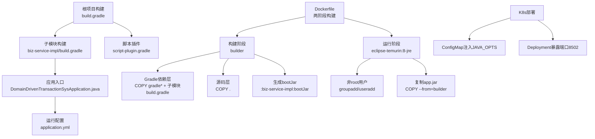
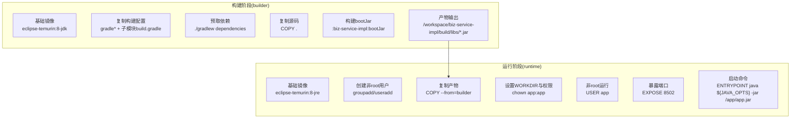
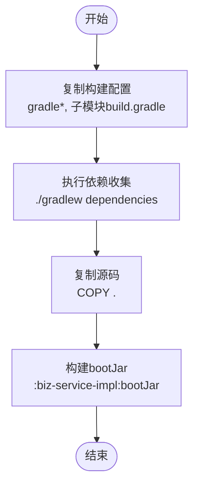
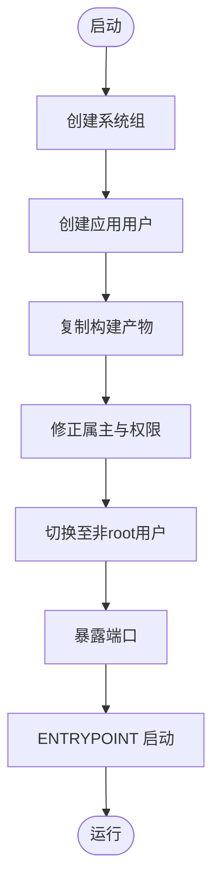
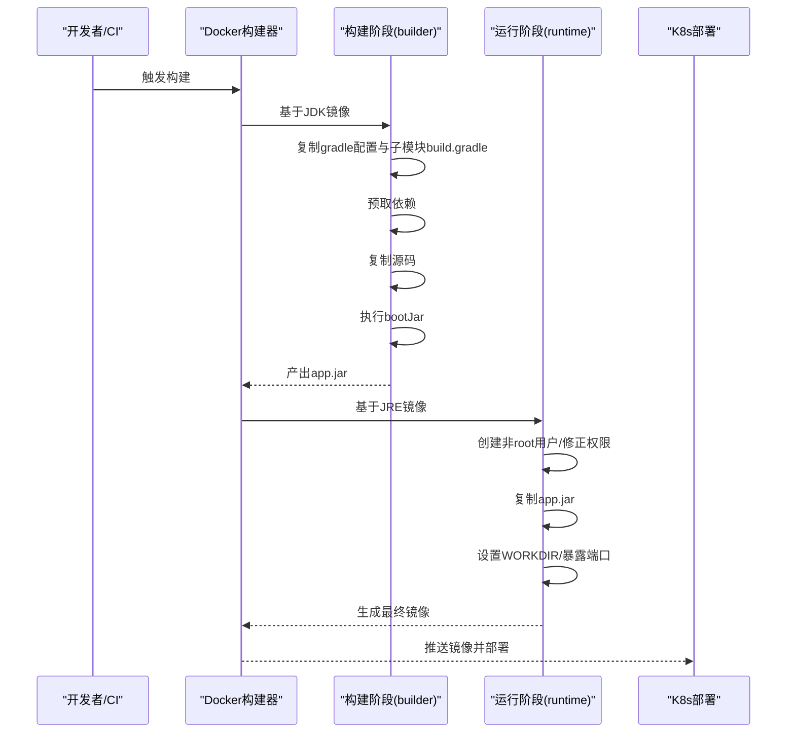
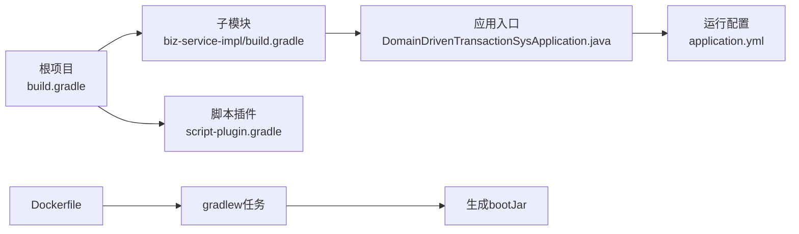

# Docker容器化

<cite>
**本文档引用的文件**
- [deploy/docker/Dockerfile](file://deploy/docker/Dockerfile)
- [build.gradle](file://build.gradle)
- [biz-service-impl/build.gradle](file://biz-service-impl/build.gradle)
- [deploy/k8s/dev/08-app-deployment.yaml](file://deploy/k8s/dev/08-app-deployment.yaml)
- [deploy/k8s/dev/06-app-configmap.yaml](file://deploy/k8s/dev/06-app-configmap.yaml)
- [biz-service-impl/src/main/resources/application.yml](file://biz-service-impl/src/main/resources/application.yml)
- [.github/workflows/gradle.yml](file://.github/workflows/gradle.yml)
- [.gitignore](file://.gitignore)
- [script-plugin.gradle](file://script-plugin.gradle)
- [biz-service-impl/src/main/java/com/magicliang/transaction/sys/DomainDrivenTransactionSysApplication.java](file://biz-service-impl/src/main/java/com/magicliang/transaction/sys/DomainDrivenTransactionSysApplication.java)
</cite>

## 目录
1. [简介](#简介)
2. [项目结构](#项目结构)
3. [核心组件](#核心组件)
4. [架构总览](#架构总览)
5. [详细组件分析](#详细组件分析)
6. [依赖关系分析](#依赖关系分析)
7. [性能考量](#性能考量)
8. [故障排查指南](#故障排查指南)
9. [结论](#结论)
10. [附录](#附录)

## 简介
本文件面向容器化运维与开发团队，系统性阐述本项目的Docker两阶段构建设计与实现原理，重点覆盖：
- 构建阶段的依赖缓存策略（Gradle依赖下载层优化与源码复制分层）
- 运行阶段的轻量化设计（JRE镜像选择、非root用户与安全最佳实践）
- Dockerfile关键指令与配置项（WORKDIR、ENV注入、ENTRYPOINT）
- 容器构建与运行命令示例（含自定义JVM参数传递与端口映射）
- 镜像优化技巧与性能调优建议

## 项目结构
围绕容器化，项目的关键目录与文件如下：
- 构建与镜像：deploy/docker/Dockerfile
- 应用配置：biz-service-impl/src/main/resources/application.yml
- Kubernetes部署：deploy/k8s/dev/08-app-deployment.yaml、deploy/k8s/dev/06-app-configmap.yaml
- Gradle根配置：build.gradle、biz-service-impl/build.gradle、script-plugin.gradle
- CI工作流：.github/workflows/gradle.yml
- 构建产物与忽略规则：.gitignore

**图表来源**
- [deploy/docker/Dockerfile:1-50](file://deploy/docker/Dockerfile#L1-L50)
- [build.gradle:165-284](file://build.gradle#L165-L284)
- [biz-service-impl/build.gradle:1-80](file://biz-service-impl/build.gradle#L1-L80)
- [biz-service-impl/src/main/resources/application.yml:64-65](file://biz-service-impl/src/main/resources/application.yml#L64-L65)
- [deploy/k8s/dev/08-app-deployment.yaml:37-39](file://deploy/k8s/dev/08-app-deployment.yaml#L37-L39)
- [deploy/k8s/dev/06-app-configmap.yaml:21-21](file://deploy/k8s/dev/06-app-configmap.yaml#L21-L21)

**章节来源**
- [deploy/docker/Dockerfile:1-50](file://deploy/docker/Dockerfile#L1-L50)
- [build.gradle:165-284](file://build.gradle#L165-L284)
- [biz-service-impl/build.gradle:1-80](file://biz-service-impl/build.gradle#L1-L80)
- [biz-service-impl/src/main/resources/application.yml:64-65](file://biz-service-impl/src/main/resources/application.yml#L64-L65)
- [deploy/k8s/dev/08-app-deployment.yaml:37-39](file://deploy/k8s/dev/08-app-deployment.yaml#L37-L39)
- [deploy/k8s/dev/06-app-configmap.yaml:21-21](file://deploy/k8s/dev/06-app-configmap.yaml#L21-L21)

## 核心组件
- 两阶段构建镜像
  - 构建阶段（builder）：基于JDK镜像，按层策略复制Gradle配置与子模块构建文件，预取依赖，再复制全量源码并执行bootJar任务，最终产出可运行的jar包。
  - 运行阶段：基于JRE镜像，创建非root应用用户，复制构建产物，设置WORKDIR与非root运行，暴露端口并以ENTRYPOINT启动。
- Gradle构建体系
  - 根项目统一插件与仓库配置；子模块biz-service-impl启用bootJar并声明Web与Actuator等依赖。
  - 构建脚本插件统一Java版本与编码。
- 运行时配置
  - 应用端口在application.yml中定义；K8s通过ConfigMap注入JAVA_OPTS与数据库连接信息。

**章节来源**
- [deploy/docker/Dockerfile:1-50](file://deploy/docker/Dockerfile#L1-L50)
- [build.gradle:165-284](file://build.gradle#L165-L284)
- [biz-service-impl/build.gradle:26-28](file://biz-service-impl/build.gradle#L26-L28)
- [script-plugin.gradle:7-11](file://script-plugin.gradle#L7-L11)
- [biz-service-impl/src/main/resources/application.yml:64-65](file://biz-service-impl/src/main/resources/application.yml#L64-L65)

## 架构总览
两阶段构建将“构建期”与“运行期”职责分离，最大化镜像体积与安全性收益：
- 构建期：保留JDK与Gradle工具链，完成依赖下载与编译打包。
- 运行期：仅包含JRE与应用产物，降低攻击面与镜像体积。

**图表来源**
- [deploy/docker/Dockerfile:4-30](file://deploy/docker/Dockerfile#L4-L30)
- [deploy/docker/Dockerfile:34-49](file://deploy/docker/Dockerfile#L34-L49)

**章节来源**
- [deploy/docker/Dockerfile:1-50](file://deploy/docker/Dockerfile#L1-L50)

## 详细组件分析

### 构建阶段：依赖缓存与分层策略
- 层级划分
  - 配置层：优先复制gradle wrapper、settings、gradle目录与各子模块build.gradle，确保依赖下载层不因源码变更失效。
  - 依赖层：执行依赖收集命令，固化依赖树。
  - 源码层：复制全量源码，避免重复下载依赖。
  - 构建层：执行bootJar任务，生成可运行jar。
- 优势
  - 提升缓存命中率，减少重复下载与编译时间。
  - 将“依赖下载”与“源码变更”解耦，优化增量构建效率。

**图表来源**
- [deploy/docker/Dockerfile:10-29](file://deploy/docker/Dockerfile#L10-L29)

**章节来源**
- [deploy/docker/Dockerfile:8-29](file://deploy/docker/Dockerfile#L8-L29)

### 运行阶段：轻量化与安全
- JRE镜像选择
  - 使用Temurin 8 JRE，满足项目Java 8兼容性要求，同时显著减小运行镜像体积。
- 非root用户与权限
  - 创建系统组与应用用户，复制产物后修正属主，以非root用户运行，降低权限风险。
- 端口与入口
  - 暴露应用端口，通过ENTRYPOINT注入JAVA_OPTS并启动应用。

**图表来源**
- [deploy/docker/Dockerfile:34-49](file://deploy/docker/Dockerfile#L34-L49)

**章节来源**
- [deploy/docker/Dockerfile:34-49](file://deploy/docker/Dockerfile#L34-L49)

### 关键指令与配置项详解
- WORKDIR
  - 构建阶段：/workspace，便于集中管理构建产物。
  - 运行阶段：/app，作为应用工作目录。
- ENV与JAVA_OPTS注入
  - 运行阶段通过ENTRYPOINT读取JAVA_OPTS环境变量，结合K8s ConfigMap注入，实现JVM参数的动态配置。
- ENTRYPOINT
  - 使用shell执行形式，允许在启动时拼接JAVA_OPTS，便于在不同环境传入不同JVM参数。

**章节来源**
- [deploy/docker/Dockerfile:6-6](file://deploy/docker/Dockerfile#L6-L6)
- [deploy/docker/Dockerfile:38-38](file://deploy/docker/Dockerfile#L38-L38)
- [deploy/docker/Dockerfile:48-49](file://deploy/docker/Dockerfile#L48-L49)
- [deploy/k8s/dev/06-app-configmap.yaml:21-21](file://deploy/k8s/dev/06-app-configmap.yaml#L21-L21)

### 构建与运行命令示例
- 构建镜像
  - 使用两阶段Dockerfile构建镜像，镜像标签可自定义。
- 运行容器
  - 通过K8s Deployment暴露端口8502；在ConfigMap中设置JAVA_OPTS以传入JVM参数。
- 端口映射与JVM参数
  - 容器端口与应用端口保持一致；通过环境变量注入JVM内存参数等。

**章节来源**
- [deploy/k8s/dev/08-app-deployment.yaml:37-39](file://deploy/k8s/dev/08-app-deployment.yaml#L37-L39)
- [deploy/k8s/dev/06-app-configmap.yaml:21-21](file://deploy/k8s/dev/06-app-configmap.yaml#L21-L21)
- [biz-service-impl/src/main/resources/application.yml:64-65](file://biz-service-impl/src/main/resources/application.yml#L64-L65)

### 两阶段构建序列图

**图表来源**
- [deploy/docker/Dockerfile:4-49](file://deploy/docker/Dockerfile#L4-L49)
- [deploy/k8s/dev/08-app-deployment.yaml:37-39](file://deploy/k8s/dev/08-app-deployment.yaml#L37-L39)

## 依赖关系分析
- Gradle根配置与子模块
  - 根项目统一插件、仓库与Java工具链；子模块biz-service-impl启用bootJar并声明Web与Actuator依赖。
- 构建脚本插件
  - 统一Java版本与编码，保证跨模块一致性。
- Docker与Gradle
  - Dockerfile在构建阶段直接调用gradlew任务，确保镜像内构建与本地一致。

**图表来源**
- [build.gradle:165-284](file://build.gradle#L165-L284)
- [biz-service-impl/build.gradle:26-28](file://biz-service-impl/build.gradle#L26-L28)
- [script-plugin.gradle:7-11](file://script-plugin.gradle#L7-L11)
- [biz-service-impl/src/main/java/com/magicliang/transaction/sys/DomainDrivenTransactionSysApplication.java:69-73](file://biz-service-impl/src/main/java/com/magicliang/transaction/sys/DomainDrivenTransactionSysApplication.java#L69-L73)
- [biz-service-impl/src/main/resources/application.yml:64-65](file://biz-service-impl/src/main/resources/application.yml#L64-L65)
- [deploy/docker/Dockerfile:23-29](file://deploy/docker/Dockerfile#L23-L29)

**章节来源**
- [build.gradle:165-284](file://build.gradle#L165-L284)
- [biz-service-impl/build.gradle:1-80](file://biz-service-impl/build.gradle#L1-L80)
- [script-plugin.gradle:7-11](file://script-plugin.gradle#L7-L11)
- [deploy/docker/Dockerfile:23-29](file://deploy/docker/Dockerfile#L23-L29)

## 性能考量
- 构建缓存优化
  - 将“复制构建配置”与“复制源码”分层，确保依赖层稳定，提升缓存命中率。
  - 依赖预取阶段仅在配置变化时重建，避免频繁下载。
- 运行镜像瘦身
  - 使用JRE而非JDK，显著降低镜像体积与攻击面。
  - 非root用户运行，减少权限滥用风险。
- JVM参数与资源限制
  - 通过ConfigMap注入JAVA_OPTS，结合K8s资源requests/limits，控制容器内存/CPU占用。
  - 应用端口与容器端口一致，便于健康检查与探针配置。

**章节来源**
- [deploy/docker/Dockerfile:34-49](file://deploy/docker/Dockerfile#L34-L49)
- [deploy/k8s/dev/08-app-deployment.yaml:45-51](file://deploy/k8s/dev/08-app-deployment.yaml#L45-L51)
- [deploy/k8s/dev/06-app-configmap.yaml:21-21](file://deploy/k8s/dev/06-app-configmap.yaml#L21-L21)

## 故障排查指南
- 构建失败（依赖下载/网络问题）
  - 检查gradle仓库配置与网络连通性；确认Docker构建上下文中已复制gradle wrapper与gradle目录。
- 运行失败（权限/端口）
  - 确认非root用户与属主修正步骤已执行；核对容器端口与应用端口一致。
- JVM参数未生效
  - 检查K8s ConfigMap是否正确注入JAVA_OPTS；确认ENTRYPOINT读取了该变量。
- 健康检查失败
  - 核对K8s探针路径与端口；确认应用Actuator健康端点可用。

**章节来源**
- [deploy/docker/Dockerfile:36-49](file://deploy/docker/Dockerfile#L36-L49)
- [deploy/k8s/dev/08-app-deployment.yaml:52-71](file://deploy/k8s/dev/08-app-deployment.yaml#L52-L71)
- [deploy/k8s/dev/06-app-configmap.yaml:21-21](file://deploy/k8s/dev/06-app-configmap.yaml#L21-L21)

## 结论
本项目的Docker容器化采用标准的两阶段构建：构建期专注依赖与编译，运行期专注轻量化与安全。通过分层复制与依赖预取，显著提升构建缓存命中率；通过JRE镜像与非root运行，降低镜像体积与安全风险；配合K8s ConfigMap注入JAVA_OPTS，实现JVM参数的灵活配置。整体方案兼顾性能、安全与可维护性。

## 附录
- CI/CD与构建上下文
  - CI工作流使用JDK 11执行Gradle构建；构建上下文遵循.gitignore规则，避免无关文件进入镜像。
- 应用端口与配置
  - 应用端口在application.yml中定义；K8s部署暴露相同端口，便于外部访问与健康检查。

**章节来源**
- [.github/workflows/gradle.yml:23-27](file://.github/workflows/gradle.yml#L23-L27)
- [.gitignore:49-52](file://.gitignore#L49-L52)
- [biz-service-impl/src/main/resources/application.yml:64-65](file://biz-service-impl/src/main/resources/application.yml#L64-L65)
- [deploy/k8s/dev/08-app-deployment.yaml:37-39](file://deploy/k8s/dev/08-app-deployment.yaml#L37-L39)