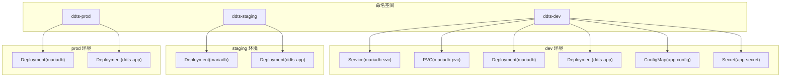
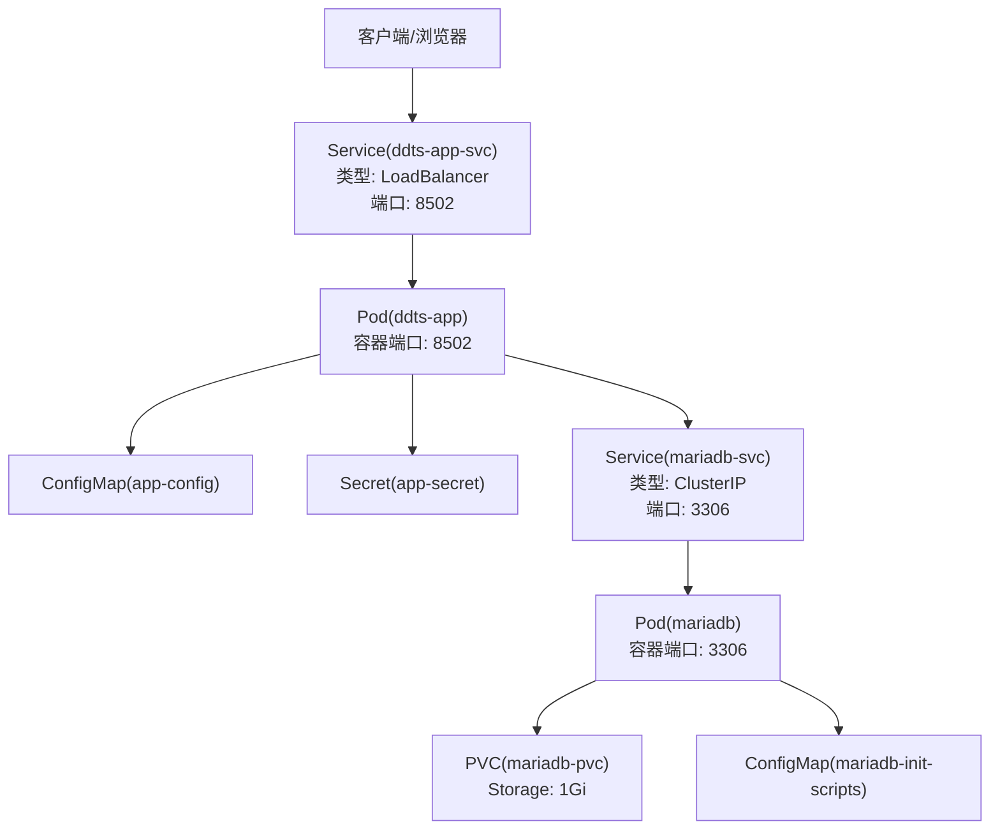
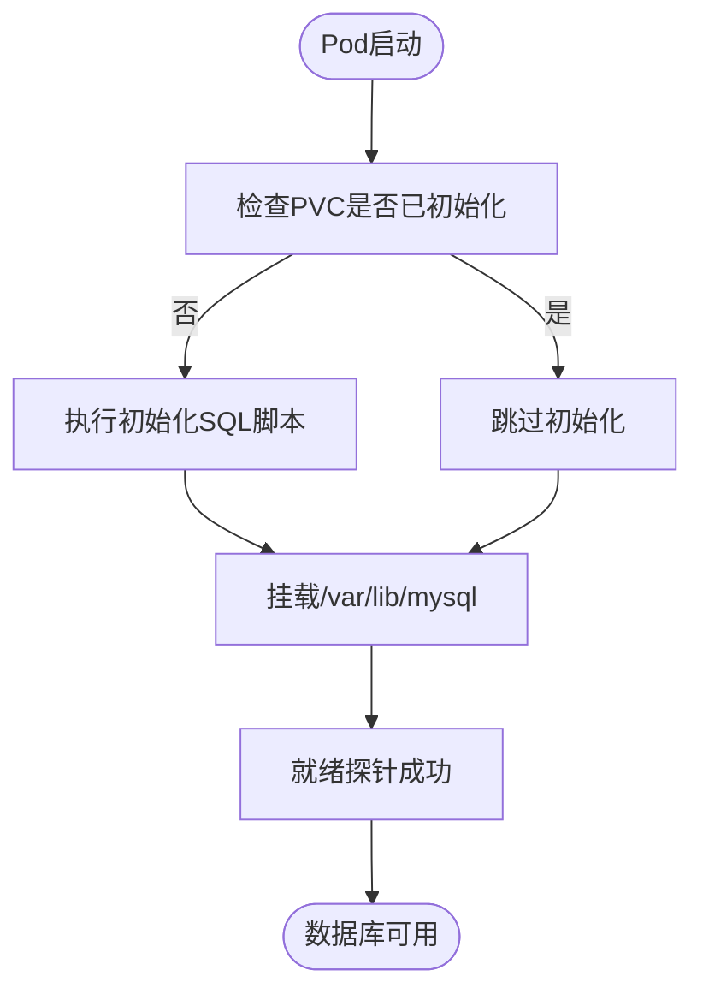
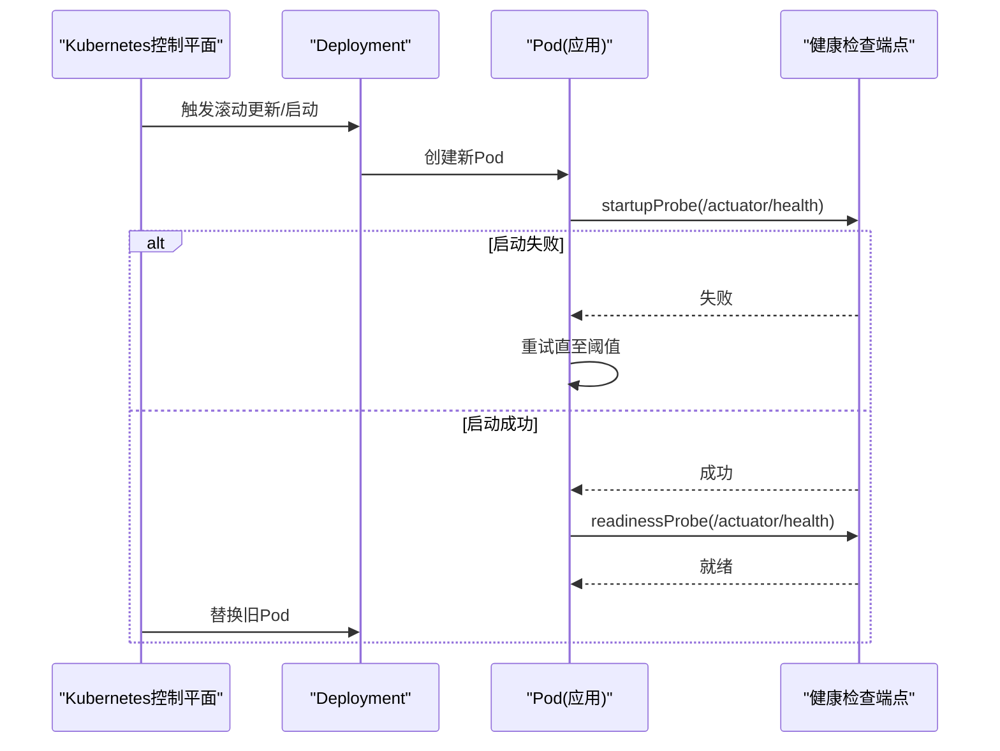
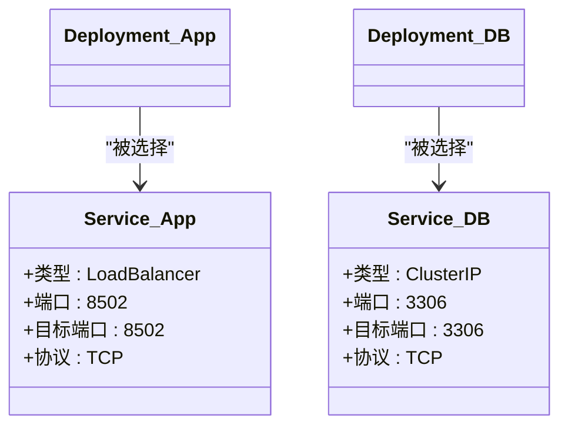
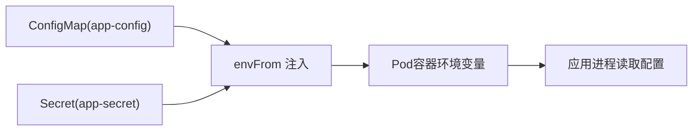
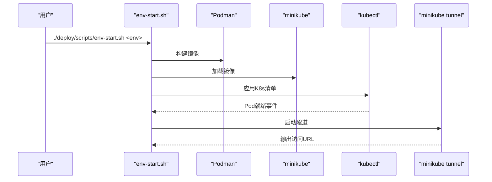
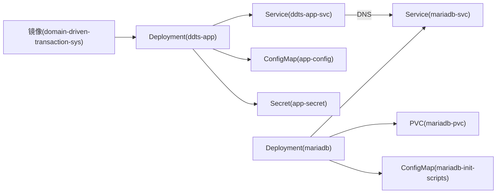

# Kubernetes部署

<cite>
**本文引用的文件**
- [README.md](file://README.md)
- [Dockerfile](file://deploy/docker/Dockerfile)
- [env-init.sh](file://deploy/scripts/env-init.sh)
- [env-start.sh](file://deploy/scripts/env-start.sh)
- [00-namespace.yaml（dev）](file://deploy/k8s/dev/00-namespace.yaml)
- [01-mariadb-secret.yaml（dev）](file://deploy/k8s/dev/01-mariadb-secret.yaml)
- [02-mariadb-init-configmap.yaml（dev）](file://deploy/k8s/dev/02-mariadb-init-configmap.yaml)
- [03-mariadb-pvc.yaml（dev）](file://deploy/k8s/dev/03-mariadb-pvc.yaml)
- [04-mariadb-deployment.yaml（dev）](file://deploy/k8s/dev/04-mariadb-deployment.yaml)
- [05-mariadb-service.yaml（dev）](file://deploy/k8s/dev/05-mariadb-service.yaml)
- [06-app-configmap.yaml（dev）](file://deploy/k8s/dev/06-app-configmap.yaml)
- [07-app-secret.yaml（dev）](file://deploy/k8s/dev/07-app-secret.yaml)
- [08-app-deployment.yaml（dev）](file://deploy/k8s/dev/08-app-deployment.yaml)
- [09-app-service.yaml（dev）](file://deploy/k8s/dev/09-app-service.yaml)
- [00-namespace.yaml（staging）](file://deploy/k8s/staging/00-namespace.yaml)
- [00-namespace.yaml（prod）](file://deploy/k8s/prod/00-namespace.yaml)
</cite>

## 目录
1. [引言](#引言)
2. [项目结构](#项目结构)
3. [核心组件](#核心组件)
4. [架构总览](#架构总览)
5. [详细组件分析](#详细组件分析)
6. [依赖分析](#依赖分析)
7. [性能考虑](#性能考虑)
8. [故障排查指南](#故障排查指南)
9. [结论](#结论)
10. [附录](#附录)

## 引言
本文件面向希望在Kubernetes集群中部署与运维“领域驱动交易系统”的工程团队，提供一套完整的多环境部署策略与资源配置说明。内容涵盖命名空间设计与资源隔离、Deployment与Service配置、健康检查与滚动更新策略、ConfigMap与Secret的配置管理、kubectl命令与自动化脚本，以及Helm使用的前置建议与最佳实践。

## 项目结构
该项目提供三套独立的Kubernetes环境（dev/staging/prod），每套环境包含：
- 命名空间（Namespace）：用于资源隔离与标签化治理
- MariaDB数据库：包含Secret、ConfigMap、PVC、Deployment、Service
- 应用服务：包含ConfigMap、Secret、Deployment、Service
- 自动化脚本：一键初始化工具链、一键启动/销毁/查看环境

图表来源
- [00-namespace.yaml（dev）:1-8](file://deploy/k8s/dev/00-namespace.yaml#L1-L8)
- [00-namespace.yaml（staging）:1-8](file://deploy/k8s/staging/00-namespace.yaml#L1-L8)
- [00-namespace.yaml（prod）:1-8](file://deploy/k8s/prod/00-namespace.yaml#L1-L8)
- [04-mariadb-deployment.yaml（dev）:1-74](file://deploy/k8s/dev/04-mariadb-deployment.yaml#L1-L74)
- [05-mariadb-service.yaml（dev）:1-18](file://deploy/k8s/dev/05-mariadb-service.yaml#L1-L18)
- [03-mariadb-pvc.yaml（dev）:1-16](file://deploy/k8s/dev/03-mariadb-pvc.yaml#L1-L16)
- [08-app-deployment.yaml（dev）:1-72](file://deploy/k8s/dev/08-app-deployment.yaml#L1-L72)
- [09-app-service.yaml（dev）:1-18](file://deploy/k8s/dev/09-app-service.yaml#L1-L18)
- [06-app-configmap.yaml（dev）:1-22](file://deploy/k8s/dev/06-app-configmap.yaml#L1-L22)
- [07-app-secret.yaml（dev）:1-14](file://deploy/k8s/dev/07-app-secret.yaml#L1-L14)

章节来源
- [README.md: 部署架构概览与目录结构:216-270](file://README.md#L216-L270)

## 核心组件
- 命名空间：dev/staging/prod三套独立命名空间，确保资源隔离与权限边界清晰
- MariaDB：使用Deployment+PVC+Service，内置初始化SQL与健康检查
- 应用服务：使用Deployment+Service，通过ConfigMap/Secret注入环境变量与敏感信息
- 自动化脚本：env-init.sh安装工具链并启动minikube；env-start.sh一键构建镜像、加载到minikube、部署清单、等待就绪并开启LoadBalancer隧道

章节来源
- [00-namespace.yaml（dev）:1-8](file://deploy/k8s/dev/00-namespace.yaml#L1-L8)
- [04-mariadb-deployment.yaml（dev）:1-74](file://deploy/k8s/dev/04-mariadb-deployment.yaml#L1-L74)
- [05-mariadb-service.yaml（dev）:1-18](file://deploy/k8s/dev/05-mariadb-service.yaml#L1-L18)
- [03-mariadb-pvc.yaml（dev）:1-16](file://deploy/k8s/dev/03-mariadb-pvc.yaml#L1-L16)
- [08-app-deployment.yaml（dev）:1-72](file://deploy/k8s/dev/08-app-deployment.yaml#L1-L72)
- [09-app-service.yaml（dev）:1-18](file://deploy/k8s/dev/09-app-service.yaml#L1-L18)
- [06-app-configmap.yaml（dev）:1-22](file://deploy/k8s/dev/06-app-configmap.yaml#L1-L22)
- [07-app-secret.yaml（dev）:1-14](file://deploy/k8s/dev/07-app-secret.yaml#L1-L14)
- [env-init.sh:1-333](file://deploy/scripts/env-init.sh#L1-L333)
- [env-start.sh:1-284](file://deploy/scripts/env-start.sh#L1-L284)

## 架构总览
下图展示dev环境的典型部署拓扑：应用通过LoadBalancer暴露HTTP端口，MariaDB通过ClusterIP在集群内提供数据库服务，二者均位于独立命名空间中，应用通过Service域名访问数据库。

图表来源
- [09-app-service.yaml（dev）:1-18](file://deploy/k8s/dev/09-app-service.yaml#L1-L18)
- [08-app-deployment.yaml（dev）:1-72](file://deploy/k8s/dev/08-app-deployment.yaml#L1-L72)
- [05-mariadb-service.yaml（dev）:1-18](file://deploy/k8s/dev/05-mariadb-service.yaml#L1-L18)
- [04-mariadb-deployment.yaml（dev）:1-74](file://deploy/k8s/dev/04-mariadb-deployment.yaml#L1-L74)
- [03-mariadb-pvc.yaml（dev）:1-16](file://deploy/k8s/dev/03-mariadb-pvc.yaml#L1-L16)
- [02-mariadb-init-configmap.yaml（dev）:1-224](file://deploy/k8s/dev/02-mariadb-init-configmap.yaml#L1-L224)
- [06-app-configmap.yaml（dev）:1-22](file://deploy/k8s/dev/06-app-configmap.yaml#L1-L22)
- [07-app-secret.yaml（dev）:1-14](file://deploy/k8s/dev/07-app-secret.yaml#L1-L14)

## 详细组件分析

### 命名空间设计与资源隔离
- 设计原则
  - 每个环境一个命名空间，统一标签（如environment、part-of）便于治理与审计
  - 应用与数据库在同一命名空间内，降低跨命名空间访问复杂度
- 资源隔离策略
  - 通过命名空间划分不同租户或环境的资源边界
  - 结合RBAC与网络策略进一步限制访问范围（建议）

章节来源
- [00-namespace.yaml（dev）:1-8](file://deploy/k8s/dev/00-namespace.yaml#L1-L8)
- [00-namespace.yaml（staging）:1-8](file://deploy/k8s/staging/00-namespace.yaml#L1-L8)
- [00-namespace.yaml（prod）:1-8](file://deploy/k8s/prod/00-namespace.yaml#L1-L8)

### MariaDB数据库配置
- 资源与持久化
  - Deployment使用Recreate策略，确保单实例数据库一致性
  - PVC 1Gi（dev）、5Gi（staging）、20Gi（prod），满足不同容量需求
- 初始化与Schema
  - 通过ConfigMap挂载初始化SQL，首次启动自动执行
  - 包含主库与从库双数据库的表结构与索引
- 网络与健康检查
  - Service类型为ClusterIP，端口3306
  - 提供就绪探针与存活探针，保障应用侧连接稳定性

图表来源
- [02-mariadb-init-configmap.yaml（dev）:1-224](file://deploy/k8s/dev/02-mariadb-init-configmap.yaml#L1-L224)
- [03-mariadb-pvc.yaml（dev）:1-16](file://deploy/k8s/dev/03-mariadb-pvc.yaml#L1-L16)
- [04-mariadb-deployment.yaml（dev）:1-74](file://deploy/k8s/dev/04-mariadb-deployment.yaml#L1-L74)
- [05-mariadb-service.yaml（dev）:1-18](file://deploy/k8s/dev/05-mariadb-service.yaml#L1-L18)

章节来源
- [04-mariadb-deployment.yaml（dev）:1-74](file://deploy/k8s/dev/04-mariadb-deployment.yaml#L1-L74)
- [05-mariadb-service.yaml（dev）:1-18](file://deploy/k8s/dev/05-mariadb-service.yaml#L1-L18)
- [03-mariadb-pvc.yaml（dev）:1-16](file://deploy/k8s/dev/03-mariadb-pvc.yaml#L1-L16)
- [02-mariadb-init-configmap.yaml（dev）:1-224](file://deploy/k8s/dev/02-mariadb-init-configmap.yaml#L1-L224)

### 应用Deployment配置
- 副本数与滚动更新
  - dev: 1副本；staging: 1副本；prod: 2副本
  - 建议在生产环境使用滚动更新策略，结合探针与资源限制保障平滑升级
- 健康检查
  - startupProbe：/actuator/health，失败阈值较高，适配应用冷启动
  - readinessProbe：/actuator/health，快速暴露就绪状态
  - livenessProbe：/actuator/health，定期探测存活
- 资源配额
  - dev: requests 512Mi/250m，limits 768Mi/1000m
  - staging/prod按容量递增，建议与JVM最大堆内存保持安全余量

图表来源
- [08-app-deployment.yaml（dev）:52-71](file://deploy/k8s/dev/08-app-deployment.yaml#L52-L71)

章节来源
- [08-app-deployment.yaml（dev）:1-72](file://deploy/k8s/dev/08-app-deployment.yaml#L1-L72)
- [README.md: 三套环境参数差异:322-332](file://README.md#L322-L332)

### Service配置与网络策略
- 类型选择
  - 应用Service：LoadBalancer，便于本地minikube隧道访问
  - 数据库Service：ClusterIP，仅集群内访问
- 端口与协议
  - 应用：port 8502，targetPort 8502，TCP
  - MariaDB：port 3306，targetPort 3306，TCP
- 访问路径
  - 应用通过Service域名与端口访问，健康检查路径为/actuator/health

图表来源
- [09-app-service.yaml（dev）:1-18](file://deploy/k8s/dev/09-app-service.yaml#L1-L18)
- [05-mariadb-service.yaml（dev）:1-18](file://deploy/k8s/dev/05-mariadb-service.yaml#L1-L18)
- [08-app-deployment.yaml（dev）:1-72](file://deploy/k8s/dev/08-app-deployment.yaml#L1-L72)
- [04-mariadb-deployment.yaml（dev）:1-74](file://deploy/k8s/dev/04-mariadb-deployment.yaml#L1-L74)

章节来源
- [09-app-service.yaml（dev）:1-18](file://deploy/k8s/dev/09-app-service.yaml#L1-L18)
- [05-mariadb-service.yaml（dev）:1-18](file://deploy/k8s/dev/05-mariadb-service.yaml#L1-L18)

### ConfigMap与Secret配置管理
- 注入方式
  - 应用通过envFrom同时引用ConfigMap与Secret，实现非敏感配置与敏感信息分离
- 关键配置项
  - SPRING_PROFILES_ACTIVE：dev/staging/prod对应不同profile
  - 数据库连接：主库/从库URL、用户名、密码
  - JVM参数：JAVA_OPTS（如-Xms、-Xmx）
  - 日志配置：LOGGING_CONFIG（offline或online）
- 安全建议
  - 敏感信息统一放入Secret，避免明文写入ConfigMap
  - Secret与ConfigMap分别命名，最小权限注入

图表来源
- [06-app-configmap.yaml（dev）:1-22](file://deploy/k8s/dev/06-app-configmap.yaml#L1-L22)
- [07-app-secret.yaml（dev）:1-14](file://deploy/k8s/dev/07-app-secret.yaml#L1-L14)
- [08-app-deployment.yaml（dev）:40-44](file://deploy/k8s/dev/08-app-deployment.yaml#L40-L44)

章节来源
- [06-app-configmap.yaml（dev）:1-22](file://deploy/k8s/dev/06-app-configmap.yaml#L1-L22)
- [07-app-secret.yaml（dev）:1-14](file://deploy/k8s/dev/07-app-secret.yaml#L1-L14)
- [08-app-deployment.yaml（dev）:40-44](file://deploy/k8s/dev/08-app-deployment.yaml#L40-L44)
- [README.md: 环境变量覆盖机制与优先级:361-384](file://README.md#L361-L384)

### 镜像构建与运行时
- 两阶段构建
  - 构建阶段：JDK 8编译bootJar，利用Gradle缓存优化
  - 运行阶段：JRE 8镜像，非root用户运行，暴露端口8502
- 启动参数
  - 通过JAVA_OPTS注入JVM参数，建议与资源限制匹配

章节来源
- [Dockerfile:1-50](file://deploy/docker/Dockerfile#L1-L50)
- [README.md: Dockerfile说明:334-346](file://README.md#L334-L346)

### 自动化部署脚本
- env-init.sh
  - 自动检测OS与包管理器，安装JDK 8、Podman、kubectl、minikube
  - 启动minikube（podman驱动），内存与CPU可配置
- env-start.sh
  - 构建镜像并加载到minikube
  - 应用K8s清单，等待MariaDB与应用Pod就绪
  - 启动minikube tunnel，输出访问URL与常用kubectl命令

图表来源
- [env-start.sh:103-211](file://deploy/scripts/env-start.sh#L103-L211)
- [env-init.sh:287-296](file://deploy/scripts/env-init.sh#L287-L296)

章节来源
- [env-init.sh:1-333](file://deploy/scripts/env-init.sh#L1-L333)
- [env-start.sh:1-284](file://deploy/scripts/env-start.sh#L1-L284)

## 依赖分析
- 组件耦合
  - 应用依赖MariaDB Service域名与端口进行连接
  - 应用通过ConfigMap/Secret注入运行时配置
  - MariaDB依赖PVC持久化存储与初始化脚本
- 外部依赖
  - minikube集群（本地开发）
  - Podman（镜像构建与集群运行）
  - kubectl（资源管理）

图表来源
- [08-app-deployment.yaml（dev）:1-72](file://deploy/k8s/dev/08-app-deployment.yaml#L1-L72)
- [09-app-service.yaml（dev）:1-18](file://deploy/k8s/dev/09-app-service.yaml#L1-L18)
- [06-app-configmap.yaml（dev）:1-22](file://deploy/k8s/dev/06-app-configmap.yaml#L1-L22)
- [07-app-secret.yaml（dev）:1-14](file://deploy/k8s/dev/07-app-secret.yaml#L1-L14)
- [04-mariadb-deployment.yaml（dev）:1-74](file://deploy/k8s/dev/04-mariadb-deployment.yaml#L1-L74)
- [05-mariadb-service.yaml（dev）:1-18](file://deploy/k8s/dev/05-mariadb-service.yaml#L1-L18)
- [03-mariadb-pvc.yaml（dev）:1-16](file://deploy/k8s/dev/03-mariadb-pvc.yaml#L1-L16)
- [02-mariadb-init-configmap.yaml（dev）:1-224](file://deploy/k8s/dev/02-mariadb-init-configmap.yaml#L1-L224)

## 性能考虑
- 资源配额与JVM堆
  - 建议JVM最大堆不超过容器内存limit的70%，避免OOMKilled
  - 生产环境适当提高requests/limits与副本数，增强吞吐与可用性
- 探针参数
  - startupProbe周期与阈值应匹配应用冷启动时间
  - readinessProbe应快速返回，缩短流量切换时间
- 存储与I/O
  - PVC容量随环境增长，生产环境建议更高IOPS与可靠性配置
- 网络
  - 应用Service使用LoadBalancer便于本地调试；生产建议使用Ingress与更细粒度的网络策略

## 故障排查指南
- 环境初始化
  - 若minikube未运行，先执行env-init.sh完成工具链安装与集群启动
- 镜像加载
  - 确认镜像已通过podman build并加载到minikube
- Pod就绪
  - 使用kubectl get pods查看状态；若未就绪，检查探针路径与端口
- 数据库初始化
  - 首次启动会执行初始化SQL；若失败，检查PVC与ConfigMap内容
- 访问应用
  - 本地可通过minikube tunnel或port-forward访问；查看Service外部IP或使用minikube service命令

章节来源
- [env-start.sh:131-211](file://deploy/scripts/env-start.sh#L131-L211)
- [README.md: 常用kubectl命令:528-545](file://README.md#L528-L545)

## 结论
本项目提供了标准化的Kubernetes多环境部署模板，通过命名空间隔离、ConfigMap/Secret注入、健康检查与资源配额，实现了可复用、可演进的交付体系。结合自动化脚本，团队可以快速搭建与维护dev/staging/prod三套环境，并为后续引入Helm Chart与CI/CD流水线奠定基础。

## 附录

### 多环境部署流程与kubectl命令示例
- 初始化工具链与集群
  - ./deploy/scripts/env-init.sh
- 启动指定环境
  - ./deploy/scripts/env-start.sh dev
  - ./deploy/scripts/env-start.sh staging
  - ./deploy/scripts/env-start.sh prod
- 查看状态
  - ./deploy/scripts/env-start.sh dev --status
- 销毁环境
  - ./deploy/scripts/env-start.sh dev --destroy
- 常用kubectl命令
  - kubectl get pods -n ddts-<env>
  - kubectl logs -n ddts-<env> -l app=ddts-app -f
  - kubectl get svc -n ddts-<env>
  - kubectl get pvc -n ddts-<env>
  - kubectl port-forward -n ddts-<env> svc/ddts-app-svc 8502:8502

章节来源
- [env-init.sh:287-330](file://deploy/scripts/env-init.sh#L287-L330)
- [env-start.sh:131-211](file://deploy/scripts/env-start.sh#L131-L211)
- [README.md: 常用kubectl命令:528-545](file://README.md#L528-L545)

### Helm使用建议（前置与最佳实践）
- Chart结构建议
  - 将命名空间、Service、Deployment、ConfigMap、Secret、PVC抽象为可配置模板
  - 通过values.yaml区分dev/staging/prod的副本数、资源配额、JVM参数与存储容量
- 安全与合规
  - 敏感参数通过Secret管理，避免硬编码
  - 使用Helm钩子进行数据库初始化（谨慎使用，确保幂等）
- 版本与回滚
  - 使用helm upgrade进行滚动更新，结合--atomic与--timeout保障一致性
  - 使用helm rollback进行快速回滚

说明：本节为概念性指导，不直接对应现有代码文件，故不附加图表来源与章节来源